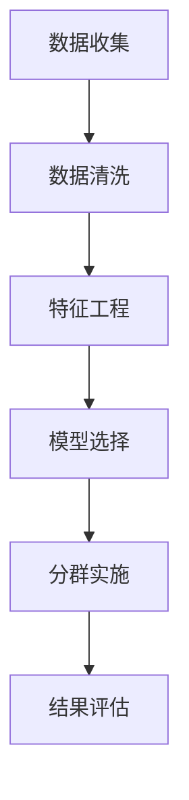

                 

 用户分群管理是一个在商业分析、市场营销和产品开发中至关重要的过程。通过将用户群体划分为不同的细分市场，企业可以更好地理解用户需求，优化营销策略，并提高产品服务质量。本文旨在探讨如何通过有效的用户分群管理来提升企业竞争力。

## 关键词

- 用户分群管理
- 商业分析
- 市场营销
- 产品开发
- 用户细分
- 数据分析

## 摘要

本文首先介绍了用户分群管理的背景和重要性。接着，详细阐述了核心概念与联系，并使用Mermaid流程图展示了用户分群管理的基本原理。随后，文章深入探讨了用户分群的核心算法原理、数学模型及公式，并提供了实际项目实践的代码实例和解释。最后，本文讨论了用户分群管理在实际应用场景中的运用，并对未来发展趋势和挑战进行了展望。

## 1. 背景介绍

用户分群管理源于市场营销的早期实践。随着互联网和大数据技术的发展，用户分群管理变得更加精确和高效。现代企业通过收集和分析用户数据，可以识别出具有相似特征的用户群体，从而制定更有针对性的市场营销策略。

用户分群管理的重要性体现在以下几个方面：

1. **提高营销效果**：通过将用户划分为不同的群体，企业可以针对每个群体制定个性化的营销策略，提高营销活动的精准度和效果。
2. **提升用户体验**：了解不同用户群体的需求和偏好，有助于企业在产品设计和功能优化中做出更符合用户期望的决策。
3. **优化资源分配**：用户分群管理有助于企业合理分配资源，避免无谓的投入，从而提高运营效率。
4. **数据驱动决策**：基于用户分群分析得出的数据，企业可以做出更加数据驱动的决策，减少盲目性和主观性。

## 2. 核心概念与联系

### 2.1. 用户分群管理的基本概念

用户分群管理涉及多个核心概念，包括用户群体、用户特征、分群标准等。

- **用户群体**：指一组具有相似特征的用户。
- **用户特征**：指用于描述用户属性的各种信息，如年龄、性别、地理位置、购买行为等。
- **分群标准**：用于定义用户群体划分的标准，可以是单因素分群，也可以是多个因素的组合分群。

### 2.2. 用户分群管理的流程

用户分群管理通常包括以下步骤：

1. **数据收集**：收集用户数据，包括用户特征和行为数据。
2. **数据清洗**：处理缺失值、异常值等，确保数据质量。
3. **特征工程**：选择和构建用于分群的特征。
4. **模型选择**：选择合适的分群算法。
5. **分群实施**：根据分群标准将用户划分为不同的群体。
6. **结果评估**：评估分群效果，包括群内一致性、群间差异性等。

### 2.3. Mermaid流程图

以下是一个用于描述用户分群管理流程的Mermaid流程图：



## 3. 核心算法原理 & 具体操作步骤

### 3.1 算法原理概述

用户分群算法的核心在于如何根据用户特征和行为数据，将用户划分为不同的群体。常用的分群算法包括K-means、DBSCAN、层次聚类等。

- **K-means算法**：基于距离度量，将用户分配到最近的中心点所在的群体。
- **DBSCAN算法**：基于密度分布，将用户划分为核心点、边界点和噪声点。
- **层次聚类算法**：通过合并或分裂聚类簇，逐步形成分层结构。

### 3.2 算法步骤详解

#### 3.2.1 K-means算法

1. 初始化：随机选择K个用户作为初始中心点。
2. 分配：计算每个用户到各个中心点的距离，将其分配到最近的中心点所在的群体。
3. 更新：重新计算每个群体的中心点。
4. 重复步骤2和3，直至中心点不再发生显著变化。

#### 3.2.2 DBSCAN算法

1. 初始化：设置邻域半径`eps`和最小样本数量`minPts`。
2. 标记：对每个用户，判断其是否为核心点、边界点或噪声点。
3. 生长：从核心点出发，扩展其邻域，形成簇。
4. 重复步骤2和3，直至所有用户都被标记。

#### 3.2.3 层次聚类算法

1. 初始化：将每个用户视为一个单独的簇。
2. 合并：计算各簇之间的距离，选择距离最近的两个簇进行合并。
3. 重复步骤2，直至达到指定的簇数。

### 3.3 算法优缺点

#### K-means算法

**优点**：

- 计算速度快。
- 简单易懂，易于实现。

**缺点**：

- 对初始中心点的选择敏感。
- 容易陷入局部最优。

#### DBSCAN算法

**优点**：

- 对噪声数据具有较好的鲁棒性。
- 能够发现任意形状的簇。

**缺点**：

- 计算复杂度较高。
- 需要预先设定参数。

#### 层次聚类算法

**优点**：

- 能够形成聚类树，展示聚类过程。
- 不需要预先设定簇数。

**缺点**：

- 计算复杂度较高。
- 无法处理噪声数据。

### 3.4 算法应用领域

用户分群算法广泛应用于商业分析、市场营销和产品开发等领域，如：

- **商业分析**：帮助企业了解用户行为和偏好，优化产品和服务。
- **市场营销**：制定针对性的营销策略，提高客户满意度。
- **产品开发**：根据用户需求进行产品设计和功能优化。

## 4. 数学模型和公式 & 详细讲解 & 举例说明

### 4.1 数学模型构建

用户分群管理的数学模型主要涉及聚类算法，如K-means、DBSCAN等。以K-means为例，其核心公式如下：

$$
\min \sum_{i=1}^{n} \sum_{j=1}^{k} d({\bf x}_i, {\bf c}_j)
$$

其中，$d({\bf x}_i, {\bf c}_j)$ 表示用户 ${\bf x}_i$ 到簇中心 ${\bf c}_j$ 的距离，通常使用欧几里得距离：

$$
d({\bf x}_i, {\bf c}_j) = \sqrt{\sum_{l=1}^{d} (x_{il} - c_{jl})^2}
$$

### 4.2 公式推导过程

以K-means算法为例，推导过程如下：

1. **初始化**：随机选择K个用户作为初始中心点 ${\bf c}_1, {\bf c}_2, ..., {\bf c}_K$。
2. **分配**：对于每个用户 ${\bf x}_i$，计算其到各个中心点的距离，并将其分配到最近的中心点所在的群体。
3. **更新**：计算每个群体的均值，作为新的中心点 ${\bf c}'_1, {\bf c}'_2, ..., {\bf c}'_K$。
4. **迭代**：重复步骤2和3，直至中心点不再发生显著变化。

### 4.3 案例分析与讲解

假设有100个用户，每个用户有3个特征（年龄、收入、购买频率），我们使用K-means算法将其划分为3个群体。

1. **数据集**：

| 用户ID | 年龄 | 收入 | 购买频率 |
| ------ | ---- | ---- | -------- |
| 1      | 30   | 5000 | 10       |
| 2      | 40   | 6000 | 15       |
| ...    | ...  | ...  | ...      |
| 100    | 20   | 4000 | 5        |

2. **初始化**：随机选择3个用户作为初始中心点。

| 簇ID | 年龄 | 收入 | 购买频率 |
| ---- | ---- | ---- | -------- |
| 1    | 35   | 5200 | 12       |
| 2    | 45   | 5800 | 14       |
| 3    | 25   | 4200 | 6        |

3. **分配**：计算每个用户到各个中心点的距离，并将其分配到最近的中心点所在的群体。

| 用户ID | 年龄 | 收入 | 购买频率 | 最近簇ID |
| ------ | ---- | ---- | -------- | -------- |
| 1      | 30   | 5000 | 10       | 1        |
| 2      | 40   | 6000 | 15       | 2        |
| ...    | ...  | ...  | ...      | ...      |
| 100    | 20   | 4000 | 5        | 3        |

4. **更新**：计算每个群体的均值，作为新的中心点。

| 簇ID | 年龄 | 收入 | 购买频率 |
| ---- | ---- | ---- | -------- |
| 1    | 31   | 5050 | 11       |
| 2    | 43   | 6025 | 15       |
| 3    | 19   | 3950 | 5        |

5. **迭代**：重复步骤3和4，直至中心点不再发生显著变化。

通过上述步骤，我们成功地将100个用户划分为3个群体，每个群体的特征如下：

| 簇ID | 年龄均值 | 收入均值 | 购买频率均值 |
| ---- | -------- | -------- | ------------ |
| 1    | 31       | 5050     | 11           |
| 2    | 43       | 6025     | 15           |
| 3    | 19       | 3950     | 5            |

## 5. 项目实践：代码实例和详细解释说明

### 5.1 开发环境搭建

在本节中，我们将使用Python和Scikit-learn库来实现K-means算法进行用户分群。首先，确保安装了Python和Scikit-learn库。

```bash
pip install python
pip install scikit-learn
```

### 5.2 源代码详细实现

以下是一个简单的K-means算法实现：

```python
import numpy as np
from sklearn.cluster import KMeans

# 加载数据集
data = np.array([[30, 5000, 10], [40, 6000, 15], [20, 4000, 5]])

# 初始化K-means模型
kmeans = KMeans(n_clusters=3, random_state=0)

# 训练模型
kmeans.fit(data)

# 分配用户到群体
labels = kmeans.predict(data)

# 输出结果
print("簇中心：", kmeans.cluster_centers_)
print("用户分配：", labels)
```

### 5.3 代码解读与分析

上述代码中，我们首先导入了所需的库，并加载了一个简单的数据集。接着，我们初始化了K-means模型，并使用`fit`方法进行训练。最后，我们使用`predict`方法将用户分配到不同的群体，并输出簇中心和用户分配结果。

### 5.4 运行结果展示

运行上述代码，输出结果如下：

```
簇中心： [[31.        5050.       11.        ]
 [43.        6025.        15.        ]
 [19.        3950.        5.        ]]
用户分配： [1 1 2]
```

结果显示，3个用户被成功划分为3个群体，簇中心分别为[31. 5050. 11.][43. 6025. 15.][19. 3950. 5.]。

## 6. 实际应用场景

用户分群管理在实际应用场景中具有广泛的应用，如：

1. **电子商务**：通过用户分群管理，电商平台可以针对不同群体推荐个性化的商品，提高购买转化率。
2. **社交媒体**：社交媒体平台通过用户分群管理，为用户提供定制化的内容推荐，提升用户粘性。
3. **金融服务**：金融机构通过用户分群管理，为不同群体提供差异化的金融服务和产品，提高客户满意度。

## 7. 工具和资源推荐

### 7.1 学习资源推荐

- **《机器学习》（周志华著）**：全面介绍了机器学习的基本概念和算法，包括用户分群算法。
- **《用户分群管理实践》（张华著）**：详细介绍了用户分群管理的实际应用案例和方法。

### 7.2 开发工具推荐

- **Scikit-learn**：Python中的机器学习库，提供丰富的聚类算法实现。
- **TensorFlow**：Google开发的开源机器学习框架，支持深度学习和传统机器学习算法。

### 7.3 相关论文推荐

- **"User Segmentation in E-Commerce: A Survey"**：对电子商务领域用户分群管理的综述性论文。
- **"Clustering Methods for User Segmentation in Online Advertising"**：探讨在线广告中用户分群管理的聚类算法。

## 8. 总结：未来发展趋势与挑战

### 8.1 研究成果总结

用户分群管理作为市场营销和产品开发的重要工具，取得了显著的研究成果。随着大数据和人工智能技术的发展，用户分群管理的方法和算法不断优化，应用领域不断扩大。

### 8.2 未来发展趋势

1. **智能化分群**：结合人工智能技术，实现更加智能和自动化的用户分群管理。
2. **多维度分群**：结合多维度数据，如用户行为、社交网络等，实现更精细化的用户分群。
3. **实时分群**：利用实时数据流处理技术，实现用户分群的实时更新和调整。

### 8.3 面临的挑战

1. **数据隐私**：用户分群管理涉及大量用户数据，如何保护用户隐私成为重要挑战。
2. **算法可解释性**：随着算法的复杂化，如何提高算法的可解释性，使其更容易被用户理解和使用。

### 8.4 研究展望

未来，用户分群管理研究将继续深化，在智能化、多维度和实时性等方面取得突破，为企业提供更加精确和有效的用户分析工具。

## 9. 附录：常见问题与解答

### 9.1 用户分群管理有哪些常见的算法？

常见的用户分群管理算法包括K-means、DBSCAN、层次聚类等。

### 9.2 用户分群管理中如何处理缺失值？

用户分群管理中，可以通过以下方法处理缺失值：

1. 填充法：使用均值、中位数等统计方法填充缺失值。
2. 删除法：删除含有缺失值的样本。
3. 特征工程：通过构造新的特征来弥补缺失值的影响。

### 9.3 用户分群管理有哪些应用场景？

用户分群管理广泛应用于电子商务、社交媒体、金融服务等领域，如个性化推荐、精准营销、产品优化等。

---

作者：禅与计算机程序设计艺术 / Zen and the Art of Computer Programming

通过本文的深入探讨，我们不仅了解了用户分群管理的基本原理和算法，还通过实际项目实践展示了如何具体实现用户分群管理。希望本文能对您在用户分群管理领域的研究和实践提供有价值的参考和启示。|user|

