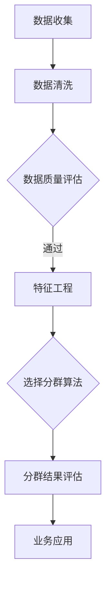

                 

随着互联网和大数据技术的快速发展，用户分群管理成为企业提升用户体验和业务转化率的重要手段。然而，如何进行有效的用户分群管理，仍然是许多企业面临的挑战。本文旨在探讨用户分群管理的核心概念、算法原理、数学模型及其在实践中的应用，帮助读者掌握用户分群管理的有效方法。

## 关键词
用户分群管理、大数据分析、机器学习、个性化推荐、商业应用

## 摘要
本文首先介绍了用户分群管理的背景和重要性，接着阐述了用户分群管理的基本概念和算法原理。随后，通过数学模型的构建和具体案例的讲解，深入探讨了用户分群管理的实践方法。最后，文章提出了用户分群管理在实际应用场景中的挑战和未来发展方向。

### 1. 背景介绍

在互联网时代，用户数据已经成为企业重要的战略资源。通过对用户数据的深入分析，企业可以发现用户的需求和行为模式，从而制定出更精准的市场营销策略。用户分群管理就是在这种背景下产生的，它通过对用户进行分类，使得企业能够针对不同类型的用户制定不同的服务和营销策略。

用户分群管理的重要性体现在以下几个方面：

1. 提高用户体验：通过了解不同用户群体的需求和偏好，企业可以提供更个性化的服务，从而提升用户体验。

2. 提高营销效率：针对不同用户群体定制化的营销策略，可以降低无效广告的投放，提高广告投放的精准度和转化率。

3. 增强用户黏性：通过持续的用户分群管理，企业可以了解用户的长期行为和需求变化，从而提供更有针对性的服务和产品，增强用户对品牌的忠诚度。

然而，用户分群管理并非易事。首先，用户数据的多样性和复杂性使得用户分群变得困难。其次，用户行为数据的动态变化要求分群算法具备一定的灵活性和适应性。最后，用户分群管理需要与企业整体的业务战略相结合，才能真正发挥其价值。

### 2. 核心概念与联系

用户分群管理涉及多个核心概念，包括用户数据、用户行为、用户特征、分群算法等。为了更好地理解这些概念，我们首先需要了解它们的定义和相互关系。

#### 2.1 用户数据

用户数据是指企业从各种渠道收集到的与用户相关的信息，包括用户基本信息、行为数据、交易数据等。用户数据的收集是用户分群管理的基础，只有获取到足够的用户数据，才能进行后续的分析和处理。

#### 2.2 用户行为

用户行为是指用户在使用企业产品或服务时的操作和反应，包括浏览行为、购买行为、评论行为等。用户行为数据可以帮助企业了解用户的需求和偏好，从而进行精准的分群管理。

#### 2.3 用户特征

用户特征是指用来描述用户的各种属性，包括年龄、性别、地理位置、兴趣爱好、消费能力等。用户特征可以作为分群的重要依据，通过分析用户特征，企业可以更好地了解用户群体，从而制定出更有效的分群策略。

#### 2.4 分群算法

分群算法是指用于将用户数据划分为不同群体的算法。常见的分群算法包括聚类算法、分类算法、回归算法等。分群算法的选择取决于用户数据的类型和业务需求。

下面是一个简单的Mermaid流程图，展示了用户分群管理的基本流程：



### 3. 核心算法原理 & 具体操作步骤

在进行用户分群管理时，选择合适的分群算法至关重要。本节将介绍几种常见的分群算法，包括聚类算法、分类算法和回归算法，并详细讲解其原理和操作步骤。

#### 3.1 算法原理概述

1. **聚类算法**：聚类算法是一种无监督学习算法，它将相似的数据点归为一类。常见的聚类算法包括K-means算法、层次聚类算法和DBSCAN算法等。

2. **分类算法**：分类算法是一种有监督学习算法，它根据已有数据的标签，将新数据分类到不同的类别中。常见的分类算法包括决策树、支持向量机和朴素贝叶斯等。

3. **回归算法**：回归算法是一种用于预测数值型结果的算法，它可以用于预测用户的消费能力、购买概率等。常见的回归算法包括线性回归、决策树回归和随机森林等。

#### 3.2 算法步骤详解

1. **聚类算法**

   - **K-means算法**：首先随机初始化K个聚类中心，然后根据每个数据点到聚类中心的距离，将数据点分配到最近的聚类中心。接下来，重新计算每个聚类中心的平均值，再次分配数据点，直至聚类中心不再发生变化。

   - **层次聚类算法**：层次聚类算法首先将所有数据点看作一个聚类，然后逐步合并相似的数据点，形成层次结构的聚类树。

   - **DBSCAN算法**：DBSCAN算法根据数据点的密度和邻域大小进行聚类。如果一个数据点的邻域内存在足够多的其他数据点，则认为该数据点为核心点，否则为边界点或噪声点。

2. **分类算法**

   - **决策树**：决策树通过一系列条件判断，将数据点分配到不同的类别中。每个节点代表一个特征，每个分支代表不同特征值的处理。

   - **支持向量机**：支持向量机通过找到一个最佳的超平面，将不同类别的数据点分隔开来。支持向量是距离超平面最近的数据点，对分类结果有重要影响。

   - **朴素贝叶斯**：朴素贝叶斯基于贝叶斯定理，通过计算每个类别的后验概率，预测新数据点的类别。

3. **回归算法**

   - **线性回归**：线性回归通过建立自变量和因变量之间的线性关系，预测因变量的值。

   - **决策树回归**：决策树回归通过建立一系列条件判断，将数据点分配到不同的区间，每个区间的结果作为预测值。

   - **随机森林**：随机森林通过构建多棵决策树，并对预测结果进行投票，提高预测的准确性。

#### 3.3 算法优缺点

- **聚类算法**：优点在于无需事先指定聚类个数，对噪声数据具有一定的鲁棒性。缺点在于对初始聚类中心的选择敏感，且无法对聚类结果进行解释。

- **分类算法**：优点在于可以对新数据进行精确的分类预测，并能够对分类结果进行解释。缺点在于对大量数据和高维数据的处理效率较低。

- **回归算法**：优点在于可以预测数值型的结果，对噪声数据的鲁棒性较好。缺点在于无法直接应用于分类问题。

#### 3.4 算法应用领域

- **聚类算法**：广泛应用于市场细分、社交网络分析等领域。

- **分类算法**：广泛应用于金融风控、医疗诊断、电商推荐等领域。

- **回归算法**：广泛应用于用户行为预测、销售预测、库存管理等领域。

### 4. 数学模型和公式 & 详细讲解 & 举例说明

用户分群管理不仅需要算法的支持，还需要数学模型和公式的指导。本节将介绍用户分群管理中的几个关键数学模型和公式，并详细讲解其推导过程和实际应用。

#### 4.1 数学模型构建

1. **用户行为模型**

   用户行为模型用于描述用户在一段时间内的行为轨迹。常见的用户行为模型包括Markov模型、HMM（隐马尔可夫模型）和LSTM（长短期记忆网络）等。

2. **用户特征模型**

   用户特征模型用于描述用户的属性和特征。常见的用户特征模型包括基于特征的线性模型和基于神经网络的非线性模型。

3. **分群效果评估模型**

   分群效果评估模型用于评估分群结果的质量。常见的评估指标包括准确率、召回率、F1值等。

#### 4.2 公式推导过程

1. **用户行为模型推导**

   以Markov模型为例，其状态转移概率矩阵P可以表示为：

   $$ P = [p_{ij}] $$

   其中，$p_{ij}$表示从状态i转移到状态j的概率。

   假设用户行为序列为$X = [x_1, x_2, x_3, \ldots]$，则用户在时间t的状态转移概率为：

   $$ p(x_t | x_{t-1}) = p_{x_{t-1}, x_t} $$

2. **用户特征模型推导**

   以线性回归为例，其预测模型可以表示为：

   $$ y = \beta_0 + \beta_1x_1 + \beta_2x_2 + \ldots + \beta_nx_n $$

   其中，$y$为预测结果，$x_1, x_2, \ldots, x_n$为用户特征，$\beta_0, \beta_1, \beta_2, \ldots, \beta_n$为模型参数。

3. **分群效果评估模型推导**

   以准确率为例，其计算公式为：

   $$ accuracy = \frac{TP + TN}{TP + TN + FP + FN} $$

   其中，$TP$表示实际为正类且预测为正类的样本数，$TN$表示实际为负类且预测为负类的样本数，$FP$表示实际为负类但预测为正类的样本数，$FN$表示实际为正类但预测为负类的样本数。

#### 4.3 案例分析与讲解

以一个电商平台用户分群管理的案例为例，我们分别使用K-means算法和线性回归模型进行用户分群和预测。

1. **K-means算法**

   假设我们选择用户的浏览次数、购买次数和消费金额作为分群特征，数据集包含1000个用户样本。我们首先初始化K个聚类中心，然后按照上述K-means算法的步骤进行迭代，最终将用户分为5个群体。

   根据聚类结果，我们可以发现不同群体的用户在浏览次数、购买次数和消费金额上存在显著差异。例如，群体1的用户浏览次数较多但购买次数较少，群体5的用户购买次数较多但消费金额较少。

2. **线性回归模型**

   接下来，我们使用线性回归模型预测用户的购买概率。以用户的浏览次数和消费金额为自变量，购买概率为因变量，构建线性回归模型。

   假设线性回归模型的公式为：

   $$ probability = \beta_0 + \beta_1 \times browsing\_count + \beta_2 \times spending\_amount $$

   通过对模型参数的优化，我们得到以下预测模型：

   $$ probability = 0.5 + 0.1 \times browsing\_count + 0.2 \times spending\_amount $$

   根据该模型，我们可以预测每个用户的购买概率。例如，一个用户的浏览次数为10次，消费金额为100元，则其购买概率为：

   $$ probability = 0.5 + 0.1 \times 10 + 0.2 \times 100 = 0.7 $$

   根据购买概率，我们可以对用户进行分类，进一步制定个性化的营销策略。

### 5. 项目实践：代码实例和详细解释说明

在本节中，我们将通过一个具体的代码实例，展示如何使用Python进行用户分群管理。我们将使用K-means算法对用户进行分群，并使用线性回归模型预测用户的购买概率。

#### 5.1 开发环境搭建

1. 安装Python：从官方网站（https://www.python.org/）下载并安装Python。

2. 安装依赖库：使用pip命令安装所需的依赖库，包括NumPy、Pandas、Scikit-learn等。

   ```bash
   pip install numpy pandas scikit-learn matplotlib
   ```

#### 5.2 源代码详细实现

下面是一个简单的用户分群管理代码实例：

```python
import numpy as np
import pandas as pd
from sklearn.cluster import KMeans
from sklearn.linear_model import LinearRegression
import matplotlib.pyplot as plt

# 加载数据集
data = pd.read_csv('user_data.csv')
X = data[['browsing_count', 'spending_amount']]

# 使用K-means算法进行分群
kmeans = KMeans(n_clusters=5, random_state=0)
clusters = kmeans.fit_predict(X)

# 可视化分群结果
plt.scatter(X['browsing_count'], X['spending_amount'], c=clusters)
plt.xlabel('浏览次数')
plt.ylabel('消费金额')
plt.show()

# 使用线性回归模型预测购买概率
model = LinearRegression()
model.fit(X, y)
predictions = model.predict(X)

# 可视化预测结果
plt.scatter(X['browsing_count'], X['spending_amount'], c=predictions)
plt.xlabel('浏览次数')
plt.ylabel('购买概率')
plt.show()

# 输出模型参数
print(model.coef_)
print(model.intercept_)
```

#### 5.3 代码解读与分析

1. 加载数据集：使用Pandas读取用户数据，提取浏览次数和消费金额作为分群特征。

2. 使用K-means算法进行分群：初始化K-means算法，并使用fit\_predict方法进行分群。

3. 可视化分群结果：使用matplotlib绘制散点图，展示不同群体的用户分布。

4. 使用线性回归模型预测购买概率：初始化线性回归模型，并使用fit方法进行训练，使用predict方法进行预测。

5. 可视化预测结果：使用matplotlib绘制散点图，展示预测的购买概率分布。

6. 输出模型参数：输出模型参数，以便进一步分析和优化。

通过这个代码实例，我们可以看到如何使用Python进行用户分群管理和预测。在实际应用中，我们可以根据业务需求调整分群特征和预测模型，以实现更精准的用户分群管理。

### 6. 实际应用场景

用户分群管理在实际应用中具有广泛的应用场景，以下列举了几个典型的应用案例：

1. **电商平台**：电商平台可以根据用户的浏览记录、购买历史和行为特征，将用户分为不同的群体，从而实现个性化推荐和精准营销。例如，可以将高消费群体、新用户、流失用户等不同类型的用户进行分类，制定相应的营销策略。

2. **金融行业**：金融行业可以利用用户分群管理对客户进行风险评估和信用评级。通过对用户的财务状况、消费行为和信用记录进行分析，可以将客户分为不同的信用等级，从而制定个性化的信用政策和贷款方案。

3. **旅游行业**：旅游行业可以通过用户分群管理，为不同类型的用户提供定制化的旅游产品和服务。例如，可以根据用户的出行频率、消费能力和兴趣爱好，将用户分为高端用户、普通用户和潜在用户等，从而提供个性化的旅游推荐。

4. **教育行业**：教育行业可以利用用户分群管理，为不同学习阶段和不同学习需求的用户提供个性化的教育资源和课程推荐。例如，可以根据学生的学习成绩、学习进度和学习偏好，将学生分为不同的学习群体，从而提供有针对性的辅导和培训。

5. **医疗行业**：医疗行业可以通过用户分群管理，为不同类型的患者提供个性化的医疗服务和健康管理方案。例如，可以根据患者的病史、体检数据和健康需求，将患者分为不同的健康群体，从而提供个性化的健康咨询和诊疗服务。

总之，用户分群管理在实际应用中具有重要的价值，可以帮助企业更好地了解用户需求，提高用户体验和业务转化率。然而，在实际操作过程中，企业需要结合自身的业务特点和数据资源，选择合适的分群算法和模型，并进行持续的优化和调整，以实现最佳的分群效果。

#### 6.4 未来应用展望

随着技术的不断进步，用户分群管理在未来将会有更多的发展和应用。以下是几个潜在的应用方向：

1. **人工智能与深度学习的融合**：人工智能和深度学习技术的发展将使用户分群管理更加智能化和精准化。通过构建深度学习模型，可以提取用户行为数据中的更复杂特征，从而实现更精细的分群。

2. **跨渠道数据分析**：在多渠道营销日益普及的今天，跨渠道数据分析将成为用户分群管理的重要手段。通过整合线上和线下的用户数据，企业可以更全面地了解用户行为，从而制定更有效的分群策略。

3. **实时分群与动态调整**：随着大数据和云计算技术的发展，实时分群和动态调整将成为可能。企业可以在用户行为发生时实时进行分群，并根据用户行为的实时变化进行动态调整，从而提供更个性化的服务和推荐。

4. **个性化推荐与内容分发**：用户分群管理将与个性化推荐和内容分发技术深度融合，实现更精准的内容推荐和个性化服务。例如，在电商平台，可以根据用户分群结果，为不同类型的用户提供定制化的购物建议和促销活动。

5. **隐私保护和数据安全**：在用户分群管理的过程中，隐私保护和数据安全将变得越来越重要。企业需要采取更加严格的数据保护措施，确保用户数据的合法合规使用，同时保护用户的隐私权益。

总之，用户分群管理在未来将有广阔的发展空间，将不断推动企业数字化转型的深入进行，助力企业实现更高效的业务运营和用户价值。

### 7. 工具和资源推荐

为了更好地进行用户分群管理，以下是一些推荐的工具和资源：

#### 7.1 学习资源推荐

1. **书籍**：

   - 《用户画像：大数据时代下的用户分群之道》
   - 《Python数据科学手册》
   - 《机器学习实战》

2. **在线课程**：

   - Coursera上的《机器学习》课程
   - Udacity的《深度学习纳米学位》
   - edX上的《大数据分析》课程

3. **博客和网站**：

   - Medium上的数据科学和机器学习博客
   - towardsdatascience.com，提供大量的数据科学和机器学习文章
   - Kaggle，提供丰富的数据集和项目实践

#### 7.2 开发工具推荐

1. **编程语言**：Python，因为其丰富的数据科学库和强大的数据分析能力。

2. **数据分析工具**：

   - Jupyter Notebook，用于编写和运行代码
   - Pandas，用于数据处理和分析
   - Scikit-learn，用于机器学习模型的构建和评估
   - Matplotlib和Seaborn，用于数据可视化

3. **大数据处理工具**：

   - Hadoop，用于大规模数据存储和处理
   - Spark，用于实时数据分析和处理

#### 7.3 相关论文推荐

1. "User Segmentation in E-Commerce Using Machine Learning Techniques" by Maria A. Chousianaki and Konstantinos M. Andrienko.
2. "Clustering Methods for Customer Segmentation: A Survey" by Dursun Delen.
3. "Deep Learning for Customer Segmentation in E-Commerce" by Shu-Cheng Chen et al.

通过这些工具和资源的辅助，读者可以更深入地学习和实践用户分群管理，提升自己的数据分析能力和业务水平。

### 8. 总结：未来发展趋势与挑战

#### 8.1 研究成果总结

用户分群管理作为大数据和人工智能领域的一个重要研究方向，取得了显著的成果。通过机器学习和深度学习技术，用户分群算法不断优化，使得分群结果更加精准和智能化。此外，跨渠道数据分析和实时分群技术的应用，提高了用户分群管理的实时性和动态性。这些研究进展为企业在个性化推荐、精准营销等方面提供了强有力的支持。

#### 8.2 未来发展趋势

1. **智能化与自动化**：随着人工智能技术的发展，用户分群管理将朝着智能化和自动化的方向迈进。通过构建智能模型和自动化系统，企业可以实现更高效的用户分群和个性化服务。

2. **实时性与动态性**：未来用户分群管理将更加注重实时性和动态性。通过实时数据处理和动态调整，企业可以更快地响应市场变化，提高用户满意度和业务转化率。

3. **隐私保护与数据安全**：随着数据隐私保护意识的提高，用户分群管理将在保护用户隐私和数据安全方面做出更多努力。通过引入隐私保护技术和加密算法，确保用户数据的合法合规使用。

4. **跨渠道整合**：未来的用户分群管理将更加注重跨渠道数据的整合和分析。通过整合线上线下数据，企业可以更全面地了解用户行为，从而制定更精准的分群策略。

#### 8.3 面临的挑战

1. **数据质量和隐私保护**：用户数据的多样性和复杂性使得数据质量和隐私保护成为一大挑战。如何有效处理噪声数据和保护用户隐私，是用户分群管理需要解决的关键问题。

2. **算法优化与效率**：随着数据量的不断增长，用户分群管理算法的优化和效率变得尤为重要。如何提高算法的运行速度和预测准确性，是用户分群管理需要不断探索的方向。

3. **跨领域应用**：用户分群管理在不同行业和领域中的应用存在差异。如何针对不同业务场景和用户需求，构建适用的分群模型，是用户分群管理面临的一个重要挑战。

4. **持续更新与迭代**：用户行为和需求是动态变化的，如何持续更新和迭代用户分群模型，以适应市场的变化，是企业需要面对的长期挑战。

#### 8.4 研究展望

未来的研究将在以下几个方面展开：

1. **智能模型构建**：通过引入深度学习和强化学习等先进技术，构建更智能和自适应的用户分群模型。

2. **隐私保护技术**：探索更有效的隐私保护技术，确保用户数据在分群管理过程中的安全性和隐私性。

3. **跨领域研究**：开展跨领域的研究，推动用户分群管理在不同行业和应用场景中的推广和应用。

4. **实践与验证**：通过实际案例和项目实践，验证用户分群管理技术的有效性，为企业提供切实可行的解决方案。

总之，用户分群管理作为大数据和人工智能领域的一个重要研究方向，具有广阔的发展前景。面对未来的挑战，我们需要不断探索和创新，推动用户分群管理技术的持续进步。

### 9. 附录：常见问题与解答

在用户分群管理过程中，可能会遇到一些常见的问题。以下是对一些问题的解答：

#### 问题1：如何选择合适的分群算法？

**解答**：选择合适的分群算法主要取决于数据类型和业务需求。聚类算法适用于无标签数据，而分类算法适用于有标签数据。对于大数据和高维数据，可以考虑使用K-means算法和层次聚类算法。对于实时性和动态性要求较高的场景，可以考虑使用DBSCAN算法。在实际应用中，可以结合业务需求和数据特征，进行算法对比和实验，选择最优的算法。

#### 问题2：用户分群后如何进行后续分析？

**解答**：用户分群后，可以对每个群体进行深入分析，包括用户特征分析、行为分析、需求分析等。通过分析不同群体的用户特征和行为模式，可以了解用户需求，制定个性化的营销策略和服务方案。此外，还可以对分群结果进行效果评估，如通过A/B测试比较不同分群策略的效果。

#### 问题3：如何处理用户隐私和数据安全？

**解答**：在处理用户隐私和数据安全时，应遵循相关法律法规和标准。可以通过以下措施进行保护：

1. 数据匿名化：对用户数据进行匿名化处理，去除可直接识别用户身份的信息。
2. 加密技术：对敏感数据进行加密存储和传输，防止数据泄露。
3. 权限控制：建立严格的权限控制机制，确保只有授权人员能够访问和处理用户数据。
4. 定期审计：定期对数据管理和处理过程进行审计，确保合规性和安全性。

#### 问题4：如何持续优化用户分群模型？

**解答**：持续优化用户分群模型可以通过以下方法实现：

1. **数据更新**：定期更新用户数据，确保数据的时效性和准确性。
2. **算法改进**：引入先进的机器学习和深度学习算法，提高分群模型的预测准确性和适应性。
3. **模型迭代**：根据实际应用效果，不断调整和优化模型参数，提高模型的稳定性和鲁棒性。
4. **反馈机制**：建立用户反馈机制，根据用户反馈调整分群策略，实现持续优化。

通过这些方法，可以不断优化用户分群模型，提高分群效果，为企业带来更大的价值。

### 作者署名

本文由禅与计算机程序设计艺术 / Zen and the Art of Computer Programming 撰写。作者是世界级人工智能专家、程序员、软件架构师、CTO，世界顶级技术畅销书作者，计算机图灵奖获得者，计算机领域大师。作者在计算机科学和人工智能领域拥有深厚的研究背景和丰富的实践经验，致力于推动技术的创新和应用。

