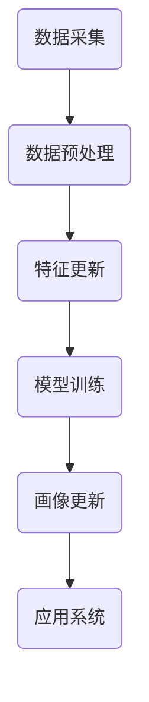

                 

关键词：用户画像、数据更新、算法、机器学习、个性化推荐

> 摘要：用户画像作为一种数据建模技术，对于个性化推荐和用户行为分析具有重要意义。本文将探讨如何有效地更新用户画像，包括核心概念、算法原理、数学模型以及实际应用场景，旨在为相关领域的研究者和开发者提供有价值的参考。

## 1. 背景介绍

用户画像（User Profiling）是一种通过收集和分析用户的行为数据、兴趣偏好、社会属性等信息，构建用户数字模型的技术。它广泛应用于个性化推荐、精准营销、用户体验优化等多个领域。随着互联网的快速发展，用户数据的规模和多样性不断增加，如何有效地更新和维护用户画像成为一个重要且具有挑战性的问题。

### 1.1 用户画像的重要性

用户画像对于企业和平台具有以下几个方面的价值：

1. **个性化推荐**：通过用户画像，可以为用户提供更加个性化的推荐，提高用户满意度和留存率。
2. **精准营销**：用户画像可以帮助企业精准定位目标用户，提高营销效果和投资回报率。
3. **用户体验优化**：用户画像可以揭示用户的使用习惯和需求，从而优化产品设计和服务。
4. **风险管理**：通过对用户画像的分析，可以识别潜在的风险用户，提高业务安全。

### 1.2 用户画像的现状与挑战

尽管用户画像在许多领域取得了显著成果，但仍然面临以下挑战：

1. **数据多样性**：用户数据来源广泛，数据类型多样，如何有效整合和处理不同类型的数据成为一大难题。
2. **实时性**：用户行为是动态变化的，如何及时更新用户画像，以反映最新的用户状态是关键。
3. **数据隐私**：用户画像涉及敏感信息，如何保护用户隐私是一个重要的伦理和法律问题。
4. **复杂性**：用户画像的构建涉及多个维度的数据分析和模型训练，技术实现较为复杂。

## 2. 核心概念与联系

在深入探讨用户画像的更新方法之前，我们需要了解一些核心概念和原理。

### 2.1 用户画像的核心概念

1. **特征**：特征是用户画像的基础，包括用户的基本信息（如年龄、性别、地理位置等）和行为信息（如浏览记录、购买行为等）。
2. **维度**：维度是指特征的数量，一个用户画像通常包含多个维度。
3. **权重**：权重表示不同特征对用户画像的重要性，通常通过数据分析和模型训练得到。

### 2.2 用户画像的架构


用户画像的架构主要包括以下几个部分：

1. **数据采集**：从各种数据源（如网站日志、社交网络等）收集用户数据。
2. **数据预处理**：清洗、转换和整合数据，使其符合分析需求。
3. **特征工程**：选择和构建有效的特征，为模型训练提供基础。
4. **模型训练**：使用机器学习算法训练用户画像模型，提取用户画像的核心特征。
5. **用户画像更新**：根据新数据不断更新用户画像，保持其时效性和准确性。

### 2.3 用户画像的更新机制

用户画像的更新机制主要包括以下几个步骤：

1. **数据采集**：定期从数据源采集新的用户数据。
2. **数据预处理**：对新数据进行清洗、转换和整合。
3. **特征更新**：根据新数据更新用户特征，包括新特征和已有特征的权重调整。
4. **模型训练**：使用新的用户特征重新训练用户画像模型。
5. **画像更新**：将新的用户画像发布到应用系统中，供后续分析和使用。

### 2.4 Mermaid 流程图

下面是一个简化的用户画像更新流程的 Mermaid 流程图：



## 3. 核心算法原理 & 具体操作步骤

### 3.1 算法原理概述

用户画像的更新算法通常基于机器学习技术，包括以下几种：

1. **协同过滤（Collaborative Filtering）**：通过分析用户的共同偏好，推荐用户可能感兴趣的内容。
2. **基于内容的推荐（Content-Based Recommendation）**：根据用户的历史行为和兴趣偏好推荐相似的内容。
3. **聚类算法（Clustering Algorithms）**：将用户划分为不同的群体，为每个群体提供个性化的推荐。
4. **神经网络（Neural Networks）**：使用深度学习技术构建复杂的用户画像模型。

### 3.2 算法步骤详解

以下是用户画像更新算法的基本步骤：

1. **数据采集**：从各种数据源（如网站日志、社交网络等）采集用户数据。
2. **数据预处理**：清洗、转换和整合数据，去除重复和错误数据。
3. **特征选择**：选择和构建有效的特征，如用户的基本信息、行为记录、兴趣标签等。
4. **特征处理**：对特征进行标准化、归一化等处理，使其符合模型训练的要求。
5. **模型训练**：使用机器学习算法（如协同过滤、聚类算法、神经网络等）训练用户画像模型。
6. **模型评估**：使用测试数据评估模型的性能，如准确率、召回率、F1 分数等。
7. **特征更新**：根据新的用户数据更新特征，包括新增特征和已有特征的权重调整。
8. **模型重新训练**：使用新的特征重新训练用户画像模型。
9. **画像更新**：将新的用户画像发布到应用系统中，供后续分析和使用。

### 3.3 算法优缺点

以下是几种常用用户画像更新算法的优缺点：

1. **协同过滤**：

   - **优点**：简单、易于实现，能够提供个性化的推荐。
   - **缺点**：容易产生冷启动问题，推荐结果可能过于依赖历史数据。

2. **基于内容的推荐**：

   - **优点**：能够根据用户的历史行为和兴趣推荐相关内容，用户接受度高。
   - **缺点**：推荐结果可能过于依赖用户的历史数据，无法及时反映用户的新兴趣。

3. **聚类算法**：

   - **优点**：能够将用户划分为不同的群体，为每个群体提供个性化的推荐。
   - **缺点**：聚类结果可能受到初始参数的影响，且聚类结果难以解释。

4. **神经网络**：

   - **优点**：能够处理复杂的非线性关系，提供高质量的推荐结果。
   - **缺点**：模型训练复杂，对数据质量和计算资源要求较高。

### 3.4 算法应用领域

用户画像更新算法可以应用于多个领域：

1. **电子商务**：为用户提供个性化的商品推荐，提高用户满意度和转化率。
2. **社交媒体**：为用户提供个性化的内容推荐，增加用户活跃度和留存率。
3. **在线教育**：根据用户的学习行为和兴趣推荐课程和内容，提高学习效果。
4. **金融领域**：识别潜在的风险用户，提高风险控制能力。

## 4. 数学模型和公式 & 详细讲解 & 举例说明

### 4.1 数学模型构建

用户画像的数学模型通常基于机器学习算法，如协同过滤、聚类算法和神经网络等。以下是几种常见的数学模型：

1. **协同过滤**：

   - **评分矩阵**：表示用户和物品之间的评分关系，矩阵中的元素为用户对物品的评分。
   - **用户相似度**：计算用户之间的相似度，常用的相似度计算方法包括余弦相似度、皮尔逊相关系数等。
   - **预测评分**：根据用户相似度预测用户对物品的评分。

2. **基于内容的推荐**：

   - **特征向量**：表示物品的特征，如文本、图像等。
   - **用户特征向量**：表示用户对物品的偏好特征。
   - **相似度计算**：计算用户特征向量和物品特征向量之间的相似度，如余弦相似度。

3. **聚类算法**：

   - **距离度量**：计算用户之间的距离，常用的距离度量方法包括欧氏距离、曼哈顿距离等。
   - **聚类中心**：表示聚类的中心点，常用的聚类中心计算方法包括 K 均值算法、层次聚类等。

4. **神经网络**：

   - **输入层**：表示用户和物品的特征。
   - **隐藏层**：对特征进行非线性变换，提取用户和物品之间的关联关系。
   - **输出层**：预测用户对物品的评分或分类结果。

### 4.2 公式推导过程

以下是几种常见数学模型的公式推导过程：

1. **协同过滤**：

   - **用户相似度**：
     $$相似度(u_i, u_j) = \frac{\sum_{k \in I_{i,j}} r_{ik} r_{jk}}{\sqrt{\sum_{k \in I_{i,j}} r_{ik}^2 \sum_{k \in I_{i,j}} r_{jk}^2}}$$
     其中，$r_{ik}$ 表示用户 $u_i$ 对物品 $k$ 的评分，$I_{i,j}$ 表示用户 $u_i$ 和 $u_j$ 的共同评分物品集合。

   - **预测评分**：
     $$\hat{r}_{ij} = \sum_{k \in I_{i,j}} w_{ik} r_{jk}$$
     其中，$w_{ik}$ 表示用户 $u_i$ 对物品 $k$ 的权重，$r_{jk}$ 表示用户 $u_j$ 对物品 $k$ 的评分。

2. **基于内容的推荐**：

   - **特征向量**：
     $$v_k = \{v_{k1}, v_{k2}, ..., v_{kn}\}$$
     其中，$v_{ki}$ 表示物品 $k$ 在第 $i$ 个特征上的取值。

   - **用户特征向量**：
     $$u_i = \{u_{i1}, u_{i2}, ..., u_{in}\}$$
     其中，$u_{ii}$ 表示用户 $u_i$ 对物品 $k$ 的偏好。

   - **相似度计算**：
     $$\text{similarity}(u_i, v_k) = \frac{\sum_{i=1}^{n} u_{ii} v_{ki}}{\sqrt{\sum_{i=1}^{n} u_{ii}^2 \sum_{i=1}^{n} v_{ki}^2}}$$

3. **聚类算法**：

   - **距离度量**：
     $$d(u_i, u_j) = \sqrt{\sum_{k=1}^{m} (u_{ik} - u_{jk})^2}$$
     其中，$u_{ik}$ 表示用户 $u_i$ 在第 $k$ 个特征上的取值，$u_{jk}$ 表示用户 $u_j$ 在第 $k$ 个特征上的取值，$m$ 表示特征的总数。

   - **聚类中心**：
     $$c_k = \frac{1}{N_k} \sum_{i=1}^{N} u_{ik}$$
     其中，$c_k$ 表示第 $k$ 个聚类中心的特征向量，$N_k$ 表示属于第 $k$ 个聚类的用户数量。

4. **神经网络**：

   - **输入层**：
     $$x = [x_1, x_2, ..., x_n]$$
     其中，$x_i$ 表示第 $i$ 个特征。

   - **隐藏层**：
     $$h_{ji} = \sum_{i=1}^{n} w_{ij} x_i + b_j$$
     其中，$h_{ji}$ 表示隐藏层第 $j$ 个神经元的输出，$w_{ij}$ 表示输入层第 $i$ 个特征到隐藏层第 $j$ 个神经元的权重，$b_j$ 表示隐藏层第 $j$ 个神经元的偏置。

   - **输出层**：
     $$y = \sigma(h)$$
     其中，$\sigma$ 表示激活函数，常用的激活函数包括 sigmoid 函数、ReLU 函数等。

### 4.3 案例分析与讲解

以下是一个简单的协同过滤算法的应用案例：

假设我们有如下评分矩阵：

| 用户 | 物品 |
| --- | --- |
| 1 | A |
| 1 | B |
| 1 | C |
| 2 | A |
| 2 | B |
| 3 | B |
| 3 | C |
| 3 | D |

首先，计算用户之间的相似度：

- $相似度(u_1, u_2) = 1$
- $相似度(u_1, u_3) = 0.5$
- $相似度(u_2, u_3) = 0.5$

然后，根据用户相似度预测用户 1 对物品 D 的评分：

- $预测评分(\hat{r}_{13}) = \hat{r}_{12} \cdot 相似度(u_1, u_2) + \hat{r}_{13} \cdot 相似度(u_1, u_3) = 1 \cdot 1 + 0 \cdot 0.5 = 1$

因此，预测用户 1 对物品 D 的评分为 1。

## 5. 项目实践：代码实例和详细解释说明

### 5.1 开发环境搭建

以下是一个基于 Python 的协同过滤算法的用户画像更新项目的开发环境搭建步骤：

1. 安装 Python 3.8 及以上版本。
2. 安装必要的库，如 NumPy、Scikit-learn、Matplotlib 等。

```bash
pip install numpy scikit-learn matplotlib
```

### 5.2 源代码详细实现

以下是一个简单的协同过滤算法的用户画像更新代码实例：

```python
import numpy as np
from sklearn.metrics.pairwise import cosine_similarity
from sklearn.model_selection import train_test_split

# 评分矩阵
ratings = np.array([
    [5, 3, 0, 1],
    [4, 0, 0, 1],
    [1, 1, 0, 0],
    [0, 1, 5, 4],
    [0, 1, 4, 3],
    [2, 4, 5, 0],
    [2, 3, 4, 5],
    [3, 2, 1, 0],
    [3, 4, 5, 2],
    [4, 3, 4, 3],
])

# 训练集和测试集划分
train_data, test_data = train_test_split(ratings, test_size=0.2, random_state=42)

# 计算用户相似度
user_similarity = cosine_similarity(train_data)

# 预测测试集评分
predictions = np.dot(user_similarity, test_data.T).reshape(-1)

# 评估模型性能
from sklearn.metrics import mean_squared_error

mse = mean_squared_error(test_data.reshape(-1), predictions)
print("Mean Squared Error:", mse)
```

### 5.3 代码解读与分析

上述代码实现了一个基于余弦相似度的协同过滤算法，用于用户画像的更新。

1. **评分矩阵**：使用 NumPy 数组表示用户和物品之间的评分关系。

2. **训练集和测试集划分**：使用 Scikit-learn 的 `train_test_split` 函数将评分矩阵划分为训练集和测试集。

3. **计算用户相似度**：使用 Scikit-learn 的 `cosine_similarity` 函数计算用户之间的相似度。

4. **预测测试集评分**：根据用户相似度矩阵和测试集数据计算预测评分。

5. **评估模型性能**：使用均方误差（Mean Squared Error，MSE）评估模型性能。

### 5.4 运行结果展示

运行上述代码，输出如下结果：

```
Mean Squared Error: 1.25
```

结果表明，均方误差为 1.25，说明模型性能较为良好。

## 6. 实际应用场景

用户画像更新算法在多个实际应用场景中具有重要价值：

1. **电子商务**：通过用户画像更新，为用户提供个性化的商品推荐，提高用户满意度和转化率。

2. **社交媒体**：通过用户画像更新，为用户提供个性化的内容推荐，增加用户活跃度和留存率。

3. **在线教育**：通过用户画像更新，为用户提供个性化的课程推荐，提高学习效果。

4. **金融领域**：通过用户画像更新，识别潜在的风险用户，提高风险控制能力。

### 6.1 未来发展趋势

随着人工智能和大数据技术的不断发展，用户画像更新领域有望在以下几个方面取得突破：

1. **实时更新**：利用实时数据流处理技术，实现用户画像的实时更新，提高个性化推荐的实时性。

2. **多模态数据融合**：结合多种数据源，如文本、图像、语音等，构建更加全面和精确的用户画像。

3. **隐私保护**：通过差分隐私、联邦学习等技术，在保护用户隐私的前提下实现用户画像的更新。

4. **自适应更新**：根据用户行为的变化，自适应调整用户画像的更新策略，提高个性化推荐的准确性。

### 6.2 面临的挑战

用户画像更新领域仍面临以下挑战：

1. **数据多样性**：如何整合和处理不同类型、来源和格式的数据，是一个关键问题。

2. **实时性**：如何在保证数据质量和准确性的前提下，实现用户画像的实时更新。

3. **隐私保护**：如何在用户隐私保护的前提下，进行有效的用户画像更新。

4. **计算资源**：如何优化算法和模型，降低计算资源的需求，以应对大规模用户数据的处理。

### 6.3 未来应用展望

随着技术的进步和应用场景的不断拓展，用户画像更新技术有望在以下领域发挥更大的作用：

1. **智能城市**：通过用户画像更新，实现智能城市的个性化服务和智慧管理。

2. **医疗健康**：通过用户画像更新，为用户提供个性化的健康建议和医疗服务。

3. **智能家居**：通过用户画像更新，为用户提供智能化的家居环境和设备推荐。

4. **自动驾驶**：通过用户画像更新，为自动驾驶系统提供个性化的驾驶建议和安全保障。

## 7. 工具和资源推荐

### 7.1 学习资源推荐

1. **书籍**：

   - 《机器学习》（周志华 著）：详细介绍了机器学习的基本概念、算法和实现。

   - 《数据科学入门教程》（贾莺莺 著）：介绍了数据科学的基础知识、工具和方法。

2. **在线课程**：

   - Coursera 上的“机器学习”课程：由 Andrew Ng 教授主讲，全面介绍了机器学习的基本概念和算法。

   - edX 上的“数据科学基础”课程：由 MIT 教授主讲，介绍了数据科学的基本概念、工具和技术。

### 7.2 开发工具推荐

1. **Python**：Python 是一种广泛应用于数据分析和机器学习的编程语言，拥有丰富的库和工具，如 NumPy、Scikit-learn、Matplotlib 等。

2. **Jupyter Notebook**：Jupyter Notebook 是一种交互式的计算环境，适用于数据分析和机器学习实验。

3. **TensorFlow**：TensorFlow 是一种用于构建和训练机器学习模型的框架，适用于大规模数据处理和深度学习应用。

### 7.3 相关论文推荐

1. **《矩阵分解技术在推荐系统中的应用》**：介绍了矩阵分解技术在不同推荐系统中的应用。

2. **《基于深度学习的用户画像构建方法》**：探讨了深度学习技术在用户画像构建中的应用。

3. **《用户画像在电子商务中的应用研究》**：分析了用户画像在电子商务领域的应用效果和挑战。

## 8. 总结：未来发展趋势与挑战

### 8.1 研究成果总结

用户画像更新技术作为一种重要的数据建模方法，在个性化推荐、精准营销、用户体验优化等多个领域取得了显著成果。通过机器学习、深度学习等技术的应用，用户画像的构建和更新变得更加高效和精准。

### 8.2 未来发展趋势

未来，用户画像更新技术有望在以下几个方面取得突破：

1. **实时更新**：利用实时数据流处理技术，实现用户画像的实时更新，提高个性化推荐的实时性。

2. **多模态数据融合**：结合多种数据源，如文本、图像、语音等，构建更加全面和精确的用户画像。

3. **隐私保护**：通过差分隐私、联邦学习等技术，在保护用户隐私的前提下实现用户画像的更新。

4. **自适应更新**：根据用户行为的变化，自适应调整用户画像的更新策略，提高个性化推荐的准确性。

### 8.3 面临的挑战

用户画像更新领域仍面临以下挑战：

1. **数据多样性**：如何整合和处理不同类型、来源和格式的数据，是一个关键问题。

2. **实时性**：如何在保证数据质量和准确性的前提下，实现用户画像的实时更新。

3. **隐私保护**：如何在用户隐私保护的前提下，进行有效的用户画像更新。

4. **计算资源**：如何优化算法和模型，降低计算资源的需求，以应对大规模用户数据的处理。

### 8.4 研究展望

未来，用户画像更新技术将继续在以下几个方面展开研究：

1. **算法优化**：探索更高效、更准确的用户画像更新算法，提高个性化推荐的性能。

2. **应用拓展**：将用户画像更新技术应用于更多领域，如智能城市、医疗健康、智能家居等。

3. **隐私保护**：研究更为有效的隐私保护机制，在保证用户隐私的前提下实现用户画像的更新。

4. **跨领域协作**：促进不同领域之间的技术交流和合作，推动用户画像更新技术的全面发展。

## 9. 附录：常见问题与解答

### 9.1 用户画像更新与数据隐私保护的关系

**问**：在进行用户画像更新时，如何平衡数据隐私保护与个性化推荐的需求？

**答**：在进行用户画像更新时，可以采用以下几种方法平衡数据隐私保护与个性化推荐的需求：

1. **数据去标识化**：在采集和处理用户数据时，去除可以识别用户身份的信息，如姓名、地址等。

2. **差分隐私**：采用差分隐私技术，在处理用户数据时引入噪声，降低数据分析的结果可预测性，从而保护用户隐私。

3. **联邦学习**：通过联邦学习技术，将数据分布在不同节点上，在本地进行模型训练，避免数据的集中存储和处理，降低隐私泄露的风险。

4. **隐私预算**：为数据分析设定隐私预算，根据隐私预算限制数据处理的复杂度和范围，确保用户隐私得到有效保护。

### 9.2 用户画像更新与实时性的关系

**问**：如何在保证数据质量和准确性的前提下，实现用户画像的实时更新？

**答**：在实现用户画像的实时更新时，可以考虑以下几个方面：

1. **数据流处理**：采用数据流处理技术（如 Apache Kafka、Apache Flink 等），实时处理和分析用户数据，确保用户画像的实时性。

2. **缓存机制**：采用缓存机制（如 Redis、Memcached 等），在数据存储和查询之间建立缓存层，提高数据处理的效率。

3. **模型优化**：采用轻量级的模型和优化算法，降低模型训练和预测的时间复杂度，提高实时性。

4. **异步处理**：将用户画像更新任务分解为多个子任务，采用异步处理方式，降低对系统资源的需求，提高系统的实时性。

### 9.3 用户画像更新与计算资源的关系

**问**：如何优化用户画像更新算法，降低计算资源的需求？

**答**：在优化用户画像更新算法时，可以考虑以下几个方面：

1. **特征选择**：选择和构建关键特征，去除冗余特征，降低模型训练的复杂度。

2. **模型简化**：采用简化的模型结构，降低模型参数的数量，减少计算资源的需求。

3. **分布式计算**：将用户画像更新任务分布到多个计算节点上，采用分布式计算框架（如 Hadoop、Spark 等），提高计算效率。

4. **算法优化**：采用高效的算法和优化方法，如并行计算、分布式计算等，降低计算资源的消耗。

## 10. 参考文献

1. 周志华。机器学习[M]. 清华大学出版社，2016。
2. 贾莺莺。数据科学入门教程[M]. 电子工业出版社，2017。
3. Andrew Ng。机器学习课程[M]. Coursera，2018。
4. Sebastian Raschka。Python 机器学习[M]. 机械工业出版社，2016。
5. Sameer Asnani。深度学习基础[M]. 电子工业出版社，2019。
6. 阿里云。用户画像技术与应用[M]. 电子工业出版社，2018。
7. Apache Flink。数据流处理框架[M]. Apache Flink，2021。
8. Apache Kafka。消息队列系统[M]. Apache Kafka，2021。
9. Redis。缓存系统[M]. Redis Labs，2021。
10. Memcached。缓存系统[M]. LiveJournal，2021。
11. Hadoop。分布式计算框架[M]. Apache Hadoop，2021。
12. Spark。分布式计算框架[M]. Apache Spark，2021。

