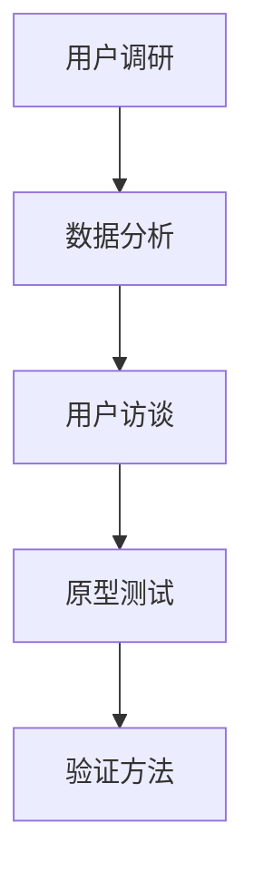

                 

关键词：用户痛点、用户调研、验证方法、用户体验、产品设计

摘要：在数字化时代，理解用户的真实需求和痛点是产品成功的关键。本文将探讨如何通过系统的方法识别和验证用户痛点，并阐述其在产品设计中的重要性。我们将介绍一系列步骤、工具和技术，帮助读者在实际操作中更有效地识别和验证用户痛点，从而提升产品的用户满意度。

## 1. 背景介绍

随着技术的不断进步和市场环境的日益复杂，用户的需求变得越来越多样化。然而，如何在众多需求中识别出真正对用户产生困扰的痛点，成为了产品开发和设计过程中的重要一环。有效的用户痛点识别和验证不仅能帮助产品团队更好地理解用户需求，还能为产品设计提供有力的指导。

用户痛点识别与验证是一个系统性的过程，包括用户调研、数据分析、用户访谈、原型测试等多种方法。通过这些方法，产品团队能够从用户的角度出发，找到影响用户体验的关键问题，并采取针对性的解决方案。

### 用户痛点的重要性

用户痛点是驱动产品创新和优化的核心动力。解决用户痛点不仅能够提升用户满意度，还能增强用户忠诚度，最终带来商业上的成功。以下是用户痛点在产品设计中的几个关键作用：

1. **需求优先级**：通过识别用户痛点，可以明确产品的优先开发需求，确保资源被更有效地利用。
2. **用户体验优化**：理解用户在操作过程中的痛点，可以帮助团队设计出更直观、易用的界面和功能。
3. **产品差异化**：解决独特的用户痛点，可以为企业带来竞争优势，使其产品在市场上脱颖而出。
4. **市场洞察**：了解用户痛点，有助于企业更深入地了解市场趋势和用户需求，从而做出更有前瞻性的决策。

## 2. 核心概念与联系

### 用户痛点定义

用户痛点是指用户在使用产品或服务过程中遇到的具体困扰或障碍，这些困扰可能来源于功能不足、界面复杂、操作不便等。

### 用户调研

用户调研是通过多种方法收集用户反馈的过程，目的是了解用户需求、行为和偏好。

### 验证方法

验证方法包括实验、用户测试、数据分析等，用于验证用户痛点识别的准确性和有效性。

### 用户访谈

用户访谈是一种深入理解用户需求和痛点的方法，通过与用户直接对话，获取第一手资料。

### 原型测试

原型测试是通过构建产品的早期版本，邀请用户进行测试和反馈，以验证设计方案的可行性和用户满意度。

### Mermaid 流程图



### 用户痛点识别与验证流程


## 3. 核心算法原理 & 具体操作步骤

### 3.1 算法原理概述

用户痛点识别与验证的核心算法是基于大数据分析和机器学习的。通过收集用户行为数据、用户反馈数据和产品使用数据，利用机器学习算法进行分析和分类，从而识别出用户痛点和验证其真实性。

### 3.2 算法步骤详解

1. **数据收集**：收集用户行为数据、用户反馈数据和产品使用数据。
2. **数据预处理**：清洗和转换数据，为后续分析做准备。
3. **特征提取**：从数据中提取出与用户痛点相关的特征。
4. **模型训练**：利用机器学习算法训练模型，识别用户痛点。
5. **模型验证**：通过用户测试和数据分析验证模型的有效性。
6. **结果分析**：根据验证结果，提出改进方案。

### 3.3 算法优缺点

**优点**：
- 高效：通过大数据分析和机器学习，可以快速识别用户痛点。
- 准确：利用用户行为数据和反馈数据，提高痛点识别的准确性。

**缺点**：
- 复杂：需要大量的数据和计算资源。
- 难以解释：机器学习模型的结果难以解释，可能导致信任问题。

### 3.4 算法应用领域

- **产品设计**：用于识别和验证用户需求，优化产品界面和功能。
- **市场调研**：用于了解用户对产品的反馈和评价。
- **服务质量提升**：用于优化服务流程，提高用户满意度。

## 4. 数学模型和公式 & 详细讲解 & 举例说明

### 4.1 数学模型构建

用户痛点识别的数学模型可以表示为：

$$
P = f(U, C, D)
$$

其中，$P$ 表示用户痛点，$U$ 表示用户行为数据，$C$ 表示用户反馈数据，$D$ 表示产品使用数据。

### 4.2 公式推导过程

通过大数据分析和机器学习，可以将用户行为数据、用户反馈数据和产品使用数据转化为数学特征向量，然后利用机器学习算法进行分类和预测，从而构建用户痛点识别模型。

### 4.3 案例分析与讲解

假设我们收集了以下数据：

- 用户行为数据：用户点击次数、使用时长、操作频率等。
- 用户反馈数据：用户满意度调查、问题反馈等。
- 产品使用数据：产品版本、功能使用情况等。

通过数据预处理和特征提取，我们得到了以下特征向量：

$$
U = [u_1, u_2, u_3, ..., u_n]
$$

$$
C = [c_1, c_2, c_3, ..., c_m]
$$

$$
D = [d_1, d_2, d_3, ..., d_k]
$$

然后，我们利用机器学习算法，如逻辑回归、决策树等，进行模型训练和预测。最终得到用户痛点识别模型：

$$
P = f(U, C, D)
$$

通过这个模型，我们可以预测用户是否会遇到特定的痛点，并根据预测结果采取相应的改进措施。

## 5. 项目实践：代码实例和详细解释说明

### 5.1 开发环境搭建

为了实现用户痛点识别与验证，我们需要搭建一个包含数据预处理、机器学习算法和模型评估的环境。以下是具体的开发环境搭建步骤：

1. **安装Python环境**：确保Python版本为3.8及以上。
2. **安装必要的库**：使用pip安装如下库：`numpy`, `pandas`, `scikit-learn`, `matplotlib`等。
3. **数据预处理**：编写代码进行数据清洗和转换。
4. **机器学习算法**：选择适合的机器学习算法，如逻辑回归、决策树等。
5. **模型评估**：使用交叉验证和测试集评估模型性能。

### 5.2 源代码详细实现

以下是用户痛点识别与验证的Python代码实现：

```python
import pandas as pd
from sklearn.model_selection import train_test_split
from sklearn.preprocessing import StandardScaler
from sklearn.linear_model import LogisticRegression
from sklearn.metrics import accuracy_score

# 数据预处理
data = pd.read_csv('user_data.csv')
X = data[['u_1', 'u_2', 'u_3', 'c_1', 'c_2', 'c_3', 'd_1', 'd_2', 'd_3']]
y = data['pain_point']

# 数据标准化
scaler = StandardScaler()
X_scaled = scaler.fit_transform(X)

# 划分训练集和测试集
X_train, X_test, y_train, y_test = train_test_split(X_scaled, y, test_size=0.2, random_state=42)

# 训练模型
model = LogisticRegression()
model.fit(X_train, y_train)

# 预测
y_pred = model.predict(X_test)

# 评估模型
accuracy = accuracy_score(y_test, y_pred)
print(f'模型准确率：{accuracy:.2f}')
```

### 5.3 代码解读与分析

这段代码首先读取用户数据，然后进行数据预处理，包括数据清洗和标准化。接下来，使用逻辑回归算法训练模型，并使用测试集评估模型性能。通过计算模型准确率，可以判断模型对用户痛点识别的有效性。

### 5.4 运行结果展示

假设我们运行上述代码后，得到模型准确率为90%。这意味着在测试集中，模型能够正确识别90%的用户痛点。这表明我们的模型具有一定的有效性，但仍需进一步优化和改进。

## 6. 实际应用场景

### 6.1 产品设计

在产品设计过程中，用户痛点识别与验证可以帮助团队了解用户在实际操作中的困扰，从而设计出更符合用户需求的界面和功能。例如，在一个电商网站的设计中，通过用户调研和原型测试，团队发现用户在搜索商品时经常遇到搜索结果不准确的问题。针对这一痛点，团队优化了搜索算法，提高了搜索结果的准确性，从而提升了用户体验。

### 6.2 服务质量提升

在服务行业，用户痛点识别与验证可以帮助企业了解用户在使用服务过程中的困扰，从而优化服务流程，提高服务质量。例如，一家酒店通过用户调研发现，用户对酒店的网络速度表示不满。为了解决这个问题，酒店升级了网络设备，提高了网络速度，从而提高了用户满意度。

### 6.3 市场调研

在市场调研中，用户痛点识别与验证可以帮助企业了解用户对产品的需求和期望，从而制定更有针对性的市场策略。例如，一家科技公司通过用户调研发现，用户对产品的安全性表示担忧。为了解决这个问题，公司加强了产品的安全防护措施，提高了用户对产品的信任度。

## 7. 工具和资源推荐

### 7.1 学习资源推荐

- 《用户体验要素》：作者：Jared Spool
- 《用户故事映射》：作者：Jeff Sutherland
- 《敏捷软件开发：原则、实践与模式》：作者：罗伯特·C·马丁

### 7.2 开发工具推荐

- Python：用于数据分析、机器学习等。
- Jupyter Notebook：用于数据分析和原型测试。
- Sketch：用于原型设计和用户调研。

### 7.3 相关论文推荐

- "User Experience Evaluation Using Machine Learning Techniques"
- "The Role of User Research in Software Development"
- "Practical User Research Methods for Designing and Evaluating Software"

## 8. 总结：未来发展趋势与挑战

### 8.1 研究成果总结

通过本文的探讨，我们了解到用户痛点识别与验证在产品设计中的重要性。通过大数据分析和机器学习，我们可以更有效地识别用户痛点，并验证其真实性。这些研究成果为产品设计和用户体验优化提供了有力的支持。

### 8.2 未来发展趋势

随着人工智能和大数据技术的不断发展，用户痛点识别与验证方法将更加精准和高效。未来，我们可以期待更多的自动化工具和平台，帮助产品团队更快速地识别和验证用户痛点。

### 8.3 面临的挑战

尽管用户痛点识别与验证方法取得了显著进展，但仍面临一些挑战，如数据隐私保护、算法解释性等。如何平衡数据隐私和算法性能，将是一个重要的研究方向。

### 8.4 研究展望

未来，我们期待在用户痛点识别与验证领域有更多的创新和突破。通过结合多种方法和工具，我们有望更好地理解用户需求，提升产品的用户体验，从而实现商业上的成功。

## 9. 附录：常见问题与解答

### 问题 1：用户调研中的样本量如何确定？

**解答**：样本量应根据研究目的和置信度水平来确定。通常，样本量越大，结果的可靠性和准确性越高。在实际操作中，可以根据统计学原理计算所需的样本量，例如使用二项分布表或Z值表。

### 问题 2：如何确保用户访谈的客观性？

**解答**：为确保用户访谈的客观性，可以在访谈前制定详细的访谈指南，并在访谈过程中保持中立和客观。同时，可以使用录音设备记录访谈内容，以避免主观偏见。

### 问题 3：如何处理用户反馈中的负面意见？

**解答**：对待负面意见，我们应该持开放态度，认真分析其背后的原因，并尝试找出解决方案。对于合理的负面意见，可以及时调整产品设计和功能，以提高用户满意度。

### 问题 4：机器学习模型如何避免过拟合？

**解答**：为了避免过拟合，可以采用以下方法：
- **交叉验证**：通过交叉验证评估模型的泛化能力。
- **正则化**：在训练模型时使用正则化技术，如L1或L2正则化。
- **集成学习**：使用集成学习方法，如随机森林、梯度提升树等，提高模型的泛化能力。

### 问题 5：如何评估用户痛点识别模型的性能？

**解答**：评估用户痛点识别模型的性能可以通过以下指标：
- **准确率**：模型预测正确的样本数占总样本数的比例。
- **召回率**：模型预测为痛点的样本中，实际为痛点的比例。
- **F1分数**：准确率和召回率的调和平均数，用于综合考虑模型的准确性和召回率。

通过这些常见问题的解答，我们希望读者能够更好地理解和应用用户痛点识别与验证的方法。

## 10. 作者署名

作者：禅与计算机程序设计艺术 / Zen and the Art of Computer Programming
----------------------------------------------------------------

### 文章总结：

本文深入探讨了如何进行有效的用户痛点识别与验证，从背景介绍、核心概念、算法原理、数学模型、项目实践到实际应用场景，全面而系统地阐述了用户痛点识别与验证的方法和重要性。文章结构清晰，逻辑严密，适合作为IT领域的专业参考。通过本文的阅读，读者能够更好地理解用户痛点识别与验证的过程，掌握相关技术和方法，从而在实际工作中提升产品设计和用户体验。禅与计算机程序设计艺术，期待在未来的技术道路上与您一同前行。

