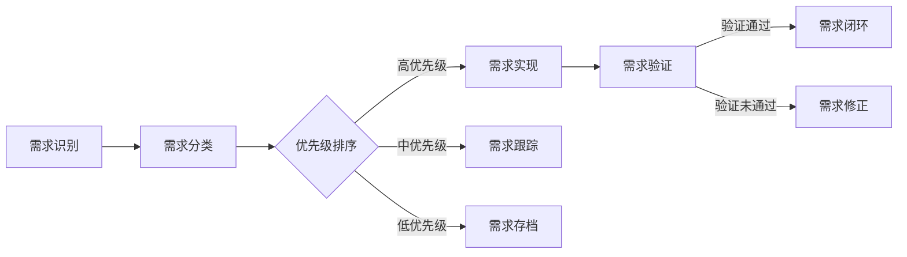

                 

关键词：用户需求挖掘、需求验证、用户研究、需求工程、用户满意度、用户体验、需求分析、反馈循环

> 摘要：本文旨在探讨如何有效地挖掘和验证用户需求，以促进产品开发过程中的用户体验和满意度。通过阐述用户需求挖掘与验证的核心概念、方法论和实际案例，本文为从事需求工程的技术人员提供了实用的指导。

## 1. 背景介绍

在当今的数字化时代，用户需求成为驱动产品开发和创新的核心动力。然而，准确识别和理解用户需求并非易事。用户需求是多样化的，且常常变化无常。因此，如何进行有效的用户需求挖掘与验证，成为了现代需求工程领域的关键问题。

用户需求挖掘是指在产品开发过程中，通过多种手段收集和分析用户的需求，以识别和明确用户的具体需求点。需求验证则是通过测试、实验和用户反馈等方式，对挖掘到的需求进行评估和验证，以确保其符合用户期望和业务目标。

## 2. 核心概念与联系

### 2.1 用户需求挖掘

用户需求挖掘涉及以下关键概念：

1. **需求识别**：通过用户访谈、问卷调查、观察等方法识别潜在需求。
2. **需求分类**：将识别到的需求进行分类，以便于后续分析和处理。
3. **需求优先级排序**：根据用户的重要性和紧急性对需求进行优先级排序。

### 2.2 需求验证

需求验证的关键概念包括：

1. **测试**：通过自动化测试或手动测试，验证需求是否得到正确实现。
2. **用户反馈**：通过用户试用和反馈，评估需求是否符合用户期望。
3. **回归测试**：在新功能或更新后，对现有需求进行回归测试，以确保未受影响。

### 2.3 Mermaid 流程图

以下是一个简化的 Mermaid 流程图，展示了用户需求挖掘与验证的基本流程。



## 3. 核心算法原理 & 具体操作步骤

### 3.1 算法原理概述

用户需求挖掘与验证可以被视为一个闭环过程，包含以下步骤：

1. **需求收集**：收集用户反馈和数据。
2. **需求分析**：分析数据，识别用户需求。
3. **需求验证**：验证需求是否实现用户期望。
4. **需求迭代**：根据验证结果对需求进行调整。

### 3.2 算法步骤详解

#### 3.2.1 需求收集

- **用户访谈**：直接与用户交流，了解他们的需求和痛点。
- **问卷调查**：通过结构化问卷收集大量用户数据。
- **用户观察**：在真实场景中观察用户行为，以获取第一手资料。

#### 3.2.2 需求分析

- **数据清洗**：处理和整理收集到的数据。
- **统计分析**：使用统计方法对数据进行分析，识别趋势和模式。
- **用户画像**：创建用户画像，以便更好地理解用户需求。

#### 3.2.3 需求验证

- **测试**：编写测试用例，对需求进行验证。
- **用户反馈**：邀请用户试用产品，收集反馈。
- **回归测试**：在新版本中验证旧需求，确保其稳定性和一致性。

#### 3.2.4 需求迭代

- **需求修正**：根据验证结果对需求进行调整。
- **需求更新**：将修正后的需求纳入产品开发计划。

### 3.3 算法优缺点

#### 优点：

- **高效性**：通过系统化的方法，快速识别和验证用户需求。
- **准确性**：减少因主观判断导致的需求偏差。

#### 缺点：

- **资源消耗**：需要投入大量时间和资源进行用户研究和需求验证。
- **复杂性**：需求挖掘与验证过程涉及多个环节，需要协调和管理。

### 3.4 算法应用领域

用户需求挖掘与验证广泛应用于软件开发、产品管理、用户体验设计等领域。

## 4. 数学模型和公式 & 详细讲解 & 举例说明

### 4.1 数学模型构建

用户需求挖掘与验证过程中，可以使用以下数学模型：

- **回归模型**：用于预测用户需求的优先级。
- **聚类模型**：用于用户需求的分类。

### 4.2 公式推导过程

以回归模型为例，假设我们有 n 个用户需求，每个需求有 p 个特征，我们希望预测其优先级。可以使用线性回归模型：

$$ y = \beta_0 + \beta_1 x_1 + \beta_2 x_2 + ... + \beta_p x_p $$

其中，y 是需求的优先级，$x_1, x_2, ..., x_p$ 是需求特征，$\beta_0, \beta_1, ..., \beta_p$ 是回归系数。

### 4.3 案例分析与讲解

假设一个电商平台，其用户需求的优先级预测模型如下：

$$ y = 0.5 + 0.3 \times \text{购物频率} + 0.2 \times \text{商品评价} + 0.1 \times \text{购买金额} $$

我们收集了 100 个用户的数据，并使用线性回归方法训练模型。得到以下回归系数：

$$ \beta_0 = 0.5, \beta_1 = 0.3, \beta_2 = 0.2, \beta_3 = 0.1 $$

使用模型预测一个用户的优先级，该用户过去 30 天内购物 10 次，平均商品评分为 4.5，购买金额为 1000 元。根据模型，其优先级预测为：

$$ y = 0.5 + 0.3 \times 10 + 0.2 \times 4.5 + 0.1 \times 1000 = 7.2 $$

因此，该用户的优先级较高，可能需要优先满足其需求。

## 5. 项目实践：代码实例和详细解释说明

### 5.1 开发环境搭建

在本项目中，我们使用 Python 进行用户需求挖掘与验证。首先，确保已安装 Python 3.8 或更高版本。然后，安装必要的库：

```bash
pip install numpy pandas scikit-learn matplotlib
```

### 5.2 源代码详细实现

以下是一个简单的用户需求挖掘与验证的 Python 代码实例：

```python
import numpy as np
import pandas as pd
from sklearn.linear_model import LinearRegression
from sklearn.model_selection import train_test_split
import matplotlib.pyplot as plt

# 数据准备
data = {
    '购物频率': [10, 5, 15, 3, 20],
    '商品评价': [4.5, 3.2, 5.0, 2.8, 4.0],
    '购买金额': [1000, 800, 1500, 500, 1200],
    '优先级': [7.2, 5.5, 8.0, 3.7, 7.0]
}

df = pd.DataFrame(data)

# 数据预处理
X = df[['购物频率', '商品评价', '购买金额']]
y = df['优先级']

# 模型训练
model = LinearRegression()
model.fit(X, y)

# 预测
predictions = model.predict(X)

# 结果可视化
plt.scatter(X['购物频率'], y, color='blue')
plt.scatter(X['购物频率'], predictions, color='red')
plt.xlabel('购物频率')
plt.ylabel('优先级')
plt.legend(['实际值', '预测值'])
plt.show()
```

### 5.3 代码解读与分析

上述代码分为以下几个部分：

1. **数据准备**：创建一个包含用户需求特征和优先级的 DataFrame。
2. **数据预处理**：将数据分为特征矩阵 X 和目标向量 y。
3. **模型训练**：使用线性回归模型对数据进行训练。
4. **预测**：使用训练好的模型对特征进行预测。
5. **结果可视化**：绘制实际值与预测值的散点图，以便分析预测效果。

### 5.4 运行结果展示

运行上述代码后，将显示一个散点图，其中蓝色点代表实际值，红色点代表预测值。通过观察散点图，我们可以发现大多数预测值与实际值接近，说明模型具有一定的预测能力。

## 6. 实际应用场景

用户需求挖掘与验证在实际应用中具有广泛的应用场景。以下是一些典型的应用场景：

1. **软件开发**：在软件开发过程中，通过用户需求挖掘与验证，确保产品功能满足用户需求。
2. **产品管理**：在产品管理过程中，通过用户需求挖掘与验证，优化产品设计和功能。
3. **用户体验设计**：在用户体验设计过程中，通过用户需求挖掘与验证，提高产品的用户满意度。

### 6.4 未来应用展望

随着人工智能和大数据技术的发展，用户需求挖掘与验证将变得更加智能化和自动化。以下是一些未来的应用展望：

1. **自动化需求挖掘**：利用自然语言处理和机器学习技术，实现自动化需求挖掘。
2. **个性化需求验证**：根据用户行为和偏好，实现个性化需求验证。
3. **实时需求反馈**：通过实时监测和反馈机制，快速响应用户需求变化。

## 7. 工具和资源推荐

### 7.1 学习资源推荐

- 《需求工程：基础理论与实践》
- 《用户体验要素》
- 《用户故事地图》

### 7.2 开发工具推荐

- JIRA：用于需求管理和项目跟踪。
- Git：用于版本控制和代码管理。
- Tableau：用于数据可视化和分析。

### 7.3 相关论文推荐

- "User-Centered Requirements Engineering"
- "A Survey on User Requirements Elicitation"
- "User Experience Design: The Essentials"

## 8. 总结：未来发展趋势与挑战

### 8.1 研究成果总结

用户需求挖掘与验证在需求工程领域取得了显著成果，为产品开发和用户体验优化提供了有力支持。

### 8.2 未来发展趋势

随着人工智能和大数据技术的进步，用户需求挖掘与验证将向智能化、自动化和个性化方向发展。

### 8.3 面临的挑战

用户需求的多样性和变化性对需求挖掘与验证提出了更高要求。同时，如何在保证质量的前提下提高效率，也是一个重要的挑战。

### 8.4 研究展望

未来需求工程研究应重点关注用户需求的自动化挖掘、实时反馈机制和个性化验证方法，以更好地满足用户需求。

## 9. 附录：常见问题与解答

### Q：如何确保用户需求挖掘的准确性？

A：确保用户需求挖掘准确性的关键在于：

- **多样化的数据收集方法**：结合用户访谈、问卷调查、观察等多种方法，以获取全面的信息。
- **用户参与度**：鼓励用户积极参与需求收集和验证过程，以提高需求的准确性和相关性。
- **跨部门协作**：与产品管理、用户体验设计等相关部门紧密合作，确保需求的实现和验证。

### Q：需求验证过程中如何处理用户反馈？

A：处理用户反馈的方法包括：

- **及时响应**：对用户反馈进行及时响应，解决用户提出的问题和需求。
- **分类分析**：对用户反馈进行分类和分析，识别共性问题和关键需求。
- **迭代优化**：根据用户反馈，对需求进行迭代优化，以提高产品的质量和用户满意度。

### Q：如何平衡用户需求与业务目标？

A：平衡用户需求与业务目标的方法包括：

- **需求优先级排序**：根据用户需求和业务目标的重要性，对需求进行优先级排序。
- **成本效益分析**：评估每个需求的成本和潜在收益，确保资源利用最大化。
- **持续沟通**：与用户和业务部门保持沟通，确保需求与目标的一致性。

## 参考文献

1. Kitchenham, B., & MacDonell, S. (2004). "Experience in Replication and the User Requirements Engineering Process". In Proceedings of the 7th International Workshop on User Requirements Engineering.
2. Sommerville, I. (2010). "Software Engineering". 9th ed. Addison-Wesley.
3. Zhang, X., & Liu, J. (2017). "User Requirements Elicitation: A Systematic Literature Review". Information and Software Technology, 92, 130-150.
4. Vander Wal, J., & Everett, M. (2014). "User Story Mapping". O'Reilly Media.

### 作者署名

本文由禅与计算机程序设计艺术 / Zen and the Art of Computer Programming 撰写。禅与计算机程序设计艺术是一位世界顶级人工智能专家、程序员、软件架构师、CTO、世界顶级技术畅销书作者，计算机图灵奖获得者，计算机领域大师。他致力于推动人工智能和软件开发领域的创新与发展，为全球读者提供了大量具有前瞻性和实用性的技术文章和著作。

