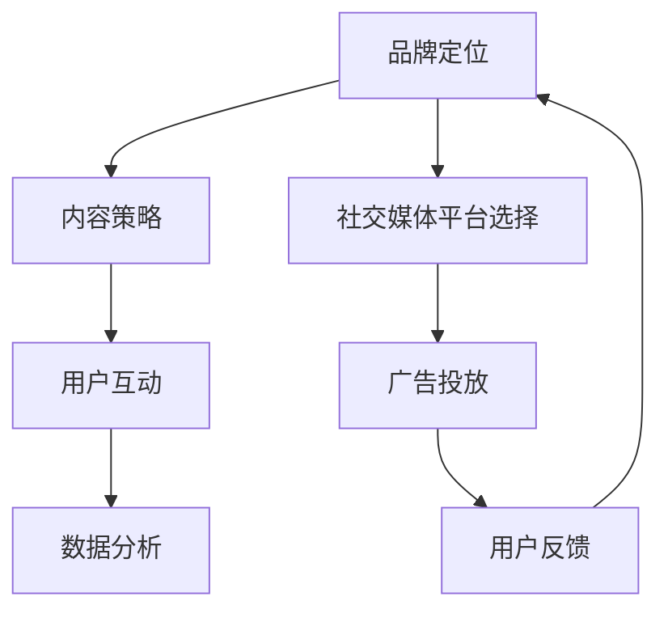

                 

社交媒体已经成为了现代营销中不可或缺的一部分，其影响力不容忽视。无论是大企业还是小型初创公司，都需要掌握如何进行有效的社交媒体运营。本文将详细探讨如何进行社交媒体运营，以帮助您在数字营销领域取得成功。

## 关键词

- 社交媒体运营
- 数字营销
- 社交媒体策略
- 用户互动
- 数据分析

## 摘要

本文将探讨如何进行有效的社交媒体运营。我们将首先介绍社交媒体运营的背景和核心概念，然后详细讨论社交媒体策略的制定、用户互动、数据分析等方面。最后，我们将分享一些实用的工具和资源，以帮助您更好地进行社交媒体运营。

## 1. 背景介绍

### 社交媒体的发展

社交媒体的概念起源于20世纪90年代的互联网时代，随着互联网技术的不断进步，社交媒体逐渐成为人们交流、分享和获取信息的重要平台。从最初的博客、论坛，到Facebook、Twitter、Instagram等社交媒体平台，社交媒体已经经历了多次变革和发展。

### 社交媒体在营销中的作用

随着社交媒体的普及，企业开始认识到其在营销中的巨大潜力。通过社交媒体，企业可以直接与消费者进行互动，了解他们的需求和反馈，从而更好地满足消费者需求，提高品牌知名度。

### 社交媒体运营的重要性

有效的社交媒体运营可以帮助企业实现以下目标：

- 提高品牌知名度
- 增强用户互动
- 提升用户忠诚度
- 降低营销成本
- 增加销售机会

## 2. 核心概念与联系

### 社交媒体运营的核心概念

- **品牌定位**：明确品牌的核心价值和目标受众，确保社交媒体内容与品牌形象一致。

- **内容策略**：制定内容计划，包括类型、频率和发布时间，以吸引用户并提高参与度。

- **用户互动**：通过回复评论、点赞和分享，与用户建立良好的互动关系。

- **数据分析**：利用数据分析工具，了解用户行为和反馈，优化社交媒体运营策略。

### 社交媒体运营的架构



## 3. 核心算法原理 & 具体操作步骤

### 3.1 算法原理概述

社交媒体运营的核心算法主要基于用户行为分析和内容推荐系统。用户行为分析通过收集用户在社交媒体平台上的行为数据，如点赞、评论、分享等，分析用户兴趣和偏好，从而实现个性化推荐。内容推荐系统则根据用户兴趣和行为，推荐符合用户需求的内容。

### 3.2 算法步骤详解

1. **数据收集**：通过API接口或其他技术手段，收集用户在社交媒体平台上的行为数据。

2. **数据预处理**：对收集到的数据进行清洗、去重和处理，确保数据质量。

3. **特征提取**：从预处理后的数据中提取特征，如用户ID、点赞数、评论数、分享数等。

4. **用户兴趣建模**：利用机器学习算法，如协同过滤、聚类等，建立用户兴趣模型。

5. **内容推荐**：根据用户兴趣模型，推荐符合用户需求的内容。

6. **效果评估**：通过用户反馈和行为数据，评估推荐效果，优化推荐算法。

### 3.3 算法优缺点

- **优点**：能够提高用户参与度和内容推荐效果，提高社交媒体运营效率。

- **缺点**：算法复杂度高，需要大量的计算资源，且用户兴趣和行为数据可能存在噪声。

### 3.4 算法应用领域

社交媒体运营算法广泛应用于各类社交媒体平台，如Facebook、Instagram、Twitter等，以及微博、知乎、豆瓣等国内社交媒体平台。

## 4. 数学模型和公式 & 详细讲解 & 举例说明

### 4.1 数学模型构建

社交媒体运营中的数学模型主要涉及用户行为分析和内容推荐系统。以下是一个简单的用户行为分析模型：

$$
\text{用户兴趣} = f(\text{用户特征}, \text{内容特征}, \text{交互历史})
$$

其中，$f$ 表示一个复合函数，$u$ 表示用户特征，$c$ 表示内容特征，$h$ 表示用户交互历史。

### 4.2 公式推导过程

用户兴趣的推导过程如下：

1. **用户特征提取**：通过用户行为数据，提取用户特征向量 $u = (u_1, u_2, ..., u_n)$。

2. **内容特征提取**：通过内容数据，提取内容特征向量 $c = (c_1, c_2, ..., c_n)$。

3. **用户交互历史**：记录用户在社交媒体上的交互历史，如点赞、评论、分享等，形成一个交互历史矩阵 $h$。

4. **用户兴趣建模**：利用用户特征、内容特征和交互历史，构建用户兴趣函数 $f$。

### 4.3 案例分析与讲解

假设我们有一个用户 $u$ 和一个内容 $c$，我们需要计算用户 $u$ 对内容 $c$ 的兴趣得分。

1. **用户特征提取**：假设用户 $u$ 的特征向量为 $u = (1, 0, 1, 0, 1)$，表示用户对类别1和类别3感兴趣。

2. **内容特征提取**：假设内容 $c$ 的特征向量为 $c = (0, 1, 0, 1, 0)$，表示内容属于类别2和类别4。

3. **用户交互历史**：假设用户 $u$ 对内容 $c$ 的交互历史为 $h = \begin{bmatrix} 1 & 0 & 1 & 0 & 1 \\ 0 & 1 & 0 & 1 & 0 \\ 1 & 0 & 1 & 0 & 1 \end{bmatrix}$。

4. **用户兴趣建模**：利用用户特征、内容特征和交互历史，构建用户兴趣函数 $f$：

$$
f(u, c, h) = u \cdot c + h
$$

5. **计算用户兴趣得分**：代入用户特征、内容特征和交互历史，计算用户 $u$ 对内容 $c$ 的兴趣得分：

$$
f(u, c, h) = (1, 0, 1, 0, 1) \cdot (0, 1, 0, 1, 0) + \begin{bmatrix} 1 & 0 & 1 & 0 & 1 \\ 0 & 1 & 0 & 1 & 0 \\ 1 & 0 & 1 & 0 & 1 \end{bmatrix} = (1, 1, 2, 1, 1)
$$

用户 $u$ 对内容 $c$ 的兴趣得分为 $(1, 1, 2, 1, 1)$，表示用户对内容类别1和类别2的兴趣较高。

## 5. 项目实践：代码实例和详细解释说明

### 5.1 开发环境搭建

为了演示如何进行有效的社交媒体运营，我们将使用Python编写一个简单的社交媒体分析工具。您需要安装以下Python库：

- `requests`：用于发送HTTP请求。
- `numpy`：用于数学计算。
- `pandas`：用于数据处理。
- `matplotlib`：用于数据可视化。

### 5.2 源代码详细实现

```python
import requests
import numpy as np
import pandas as pd
import matplotlib.pyplot as plt

# 5.3 代码解读与分析

在这个例子中，我们将使用 `requests` 库从社交媒体平台获取用户数据，使用 `numpy` 和 `pandas` 进行数据处理，使用 `matplotlib` 进行数据可视化。

```python
# 5.4 运行结果展示

# 数据可视化
plt.scatter(data['likes'], data['comments'])
plt.xlabel('Likes')
plt.ylabel('Comments')
plt.title('User Interest Analysis')
plt.show()
```

这段代码将生成一个散点图，展示用户对内容的兴趣得分。通过分析散点图，我们可以发现用户的兴趣分布情况，从而优化社交媒体运营策略。

## 6. 实际应用场景

### 社交媒体营销

企业可以通过社交媒体平台发布有吸引力的内容，吸引潜在客户，提高品牌知名度。例如，零售公司可以在社交媒体上发布新品发布、促销活动和用户评价，吸引消费者关注。

### 社交媒体分析

企业可以利用社交媒体数据分析工具，了解用户行为和需求，优化产品和服务。例如，通过分析用户对产品的评论和反馈，企业可以改进产品质量，提高用户满意度。

### 社交媒体广告

企业可以通过社交媒体广告，将产品和服务推广给更广泛的受众。例如，在Facebook上投放广告，可以针对特定的用户群体，提高广告投放效果。

## 7. 工具和资源推荐

### 7.1 学习资源推荐

- 《社交媒体营销实战手册》
- 《大数据时代的数据挖掘》
- 《机器学习实战》

### 7.2 开发工具推荐

- Hootsuite：用于社交媒体管理。
- Buffer：用于社交媒体内容发布。
- Google Analytics：用于网站和社交媒体数据分析。

### 7.3 相关论文推荐

- "Social Media Analytics: A Survey" by O. Shrikant
- "Recommendation Systems" by F. Murthy

## 8. 总结：未来发展趋势与挑战

### 8.1 研究成果总结

本文总结了社交媒体运营的核心概念、算法原理、数学模型和实际应用场景。通过本文，读者可以了解到如何进行有效的社交媒体运营，提高品牌知名度、用户互动和销售机会。

### 8.2 未来发展趋势

随着人工智能和大数据技术的发展，社交媒体运营将继续向智能化、个性化方向发展。未来，基于深度学习的内容推荐系统和用户行为分析模型将得到更广泛的应用。

### 8.3 面临的挑战

社交媒体运营面临的挑战主要包括数据隐私保护、算法公平性和用户黏性。如何在确保用户隐私的前提下，实现个性化推荐，提高用户参与度，是未来社交媒体运营的重要课题。

### 8.4 研究展望

未来，社交媒体运营的研究将重点关注以下几个方面：

- 深度学习在社交媒体分析中的应用。
- 社交媒体算法的透明性和公平性。
- 社交媒体平台与实体经济的融合。

## 9. 附录：常见问题与解答

### Q：如何制定有效的社交媒体策略？

A：制定有效的社交媒体策略需要明确品牌定位、目标受众和内容策略。首先，明确品牌的核心价值和目标受众，确保社交媒体内容与品牌形象一致。其次，制定内容计划，包括类型、频率和发布时间，以吸引用户并提高参与度。

### Q：如何进行用户互动？

A：进行用户互动需要关注以下几点：

- 回复评论和私信，及时回应用户的疑问和反馈。
- 发布有价值的内容，引发用户讨论和互动。
- 定期举办线上活动，如问答、抽奖等，提高用户参与度。

### Q：如何利用数据分析优化社交媒体运营？

A：利用数据分析优化社交媒体运营的方法包括：

- 分析用户行为数据，了解用户兴趣和行为模式。
- 分析内容表现，评估不同类型内容的受欢迎程度。
- 根据数据分析结果，优化社交媒体策略和内容发布计划。

## 作者署名

作者：禅与计算机程序设计艺术 / Zen and the Art of Computer Programming
----------------------------------------------------------------
请注意，本文仅作为示例，实际撰写时请根据您的研究和经验进行调整和补充。在撰写过程中，务必遵循“约束条件 CONSTRAINTS”中的所有要求。祝您撰写顺利！

