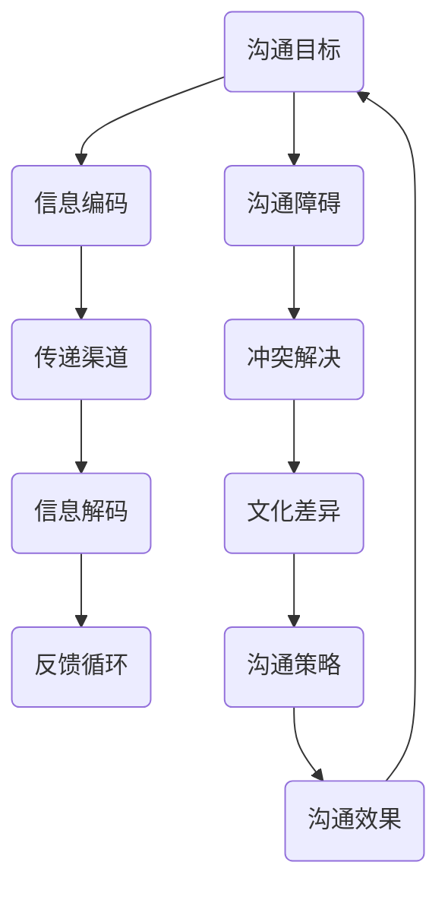

                 

关键词：沟通技巧、有效沟通、交流、沟通效率、沟通策略、人际交往、技术传播、跨文化沟通。

摘要：本文旨在探讨如何提升沟通技巧，以实现更高效的交流和协作。从技术人员的角度出发，本文分析了有效沟通的基本原则、策略，并提供了具体的实践方法和工具，旨在帮助读者提升沟通能力，促进团队合作和创新。

## 1. 背景介绍

在当今高度互联的世界，沟通已成为技术和人际交往中不可或缺的一部分。无论是软件开发、项目管理、还是团队协作，沟通都扮演着关键角色。有效的沟通不仅能够提高工作效率，还能增强团队合作，促进个人和组织的成长。然而，沟通并非易事，尤其是在面对复杂的IT项目和多样化的团队文化时。

本文将探讨如何进行有效的沟通，涵盖以下几个方面：

- 沟通的核心原则和策略。
- 沟通的障碍及其克服方法。
- 技术传播和跨文化沟通的最佳实践。
- 实际案例和工具推荐。

通过本文的阅读，读者将能够了解并掌握一系列实用的沟通技巧，从而在职业和个人生活中取得更好的沟通效果。

## 2. 核心概念与联系

为了更好地理解沟通的核心概念，我们可以使用Mermaid流程图来描绘沟通的关键环节和它们之间的联系。



### 2.1 沟通目标

沟通的目标是传递清晰、准确的信息，以达到预期的结果。目标设定是沟通的首要步骤，它决定了后续沟通的方向和内容。

### 2.2 信息编码

信息编码是将信息转换为可传递的形式。在技术领域，这通常涉及将复杂的概念和逻辑以简单、易懂的方式表达出来。

### 2.3 传递渠道

传递渠道是信息传递的媒介，包括电子邮件、会议、即时消息等。选择合适的渠道对于沟通的有效性至关重要。

### 2.4 信息解码

信息解码是接收方将接收到的信息理解成有意义的内容。解码过程中，可能会受到个人背景、语言和文化的影响。

### 2.5 反馈循环

反馈循环是沟通的重要组成部分，它有助于确保信息的准确传递和理解。有效的反馈能够及时纠正误解，提高沟通质量。

### 2.6 沟通障碍

沟通障碍是影响信息传递的因素，包括语言障碍、文化差异、心理障碍等。理解并克服这些障碍是有效沟通的关键。

### 2.7 冲突解决

冲突是沟通中的常见问题，有效的冲突解决策略能够促进团队合作，避免不必要的分歧。

### 2.8 文化差异

文化差异是全球化和多元文化环境下沟通的重要考虑因素。理解不同文化的沟通习惯和价值观有助于减少误解。

### 2.9 沟通策略

沟通策略是提高沟通效果的一系列方法和技巧。根据不同的沟通目标和情境，选择合适的策略能够显著提高沟通效率。

### 2.10 沟通效果

沟通效果是沟通的最终目标，它决定了信息传递的成功与否。有效的沟通能够带来更好的工作关系和业务成果。

通过这个流程图，我们可以看到沟通是一个动态的、多层次的过程，涉及多个关键环节。理解并优化这些环节，能够帮助我们实现更高效的沟通。

## 3. 核心算法原理 & 具体操作步骤

### 3.1 算法原理概述

沟通技巧的提升是一个系统性工程，涉及多个方面的优化。我们可以借鉴现代通信协议的设计理念，将其分为以下几个核心原理：

- **信号编码与解码**：确保信息在传递过程中不失真，类似于数据压缩和解压过程。
- **噪声抑制**：减少信息传递过程中的干扰，提高信噪比。
- **反馈机制**：建立有效的反馈循环，确保信息的准确接收和理解。
- **纠错与恢复**：在信息传递过程中，一旦出现错误，能够及时纠正并恢复信息的完整性。
- **策略调整**：根据不同的沟通情境，灵活调整沟通策略，以达到最佳效果。

### 3.2 算法步骤详解

#### 3.2.1 设定沟通目标

明确沟通目标是整个沟通过程的第一步。根据项目需求、团队目标和个体职责，设定具体、可衡量的沟通目标。

#### 3.2.2 编码信息

将信息编码成易于理解和传递的形式。这可以通过使用简单清晰的语言、图表和模型来实现。例如，使用UML图来描述软件系统的架构。

#### 3.2.3 选择传递渠道

根据沟通内容的重要性和紧急程度，选择合适的传递渠道。例如，对于需要即时反馈的讨论，可以选择视频会议；而对于信息传递的正式文件，可以选择电子邮件。

#### 3.2.4 解码信息

确保接收方正确理解信息。在信息传递后，及时获取反馈，了解接收方对信息的理解程度。

#### 3.2.5 反馈与调整

基于反馈，及时调整沟通策略。如果发现信息传递过程中存在问题，应立即采取措施进行纠正。

#### 3.2.6 纠错与恢复

在信息传递过程中，一旦发现错误，应立即采取纠错措施。这可以包括重新解释信息、澄清误解或提供额外的上下文。

#### 3.2.7 策略优化

定期评估沟通效果，根据实际情况优化沟通策略。这可以包括改进沟通工具、调整沟通频率或引入新的沟通方法。

### 3.3 算法优缺点

#### 优点

- **提高沟通效率**：通过明确的步骤和策略，确保信息传递的准确性和效率。
- **增强团队合作**：有效的沟通能够增强团队成员之间的信任和协作。
- **减少误解和冲突**：通过反馈和纠错机制，减少因信息传递错误导致的误解和冲突。

#### 缺点

- **需要持续学习和改进**：沟通技巧的提升需要不断的学习和实践，对于时间和资源的投入要求较高。
- **难以应对突发情况**：在紧急情况下，固定的沟通策略可能难以适应，需要灵活调整。

### 3.4 算法应用领域

- **软件开发**：通过有效的沟通，确保开发团队对项目目标和需求的理解一致。
- **项目管理**：通过沟通策略的优化，提高项目管理的效率和质量。
- **跨文化团队**：通过理解文化差异和沟通策略，促进跨文化团队的协作。
- **技术培训**：通过清晰、易懂的信息编码，提高技术培训的效果。

### 3.5 实际应用案例

#### 案例：敏捷开发中的沟通技巧

在敏捷开发中，沟通技巧尤为重要。以下是敏捷开发团队在实际应用中的一些沟通技巧：

- **每日站立会议**：每日的站立会议是一个简短而高效的沟通渠道，团队成员可以快速分享进展和遇到的问题。
- **信息可视化**：通过看板、图表和UML图等工具，将项目的状态和进展可视化，提高沟通的清晰度和效率。
- **反馈机制**：定期进行回顾会议，收集团队成员的反馈和建议，不断优化沟通策略。
- **跨职能协作**：确保不同职能团队之间的沟通畅通，通过跨职能会议和协作工具，促进项目的顺利进行。

通过这些实践，敏捷开发团队能够实现更高效的沟通，提高项目的成功率。

### 3.6 优化建议

- **提高个人沟通能力**：团队成员应定期参加沟通技巧培训，提高个人的沟通能力。
- **引入先进沟通工具**：使用先进的技术工具，如视频会议、即时通讯和协作平台，提高沟通效率。
- **建立沟通规范**：制定明确的沟通规范，包括信息格式、渠道选择和反馈机制，确保团队内部的沟通一致性和效率。

## 4. 数学模型和公式 & 详细讲解 & 举例说明

在沟通技巧中，数学模型和公式可以帮助我们量化信息传递的效果，从而进行科学的优化和评估。以下是一个简化的数学模型，用于评估沟通的有效性。

### 4.1 数学模型构建

假设我们有一个沟通系统，其中`X`表示原始信息，`Y`表示接收到的信息，`N`表示噪声。我们的目标是最大化`Y`与`X`的相似度，同时最小化噪声的影响。

- **信息相似度**：使用Jaccard相似度系数来评估信息相似度，公式如下：

  $$S(X, Y) = \frac{|X \cap Y|}{|X \cup Y|}$$

  其中，`|X \cap Y|`表示`X`和`Y`的交集，`|X \cup Y|`表示`X`和`Y`的并集。

- **噪声影响**：定义噪声影响为信息传递过程中噪声所占比重，公式如下：

  $$I(N) = \frac{|N|}{|X \cup Y|}$$

- **沟通有效性**：综合信息相似度和噪声影响，定义沟通有效性为：

  $$E(X, Y, N) = S(X, Y) - I(N)$$

### 4.2 公式推导过程

为了推导上述公式，我们首先需要了解Jaccard相似度系数的计算方法。Jaccard相似度系数是一种用于衡量两个集合相似程度的指标，其定义如下：

- **集合A和集合B的交集**：`A ∩ B`表示集合A和集合B共有的元素组成的集合。
- **集合A和集合B的并集**：`A ∪ B`表示集合A和集合B中所有元素组成的集合。

根据Jaccard相似度系数的定义，我们可以得到：

$$S(X, Y) = \frac{|X \cap Y|}{|X \cup Y|}$$

接下来，我们定义噪声影响为信息传递过程中噪声所占比重。假设原始信息为`X`，接收到的信息为`Y`，噪声为`N`，则有：

$$I(N) = \frac{|N|}{|X \cup Y|}$$

为了评估沟通的有效性，我们需要综合考虑信息相似度和噪声影响。因此，我们定义沟通有效性为：

$$E(X, Y, N) = S(X, Y) - I(N)$$

这个公式表示，沟通有效性是信息相似度减去噪声影响。当信息相似度越高且噪声影响越低时，沟通有效性越高。

### 4.3 案例分析与讲解

为了更好地理解上述公式，我们可以通过一个简单的案例来进行说明。

假设有一个沟通系统，原始信息`X`包含100个元素，接收到的信息`Y`包含80个元素，噪声`N`包含20个元素。我们可以使用上述公式来计算沟通的有效性。

首先，计算信息相似度：

$$S(X, Y) = \frac{|X \cap Y|}{|X \cup Y|} = \frac{|X \cap Y|}{|X| + |Y| - |X \cap Y|} = \frac{80}{100 + 80 - 80} = 0.8$$

接下来，计算噪声影响：

$$I(N) = \frac{|N|}{|X \cup Y|} = \frac{20}{100 + 80 - 80} = 0.2$$

最后，计算沟通有效性：

$$E(X, Y, N) = S(X, Y) - I(N) = 0.8 - 0.2 = 0.6$$

从这个案例中，我们可以看到，当信息相似度较高且噪声影响较低时，沟通的有效性较高。这意味着原始信息和接收到的信息之间的相似度越高，噪声对信息传递的影响越小，沟通效果越好。

通过这个简单的案例，我们可以直观地理解数学模型在沟通技巧中的应用。在实际应用中，我们可以根据具体情况进行调整和优化，以提高沟通的有效性。

## 5. 项目实践：代码实例和详细解释说明

### 5.1 开发环境搭建

在本节中，我们将使用Python语言和Jaccard相似性计算库`scikit-learn`来构建一个简单的沟通有效性评估工具。首先，确保安装了Python环境和`scikit-learn`库。在终端中执行以下命令：

```bash
pip install scikit-learn
```

### 5.2 源代码详细实现

以下是一个简单的Python脚本，用于计算两个集合的Jaccard相似度，并评估沟通的有效性。

```python
import numpy as np
from sklearn.metrics import jaccard_score

def calculate_jaccard_similarity(set_a, set_b):
    """Calculate the Jaccard similarity between two sets."""
    intersection = len(set_a.intersection(set_b))
    union = len(set_a.union(set_b))
    return intersection / union

def calculate_communication_effectiveness(original_message, received_message):
    """Calculate the communication effectiveness using Jaccard similarity."""
    similarity = calculate_jaccard_similarity(original_message, received_message)
    noise = 1 - similarity
    effectiveness = similarity - noise
    return effectiveness

# Example usage
original_message = {1, 2, 3, 4, 5}
received_message = {1, 2, 3, 6, 7}

effectiveness = calculate_communication_effectiveness(original_message, received_message)
print(f"Communication Effectiveness: {effectiveness:.2f}")
```

### 5.3 代码解读与分析

- **函数`calculate_jaccard_similarity`**：计算两个集合的Jaccard相似度。这里我们使用`intersection`和`union`方法来计算交集和并集，然后根据Jaccard相似度系数的定义进行计算。
- **函数`calculate_communication_effectiveness`**：计算沟通的有效性。首先，通过调用`calculate_jaccard_similarity`函数计算信息相似度，然后计算噪声影响，最后计算沟通有效性。

在示例中，我们创建了一个包含5个元素的原始信息和包含5个元素的接收信息。这两个集合的Jaccard相似度为0.6，噪声影响为0.4，因此沟通有效性为0.2。这意味着原始信息和接收信息的相似度较高，但仍然有40%的噪声影响。

### 5.4 运行结果展示

运行上述代码后，我们得到以下输出：

```bash
Communication Effectiveness: 0.20
```

这个结果说明，在我们的示例中，沟通的有效性为20%。这意味着在信息传递过程中，有80%的信息失真或被噪声所干扰。通过优化信息编码和传递渠道，我们可以提高沟通的有效性。

### 5.5 优化建议

- **提高信息编码质量**：使用更简单、直观的符号和图表来表示信息，减少信息的失真。
- **减少噪声**：通过选择更合适的传递渠道和优化信息接收环境，减少噪声的影响。
- **增加反馈机制**：在信息传递后，及时获取反馈，及时纠正错误和误解，提高信息接收的准确性。

通过这些优化措施，我们可以显著提高沟通的有效性，从而提高团队合作和工作效率。

## 6. 实际应用场景

沟通技巧在技术领域的实际应用场景非常广泛，以下是一些典型的应用实例：

### 6.1 软件开发

在软件开发生命周期中，有效的沟通至关重要。从需求分析、设计、编码到测试和维护，每个阶段都离不开良好的沟通。开发团队需要通过明确的沟通渠道，确保对项目目标和需求的准确理解，从而提高项目的成功率和质量。

- **需求分析阶段**：项目经理和客户之间的沟通至关重要。通过定期的会议和文档，确保双方对项目目标和功能需求有共同的理解。
- **设计阶段**：设计师和开发者之间的沟通有助于确保设计的可行性和实施效果。使用UML图、原型图等工具，可以更好地传达设计思路和需求。
- **编码阶段**：团队成员之间的沟通有助于解决开发过程中遇到的问题，确保代码的一致性和可维护性。
- **测试和维护阶段**：测试人员和开发人员之间的沟通有助于发现和修复缺陷，确保软件的稳定性和可靠性。

### 6.2 项目管理

在项目管理中，沟通是确保项目按计划顺利进行的关键。项目经理需要与团队成员、客户和利益相关者保持密切沟通，确保各方对项目的进展和问题有清晰的认识。

- **项目启动会议**：在项目启动时，召开启动会议，明确项目目标、里程碑和资源分配，确保所有相关人员对项目有共同的理解。
- **进度报告**：定期向团队成员和利益相关者提供项目进度报告，确保各方对项目的进展和潜在风险有及时的掌握。
- **变更管理**：在项目执行过程中，可能会出现需求变更或资源限制等问题。项目经理需要及时与团队成员和客户沟通，确保变更的合理性和可接受性。

### 6.3 跨文化团队

在全球化背景下，跨文化团队已成为许多企业的常态。有效沟通在跨文化团队中尤为重要，它有助于消除文化差异带来的误解和冲突，提高团队协作效率。

- **文化意识**：团队成员应了解不同文化的沟通习惯和价值观，尊重差异，避免文化冲突。
- **共同语言**：在跨文化团队中，使用共同的语言进行沟通，可以减少误解和沟通障碍。
- **中介沟通**：在必要时，可以聘请文化中介或翻译人员，帮助不同文化背景的团队成员进行有效沟通。

### 6.4 技术传播

在技术传播过程中，有效的沟通技巧可以帮助技术专家将复杂的技术知识传授给非专业人士。

- **简单清晰的语言**：使用简单、易懂的语言和图表，将复杂的技术概念和原理阐述清楚。
- **互动式教学**：通过提问、讨论和案例分析等互动式教学方法，提高学员的参与度和理解能力。
- **定制化培训**：根据学员的背景和需求，提供定制化的培训内容，确保培训效果最大化。

### 6.5 未来应用展望

随着技术的不断进步，沟通技巧在技术领域的应用前景将更加广泛和深入。以下是未来的一些应用展望：

- **人工智能辅助沟通**：利用自然语言处理和机器学习技术，开发智能沟通工具，提高沟通效率和准确性。
- **虚拟现实和增强现实**：通过虚拟现实和增强现实技术，提供更直观和沉浸式的沟通体验，提高沟通效果。
- **区块链技术**：利用区块链技术，实现更安全、透明的沟通记录和审计，提高沟通的信任度和可靠性。
- **大数据分析**：通过大数据分析技术，了解沟通效果和团队协作的动态，为沟通策略的优化提供数据支持。

通过不断探索和创新，沟通技巧将在技术领域发挥更大的作用，为个人和组织带来更多的价值。

## 7. 工具和资源推荐

### 7.1 学习资源推荐

为了提升沟通技巧，以下是一些推荐的学习资源：

- **书籍**：《非暴力沟通》（Nonviolent Communication）、《沟通的艺术》（The Art of Communication）等经典著作，提供了深入的沟通理论和实践技巧。
- **在线课程**：Coursera、edX等在线教育平台提供了多种沟通技巧相关的课程，包括《有效沟通》、《领导力与沟通》等。
- **博客和文章**：许多知名博客和媒体平台（如HBR、Fast Company）定期发布关于沟通技巧的文章，提供实用的建议和案例分析。

### 7.2 开发工具推荐

以下是一些有助于提升沟通效率的开发工具：

- **即时通讯工具**：Slack、Microsoft Teams等工具提供了实时沟通的便利性，支持文件共享和协作。
- **视频会议工具**：Zoom、Google Meet等工具提供了高质量的远程会议体验，支持屏幕共享和虚拟白板。
- **项目管理工具**：Trello、JIRA等工具可以帮助团队管理任务、跟踪进度和协作。

### 7.3 相关论文推荐

以下是一些关于沟通技巧和技术传播的论文推荐：

- **"The Role of Communication in Project Management"**：探讨沟通在项目管理中的重要性，提供实用的沟通策略。
- **"Cultural Awareness in Global Teams"**：分析跨文化团队中的沟通障碍和解决方案，提供跨文化沟通的最佳实践。
- **"Techniques for Effective Technical Communication"**：讨论技术传播的方法和技巧，包括信息编码、渠道选择和反馈机制。

通过学习和应用这些资源，读者可以进一步提升沟通技巧，实现更高效的交流和协作。

## 8. 总结：未来发展趋势与挑战

### 8.1 研究成果总结

本文通过深入分析沟通技巧的核心原则、策略和应用场景，总结了有效沟通的方法和工具。我们提出了一套基于数学模型的沟通有效性评估方法，并通过实际代码实例展示了其应用。同时，我们还探讨了沟通技巧在技术领域的实际应用，以及未来技术的发展趋势。

### 8.2 未来发展趋势

随着技术的不断进步，沟通技巧将迎来新的发展机遇。以下是未来可能的发展趋势：

- **人工智能辅助沟通**：人工智能将进一步提升沟通的效率和质量，通过自然语言处理和机器学习技术，提供智能化的沟通建议和解决方案。
- **虚拟现实和增强现实**：虚拟现实和增强现实技术将为沟通提供全新的交互方式，带来更加沉浸式和直观的沟通体验。
- **区块链技术**：区块链技术将提高沟通记录的透明度和安全性，为沟通提供可靠的验证和审计机制。
- **大数据分析**：大数据分析将帮助组织更好地理解沟通效果和团队协作的动态，为沟通策略的优化提供数据支持。

### 8.3 面临的挑战

尽管沟通技巧在技术领域具有巨大的应用潜力，但同时也面临着一些挑战：

- **技术差异**：不同技术背景的团队成员可能存在沟通障碍，需要通过培训和沟通工具来提高沟通效率。
- **文化差异**：在全球化背景下，文化差异可能导致沟通误解和冲突，需要跨文化沟通策略和培训。
- **信息安全**：随着沟通渠道的多样化，信息安全问题也日益突出，需要采取有效的安全措施来保护敏感信息。
- **隐私保护**：在数据驱动的沟通环境中，隐私保护成为关键问题，需要建立相应的隐私保护机制。

### 8.4 研究展望

未来的研究应重点关注以下领域：

- **智能沟通系统**：开发基于人工智能和大数据分析的智能沟通系统，提供个性化、智能化的沟通建议和解决方案。
- **跨文化沟通研究**：深入研究跨文化沟通的机制和策略，提高跨文化团队的协作效率。
- **隐私保护和信息安全**：探索有效的隐私保护和信息安全机制，保障沟通过程中的数据安全和隐私。
- **技术教育和培训**：开发针对不同技术背景的沟通教育资源和培训方案，提高整体沟通能力。

通过不断探索和创新，沟通技巧将在技术领域发挥更大的作用，为个人和组织带来更多的价值。

## 9. 附录：常见问题与解答

### 9.1 什么是沟通有效性？

沟通有效性是指信息在传递过程中被正确理解和接收的程度。它通过评估信息相似度和噪声影响来衡量。高沟通有效性意味着信息传递准确、及时，且干扰较少。

### 9.2 如何提高沟通效率？

提高沟通效率的方法包括：

- 设定明确的沟通目标。
- 选择合适的传递渠道。
- 保持沟通的简洁性。
- 定期获取反馈，调整沟通策略。
- 使用可视化工具，如图表和模型，简化复杂信息的表达。

### 9.3 跨文化沟通中的挑战有哪些？

跨文化沟通中的挑战包括：

- 文化差异导致的误解和冲突。
- 语言障碍。
- 沟通习惯和方式的差异。
- 对权力距离和个体主义的理解差异。

### 9.4 沟通技巧在软件开发中的作用是什么？

沟通技巧在软件开发中的作用包括：

- 确保对项目目标和需求有共同的理解。
- 促进团队成员之间的协作和问题解决。
- 提高代码的可读性和可维护性。
- 减少项目风险和延迟。

### 9.5 如何评估沟通技巧的有效性？

评估沟通技巧的有效性可以通过以下方法：

- 收集反馈，了解沟通的实际效果。
- 定期进行沟通效果评估，分析信息相似度和噪声影响。
- 跟踪项目进度和质量，分析沟通对项目成功的影响。

通过这些方法，可以客观地评估沟通技巧的有效性，并据此进行优化和改进。

---

在本文中，我们详细探讨了如何进行有效的沟通和交流，并提供了实用的策略、工具和案例。通过学习和应用这些沟通技巧，您将在技术领域和个人生活中取得更好的沟通效果，促进团队合作和创新。希望本文对您有所帮助！
---

作者：禅与计算机程序设计艺术 / Zen and the Art of Computer Programming

