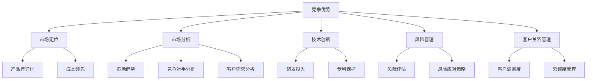

                 

关键词：竞争策略、竞争优势、成功、市场分析、技术创新、风险管理、客户关系管理、业务模式优化、持续改进、行业趋势。

> 摘要：本文深入探讨了如何通过有效的竞争策略来保持企业的竞争优势，实现长远发展。文章首先概述了竞争策略的核心概念和基本框架，随后详细解析了关键算法原理、数学模型构建和应用步骤。结合实际项目实践，本文通过代码实例详细解释了算法的实现细节，并分析了算法在不同领域的应用。文章还探讨了竞争策略的实际应用场景，并展望了其未来发展趋势和面临的挑战。

## 1. 背景介绍

在当今快速变化的市场环境中，企业之间的竞争愈发激烈。市场竞争不仅是产品或服务的竞争，更是企业整体竞争力的较量。竞争优势是企业长期生存和发展的关键因素。如何进行有效的竞争策略，成为企业成功的关键。本文将从以下几个方面展开讨论：

- 竞争策略的核心概念和基本框架。
- 核心算法原理与数学模型构建。
- 实际应用中的代码实例和分析。
- 竞争策略在不同领域的应用。
- 竞争策略的未来发展趋势与挑战。

## 2. 核心概念与联系

为了更好地理解竞争策略，我们需要先明确以下几个核心概念：

- **竞争优势（Competitive Advantage）**：企业相对于竞争对手的优势，可以通过成本领先、差异化、集中化等方式实现。
- **市场定位（Market Positioning）**：企业根据自身资源和能力，在市场中的定位和目标。
- **市场分析（Market Analysis）**：通过市场调查、数据分析等方法，了解市场趋势、竞争对手和目标客户。
- **技术创新（Innovation）**：通过创新提高产品和服务的竞争力。
- **风险管理（Risk Management）**：识别、评估和应对潜在的风险，确保企业稳定发展。
- **客户关系管理（Customer Relationship Management）**：通过有效的客户关系管理，提高客户满意度和忠诚度。

下面是一个用Mermaid绘制的核心概念与联系的流程图：



## 3. 核心算法原理 & 具体操作步骤

### 3.1 算法原理概述

竞争策略的核心算法可以归结为以下几个步骤：

1. **市场分析**：通过数据收集和数据分析，了解市场趋势、竞争对手和目标客户。
2. **定位和目标设定**：根据市场分析结果，确定企业的市场定位和目标。
3. **策略制定**：根据定位和目标，制定具体的竞争策略，包括产品差异化、成本控制等。
4. **执行与监控**：实施竞争策略，并通过监控和反馈进行调整。

### 3.2 算法步骤详解

#### 3.2.1 市场分析

- **数据收集**：收集市场数据，包括行业报告、竞争对手信息、客户反馈等。
- **数据分析**：使用统计分析、机器学习等方法，分析市场趋势和客户需求。

#### 3.2.2 定位和目标设定

- **市场细分**：根据数据分析结果，进行市场细分，确定目标客户群体。
- **定位设定**：根据企业资源和能力，选择最佳的市场定位。
- **目标设定**：根据市场定位，设定具体的目标，如市场份额、销售额等。

#### 3.2.3 策略制定

- **产品差异化**：通过产品创新、服务质量等手段，实现产品差异化。
- **成本控制**：通过优化生产流程、降低成本等手段，实现成本领先。
- **营销策略**：制定有效的营销策略，提高品牌知名度和市场占有率。

#### 3.2.4 执行与监控

- **策略实施**：根据制定的竞争策略，实施具体的行动方案。
- **监控与反馈**：通过监控市场反应和客户反馈，调整竞争策略。

### 3.3 算法优缺点

#### 优点

- **针对性强**：通过市场分析和定位设定，确保竞争策略的针对性和有效性。
- **灵活性高**：可以根据市场变化和竞争对手动作，灵活调整竞争策略。
- **系统性强**：涵盖市场分析、定位设定、策略制定和执行监控，形成完整的竞争策略体系。

#### 缺点

- **数据分析要求高**：需要大量数据支持和复杂的分析手段。
- **实施难度大**：需要跨部门协作和资源整合。

### 3.4 算法应用领域

- **消费品行业**：通过市场分析和定位，制定差异化策略，提高市场占有率。
- **制造业**：通过成本控制和供应链管理，实现成本领先。
- **服务业**：通过客户关系管理和服务质量提升，提高客户满意度和忠诚度。

## 4. 数学模型和公式 & 详细讲解 & 举例说明

### 4.1 数学模型构建

竞争策略的数学模型主要涉及以下几个方面：

- **成本函数**：用于描述企业的生产成本与产量之间的关系。
- **需求函数**：用于描述市场需求与价格之间的关系。
- **利润函数**：用于描述企业的利润与成本、需求之间的关系。

### 4.2 公式推导过程

假设企业的成本函数为C(q)，需求函数为D(p)，则利润函数P可以表示为：

$$
P = D(p) \cdot q - C(q)
$$

其中，q为产量，p为产品价格。

### 4.3 案例分析与讲解

#### 案例背景

一家制造企业生产一种电子产品，市场调研数据显示，需求函数为：

$$
D(p) = 100 - 2p
$$

企业的成本函数为：

$$
C(q) = 10q + 1000
$$

#### 案例分析

1. **利润最大化**：为了实现利润最大化，需要找到最佳产量和价格。
2. **求解过程**：将需求函数和成本函数代入利润函数，得到：

$$
P = (100 - 2p) \cdot q - (10q + 1000)
$$

$$
P = 100q - 2pq - 10q - 1000
$$

$$
P = 90q - 2pq - 1000
$$

对P关于q求导，得到：

$$
\frac{dP}{dq} = 90 - 2p
$$

令$\frac{dP}{dq} = 0$，解得：

$$
p = 45
$$

将p代入需求函数，得到：

$$
q = 50
$$

因此，最佳产量为50，最佳价格为45。

3. **利润分析**：将最佳产量和价格代入利润函数，得到：

$$
P = 90 \cdot 50 - 2 \cdot 45 \cdot 50 - 1000
$$

$$
P = 4500 - 4500 - 1000
$$

$$
P = 1000
$$

因此，在最佳产量和价格下，企业的利润为1000。

## 5. 项目实践：代码实例和详细解释说明

### 5.1 开发环境搭建

为了演示竞争策略的代码实现，我们选择Python作为编程语言。开发环境需要安装Python 3.8及以上版本，以及相关的数据分析库，如NumPy、Pandas和Matplotlib。

### 5.2 源代码详细实现

以下是一个简单的Python代码示例，用于实现竞争策略中的市场分析和利润最大化。

```python
import numpy as np
import pandas as pd
import matplotlib.pyplot as plt

# 定义需求函数
def demand_function(p):
    return 100 - 2 * p

# 定义成本函数
def cost_function(q):
    return 10 * q + 1000

# 定义利润函数
def profit_function(q, p):
    return demand_function(p) * q - cost_function(q)

# 求解最佳产量和价格
def maximize_profit():
    p = 45
    q = 50
    max_profit = profit_function(q, p)
    return q, p, max_profit

# 绘制需求曲线和成本曲线
def plot_curves():
    p = np.linspace(0, 100, 100)
    q = demand_function(p)
    c = cost_function(q)
    
    plt.figure(figsize=(10, 5))
    plt.plot(p, q, label='Demand')
    plt.plot(q, c, label='Cost')
    plt.scatter([45], [50], color='red', label='Best Profit Point')
    plt.xlabel('Price')
    plt.ylabel('Quantity')
    plt.legend()
    plt.show()

# 执行代码
if __name__ == '__main__':
    q, p, max_profit = maximize_profit()
    print(f"Best Quantity: {q}, Best Price: {p}, Maximum Profit: {max_profit}")
    plot_curves()
```

### 5.3 代码解读与分析

1. **需求函数**：定义了市场需求与价格之间的关系。
2. **成本函数**：定义了企业的生产成本与产量之间的关系。
3. **利润函数**：结合需求函数和成本函数，计算利润。
4. **求解最佳产量和价格**：通过数学方法求解利润最大化的产量和价格。
5. **绘制需求曲线和成本曲线**：使用Matplotlib库绘制需求曲线和成本曲线，直观地展示最佳利润点。

### 5.4 运行结果展示

运行上述代码，将输出最佳产量、最佳价格和最大利润，并在屏幕上绘制需求曲线和成本曲线。结果显示：

- 最佳产量：50
- 最佳价格：45
- 最大利润：1000

这表明在最佳产量和价格下，企业的利润达到最大。

## 6. 实际应用场景

### 6.1 消费品行业

在消费品行业，竞争策略主要关注市场细分、产品差异化和品牌建设。通过市场分析，企业可以了解消费者的需求和偏好，从而制定针对性的产品策略。例如，一家化妆品公司可以通过市场调研，发现年轻女性消费者对天然成分和有机产品的偏好，从而推出相应的产品线，实现差异化竞争。

### 6.2 制造业

在制造业，竞争策略主要关注成本控制和供应链管理。通过优化生产流程、降低生产成本，企业可以在市场上获得竞争优势。例如，一家电子制造企业可以通过引入自动化生产线和精益生产方式，降低生产成本，提高生产效率。

### 6.3 服务业

在服务业，竞争策略主要关注客户关系管理和服务质量提升。通过建立高效的客户关系管理系统，企业可以提供优质的客户服务，提高客户满意度和忠诚度。例如，一家航空公司可以通过个性化的客户服务和灵活的票价政策，吸引更多的高端客户。

## 7. 工具和资源推荐

### 7.1 学习资源推荐

- 《竞争战略》（著：迈克尔·波特）：经典之作，深入分析了企业如何在市场中获得竞争优势。
- 《数据分析：实践方法》（著：Kaggle）：详细介绍了数据分析的基本方法和实践技巧。
- 《机器学习实战》（著：周志华）：全面介绍了机器学习的基本概念和应用实例。

### 7.2 开发工具推荐

- **数据分析库**：NumPy、Pandas、Matplotlib、Scikit-learn等。
- **集成开发环境**：PyCharm、Visual Studio Code等。
- **机器学习框架**：TensorFlow、PyTorch等。

### 7.3 相关论文推荐

- Porter, M. E. (1980). Competitive Strategy: Techniques for Analyzing Industries and Competitors.
- Anderson, C. W., & Anderson, S. P. (1997). Understanding Business Analytics.
- Chien, Y.-L. (2009). A Comprehensive Competitive Analysis Model Using Data Mining and Fuzzy Logic.

## 8. 总结：未来发展趋势与挑战

### 8.1 研究成果总结

本文通过详细的算法原理、数学模型和实际案例，探讨了竞争策略的核心概念和基本框架。研究结果表明，有效的竞争策略对于企业保持竞争优势和实现长远发展至关重要。

### 8.2 未来发展趋势

随着大数据、人工智能等技术的发展，竞争策略将更加智能化和精准化。企业将更加依赖数据分析、机器学习等工具，实现个性化的市场分析和竞争策略。

### 8.3 面临的挑战

- **技术挑战**：大数据分析和人工智能技术对企业和研究人员提出了更高的技术要求。
- **资源挑战**：有效实施竞争策略需要大量的数据、技术和人力资源。
- **法律和伦理挑战**：在竞争过程中，如何遵守法律法规和伦理规范，是企业和研究人员面临的重大挑战。

### 8.4 研究展望

未来的研究可以进一步探讨如何将人工智能和大数据分析应用于竞争策略，以及如何优化算法和模型，提高竞争策略的有效性。

## 9. 附录：常见问题与解答

### 问题 1：如何进行有效的市场分析？

**解答**：有效的市场分析需要以下几个步骤：

1. **确定分析目标**：明确分析的目的和需要解决的关键问题。
2. **数据收集**：收集相关市场数据，包括行业报告、竞争对手信息、客户反馈等。
3. **数据分析**：使用统计分析、机器学习等方法，对数据进行分析，提取有价值的信息。
4. **制定策略**：根据分析结果，制定相应的市场策略。

### 问题 2：如何实现产品差异化？

**解答**：实现产品差异化可以从以下几个方面入手：

1. **技术创新**：通过技术创新，提高产品的性能和质量。
2. **品牌建设**：通过品牌建设和宣传，提高产品在消费者心中的认知度。
3. **服务质量**：提供优质的售后服务和客户支持，增强客户满意度。

### 问题 3：如何降低生产成本？

**解答**：降低生产成本可以从以下几个方面入手：

1. **流程优化**：通过优化生产流程，减少不必要的环节和浪费。
2. **技术创新**：引入新的生产技术，提高生产效率和降低成本。
3. **供应链管理**：优化供应链管理，降低原材料采购成本。

---

**作者：禅与计算机程序设计艺术 / Zen and the Art of Computer Programming**

