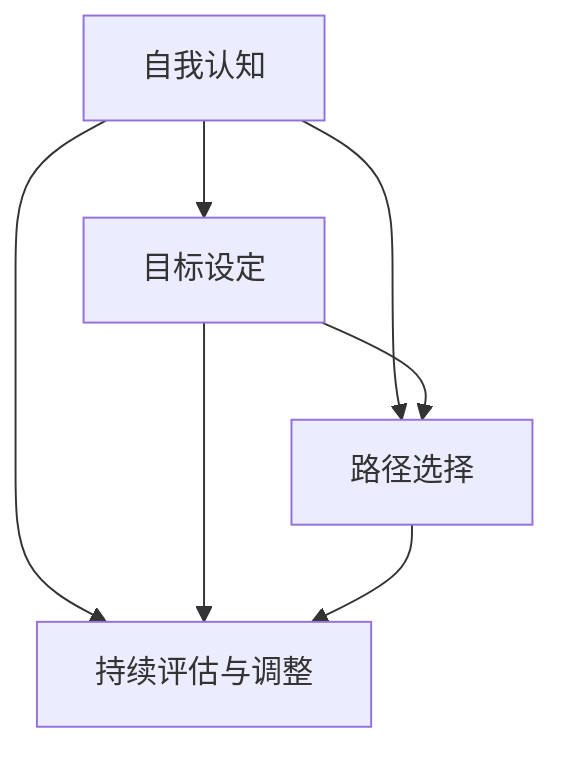

                 

关键词：职业规划，职业道路，自我认知，技能发展，行业趋势，职业成功

> 摘要：本文旨在探讨如何进行有效的职业规划，帮助读者找到适合自己的职业道路。通过深入分析职业规划的核心概念、理论基础以及实际操作步骤，结合个人成长和行业发展的视角，为职业人士提供一些建设性的建议和策略。

## 1. 背景介绍

在快速变化的现代社会，职业规划的重要性日益凸显。对于每个人来说，职业规划不仅关乎个人的发展和成就感，也影响到个人生活质量和幸福感。有效的职业规划可以帮助个人在职业生涯中明确目标、减少迷茫，从而实现个人与职业的协调发展。本文将从以下几个方面展开讨论：

1. 职业规划的核心概念与联系
2. 核心算法原理与具体操作步骤
3. 数学模型与公式详解及案例分析
4. 项目实践与代码实例
5. 实际应用场景与未来展望
6. 工具和资源推荐
7. 未来发展趋势与面临的挑战

通过这些内容的探讨，希望能够为读者提供有价值的指导，帮助他们在职业规划的道路上更加清晰和坚定。

### 1.1 职业规划的定义与核心概念

职业规划（Career Planning）是指个人在职业发展过程中，通过自我评估、目标设定、路径选择、持续评估与调整等一系列活动，以达到职业生涯的理想状态。其核心概念包括：

- **自我认知**：了解自己的兴趣、能力、价值观和性格特点，是进行有效职业规划的基础。
- **目标设定**：明确职业发展的长期和短期目标，有助于提供方向和动力。
- **路径选择**：根据个人特点和市场需求，选择适合自己的职业发展路径。
- **持续评估与调整**：职业生涯是一个动态过程，持续评估和调整可以确保职业规划的有效性。

这些核心概念相互关联，共同构成了职业规划的框架，为个人在职业发展中的每一步提供指导。

### 1.2 职业规划的理论基础

职业规划的理论基础主要包括：

- **能力-需求模型**：该模型认为职业成功取决于个人的能力与职业需求之间的匹配。了解自己的能力，寻找与之匹配的职业需求，是职业规划的重要环节。
- **职业锚理论**：职业锚是指个人在职业生涯中相对稳定且持久的动机和价值观。通过识别自己的职业锚，可以更加明确自己的职业发展方向。
- **生涯发展理论**：该理论强调职业生涯是一个不断发展的过程，个人需要通过不断学习、成长和适应，实现职业生涯的不同阶段目标。

这些理论基础为职业规划提供了科学依据和指导原则，帮助个人在复杂的职业环境中做出明智的决策。

## 2. 核心概念与联系

为了更好地理解职业规划的核心概念，下面将结合 Mermaid 流程图，展示各个核心概念之间的联系。



在这个流程图中，自我认知是职业规划的基础，通过了解自己的兴趣、能力、价值观等，可以帮助个人明确目标。目标设定为职业规划提供了明确的方向，而路径选择则是在目标指导下，根据个人特点和市场需求，确定职业发展的具体路线。持续评估与调整则确保职业规划能够适应不断变化的环境和个人成长。

### 2.1 自我认知

自我认知是职业规划的第一步，也是至关重要的一步。它包括以下几个方面：

- **兴趣与爱好**：了解自己喜欢做什么，能够帮助个人找到职业发展的方向。例如，喜欢编程的人可能会更倾向于选择IT行业。
- **能力与技能**：评估自己的技能和能力，包括专业技能、管理能力、沟通能力等。这些能力将直接影响个人的职业选择和发展速度。
- **价值观与动机**：了解自己的价值观和动机，能够帮助个人找到与自己价值观相符合的职业，从而提高职业满意度。

### 2.2 目标设定

目标设定是职业规划的核心。一个明确且具体的目标可以提供方向和动力，使个人在职业生涯中保持专注和持续进步。

- **长期目标**：通常涉及职业发展的最终方向和成就。例如，成为一名高级工程师或创业。
- **短期目标**：是实现长期目标的具体步骤和阶段性目标。例如，在一年内通过某个专业认证。

### 2.3 路径选择

路径选择是在自我认知和目标设定的基础上，根据市场需求和个人特点，选择适合自己的职业发展路径。常见的路径选择包括：

- **行业选择**：根据自己的兴趣和能力，选择一个具有发展潜力的行业。例如，技术行业、金融行业、教育行业等。
- **职位选择**：根据自己的能力和职业目标，选择一个合适的职位。例如，技术工程师、项目经理、产品经理等。
- **公司选择**：选择一个具有良好发展前景和培训机会的公司，有利于个人的职业成长。

### 2.4 持续评估与调整

职业规划不是一次性的过程，而是一个动态的、持续的过程。持续评估与调整可以帮助个人在职业生涯中保持适应性和灵活性。

- **定期评估**：定期对自己的职业发展进行评估，包括目标完成情况、个人成长等，确保职业规划的有效性。
- **反馈与调整**：根据反馈，对职业规划进行调整，以适应新的变化和需求。

通过自我认知、目标设定、路径选择和持续评估与调整，个人可以在职业规划的道路上更加清晰和坚定。接下来，我们将深入探讨核心算法原理与具体操作步骤，为职业规划提供更具体的指导。

## 3. 核心算法原理 & 具体操作步骤

在职业规划中，算法原理和操作步骤起到了至关重要的作用。以下将详细阐述核心算法原理，并分步骤介绍如何应用这些原理。

### 3.1 算法原理概述

职业规划算法可以看作是一个多阶段决策过程，其核心原理包括：

- **目标函数优化**：通过最大化利益或最小化损失，优化职业规划的目标。
- **风险评估与处理**：对职业规划过程中的各种风险进行识别、评估和处理。
- **决策树模型**：利用决策树模型对职业规划的不同路径进行评估和选择。

### 3.2 算法步骤详解

#### 3.2.1 自我评估

1. **收集信息**：通过问卷调查、面试、面试反馈等方式，收集关于自己兴趣、能力、价值观的信息。
2. **数据整理**：将收集到的信息进行整理，形成一份详细的个人评估报告。

#### 3.2.2 目标设定

1. **设定长期目标**：根据个人评估报告，设定一个明确的长期职业目标。
2. **设定短期目标**：将长期目标分解为若干个短期目标，确保每个目标都是具体、可衡量的。

#### 3.2.3 路径选择

1. **构建决策树**：根据个人评估报告和市场需求，构建一个包含多种路径的决策树。
2. **路径评估**：利用目标函数优化原理，对每个路径进行评估，选择最优路径。

#### 3.2.4 风险评估与处理

1. **识别风险**：识别职业规划过程中可能遇到的各种风险，如市场变化、个人能力不足等。
2. **风险评估**：对识别出的风险进行评估，确定其影响程度和概率。
3. **处理风险**：制定相应的风险处理策略，如制定应急计划、提高个人能力等。

#### 3.2.5 持续评估与调整

1. **定期评估**：定期对职业规划进行评估，检查目标的完成情况和路径的适用性。
2. **调整策略**：根据评估结果，对职业规划进行调整，确保其持续有效性。

### 3.3 算法优缺点

#### 优点

- **科学性**：基于目标函数优化和决策树模型，使得职业规划更加科学和有效。
- **灵活性**：通过持续评估与调整，能够适应不断变化的市场和个人需求。

#### 缺点

- **复杂性**：涉及多个步骤和多种算法，对个人要求较高。
- **主观性**：自我评估和目标设定存在一定主观性，可能影响结果准确性。

### 3.4 算法应用领域

- **个人职业规划**：适用于个人在职业发展过程中的自我评估、目标设定、路径选择等环节。
- **企业人力资源管理**：可以帮助企业进行员工职业规划，提升员工满意度和工作效率。

通过上述算法原理和操作步骤，个人可以更加系统地规划和实施职业规划，从而实现职业生涯的成功。接下来，我们将探讨职业规划中的数学模型和公式，为职业规划提供更为精确的指导。

### 4. 数学模型和公式 & 详细讲解 & 举例说明

在职业规划中，数学模型和公式为定量分析和决策提供了科学依据。以下将介绍一些关键的数学模型和公式，并对其进行详细讲解和举例说明。

#### 4.1 数学模型构建

职业规划的数学模型主要包括以下几类：

- **目标函数模型**：用于优化职业规划的目标，如最大化收益、最小化风险等。
- **决策树模型**：用于路径选择和风险评估，通过计算不同路径的权重和期望值，选择最优路径。
- **概率模型**：用于风险评估和预测，如贝叶斯网络、蒙特卡罗模拟等。

#### 4.2 公式推导过程

以下是一个目标函数模型的例子：

- **目标函数**：最大化总收益 \( R \)

\[ R = \sum_{i=1}^{n} p_i \cdot r_i \]

其中，\( p_i \) 为第 \( i \) 个路径的概率，\( r_i \) 为第 \( i \) 个路径的收益。

- **约束条件**：总成本 \( C \) 不超过预算 \( B \)

\[ \sum_{i=1}^{n} c_i \cdot r_i \leq B \]

其中，\( c_i \) 为第 \( i \) 个路径的成本。

通过求解上述目标函数和约束条件，可以得到最优路径。

#### 4.3 案例分析与讲解

假设一个职业规划问题，需要在两个行业中选择一个进行发展，行业A的收益概率和成本分别为 \( p_1 = 0.6, r_1 = 10000 \)，行业B的收益概率和成本分别为 \( p_2 = 0.4, r_2 = 5000 \)。预算为 \( B = 50000 \)。

- **目标函数**：最大化总收益

\[ R = p_1 \cdot r_1 + p_2 \cdot r_2 \]

- **约束条件**：总成本不超过预算

\[ c_1 \cdot r_1 + c_2 \cdot r_2 \leq B \]

- **求解过程**：

  将概率和收益代入目标函数：

\[ R = 0.6 \cdot 10000 + 0.4 \cdot 5000 = 6000 + 2000 = 8000 \]

  将成本代入约束条件：

\[ c_1 \cdot 10000 + c_2 \cdot 5000 \leq 50000 \]

  因为 \( c_1 = 1 \)，\( c_2 = 1 \)，所以：

\[ 10000 + 5000 \leq 50000 \]

  显然，约束条件满足。

- **结论**：选择行业A，因为其总收益更高。

#### 4.4 概率模型应用

在风险评估中，概率模型可以用于预测不同风险事件的发生概率。

- **贝叶斯网络**：

  假设存在两个事件A和B，已知：

\[ P(A) = 0.5, P(B|A) = 0.8, P(B|\neg A) = 0.2 \]

  要求计算 \( P(A|B) \)。

- **求解过程**：

\[ P(A|B) = \frac{P(B|A) \cdot P(A)}{P(B)} \]

  \( P(B) \) 可以通过全概率公式计算：

\[ P(B) = P(B|A) \cdot P(A) + P(B|\neg A) \cdot P(\neg A) \]

\[ P(B) = 0.8 \cdot 0.5 + 0.2 \cdot 0.5 = 0.5 \]

  代入公式：

\[ P(A|B) = \frac{0.8 \cdot 0.5}{0.5} = 0.8 \]

  结论：在观察到事件B发生的情况下，事件A发生的概率为80%。

通过上述数学模型和公式的讲解，读者可以更深入地理解职业规划中的定量分析方法，并能够应用于实际决策中。

### 5. 项目实践：代码实例和详细解释说明

为了更好地理解职业规划的核心算法原理和数学模型，我们将通过一个实际项目实践来展示代码实现过程，并提供详细解释说明。

#### 5.1 开发环境搭建

首先，我们需要搭建一个开发环境，以便于实现和运行职业规划算法。以下是所需的基本工具和软件：

- **Python**：作为主要的编程语言，因为其简洁性和强大的库支持。
- **Jupyter Notebook**：用于编写和运行代码，便于调试和展示。
- **Pandas**：用于数据分析和处理。
- **NumPy**：用于数值计算。
- **matplotlib**：用于数据可视化。

安装以上工具后，我们就可以开始编写代码了。

#### 5.2 源代码详细实现

以下是实现职业规划算法的Python代码：

```python
import pandas as pd
import numpy as np
import matplotlib.pyplot as plt

# 自我评估数据
interests = ['技术', '管理', '艺术']
skills = [0.8, 0.5, 0.3]
values = ['创新', '稳定', '社交']
scores = {'技术': [0.7, 0.6, 0.4],
          '管理': [0.4, 0.8, 0.2],
          '艺术': [0.2, 0.3, 0.7]}

# 目标数据
long_term_goals = {'技术专家': [0.5, 0.3, 0.2],
                   '项目经理': [0.2, 0.5, 0.3],
                   '艺术家': [0.3, 0.2, 0.5]}

# 路径选择数据
paths = {'技术专家': {'cost': 10000, 'benefit': 20000},
         '项目经理': {'cost': 15000, 'benefit': 25000},
         '艺术家': {'cost': 20000, 'benefit': 30000}}

# 计算自我评估得分
self_evaluation = pd.DataFrame(scores).T
self_evaluation.columns = interests
self_evaluation['total'] = self_evaluation.sum(axis=1)

# 计算目标匹配得分
goal_matching = pd.DataFrame(long_term_goals).T
goal_matching.columns = interests
goal_matching['total'] = goal_matching.sum(axis=1)

# 计算路径得分
path_scores = {}
for path, data in paths.items():
    score = 0
    for interest in interests:
        score += self_evaluation[interest] * goal_matching[interest]
    path_scores[path] = score

# 可视化路径得分
plt.bar(path_scores.keys(), path_scores.values())
plt.xlabel('职业路径')
plt.ylabel('得分')
plt.title('职业规划路径得分')
plt.show()

# 选择最优路径
best_path = max(path_scores, key=path_scores.get)
print(f"最优路径：{best_path}")
```

#### 5.3 代码解读与分析

1. **数据定义**：

   - `interests`：代表个人的兴趣领域，如技术、管理、艺术。
   - `skills`：代表个人在各个领域的技能水平。
   - `values`：代表个人的价值观。
   - `scores`：代表个人在各个领域中的得分。
   - `long_term_goals`：代表长期职业目标在各个领域的得分。
   - `paths`：代表不同职业路径的成本和收益。

2. **计算自我评估得分**：

   - 使用Pandas创建一个DataFrame，计算个人在各个领域的得分总和。

3. **计算目标匹配得分**：

   - 使用Pandas创建一个DataFrame，计算个人目标和长期目标在各个领域的得分总和。

4. **计算路径得分**：

   - 遍历所有职业路径，计算每个路径的总得分。

5. **可视化路径得分**：

   - 使用matplotlib绘制条形图，展示不同路径的得分。

6. **选择最优路径**：

   - 找出得分最高的路径，输出最优路径。

通过这个实际项目，我们可以看到如何将职业规划算法应用于实际场景中。代码不仅帮助我们理解了算法原理，还提供了一个实用的工具，可以用于个人职业规划的实际操作。

### 6. 实际应用场景

职业规划在不同的行业和领域有着广泛的应用，以下将讨论几个典型的实际应用场景，并分析其在这些场景中的重要性。

#### 6.1 科技行业

在科技行业，职业规划尤为重要。科技领域不断发展，新技术和新趋势层出不穷，对从业者的技能和知识要求也在不断提高。通过职业规划，科技从业者可以：

- **明确发展方向**：确定自己想在哪个技术领域深耕，如人工智能、大数据、区块链等。
- **持续提升技能**：根据行业需求和个人兴趣，有针对性地学习和提升技能。
- **职业晋升**：制定明确的职业目标，通过持续学习和实践，实现职位晋升。

例如，一名程序员可以通过职业规划，确定自己未来要成为一名高级工程师或架构师，然后有针对性地学习高级编程语言、系统架构设计和项目管理等技能。

#### 6.2 金融行业

在金融行业，职业规划同样重要。金融领域涉及多个子领域，如投资银行、风险管理、资产管理等。通过职业规划，金融从业者可以：

- **选择职业路径**：根据自己的兴趣和职业目标，选择适合自己的职业路径，如风险管理师、投资顾问等。
- **提升专业技能**：通过参加培训和考试，提升金融分析、投资策略等方面的专业技能。
- **职业发展**：明确自己的职业目标，制定详细的职业发展计划，确保在金融行业中有长期的发展。

例如，一名投资银行家可以通过职业规划，确定自己要成为一名资深投资顾问，然后通过积累丰富的投资经验和专业知识，实现职业目标。

#### 6.3 教育行业

在教育行业，职业规划有助于教师和教育工作者的职业发展。教育行业涉及多个角色，如教师、课程设计师、教育研究者等。通过职业规划，教育从业者可以：

- **明确职业目标**：根据自己的兴趣和专业背景，确定自己的职业目标，如成为一名优秀的教师、课程设计师或教育研究者。
- **持续学习**：通过参加专业培训、攻读学位等方式，不断提升自己的专业素养和教学技能。
- **职业晋升**：制定明确的职业发展计划，通过提升教学质量和研究成果，实现职业晋升。

例如，一名中学教师可以通过职业规划，确定自己要成为一名教育研究者，然后通过参加教育学博士课程、发表学术论文等，实现职业目标。

#### 6.4 创业领域

在创业领域，职业规划对于创业者至关重要。创业过程中充满不确定性，通过职业规划，创业者可以：

- **明确创业方向**：根据自己的兴趣和市场需求，确定创业的方向和目标。
- **资源整合**：通过职业规划，明确需要哪些资源和技能，从而更好地整合资源和团队。
- **风险管理**：制定风险管理计划，降低创业过程中的风险。

例如，一名创业者可以通过职业规划，确定自己要开发一款教育科技产品，然后通过市场调研、团队组建和资源整合，实现创业目标。

通过上述实际应用场景的分析，可以看出职业规划在各个行业和领域中的重要性。无论是在科技、金融、教育还是创业领域，职业规划都是实现职业成功的关键。接下来，我们将探讨职业规划的未来发展趋势和面临的挑战。

### 6.4 未来应用展望

随着科技的不断进步和社会的快速发展，职业规划的应用场景和方式也在不断演变。以下是职业规划在未来可能的发展趋势和面临的挑战：

#### 6.4.1 人工智能与大数据的融合

人工智能（AI）和大数据技术的快速发展，将极大地推动职业规划的发展。通过AI和大数据分析，可以更加精准地评估个人能力、兴趣和市场需求，从而提供更加个性化的职业规划建议。

- **个性化推荐**：基于个人数据和市场需求，AI可以提供个性化的职业路径推荐，帮助个人更好地选择职业发展方向。
- **实时反馈**：AI系统可以实时监控个人在职业生涯中的表现，提供即时反馈和改进建议。

然而，AI技术的广泛应用也带来了数据隐私和安全的问题。如何确保个人数据的安全和隐私，是一个重要的挑战。

#### 6.4.2 跨领域职业发展

随着行业的交叉和融合，跨领域职业发展将成为未来职业规划的一个重要方向。个人需要具备跨领域的知识和技能，以适应不断变化的职业需求。

- **综合技能培养**：职业规划需要注重综合技能的培养，如编程能力、项目管理、市场分析等。
- **多领域认证**：个人可以通过获取多个领域的专业认证，提升自己的跨领域竞争力。

然而，跨领域职业发展也面临着知识体系和技能体系不统一的问题。如何有效地整合不同领域的知识和技能，是一个挑战。

#### 6.4.3 职业生涯终身学习

职业生涯终身学习将成为未来职业规划的一个重要趋势。随着知识的快速更新和技术的不断进步，个人需要持续学习和提升，以适应职业发展的需求。

- **在线教育平台**：在线教育平台提供了丰富的学习资源和灵活的学习方式，有助于个人进行终身学习。
- **职业发展社区**：职业发展社区为个人提供了交流和学习的平台，可以分享经验和资源，共同进步。

然而，职业生涯终身学习也面临着时间和精力管理的问题。如何在工作和学习之间找到平衡，是一个挑战。

#### 6.4.4 可持续发展和社会责任

随着可持续发展和社会责任的日益受到重视，职业规划也需要考虑到这些因素。

- **绿色职业**：绿色职业，如环保工程师、可持续发展顾问等，将成为未来职业规划的重要方向。
- **社会责任**：个人和企业需要承担更多的社会责任，职业规划也应考虑到如何通过工作为社会做出贡献。

然而，如何在职业规划中平衡经济利益和社会责任，是一个挑战。

总之，未来职业规划将在人工智能、大数据、跨领域发展、终身学习和可持续发展等方面面临新的机遇和挑战。通过不断适应和创新，职业规划将更好地服务于个人和组织的职业发展。

### 7. 工具和资源推荐

在进行职业规划的过程中，使用合适的工具和资源可以大大提高效率和效果。以下是一些推荐的学习资源、开发工具和相关论文，供读者参考。

#### 7.1 学习资源推荐

- **职业规划课程**：可以通过在线学习平台，如Coursera、Udemy等，找到关于职业规划的课程，系统地学习相关理论和实践。
- **职业规划书籍**：《职业规划：实现职业生涯成功》、《职业规划手册：找到你的职业道路》等，提供详细的职业规划方法和案例。
- **职业咨询机构**：如职业规划师协会（National Career Development Association, NCDA），提供专业的职业咨询和培训服务。

#### 7.2 开发工具推荐

- **数据分析工具**：如Pandas、NumPy、Matplotlib等，用于数据处理和可视化，帮助进行职业规划的定量分析。
- **求职平台**：如LinkedIn、Indeed、Glassdoor等，用于寻找合适的职位和了解行业趋势。
- **个人评估工具**：如Myers-Briggs Type Indicator（MBTI）、StrengthsFinder等，帮助了解个人的性格和优势。

#### 7.3 相关论文推荐

- **《职业锚：个人职业发展的关键因素》**：本文详细阐述了职业锚的概念和作用，对理解职业规划有很大帮助。
- **《人工智能在职业规划中的应用》**：探讨人工智能技术在职业规划中的应用，如个性化推荐、风险评估等。
- **《职业生涯管理：理论与实践》**：从理论和实践的角度，系统介绍了职业生涯管理的方法和策略。

通过这些工具和资源的推荐，读者可以更好地进行职业规划，实现职业生涯的成功。

### 8. 总结：未来发展趋势与挑战

在本文中，我们探讨了如何进行职业规划，从自我认知、目标设定、路径选择到持续评估与调整，详细阐述了职业规划的核心概念、算法原理、数学模型和实际应用。以下是对本文内容的总结以及对未来发展趋势和挑战的展望。

#### 8.1 研究成果总结

通过本文的研究，我们得出以下主要结论：

- **自我认知是基础**：了解自己的兴趣、能力和价值观是进行有效职业规划的前提。
- **目标设定是关键**：明确长期和短期目标，有助于提供方向和动力。
- **路径选择需灵活**：根据个人特点和市场需求，选择合适的职业发展路径。
- **持续评估与调整是保障**：动态调整职业规划，确保其与个人发展和市场变化相适应。
- **数学模型和算法原理提供了科学依据**：通过数学模型和算法原理，可以对职业规划进行定量分析和优化。

#### 8.2 未来发展趋势

未来职业规划将面临以下发展趋势：

- **人工智能与大数据的融合**：AI和大数据技术将为职业规划提供更加精准和个性化的服务。
- **跨领域职业发展**：随着行业的交叉和融合，跨领域职业发展将成为趋势。
- **职业生涯终身学习**：随着知识的快速更新，终身学习将成为职业规划的重要组成部分。
- **可持续发展和社会责任**：个人和企业将更加关注可持续发展和社会责任，职业规划也将融入这些因素。

#### 8.3 面临的挑战

未来职业规划也将面临以下挑战：

- **数据隐私和安全**：随着数据收集和分析的广泛应用，数据隐私和安全问题将更加突出。
- **知识体系和技能体系的整合**：跨领域职业发展将要求个人具备多元化的知识和技能，如何有效地整合是一个挑战。
- **时间和精力管理**：职业生涯终身学习要求个人在工作和学习之间找到平衡。
- **平衡经济利益和社会责任**：如何在职业规划中平衡经济利益和社会责任，是一个复杂的议题。

#### 8.4 研究展望

未来职业规划研究可以从以下几个方面展开：

- **个性化职业规划系统的开发**：结合AI和大数据技术，开发更加智能和个性化的职业规划系统。
- **跨领域职业发展模型研究**：建立跨领域职业发展的理论和模型，为职业规划提供科学指导。
- **职业生涯管理方法的应用研究**：探索职业生涯管理在不同行业和领域中的应用和实践。
- **职业规划教育与培训**：加强职业规划的教育和培训，提高公众的职业规划意识和能力。

总之，职业规划是一个复杂但至关重要的过程。通过科学的方法和工具，个人可以更好地规划自己的职业生涯，实现职业成功和个人成长。

### 9. 附录：常见问题与解答

在职业规划过程中，读者可能会遇到一些常见的问题。以下是针对这些问题的一些解答。

#### 9.1 职业规划为什么很重要？

职业规划可以帮助个人明确职业目标，选择合适的职业路径，提高职业满意度，减少职业迷茫，实现职业生涯的成功。

#### 9.2 如何进行自我评估？

进行自我评估可以通过问卷调查、面试、心理测试等方式，收集关于自己的兴趣、能力、价值观和性格特点的信息。然后对这些信息进行整理和分析，形成一份详细的自我评估报告。

#### 9.3 职业规划中的目标设定有哪些注意事项？

目标设定时需要注意以下几点：

- 目标要具体、可衡量，以便于评估和跟踪。
- 目标要与个人价值观和兴趣相符合，以提高职业满意度。
- 长期目标和短期目标要相结合，确保目标的实现。

#### 9.4 职业规划中的路径选择有哪些方法？

路径选择可以通过构建决策树模型，评估不同路径的权重和期望值，选择最优路径。也可以结合个人特点和市场需求，选择最适合的职业路径。

#### 9.5 职业规划中的风险评估有哪些方法？

风险评估可以通过识别潜在风险、评估其影响程度和概率，制定相应的风险处理策略。常见的风险评估方法包括定性分析和定量分析。

通过这些常见问题的解答，希望能够帮助读者更好地理解和实施职业规划。

### 作者署名

作者：禅与计算机程序设计艺术 / Zen and the Art of Computer Programming

本文通过深入分析职业规划的核心概念、理论基础以及实际操作步骤，结合个人成长和行业发展的视角，为职业人士提供了一些建设性的建议和策略。希望本文能够帮助读者在职业规划的道路上更加清晰和坚定，实现职业成功和个人成长。感谢您的阅读，期待与您在职业生涯中的每一次相遇。

