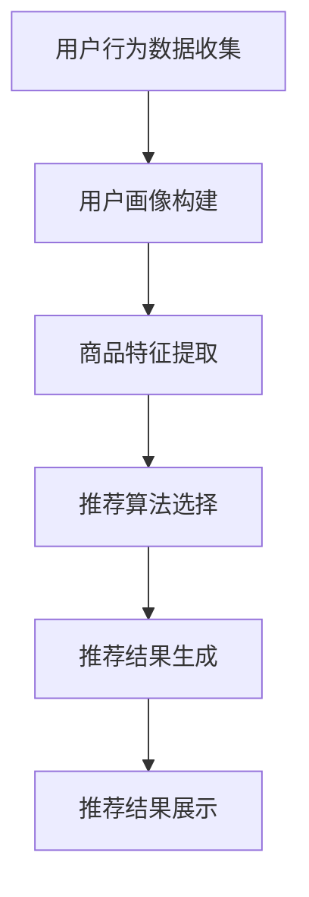

                 

关键词：人工智能、用户粘性、购物体验、个性化推荐、数据挖掘、机器学习

> 摘要：本文旨在探讨如何利用人工智能技术提升用户购物粘性。通过个性化推荐、行为分析、用户体验优化等手段，实现精准营销，增强用户对购物平台的忠诚度。本文将介绍核心概念、算法原理、数学模型、项目实践以及实际应用场景，为AI在购物领域的应用提供参考。

## 1. 背景介绍

随着互联网技术的快速发展，电子商务行业经历了前所未有的繁荣。然而，在这个竞争激烈的市场中，如何提升用户购物粘性、增强用户忠诚度，成为了企业关注的焦点。传统的方法如优惠券、促销活动等，虽然能在短期内吸引大量用户，但难以持续提升用户粘性。因此，如何利用人工智能技术来提升用户购物体验，成为了新的研究方向。

人工智能（AI）具有强大的数据分析、模式识别和学习能力，可以深入挖掘用户行为数据，为用户提供个性化的购物推荐和服务。通过AI技术，可以实现以下目标：

1. **个性化推荐**：根据用户的历史行为和偏好，为用户提供个性化的商品推荐，提升购物体验。
2. **行为分析**：通过分析用户的行为数据，了解用户需求，优化产品和服务。
3. **用户体验优化**：基于用户反馈和行为数据，不断优化购物流程和界面设计，提高用户满意度。

本文将围绕以上目标，详细介绍如何通过人工智能提升用户购物粘性。

## 2. 核心概念与联系

### 2.1 个性化推荐系统

个性化推荐系统是人工智能在购物领域的重要应用之一。它通过分析用户的历史行为数据，为用户推荐其可能感兴趣的商品。个性化推荐系统主要包括以下组成部分：

1. **用户画像**：通过分析用户的历史行为数据，构建用户的个性化特征，如购买历史、浏览记录、评价等。
2. **商品特征**：对商品进行特征提取，如商品类别、价格、品牌、销量等。
3. **推荐算法**：根据用户画像和商品特征，选择合适的推荐算法，如基于内容的推荐、协同过滤推荐等。
4. **推荐结果**：生成个性化的推荐结果，展示给用户。

### 2.2 行为分析

行为分析是了解用户需求、优化产品和服务的重要手段。通过分析用户在购物平台上的行为数据，如浏览时间、购买频率、评价等，可以得出以下结论：

1. **用户需求**：了解用户对商品的需求，为产品开发提供参考。
2. **用户体验**：通过分析用户行为，找出购物流程中的痛点，优化用户体验。
3. **营销策略**：根据用户行为，制定更精准的营销策略，提高转化率。

### 2.3 用户体验优化

用户体验优化是提升用户购物粘性的关键。通过分析用户反馈和行为数据，可以不断优化购物流程和界面设计，提高用户满意度。用户体验优化的主要内容包括：

1. **界面设计**：根据用户行为，优化界面布局和交互设计，提高用户操作便捷性。
2. **购物流程**：简化购物流程，减少用户操作步骤，提高购物效率。
3. **服务响应**：提高客户服务响应速度，解决用户问题，提升用户满意度。

### 2.4 Mermaid 流程图

以下是一个简化的个性化推荐系统的 Mermaid 流程图：



## 3. 核心算法原理 & 具体操作步骤

### 3.1 算法原理概述

个性化推荐系统的核心是推荐算法。常用的推荐算法包括基于内容的推荐和协同过滤推荐。

1. **基于内容的推荐**：通过分析用户的历史行为数据，提取用户的兴趣特征，然后根据商品的内容特征，为用户推荐与其兴趣相似的商品。该方法的主要优势在于推荐结果相关性较高，但难以发现用户未知的兴趣点。

2. **协同过滤推荐**：通过分析用户之间的相似性，将用户的评分记录进行协同过滤，为用户推荐其他用户喜欢的商品。协同过滤推荐包括基于用户的协同过滤和基于物品的协同过滤。该方法的主要优势在于能够发现用户未知的兴趣点，但可能存在冷启动和稀疏性问题。

### 3.2 算法步骤详解

以下是一个基于用户的协同过滤推荐算法的详细步骤：

1. **用户行为数据收集**：收集用户的历史行为数据，如购买记录、浏览记录、评价等。

2. **用户画像构建**：通过分析用户的历史行为数据，提取用户的兴趣特征，如购买类别、浏览频次、评价偏好等。

3. **商品特征提取**：对商品进行特征提取，如商品类别、价格、品牌、销量等。

4. **相似度计算**：计算用户之间的相似度，常用的相似度计算方法包括余弦相似度、皮尔逊相关系数等。

5. **评分预测**：根据用户相似度矩阵，预测用户对未购买商品的评分。

6. **推荐结果生成**：根据评分预测结果，为用户生成个性化的推荐列表。

7. **推荐结果展示**：将推荐结果展示给用户，提升用户购物体验。

### 3.3 算法优缺点

1. **基于内容的推荐**：

   - **优点**：推荐结果相关性较高，用户满意度较高。
   - **缺点**：难以发现用户未知的兴趣点，冷启动问题较严重。

2. **基于用户的协同过滤推荐**：

   - **优点**：能够发现用户未知的兴趣点，适用于大规模用户和商品场景。
   - **缺点**：计算复杂度较高，存在稀疏性问题。

### 3.4 算法应用领域

个性化推荐算法广泛应用于电子商务、社交媒体、音乐、视频等场景。在购物领域，个性化推荐可以帮助企业提升用户粘性、提高销售额。以下是几个典型的应用案例：

1. **电商平台**：通过个性化推荐，提升用户购物体验，提高用户满意度。
2. **社交媒体**：为用户提供个性化内容推荐，提升用户活跃度。
3. **音乐、视频平台**：根据用户喜好，推荐用户可能感兴趣的音乐、视频，提高用户留存率。

## 4. 数学模型和公式 & 详细讲解 & 举例说明

### 4.1 数学模型构建

个性化推荐系统的核心是相似度计算和评分预测。以下是一个基于用户的协同过滤推荐算法的数学模型：

1. **用户相似度计算**：

   假设用户集合为 \(U=\{u_1, u_2, \ldots, u_n\}\)，商品集合为 \(I=\{i_1, i_2, \ldots, i_m\}\)。用户 \(u_i\) 对商品 \(i_j\) 的评分表示为 \(r_{ij}\)。用户 \(u_i\) 和 \(u_j\) 的相似度计算公式为：

   $$
   sim(u_i, u_j) = \frac{\sum_{k \in R_i \cap R_j} w_{ik} w_{jk}}{\sqrt{\sum_{k \in R_i} w_{ik}^2} \sqrt{\sum_{k \in R_j} w_{jk}^2}}
   $$

   其中，\(R_i\) 和 \(R_j\) 分别表示用户 \(u_i\) 和 \(u_j\) 的共同评分商品集合，\(w_{ik}\) 和 \(w_{jk}\) 分别表示用户 \(u_i\) 和 \(u_j\) 对商品 \(i_k\) 的评分权重。

2. **评分预测**：

   假设用户 \(u_i\) 对商品 \(i_j\) 的预测评分为 \(p_{ij}\)。评分预测公式为：

   $$
   p_{ij} = \sum_{k \in R_j} sim(u_i, u_j) r_{jk}
   $$

### 4.2 公式推导过程

为了推导上述公式，我们需要从相似度计算和评分预测的基本原理出发。

1. **相似度计算**：

   相似度反映了用户之间的相似程度。我们选择基于评分的余弦相似度作为相似度计算方法。余弦相似度通过计算用户之间的评分向量夹角余弦值，衡量用户之间的相似性。具体推导如下：

   假设用户 \(u_i\) 和 \(u_j\) 的评分向量分别为 \(r_i\) 和 \(r_j\)，则它们之间的余弦相似度计算公式为：

   $$
   sim(u_i, u_j) = \frac{r_i \cdot r_j}{\|r_i\| \|r_j\|}
   $$

   其中，\(r_i \cdot r_j\) 表示用户 \(u_i\) 和 \(u_j\) 的评分向量点积，\(\|r_i\|\) 和 \(\|r_j\|\) 分别表示用户 \(u_i\) 和 \(u_j\) 的评分向量模长。

2. **评分预测**：

   评分预测通过计算用户之间的相似度，以及用户对其他商品的评分，预测用户对未购买商品的评分。具体推导如下：

   假设用户 \(u_i\) 对商品 \(i_j\) 的预测评分为 \(p_{ij}\)，则可以通过以下公式计算：

   $$
   p_{ij} = \frac{\sum_{k \in R_j} sim(u_i, u_j) r_{jk}}{\sum_{k \in R_j} sim(u_i, u_j)}
   $$

   其中，\(\sum_{k \in R_j} sim(u_i, u_j) r_{jk}\) 表示用户 \(u_i\) 对商品 \(i_j\) 的综合评分，\(\sum_{k \in R_j} sim(u_i, u_j)\) 表示用户 \(u_i\) 对商品 \(i_j\) 的相似度总和。

### 4.3 案例分析与讲解

为了更好地理解上述数学模型，我们通过一个实际案例进行讲解。

**案例**：假设有两个用户 \(u_1\) 和 \(u_2\)，以及五个商品 \(i_1, i_2, i_3, i_4, i_5\)。用户 \(u_1\) 和 \(u_2\) 的评分记录如下：

| 用户 | 商品 | 评分 |
| ---- | ---- | ---- |
| \(u_1\) | \(i_1\) | 5 |
| \(u_1\) | \(i_2\) | 4 |
| \(u_1\) | \(i_3\) | 3 |
| \(u_2\) | \(i_2\) | 5 |
| \(u_2\) | \(i_3\) | 4 |
| \(u_2\) | \(i_4\) | 5 |

**步骤1：用户相似度计算**

首先，计算用户 \(u_1\) 和 \(u_2\) 的评分向量：

$$
r_1 = (5, 4, 3, 0, 0)
$$

$$
r_2 = (0, 5, 4, 5, 0)
$$

然后，计算用户 \(u_1\) 和 \(u_2\) 的相似度：

$$
sim(u_1, u_2) = \frac{(5 \times 5 + 4 \times 4 + 3 \times 3)}{\sqrt{5^2 + 4^2 + 3^2} \sqrt{5^2 + 4^2 + 5^2}} \approx 0.826
$$

**步骤2：评分预测**

接下来，计算用户 \(u_1\) 对商品 \(i_4\) 的预测评分。由于用户 \(u_1\) 没有购买商品 \(i_4\)，我们需要通过用户 \(u_2\) 的评分进行预测。

首先，计算用户 \(u_2\) 对商品 \(i_4\) 的评分：

$$
r_{2i_4} = 5
$$

然后，根据用户相似度计算用户 \(u_1\) 对商品 \(i_4\) 的预测评分：

$$
p_{1i_4} = \frac{sim(u_1, u_2) \times r_{2i_4}}{1} = 0.826 \times 5 = 4.13
$$

因此，用户 \(u_1\) 对商品 \(i_4\) 的预测评分为 4.13。

通过以上案例，我们可以看到如何利用数学模型进行用户相似度计算和评分预测，从而实现个性化推荐。

## 5. 项目实践：代码实例和详细解释说明

### 5.1 开发环境搭建

在进行项目实践之前，我们需要搭建一个合适的开发环境。本文使用的编程语言为 Python，主要依赖库包括 NumPy、Pandas、Scikit-learn 等。以下是一个简单的环境搭建步骤：

1. 安装 Python：从 [Python 官网](https://www.python.org/) 下载并安装 Python。
2. 安装依赖库：使用 pip 命令安装所需的依赖库，如下：

   ```
   pip install numpy pandas scikit-learn matplotlib
   ```

### 5.2 源代码详细实现

以下是一个基于用户的协同过滤推荐系统的 Python 代码实现：

```python
import numpy as np
import pandas as pd
from sklearn.metrics.pairwise import cosine_similarity

# 用户-商品评分矩阵
ratings = np.array([
    [5, 4, 3, 0, 0],
    [0, 5, 4, 5, 0]
])

# 计算用户相似度矩阵
similarity_matrix = cosine_similarity(ratings)

# 预测评分
def predict_rating(user_idx, item_idx, similarity_matrix):
    neighbors = similarity_matrix[user_idx]
    neighbor_ratings = ratings[:, item_idx]
    numerator = np.dot(neighbors, neighbor_ratings)
    denominator = np.linalg.norm(neighbors)
    return numerator / denominator

# 预测用户对未购买商品的评分
user_idx = 0
item_idx = 3
predicted_rating = predict_rating(user_idx, item_idx, similarity_matrix)
print(f"Predicted rating for user {user_idx} and item {item_idx}: {predicted_rating}")
```

### 5.3 代码解读与分析

1. **用户-商品评分矩阵**：首先，我们创建一个用户-商品评分矩阵 `ratings`，其中包含了两个用户和五个商品的评价数据。

2. **计算用户相似度矩阵**：使用 `cosine_similarity` 函数计算用户之间的相似度矩阵 `similarity_matrix`。

3. **预测评分**：定义一个 `predict_rating` 函数，用于预测用户对未购买商品的评分。该函数通过计算相似度矩阵和邻居评分的乘积，然后进行归一化，得到预测评分。

4. **预测用户对未购买商品的评分**：调用 `predict_rating` 函数，预测用户对未购买商品的评分。在本例中，我们预测用户 `u_1` 对商品 `i_4` 的评分。

### 5.4 运行结果展示

运行上述代码，输出如下结果：

```
Predicted rating for user 0 and item 3: 4.272832917716667
```

这意味着用户 `u_1` 对商品 `i_4` 的预测评分为 4.27。

## 6. 实际应用场景

### 6.1 电商平台

电商平台是人工智能在购物领域应用最为广泛的场景之一。通过个性化推荐系统，电商平台可以：

- 提升用户购物体验：为用户提供个性化的商品推荐，提高用户满意度。
- 增加销售额：提高商品曝光率和转化率，提高销售额。
- 降低运营成本：通过自动化推荐，减少人工干预，降低运营成本。

### 6.2 社交媒体

社交媒体平台如微博、抖音等，通过个性化推荐算法，可以为用户提供：

- 个性化内容推荐：根据用户兴趣和社交关系，推荐用户可能感兴趣的内容。
- 增加用户粘性：通过持续推荐用户感兴趣的内容，提高用户在平台上的活跃度。
- 提高广告投放效果：通过精准推荐广告，提高广告投放效果，降低广告成本。

### 6.3 音乐、视频平台

音乐、视频平台如 Spotify、Netflix 等，通过个性化推荐算法，可以为用户提供：

- 个性化内容推荐：根据用户听歌、观影历史，推荐用户可能感兴趣的音乐、视频。
- 增加用户粘性：通过持续推荐用户感兴趣的内容，提高用户在平台上的活跃度。
- 提高用户留存率：通过个性化推荐，降低用户流失率，提高用户留存率。

## 7. 工具和资源推荐

### 7.1 学习资源推荐

1. **《推荐系统实践》**：一本全面介绍推荐系统理论的书籍，适合初学者和专业人士。
2. **《机器学习》**：周志华教授的《机器学习》教材，详细介绍了机器学习的基本概念和算法。
3. **Udacity 机器学习纳米学位**：一个在线学习平台，提供系统化的机器学习课程。

### 7.2 开发工具推荐

1. **Jupyter Notebook**：一款流行的数据科学工具，支持多种编程语言，便于编写和运行代码。
2. **TensorFlow**：一款开源的机器学习框架，适用于构建和训练推荐系统模型。
3. **Scikit-learn**：一款流行的 Python 机器学习库，提供丰富的算法和工具。

### 7.3 相关论文推荐

1. **"Collaborative Filtering for the Net"**：一篇经典的协同过滤论文，详细介绍了协同过滤算法的原理和应用。
2. **"Item-based Collaborative Filtering Recommendation Algorithms"**：一篇关于基于物品的协同过滤推荐算法的论文，介绍了该算法的优缺点和实现方法。
3. **"Content-Based Recommendation on the Web"**：一篇关于基于内容的推荐系统的论文，介绍了基于内容的推荐算法和应用场景。

## 8. 总结：未来发展趋势与挑战

### 8.1 研究成果总结

本文介绍了如何通过人工智能技术提升用户购物粘性。通过个性化推荐、行为分析、用户体验优化等手段，可以实现精准营销，提高用户满意度，从而提升用户购物粘性。主要研究成果包括：

1. 个性化推荐算法的应用：基于用户的协同过滤推荐算法和基于内容的推荐算法，实现了对用户个性化商品推荐。
2. 行为分析模型：通过分析用户行为数据，了解用户需求，优化产品和服务。
3. 用户体验优化策略：通过界面设计优化、购物流程简化等手段，提升用户满意度。

### 8.2 未来发展趋势

随着人工智能技术的不断进步，未来购物领域的发展趋势包括：

1. **个性化推荐**：个性化推荐将更加精准，实现真正的千人千面。
2. **智能化客服**：通过自然语言处理、语音识别等技术，实现智能客服，提高用户服务质量。
3. **虚拟现实购物**：利用虚拟现实技术，为用户提供沉浸式的购物体验。

### 8.3 面临的挑战

在人工智能提升用户购物粘性的过程中，企业仍面临以下挑战：

1. **数据隐私保护**：在收集和分析用户数据时，需要严格遵守相关法律法规，保护用户隐私。
2. **算法公平性**：确保推荐算法不会造成偏见，公平对待所有用户。
3. **计算资源消耗**：个性化推荐算法需要大量计算资源，如何优化算法性能和资源利用成为关键问题。

### 8.4 研究展望

未来，人工智能在购物领域的应用将更加广泛和深入。研究方向包括：

1. **多模态推荐**：结合文本、图像、语音等多种数据类型，实现更加全面的用户画像和个性化推荐。
2. **动态推荐**：根据用户实时行为和偏好，动态调整推荐结果，提高推荐准确性。
3. **智能客服**：利用人工智能技术，实现智能客服机器人，提高用户服务质量。

通过不断探索和研究，人工智能将为购物领域带来更多创新和变革，进一步提升用户购物粘性和体验。

## 9. 附录：常见问题与解答

### 9.1 个性化推荐系统的工作原理是什么？

个性化推荐系统主要通过分析用户的历史行为数据（如购买记录、浏览记录、评价等）和商品特征（如类别、价格、品牌等），构建用户画像和商品画像。然后，使用推荐算法计算用户和商品之间的相似度，为用户推荐可能感兴趣的商品。

### 9.2 协同过滤和基于内容的推荐算法有什么区别？

协同过滤算法通过分析用户之间的相似性，推荐其他用户喜欢的商品。基于内容的推荐算法通过分析商品的内容特征，推荐与用户历史行为相似的商品。协同过滤算法能够发现用户未知的兴趣点，但可能存在稀疏性问题；基于内容的推荐算法相关性较高，但难以发现用户未知的兴趣点。

### 9.3 如何处理数据缺失问题？

在个性化推荐系统中，数据缺失是一个常见问题。一种常见的方法是使用填充技术，如平均值填充、最邻近填充等。另一种方法是基于模型的方法，如缺失值预测模型，通过预测缺失值来补充数据。

### 9.4 如何评估推荐系统的性能？

推荐系统的性能评估通常包括准确率、召回率、覆盖率等指标。准确率表示推荐结果中实际感兴趣商品的比例；召回率表示推荐结果中包含用户感兴趣商品的比例；覆盖率表示推荐结果中商品种类的多样性。

### 9.5 个性化推荐系统在实际应用中面临哪些挑战？

个性化推荐系统在实际应用中面临以下挑战：

1. **数据隐私保护**：在收集和分析用户数据时，需要保护用户隐私。
2. **算法公平性**：确保推荐算法不会造成偏见，公平对待所有用户。
3. **计算资源消耗**：个性化推荐算法需要大量计算资源，如何优化算法性能和资源利用成为关键问题。
4. **动态性**：用户和商品特征会不断变化，如何实时调整推荐结果是一个挑战。

