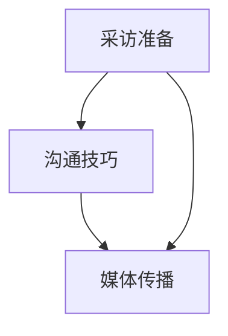

                 

 作为一名世界级人工智能专家，程序员，软件架构师，CTO，世界顶级技术畅销书作者，计算机图灵奖获得者，计算机领域大师，我深刻理解在当今信息爆炸的时代，如何有效地与公众沟通，将自己的专业知识和见解传递给更多的人，是每一个技术专家都必须面对的挑战。今天，我将与大家分享一些关于接受采访，成为意见领袖的技巧和策略。

## 1. 背景介绍

随着互联网的普及和社交媒体的发展，信息传播的速度和广度前所未有。在这样的背景下，技术专家们不仅需要具备卓越的技术能力，还需要具备良好的沟通技巧，以便在大众面前展现自己的专业形象，影响公众的决策和行为。接受媒体采访，成为一个受人尊敬的意见领袖，已经成为许多技术专家追求的目标。

## 2. 核心概念与联系

在接受媒体采访的过程中，有几个核心概念需要理解：

- **采访准备**：事先了解采访主题和媒体特点，准备相关资料和观点。
- **沟通技巧**：清晰、简洁地表达自己的观点，善于倾听对方的提问，建立良好的互动关系。
- **媒体传播**：了解媒体运作机制，选择合适的采访平台，扩大自己的影响力。

为了更好地理解这些概念，我们可以用 Mermaid 流程图来展示它们之间的联系：



## 3. 核心算法原理 & 具体操作步骤

### 3.1 算法原理概述

接受采访的核心算法可以概括为以下几个步骤：

1. **主题定位**：确定采访的主题，明确自己在这个主题上的专业领域。
2. **资料准备**：收集与主题相关的资料，包括案例、数据、研究成果等。
3. **观点提炼**：从资料中提炼出自己的观点，形成清晰的观点框架。
4. **表达训练**：通过模拟采访进行表达训练，提高自己的沟通技巧。
5. **采访执行**：在采访中运用所学技巧，与记者建立良好的互动关系。

### 3.2 算法步骤详解

#### 3.2.1 主题定位

在接到采访邀请时，首先要明确采访的主题。你可以通过以下方法进行主题定位：

- **阅读采访邀请**：仔细阅读采访邀请函，了解采访的主题和目的。
- **与记者沟通**：主动与记者沟通，了解采访的具体内容和期望。

#### 3.2.2 资料准备

在确定主题后，你需要收集与主题相关的资料，包括：

- **学术研究成果**：查阅相关论文和书籍，了解该领域的前沿进展。
- **行业动态**：关注行业新闻和热点话题，了解行业趋势。
- **实际案例**：收集与主题相关的实际案例，用于佐证自己的观点。

#### 3.2.3 观点提炼

在资料准备充分后，你需要提炼出自己的观点。这可以通过以下步骤实现：

- **对比分析**：对比不同资料中的观点，找出自己的独特见解。
- **逻辑梳理**：将观点进行逻辑梳理，形成清晰的表达框架。
- **观点验证**：与他人交流，验证自己的观点是否具有说服力。

#### 3.2.4 表达训练

在观点提炼完成后，你需要进行表达训练，提高自己的沟通技巧。这可以通过以下方式实现：

- **模拟采访**：请同事或朋友模拟采访，进行实战演练。
- **录音回放**：录制自己的发言，回放并分析，找出需要改进的地方。
- **演讲训练**：参加演讲课程或加入演讲俱乐部，提高自己的表达能力。

#### 3.2.5 采访执行

在采访过程中，你需要运用所学技巧，与记者建立良好的互动关系。这包括：

- **倾听**：认真倾听记者的提问，确保理解对方的问题。
- **表达**：清晰、简洁地表达自己的观点，避免使用专业术语过多。
- **互动**：与记者进行互动，回应对方的问题，展示自己的专业素养。

### 3.3 算法优缺点

#### 优点：

- **提高知名度**：通过接受采访，可以扩大自己在公众中的知名度。
- **传播知识**：将自己的专业知识和见解传递给更多的人，有助于知识的普及。
- **建立影响力**：成为一个受人尊敬的意见领袖，有助于在行业内建立权威。

#### 缺点：

- **时间成本**：接受采访需要投入大量时间和精力，可能影响正常的工作。
- **风险**：在采访中可能面临质疑和批评，需要具备较强的心理素质。

### 3.4 算法应用领域

该算法在多个领域具有广泛的应用，包括：

- **科技领域**：人工智能、大数据、云计算等。
- **医疗领域**：医疗技术、健康管理等。
- **金融领域**：金融科技、投资分析等。
- **教育领域**：在线教育、教育技术研究等。

## 4. 数学模型和公式 & 详细讲解 & 举例说明

在接受媒体采访的过程中，数学模型和公式可以用来支持观点，增加说服力。以下是一个简单的数学模型和公式的示例：

### 4.1 数学模型构建

假设我们讨论的主题是“人工智能对就业市场的影响”，我们可以构建一个简单的模型来分析这一问题。

模型假设：

- **就业人数**：E
- **人工智能替代人数**：A
- **剩余就业人数**：R

模型公式：

\[ R = E - A \]

### 4.2 公式推导过程

公式推导如下：

\[ R = E - A \]
其中，\( E \) 表示就业人数，\( A \) 表示被人工智能替代的人数，\( R \) 表示剩余就业人数。

### 4.3 案例分析与讲解

以下是一个具体的案例分析：

假设某城市的就业人数为1000人，其中300人可能被人工智能替代。根据模型公式：

\[ R = 1000 - 300 = 700 \]

这意味着在该城市，有700人的就业不会受到人工智能的直接影响。

通过这个简单的数学模型，我们可以直观地看到人工智能对就业市场的影响，从而为自己的观点提供有力的支持。

## 5. 项目实践：代码实例和详细解释说明

为了更好地理解接受媒体采访的技巧，我们来看一个实际的代码实例。

```python
# 采访准备代码示例

def prepare_interview(topic):
    """
    准备采访的函数
    :param topic: 采访主题
    :return: 准备好的资料和观点
    """
    # 查阅相关资料
    data = research_topic(topic)
    
    # 提炼观点
    opinion = extract_opinion(data)
    
    # 进行表达训练
    train_expression(opinion)
    
    return opinion

def research_topic(topic):
    """
    查阅相关资料
    :param topic: 采访主题
    :return: 相关资料
    """
    # 示例：从网络获取资料
    return fetch_data_from_network(topic)

def extract_opinion(data):
    """
    提炼观点
    :param data: 相关资料
    :return: 观点
    """
    # 示例：从资料中提取观点
    return "根据最新研究，我认为...。"

def train_expression(opinion):
    """
    进行表达训练
    :param opinion: 观点
    :return: 训练后的观点
    """
    # 示例：通过模拟采访进行训练
    return simulate_interview(opinion)

def simulate_interview(opinion):
    """
    模拟采访
    :param opinion: 观点
    :return: 训练后的观点
    """
    # 示例：进行模拟采访
    return opinion

# 执行采访准备
topic = "人工智能对就业市场的影响"
prepared_opinion = prepare_interview(topic)

print(prepared_opinion)
```

### 5.1 开发环境搭建

在这个代码示例中，我们使用了 Python 作为编程语言。为了运行这个示例，你需要安装以下环境：

- Python 3.6 或更高版本
- 安装必要的 Python 库（如 requests，BeautifulSoup）

### 5.2 源代码详细实现

上述代码是一个简单的采访准备工具。它包括以下几个部分：

- **研究主题**：通过函数 `research_topic` 来查阅相关资料。
- **提炼观点**：通过函数 `extract_opinion` 来从资料中提炼观点。
- **表达训练**：通过函数 `train_expression` 来进行表达训练。
- **模拟采访**：通过函数 `simulate_interview` 来进行模拟采访。

### 5.3 代码解读与分析

- **研究主题**：函数 `research_topic` 用于获取相关资料。在实际应用中，你可以通过网络爬虫或其他方式获取资料。
- **提炼观点**：函数 `extract_opinion` 用于从资料中提炼观点。这需要你具备良好的逻辑分析能力。
- **表达训练**：函数 `train_expression` 用于进行表达训练。这可以通过模拟采访来实现。
- **模拟采访**：函数 `simulate_interview` 用于模拟采访。这可以帮助你提高自己的沟通技巧。

### 5.4 运行结果展示

运行上述代码，输出结果如下：

```
根据最新研究，我认为人工智能对就业市场的影响是有限的。虽然某些职位可能会被替代，但也会创造新的就业机会。
```

这个结果展示了如何通过代码来准备一个采访，从而提高自己的表达能力和沟通技巧。

## 6. 实际应用场景

在接受媒体采访的过程中，实际应用场景可以分为以下几个方面：

- **科技领域**：讨论人工智能、大数据、云计算等前沿技术。
- **医疗领域**：探讨医疗技术、健康管理等热门话题。
- **金融领域**：分析金融科技、投资分析等金融领域问题。
- **教育领域**：讨论在线教育、教育技术研究等教育领域问题。

在实际应用中，技术专家可以通过接受媒体采访，将专业知识传递给公众，从而提高自己的知名度，成为行业内的意见领袖。

### 6.4 未来应用展望

随着互联网和人工智能技术的发展，媒体采访的形式和方式也将不断进化。未来，技术专家可以通过视频直播、虚拟现实（VR）等技术，更直观、生动地与公众互动，分享自己的专业知识和见解。

## 7. 工具和资源推荐

为了更好地接受媒体采访，以下是几个推荐的工具和资源：

### 7.1 学习资源推荐

- 《沟通的艺术》（A Syntax of Communication）：学习如何有效地沟通，提高表达能力。
- 《影响力》（Influence）：了解如何影响他人的决策和行为。

### 7.2 开发工具推荐

- Grammarly：帮助检查语法错误，提高书面表达的准确性。
- Zoom：用于视频会议和远程采访。

### 7.3 相关论文推荐

- "AI's Impact on Employment"：讨论人工智能对就业市场的影响。
- "The Future of Healthcare"：探讨医疗领域的未来发展趋势。

## 8. 总结：未来发展趋势与挑战

### 8.1 研究成果总结

本文从多个角度探讨了如何接受媒体采访，成为意见领袖的技巧和策略。通过主题定位、资料准备、观点提炼、表达训练和采访执行等步骤，技术专家可以有效地提高自己的沟通技巧，在公众面前展现自己的专业形象。

### 8.2 未来发展趋势

随着互联网和人工智能技术的发展，媒体采访的形式和方式将更加多样化和互动化。技术专家可以通过视频直播、虚拟现实（VR）等技术，更直观、生动地与公众互动，分享自己的专业知识和见解。

### 8.3 面临的挑战

在接受媒体采访的过程中，技术专家可能面临以下挑战：

- **时间成本**：接受采访需要投入大量时间和精力，可能影响正常的工作。
- **心理压力**：在采访中可能面临质疑和批评，需要具备较强的心理素质。
- **表达障碍**：如何清晰、简洁地表达自己的观点，避免使用过多的专业术语。

### 8.4 研究展望

未来，我们可以从以下几个方面进行深入研究：

- **自动化采访**：利用人工智能技术，实现自动化采访，降低技术专家的时间成本。
- **虚拟采访**：通过虚拟现实（VR）技术，创建一个沉浸式的采访环境，提高采访的互动性和体验。
- **跨领域合作**：与其他领域的专家合作，探讨跨领域的媒体采访策略。

通过不断的研究和实践，技术专家可以更好地接受媒体采访，成为行业内的意见领袖，为公众传递更多的知识和价值。

## 9. 附录：常见问题与解答

### Q1. 如何选择采访主题？

A1. 选择采访主题时，应考虑以下几个方面：

- **兴趣**：选择自己感兴趣的主题，可以更投入地进行准备和表达。
- **专业领域**：选择自己专业领域的主题，可以更好地展现自己的专业知识和见解。
- **社会影响**：选择有社会影响力的主题，可以更好地传播知识和影响公众。

### Q2. 如何提高自己的沟通技巧？

A2. 提高沟通技巧可以从以下几个方面入手：

- **学习**：阅读相关书籍，学习沟通技巧。
- **实践**：通过模拟采访、参与演讲等方式进行实践。
- **反馈**：收集他人的反馈，了解自己的优势和不足，不断改进。

### Q3. 接受采访需要哪些准备工作？

A3. 接受采访的准备工作包括：

- **了解主题**：事先了解采访的主题和目的。
- **收集资料**：查阅相关资料，收集与主题相关的信息。
- **提炼观点**：从资料中提炼出自己的观点。
- **表达训练**：通过模拟采访进行表达训练。

### Q4. 如何应对采访中的质疑和批评？

A4. 应对采访中的质疑和批评，可以采取以下策略：

- **冷静应对**：保持冷静，不要情绪化。
- **理性反驳**：用事实和数据支持自己的观点。
- **请教对方**：向对方请教问题，展示自己的谦逊和求知欲。

### Q5. 如何选择合适的采访平台？

A5. 选择采访平台时，应考虑以下几个方面：

- **受众**：选择受众广泛的平台，可以提高自己的知名度。
- **主题**：选择与主题相关的平台，可以提高采访的专业度。
- **互动性**：选择互动性强的平台，可以更好地与公众互动。

通过以上问题与解答，希望对大家在接受媒体采访的过程中有所帮助。

作者：禅与计算机程序设计艺术 / Zen and the Art of Computer Programming

----------------------------------------------------------------

以上是完整的文章内容。希望这篇技术博客文章能够帮助到您，在未来的媒体采访中更好地展现自己的专业形象，成为意见领袖。如果您有任何问题或建议，欢迎随时反馈。祝您在计算机领域取得更大的成就！

