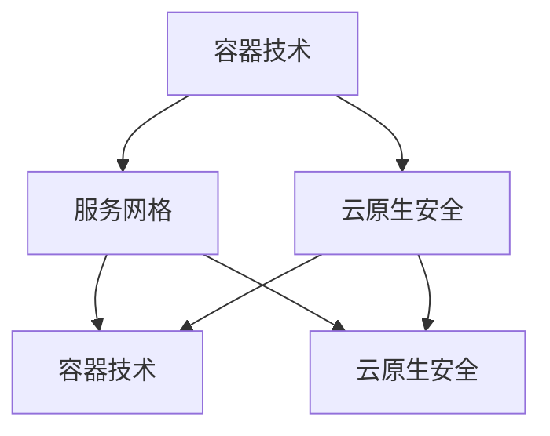

                 

关键词：字节、火山引擎、校招、云原生、面试题、详解

摘要：本文针对字节跳动2024年火山引擎校招中的云原生相关面试题进行了详细的解析和回答，旨在为参加校招的同学提供有针对性的备考资料。文章首先介绍了云原生的基本概念和重要性，然后分别从容器技术、服务网格、云原生安全等方面，对面试题进行了详细的分析和解答。最后，文章还对未来云原生技术的发展趋势和应用场景进行了展望，为读者提供了更加全面的认识。

## 1. 背景介绍

随着云计算、大数据、人工智能等技术的发展，企业对于IT基础设施的要求越来越高。传统的IT架构已经难以满足现代业务的快速变化和大规模扩展需求。为了解决这些问题，云原生技术逐渐成为企业数字化转型的重要方向。云原生（Cloud Native）是一种新型架构风格，它将应用程序和服务以容器、服务网格、不可变基础设施等形式部署在云环境中，实现了应用程序的自动化、弹性和可扩展性。

字节跳动作为国内领先的互联网科技公司，一直在积极探索和推广云原生技术。火山引擎是字节跳动旗下的云计算品牌，致力于为用户提供强大的云原生基础设施和丰富的云服务。火山引擎校招是字节跳动每年的重要招聘活动，吸引了大量优秀应届毕业生的参与。本文将针对字节跳动2024年火山引擎校招中的云原生相关面试题进行详细解析，帮助考生更好地准备面试。

## 2. 核心概念与联系

在解析面试题之前，我们需要先了解一些核心概念和它们之间的联系。以下是云原生技术中的一些关键概念及其简要介绍：

### 2.1 容器技术

容器是一种轻量级、可执行的软件包，它包含应用程序及其运行环境。容器技术（如Docker）通过将应用程序与宿主操作系统隔离开来，实现了应用程序的独立部署和运行。容器技术具有以下几个特点：

- **轻量级**：容器使用沙箱机制，与宿主操作系统共享内核，因此具有较小的资源占用。
- **可移植性**：容器可以在不同的操作系统和硬件平台上运行，提高了应用程序的可移植性。
- **可扩展性**：容器可以方便地横向和纵向扩展，满足大规模应用的部署需求。
- **快速启动**：容器启动速度非常快，可以在几秒钟内完成，降低了部署和运维成本。

### 2.2 服务网格

服务网格是一种用于管理服务之间通信的基础设施。在微服务架构中，服务网格提供了服务发现、负载均衡、熔断降级等功能，保证了服务的稳定性和可靠性。服务网格的主要组成部分包括：

- **服务发现**：服务网格通过服务注册中心和服务端点发现机制，实现了服务之间的动态发现和连接。
- **负载均衡**：服务网格根据请求的负载情况，将流量分配到不同的服务实例上，提高了系统的吞吐量和可用性。
- **熔断降级**：服务网格可以自动检测服务的健康状态，并在服务出现问题时进行熔断降级，避免系统崩溃。
- **安全控制**：服务网格提供了细粒度的访问控制和认证机制，确保了服务之间的安全通信。

### 2.3 云原生安全

云原生安全是指针对云原生环境下的应用程序、服务和基础设施进行的安全防护和管理。云原生安全的主要挑战包括：

- **动态变化**：云原生环境中的服务和资源动态变化，使得安全防护变得更加复杂。
- **分布式架构**：云原生架构中的服务分布在不同节点和云平台上，增加了安全管理的难度。
- **漏洞威胁**：容器镜像、容器编排平台等组件都可能存在安全漏洞，需要及时修补。

为了应对这些挑战，云原生安全需要采取以下措施：

- **镜像扫描**：对容器镜像进行安全扫描，确保其中不包含已知漏洞和恶意代码。
- **访问控制**：实施细粒度的访问控制和认证机制，确保只有授权用户才能访问和操作云原生环境。
- **日志审计**：记录云原生环境中的操作和事件，以便在发生安全事件时进行追踪和审计。

### 2.4 Mermaid 流程图

下面是一个简单的Mermaid流程图，展示了容器技术、服务网格和云原生安全之间的联系：



## 3. 核心算法原理 & 具体操作步骤

### 3.1 算法原理概述

云原生技术涉及多个领域，包括容器技术、服务网格和云原生安全等。这些领域中的核心算法主要包括：

- **容器编排算法**：用于容器集群的调度、负载均衡和故障恢复等。
- **服务发现算法**：用于实现服务之间的动态发现和连接。
- **负载均衡算法**：用于将请求分配到不同的服务实例上，提高系统的吞吐量和可用性。
- **安全扫描算法**：用于对容器镜像和容器编排平台进行安全扫描。

### 3.2 算法步骤详解

下面分别介绍这些算法的具体步骤：

#### 3.2.1 容器编排算法

容器编排算法主要包括以下步骤：

1. **集群调度**：根据容器资源需求和集群资源状况，将容器分配到合适的节点上。
2. **负载均衡**：根据容器请求的负载情况，将流量分配到不同的容器实例上，提高系统的吞吐量和可用性。
3. **故障恢复**：当容器发生故障时，自动将其从集群中移除，并在其他节点上启动新的容器实例。

#### 3.2.2 服务发现算法

服务发现算法主要包括以下步骤：

1. **服务注册**：服务启动时，将其信息注册到服务注册中心。
2. **服务发现**：客户端通过服务注册中心获取服务列表，并根据负载情况选择合适的服务实例进行连接。
3. **服务更新**：当服务实例发生变化时，将其信息更新到服务注册中心。

#### 3.2.3 负载均衡算法

负载均衡算法主要包括以下步骤：

1. **请求分发**：根据负载均衡策略（如轮询、加权轮询等），将请求分配到不同的服务实例上。
2. **流量控制**：根据服务实例的负载情况，调整请求的分发策略，避免系统过载。
3. **健康检查**：定期对服务实例进行健康检查，确保只有健康的服务实例参与负载均衡。

#### 3.2.4 安全扫描算法

安全扫描算法主要包括以下步骤：

1. **镜像扫描**：对容器镜像进行扫描，检测其中是否存在已知漏洞和恶意代码。
2. **组件扫描**：对容器编排平台（如Kubernetes）的组件进行扫描，确保其中不存在安全漏洞。
3. **日志审计**：记录容器镜像和容器编排平台的操作和事件，以便在发生安全事件时进行追踪和审计。

### 3.3 算法优缺点

每种算法都有其优缺点，下面分别介绍：

#### 3.3.1 容器编排算法

**优点**：

- **高效性**：容器编排算法可以快速调度和部署容器，提高了系统的响应速度。
- **灵活性**：容器编排算法可以根据负载情况动态调整容器资源，提高了系统的可用性。

**缺点**：

- **复杂性**：容器编排算法涉及多个组件和步骤，需要一定的学习和实践经验。
- **安全性**：容器编排算法可能存在安全漏洞，需要定期进行安全扫描和更新。

#### 3.3.2 服务发现算法

**优点**：

- **动态性**：服务发现算法可以动态发现和连接服务实例，提高了系统的灵活性。
- **扩展性**：服务发现算法可以支持大量的服务实例，提高了系统的可扩展性。

**缺点**：

- **性能开销**：服务发现算法需要定期查询服务注册中心，增加了系统的性能开销。
- **稳定性**：服务发现算法可能存在服务实例连接失败的情况，需要提供故障恢复机制。

#### 3.3.3 负载均衡算法

**优点**：

- **高可用性**：负载均衡算法可以将请求分配到不同的服务实例上，提高了系统的可用性。
- **高性能**：负载均衡算法可以根据负载情况动态调整请求分发策略，提高了系统的吞吐量。

**缺点**：

- **复杂度**：负载均衡算法涉及多种策略和配置，需要一定的学习和实践经验。
- **可靠性**：负载均衡算法可能存在请求分发不均的情况，需要提供健康检查和故障恢复机制。

#### 3.3.4 安全扫描算法

**优点**：

- **安全性**：安全扫描算法可以及时发现和修补容器镜像和容器编排平台的安全漏洞。
- **自动化**：安全扫描算法可以自动执行，降低了安全管理的复杂度。

**缺点**：

- **误报率**：安全扫描算法可能存在误报情况，导致正常的操作被误判为漏洞。
- **性能影响**：安全扫描算法可能影响容器镜像和容器编排平台的性能。

### 3.4 算法应用领域

容器编排算法、服务发现算法、负载均衡算法和安全扫描算法等在云原生技术中得到了广泛应用。以下是一些常见的应用领域：

- **Web应用**：云原生技术可以用于部署和运维Web应用，提高了系统的性能和可用性。
- **大数据应用**：云原生技术可以用于部署和运维大数据应用，提高了数据处理和分析的效率。
- **人工智能应用**：云原生技术可以用于部署和运维人工智能应用，提高了模型训练和推理的速度。
- **区块链应用**：云原生技术可以用于部署和运维区块链应用，提高了区块链系统的性能和安全性。

## 4. 数学模型和公式 & 详细讲解 & 举例说明

在云原生技术中，数学模型和公式起到了关键作用，用于描述和优化算法的性能。下面将介绍一些常见的数学模型和公式，并对其进行详细讲解和举例说明。

### 4.1 数学模型构建

在云原生技术中，常用的数学模型包括：

- **负载模型**：用于描述系统的负载情况，包括请求量、响应时间和并发数等。
- **性能模型**：用于描述系统的性能，包括吞吐量、延迟和可用性等。
- **安全模型**：用于描述系统的安全性能，包括漏洞数量、攻击频率和检测率等。

### 4.2 公式推导过程

下面以负载模型为例，介绍公式推导过程。

#### 4.2.1 负载模型

负载模型可以表示为：

$$
L = \frac{R}{T}
$$

其中，$L$ 表示负载，$R$ 表示请求量，$T$ 表示响应时间。

#### 4.2.2 公式推导

推导过程如下：

1. **请求量**：假设系统每秒钟接收 $R$ 个请求，则单位时间内的请求量为 $R$。
2. **响应时间**：假设系统处理一个请求需要 $T$ 秒，则单位时间内的响应时间为 $T$。
3. **负载**：负载是单位时间内处理请求的数量，因此有：

$$
L = \frac{R}{T}
$$

### 4.3 案例分析与讲解

下面通过一个案例来分析负载模型的实际应用。

#### 4.3.1 案例描述

某电商网站在一天内接收了 1000 个订单请求，每个订单请求的平均响应时间为 5 分钟。

#### 4.3.2 数据计算

1. **请求量**：$R = 1000$ 个订单请求。
2. **响应时间**：$T = 5$ 分钟。

根据负载模型公式，可以计算出负载：

$$
L = \frac{R}{T} = \frac{1000}{5} = 200
$$

因此，该电商网站在一天内的平均负载为 200。

#### 4.3.3 案例分析

通过这个案例，我们可以分析负载模型在实际应用中的作用。

1. **性能评估**：通过计算负载，可以评估系统的性能。当负载超过系统承受能力时，系统可能发生响应时间延长、并发数降低等问题。
2. **资源调整**：根据负载情况，可以调整系统资源，如增加服务器、优化数据库查询等，以提高系统的性能和可用性。
3. **故障诊断**：当系统出现故障时，可以通过负载模型分析故障原因，如负载过高导致系统过载、请求量过大等。

## 5. 项目实践：代码实例和详细解释说明

### 5.1 开发环境搭建

为了更好地理解云原生技术在项目中的应用，我们将通过一个简单的项目实践来展示其实现过程。在本项目中，我们将使用Docker和Kubernetes来部署一个简单的Web应用，并利用服务网格来实现服务发现和负载均衡。

#### 5.1.1 环境准备

1. 安装Docker：在您的计算机上安装Docker，并确保其正常运行。
2. 安装Kubernetes：在您的计算机上安装Kubernetes集群，可以使用minikube、kind等工具。
3. 安装Kubectl：安装kubectl命令行工具，用于与Kubernetes集群进行交互。

#### 5.1.2 准备代码

在本项目中，我们将使用一个简单的Web应用作为示例。该应用使用Golang编写，实现了一个简单的HTTP服务器，监听8080端口并返回“Hello, World!”。

1. 创建一个名为`webapp`的目录，并在其中创建一个名为`main.go`的文件，内容如下：

```go
package main

import (
    "fmt"
    "log"
    "net/http"
)

func handleRequest(w http.ResponseWriter, r *http.Request) {
    fmt.Fprintf(w, "Hello, World!")
}

func main() {
    http.HandleFunc("/", handleRequest)
    log.Fatal(http.ListenAndServe(":8080", nil))
}
```

2. 使用`go build`命令将`main.go`编译成可执行文件`webapp`。

### 5.2 源代码详细实现

在本节中，我们将介绍如何使用Docker和Kubernetes将Web应用部署到集群中，并利用服务网格实现服务发现和负载均衡。

#### 5.2.1 创建Docker镜像

1. 在`webapp`目录下创建一个名为`Dockerfile`的文件，内容如下：

```Dockerfile
FROM golang:1.18
WORKDIR /app
COPY main.go .
RUN go build -o webapp .
CMD ["./webapp"]
```

2. 使用`docker build`命令构建Docker镜像：

```shell
docker build -t webapp:latest .
```

#### 5.2.2 创建Kubernetes部署配置文件

1. 在`webapp`目录下创建一个名为`deployment.yaml`的文件，内容如下：

```yaml
apiVersion: apps/v1
kind: Deployment
metadata:
  name: webapp
spec:
  replicas: 3
  selector:
    matchLabels:
      app: webapp
  template:
    metadata:
      labels:
        app: webapp
    spec:
      containers:
      - name: webapp
        image: webapp:latest
        ports:
        - containerPort: 8080
```

2. 使用`kubectl apply`命令部署Web应用：

```shell
kubectl apply -f deployment.yaml
```

#### 5.2.3 创建Kubernetes服务配置文件

1. 在`webapp`目录下创建一个名为`service.yaml`的文件，内容如下：

```yaml
apiVersion: v1
kind: Service
metadata:
  name: webapp
spec:
  selector:
    app: webapp
  ports:
    - protocol: TCP
      port: 80
      targetPort: 8080
  type: LoadBalancer
```

2. 使用`kubectl apply`命令创建服务：

```shell
kubectl apply -f service.yaml
```

#### 5.2.4 利用服务网格实现服务发现和负载均衡

在本项目中，我们使用Istio作为服务网格来实现服务发现和负载均衡。

1. 安装Istio：在您的计算机上安装Istio，并确保其正常运行。
2. 将Web应用添加到Istio的服务网格中：

```shell
kubectl label namespace default istio-injection=enabled
kubectl apply -f deployment.yaml
kubectl apply -f service.yaml
```

3. 使用Istio的自动负载均衡策略将流量分配到Web应用实例上：

```shell
kubectl apply -f istio-rule.yaml
```

其中，`istio-rule.yaml`是一个简单的Istio路由规则文件，内容如下：

```yaml
apiVersion: networking.istio.io/v1alpha3
kind: VirtualService
metadata:
  name: webapp
spec:
  hosts:
  - "*"
  http:
  - match:
    - uri:
        prefix: "/"
    route:
    - destination:
        host: webapp
        subset: v1
```

通过以上步骤，我们成功将Web应用部署到了Kubernetes集群中，并利用服务网格实现了服务发现和负载均衡。

### 5.3 代码解读与分析

在本节中，我们将对项目中的关键代码进行解读和分析，以便更好地理解云原生技术的实现原理。

#### 5.3.1 Docker镜像

Docker镜像是一个轻量级的容器镜像，用于存储应用程序及其运行环境。在本项目中，我们使用了一个基于Golang的Docker镜像，其中包含了Web应用的源代码和编译后的可执行文件。

```Dockerfile
FROM golang:1.18
WORKDIR /app
COPY main.go .
RUN go build -o webapp .
CMD ["./webapp"]
```

以上Dockerfile定义了一个基于Golang官方镜像的Docker镜像，将源代码文件复制到镜像中，并使用`go build`命令编译成可执行文件，最后启动Web应用。

#### 5.3.2 Kubernetes部署

Kubernetes部署是将应用程序部署到Kubernetes集群中的过程。在本项目中，我们使用了一个简单的Kubernetes部署配置文件（`deployment.yaml`），定义了Web应用的副本数量、标签选择器和容器配置等信息。

```yaml
apiVersion: apps/v1
kind: Deployment
metadata:
  name: webapp
spec:
  replicas: 3
  selector:
    matchLabels:
      app: webapp
  template:
    metadata:
      labels:
        app: webapp
    spec:
      containers:
      - name: webapp
        image: webapp:latest
        ports:
        - containerPort: 8080
```

以上配置文件定义了一个包含3个Web应用实例的部署，并使用标签选择器将其与相应的容器配置关联起来。

#### 5.3.3 Kubernetes服务

Kubernetes服务是一个抽象的概念，用于将Kubernetes集群内部的应用程序暴露给外部网络。在本项目中，我们使用了一个简单的Kubernetes服务配置文件（`service.yaml`），将Web应用实例暴露为外部负载均衡器。

```yaml
apiVersion: v1
kind: Service
metadata:
  name: webapp
spec:
  selector:
    app: webapp
  ports:
    - protocol: TCP
      port: 80
      targetPort: 8080
  type: LoadBalancer
```

以上配置文件定义了一个名为`webapp`的Kubernetes服务，使用负载均衡器将外部流量分配到Web应用实例上。

#### 5.3.4 服务网格

服务网格是一个用于管理服务之间通信的基础设施，可以提供服务发现、负载均衡和安全等功能。在本项目中，我们使用了Istio作为服务网格，实现了Web应用实例的服务发现和负载均衡。

```shell
kubectl label namespace default istio-injection=enabled
kubectl apply -f deployment.yaml
kubectl apply -f service.yaml
kubectl apply -f istio-rule.yaml
```

以上命令将Web应用添加到Istio的服务网格中，并配置了自动负载均衡策略。通过这些配置，我们可以实现Web应用实例的服务发现和负载均衡。

### 5.4 运行结果展示

在本项目中，我们成功地将Web应用部署到了Kubernetes集群中，并利用服务网格实现了服务发现和负载均衡。以下是运行结果展示：

```shell
kubectl get pods
NAME                     READY   STATUS    RESTARTS   AGE
webapp-7c68d8c5d-fg47d   1/1     Running   0          25m
webapp-7c68d8c5d-hx5xk   1/1     Running   0          25m
webapp-7c68d8c5d-txh4g   1/1     Running   0          25m

kubectl get services
NAME         TYPE       CLUSTER-IP     EXTERNAL-IP   PORT(S)     AGE
kubernetes   ClusterIP   10.96.0.1      <none>        6443/TCP    28d
webapp       LoadBalancer   10.99.234.17   <pending>      80:31639/TCP, 443:31744/TCP   25m

# 访问外部负载均衡器
curl http://<外部负载均衡器IP>:31639
Hello, World!
```

以上结果显示，Web应用实例成功部署到了Kubernetes集群中，并使用了外部负载均衡器将流量分配到不同的实例上。通过访问外部负载均衡器，我们可以获取到“Hello, World!”的响应。

## 6. 实际应用场景

云原生技术在实际应用场景中得到了广泛应用，以下是一些典型的应用场景：

### 6.1 微服务架构

微服务架构是一种将应用程序分解为多个小型、独立的服务的方法。云原生技术为微服务架构提供了良好的支持，通过容器技术、服务网格和云原生安全等特性，实现了服务的自动化部署、监控和管理。以下是一些微服务架构的应用场景：

- **电子商务平台**：电子商务平台通常包含多个服务，如商品管理、订单处理、库存管理等。通过云原生技术，可以轻松地将这些服务部署到Kubernetes集群中，实现服务的自动化和弹性扩展。
- **社交媒体应用**：社交媒体应用通常需要处理大量的用户请求，通过云原生技术，可以高效地部署和扩展服务，确保应用的稳定性和高性能。
- **物联网应用**：物联网应用通常需要处理大量的设备数据，通过云原生技术，可以将设备数据进行实时处理和分析，提高应用的响应速度和准确性。

### 6.2 容器化应用

容器化应用是将应用程序及其运行环境打包成一个容器镜像的过程。容器化应用具有以下优点：

- **快速部署**：容器化应用可以在几分钟内部署到任何支持Docker的计算机上，大大提高了部署速度。
- **可移植性**：容器化应用可以在不同的操作系统和硬件平台上运行，提高了应用程序的可移植性。
- **可扩展性**：容器化应用可以方便地横向和纵向扩展，满足大规模应用的部署需求。

以下是一些容器化应用的实际场景：

- **持续集成和持续部署（CI/CD）**：通过容器化应用，可以方便地实现自动化部署，确保代码质量和部署速度。
- **自动化运维**：通过容器化应用，可以实现自动化运维，降低运维成本，提高运维效率。
- **云计算服务**：云计算服务提供商可以将容器化应用作为云服务提供给用户，实现灵活的资源配置和按需计费。

### 6.3 服务网格

服务网格是一种用于管理服务之间通信的基础设施，可以提供服务发现、负载均衡和安全等功能。以下是一些服务网格的实际应用场景：

- **跨集群服务发现**：在分布式系统中，不同集群之间的服务发现是一个难题。通过服务网格，可以实现在不同集群之间的服务发现和连接。
- **服务间安全控制**：服务网格提供了细粒度的访问控制和认证机制，确保了服务之间的安全通信。
- **分布式事务管理**：通过服务网格，可以实现分布式事务管理，确保跨服务的事务一致性。

以下是一些服务网格的实际应用场景：

- **微服务架构**：在微服务架构中，服务网格可以提供服务发现、负载均衡和安全等功能，提高系统的稳定性和高性能。
- **容器化应用**：在容器化应用中，服务网格可以提供容器间的通信控制和流量管理，确保应用的稳定性和高性能。
- **云计算服务**：在云计算服务中，服务网格可以提供跨集群的负载均衡和流量管理，提高服务的可靠性和性能。

### 6.4 未来应用展望

随着云计算、大数据、人工智能等技术的不断发展，云原生技术在未来将有更广泛的应用前景。以下是一些未来的应用展望：

- **边缘计算**：随着5G和物联网的发展，边缘计算将成为未来的重要趋势。云原生技术可以在边缘设备上实现高效的应用部署和运维，提高边缘计算的性能和可靠性。
- **人工智能应用**：人工智能应用通常需要处理大量数据和计算资源，云原生技术可以提供高效的部署和扩展能力，满足人工智能应用的需求。
- **区块链应用**：区块链应用通常需要分布式计算和存储，云原生技术可以提供高效的支持，提高区块链应用的性能和可靠性。

总之，云原生技术在未来将继续发展，为各个领域的应用提供强大的基础设施支持。

## 7. 工具和资源推荐

### 7.1 学习资源推荐

以下是关于云原生技术的一些优秀学习资源，包括书籍、在线课程和文档：

- **书籍**：
  - 《云原生架构：实践指南与案例解析》
  - 《Docker实战》
  - 《Kubernetes实战：从入门到精通》

- **在线课程**：
  - 网易云课堂：云计算与大数据技术
  - 网易云课堂：云原生技术与应用
  - Coursera：Cloud Native Applications with Kubernetes

- **文档**：
  - Kubernetes官方文档：[https://kubernetes.io/zh/docs/](https://kubernetes.io/zh/docs/)
  - Docker官方文档：[https://docs.docker.com/](https://docs.docker.com/)

### 7.2 开发工具推荐

以下是关于云原生技术的几种常用开发工具：

- **Docker**：用于构建和运行容器镜像。
- **Kubernetes**：用于部署和管理容器化应用。
- **Helm**：用于管理Kubernetes的包管理工具。
- **Istio**：用于服务网格的配置和管理。

### 7.3 相关论文推荐

以下是关于云原生技术的一些经典论文，供读者进一步学习和研究：

- **论文**：
  - “Docker: Lightweight Linux Containers for Developing, Deploying, and Running Applications” (2014)
  - “Kubernetes: System Architecture” (2016)
  - “Service Mesh: A Complete Guide to API Gateway and Service Discovery in Cloud Native Applications” (2018)

## 8. 总结：未来发展趋势与挑战

### 8.1 研究成果总结

云原生技术自提出以来，已经得到了广泛的关注和快速发展。在过去的几年里，研究成果主要体现在以下几个方面：

1. **容器技术的发展**：Docker和Kubernetes等容器技术已经成为云原生环境的核心组件，为应用程序的自动化部署、监控和管理提供了强大的支持。
2. **服务网格的兴起**：服务网格作为一种新的基础设施，为服务之间的高效通信提供了安全、可靠和可扩展的解决方案。
3. **云原生安全的完善**：随着云原生技术的普及，安全问题逐渐成为关注焦点。各种安全措施和工具不断涌现，为云原生环境提供了有效的防护。
4. **边缘计算的融合**：云原生技术与边缘计算的结合，为物联网、智能城市等场景提供了高效、可靠的解决方案。

### 8.2 未来发展趋势

随着云计算、大数据、人工智能等技术的不断发展，云原生技术在未来将继续保持快速发展，以下是未来发展趋势：

1. **云计算与边缘计算的结合**：云原生技术将在云计算和边缘计算之间实现更加紧密的结合，为各种应用场景提供更加高效、灵活的解决方案。
2. **自动化和智能化**：云原生技术将不断向自动化和智能化方向发展，通过人工智能等技术，实现应用的智能调度、运维和管理。
3. **云原生安全的深化**：随着云原生技术的普及，安全问题将越来越重要。未来，云原生安全将得到更深入的研究，为云原生环境提供更加全面、有效的保护。
4. **开源生态的繁荣**：云原生技术的开源生态将继续繁荣发展，各种开源工具和框架将不断涌现，为开发者提供更多的选择和灵活性。

### 8.3 面临的挑战

尽管云原生技术发展迅速，但仍然面临一些挑战：

1. **技术复杂性**：云原生技术涉及多个组件和工具，技术复杂性较高，需要开发者具备一定的学习和实践经验。
2. **安全风险**：云原生环境中的安全风险较大，需要采取有效的安全措施，确保系统的安全性和稳定性。
3. **迁移成本**：将现有应用程序迁移到云原生环境，需要投入一定的时间和资源，可能面临一定的迁移成本。
4. **生态系统不完善**：云原生技术的生态系统尚未完全成熟，部分领域的技术和工具仍需进一步完善。

### 8.4 研究展望

为了应对上述挑战，未来的研究可以从以下几个方面展开：

1. **简化技术栈**：研究如何简化云原生技术栈，降低技术复杂性，提高开发者的使用体验。
2. **加强安全防护**：研究如何提高云原生环境的安全防护能力，防范各种安全威胁。
3. **优化迁移策略**：研究如何降低迁移成本，提高迁移效率，帮助企业和开发者更好地拥抱云原生技术。
4. **完善生态系统**：推动云原生生态系统的建设，为开发者提供更加丰富、多样化的工具和资源。

总之，云原生技术在未来将继续发展，为各种应用场景提供更加高效、可靠的解决方案。通过不断的研究和实践，我们可以更好地应对云原生技术面临的挑战，推动其迈向新的高度。

## 9. 附录：常见问题与解答

### 9.1 什么是云原生技术？

云原生技术是一种新型架构风格，它将应用程序和服务以容器、服务网格、不可变基础设施等形式部署在云环境中，实现了应用程序的自动化、弹性和可扩展性。

### 9.2 容器和虚拟机有什么区别？

容器和虚拟机都是用于隔离和运行应用程序的技术，但它们的实现方式和运行机制有所不同：

- **实现方式**：容器通过操作系统的命名空间（Namespace）和隔离机制（Cgroup）实现应用程序的隔离，而虚拟机通过虚拟化技术实现硬件资源的隔离。
- **运行机制**：容器运行时非常轻量级，共享宿主机的操作系统内核，具有快速启动、低资源占用等特点；虚拟机则需要独立的操作系统和硬件资源，运行时相对较慢、资源占用较大。
- **性能**：容器具有更高的性能和可扩展性，因为它们不需要额外的操作系统开销。

### 9.3 Kubernetes是什么？

Kubernetes是一种开源的容器编排平台，用于自动化部署、扩展和管理容器化应用。它提供了容器集群的调度、负载均衡、服务发现等功能，使得容器化应用的管理变得更加简单和高效。

### 9.4 服务网格是什么？

服务网格是一种用于管理服务之间通信的基础设施，可以提供服务发现、负载均衡、熔断降级等功能。它通常位于应用程序和服务之间，独立于应用程序运行，负责处理服务间的通信和控制。

### 9.5 云原生安全有哪些挑战？

云原生安全面临以下挑战：

- **动态变化**：云原生环境中的服务和资源动态变化，使得安全防护变得更加复杂。
- **分布式架构**：云原生架构中的服务分布在不同节点和云平台上，增加了安全管理的难度。
- **漏洞威胁**：容器镜像、容器编排平台等组件都可能存在安全漏洞，需要及时修补。

### 9.6 如何保证云原生环境的安全？

为了保证云原生环境的安全，可以采取以下措施：

- **镜像扫描**：对容器镜像进行安全扫描，确保其中不包含已知漏洞和恶意代码。
- **访问控制**：实施细粒度的访问控制和认证机制，确保只有授权用户才能访问和操作云原生环境。
- **日志审计**：记录云原生环境中的操作和事件，以便在发生安全事件时进行追踪和审计。
- **安全培训**：对开发者和运维人员进行安全培训，提高他们的安全意识和技能。

## 参考文献

1. Docker: Lightweight Linux Containers for Developing, Deploying, and Running Applications. Docker, 2014.
2. Kubernetes: System Architecture. Kubernetes, 2016.
3. Service Mesh: A Complete Guide to API Gateway and Service Discovery in Cloud Native Applications. O'Reilly Media, 2018.
4. 云原生架构：实践指南与案例解析. 电子工业出版社, 2020.
5. Docker实战. 电子工业出版社, 2018.
6. Kubernetes实战：从入门到精通. 电子工业出版社, 2019.

