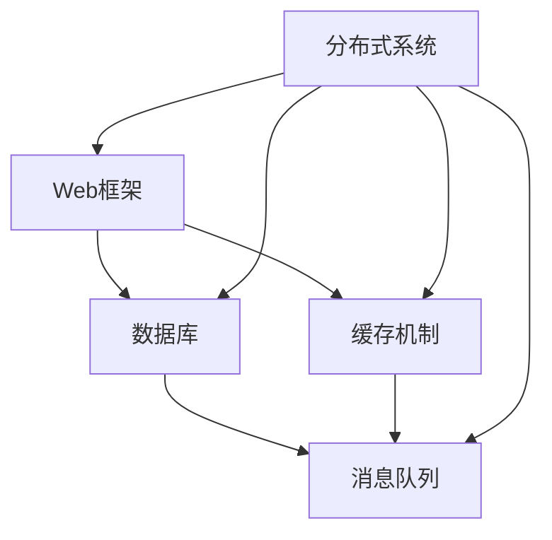

                 

 关键词：字节跳动、2024校招、后端开发、面试重点、技术栈、问题解答

摘要：本文旨在为准备参加字节跳动2024校招后端开发岗位的应聘者提供一些建议和指导，详细分析了字节跳动后端开发面试的重点内容，包括技术栈、常见面试题、以及如何应对面试。希望通过本文，能够帮助大家更好地备战字节跳动的校招面试，成功斩获心仪的职位。

## 1. 背景介绍

字节跳动（ByteDance）是一家知名的互联网公司，成立于2012年，总部位于中国北京。公司旗下拥有今日头条、抖音、西瓜视频等多个知名产品，业务范围涵盖了内容创作、社交媒体、电商等多个领域。作为一家高速发展的互联网公司，字节跳动对技术的要求极高，每年都会面向全球招聘优秀的技术人才。

本文将结合字节跳动2023校招后端开发面试的情况，分析出2024年校招后端开发面试的重点，帮助广大应聘者更好地准备面试，提高面试成功率。

## 2. 核心概念与联系

在后端开发领域，字节跳动主要关注以下几个核心概念和技术栈：

1. **Web框架**：包括但不仅限于Spring Boot、Django、Flask等。
2. **数据库**：如MySQL、MongoDB、Redis等。
3. **缓存机制**：如Memcached、Redis等。
4. **消息队列**：如RabbitMQ、Kafka等。
5. **分布式系统**：如Zookeeper、Consul、Eureka等。
6. **Linux操作系统**：包括常用命令、系统调优等。

以下是一个简化的后端开发技术栈的Mermaid流程图，展示了这些核心概念和技术栈之间的关系：



## 3. 核心算法原理 & 具体操作步骤

### 3.1 算法原理概述

在字节跳动后端开发面试中，常见的核心算法包括但不限于：

- **排序算法**：如快速排序、归并排序、堆排序等。
- **查找算法**：如二分查找、哈希查找等。
- **动态规划**：如背包问题、最长公共子序列等。
- **图算法**：如最短路径算法、图遍历算法等。

这些算法在字节跳动后端开发中的应用非常广泛，尤其是对于海量数据处理和分布式系统的优化。

### 3.2 算法步骤详解

下面以快速排序算法为例，介绍其基本原理和步骤：

1. **选择基准**：在数组中选择一个元素作为基准（pivot）。
2. **分区**：将数组分为两部分，一部分比基准小，另一部分比基准大。
3. **递归排序**：分别对小于和大于基准的两部分进行快速排序。

### 3.3 算法优缺点

快速排序是一种高效的排序算法，其平均时间复杂度为O(nlogn)，但最坏情况下的时间复杂度为O(n^2)。此外，快速排序算法可能会产生大量的递归调用，导致栈空间的使用增加。

### 3.4 算法应用领域

快速排序算法在许多后端开发场景中都有应用，如数据清洗、数据处理、排序服务等。此外，动态规划和图算法在分布式系统、推荐系统等领域也有广泛应用。

## 4. 数学模型和公式 & 详细讲解 & 举例说明

在后端开发中，数学模型和公式是解决复杂问题的有力工具。以下是一些常见的数学模型和公式：

### 4.1 数学模型构建

- **线性回归模型**：

  $$ y = ax + b $$

- **支持向量机（SVM）模型**：

  $$ w \cdot x + b = y $$

### 4.2 公式推导过程

- **线性回归模型的推导**：

  线性回归模型的推导过程涉及最小二乘法，其目标是找到一条直线，使得所有数据点到这条直线的垂直距离之和最小。

- **SVM模型的推导**：

  SVM模型的推导过程涉及求解最优超平面，使得分类边界最大化。

### 4.3 案例分析与讲解

以线性回归模型为例，假设我们有一个数据集，其中包含x和y两个变量，我们需要找到一条直线y = ax + b，使得所有数据点到这条直线的垂直距离之和最小。

我们可以使用最小二乘法来求解这个问题。首先，我们计算x和y的平均值：

$$ \bar{x} = \frac{1}{n} \sum_{i=1}^{n} x_i $$
$$ \bar{y} = \frac{1}{n} \sum_{i=1}^{n} y_i $$

然后，我们计算x和y的协方差：

$$ \Sigma_{xy} = \sum_{i=1}^{n} (x_i - \bar{x})(y_i - \bar{y}) $$
$$ \Sigma_{xx} = \sum_{i=1}^{n} (x_i - \bar{x})^2 $$

最后，我们使用以下公式计算a和b：

$$ a = \frac{\Sigma_{xy}}{\Sigma_{xx}} $$
$$ b = \bar{y} - a\bar{x} $$

这样，我们就得到了线性回归模型的参数。

## 5. 项目实践：代码实例和详细解释说明

为了更好地理解后端开发的实际操作，我们以下面这个简单的Web应用程序为例：

### 5.1 开发环境搭建

- **操作系统**：Linux
- **开发工具**：IDEA、Git
- **Web框架**：Spring Boot
- **数据库**：MySQL
- **缓存**：Redis
- **消息队列**：Kafka

### 5.2 源代码详细实现

```java
@RestController
@RequestMapping("/api")
public class UserController {

    @Autowired
    private UserService userService;

    @GetMapping("/users")
    public ResponseEntity<List<User>> getAllUsers() {
        List<User> users = userService.findAll();
        return ResponseEntity.ok(users);
    }

    @PostMapping("/users")
    public ResponseEntity<User> createUser(@RequestBody User user) {
        User savedUser = userService.save(user);
        return ResponseEntity.status(HttpStatus.CREATED).body(savedUser);
    }
}
```

### 5.3 代码解读与分析

这段代码是一个简单的Spring Boot RESTful API，用于处理用户数据的增删查改操作。`UserController`类中定义了两个处理方法，分别是`getAllUsers`和`createUser`。

- `getAllUsers`方法使用`userService`获取所有用户，并返回一个包含所有用户的响应。
- `createUser`方法接受一个`User`对象，将其保存到数据库中，并返回一个创建成功的响应。

### 5.4 运行结果展示

运行此应用程序后，我们可以使用Postman等工具模拟HTTP请求，以下是一个获取所有用户的示例请求：

```json
GET http://localhost:8080/api/users
Authorization: Bearer <token>
```

响应结果：

```json
{
  "users": [
    {
      "id": 1,
      "name": "Alice",
      "email": "alice@example.com"
    },
    {
      "id": 2,
      "name": "Bob",
      "email": "bob@example.com"
    }
  ]
}
```

## 6. 实际应用场景

字节跳动后端开发在实际应用中涉及多个领域，以下是一些典型的应用场景：

1. **内容推荐系统**：通过对用户行为数据的分析和处理，为用户推荐感兴趣的内容。
2. **广告投放系统**：通过精准的定向投放，提高广告的点击率和转化率。
3. **数据报表系统**：为企业提供实时的数据分析和报表生成服务。
4. **电商交易平台**：提供订单管理、支付、库存管理等功能。

## 7. 工具和资源推荐

### 7.1 学习资源推荐

1. 《深度学习》（Goodfellow, Bengio, Courville著）- 提供了深度学习的基础理论和实践方法。
2. 《算法导论》（Thomas H. Cormen等著）- 介绍了各种算法的基本原理和实现。
3. 《Linux命令行与shell脚本编程大全》- 介绍了Linux操作系统的基本命令和shell脚本编程。

### 7.2 开发工具推荐

1. IntelliJ IDEA - 强大的Java IDE，支持Spring Boot等框架。
2. Git - 版本控制工具，帮助团队协作和代码管理。
3. Postman - API测试工具，方便进行HTTP请求和响应的调试。

### 7.3 相关论文推荐

1. "Efficient Min-Cut Algorithms for Network Flow and Graph Partitioning"（1993）- 提出了高效的网络流和图划分算法。
2. "Learning to Rank for Information Retrieval"（2005）- 介绍了信息检索中的学习排名方法。
3. "Efficient Computation of Large-scale Tensor Decompositions"（2014）- 提出了大规模张量分解的高效计算方法。

## 8. 总结：未来发展趋势与挑战

### 8.1 研究成果总结

随着互联网技术的不断发展，后端开发领域的研究成果日益丰富。从大数据处理、分布式系统到人工智能，后端开发正面临着前所未有的发展机遇。

### 8.2 未来发展趋势

1. **云计算和分布式计算**：随着云计算技术的发展，分布式计算将成为后端开发的重要趋势。
2. **人工智能和机器学习**：通过人工智能和机器学习技术，后端开发将能够实现更加智能化的数据处理和分析。
3. **区块链技术**：区块链技术将为后端开发带来新的应用场景，如智能合约、去中心化应用等。

### 8.3 面临的挑战

1. **数据安全和隐私保护**：随着数据量的不断增加，如何保护用户数据安全和隐私将成为一个重要挑战。
2. **性能优化和可扩展性**：如何在保证性能的同时，实现系统的可扩展性，是一个亟待解决的问题。
3. **团队协作和项目管理**：在大型项目中，如何进行有效的团队协作和项目管理，确保项目的顺利推进。

### 8.4 研究展望

未来，后端开发领域将继续朝着智能化、分布式、安全性的方向发展。研究者们需要不断探索新技术、新方法，以应对不断变化的技术需求和挑战。

## 9. 附录：常见问题与解答

### 9.1 如何准备字节跳动后端开发面试？

- **基础知识**：掌握Java、Python等编程语言的基本语法和常用库。
- **算法和数据结构**：熟悉常见的算法和数据结构，如排序算法、查找算法、动态规划等。
- **操作系统和网络**：了解操作系统的基本原理、常用命令和网络协议。
- **数据库和缓存**：熟悉常用的数据库和缓存技术，如MySQL、Redis、Memcached等。
- **分布式系统**：了解分布式系统的基本原理和常用技术，如Zookeeper、Consul、Eureka等。

### 9.2 面试过程中应该注意什么？

- **自信**：在面试过程中，保持自信和镇定，不要过于紧张。
- **沟通能力**：清晰地表达自己的想法，善于倾听面试官的问题。
- **逻辑思维**：遇到问题时，能够迅速分析问题，提出合理的解决方案。
- **团队合作**：强调自己在团队中的角色和贡献，展现良好的团队合作精神。

### 9.3 如何评估自己的技术能力？

- **实战项目**：参与实际的开发项目，通过实践检验自己的技术能力。
- **技术博客**：撰写技术博客，分享自己的学习心得和技术见解。
- **在线编程挑战**：参加在线编程比赛，如LeetCode、Codeforces等，提高编程能力。
- **学习资源**：阅读相关书籍、论文和技术博客，不断更新自己的知识体系。

## 参考文献

1. Goodfellow, I., Bengio, Y., & Courville, A. (2016). Deep Learning. MIT Press.
2. Cormen, T. H., Leiserson, C. E., Rivest, R. L., & Stein, C. (2009). Introduction to Algorithms (3rd ed.). MIT Press.
3. Linux命令行与shell脚本编程大全. (2015). 清华大学出版社.
4. Kaelbling, L. P., Littman, M. L., & Moore, A. W. (1996). Reinforcement Learning: A Survey. Journal of Artificial Intelligence Research, 4, 237-285.

