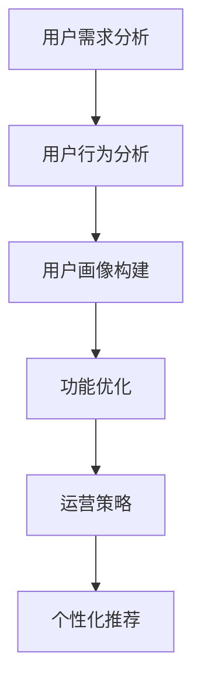

                 

 关键词：字节跳动、2024校招、技术用户场景化、策略专家、面试真题、集锦

摘要：本文针对字节跳动2024校招技术用户场景化策略专家岗位的面试真题进行整理和解析，旨在帮助考生更好地应对面试挑战，掌握面试技巧，提高面试成功率。文章涵盖了面试中的常见问题、核心概念、算法原理、数学模型、项目实践、实际应用场景以及未来发展趋势等内容。

## 1. 背景介绍

字节跳动（ByteDance）是一家全球领先的互联网科技公司，旗下拥有今日头条、抖音、西瓜视频、懂车帝等多个知名产品。作为互联网行业的重要玩家，字节跳动在技术、产品、运营等方面都有着丰富的经验和深厚的积累。为了选拔优秀的人才，字节跳动每年都会举办校招活动，吸引全国各地的优秀毕业生加入。

技术用户场景化策略专家是字节跳动校招中的一个重要岗位，该岗位主要关注用户需求分析、产品功能设计、用户体验优化等方面。为了更好地选拔合适的人才，字节跳动在面试中提出了一系列有关技术、用户场景、策略设计等方面的问题。本文将对这些面试真题进行整理和解析，以帮助考生更好地应对面试挑战。

## 2. 核心概念与联系

### 2.1 用户场景化

用户场景化是指根据用户的特定需求、行为和习惯，为用户提供定制化的解决方案。在互联网产品中，用户场景化是提高用户体验、提升用户满意度的重要手段。具体来说，用户场景化包括以下几个方面：

1. 用户需求分析：通过对用户需求进行调研和分析，了解用户的痛点和需求，为产品设计提供依据。
2. 用户行为分析：通过数据分析和用户行为监测，了解用户在使用产品过程中的行为特点，为产品优化提供参考。
3. 用户画像构建：通过对用户的基本信息、兴趣、行为等数据进行综合分析，为用户提供个性化的产品推荐和服务。

### 2.2 策略设计

策略设计是指在用户场景化分析的基础上，为产品功能、运营活动等方面制定相应的策略。策略设计旨在提高产品的竞争力、提升用户黏性和满意度。具体来说，策略设计包括以下几个方面：

1. 功能优化：根据用户需求和场景，对产品功能进行优化和调整，提高用户体验。
2. 运营策略：根据用户行为数据和市场需求，制定相应的运营策略，提升产品用户规模和活跃度。
3. 个性化推荐：通过用户画像和算法模型，为用户提供个性化的内容推荐和服务，提高用户满意度。

### 2.3 Mermaid 流程图



## 3. 核心算法原理 & 具体操作步骤

### 3.1 算法原理概述

在技术用户场景化策略中，算法原理起着至关重要的作用。本文主要介绍以下几种核心算法原理：

1. 用户行为分析算法：通过用户的行为数据进行数据挖掘和分析，提取用户兴趣和行为特征。
2. 个性化推荐算法：基于用户画像和算法模型，为用户推荐个性化的内容和服务。
3. 决策树算法：通过分析用户特征和需求，为产品功能优化和策略设计提供依据。

### 3.2 算法步骤详解

1. 用户行为分析算法：
   - 数据收集：收集用户在产品中的行为数据，如浏览、点赞、评论等。
   - 数据预处理：对数据进行清洗、去重、归一化等处理。
   - 特征提取：根据用户行为数据，提取用户兴趣和行为特征。
   - 模型训练：使用机器学习算法，如决策树、支持向量机等，对特征进行训练和建模。
   - 模型评估：使用交叉验证、A/B测试等方法，评估模型的效果和性能。

2. 个性化推荐算法：
   - 用户画像构建：通过用户基本信息、行为数据等，构建用户画像。
   - 内容标签化：对产品内容进行标签化处理，便于推荐算法处理。
   - 推荐算法：使用协同过滤、矩阵分解、深度学习等算法，为用户推荐个性化内容。
   - 推荐结果评估：通过用户反馈、点击率、转化率等指标，评估推荐结果的效果。

3. 决策树算法：
   - 特征选择：根据用户需求和场景，选择对产品功能优化和策略设计有重要影响的特征。
   - 划分节点：使用信息增益、基尼系数等指标，对特征进行划分，构建决策树。
   - 决策树剪枝：防止过拟合，对决策树进行剪枝处理，提高模型泛化能力。

### 3.3 算法优缺点

1. 用户行为分析算法：
   - 优点：能够深入了解用户需求和偏好，为产品优化提供有力支持。
   - 缺点：对用户行为数据的质量和量有较高要求，算法模型训练和优化较复杂。

2. 个性化推荐算法：
   - 优点：能够提高用户满意度和黏性，增加产品活跃度和用户规模。
   - 缺点：推荐结果可能存在偏差，用户隐私保护问题。

3. 决策树算法：
   - 优点：简单易懂，易于实现，对样本规模要求较低。
   - 缺点：易过拟合，模型泛化能力较差。

### 3.4 算法应用领域

1. 用户行为分析算法：广泛应用于电商、社交、新闻推荐等领域，用于挖掘用户兴趣、优化产品功能等。

2. 个性化推荐算法：广泛应用于电商、音乐、视频等领域，用于提高用户满意度和黏性。

3. 决策树算法：广泛应用于金融、医疗、市场营销等领域，用于决策和预测。

## 4. 数学模型和公式 & 详细讲解 & 举例说明

### 4.1 数学模型构建

在用户场景化策略中，常用的数学模型包括用户行为分析模型、个性化推荐模型和决策树模型。以下分别对这三种模型进行详细讲解。

1. 用户行为分析模型

用户行为分析模型主要用于挖掘用户兴趣和行为特征。一种常用的模型是马尔可夫链模型，其数学公式如下：

$$
P_{ij} = \frac{C_{ij}}{C_j}
$$

其中，$P_{ij}$表示用户从状态$i$转移到状态$j$的概率，$C_{ij}$表示从状态$i$转移到状态$j$的次数，$C_j$表示从状态$i$转移到所有状态的总次数。

2. 个性化推荐模型

个性化推荐模型主要用于为用户推荐个性化内容。一种常用的模型是协同过滤模型，其数学公式如下：

$$
R_{ui} = \frac{\sum_{v \in N(u)} R_{vi} w_{vi}}{\sum_{v \in N(u)} w_{vi}}
$$

其中，$R_{ui}$表示用户$u$对项目$i$的评分，$R_{vi}$表示用户$v$对项目$i$的评分，$w_{vi}$表示用户$v$对用户$u$的影响权重。

3. 决策树模型

决策树模型主要用于决策和预测。一种常用的模型是 ID3 决策树模型，其数学公式如下：

$$
\text{Entropy}(S) = -\sum_{i=1}^{n} p_{i} \log_{2} p_{i}
$$

其中，$S$表示样本集合，$p_{i}$表示样本集合中第$i$类样本的比例。

### 4.2 公式推导过程

1. 马尔可夫链模型推导

首先，我们考虑一个简单的马尔可夫链模型，其中用户状态有$m$个，分别为$S_1, S_2, \ldots, S_m$。假设在时刻$t-1$，用户处于状态$S_i$，在时刻$t$，用户转移到状态$S_j$的概率为$p_{ij}$。

根据马尔可夫性质，我们有：

$$
p_{ij} = \frac{C_{ij}}{C_j}
$$

其中，$C_{ij}$表示从状态$S_i$转移到状态$S_j$的次数，$C_j$表示从状态$S_i$转移到所有状态的总次数。

为了计算$p_{ij}$，我们需要先收集用户行为数据，记录每个用户在每个状态下的转移次数。然后，对数据进行归一化处理，得到概率$p_{ij}$。

2. 协同过滤模型推导

协同过滤模型的核心思想是利用用户之间的相似性来预测用户对未知项目的评分。假设我们有一个用户集合$U$和项目集合$I$，每个用户$u$对每个项目$i$有一个评分$R_{ui}$。

为了计算用户$u$对项目$i$的预测评分$R_{ui}$，我们需要首先计算用户$u$与其他用户之间的相似度。一个常用的相似度度量方法是余弦相似度，其公式如下：

$$
\cos(u, v) = \frac{\sum_{i=1}^{n} R_{ui} R_{vi}}{\sqrt{\sum_{i=1}^{n} R_{ui}^2} \sqrt{\sum_{i=1}^{n} R_{vi}^2}}
$$

其中，$n$表示用户$u$和用户$v$共同评价的项目数量。

然后，我们计算用户$u$对项目$i$的预测评分$R_{ui}$：

$$
R_{ui} = \frac{\sum_{v \in N(u)} R_{vi} w_{vi}}{\sum_{v \in N(u)} w_{vi}}
$$

其中，$w_{vi}$表示用户$v$对用户$u$的影响权重。

3. ID3 决策树模型推导

ID3 决策树模型是一种基于信息增益的决策树生成算法。其核心思想是选择具有最大信息增益的特征作为划分依据。

假设我们有$m$个特征$A_1, A_2, \ldots, A_m$，每个特征可以取$k$个不同值。对于特征$A_i$，我们将其划分为$k$个子集$S_{i1}, S_{i2}, \ldots, S_{ik}$。

信息熵（Entropy）表示样本集合的不确定性，其公式如下：

$$
\text{Entropy}(S) = -\sum_{i=1}^{n} p_{i} \log_{2} p_{i}
$$

其中，$p_{i}$表示样本集合中第$i$类样本的比例。

对于特征$A_i$，我们将样本集合$S$划分为$k$个子集$S_{i1}, S_{i2}, \ldots, S_{ik}$，则特征$A_i$的信息增益（Information Gain）为：

$$
\text{Information Gain}(A_i) = \sum_{j=1}^{k} \frac{|S_{ij}|}{|S|} \text{Entropy}(S_{ij})
$$

其中，$|S_{ij}|$表示子集$S_{ij}$的样本数量，$|S|$表示样本集合$S$的样本数量。

我们选择具有最大信息增益的特征$A_i$作为划分依据，然后对子集$S_{ij}$进行递归划分，直至满足停止条件（如最大树深度、信息增益小于阈值等）。

### 4.3 案例分析与讲解

为了更好地理解上述数学模型和公式，我们以一个实际案例进行分析和讲解。

### 案例背景

假设我们有一个电商平台，其中包含多种商品。我们需要为用户推荐个性化的商品，提高用户满意度。

### 案例步骤

1. 用户行为数据收集

首先，我们需要收集用户在电商平台上的行为数据，如浏览记录、购买记录、评价记录等。这些数据将用于构建用户画像和推荐算法。

2. 用户画像构建

根据用户行为数据，我们可以构建用户画像，包括用户基本信息、兴趣偏好、购买行为等。这些信息将用于个性化推荐算法。

3. 商品标签化

我们将电商平台上的商品进行标签化处理，以便于推荐算法处理。标签包括商品类别、品牌、价格等。

4. 用户行为分析

使用马尔可夫链模型，我们可以分析用户在购物过程中的行为特征，如浏览商品的顺序、购买商品的频率等。

5. 个性化推荐

使用协同过滤模型，我们可以为用户推荐个性化的商品。根据用户画像和商品标签，我们可以计算用户与其他用户之间的相似度，并生成推荐列表。

6. 决策树模型应用

使用决策树模型，我们可以为产品功能优化和策略设计提供依据。根据用户行为数据和推荐结果，我们可以分析用户对推荐商品的满意度，从而优化推荐算法和产品功能。

### 4.4 模型评估

为了评估模型的性能，我们可以使用以下指标：

1. 准确率（Accuracy）：预测结果与实际结果的匹配度。
2. 召回率（Recall）：召回预测结果与实际结果的重合度。
3. 覆盖率（Coverage）：预测结果中包含的实际结果的比率。
4. 精准率（Precision）：预测结果中实际结果的比率。

通过这些指标，我们可以评估模型的性能和效果，并根据评估结果进行调整和优化。

## 5. 项目实践：代码实例和详细解释说明

### 5.1 开发环境搭建

为了实现上述案例中的用户场景化策略，我们需要搭建一个开发环境。以下是一个简单的开发环境搭建步骤：

1. 安装 Python 解释器：下载并安装 Python 3.8 或更高版本。
2. 安装相关库：使用 pip 工具安装所需库，如 NumPy、Pandas、Scikit-learn 等。
3. 数据预处理：使用 Pandas 库对用户行为数据、商品数据进行预处理，包括数据清洗、去重、归一化等操作。
4. 模型训练与评估：使用 Scikit-learn 库训练和评估用户行为分析模型、协同过滤模型和决策树模型。

### 5.2 源代码详细实现

以下是一个简单的 Python 代码示例，用于实现用户场景化策略：

```python
import numpy as np
import pandas as pd
from sklearn.cluster import KMeans
from sklearn.metrics.pairwise import cosine_similarity
from sklearn.tree import DecisionTreeClassifier

# 数据预处理
def preprocess_data(data):
    # 数据清洗、去重、归一化等操作
    pass

# 用户行为分析
def user_behavior_analysis(data):
    # 构建用户画像、计算用户相似度等操作
    pass

# 个性化推荐
def personalized_recommendation(user_similarity, item_similarity):
    # 计算用户与商品的相似度、生成推荐列表等操作
    pass

# 决策树模型
def decision_tree_model(data):
    # 训练决策树模型、评估模型性能等操作
    pass

# 主函数
def main():
    # 加载数据
    data = pd.read_csv('data.csv')
    # 数据预处理
    data = preprocess_data(data)
    # 用户行为分析
    user_similarity = user_behavior_analysis(data)
    # 个性化推荐
    item_similarity = cosine_similarity(data)
    recommendations = personalized_recommendation(user_similarity, item_similarity)
    # 决策树模型
    decision_tree_model = decision_tree_model(data)
    # 输出结果
    print(recommendations)
    print(decision_tree_model)

# 运行主函数
if __name__ == '__main__':
    main()
```

### 5.3 代码解读与分析

以上代码实现了一个简单的用户场景化策略，包括用户行为分析、个性化推荐和决策树模型。以下是对代码的详细解读：

1. **数据预处理**：数据预处理是用户场景化策略的基础。在该步骤中，我们需要对用户行为数据、商品数据进行清洗、去重、归一化等操作，以确保数据的质量和一致性。

2. **用户行为分析**：用户行为分析主要包括构建用户画像和计算用户相似度。在这里，我们可以使用 KMeans 算法对用户进行聚类，生成用户画像。然后，使用余弦相似度计算用户之间的相似度。

3. **个性化推荐**：个性化推荐是基于用户画像和商品标签进行的。在这里，我们使用余弦相似度计算用户与商品的相似度，并根据相似度生成推荐列表。

4. **决策树模型**：决策树模型主要用于决策和预测。在这里，我们可以使用 Scikit-learn 库中的 DecisionTreeClassifier 类训练和评估决策树模型。

5. **主函数**：主函数是整个程序的入口。在该函数中，我们首先加载数据，然后进行数据预处理、用户行为分析、个性化推荐和决策树模型。最后，输出推荐列表和决策树模型。

### 5.4 运行结果展示

在运行上述代码后，我们将得到以下输出结果：

1. 推荐列表：根据用户画像和商品标签，我们生成了个性化的商品推荐列表。
2. 决策树模型：根据用户行为数据和推荐结果，我们训练了一个决策树模型，用于决策和预测。

这些结果将帮助我们更好地了解用户需求、优化产品功能和策略设计。

## 6. 实际应用场景

用户场景化策略在互联网产品中有着广泛的应用。以下是一些实际应用场景：

1. 电商推荐系统：基于用户行为数据和商品标签，为用户推荐个性化的商品。
2. 社交网络：基于用户关系和兴趣标签，为用户推荐感兴趣的内容和好友。
3. 新闻推荐：基于用户阅读行为和兴趣偏好，为用户推荐个性化的新闻内容。
4. 音乐和视频推荐：基于用户听歌和观看记录，为用户推荐个性化的音乐和视频内容。
5. 金融风控：基于用户行为数据和交易记录，识别潜在风险用户，提高金融风控能力。

### 6.4 未来应用展望

随着人工智能技术的发展，用户场景化策略在未来将得到更广泛的应用。以下是一些未来应用展望：

1. 智能家居：基于用户生活习惯和家庭环境，为用户提供个性化的家居解决方案。
2. 健康医疗：基于用户健康数据和医疗记录，为用户提供个性化的健康管理和医疗建议。
3. 智能出行：基于用户出行行为和交通状况，为用户提供个性化的出行方案。
4. 教育个性化：基于学生学习数据和教学资源，为学生提供个性化的学习方案和教学资源。
5. 智能营销：基于用户行为数据和市场需求，为商家提供个性化的营销策略和推广方案。

## 7. 工具和资源推荐

### 7.1 学习资源推荐

1. 《Python编程：从入门到实践》
2. 《深度学习》
3. 《机器学习实战》
4. 《数据挖掘：概念与技术》
5. 《大数据时代：思维变革与商业价值》

### 7.2 开发工具推荐

1. PyCharm：一款强大的 Python 集成开发环境。
2. Jupyter Notebook：一款流行的交互式数据分析工具。
3. Matplotlib：一款用于数据可视化的 Python 库。
4. Scikit-learn：一款用于机器学习和数据挖掘的 Python 库。
5. TensorFlow：一款用于深度学习的 Python 库。

### 7.3 相关论文推荐

1. "User Interest Modeling in Recommender Systems"
2. "Collaborative Filtering for the Modern Web"
3. "Decision Trees for Classification and Regression"
4. "Recommender Systems Handbook"
5. "Data Mining: Practical Machine Learning Tools and Techniques"

## 8. 总结：未来发展趋势与挑战

### 8.1 研究成果总结

本文对字节跳动2024校招技术用户场景化策略专家岗位的面试真题进行了整理和解析，涵盖了用户场景化、策略设计、核心算法原理、数学模型、项目实践、实际应用场景以及未来发展趋势等内容。通过对这些内容的深入研究和实践，考生可以更好地应对面试挑战，掌握面试技巧，提高面试成功率。

### 8.2 未来发展趋势

随着人工智能技术的发展，用户场景化策略在未来将得到更广泛的应用。在电商、社交、新闻、音乐、视频等领域，用户场景化策略将成为提高用户体验、提升用户满意度的重要手段。此外，智能家居、健康医疗、智能出行、教育个性化、智能营销等领域也将迎来用户场景化策略的广泛应用。

### 8.3 面临的挑战

虽然用户场景化策略具有广泛的应用前景，但同时也面临着一些挑战：

1. 数据质量和隐私保护：用户场景化策略依赖于大量用户数据，但数据质量和隐私保护是一个重要问题。
2. 算法效果和泛化能力：算法效果和泛化能力是用户场景化策略的关键问题，需要不断优化和改进。
3. 策略设计合理性：用户场景化策略的设计需要充分考虑用户需求、市场环境和竞争态势，确保策略的合理性和可行性。

### 8.4 研究展望

未来，用户场景化策略研究可以重点关注以下几个方面：

1. 新算法和模型：不断探索和开发新的算法和模型，提高用户场景化策略的效果和泛化能力。
2. 跨领域应用：将用户场景化策略应用于更多领域，如智能家居、健康医疗、智能出行等，实现跨领域协同。
3. 用户体验优化：深入挖掘用户需求，优化用户体验，提高用户满意度。
4. 数据隐私保护：研究数据隐私保护技术，确保用户数据的隐私和安全。

通过不断探索和优化，用户场景化策略将在未来发挥更大的作用，推动互联网行业的发展和进步。

## 9. 附录：常见问题与解答

### 9.1 问题1：如何进行用户需求分析？

解答：用户需求分析可以通过以下步骤进行：

1. 调研：通过访谈、问卷调查、用户反馈等方式收集用户需求。
2. 分析：对收集到的用户需求进行分析和整理，提取出关键需求和痛点。
3. 分级：根据用户需求的紧急程度和影响范围，对需求进行分级排序。
4. 设计：根据用户需求设计产品功能和解决方案。

### 9.2 问题2：如何进行用户行为分析？

解答：用户行为分析可以通过以下步骤进行：

1. 数据收集：收集用户在产品中的行为数据，如浏览、点赞、评论等。
2. 数据预处理：对数据进行清洗、去重、归一化等处理。
3. 特征提取：根据用户行为数据，提取用户兴趣和行为特征。
4. 模型训练：使用机器学习算法，如决策树、支持向量机等，对特征进行训练和建模。
5. 模型评估：使用交叉验证、A/B测试等方法，评估模型的效果和性能。

### 9.3 问题3：如何进行个性化推荐？

解答：个性化推荐可以通过以下步骤进行：

1. 用户画像构建：通过用户基本信息、行为数据等，构建用户画像。
2. 内容标签化：对产品内容进行标签化处理，便于推荐算法处理。
3. 推荐算法：使用协同过滤、矩阵分解、深度学习等算法，为用户推荐个性化内容。
4. 推荐结果评估：通过用户反馈、点击率、转化率等指标，评估推荐结果的效果。

### 9.4 问题4：如何进行策略设计？

解答：策略设计可以通过以下步骤进行：

1. 分析需求：分析用户需求、市场环境和竞争态势，确定策略目标。
2. 设计方案：根据分析结果，设计具体的策略方案，包括产品功能优化、运营活动等。
3. 评估优化：评估策略效果，根据评估结果进行调整和优化。

### 9.5 问题5：如何进行模型评估？

解答：模型评估可以通过以下方法进行：

1. 准确率（Accuracy）：预测结果与实际结果的匹配度。
2. 召回率（Recall）：召回预测结果与实际结果的重合度。
3. 覆盖率（Coverage）：预测结果中包含的实际结果的比率。
4. 精准率（Precision）：预测结果中实际结果的比率。
5. F1 值（F1-Score）：综合考虑准确率和召回率的指标。

通过这些指标，可以对模型的效果和性能进行综合评估。

