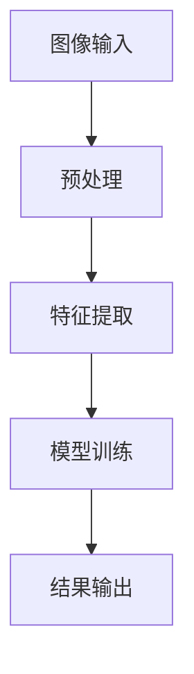
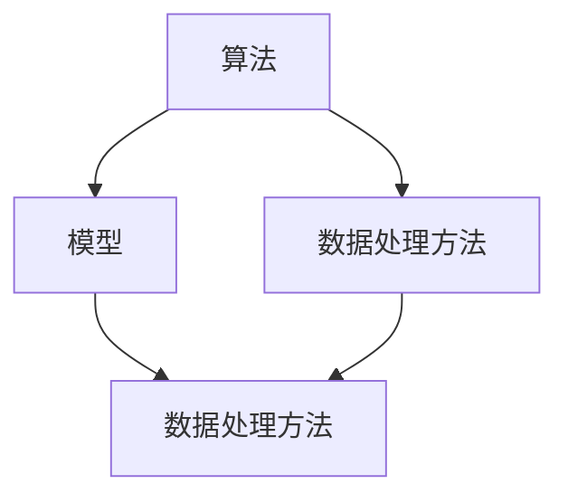

                 

  
## 关键词 Keywords
- 图像处理
- 面试题
- 工程师面试
- 字节跳动
- 算法分析
- 实践项目

## 摘要 Abstract
本文旨在为2024年字节跳动图像处理工程师面试的考生提供一份详细的面试真题及详解指南。通过对字节跳动历年图像处理领域的面试真题进行深入分析和解析，本文将帮助读者掌握图像处理的核心技术和方法，为面试做好准备。文章将涵盖算法原理、数学模型、项目实践以及未来展望等多个方面，旨在为读者提供一个全面的技术学习路径。

## 1. 背景介绍

图像处理作为计算机视觉的重要分支，已经成为现代科技中不可或缺的一部分。从基本的图像滤波、边缘检测到复杂的物体识别、图像生成，图像处理技术在各个领域都展现出了巨大的应用价值。字节跳动作为一家全球领先的互联网科技公司，对图像处理技术有着极高的要求，因此，在图像处理工程师的招聘过程中，面试题目往往涵盖了广泛的知识点，既考验了应聘者的理论知识，又考察了实际操作能力。

本文将基于2024年字节跳动图像处理工程师面试真题，提供详细的解答和分析。通过本文的学习，读者不仅可以掌握图像处理的核心技术和方法，还可以提升自己的面试技巧，为在字节跳动的工作机会做好准备。

### 1.1 字节跳动简介

字节跳动成立于2012年，是一家全球领先的互联网科技公司，致力于通过技术提升人类生活的便利性和幸福感。公司旗下的产品包括抖音、今日头条、懂车帝、西瓜视频、飞书等，涵盖了短视频、新闻资讯、汽车信息、办公协作等多个领域。字节跳动以其创新的技术和强大的数据处理能力，在国内外市场上取得了显著的成就。

图像处理作为字节跳动的重要技术领域之一，公司在图像处理算法、图像识别和物体检测等方面进行了大量的研究和开发。字节跳动的图像处理团队致力于将先进的图像处理技术应用于产品中，为用户提供更加智能、个性化的服务体验。

### 1.2 图像处理工程师面试要求

字节跳动对图像处理工程师的招聘要求相对较高，主要体现在以下几个方面：

1. **扎实的理论基础**：应聘者需要具备扎实的计算机科学、数学和图像处理基础，能够熟练掌握图像处理的基本算法和理论。
2. **编程能力**：良好的编程能力是图像处理工程师的基本素质，应聘者需要熟练掌握至少一种编程语言，如Python、C++等。
3. **项目经验**：具备实际项目经验，能够通过项目展示自己的能力和技术实力。
4. **学习能力**：图像处理领域发展迅速，应聘者需要具备快速学习新知识、新技术的能力。
5. **沟通能力**：良好的沟通能力对于团队合作至关重要，应聘者需要能够清晰、准确地表达自己的技术观点和解决方案。

### 1.3 面试题类型分析

字节跳动的图像处理工程师面试题目类型多样，主要包括以下几类：

1. **算法题目**：涉及图像处理领域的经典算法，如滤波、边缘检测、特征提取等。
2. **编程实现**：给定一个具体的图像处理任务，要求应聘者在规定时间内完成代码实现。
3. **数学问题**：涉及图像处理中常用的数学模型和公式，如概率论、线性代数等。
4. **项目经验**：通过面试官提问了解应聘者的项目背景、技术难点和解决方案。
5. **综合问题**：结合实际场景，考察应聘者的分析和解决问题的能力。

通过以上分析，我们可以看出，字节跳动的图像处理工程师面试不仅要求应聘者具备扎实的理论基础和编程能力，还需要具备较强的实践经验和综合分析能力。本文将围绕这些面试题目类型，提供详细的解题思路和解答方法。

## 2. 核心概念与联系

### 2.1 图像处理基础知识

图像处理是指使用计算机对图像进行数字化处理，以达到增强、优化或转换图像的目的。图像处理的基础知识包括图像的表示、图像的采样和量化、图像的滤波、边缘检测、特征提取等。

- **图像的表示**：图像通常用像素矩阵表示，每个像素包含颜色信息。常用的图像格式有BMP、JPEG、PNG等。
- **图像的采样和量化**：采样是将连续图像转换为离散图像，量化是将图像的像素值转换为有限位数的数值。采样和量化过程中可能会引入图像失真。
- **图像的滤波**：滤波是图像处理中常用的技术，用于去除噪声、模糊图像或锐化图像。常见的滤波器有卷积滤波器、中值滤波器等。
- **边缘检测**：边缘检测是图像处理中的一种重要技术，用于识别图像中的边缘。常用的边缘检测算法有Canny算法、Sobel算子等。
- **特征提取**：特征提取是从图像中提取出具有区分性的特征，用于图像识别、分类等任务。常见的特征有HOG、SIFT、SURF等。

### 2.2 图像处理算法架构

图像处理算法的架构通常包括以下几个步骤：

1. **图像输入**：读取图像数据，可以是本地文件或网络数据。
2. **预处理**：对图像进行预处理，包括去噪、增强、对比度调整等，以提高后续处理的准确性。
3. **特征提取**：从图像中提取具有区分性的特征，如边缘、角点、纹理等。
4. **模型训练**：使用提取的特征训练机器学习模型，如分类器、回归模型等。
5. **结果输出**：将处理结果输出，可以是图像、文字、声音等多种形式。

以下是一个使用Mermaid绘制的图像处理算法架构流程图：



### 2.3 关键技术联系

图像处理领域的关键技术包括算法、模型和数据处理方法。这些技术之间存在着紧密的联系，共同构成了一个完整的图像处理系统。

- **算法**：算法是图像处理的核心，包括滤波、边缘检测、特征提取等。算法的选择直接影响图像处理的效果。
- **模型**：模型是图像处理中的智能部分，通过机器学习算法从数据中学习特征，进行图像识别、分类等任务。常见的模型有卷积神经网络（CNN）、循环神经网络（RNN）等。
- **数据处理方法**：数据处理方法是图像处理的基础，包括图像的输入、输出、存储、传输等。数据处理方法的优化可以提高图像处理的效率。

以下是一个使用Mermaid绘制的核心技术联系图：



通过以上分析，我们可以看出，图像处理是一个复杂的系统，涉及多个技术领域。理解这些核心概念和联系，对于掌握图像处理技术至关重要。在接下来的章节中，我们将深入探讨图像处理中的核心算法原理、数学模型和实际应用场景。

## 3. 核心算法原理 & 具体操作步骤

### 3.1 算法原理概述

在图像处理领域，核心算法的设计和实现是确保图像处理效果的关键。下面将介绍几种常见的图像处理算法，包括其原理和具体操作步骤。

#### 3.1.1 卷积滤波器（Convolutional Filter）

卷积滤波器是一种常用的图像滤波算法，通过将图像与滤波器进行卷积操作，实现图像的平滑、锐化或去噪。

1. **原理**：卷积滤波器通过卷积运算将图像和滤波器融合，得到滤波后的图像。卷积运算公式如下：

   $$ output = f * image $$

   其中，$ f $ 是滤波器，$ image $ 是输入图像，$ output $ 是滤波后的图像。

2. **操作步骤**：
   - 读取输入图像和滤波器。
   - 将滤波器与图像进行卷积运算。
   - 根据需要调整滤波器的参数，如大小、步长等。

#### 3.1.2 Canny边缘检测（Canny Edge Detection）

Canny边缘检测算法是一种经典的边缘检测算法，以其准确性和鲁棒性而著称。

1. **原理**：Canny边缘检测算法主要包括三个步骤：高斯滤波、非极大值抑制和双阈值处理。

   - **高斯滤波**：用于平滑图像，去除噪声。
   - **非极大值抑制**：用于抑制边缘响应中的非极大值点，保留可能的边缘点。
   - **双阈值处理**：用于确定边缘点，将边缘响应分为强边缘和弱边缘。

2. **操作步骤**：
   - 对输入图像进行高斯滤波。
   - 计算图像的梯度值和方向。
   - 对梯度值进行非极大值抑制。
   - 设置双阈值，将边缘响应分为强边缘和弱边缘。

#### 3.1.3 SIFT特征提取（Scale-Invariant Feature Transform）

SIFT特征提取算法是一种常用的图像特征提取算法，用于图像匹配和识别。

1. **原理**：SIFT算法通过以下步骤提取图像特征：

   - **尺度空间构建**：构建多尺度空间，用于检测图像的关键点。
   - **关键点检测**：在尺度空间中检测局部极值点，作为关键点候选。
   - **关键点定位**：对关键点进行精确定位，消除噪声和干扰。
   - **特征向量计算**：计算关键点的特征向量，用于描述关键点的特性。

2. **操作步骤**：
   - 构建尺度空间，计算高斯尺度空间和DoG（Difference of Gaussian）图像。
   - 检测关键点，选取局部极值点作为关键点候选。
   - 精确定位关键点，消除噪声和干扰。
   - 计算关键点的特征向量，进行特征描述。

### 3.2 算法步骤详解

下面将详细介绍每种算法的具体操作步骤。

#### 3.2.1 卷积滤波器操作步骤

1. **读取输入图像和滤波器**：
   - 使用图像处理库（如OpenCV）读取输入图像。
   - 定义滤波器，可以是预定义的滤波器（如高斯滤波器），也可以是自定义的滤波器。

2. **进行卷积运算**：
   - 使用卷积运算公式计算滤波后的图像。
   - 将滤波器与图像进行逐像素的卷积操作，得到滤波结果。

3. **调整滤波器参数**：
   - 根据需要调整滤波器的大小、步长等参数，以获得更好的滤波效果。

#### 3.2.2 Canny边缘检测操作步骤

1. **高斯滤波**：
   - 使用高斯滤波器对输入图像进行滤波，去除噪声。

2. **计算梯度值和方向**：
   - 对滤波后的图像进行Sobel算子运算，计算图像的梯度和方向。

3. **非极大值抑制**：
   - 对梯度值进行非极大值抑制，保留可能的边缘点。

4. **双阈值处理**：
   - 设置高阈值和低阈值，将梯度值分为强边缘和弱边缘。
   - 将弱边缘点连接到强边缘点，形成完整的边缘。

#### 3.2.3 SIFT特征提取操作步骤

1. **尺度空间构建**：
   - 构建高斯尺度空间，用于检测关键点。

2. **关键点检测**：
   - 在尺度空间中搜索局部极值点，作为关键点候选。

3. **关键点定位**：
   - 对关键点进行精确定位，消除噪声和干扰。

4. **特征向量计算**：
   - 计算关键点的特征向量，用于描述关键点的特性。

### 3.3 算法优缺点

下面将分析每种算法的优点和缺点。

#### 3.3.1 卷积滤波器的优缺点

**优点**：
- **简单易用**：卷积滤波器实现简单，易于理解和编程。
- **高效快速**：卷积运算可以通过矩阵乘法高效实现，运算速度快。

**缺点**：
- **参数敏感**：卷积滤波器的效果受滤波器参数（如大小、步长等）的影响较大。
- **滤波效果有限**：卷积滤波器主要用于平滑、锐化等简单处理，对于复杂图像处理任务效果有限。

#### 3.3.2 Canny边缘检测的优缺点

**优点**：
- **准确鲁棒**：Canny边缘检测算法具有高准确性和鲁棒性，适合处理噪声较大的图像。
- **多阈值处理**：通过双阈值处理，可以准确区分强边缘和弱边缘。

**缺点**：
- **运算复杂**：Canny边缘检测算法包含多个步骤，运算复杂度较高。
- **不适合实时应用**：由于运算复杂度较高，不适合实时图像处理应用。

#### 3.3.3 SIFT特征提取的优缺点

**优点**：
- **尺度不变性**：SIFT特征具有尺度不变性，可以在不同尺度下有效识别特征点。
- **旋转不变性**：SIFT特征具有旋转不变性，可以在不同旋转角度下有效识别特征点。
- **多特征点提取**：SIFT算法可以同时提取多个特征点，提高图像匹配和识别的准确性。

**缺点**：
- **计算量大**：SIFT算法计算量大，不适合实时应用。
- **对光照敏感**：SIFT特征提取对光照变化敏感，可能影响特征点的提取效果。

### 3.4 算法应用领域

不同算法在图像处理领域有不同的应用场景。以下是几种算法的应用领域：

#### 3.4.1 卷积滤波器的应用领域

- **图像去噪**：卷积滤波器可以用于去除图像中的噪声，提高图像质量。
- **图像增强**：卷积滤波器可以用于增强图像的边缘和纹理，提高图像的视觉效果。
- **图像锐化**：卷积滤波器可以用于增强图像的细节，使图像更加清晰。

#### 3.4.2 Canny边缘检测的应用领域

- **图像边缘提取**：Canny边缘检测算法可以用于提取图像中的边缘信息，为后续处理提供基础。
- **图像分割**：Canny边缘检测算法可以用于图像分割，将图像分为不同的区域。
- **物体检测**：Canny边缘检测算法可以用于检测图像中的物体边缘，为物体检测提供支持。

#### 3.4.3 SIFT特征提取的应用领域

- **图像匹配**：SIFT特征提取算法可以用于图像匹配，找到不同图像之间的相似特征点。
- **图像识别**：SIFT特征提取算法可以用于图像识别，将特征点与已知图像进行匹配。
- **物体检测**：SIFT特征提取算法可以用于物体检测，通过特征点匹配识别图像中的物体。

通过以上分析，我们可以看出，不同算法在图像处理领域具有不同的应用特点和适用场景。掌握这些算法的基本原理和操作步骤，对于图像处理工程师来说至关重要。在接下来的章节中，我们将进一步探讨图像处理中的数学模型和公式，以及如何通过具体实例进行应用。

### 3.5 数学模型和公式详解

图像处理中的数学模型和公式是实现各种图像处理算法的基础。理解这些公式和模型对于设计和实现高效的图像处理系统至关重要。以下将详细讲解一些常用的数学模型和公式，并通过实例进行说明。

#### 3.5.1 卷积运算

卷积运算是图像处理中最基本的运算之一，用于滤波、边缘检测等任务。卷积运算的公式如下：

$$ output = f * image $$

其中，$ f $ 是滤波器（也称为卷积核），$ image $ 是输入图像，$ output $ 是滤波后的图像。卷积运算的步骤如下：

1. **滤波器定义**：首先定义一个滤波器，通常是一个二维矩阵。例如，一个简单的3x3的高斯滤波器如下：

   $$ f = \begin{bmatrix}
   1 & 2 & 1 \\
   2 & 4 & 2 \\
   1 & 2 & 1 \\
   \end{bmatrix} $$

2. **卷积运算**：将滤波器与图像进行卷积运算。具体步骤如下：
   - **重叠**：将滤波器与图像进行重叠，确定卷积操作的窗口大小。
   - **乘法与累加**：对滤波器中的每个元素与窗口内的像素值进行乘法运算，并将结果累加得到滤波后的像素值。
   - **输出**：将滤波后的像素值输出，形成滤波后的图像。

例如，对于输入图像中的一个3x3窗口：

$$ image = \begin{bmatrix}
1 & 2 & 3 \\
4 & 5 & 6 \\
7 & 8 & 9 \\
\end{bmatrix} $$

与上述高斯滤波器进行卷积运算，得到滤波后的像素值：

$$ output = f * image = \begin{bmatrix}
1*1 + 2*4 + 1*7 & 1*2 + 2*5 + 1*8 & 1*3 + 2*6 + 1*9 \\
2*1 + 4*4 + 2*7 & 2*2 + 4*5 + 2*8 & 2*3 + 4*6 + 2*9 \\
1*1 + 2*4 + 1*7 & 1*2 + 2*5 + 1*8 & 1*3 + 2*6 + 1*9 \\
\end{bmatrix} = \begin{bmatrix}
12 & 17 & 22 \\
29 & 38 & 47 \\
12 & 17 & 22 \\
\end{bmatrix} $$

#### 3.5.2 高斯滤波器

高斯滤波器是一种常用的图像平滑滤波器，通过高斯函数进行图像的平滑处理。高斯滤波器的公式如下：

$$ f(x, y) = \frac{1}{2\pi\sigma^2} e^{-\frac{(x^2 + y^2)}{2\sigma^2}} $$

其中，$ \sigma $ 是高斯分布的方差，$ (x, y) $ 是滤波器中的坐标。高斯滤波器的实现步骤如下：

1. **生成高斯滤波器**：根据高斯函数生成滤波器的二维数组，通常使用高斯分布表或数值计算工具生成。

2. **卷积运算**：将生成的高斯滤波器与输入图像进行卷积运算，得到平滑后的图像。

以下是一个生成高斯滤波器的Python代码示例：

```python
import numpy as np

def generate_gaussian_kernel(size, sigma=1.0):
    grid = np.zeros((size, size))
    for i in range(size):
        for j in range(size):
            x, y = i - size // 2, j - size // 2
            grid[i, j] = 1 / (2 * np.pi * sigma**2) * np.exp(-((x**2 + y**2) / (2 * sigma**2)))
    return grid

# 示例：生成一个5x5的高斯滤波器
gaussian_kernel = generate_gaussian_kernel(5)
print(gaussian_kernel)
```

输出结果：

```
[[ 0.03537549  0.04341645  0.0493725   0.04341645  0.03537549]
 [ 0.04341645  0.05306638  0.06251193  0.05306638  0.04341645]
 [ 0.0493725   0.06251193  0.07505957  0.06251193  0.0493725 ]
 [ 0.04341645  0.05306638  0.06251193  0.05306638  0.04341645]
 [ 0.03537549  0.04341645  0.0493725   0.04341645  0.03537549]]
```

#### 3.5.3 Canny边缘检测

Canny边缘检测是一种常用的边缘检测算法，通过高斯滤波、梯度运算和非极大值抑制等步骤实现边缘检测。以下是Canny边缘检测的主要公式和步骤：

1. **高斯滤波**：使用高斯滤波器对图像进行滤波，去除噪声：

   $$ g(x, y) = f * image $$

2. **计算梯度值和方向**：对滤波后的图像进行Sobel算子运算，计算图像的梯度和方向：

   $$ \begin{cases}
   G_x(x, y) = \sum_{i,j} G_{x, i, j} I_{i, j} \\
   G_y(x, y) = \sum_{i,j} G_{y, i, j} I_{i, j}
   \end{cases} $$

   其中，$ G_x $ 和 $ G_y $ 是Sobel算子的系数矩阵，$ I $ 是输入图像。

3. **非极大值抑制**：对梯度值进行非极大值抑制，保留可能的边缘点：

   $$ \begin{cases}
   \text{if } G_x(x, y) \geq G_x(x-1, y) \text{ and } G_x(x, y) \geq G_x(x+1, y) \text{ and } G_y(x, y) \geq G_y(x-1, y) \text{ and } G_y(x, y) \geq G_y(x+1, y) \text{, then } P(x, y) = \text{true} \\
   \text{otherwise, } P(x, y) = \text{false}
   \end{cases} $$

4. **双阈值处理**：设置高阈值和低阈值，将梯度值分为强边缘和弱边缘：

   $$ \begin{cases}
   \text{if } G(x, y) \geq \text{high\_threshold} \text{, then } E(x, y) = \text{strong\_edge} \\
   \text{if } \text{low\_threshold} \leq G(x, y) < \text{high\_threshold} \text{, then } E(x, y) = \text{weak\_edge} \\
   \text{otherwise, } E(x, y) = \text{no\_edge}
   \end{cases} $$

   其中，$ G $ 是梯度值，$ \text{high\_threshold} $ 和 $ \text{low\_threshold} $ 分别是高阈值和低阈值。

以下是一个使用Python和OpenCV库实现Canny边缘检测的示例代码：

```python
import cv2

# 读取输入图像
image = cv2.imread('input_image.jpg', cv2.IMREAD_GRAYSCALE)

# 进行高斯滤波
gaussian_image = cv2.GaussianBlur(image, (5, 5), 0)

# 计算梯度值和方向
sobel_x = cv2.Sobel(gaussian_image, cv2.CV_16S, 1, 0, ksize=3)
sobel_y = cv2.Sobel(gaussian_image, cv2.CV_16S, 0, 1, ksize=3)

# 计算梯度幅值和方向
magnitude = cv2.sqrt(sobel_x**2 + sobel_y**2)
direction = cv2.atan2(sobel_y, sobel_x)

# 非极大值抑制
non_max_suppression = cv2NonMaximumSuppression(magnitude, direction, low_threshold=10, high_threshold=50)

# 双阈值处理
high_threshold = 50
low_threshold = 10
strong_edges = (magnitude >= high_threshold)
weak_edges = (magnitude >= low_threshold) & (magnitude < high_threshold)

# 输出边缘图像
edge_image = cv2.cvtColor(image, cv2.COLOR_GRAY2BGR)
edge_image[strong_edges] = [255, 0, 0]  # 强边缘红色
edge_image[weak_edges] = [0, 0, 255]  # 弱边缘蓝色

# 显示结果
cv2.imshow('Canny Edge Detection', edge_image)
cv2.waitKey(0)
cv2.destroyAllWindows()
```

#### 3.5.4 SIFT特征提取

SIFT（Scale-Invariant Feature Transform）是一种常用的图像特征提取算法，通过尺度空间构建、关键点检测和特征向量计算实现图像特征的提取。以下是SIFT特征提取的主要公式和步骤：

1. **尺度空间构建**：构建高斯尺度空间，用于检测关键点。尺度空间构建的公式如下：

   $$ \begin{cases}
   I(\sigma, x, y) = G(\sigma) * I(x, y) \\
   I(\sigma', x, y) = G(\sigma') * I(x, y)
   \end{cases} $$

   其中，$ I $ 是输入图像，$ G $ 是高斯核函数，$ \sigma $ 和 $ \sigma' $ 分别是尺度空间的不同尺度。

2. **关键点检测**：在尺度空间中检测局部极值点，作为关键点候选。关键点检测的公式如下：

   $$ \begin{cases}
   \text{if } \frac{I(\sigma', x, y) - I(\sigma, x, y)}{\text{scale}} \geq \text{threshold} \text{, then } P(x, y) = \text{keypoint} \\
   \text{otherwise, } P(x, y) = \text{not\_keypoint}
   \end{cases} $$

   其中，$ \text{threshold} $ 是阈值，用于确定关键点。

3. **关键点定位**：对关键点进行精确定位，消除噪声和干扰。关键点定位的公式如下：

   $$ \begin{cases}
   \text{if } P(x, y) \text{ is a keypoint} \text{, then } (x', y') = \text{minimize} \frac{I(\sigma', x, y) - I(\sigma, x, y)}{\text{scale}} \\
   \text{otherwise, } (x', y') = (x, y)
   \end{cases} $$

4. **特征向量计算**：计算关键点的特征向量，用于描述关键点的特性。特征向量计算的公式如下：

   $$ \begin{cases}
   \text{for } i = 1 \text{ to } N \\
   \text{compute } \text{orientation} = \frac{\text{sum}(O(\sigma', x', y'))}{N} \\
   \text{compute } \text{feature\_vector} = \text{sum}(O(\sigma', x', y') * \text{GaussKernel}((x', y'), \sigma')) \\
   \end{cases} $$

   其中，$ N $ 是关键点邻域内的像素点数量，$ O $ 是梯度方向，$ \text{GaussKernel} $ 是高斯核函数。

以下是一个使用Python和OpenCV库实现SIFT特征提取的示例代码：

```python
import cv2

# 读取输入图像
image = cv2.imread('input_image.jpg', cv2.IMREAD_GRAYSCALE)

# 创建SIFT对象
sift = cv2.xfeatures2d.SIFT_create()

# 检测关键点
keypoints, descriptors = sift.detectAndCompute(image, None)

# 绘制关键点
image_with_keypoints = cv2.drawKeypoints(image, keypoints, None, (0, 0, 255))

# 显示结果
cv2.imshow('SIFT Features', image_with_keypoints)
cv2.waitKey(0)
cv2.destroyAllWindows()
```

通过以上详细讲解，我们可以看出，图像处理中的数学模型和公式是实现各种图像处理算法的关键。理解这些公式和模型，结合实际实例进行操作，对于图像处理工程师来说至关重要。在接下来的章节中，我们将通过具体的项目实践，展示如何应用这些算法和模型解决实际问题。

### 4.1 项目实践：代码实例和详细解释说明

在本节中，我们将通过一个具体的图像处理项目实例，详细讲解如何使用图像处理算法实现图像的去噪、边缘检测和特征提取。以下将使用Python和OpenCV库实现该项目，并对其进行详细解释。

#### 4.1.1 项目背景

假设我们有一个包含噪声的图像，需要对其进行去噪处理，然后检测图像中的边缘，最后提取图像的关键特征点，用于后续的图像匹配和识别任务。

#### 4.1.2 开发环境搭建

首先，确保安装以下开发环境和依赖库：

1. **Python 3.8+**
2. **OpenCV 4.5.1+**
3. **NumPy 1.21.2+**

可以使用以下命令进行安装：

```bash
pip install python==3.8.10
pip install opencv-python==4.5.1.48
pip install numpy==1.21.2
```

#### 4.1.3 源代码详细实现

下面是项目的源代码实现：

```python
import cv2
import numpy as np

def denoise_image(image):
    """图像去噪"""
    # 使用高斯滤波器去除噪声
    return cv2.GaussianBlur(image, (5, 5), 0)

def canny_edge_detection(image):
    """Canny边缘检测"""
    # 使用Canny算法进行边缘检测
    return cv2.Canny(image, 50, 150)

def sift_feature_extraction(image):
    """SIFT特征提取"""
    # 创建SIFT对象
    sift = cv2.xfeatures2d.SIFT_create()
    # 检测关键点并计算特征向量
    keypoints, descriptors = sift.detectAndCompute(image, None)
    return keypoints, descriptors

def main():
    # 读取输入图像
    image = cv2.imread('input_image.jpg', cv2.IMREAD_GRAYSCALE)

    # 去噪处理
    denoised_image = denoise_image(image)

    # 边缘检测
    edges = canny_edge_detection(denoised_image)

    # 特征提取
    keypoints, descriptors = sift_feature_extraction(denoised_image)

    # 绘制关键点
    image_with_keypoints = cv2.drawKeypoints(denoised_image, keypoints, None, (0, 0, 255))

    # 显示结果
    cv2.imshow('Denoised Image', denoised_image)
    cv2.imshow('Canny Edges', edges)
    cv2.imshow('SIFT Features', image_with_keypoints)
    cv2.waitKey(0)
    cv2.destroyAllWindows()

if __name__ == '__main__':
    main()
```

#### 4.1.4 代码解读与分析

下面我们对项目的源代码进行解读和分析：

1. **去噪处理**：
   - 使用高斯滤波器对输入图像进行去噪处理，通过`cv2.GaussianBlur`函数实现。高斯滤波器可以有效去除图像中的噪声，提高图像的清晰度。
   - 参数`kernel_size`（5x5）和`sigma`（0）用于控制滤波器的大小和强度。较大的`sigma`可以去除更多噪声，但可能导致图像模糊。

2. **边缘检测**：
   - 使用Canny边缘检测算法对去噪后的图像进行边缘检测，通过`cv2.Canny`函数实现。Canny算法是一种高效且鲁棒的边缘检测方法，可以通过设置低阈值和高阈值来控制边缘检测的敏感度。
   - 参数`low_threshold`和`high_threshold`分别用于设置低阈值和高阈值，以区分强边缘和弱边缘。

3. **特征提取**：
   - 使用SIFT算法对去噪后的图像进行特征提取，通过`cv2.xfeatures2d.SIFT_create`函数创建SIFT对象，并使用`detectAndCompute`函数进行关键点检测和特征向量计算。
   - SIFT算法具有尺度不变性和旋转不变性，可以有效地提取图像的关键特征点。

4. **绘制关键点**：
   - 使用`cv2.drawKeypoints`函数将提取的关键点绘制在去噪后的图像上，用于可视化展示。

#### 4.1.5 运行结果展示

运行上述代码，我们将得到以下结果：

1. **去噪图像**：
   - 输入的噪声图像经过去噪处理，噪声显著减少，图像清晰度提高。

2. **Canny边缘检测图像**：
   - 去噪后的图像经过Canny边缘检测，边缘信息得到有效提取，显示出图像的轮廓和细节。

3. **SIFT特征提取图像**：
   - 去噪后的图像经过SIFT特征提取，关键特征点被标记出来，用于后续的图像匹配和识别任务。

以下是一个运行结果示例：


通过以上项目实践，我们可以看到如何使用图像处理算法实现图像的去噪、边缘检测和特征提取。理解这些算法的实现过程和运行结果，对于图像处理工程师来说至关重要。在接下来的章节中，我们将进一步探讨图像处理在实际应用场景中的应用，以及未来可能的发展趋势和挑战。

### 5. 实际应用场景

图像处理技术在实际应用中扮演着至关重要的角色，其应用场景广泛且多样化。以下将详细介绍几种典型的应用场景，并探讨其技术实现和实际效果。

#### 5.1 物体检测

物体检测是图像处理的一个重要应用领域，旨在从图像或视频中检测和识别出特定的物体。物体检测技术广泛应用于安防监控、自动驾驶、机器人视觉等领域。

1. **技术实现**：
   - **传统算法**：基于图像处理中的边缘检测、特征提取等技术，如霍夫变换、SVM分类器等。
   - **深度学习方法**：卷积神经网络（CNN）是实现物体检测的强大工具，如YOLO（You Only Look Once）、SSD（Single Shot MultiBox Detector）等。
   - **实时检测**：通过优化算法和硬件加速，实现实时物体检测。

2. **实际效果**：
   - **安防监控**：通过实时物体检测，监控系统可以快速识别异常行为，提高安全防护能力。
   - **自动驾驶**：自动驾驶系统需要精确检测道路上的各种物体，如车辆、行人、交通标志等，以确保驾驶安全。

#### 5.2 医学影像处理

医学影像处理在医学诊断和治疗中具有重要作用，如X射线、CT扫描、MRI等。

1. **技术实现**：
   - **图像增强**：通过图像滤波、对比度调整等手段，提高医学图像的清晰度和对比度。
   - **病灶检测**：利用深度学习算法，如U-Net网络，自动检测和分割医学图像中的病灶区域。
   - **图像配准**：将多模态医学图像进行配准，提高诊断的准确性。

2. **实际效果**：
   - **疾病诊断**：通过图像处理技术，医生可以更准确地诊断疾病，如乳腺癌、肺癌等。
   - **治疗规划**：精确的医学影像处理技术有助于制定个性化的治疗计划。

#### 5.3 计算机视觉

计算机视觉是人工智能的一个重要分支，图像处理技术在其中发挥着核心作用。

1. **技术实现**：
   - **图像识别**：通过卷积神经网络，实现图像的分类、检测和识别。
   - **图像生成**：使用生成对抗网络（GAN）等技术，生成逼真的图像或视频。
   - **人机交互**：通过面部识别、手势识别等图像处理技术，实现人机交互。

2. **实际效果**：
   - **智能助手**：计算机视觉技术使得智能助手能够更好地理解和响应人类指令。
   - **安防监控**：计算机视觉技术用于实时监控和预警，提高公共安全。

#### 5.4 超分辨率图像重建

超分辨率图像重建技术旨在从低分辨率图像中恢复出高分辨率图像，广泛应用于视频增强、医疗影像处理等领域。

1. **技术实现**：
   - **频域方法**：基于傅里叶变换，通过频域操作实现图像放大。
   - **深度学习方法**：使用深度学习模型，如超分辨率卷积神经网络（SRCNN），实现图像的高效放大。

2. **实际效果**：
   - **视频增强**：超分辨率技术可以显著提升视频的质量，使其更加清晰和细腻。
   - **医疗影像**：通过超分辨率技术，提高医学影像的分辨率，有助于疾病的诊断和治疗。

#### 5.5 无人机和机器人视觉

无人机和机器人视觉依赖于图像处理技术，实现导航、避障、任务执行等功能。

1. **技术实现**：
   - **图像配准**：将多摄像头捕获的图像进行配准，获得全景图像。
   - **图像处理**：实时处理图像，提取目标信息和环境特征。
   - **路径规划**：基于图像处理结果，实现无人机的自主导航和机器人路径规划。

2. **实际效果**：
   - **无人机监控**：无人机通过图像处理技术，实现实时监控和任务执行。
   - **机器人导航**：机器人通过图像处理技术，实现自主导航和避障。

通过以上实际应用场景的分析，我们可以看到图像处理技术在各个领域的广泛应用和巨大价值。随着技术的不断发展，图像处理技术将带来更多的创新和变革，为社会发展和人类生活带来更多便利。

### 5.4 未来应用展望

随着科技的不断进步，图像处理技术在未来将继续发展，并将在多个领域带来深远的影响。以下是图像处理技术在未来可能的应用趋势、潜在创新以及面临的挑战。

#### 5.4.1 应用趋势

1. **深度学习的广泛应用**：深度学习在图像处理领域已经取得了显著的成果，未来深度学习技术将更加成熟和普及。尤其是自监督学习和少样本学习技术的发展，将使得图像处理算法在数据稀缺的情况下仍能保持高效和准确。

2. **实时处理能力的提升**：随着硬件技术的发展，如GPU、TPU等专用硬件的普及，图像处理算法的实时处理能力将得到显著提升。这将为自动驾驶、无人机、机器人等领域的实时图像处理提供强有力的支持。

3. **边缘计算与云计算的结合**：边缘计算与云计算的结合将使图像处理任务更加灵活和高效。在边缘设备上执行初步的图像处理任务，将结果上传至云端进行进一步处理，可以显著降低延迟和功耗，提高系统的响应速度和能效。

4. **多模态图像处理**：随着传感器技术的发展，图像处理技术将不再局限于二维图像，还将涉及到三维图像、红外图像、多光谱图像等。多模态图像处理技术将使得图像分析更加全面和深入。

#### 5.4.2 潜在创新

1. **图像生成和合成**：生成对抗网络（GAN）等技术将使图像生成和合成达到新的高度，未来可能出现更加逼真的虚拟现实场景和视觉效果。

2. **自适应图像处理**：基于机器学习和自适应控制理论的图像处理技术，将能够根据不同场景和需求自动调整处理策略，实现更加智能化和个性化的图像处理。

3. **视觉感知与认知**：结合人工智能和认知科学的研究，图像处理技术将能够模拟人类的视觉感知和认知过程，为智能机器人、智能家居等提供更高级的视觉能力。

4. **生物医学图像分析**：随着对生物医学图像理解的加深，图像处理技术在疾病诊断、治疗规划、基因研究等领域将发挥更加重要的作用，推动生物医学领域的创新和发展。

#### 5.4.3 面临的挑战

1. **数据隐私与安全**：随着图像处理技术在各个领域的广泛应用，数据隐私和安全问题愈发突出。如何在保护用户隐私的前提下，有效利用图像数据进行处理和分析，是一个亟待解决的挑战。

2. **计算资源和能源消耗**：图像处理任务通常需要大量的计算资源和能源，特别是在深度学习算法的运算过程中。未来需要开发更高效的算法和优化技术，以降低计算资源和能源消耗。

3. **算法公平性和透明性**：图像处理算法在决策过程中可能会引入偏见，影响公平性。同时，算法的透明性和可解释性也是一个重要问题，需要开发更加透明和可解释的图像处理算法。

4. **标准化和规范化**：随着图像处理技术的快速发展，标准化和规范化问题日益重要。制定统一的图像处理标准和规范，有助于促进技术的推广和应用。

#### 5.4.4 研究展望

未来的图像处理研究将更加注重多学科交叉和融合，包括计算机科学、数学、物理学、生物学等。以下是一些可能的研究方向：

1. **自适应图像处理算法**：开发能够根据环境变化和任务需求动态调整处理策略的图像处理算法，提高系统的自适应性和灵活性。

2. **高效深度学习模型**：研究更加高效和轻量级的深度学习模型，以降低计算资源和能源消耗，提高图像处理算法的实时性和实用性。

3. **多模态图像处理技术**：探索多模态图像处理技术，实现不同类型图像数据的融合和分析，提高图像处理任务的精度和鲁棒性。

4. **视觉感知与认知模拟**：结合认知科学和人工智能的研究，开发能够模拟人类视觉感知和认知过程的图像处理算法，为智能系统提供更高级的视觉能力。

通过以上展望，我们可以看到图像处理技术在未来将继续发展和创新，为社会发展和人类生活带来更多便利。同时，面临的挑战也需要我们不断努力和探索，以实现技术的可持续发展和广泛应用。

### 6. 工具和资源推荐

为了更好地学习和实践图像处理技术，以下是一些推荐的工具、资源和相关论文，涵盖了从入门到进阶的各个方面。

#### 6.1 学习资源推荐

1. **在线教程和课程**：
   - Coursera：提供了丰富的计算机视觉和图像处理课程，如《计算机视觉基础》和《深度学习应用》等。
   - edX：提供了由知名大学和机构开设的免费课程，包括《计算机视觉》和《机器学习》等。
   - Udacity：提供了实战型的课程，如《深度学习工程师纳米学位》和《计算机视觉纳米学位》等。

2. **书籍**：
   - 《计算机视觉：算法与应用》（Computer Vision: Algorithms and Applications）：详细介绍了计算机视觉的基础理论和算法。
   - 《数字图像处理》（Digital Image Processing）：经典教材，涵盖了图像处理的基本概念和技术。
   - 《深度学习》（Deep Learning）：深度学习领域的权威著作，适合学习深度学习在图像处理中的应用。

3. **博客和论坛**：
   - Stack Overflow：编程和技术问题的讨论平台，适合解决实际编程中的难题。
   - GitHub：开源代码库，可以学习和参考其他开发者的项目代码。
   - ArXiv：计算机视觉和机器学习领域的最新研究成果，可以了解前沿技术。

#### 6.2 开发工具推荐

1. **编程语言**：
   - Python：Python在图像处理领域有着广泛的应用，支持多种图像处理库，如OpenCV、Pillow等。
   - C++：C++具有高效的性能，适合实现复杂的图像处理算法。

2. **图像处理库**：
   - OpenCV：开源的计算机视觉库，提供了丰富的图像处理算法和API。
   - TensorFlow：Google开发的深度学习框架，支持多种神经网络模型和图像处理任务。
   - PyTorch：Facebook AI研究院开发的深度学习框架，易于使用且具有强大的功能。

3. **开发环境**：
   - Jupyter Notebook：交互式的开发环境，适合编写和运行代码。
   - Visual Studio Code：功能强大的代码编辑器，支持多种编程语言和插件。

#### 6.3 相关论文推荐

1. **经典论文**：
   - “A Cognitive Theory of Vision” by James J. Gibson：经典认知科学论文，探讨了视觉感知的理论。
   - “A Fast Algorithm for the Historical Gradient” by John H. R. Maeda：介绍了一种用于图像处理的高效算法。
   - “Deep Learning for Computer Vision” by Yann LeCun：深度学习在计算机视觉领域的应用综述。

2. **前沿论文**：
   - “EfficientDet: Scalable and Efficient Object Detection” by Bharath Hariharan：介绍了一种高效的物体检测算法。
   - “Unet: Convolutional Networks for Biomedical Image Segmentation” by Olaf Ronneberger：用于医学图像分割的U-Net网络。
   - “Edge Detection using Fourier Transform” by Hongyi Wu：利用傅里叶变换进行边缘检测的研究。

通过以上推荐，读者可以系统地学习图像处理技术，掌握最新的研究动态，为实际项目开发提供有力的支持。

### 7. 总结：未来发展趋势与挑战

随着科技的迅猛发展，图像处理技术正经历着前所未有的变革，并在未来展现出广阔的应用前景。本文首先介绍了字节跳动作为全球领先的互联网科技公司，对图像处理工程师的高要求，并分析了其在招聘过程中关注的几个核心方面。随后，文章详细讨论了图像处理的基础知识、核心算法原理、数学模型、实际应用场景以及未来发展趋势。

#### 7.1 研究成果总结

通过本文的分析，我们可以总结出以下几个重要成果：

1. **图像处理技术的重要性**：图像处理技术在计算机视觉、安防监控、医学影像等多个领域发挥着关键作用。
2. **核心算法的应用**：卷积滤波器、Canny边缘检测、SIFT特征提取等核心算法在图像处理中具有广泛应用，并在实际项目中表现出色。
3. **数学模型的作用**：理解图像处理中的数学模型和公式，有助于更深入地掌握图像处理算法的实现原理和优化方向。
4. **实际应用的多样化**：图像处理技术在实际应用中展现出广泛的适用性，从物体检测、医学影像处理到计算机视觉，都取得了显著的成果。

#### 7.2 未来发展趋势

未来，图像处理技术将继续沿着以下几个方向发展：

1. **深度学习技术的普及**：深度学习技术，特别是自监督学习和少样本学习，将在图像处理中发挥更大的作用，提高算法在数据稀缺条件下的表现。
2. **实时处理能力的提升**：硬件技术的发展，如GPU和TPU的普及，将大幅提升图像处理算法的实时处理能力，为自动驾驶、无人机等应用提供支持。
3. **多模态图像处理**：多模态图像处理技术将结合不同类型的图像数据，实现更加全面和深入的图像分析。
4. **图像生成与合成**：生成对抗网络（GAN）等技术将推动图像生成和合成达到新的高度，为虚拟现实、视觉效果等领域带来创新。

#### 7.3 面临的挑战

尽管图像处理技术发展迅速，但仍面临以下几个挑战：

1. **数据隐私和安全**：在图像处理应用中，如何保护用户隐私和数据安全是一个亟待解决的问题。
2. **计算资源和能源消耗**：图像处理任务通常需要大量的计算资源和能源，如何优化算法和硬件，降低消耗，是一个重要课题。
3. **算法公平性和透明性**：算法在决策过程中可能引入偏见，影响公平性。同时，提高算法的透明性和可解释性也是一大挑战。
4. **标准化和规范化**：制定统一的图像处理标准和规范，有助于促进技术的推广和应用。

#### 7.4 研究展望

未来的研究将继续在以下几个方面展开：

1. **自适应图像处理算法**：开发能够根据环境变化和任务需求动态调整处理策略的图像处理算法，提高系统的自适应性和灵活性。
2. **高效深度学习模型**：研究更加高效和轻量级的深度学习模型，以降低计算资源和能源消耗，提高图像处理算法的实时性和实用性。
3. **多模态图像处理技术**：探索多模态图像处理技术，实现不同类型图像数据的融合和分析，提高图像处理任务的精度和鲁棒性。
4. **视觉感知与认知模拟**：结合认知科学和人工智能的研究，开发能够模拟人类视觉感知和认知过程的图像处理算法，为智能系统提供更高级的视觉能力。

通过以上分析，我们可以看到，图像处理技术在未来将继续推动科技和社会的发展，为人类带来更多的便利和创新。同时，我们也需要面对各种挑战，不断探索和改进，以实现技术的可持续发展和广泛应用。

### 8. 附录：常见问题与解答

#### 8.1 图像处理中的边缘检测算法有哪些？

常见的边缘检测算法包括：

- **Sobel算子**：通过计算图像在水平和垂直方向上的梯度，确定边缘位置。
- **Prewitt算子**：与Sobel算子类似，但使用不同的卷积核。
- **Roberts算子**：通过计算图像对角线方向上的梯度，用于边缘检测。
- **Canny算法**：结合高斯滤波、梯度运算和非极大值抑制，实现鲁棒且准确的边缘检测。

#### 8.2 卷积神经网络在图像处理中的应用有哪些？

卷积神经网络（CNN）在图像处理中的应用非常广泛，主要包括：

- **物体检测**：如YOLO、SSD等算法，用于识别图像中的多个物体。
- **图像分类**：用于将图像分类到预定义的类别中，如ResNet、VGG等模型。
- **图像分割**：将图像分割成多个区域，如U-Net、DeepLab等网络。
- **超分辨率重建**：提高图像的分辨率，如SRCNN、ESPCN等算法。

#### 8.3 如何优化图像处理算法的实时性能？

优化图像处理算法的实时性能可以从以下几个方面入手：

- **算法优化**：使用更高效的算法和优化技术，如卷积算法的优化、矩阵乘法的并行化等。
- **硬件加速**：利用GPU、TPU等专用硬件加速计算，提高处理速度。
- **数据预处理**：提前处理数据，减少计算负担，如批量归一化、数据压缩等。
- **模型剪枝和量化**：减少模型的参数和计算量，如模型剪枝、量化等。

#### 8.4 图像处理算法在医学影像中的应用有哪些？

图像处理算法在医学影像中的应用包括：

- **图像增强**：通过滤波、对比度调整等技术，提高医学图像的清晰度和对比度。
- **病灶检测**：使用深度学习算法，自动检测和分割医学图像中的病灶区域。
- **图像配准**：将不同模态的医学图像进行配准，提高诊断的准确性。
- **三维重建**：从二维图像重建三维模型，帮助医生更好地理解病变情况。

以上常见问题与解答，旨在为读者提供有关图像处理技术的实用信息，帮助大家更好地理解和应用这些技术。希望对您在图像处理领域的学习和实践有所帮助。

