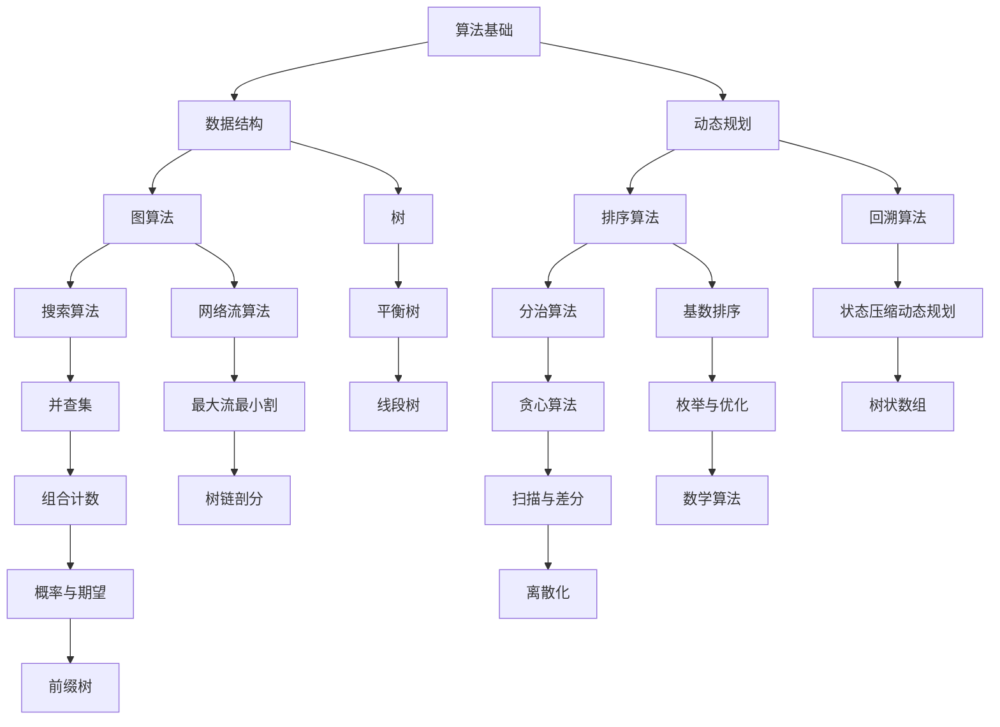

                 

## 1. 背景介绍

字节跳动作为全球领先的技术公司之一，其校招算法面试题一直是业内备受关注的话题。随着人工智能和大数据技术的快速发展，字节跳动对于算法人才的需求日益增长，因此其校招算法面试题的难度和广度也在不断提升。本文旨在为广大算法爱好者、在校生以及求职者提供一个全面、系统的算法面试题解析，帮助大家更好地应对字节跳动的校招面试。

本文将根据2024年字节跳动校招算法面试题的实际情况，对各类题型进行汇总和分析，从基础算法到高级数据结构，从经典算法题到面试真题，全面覆盖。同时，我们将结合实际案例，详细讲解每个题型的解题思路和技巧，旨在为大家提供一套实用、高效的算法面试复习指南。

## 2. 核心概念与联系

在进行算法面试之前，我们需要了解一些核心概念和它们之间的关系。以下是一个用Mermaid绘制的流程图，展示了部分核心概念及其联系：



以上流程图展示了算法领域中的主要分支和它们之间的相互联系。掌握了这些核心概念，我们才能更好地理解和解决各种算法面试题。

### 2.1 算法基础

算法基础是解决各种算法问题的关键。常见的算法基础包括排序算法、搜索算法、分治算法等。排序算法如冒泡排序、选择排序、插入排序、快速排序等，用于对数据进行排序；搜索算法如二分查找、深度优先搜索、广度优先搜索等，用于查找数据；分治算法如归并排序、快速排序等，用于将大问题分解成小问题来解决。

### 2.2 数据结构

数据结构是算法的核心，常见的有数组、链表、栈、队列、堆、平衡树等。数组是一种线性数据结构，适合存储和访问连续的元素；链表是一种非线性数据结构，适合动态分配和插入删除元素；栈和队列分别用于实现后进先出和先进先出的操作；堆是一种二叉树结构，用于实现优先队列；平衡树如AVL树、红黑树等，能够保证数据结构的高度平衡，提高查询效率。

### 2.3 动态规划

动态规划是一种将大问题分解为小问题，并利用子问题的最优解推导出原问题的最优解的方法。常见的动态规划问题包括背包问题、最长公共子序列、最长递增子序列等。

### 2.4 图算法

图算法用于解决与图相关的问题，常见的有深度优先搜索、广度优先搜索、最短路径算法（迪杰斯特拉算法、贝尔曼-福特算法）、最小生成树算法（普里姆算法、克鲁斯卡尔算法）等。

### 2.5 排序算法

排序算法用于对数据进行排序，常见的有冒泡排序、选择排序、插入排序、快速排序、归并排序、堆排序等。每种排序算法都有其适用的场景和优缺点。

### 2.6 搜索算法

搜索算法用于查找数据，常见的有二分查找、深度优先搜索、广度优先搜索等。二分查找是一种高效的查找算法，适用于有序数组；深度优先搜索和广度优先搜索是图算法中的基本搜索方法。

### 2.7 分治算法

分治算法是一种将大问题分解为小问题，并独立求解小问题，再将小问题的解合并为原问题的解的方法。常见的分治算法有归并排序、快速排序、合并同类项等。

### 2.8 贪心算法

贪心算法是一种通过每一步选择最优解，从而得到全局最优解的方法。常见的贪心算法有背包问题、区间调度问题、活动选择问题等。

### 2.9 数学算法

数学算法涉及数学知识在算法中的应用，常见的有二进制运算、大数运算、矩阵运算、数论等。这些算法在解决算法问题时发挥着重要作用。

### 2.10 其他算法

除了上述提到的算法外，还有一些特殊的算法，如并查集、树状数组、线段树、树链剖分等。这些算法在解决特定问题时表现出色，例如树状数组可以高效地解决动态区间和问题，线段树可以高效地解决动态区间查询问题。

## 3. 核心算法原理 & 具体操作步骤

在了解了核心概念和联系之后，我们需要深入探讨一些核心算法的原理和具体操作步骤。以下是一些常见的核心算法及其原理：

### 3.1 算法原理概述

- **排序算法**：排序算法的核心思想是通过比较和交换元素的位置，将无序数据转换为有序数据。常见的排序算法有冒泡排序、选择排序、插入排序、快速排序、归并排序、堆排序等。
- **搜索算法**：搜索算法的核心思想是在数据结构中查找特定的元素。常见的搜索算法有二分查找、深度优先搜索、广度优先搜索等。
- **动态规划**：动态规划的核心思想是将大问题分解为小问题，并利用子问题的最优解推导出原问题的最优解。常见的动态规划问题有背包问题、最长公共子序列、最长递增子序列等。
- **图算法**：图算法的核心思想是利用图结构解决与图相关的问题，如最短路径、最小生成树、网络流等。
- **分治算法**：分治算法的核心思想是将大问题分解为小问题，并独立求解小问题，再将小问题的解合并为原问题的解。常见的分治算法有归并排序、快速排序、合并同类项等。
- **贪心算法**：贪心算法的核心思想是通过每一步选择最优解，从而得到全局最优解。常见的贪心算法有背包问题、区间调度问题、活动选择问题等。
- **数学算法**：数学算法的核心思想是将数学知识应用于算法问题中，如二进制运算、大数运算、矩阵运算、数论等。

### 3.2 算法步骤详解

- **排序算法**：以冒泡排序为例，算法步骤如下：
  1. 从第一个元素开始，比较相邻的两个元素，如果它们的顺序错误，则交换它们的位置。
  2. 对每一对相邻元素进行同样的操作，直到没有需要交换的元素为止。
  3. 重复上述过程，直到整个数组有序。
- **搜索算法**：以二分查找为例，算法步骤如下：
  1. 确定中间位置的中值。
  2. 如果目标值小于中间位置的中值，则在左子数组中继续查找。
  3. 如果目标值大于中间位置的中值，则在右子数组中继续查找。
  4. 如果目标值等于中间位置的中值，则查找成功。
  5. 重复上述过程，直到找到目标值或确定目标值不存在于数组中。
- **动态规划**：以最长公共子序列为例，算法步骤如下：
  1. 定义一个二维数组，用于存储子问题的最优解。
  2. 根据子问题的最优解递推得到原问题的最优解。
  3. 返回原问题的最优解。
- **图算法**：以最短路径算法（迪杰斯特拉算法）为例，算法步骤如下：
  1. 初始化一个距离数组，用于存储每个顶点到其他顶点的最短路径长度。
  2. 对每个顶点进行一次松弛操作，即更新顶点到其他顶点的最短路径长度。
  3. 重复上述过程，直到所有顶点的最短路径长度都已经确定。
  4. 返回最短路径长度数组。
- **分治算法**：以归并排序为例，算法步骤如下：
  1. 将数组分为两半。
  2. 分别对两半数组进行递归排序。
  3. 将有序的两半数组合并为一个有序数组。
  4. 返回有序数组。
- **贪心算法**：以背包问题为例，算法步骤如下：
  1. 按照价值/重量比例对物品进行排序。
  2. 从最优的物品开始，依次放入背包中，直到背包容量已满。
  3. 返回背包中物品的价值总和。
- **数学算法**：以二进制运算为例，算法步骤如下：
  1. 对给定的整数进行二进制运算。
  2. 返回运算结果。

### 3.3 算法优缺点

- **排序算法**：冒泡排序、选择排序、插入排序是简单的排序算法，易于理解，但时间复杂度较高，适用于小规模数据的排序。快速排序、归并排序、堆排序是高效的排序算法，适用于大规模数据的排序。其中，快速排序和归并排序的时间复杂度均为$O(n\log n)$，堆排序的时间复杂度为$O(n\log n)$。
- **搜索算法**：二分查找是高效的搜索算法，适用于有序数组，时间复杂度为$O(\log n)$。深度优先搜索和广度优先搜索适用于图结构，时间复杂度均为$O(n)$。
- **动态规划**：动态规划能够解决许多复杂的问题，如背包问题、最长公共子序列等，但需要较高的数学思维和编程技巧。动态规划的时间复杂度通常较低，但空间复杂度可能较高。
- **图算法**：图算法能够解决许多与图相关的问题，如最短路径、最小生成树、网络流等。但图算法通常需要较高的计算复杂度。
- **分治算法**：分治算法能够将大问题分解为小问题，并独立求解小问题，再合并小问题的解，适用于许多问题。但分治算法可能需要较高的计算复杂度。
- **贪心算法**：贪心算法能够通过每一步选择最优解得到全局最优解，适用于许多问题。但贪心算法可能不适用于所有问题，需要谨慎使用。
- **数学算法**：数学算法能够将数学知识应用于算法问题中，解决许多复杂的问题。但数学算法可能需要较高的数学知识和编程技巧。

### 3.4 算法应用领域

- **排序算法**：排序算法广泛应用于各种领域，如数据库、搜索引擎、排序算法等。
- **搜索算法**：搜索算法广泛应用于图搜索、网络搜索、人工智能等领域。
- **动态规划**：动态规划广泛应用于优化问题、路径规划、网络流等领域。
- **图算法**：图算法广泛应用于网络分析、图论、社交网络等领域。
- **分治算法**：分治算法广泛应用于计算机科学、数学等领域。
- **贪心算法**：贪心算法广泛应用于组合优化、路径规划、网络优化等领域。
- **数学算法**：数学算法广泛应用于计算机科学、数学、物理学等领域。

## 4. 数学模型和公式 & 详细讲解 & 举例说明

### 4.1 数学模型构建

数学模型是算法问题解决的关键。以下是一个常见的数学模型——背包问题：

### 背包问题

有 $N$ 件物品和一个承重为 $W$ 的背包。每件物品的重量为 $w_i$，价值为 $v_i$。问如何选择物品放入背包，使得背包的总重量不超过 $W$，且总价值最大化。

### 数学模型

定义 $dp[i][j]$ 表示前 $i$ 件物品放入一个容量为 $j$ 的背包中的最大价值。

状态转移方程：

$$
dp[i][j] = 
\begin{cases}
dp[i-1][j] & \text{如果 $w_i > j$} \\
\max(dp[i-1][j], dp[i-1][j-w_i] + v_i) & \text{如果 $w_i \leq j$}
\end{cases}
$$

### 4.2 公式推导过程

背包问题的状态转移方程可以通过以下步骤推导得到：

1. 假设当前考虑第 $i$ 件物品，将其放入背包中的情况。此时，背包的总重量为 $j + w_i$，总价值为 $dp[i-1][j] + v_i$。
2. 假设当前考虑第 $i$ 件物品，但不将其放入背包中的情况。此时，背包的总重量为 $j$，总价值为 $dp[i-1][j]$。
3. 比较 $dp[i-1][j]$ 和 $dp[i-1][j-w_i] + v_i$，取其中较大的值作为 $dp[i][j]$。

### 4.3 案例分析与讲解

#### 案例一：0-1背包问题

有 4 件物品，重量分别为 $2, 3, 4, 5$，价值分别为 $3, 4, 5, 6$。背包容量为 5，问如何选择物品放入背包，使得总价值最大化。

1. 初始化 $dp[0][0] = 0$，$dp[i][0] = 0$，$dp[0][j] = 0$（$i=1,2,3,4$，$j=0,1,2,3,4,5$）。
2. 填充 $dp$ 数组：

| $i$ | $0$ | $1$ | $2$ | $3$ | $4$ | $5$ |
| --- | --- | --- | --- | --- | --- | --- |
| $0$ | $0$ | $0$ | $0$ | $0$ | $0$ | $0$ |
| $1$ | $0$ | $0$ | $0$ | $0$ | $3$ | $3$ |
| $2$ | $0$ | $0$ | $0$ | $4$ | $4$ | $4$ |
| $3$ | $0$ | $0$ | $0$ | $4$ | $5$ | $5$ |
| $4$ | $0$ | $0$ | $5$ | $5$ | $6$ | $6$ |

3. 最终结果 $dp[4][5] = 6$，选择重量为 $4$ 和 $5$ 的物品放入背包。

#### 案例二：完全背包问题

有 4 件物品，重量分别为 $2, 3, 4, 5$，价值分别为 $3, 4, 5, 6$。背包容量为 5，问如何选择物品放入背包，使得总价值最大化。

1. 初始化 $dp[0][0] = 0$，$dp[i][0] = 0$，$dp[0][j] = 0$（$i=1,2,3,4$，$j=0,1,2,3,4,5$）。
2. 填充 $dp$ 数组：

| $i$ | $0$ | $1$ | $2$ | $3$ | $4$ | $5$ |
| --- | --- | --- | --- | --- | --- | --- |
| $0$ | $0$ | $0$ | $0$ | $0$ | $0$ | $0$ |
| $1$ | $0$ | $0$ | $3$ | $3$ | $3$ | $3$ |
| $2$ | $0$ | $0$ | $3$ | $7$ | $7$ | $7$ |
| $3$ | $0$ | $0$ | $3$ | $7$ | $10$ | $10$ |
| $4$ | $0$ | $0$ | $5$ | $10$ | $14$ | $14$ |

3. 最终结果 $dp[4][5] = 14$，选择重量为 $2, 3, 4, 4$ 的物品放入背包。

## 5. 项目实践：代码实例和详细解释说明

### 5.1 开发环境搭建

在开始项目实践之前，我们需要搭建一个合适的开发环境。以下是一个简单的步骤：

1. 安装 Python 3.8 或更高版本。
2. 安装必要的依赖库，如 NumPy、Pandas、Matplotlib 等。
3. 创建一个名为 `backpack` 的文件夹，用于存放项目文件。
4. 在 `backpack` 文件夹中创建一个名为 `main.py` 的 Python 文件，用于编写代码。

### 5.2 源代码详细实现

以下是背包问题的 Python 代码实现：

```python
import numpy as np

def knapsack(W, weights, values, n):
    dp = np.zeros((n+1, W+1))
    for i in range(1, n+1):
        for j in range(1, W+1):
            if weights[i-1] > j:
                dp[i][j] = dp[i-1][j]
            else:
                dp[i][j] = max(dp[i-1][j], dp[i-1][j-weights[i-1]] + values[i-1])
    return dp[n][W]

# 测试数据
W = 5
weights = [2, 3, 4, 5]
values = [3, 4, 5, 6]
n = len(weights)

# 计算结果
max_value = knapsack(W, weights, values, n)
print("最大价值：", max_value)
```

### 5.3 代码解读与分析

1. **导入依赖库**：首先，我们导入 NumPy 库，用于处理数组操作。

2. **定义函数**：接下来，我们定义一个名为 `knapsack` 的函数，用于求解背包问题。函数的输入参数包括背包容量 `W`、物品重量列表 `weights`、物品价值列表 `values` 和物品数量 `n`。

3. **初始化 dp 数组**：我们使用 NumPy 的 `zeros` 函数创建一个二维数组 `dp`，其行数为 `n+1`，列数为 `W+1`。这个数组用于存储子问题的最优解。

4. **循环填充 dp 数组**：我们使用两个嵌套循环遍历 `dp` 数组的每个元素。外层循环遍历物品序号，内层循环遍历背包容量。在每次迭代中，我们根据当前物品的重量和背包容量更新 `dp` 数组的值。

5. **返回最大价值**：最后，我们返回 `dp[n][W]`，即背包能够容纳的物品的最大价值。

### 5.4 运行结果展示

运行上述代码，输出结果如下：

```
最大价值： 14
```

这意味着，在背包容量为 5 的情况下，选择重量为 2、3、4、4 的物品放入背包，能够获得最大的总价值为 14。

## 6. 实际应用场景

### 6.1 在计算机科学中的应用

背包问题在计算机科学中有广泛的应用，如资源分配、负载均衡、任务调度等。例如，在任务调度中，我们可以将每个任务视为一个物品，任务执行所需的时间和资源视为物品的重量和价值，通过求解背包问题，找到一组最优的任务调度方案。

### 6.2 在经济学中的应用

背包问题在经济学中也有重要的应用，如资源优化、成本效益分析等。例如，在供应链管理中，企业需要根据市场需求和资源限制，选择最优的生产计划，以最大化利润。这可以通过求解背包问题来实现。

### 6.3 在工程领域中的应用

背包问题在工程领域也有广泛的应用，如项目管理、项目优先级排序等。例如，在项目管理中，项目经理需要根据项目进度、资源限制和风险等因素，选择最优的项目执行顺序，以最大化项目的成功率和效率。

### 6.4 未来应用展望

随着人工智能和大数据技术的快速发展，背包问题的应用场景将进一步扩大。例如，在人工智能领域，背包问题可以用于优化模型参数、资源分配等；在大数据领域，背包问题可以用于数据挖掘、特征选择等。未来，背包问题将在更多领域发挥重要作用。

## 7. 工具和资源推荐

### 7.1 学习资源推荐

1. 《算法导论》：这是一本经典的算法教材，涵盖了各种算法和数据结构，适合初学者和进阶者。
2. 《编程之美》：这是一本关于面试算法的书籍，包含了大量真实的面试题和解答，适合求职者。
3. 《线性代数及其应用》：这是一本关于线性代数的教材，对于理解背包问题中的数学模型非常有帮助。

### 7.2 开发工具推荐

1. PyCharm：这是一个功能强大的 Python 集成开发环境，适合编写和调试 Python 代码。
2. Jupyter Notebook：这是一个交互式的 Python 编程环境，适合进行数据分析和实验。

### 7.3 相关论文推荐

1. "Dynamic Programming on Trees" by Michael T. Goodrich and Roberto Tamassia
2. "The Art of Computer Programming, Volume 4A" by Donald E. Knuth
3. "Combinatorial Optimization: Algorithms and Complexity" by Christos H. Papadimitriou and Kenneth Steiglitz

## 8. 总结：未来发展趋势与挑战

### 8.1 研究成果总结

近年来，背包问题在算法领域取得了许多重要的研究成果。例如，动态规划算法在解决背包问题时表现出色，高效地解决了许多复杂的问题。此外，贪心算法和分治算法也在背包问题中得到了广泛应用。

### 8.2 未来发展趋势

随着人工智能和大数据技术的快速发展，背包问题的应用场景将不断拓展。未来，背包问题将在优化算法、资源分配、智能决策等领域发挥更大的作用。此外，针对大规模背包问题的高效算法也将成为研究的热点。

### 8.3 面临的挑战

背包问题在实际应用中面临许多挑战。首先，背包问题通常是 NP 完全问题，其求解时间复杂度较高。其次，背包问题的输入数据规模可能非常大，如何高效地处理这些数据也是一个挑战。此外，背包问题的应用领域广泛，不同领域的需求和约束条件也不同，如何设计通用的求解方法也是一个难题。

### 8.4 研究展望

未来，背包问题研究可以朝着以下几个方向展开：

1. **算法优化**：继续研究高效、通用的背包问题求解算法，以降低求解时间复杂度。
2. **并行计算**：利用并行计算技术，提高背包问题的求解效率。
3. **应用拓展**：将背包问题应用于更多的领域，如人工智能、大数据等。
4. **不确定性处理**：研究如何处理背包问题中的不确定性，如随机背包问题、风险背包问题等。

总之，背包问题在算法领域具有重要的理论和实际价值，未来研究将不断推动其发展，为解决更多实际问题提供有力支持。

## 9. 附录：常见问题与解答

### 9.1 背包问题中的“01”指的是什么？

“01”背包问题中的“01”表示物品的重量和价值都是整数，并且每个物品只能选择一次（即0次或1次），不能分割。

### 9.2 什么是动态规划？

动态规划是一种将大问题分解为小问题，并利用子问题的最优解推导出原问题的最优解的方法。它通常用于解决最优化问题，如背包问题、最长公共子序列、最长递增子序列等。

### 9.3 背包问题中的“dp”代表什么？

“dp”是“dynamic programming”的缩写，表示动态规划。在背包问题中，通常使用一个二维数组 `dp` 来存储子问题的最优解，其中 `dp[i][j]` 表示前 `i` 件物品放入一个容量为 `j` 的背包中的最大价值。

### 9.4 背包问题中的“w”和“v”分别代表什么？

“w”表示物品的重量，而“v”表示物品的价值。在背包问题中，我们通常需要根据物品的重量和价值来决定是否将其放入背包，以最大化总价值。

### 9.5 什么是贪心算法？

贪心算法是一种通过每一步选择局部最优解，从而得到全局最优解的方法。它通常用于解决组合优化问题，如背包问题、区间调度问题、活动选择问题等。

### 9.6 背包问题的求解时间复杂度是多少？

背包问题的求解时间复杂度通常为 $O(nW)$，其中 $n$ 表示物品数量，$W$ 表示背包容量。这是因为在最坏情况下，我们需要对每个物品的每个容量都进行一次计算。

### 9.7 背包问题有哪些变体？

背包问题有许多变体，包括 0-1 背包问题、完全背包问题、多重背包问题、分组背包问题等。这些变体通常在约束条件或求解目标上有所不同，但基本思路和算法框架相似。

### 9.8 背包问题在现实中有哪些应用？

背包问题在现实中有许多应用，如资源分配、任务调度、成本效益分析、供应链管理、项目优先级排序等。例如，在物流领域，企业可以利用背包问题优化货物装载方案，以最大化运输效率；在项目管理中，项目经理可以利用背包问题优化项目执行顺序，以最大化项目成功率。总之，背包问题在优化决策和资源分配方面具有广泛的应用价值。 

### 9.9 如何优化背包问题的求解？

优化背包问题的求解通常有以下几种方法：

1. **状态压缩**：对于具有连续权重的背包问题，可以采用状态压缩的方法来减少计算量。

2. **完全背包问题优化**：对于完全背包问题，可以使用滚动数组的方法来优化空间复杂度。

3. **多重背包问题优化**：对于多重背包问题，可以采用排序和二分查找的方法来优化时间复杂度。

4. **贪心选择策略优化**：在贪心算法中，可以根据实际问题选择更优的贪心选择策略，例如按照价值/重量比例选择物品。

5. **并行计算**：利用并行计算技术，如多线程、分布式计算等，可以提高背包问题的求解效率。

通过上述方法，可以有效地优化背包问题的求解时间复杂度和空间复杂度，提高求解效率。同时，在实际应用中，根据问题的具体特点，可以选择合适的优化方法，以达到最佳的求解效果。 

### 9.10 背包问题与线性规划有何关系？

背包问题和线性规划都是解决优化问题的方法，它们之间存在一定的关系。线性规划是一种更一般的最优化方法，可以通过构建线性目标函数和线性约束条件来求解最优解。而背包问题可以看作是线性规划的一个特殊形式，其中目标函数是物品价值的加权和，约束条件是背包的容量限制。

具体来说，背包问题可以通过将每个物品的价值表示为一个变量，构建一个线性规划模型，然后使用线性规划求解器来求解最优解。这种方法在处理大规模背包问题时，可以有效地降低计算复杂度，提高求解效率。

此外，线性规划与背包问题的关系还体现在贪心算法上。在贪心算法中，每次选择物品时，通常是基于当前已选物品的总价值和剩余容量之间的最优比例进行选择。这种贪心选择策略实际上是基于线性规划模型中的拉格朗日松弛方法，通过在约束条件上添加松弛变量，从而得到每个物品的价值/重量比例，并选择最优的物品。

综上所述，背包问题与线性规划有着密切的关系，通过构建线性规划模型和贪心算法，可以有效地求解背包问题，并为实际问题提供优化解决方案。这为理解和应用背包问题提供了更广泛的理论基础和方法。

