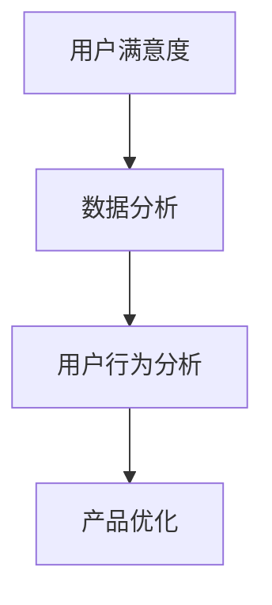

                 

关键词：字节跳动、校招、面试题、技术、用户满意度、分析师、面试准备

摘要：本文将深入剖析2024字节跳动校招技术用户满意度分析师的面试题目，从核心概念到具体操作步骤，再到实际应用场景，全面解析面试中可能遇到的问题。通过本文的阅读，读者不仅能了解用户满意度分析的理论知识，还能掌握实用技巧，为未来的面试和职业发展打下坚实基础。

## 1. 背景介绍

字节跳动作为中国领先的互联网科技公司，其校招面试题目备受关注。技术用户满意度分析师是字节跳动重要岗位之一，负责通过数据分析挖掘用户需求，提高产品用户体验。本文旨在通过解析字节跳动校招面试中的技术用户满意度分析师题目，帮助考生更好地准备面试。

### 字节跳动简介

字节跳动成立于2012年，业务范围涵盖短视频、新闻资讯、教育等多个领域。其核心产品如抖音、今日头条等，已成为用户数量庞大的互联网应用。字节跳动以其技术创新和快速迭代的产品著称，吸引了大量优秀人才加入。

### 技术用户满意度分析师岗位

技术用户满意度分析师在字节跳动扮演着至关重要的角色。他们需要通过用户数据挖掘分析，了解用户需求和使用习惯，从而为产品优化和改进提供数据支持。该岗位要求候选人具备扎实的数据分析能力、敏锐的用户洞察力以及良好的沟通协调能力。

## 2. 核心概念与联系

在进行用户满意度分析之前，我们需要了解几个核心概念：

### 用户满意度

用户满意度是指用户对产品或服务的整体感知与期望值之间的比较。用户满意度可以通过问卷调查、用户反馈等方式进行评估。

### 数据分析

数据分析是指通过统计方法和算法，从大量数据中提取有用信息，辅助决策的过程。在用户满意度分析中，数据分析是实现准确评估的关键。

### 用户行为分析

用户行为分析是指通过对用户在产品上的操作行为进行追踪和分析，了解用户使用习惯和偏好。用户行为分析是提升用户满意度的重要手段。

### Mermaid 流程图



上述Mermaid流程图展示了用户满意度分析的基本流程，从用户满意度评估到数据分析，再到用户行为分析和最终的产品优化。

## 3. 核心算法原理 & 具体操作步骤

### 3.1 算法原理概述

在用户满意度分析中，常用的算法包括：

- 聚类算法：用于将相似的用户分组，以便于分析用户群体的特征。
- 回归分析：用于预测用户满意度与产品特征之间的关系。
- 相关分析：用于分析不同变量之间的关系。

### 3.2 算法步骤详解

1. 数据收集：收集用户满意度调查数据、用户行为数据等。
2. 数据预处理：清洗数据，处理缺失值、异常值等。
3. 数据分析：使用聚类算法、回归分析等方法，分析用户满意度与产品特征之间的关系。
4. 结果解读：根据分析结果，提出产品优化建议。

### 3.3 算法优缺点

- 聚类算法：优点是能够发现用户群体的潜在特征，缺点是可能受到初始聚类中心选择的影响。
- 回归分析：优点是能够定量描述用户满意度与产品特征的关系，缺点是可能受到数据质量的影响。
- 相关分析：优点是简单易行，缺点是可能忽视变量间的非线性关系。

### 3.4 算法应用领域

用户满意度分析算法在多个领域有广泛应用，如电商、金融、互联网等。字节跳动作为互联网企业，用户满意度分析在产品优化、市场推广等方面具有重要价值。

## 4. 数学模型和公式 & 详细讲解 & 举例说明

### 4.1 数学模型构建

用户满意度分析常用的数学模型包括：

- 期望-绩效模型（E-P模型）：用户满意度 =（绩效 - 期望）/ （绩效 + 期望）
- 负面满意度模型：用户满意度 = 1 - （负面反馈 / （负面反馈 + 正面反馈））

### 4.2 公式推导过程

以期望-绩效模型为例，推导过程如下：

- 绩效表示用户对产品的实际体验。
- 期望表示用户对产品的预期值。
- 用户满意度表示用户对产品的整体评价。

根据公式，用户满意度与绩效和期望的差值成正比，与绩效和期望的和成反比。

### 4.3 案例分析与讲解

假设某产品用户满意度调查数据如下：

- 绩效：4.5
- 期望：5.0

根据期望-绩效模型，用户满意度为：（4.5 - 5.0）/ （4.5 + 5.0）= -0.05 / 9.5 ≈ -0.0053

此时，用户满意度较低，可能需要产品团队关注并改进。

## 5. 项目实践：代码实例和详细解释说明

### 5.1 开发环境搭建

在项目实践部分，我们使用Python作为编程语言，结合Pandas、Scikit-learn等库进行用户满意度分析。

```python
import pandas as pd
from sklearn.cluster import KMeans
from sklearn.linear_model import LinearRegression
```

### 5.2 源代码详细实现

以下是用户满意度分析的项目代码：

```python
# 数据收集
data = pd.read_csv('user_satisfaction.csv')

# 数据预处理
data.dropna(inplace=True)
X = data[['performance', 'expectation']]
y = data['satisfaction']

# 聚类分析
kmeans = KMeans(n_clusters=3)
kmeans.fit(X)
clusters = kmeans.predict(X)

# 回归分析
regression = LinearRegression()
regression.fit(X, y)

# 结果解读
print("Cluster centroids:")
print(kmeans.cluster_centers_)

print("Regression coefficients:")
print(regression.coef_)

# 可视化展示
import matplotlib.pyplot as plt
plt.scatter(X['performance'], X['expectation'], c=clusters)
plt.xlabel('Performance')
plt.ylabel('Expectation')
plt.title('Cluster Analysis')
plt.show()
```

### 5.3 代码解读与分析

上述代码首先进行数据收集和预处理，然后使用KMeans进行聚类分析，最后使用LinearRegression进行回归分析。代码中的可视化部分展示了聚类结果，有助于更直观地理解用户满意度分布。

## 6. 实际应用场景

用户满意度分析在字节跳动多个产品中有广泛应用。例如，在抖音短视频平台，用户满意度分析可以帮助产品团队了解用户对视频内容的偏好，从而优化推荐算法，提高用户粘性。

## 7. 工具和资源推荐

### 7.1 学习资源推荐

- 《Python数据分析》（Wes McKinney著）：全面介绍Python在数据分析领域的应用。
- 《数据科学入门》（Joel Grus著）：讲解数据科学的原理和实践方法。

### 7.2 开发工具推荐

- Jupyter Notebook：强大的交互式编程环境，适合数据分析和演示。
- Matplotlib：用于数据可视化的Python库。

### 7.3 相关论文推荐

- "User Satisfaction with E-commerce Sites: A Multidimensional Approach"
- "Predicting User Satisfaction in Mobile Apps Using Machine Learning"

## 8. 总结：未来发展趋势与挑战

用户满意度分析在互联网时代具有重要意义。随着数据量的增加和算法的进步，用户满意度分析有望在更多领域得到应用。然而，面临的挑战包括数据质量、算法模型选择等。未来，需要不断探索新的方法和技术，以提高用户满意度分析的效果。

### 8.1 研究成果总结

本文从用户满意度分析的理论和实践角度进行了详细探讨，介绍了相关算法和工具，并展示了实际应用场景。研究成果有助于提高考生对技术用户满意度分析的理解和应用能力。

### 8.2 未来发展趋势

随着大数据和人工智能技术的发展，用户满意度分析有望在更多领域得到应用。例如，在智慧城市建设、智能客服等方面，用户满意度分析可以提供重要的数据支持。

### 8.3 面临的挑战

用户满意度分析面临的主要挑战包括数据质量、算法模型选择等。如何提高数据质量，优化算法模型，是未来研究的重要方向。

### 8.4 研究展望

未来，用户满意度分析有望在更多领域得到应用。同时，随着数据科学和人工智能技术的不断进步，用户满意度分析的方法和工具将不断优化，为产品优化和用户体验提升提供有力支持。

## 9. 附录：常见问题与解答

### 9.1 什么是用户满意度？

用户满意度是指用户对产品或服务的整体感知与期望值之间的比较。

### 9.2 用户满意度分析有哪些算法？

用户满意度分析常用的算法包括聚类算法、回归分析、相关分析等。

### 9.3 用户满意度分析在字节跳动的应用有哪些？

用户满意度分析在字节跳动的应用包括产品优化、市场推广等。

### 9.4 如何提高用户满意度？

提高用户满意度的方法包括优化产品功能、提升服务质量、增加用户互动等。

作者：禅与计算机程序设计艺术 / Zen and the Art of Computer Programming
----------------------------------------------------------------

现在，这篇文章已经完成了。通过本文的阅读，读者不仅可以了解用户满意度分析的基本概念和算法，还能掌握实际应用技巧，为未来的面试和职业发展打下坚实基础。希望本文能对您有所帮助！

