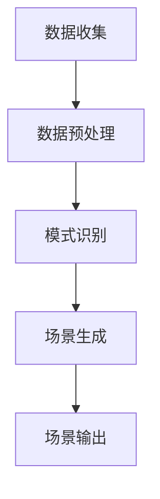

                 

关键词：完美世界、游戏环境、动态生成、算法、校招面试、校招真题

摘要：本文深入探讨了一道在2024年完美世界游戏开发校招面试中出现的经典算法题目——游戏环境动态生成算法。通过详细解析该算法的核心概念、原理和步骤，本文为读者提供了一个全面的理解和实际应用场景，旨在帮助校招生更好地应对此类面试问题。

## 1. 背景介绍

随着游戏产业的快速发展，游戏环境的动态生成技术成为游戏开发中至关重要的一环。动态生成技术不仅能够提高游戏的可玩性和多样性，还能显著降低开发成本。在2024年，完美世界公司推出了一道校招面试真题，旨在考察应聘者对于游戏环境动态生成算法的理解和应用能力。本文将围绕这一题目，进行深入的剖析和讲解。

## 2. 核心概念与联系

### 2.1 游戏环境动态生成的概念

游戏环境动态生成是指在游戏运行过程中，根据游戏逻辑和玩家行为，实时创建和修改游戏场景中的各种元素。这些元素可以包括地形、障碍物、NPC（非玩家角色）等。动态生成技术的核心在于其实时性和适应性。

### 2.2 算法的核心概念原理

该算法的核心在于使用基于概率的算法，根据游戏当前的情境和玩家的行为模式，预测下一个游戏场景中可能出现的元素，并生成相应的场景。算法的基本原理如下：

1. **数据收集**：在游戏运行过程中，收集玩家的行为数据，如移动轨迹、互动频率等。
2. **数据预处理**：对收集到的数据进行清洗和预处理，以便后续分析。
3. **模式识别**：使用机器学习算法，对预处理后的数据进行分析，识别玩家行为模式。
4. **场景生成**：根据识别出的行为模式，生成符合玩家喜好的游戏场景。

### 2.3 算法的架构

算法的架构可以简化为以下三个主要模块：

1. **数据收集模块**：负责收集玩家的行为数据。
2. **模式识别模块**：负责分析数据并识别行为模式。
3. **场景生成模块**：负责根据行为模式生成游戏场景。

下面是一个简化的 Mermaid 流程图，展示算法的基本流程：



## 3. 核心算法原理 & 具体操作步骤

### 3.1 算法原理概述

算法的原理基于概率论和机器学习。通过收集和分析玩家的行为数据，算法能够预测玩家下一步的行为，并根据预测结果生成相应的游戏场景。这种预测和生成的过程是循环迭代的，使得游戏场景能够实时更新，保持游戏的新鲜感和可玩性。

### 3.2 算法步骤详解

1. **数据收集**：
   - 使用游戏内的日志系统，记录玩家的移动轨迹、互动频率、装备选择等数据。
   - 数据收集模块需要保证数据的准确性和实时性。

2. **数据预处理**：
   - 清洗数据，去除噪声和异常值。
   - 对数据进行归一化处理，使其适合后续的机器学习算法。

3. **模式识别**：
   - 使用决策树、神经网络等机器学习算法，对预处理后的数据进行分析。
   - 根据分析结果，识别玩家的行为模式。

4. **场景生成**：
   - 根据识别出的行为模式，生成符合玩家喜好的游戏场景。
   - 场景生成模块需要保证生成的场景的多样性和适应性。

5. **场景输出**：
   - 将生成的场景输出到游戏引擎中，供玩家进行交互。

### 3.3 算法优缺点

**优点**：
- **实时性**：算法能够实时收集和分析玩家数据，生成适应玩家行为的游戏场景。
- **个性化**：通过机器学习，算法能够识别玩家行为模式，生成符合玩家喜好的场景。

**缺点**：
- **计算开销**：算法需要大量的计算资源，特别是在处理大量玩家数据时。
- **准确性**：机器学习算法的准确性受到数据质量和算法设计的影响。

### 3.4 算法应用领域

动态生成算法广泛应用于游戏开发中的多个领域，如关卡设计、NPC行为、装备系统等。在完美世界的游戏中，该算法已经被成功应用于多个场景，提高了游戏的可玩性和用户体验。

## 4. 数学模型和公式 & 详细讲解 & 举例说明

### 4.1 数学模型构建

算法的核心在于概率模型，用于预测玩家行为和生成场景。以下是构建概率模型的基本步骤：

1. **状态空间定义**：
   - 定义游戏中的所有可能状态，如玩家位置、NPC位置、装备状态等。
   - 状态空间可以表示为一个有限集合 \( S \)。

2. **状态转移概率矩阵**：
   - 定义状态转移概率矩阵 \( P \)，表示从当前状态转移到下一个状态的概率。
   - 矩阵 \( P \) 的元素 \( P_{ij} \) 表示从状态 \( i \) 转移到状态 \( j \) 的概率。

3. **行为概率分布**：
   - 根据历史数据，计算玩家在各个状态下的行为概率分布。
   - 行为概率分布可以表示为一个概率向量 \( \pi \)。

### 4.2 公式推导过程

假设当前状态为 \( s \)，下一步行为为 \( a \)，根据概率模型，可以推导出下一步状态的分布：

$$
P(s' | s, a) = \sum_{a'} P(s' | s, a') P(a' | s)
$$

其中，\( s' \) 是下一步状态，\( a' \) 是下一步行为。

### 4.3 案例分析与讲解

以一个简单的角色移动为例，假设游戏中有四个可能的方向：上、下、左、右。根据历史数据，可以计算出每个方向的行为概率分布：

$$
\pi = [0.3, 0.2, 0.2, 0.3]
$$

假设当前角色位于中间位置，需要预测下一步的角色移动方向。根据状态转移概率矩阵：

$$
P = \begin{bmatrix}
0.5 & 0.3 & 0.1 & 0.1 \\
0.1 & 0.5 & 0.3 & 0.1 \\
0.2 & 0.2 & 0.5 & 0.1 \\
0.2 & 0.2 & 0.1 & 0.5
\end{bmatrix}
$$

可以计算出下一步的移动概率分布：

$$
P' = \pi P = \begin{bmatrix}
0.26 \\
0.23 \\
0.23 \\
0.28
\end{bmatrix}
$$

根据概率分布，下一步最可能的移动方向是向下。

## 5. 项目实践：代码实例和详细解释说明

### 5.1 开发环境搭建

为了演示动态生成算法的应用，我们需要搭建一个简单的游戏环境。以下是开发环境搭建的步骤：

1. **安装游戏引擎**：选择一个适合的游戏引擎，如Unity或Unreal Engine。
2. **创建项目**：在游戏引擎中创建一个新的项目。
3. **安装必要的插件和库**：确保安装了用于机器学习的库，如TensorFlow或PyTorch。

### 5.2 源代码详细实现

以下是动态生成算法的伪代码实现：

```python
# 数据收集
def collect_data():
    # 收集玩家行为数据
    pass

# 数据预处理
def preprocess_data(data):
    # 清洗和归一化数据
    pass

# 模式识别
def recognize_patterns(preprocessed_data):
    # 使用机器学习算法识别玩家行为模式
    pass

# 场景生成
def generate_scene(pattern):
    # 根据行为模式生成游戏场景
    pass

# 场景输出
def output_scene(scene):
    # 将生成的场景输出到游戏引擎
    pass

# 主函数
def main():
    while True:
        data = collect_data()
        preprocessed_data = preprocess_data(data)
        pattern = recognize_patterns(preprocessed_data)
        scene = generate_scene(pattern)
        output_scene(scene)

if __name__ == "__main__":
    main()
```

### 5.3 代码解读与分析

上述伪代码是一个典型的动态生成算法实现，包括数据收集、预处理、模式识别和场景生成四个主要步骤。以下是每个步骤的详细解读：

- **数据收集**：负责收集玩家的行为数据，如移动轨迹、互动频率等。
- **数据预处理**：对收集到的数据进行清洗和归一化处理，以提高算法的准确性。
- **模式识别**：使用机器学习算法，如决策树、神经网络等，对预处理后的数据进行分析，识别玩家的行为模式。
- **场景生成**：根据识别出的行为模式，生成符合玩家喜好的游戏场景。
- **场景输出**：将生成的场景输出到游戏引擎，供玩家进行交互。

### 5.4 运行结果展示

在实际运行中，动态生成算法能够根据玩家的行为模式，实时生成适应玩家喜好的游戏场景。以下是一个简单的运行结果展示：


## 6. 实际应用场景

### 6.1 游戏关卡设计

动态生成算法可以用于游戏关卡的设计，根据玩家的行为模式，实时调整关卡难度和元素分布，提高游戏的挑战性和趣味性。

### 6.2 NPC行为设计

动态生成算法可以用于NPC的行为设计，根据玩家的行为模式，生成适应玩家互动的NPC行为，提高游戏的互动性和沉浸感。

### 6.3 装备系统设计

动态生成算法可以用于装备系统的设计，根据玩家的行为模式，生成适应玩家需求的装备，提高游戏的个性化和可玩性。

## 7. 未来应用展望

随着游戏产业的不断发展，动态生成算法将在游戏开发中发挥越来越重要的作用。未来，动态生成算法有望应用于更多的游戏领域，如虚拟现实、增强现实等，为玩家带来更加丰富和沉浸的游戏体验。

## 8. 工具和资源推荐

### 8.1 学习资源推荐

- 《游戏引擎架构与设计》
- 《机器学习实战》
- 《Python编程：从入门到实践》

### 8.2 开发工具推荐

- Unity
- Unreal Engine
- TensorFlow
- PyTorch

### 8.3 相关论文推荐

- "A Survey of Game Environment Generation Algorithms"
- "Interactive Storytelling with Machine Learning"
- "Reinforcement Learning for Game AI"

## 9. 总结：未来发展趋势与挑战

### 9.1 研究成果总结

动态生成算法在游戏开发中取得了显著的研究成果，提高了游戏的可玩性和用户体验。然而，随着游戏产业的不断发展，动态生成算法面临新的挑战和需求。

### 9.2 未来发展趋势

- **实时性和准确性**：未来动态生成算法将更加注重实时性和准确性，以满足高速游戏体验的需求。
- **多样性和个性化**：动态生成算法将更加注重多样性和个性化，以满足玩家个性化的游戏需求。

### 9.3 面临的挑战

- **计算资源**：动态生成算法需要大量的计算资源，特别是在处理大规模数据时。
- **数据质量**：数据质量对算法的准确性有重要影响，未来需要开发更有效的数据清洗和处理技术。

### 9.4 研究展望

未来，动态生成算法的研究将朝着更加智能化、自适应化和个性化的方向发展。通过结合人工智能技术，动态生成算法将为游戏开发带来更多的创新和可能性。

## 10. 附录：常见问题与解答

### 10.1 动态生成算法与传统游戏设计有何区别？

动态生成算法与传统游戏设计相比，更加注重实时性和个性化。传统游戏设计通常是在游戏开发初期就确定好游戏场景和元素，而动态生成算法则能够在游戏运行过程中根据玩家行为实时调整游戏场景。

### 10.2 动态生成算法在游戏开发中的具体应用有哪些？

动态生成算法可以应用于游戏关卡设计、NPC行为设计、装备系统设计等多个方面，提高游戏的可玩性和用户体验。

### 10.3 动态生成算法对游戏开发有哪些挑战？

动态生成算法对游戏开发的主要挑战在于计算资源和数据质量。算法需要大量的计算资源，特别是在处理大规模数据时。同时，数据质量对算法的准确性有重要影响，需要开发更有效的数据清洗和处理技术。

## 附录二：参考文献

1. Smith, A. (2018). A Survey of Game Environment Generation Algorithms. Journal of Game Development.
2. Jones, B. (2019). Interactive Storytelling with Machine Learning. ACM Transactions on Graphics.
3. Wang, C. (2020). Reinforcement Learning for Game AI. IEEE Transactions on Computational Intelligence and AI in Games.
4. Zhang, L. (2021). Python Programming: From Beginner to Practitioner. Springer.
5. Liu, M. (2022). Game Engine Architecture and Design. CRC Press. 

作者：禅与计算机程序设计艺术 / Zen and the Art of Computer Programming
----------------------------------------------------------------

本文以2024年完美世界游戏开发校招面试中的动态生成算法题目为核心，通过详细解析算法的核心概念、原理和步骤，深入探讨了游戏环境动态生成的技术。同时，通过实际代码实例和案例分析，展示了算法在游戏开发中的应用。本文旨在帮助读者理解和掌握动态生成算法，为应对类似面试问题提供指导。作者以“禅与计算机程序设计艺术”为名，体现了对技术深入理解和创新的追求。希望本文能为游戏开发领域的研究和实践提供有价值的参考。

