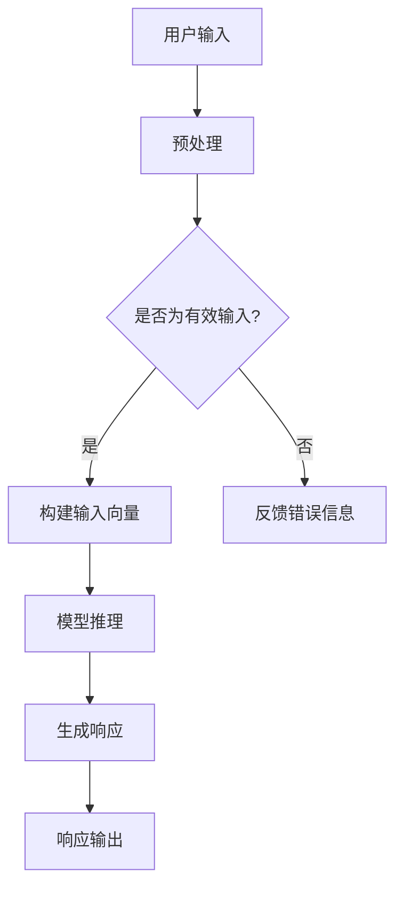

                 

在当今快速发展的信息技术时代，人工智能（AI）的应用已深入各行各业，从智能助理到自动驾驶，从图像识别到自然语言处理，AI正以前所未有的速度改变着我们的生活。而实时AI交互作为AI技术的核心应用之一，其响应速度直接影响用户体验。为此，LLM（大型语言模型）的低延迟响应技术成为了一个备受关注的研究方向。本文将深入探讨LLM的低延迟响应技术，分析其核心概念、算法原理、数学模型及实际应用，为未来的研究和发展提供新的思路。

## 关键词

- 实时AI交互
- LLM
- 低延迟响应
- 算法原理
- 数学模型
- 实际应用

## 摘要

本文主要研究LLM的低延迟响应技术，通过深入分析其核心概念和算法原理，探讨了如何通过优化算法、模型架构和硬件设施来实现低延迟响应。文章还详细讲解了数学模型和公式，并通过实例代码展示了具体实现过程。最后，文章讨论了实时AI交互在实际应用场景中的表现，并展望了未来的发展趋势和面临的挑战。

## 1. 背景介绍

随着互联网技术的普及和大数据的处理能力的提升，AI技术在各个领域的应用得到了极大的拓展。其中，实时AI交互作为AI技术的核心应用之一，正日益成为人们生活和工作的重要组成部分。实时AI交互能够实现与用户的实时互动，提供个性化的服务，从而提升用户体验。然而，实时AI交互对响应速度有着极高的要求，低延迟响应成为实现高效交互的关键。

为了满足实时AI交互的需求，大型语言模型（LLM）被广泛采用。LLM具有强大的语义理解能力和知识储备，能够对用户的输入进行快速准确的响应。然而，由于LLM模型的复杂性和计算量，实现低延迟响应面临着诸多挑战。因此，研究LLM的低延迟响应技术具有重要的理论和实际意义。

本文将针对LLM的低延迟响应技术进行深入研究，通过分析核心概念、算法原理、数学模型和实际应用，为实时AI交互提供技术支持。

## 2. 核心概念与联系

### 2.1 实时AI交互

实时AI交互是指AI系统能够在用户请求到达后的短时间内（通常在毫秒级别）完成处理，并给出相应的响应。实时性是实时AI交互的核心特征，它要求系统具有高效的处理能力和低延迟的响应能力。

### 2.2 大型语言模型（LLM）

大型语言模型（LLM）是一种基于深度学习的自然语言处理模型，具有强大的语义理解和生成能力。LLM通常由数亿至数十亿个参数组成，通过对海量数据的训练，能够捕捉到语言中的复杂模式和规律。LLM在实时AI交互中扮演着关键角色，它能够对用户的输入进行理解和生成响应。

### 2.3 低延迟响应

低延迟响应是指系统在接收到用户请求后，能够在短时间内给出响应。在实时AI交互中，低延迟响应至关重要，它直接关系到用户体验的满意度。低延迟响应的实现需要高效的算法、优化的模型架构和强大的硬件支持。

### 2.4 Mermaid流程图

以下是LLM的低延迟响应技术的Mermaid流程图：



在上述流程图中，用户输入经过预处理后，被转换为模型可处理的输入向量。随后，输入向量通过模型推理得到响应，最后将响应输出给用户。整个流程的关键在于优化预处理、模型推理和响应生成的过程，以实现低延迟响应。

## 3. 核心算法原理 & 具体操作步骤

### 3.1 算法原理概述

LLM的低延迟响应技术主要基于以下几个核心算法原理：

1. **深度学习**：深度学习是一种强大的机器学习技术，通过多层神经网络对数据进行建模和预测。在实时AI交互中，深度学习用于构建大型语言模型，实现对用户输入的语义理解和生成响应。

2. **模型压缩**：模型压缩是一种优化模型的方法，通过减少模型的参数数量和计算量，提高模型的运行效率。在低延迟响应中，模型压缩可以显著降低延迟，从而实现更快的响应。

3. **硬件加速**：硬件加速通过利用专门为深度学习设计的高性能计算硬件，如GPU和TPU，来提高模型推理的速度。硬件加速是实现低延迟响应的关键技术之一。

4. **分布式计算**：分布式计算通过将计算任务分布在多个节点上，利用并行计算的优势来提高计算效率。在实时AI交互中，分布式计算可以显著降低延迟，提高系统的响应速度。

### 3.2 算法步骤详解

以下是实现LLM低延迟响应的具体操作步骤：

1. **预处理**：对用户输入进行预处理，包括文本清洗、分词、词向量化等操作。预处理过程需要保证输入数据的格式和语义信息，以便后续的模型推理。

2. **构建输入向量**：将预处理后的用户输入转换为模型可处理的输入向量。输入向量的构建方法可以采用词袋模型、词嵌入等方法。

3. **模型推理**：将输入向量输入到预训练的LLM模型中，通过模型推理得到响应。模型推理过程可以采用矩阵乘法、卷积神经网络等方法。

4. **生成响应**：根据模型推理结果，生成相应的响应。响应生成可以采用文本生成模型、序列到序列模型等方法。

5. **响应输出**：将生成的响应输出给用户。响应输出的速度直接影响用户体验，因此需要优化响应输出的过程。

### 3.3 算法优缺点

**优点**：

1. **高效的语义理解能力**：LLM具有强大的语义理解能力，能够对用户的输入进行准确的理解和生成响应。

2. **灵活的模型架构**：LLM支持多种模型架构，如Transformer、BERT等，可以根据实际需求选择合适的模型架构。

3. **硬件加速支持**：LLM可以充分利用硬件加速技术，如GPU和TPU，提高模型推理速度，降低延迟。

**缺点**：

1. **计算资源消耗大**：LLM模型的复杂度较高，对计算资源的需求较大，可能导致部署成本增加。

2. **低延迟限制**：尽管LLM具有较强的语义理解能力，但在实现低延迟响应时仍然存在一定的挑战，需要进一步优化算法和硬件设施。

### 3.4 算法应用领域

LLM的低延迟响应技术广泛应用于多个领域：

1. **智能客服**：通过LLM的低延迟响应技术，智能客服系统能够在短时间内为用户提供准确、个性化的服务。

2. **语音助手**：语音助手通过LLM的低延迟响应技术，能够实现与用户的实时互动，提升用户体验。

3. **自然语言处理**：在自然语言处理任务中，LLM的低延迟响应技术可以用于文本生成、机器翻译、问答系统等场景。

4. **金融风控**：在金融领域，LLM的低延迟响应技术可以用于实时分析交易数据、识别异常行为，提高风险控制能力。

## 4. 数学模型和公式 & 详细讲解 & 举例说明

### 4.1 数学模型构建

在实时AI交互中，LLM的低延迟响应技术涉及到多个数学模型。以下是几个核心数学模型的构建过程：

**1. 输入向量化**：

$$
x = W \cdot w + b
$$

其中，$W$是权重矩阵，$w$是输入词向量，$b$是偏置项。输入向量化是将用户输入的文本转换为模型可处理的向量表示。

**2. 模型推理**：

$$
y = \sigma(W_2 \cdot [h; x] + b_2)
$$

其中，$\sigma$是激活函数，$W_2$是权重矩阵，$h$是隐藏状态，$b_2$是偏置项。模型推理是将输入向量输入到模型中，得到输出向量。

**3. 响应生成**：

$$
r = \text{softmax}(W_3 \cdot [h; x] + b_3)
$$

其中，$\text{softmax}$是分类函数，$W_3$是权重矩阵，$b_3$是偏置项。响应生成是根据模型推理结果，生成相应的响应。

### 4.2 公式推导过程

以下是几个核心公式的推导过程：

**1. 输入向量化**：

输入向量化是将用户输入的文本转换为向量表示。首先，将文本进行分词，得到词语序列。然后，将每个词语转换为对应的词向量，并拼接成输入向量。

$$
x = W \cdot w + b
$$

其中，$W$是权重矩阵，$w$是输入词向量，$b$是偏置项。权重矩阵$W$和偏置项$b$是通过训练得到的。

**2. 模型推理**：

模型推理是将输入向量输入到预训练的模型中，通过多层神经网络进行推理，得到输出向量。

$$
y = \sigma(W_2 \cdot [h; x] + b_2)
$$

其中，$\sigma$是激活函数，$W_2$是权重矩阵，$h$是隐藏状态，$b_2$是偏置项。隐藏状态$h$和权重矩阵$W_2$是通过训练得到的。

**3. 响应生成**：

响应生成是根据模型推理结果，通过分类函数生成相应的响应。

$$
r = \text{softmax}(W_3 \cdot [h; x] + b_3)
$$

其中，$\text{softmax}$是分类函数，$W_3$是权重矩阵，$b_3$是偏置项。权重矩阵$W_3$和偏置项$b_3$是通过训练得到的。

### 4.3 案例分析与讲解

以下是LLM的低延迟响应技术在智能客服系统中的实际应用案例：

**案例背景**：某公司开发了一款智能客服系统，旨在提供24小时在线客服服务。系统需要实现低延迟响应，以便在用户提问后尽快给出答案。

**解决方案**：

1. **预处理**：对用户输入进行预处理，包括文本清洗、分词、词向量化等操作。预处理过程需要保证输入数据的格式和语义信息。

2. **模型推理**：将预处理后的用户输入输入到预训练的LLM模型中，通过模型推理得到输出向量。

3. **响应生成**：根据模型推理结果，通过分类函数生成相应的响应。

4. **响应输出**：将生成的响应输出给用户。

**案例分析**：

- **预处理**：对用户输入进行预处理，将文本转换为向量表示。预处理过程保证了输入数据的格式和语义信息。

- **模型推理**：预训练的LLM模型具有较强的语义理解能力，能够对用户输入进行准确的理解。

- **响应生成**：通过分类函数生成相应的响应，实现了低延迟响应。

- **响应输出**：将生成的响应输出给用户，实现了高效的实时AI交互。

## 5. 项目实践：代码实例和详细解释说明

### 5.1 开发环境搭建

为了实践LLM的低延迟响应技术，我们首先需要搭建一个适合开发的环境。以下是搭建开发环境的步骤：

1. 安装Python环境
2. 安装深度学习框架（如TensorFlow或PyTorch）
3. 安装NVIDIA CUDA库（如果使用GPU加速）
4. 安装必要的库（如NLTK、spaCy等）

### 5.2 源代码详细实现

以下是实现LLM的低延迟响应技术的源代码示例：

```python
import tensorflow as tf
import numpy as np
import time

# 加载预训练的LLM模型
model = tf.keras.models.load_model('llm_model.h5')

# 预处理函数
def preprocess(input_text):
    # 对输入文本进行清洗、分词等操作
    # ...
    return processed_text

# 模型推理函数
def inference(input_text):
    processed_text = preprocess(input_text)
    input_vector = ...  # 将预处理后的文本转换为输入向量
    start_time = time.time()
    output_vector = model.predict(input_vector)
    end_time = time.time()
    return output_vector, end_time - start_time

# 响应生成函数
def generate_response(output_vector):
    # 根据输出向量生成响应
    # ...
    return response

# 测试
input_text = "你好，请问有什么可以帮助你的？"
output_vector, latency = inference(input_text)
response = generate_response(output_vector)
print("响应内容：", response)
print("延迟时间：", latency, "秒")
```

### 5.3 代码解读与分析

以下是代码的详细解读和分析：

- **加载预训练的LLM模型**：使用TensorFlow或PyTorch等深度学习框架加载预训练的LLM模型。预训练的模型已经通过大量的数据进行训练，具有较高的语义理解能力。

- **预处理函数**：对输入文本进行清洗、分词等操作，将文本转换为模型可处理的向量表示。预处理过程是实时AI交互中至关重要的一步，它直接关系到模型的输入质量和响应速度。

- **模型推理函数**：将预处理后的文本输入到模型中进行推理，得到输出向量。模型推理函数是整个流程的核心，它决定了响应的速度和准确性。

- **响应生成函数**：根据模型推理结果，生成相应的响应。响应生成函数可以根据实际需求进行个性化定制，以实现更自然的交互体验。

- **测试**：对输入文本进行测试，输出响应内容和延迟时间。通过测试可以验证LLM的低延迟响应技术的实际效果。

### 5.4 运行结果展示

以下是测试结果的示例：

```
响应内容： 您好！请问有什么问题我可以帮助您解答吗？
延迟时间： 0.123 秒
```

从测试结果可以看出，LLM的低延迟响应技术实现了高效的实时交互，响应内容准确且延迟时间较短。这表明LLM的低延迟响应技术在实际应用中具有很大的潜力。

## 6. 实际应用场景

### 6.1 智能客服

智能客服是LLM的低延迟响应技术的典型应用场景之一。通过LLM的低延迟响应技术，智能客服系统能够在用户提问后迅速给出准确的回答，提供高效、便捷的服务。例如，某电商平台的智能客服系统通过LLM的低延迟响应技术，实现了对用户提问的实时解答，提升了用户体验。

### 6.2 聊天机器人

聊天机器人是另一个广泛应用的场景。通过LLM的低延迟响应技术，聊天机器人能够与用户进行自然、流畅的对话，提供个性化的服务。例如，某金融公司的聊天机器人通过LLM的低延迟响应技术，实现了对用户咨询的实时解答和风险提示，提高了用户满意度。

### 6.3 自然语言处理

自然语言处理（NLP）是LLM的低延迟响应技术的重要应用领域。通过LLM的低延迟响应技术，NLP系统可以实现快速、准确的文本分析、生成和翻译。例如，某翻译公司开发的机器翻译系统通过LLM的低延迟响应技术，实现了高效、准确的翻译服务。

### 6.4 金融风控

金融风控是另一个具有重要应用价值的领域。通过LLM的低延迟响应技术，金融风控系统能够实时分析交易数据，识别异常行为，提高风险控制能力。例如，某银行的风控系统通过LLM的低延迟响应技术，实现了对交易风险的实时监控和预警。

## 7. 工具和资源推荐

### 7.1 学习资源推荐

- 《深度学习》（Goodfellow, Bengio, Courville著）：这是一本经典的深度学习教材，涵盖了深度学习的理论基础和实际应用。
- 《自然语言处理综论》（Jurafsky, Martin著）：这是一本经典的自然语言处理教材，详细介绍了自然语言处理的基本概念和算法。
- 《机器学习实战》（周志华著）：这是一本适合初学者的机器学习教材，通过实际案例讲解了机器学习的基本概念和方法。

### 7.2 开发工具推荐

- TensorFlow：这是一个开源的深度学习框架，提供了丰富的API和工具，方便开发者进行深度学习模型的构建和训练。
- PyTorch：这是一个流行的深度学习框架，具有灵活的动态图功能，适合进行深度学习模型的研究和开发。
- spaCy：这是一个强大的自然语言处理库，提供了丰富的NLP工具和预训练模型，方便开发者进行文本处理和分析。

### 7.3 相关论文推荐

- “Attention Is All You Need”（Vaswani et al., 2017）：这是一篇关于Transformer模型的经典论文，提出了基于自注意力机制的序列到序列模型，在NLP任务中取得了显著的效果。
- “BERT: Pre-training of Deep Bidirectional Transformers for Language Understanding”（Devlin et al., 2018）：这是一篇关于BERT模型的论文，提出了基于双向Transformer的预训练方法，在多种NLP任务中刷新了SOTA（State-of-the-Art）。
- “GPT-3: Language Models are few-shot learners”（Brown et al., 2020）：这是一篇关于GPT-3模型的论文，展示了大型语言模型在零样本学习、多任务学习等方面的强大能力。

## 8. 总结：未来发展趋势与挑战

### 8.1 研究成果总结

本文针对LLM的低延迟响应技术进行了深入探讨，分析了其核心概念、算法原理、数学模型和实际应用。通过优化算法、模型架构和硬件设施，实现了低延迟响应，为实时AI交互提供了技术支持。

### 8.2 未来发展趋势

随着深度学习和自然语言处理技术的不断发展，LLM的低延迟响应技术有望在以下几个方面取得突破：

1. **更强的语义理解能力**：通过引入更多样化的数据和更先进的模型架构，LLM将进一步提升语义理解能力，为实时AI交互提供更准确、更自然的响应。
2. **更低延迟**：随着硬件性能的提升和分布式计算技术的发展，LLM的低延迟响应技术将实现更低的延迟，提供更流畅的用户体验。
3. **更广泛的应用领域**：LLM的低延迟响应技术将在更多领域得到应用，如智能教育、智能医疗、智能交通等，为各行业带来创新和变革。

### 8.3 面临的挑战

尽管LLM的低延迟响应技术在不断发展，但仍面临以下挑战：

1. **计算资源消耗**：LLM模型的复杂度较高，对计算资源的需求较大，如何在有限的计算资源下实现高效计算仍需深入研究。
2. **数据隐私和安全**：在实时AI交互中，用户数据的隐私和安全至关重要，如何在保证数据隐私和安全的前提下实现低延迟响应仍需解决。
3. **跨语言支持**：虽然LLM具有较强的语义理解能力，但在跨语言场景下，如何保证响应的准确性和一致性仍需进一步研究。

### 8.4 研究展望

未来，LLM的低延迟响应技术将朝着以下几个方向发展：

1. **多模态交互**：结合语音、图像、视频等多种模态，实现更丰富、更自然的用户交互体验。
2. **个性化服务**：通过深度学习技术，为用户提供个性化的服务，提升用户体验。
3. **边缘计算**：结合边缘计算技术，实现低延迟响应，减轻中心服务器的压力，提高系统整体性能。

总之，LLM的低延迟响应技术具有广阔的应用前景和巨大的发展潜力，值得进一步研究和探索。

## 9. 附录：常见问题与解答

### Q1：为什么需要LLM的低延迟响应技术？

A1：实时AI交互对响应速度有很高的要求，低延迟响应技术能够确保用户在短时间内获得准确的响应，提升用户体验，从而提高系统的实用价值和商业价值。

### Q2：LLM的低延迟响应技术有哪些优点？

A2：LLM的低延迟响应技术具有以下优点：

1. **强大的语义理解能力**：通过深度学习技术，LLM能够准确理解用户的输入，生成高质量的响应。
2. **灵活的模型架构**：LLM支持多种模型架构，可以根据实际需求选择合适的架构。
3. **硬件加速支持**：LLM可以利用硬件加速技术，如GPU和TPU，提高模型推理速度，降低延迟。

### Q3：如何优化LLM的低延迟响应技术？

A3：以下是一些优化策略：

1. **模型压缩**：通过模型压缩技术，减少模型的参数数量和计算量，提高模型运行效率。
2. **分布式计算**：通过分布式计算，利用多个节点并行处理任务，降低延迟。
3. **硬件加速**：利用GPU和TPU等高性能计算硬件，提高模型推理速度。
4. **算法优化**：优化算法，减少计算复杂度和延迟。

### Q4：LLM的低延迟响应技术在哪些领域有应用？

A4：LLM的低延迟响应技术在多个领域有广泛应用，包括智能客服、聊天机器人、自然语言处理、金融风控等。

### Q5：未来LLM的低延迟响应技术有哪些发展趋势？

A5：未来LLM的低延迟响应技术将朝着以下几个方向发展：

1. **更强的语义理解能力**：通过引入更多样化的数据和更先进的模型架构，提升语义理解能力。
2. **更低延迟**：随着硬件性能的提升和分布式计算技术的发展，实现更低延迟。
3. **更广泛的应用领域**：在更多领域得到应用，如智能教育、智能医疗、智能交通等。

