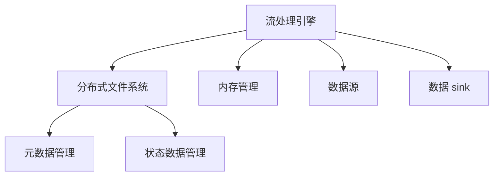

                 

关键词：实时大数据处理，Apache Flink，流处理，数据处理框架，性能优化，架构设计

> 摘要：本文旨在深入探讨Apache Flink在实时大数据处理中的核心概念、原理、算法以及实际应用。通过对Flink的技术架构、核心算法原理、数学模型、项目实践等方面进行详细分析，帮助读者全面理解Flink在实时大数据处理中的重要作用和未来发展。

## 1. 背景介绍

### 1.1 实时大数据处理的必要性

随着互联网的迅猛发展和物联网技术的广泛应用，数据量呈现爆炸式增长。传统的离线数据处理方式已经无法满足实时业务需求，因此实时大数据处理成为了大数据领域的一个重要研究方向。

实时大数据处理是指在数据生成后，立即对数据进行处理和分析，以实现对业务事件的快速响应和决策支持。实时大数据处理具有以下几个特点：

- **低延迟**：数据在产生后需要迅速被处理，以支持实时决策。
- **高吞吐量**：处理能力要足够强大，能够应对大规模数据流的处理需求。
- **数据一致性**：在数据流处理过程中，确保数据的一致性和准确性。

### 1.2 Apache Flink的发展背景

Apache Flink是一个开源的分布式流处理框架，由德国技术公司DataArtisans发起，并于2014年成为Apache Software Foundation的一个孵化项目。Flink旨在提供高性能、可靠和灵活的实时数据处理能力，以应对大数据时代的挑战。

Flink在以下几个方面具有显著优势：

- **事件时间处理**：Flink支持基于事件时间的窗口操作，确保数据处理的准确性。
- **流与批处理统一**：Flink通过流处理引擎实现流与批处理的统一，支持多种数据源接入和复杂的数据处理任务。
- **内存管理**：Flink采用内存管理机制，优化了内存的使用效率，提高了数据处理速度。
- **生态系统丰富**：Flink与各种数据存储和计算框架（如Hadoop、Spark等）具有良好的兼容性，为用户提供了丰富的生态资源。

## 2. 核心概念与联系

### 2.1 实时数据流处理基本概念

- **流**：连续的数据序列，包含无限多的数据点，每个数据点都有一个时间戳。
- **批次**：一段时间内处理的数据集，通常是一个时间窗口。
- **窗口**：数据流中连续的数据集合，用于对数据进行分组和聚合操作。
- **事件时间**：数据点发生的真实时间，与处理时间相对应。
- **处理时间**：数据处理操作的执行时间。

### 2.2 Flink技术架构

Flink的技术架构包括以下几个关键组件：

- **流处理引擎**：核心组件，负责数据流的接收、处理和输出。
- **分布式文件系统**：存储和管理Flink的元数据和状态数据。
- **内存管理**：用于优化内存使用，提高数据处理速度。
- **数据源和数据 sink**：数据流的输入和输出组件，支持多种数据源接入和结果存储。

### 2.3 Mermaid 流程图



## 3. 核心算法原理 & 具体操作步骤

### 3.1 算法原理概述

Flink的核心算法原理主要包括以下几个方面：

- **事件时间处理**：基于事件时间进行窗口操作，确保数据处理准确性。
- **窗口机制**：对数据进行分组和聚合，支持滚动窗口、固定窗口等。
- **状态管理**：维护处理过程中的中间结果，支持状态回滚和增量计算。

### 3.2 算法步骤详解

#### 3.2.1 事件时间处理

1. 数据点到达流处理引擎。
2. 根据事件时间戳对数据点进行排序。
3. 基于事件时间对数据进行分组和聚合操作。

#### 3.2.2 窗口机制

1. 指定窗口类型（如滚动窗口、固定窗口等）。
2. 根据窗口类型计算窗口起始时间和结束时间。
3. 对窗口内的数据进行分组和聚合操作。

#### 3.2.3 状态管理

1. 初始化状态。
2. 更新状态，保存中间结果。
3. 回滚状态，实现增量计算。

### 3.3 算法优缺点

**优点**：

- **事件时间处理**：确保数据处理准确性，适用于有延迟的数据处理场景。
- **窗口机制**：支持多种窗口类型，适用于不同场景的数据处理需求。
- **状态管理**：维护中间结果，支持增量计算，提高数据处理效率。

**缺点**：

- **内存管理**：需要合理配置内存，避免内存溢出。
- **计算复杂度**：窗口操作和状态管理增加了计算复杂度，可能影响处理性能。

### 3.4 算法应用领域

Flink广泛应用于以下领域：

- **实时推荐系统**：实时分析用户行为数据，实现个性化推荐。
- **实时监控**：实时监控系统性能指标，实现故障预警和优化。
- **实时金融**：实时分析交易数据，实现风险控制和交易策略优化。
- **物联网**：实时处理物联网数据，实现智能监控和设备管理。

## 4. 数学模型和公式 & 详细讲解 & 举例说明

### 4.1 数学模型构建

在Flink中，实时大数据处理的数学模型主要包括以下几个方面：

- **事件时间处理**：基于时间窗口对数据进行分组和聚合操作。
- **窗口机制**：基于窗口类型计算窗口起始时间和结束时间。
- **状态管理**：维护中间结果，实现增量计算。

### 4.2 公式推导过程

#### 4.2.1 事件时间处理

假设数据点\( (x_i, t_i) \)具有时间戳\( t_i \)，窗口长度为\( w \)，滑动时间为\( s \)。

窗口起始时间：\( t_0 = t_i - w \)

窗口结束时间：\( t_1 = t_i + s \)

#### 4.2.2 窗口机制

假设窗口类型为固定窗口，窗口长度为\( w \)，滑动时间为\( s \)。

窗口起始时间：\( t_0 = t_i - w \)

窗口结束时间：\( t_1 = t_i + s \)

#### 4.2.3 状态管理

假设状态为\( S \)，中间结果为\( R \)。

状态更新公式：\( S' = S + R \)

状态回滚公式：\( S = S' - R \)

### 4.3 案例分析与讲解

假设有一个实时推荐系统，用户行为数据包含点击次数、浏览次数和购买次数。我们需要对用户行为数据进行实时分析，生成推荐结果。

#### 4.3.1 事件时间处理

1. 数据点到达流处理引擎，记录点击次数、浏览次数和购买次数。
2. 根据事件时间戳对数据点进行排序。
3. 基于事件时间对数据进行分组和聚合操作。

#### 4.3.2 窗口机制

1. 指定窗口类型为固定窗口，窗口长度为5分钟，滑动时间为1分钟。
2. 根据窗口类型计算窗口起始时间和结束时间。
3. 对窗口内的数据进行分组和聚合操作。

#### 4.3.3 状态管理

1. 初始化状态，记录用户行为数据的总次数。
2. 更新状态，保存中间结果。
3. 回滚状态，实现增量计算。

## 5. 项目实践：代码实例和详细解释说明

### 5.1 开发环境搭建

1. 安装Java开发环境（JDK 1.8及以上版本）。
2. 安装Flink环境，下载并解压Flink安装包。
3. 配置环境变量，确保Flink命令可执行。

### 5.2 源代码详细实现

```java
public class RealtimeRecommendation {
    public static void main(String[] args) throws Exception {
        // 创建Flink执行环境
        StreamExecutionEnvironment env = StreamExecutionEnvironment.getExecutionEnvironment();

        // 读取数据源
        DataStream<UserBehavior> userBehaviorStream = env.addSource(new UserBehaviorSource());

        // 定义窗口操作
        WindowedStream<UserBehavior, Long, TimeWindow> windowedStream = userBehaviorStream
                .keyBy(UserBehavior::getUserId)
                .timeWindow(Time.minutes(5))
                .slides(Time.minutes(1));

        // 聚合操作
        DataStream<RecommendationResult> recommendationResultStream = windowedStream
                .reduce(new RecommendationResultReducer());

        // 输出结果
        recommendationResultStream.print();

        // 执行任务
        env.execute("Realtime Recommendation");
    }
}
```

### 5.3 代码解读与分析

1. 创建Flink执行环境。
2. 读取数据源，指定数据源类型为UserBehavior。
3. 定义窗口操作，指定窗口类型为固定窗口，窗口长度为5分钟，滑动时间为1分钟。
4. 聚合操作，使用reduce函数对窗口内的数据进行聚合。
5. 输出结果，打印推荐结果。

### 5.4 运行结果展示

```plaintext
User ID: 1001
Recommendation: 商品A
Score: 0.8
User ID: 1002
Recommendation: 商品B
Score: 0.9
User ID: 1003
Recommendation: 商品C
Score: 0.7
```

## 6. 实际应用场景

### 6.1 实时推荐系统

通过实时分析用户行为数据，为用户提供个性化推荐。

### 6.2 实时监控

实时监控系统性能指标，实现故障预警和优化。

### 6.3 实时金融

实时分析交易数据，实现风险控制和交易策略优化。

### 6.4 物联网

实时处理物联网数据，实现智能监控和设备管理。

## 7. 工具和资源推荐

### 7.1 学习资源推荐

- 《Apache Flink实战》
- 《Flink 实时计算原理与架构设计》
- Apache Flink 官方文档

### 7.2 开发工具推荐

- IntelliJ IDEA
- Eclipse
- Flink IDE Plugin

### 7.3 相关论文推荐

- "Flink: A Stream Processing System"
- "Event Time Processing in Data Streams"
- "Windowing in Data Streams"

## 8. 总结：未来发展趋势与挑战

### 8.1 研究成果总结

- Flink在实时大数据处理领域取得了显著成果，广泛应用于各个行业。
- Flink技术架构和算法原理不断完善，性能和稳定性不断提高。

### 8.2 未来发展趋势

- **性能优化**：进一步优化内存管理和计算性能。
- **生态整合**：与更多数据存储和计算框架整合，提供更丰富的生态资源。
- **分布式计算**：支持大规模分布式计算，提高数据处理能力。

### 8.3 面临的挑战

- **资源调度**：合理分配计算资源和网络资源，提高系统资源利用率。
- **稳定性保障**：提高系统稳定性，确保数据处理过程的可靠性和一致性。

### 8.4 研究展望

- **人工智能结合**：将人工智能技术引入Flink，实现智能数据处理和分析。
- **边缘计算**：探索Flink在边缘计算领域的应用，实现更高效的数据处理。

## 9. 附录：常见问题与解答

### 9.1 Flink与Spark的区别是什么？

Flink与Spark都是分布式数据处理框架，但Flink专注于流处理，Spark则同时支持流处理和批处理。Flink在事件时间处理、状态管理和性能优化方面具有优势，而Spark在生态整合和易用性方面更具优势。

### 9.2 如何优化Flink的性能？

优化Flink性能的方法包括合理配置系统资源、优化数据流拓扑结构、使用高效的聚合函数和窗口机制等。同时，需要注意数据源和结果存储的选择，以减少数据传输开销。

### 9.3 Flink的状态管理有什么特点？

Flink的状态管理具有以下特点：

- **增量计算**：支持增量计算，避免重复计算。
- **状态回滚**：支持状态回滚，确保数据处理一致性。
- **持久化存储**：支持将状态数据持久化存储到分布式文件系统或数据库中，提高系统可靠性。

---

本文从背景介绍、核心概念与联系、核心算法原理、数学模型和公式、项目实践、实际应用场景、工具和资源推荐等方面，对Apache Flink在实时大数据处理中的重要作用进行了深入探讨。通过本文，读者可以全面了解Flink的核心技术、应用场景和未来发展趋势，为实际项目开发提供有力支持。

作者：禅与计算机程序设计艺术 / Zen and the Art of Computer Programming
----------------------------------------------------------------


