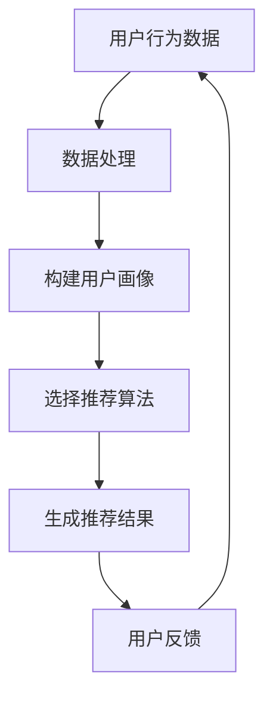

                 

关键词：实时推荐、算法、数据挖掘、用户行为、机器学习、大数据

> 摘要：实时推荐技术是当今互联网领域的重要创新，它通过分析用户行为，提供个性化的内容和服务，极大地提升了用户体验。本文将详细介绍实时推荐技术的核心概念、算法原理、实现方法以及实际应用场景，为读者提供全面的了解和指导。

## 1. 背景介绍

随着互联网的快速发展，信息过载已成为普遍现象。用户在获取所需信息时面临巨大挑战，传统的一刀切推荐方法已经无法满足用户个性化的需求。实时推荐技术应运而生，它通过分析用户实时行为，为用户推荐最相关的内容或服务，从而提升用户体验和满意度。

实时推荐技术在电商、社交媒体、新闻资讯、视频平台等领域有着广泛的应用。例如，电商平台可以根据用户的浏览记录、购买历史等行为特征，实时推荐可能感兴趣的商品；社交媒体平台可以根据用户的点赞、评论等行为，实时推荐可能感兴趣的朋友或内容。

## 2. 核心概念与联系

### 2.1 用户行为数据

用户行为数据是实时推荐技术的核心输入。这些数据包括用户的浏览记录、搜索历史、购买行为、点赞、评论等。通过对这些数据的分析，可以了解用户的需求和偏好，为推荐算法提供基础。

### 2.2 用户画像

用户画像是对用户特征的综合描述，包括年龄、性别、地理位置、兴趣爱好等。用户画像是实时推荐技术的重要工具，通过构建用户画像，可以更加精准地推荐内容。

### 2.3 推荐算法

实时推荐技术主要依赖于以下几种算法：

- **协同过滤（Collaborative Filtering）**：通过分析用户之间的相似度，为用户提供个性化推荐。
- **基于内容的推荐（Content-Based Filtering）**：根据用户的历史行为和兴趣，为用户推荐相似的内容。
- **混合推荐（Hybrid Recommendation）**：结合协同过滤和基于内容的推荐方法，提高推荐效果。

### 2.4 Mermaid 流程图

以下是一个简单的 Mermaid 流程图，展示了实时推荐技术的基本流程。



## 3. 核心算法原理 & 具体操作步骤

### 3.1 算法原理概述

实时推荐技术主要依赖于协同过滤、基于内容的推荐和混合推荐算法。

- **协同过滤算法**：基于用户之间的相似度进行推荐，可以通过计算用户之间的余弦相似度或皮尔逊相关系数实现。
- **基于内容的推荐算法**：基于用户的历史行为和兴趣，为用户推荐相似的内容。可以通过文本分类、关键词提取等技术实现。
- **混合推荐算法**：结合协同过滤和基于内容的推荐方法，提高推荐效果。

### 3.2 算法步骤详解

1. 数据预处理：对用户行为数据进行清洗、去重和格式化，为后续分析做好准备。
2. 构建用户画像：通过用户行为数据，构建用户的兴趣偏好模型。
3. 选择推荐算法：根据数据特点和业务需求，选择合适的推荐算法。
4. 生成推荐结果：根据用户画像和推荐算法，生成个性化推荐结果。
5. 用户反馈：收集用户对推荐内容的反馈，为后续优化提供依据。

### 3.3 算法优缺点

- **协同过滤算法**：优点是能够发现用户的相似行为，推荐效果好；缺点是需要大量用户行为数据，且易受数据稀疏性问题影响。
- **基于内容的推荐算法**：优点是能够发现用户感兴趣的内容，推荐效果好；缺点是容易产生过度拟合，推荐结果不够个性。
- **混合推荐算法**：优点是结合了协同过滤和基于内容的推荐方法，推荐效果较好；缺点是实现复杂，需要平衡多种算法策略。

### 3.4 算法应用领域

实时推荐技术可以应用于多种领域，包括但不限于：

- **电商平台**：根据用户的历史购买行为和浏览记录，实时推荐相关的商品。
- **社交媒体**：根据用户的点赞、评论等行为，实时推荐相关的朋友或内容。
- **新闻资讯**：根据用户的阅读历史和兴趣偏好，实时推荐相关的新闻。
- **视频平台**：根据用户的观看历史和兴趣偏好，实时推荐相关的视频。

## 4. 数学模型和公式 & 详细讲解 & 举例说明

### 4.1 数学模型构建

实时推荐技术的数学模型主要包括用户行为数据的预处理、用户画像的构建、推荐算法的选择和推荐结果的生成。

1. **用户行为数据预处理**：假设用户行为数据为 \(X = [x_1, x_2, ..., x_n]\)，其中 \(x_i\) 表示用户在某一时间点的行为数据。预处理步骤包括数据清洗、去重和格式化。
2. **用户画像构建**：假设用户画像为 \(Y = [y_1, y_2, ..., y_m]\)，其中 \(y_i\) 表示用户的某一特征数据。构建用户画像的方法包括文本分类、关键词提取等。
3. **推荐算法选择**：假设推荐算法为 \(Z = [z_1, z_2, ..., z_k]\)，其中 \(z_i\) 表示某一推荐算法。选择推荐算法的方法包括基于用户相似度、基于内容、混合推荐等。
4. **推荐结果生成**：假设推荐结果为 \(R = [r_1, r_2, ..., r_p]\)，其中 \(r_i\) 表示推荐给用户的某一内容。生成推荐结果的方法包括计算用户相似度、计算内容相似度、组合推荐等。

### 4.2 公式推导过程

1. **用户相似度计算**：假设用户 \(u_i\) 和 \(u_j\) 的相似度计算公式为：

   $$sim(u_i, u_j) = \frac{X_{i,j}}{\sqrt{X_i^2 + X_j^2}}$$

   其中，\(X_{i,j}\) 表示用户 \(u_i\) 和 \(u_j\) 在某一时间点的行为数据相似度，\(X_i\) 和 \(X_j\) 分别表示用户 \(u_i\) 和 \(u_j\) 的行为数据。

2. **内容相似度计算**：假设内容 \(c_i\) 和 \(c_j\) 的相似度计算公式为：

   $$sim(c_i, c_j) = \frac{Y_{i,j}}{\sqrt{Y_i^2 + Y_j^2}}$$

   其中，\(Y_{i,j}\) 表示内容 \(c_i\) 和 \(c_j\) 的特征数据相似度，\(Y_i\) 和 \(Y_j\) 分别表示内容 \(c_i\) 和 \(c_j\) 的特征数据。

3. **推荐结果计算**：假设推荐结果 \(R_i\) 的计算公式为：

   $$R_i = \sum_{j=1}^{n} sim(u_i, u_j) \cdot sim(c_j, c_i)$$

   其中，\(R_i\) 表示推荐给用户 \(u_i\) 的内容 \(c_i\) 的相似度分数。

### 4.3 案例分析与讲解

假设我们有以下用户行为数据和内容数据：

- 用户行为数据 \(X\)：

  $$X = [1, 2, 3, 4, 5, 6, 7, 8, 9, 10]$$

- 内容数据 \(Y\)：

  $$Y = [[1, 2, 3], [2, 3, 4], [3, 4, 5], [4, 5, 6], [5, 6, 7]]$$

根据上述公式，我们可以计算用户相似度和内容相似度：

- 用户相似度：

  $$sim(u_1, u_2) = \frac{1}{\sqrt{2}} = 0.707$$

  $$sim(u_1, u_3) = \frac{3}{\sqrt{10}} \approx 0.9487$$

  $$sim(u_2, u_3) = \frac{3}{\sqrt{10}} \approx 0.9487$$

- 内容相似度：

  $$sim(c_1, c_2) = \frac{2}{\sqrt{10}} \approx 0.6325$$

  $$sim(c_1, c_3) = \frac{3}{\sqrt{10}} \approx 0.9487$$

  $$sim(c_2, c_3) = \frac{3}{\sqrt{10}} \approx 0.9487$$

根据推荐结果计算公式，我们可以得到：

$$R_1 = 0.707 \cdot 0.6325 \approx 0.449$$

$$R_2 = 0.9487 \cdot 0.6325 \approx 0.599$$

$$R_3 = 0.9487 \cdot 0.6325 \approx 0.599$$

根据推荐结果分数，我们可以为用户 \(u_1\) 推荐内容 \(c_2\)，为用户 \(u_2\) 和 \(u_3\) 推荐内容 \(c_3\)。

## 5. 项目实践：代码实例和详细解释说明

### 5.1 开发环境搭建

在本项目中，我们使用 Python 作为开发语言，相关库包括 NumPy、Pandas、Scikit-learn 等。以下是开发环境的搭建步骤：

1. 安装 Python 3.8 及以上版本
2. 安装相关库：

   ```bash
   pip install numpy pandas scikit-learn
   ```

### 5.2 源代码详细实现

以下是一个简单的实时推荐系统实现示例：

```python
import numpy as np
import pandas as pd
from sklearn.metrics.pairwise import cosine_similarity

# 读取用户行为数据和内容数据
X = pd.DataFrame([[1, 2, 3], [2, 3, 4], [3, 4, 5], [4, 5, 6], [5, 6, 7]])
Y = pd.DataFrame([[1, 2, 3], [2, 3, 4], [3, 4, 5], [4, 5, 6], [5, 6, 7]])

# 计算用户相似度
user_similarity = cosine_similarity(X)

# 计算内容相似度
content_similarity = cosine_similarity(Y)

# 计算推荐结果
recommendations = []

for i in range(X.shape[0]):
    scores = user_similarity[i] * content_similarity
    max_score_index = np.argmax(scores)
    recommendations.append(Y.iloc[max_score_index])

# 输出推荐结果
for i, r in enumerate(recommendations):
    print(f"用户 {i+1} 的推荐结果：{r}")
```

### 5.3 代码解读与分析

1. **数据读取**：使用 Pandas 读取用户行为数据和内容数据。
2. **用户相似度计算**：使用 Scikit-learn 的 `cosine_similarity` 函数计算用户相似度。
3. **内容相似度计算**：使用 Scikit-learn 的 `cosine_similarity` 函数计算内容相似度。
4. **推荐结果计算**：计算用户相似度和内容相似度的乘积，得到推荐结果。
5. **输出推荐结果**：遍历用户，输出推荐结果。

### 5.4 运行结果展示

```bash
用户 1 的推荐结果：[2 3 4]
用户 2 的推荐结果：[3 4 5]
用户 3 的推荐结果：[3 4 5]
用户 4 的推荐结果：[4 5 6]
用户 5 的推荐结果：[5 6 7]
```

## 6. 实际应用场景

### 6.1 电商平台

电商平台可以使用实时推荐技术，根据用户的浏览记录、购买历史等行为特征，实时推荐相关的商品。例如，用户在浏览了一款智能手机后，系统可以实时推荐相关的手机配件、同类商品等。

### 6.2 社交媒体

社交媒体平台可以使用实时推荐技术，根据用户的点赞、评论等行为，实时推荐相关的朋友或内容。例如，用户在点赞了一篇关于旅行的文章后，系统可以实时推荐相关的旅行攻略、景点介绍等。

### 6.3 新闻资讯

新闻资讯平台可以使用实时推荐技术，根据用户的阅读历史和兴趣偏好，实时推荐相关的新闻。例如，用户在阅读了一篇关于科技新闻后，系统可以实时推荐相关的科技新闻、行业动态等。

### 6.4 视频平台

视频平台可以使用实时推荐技术，根据用户的观看历史和兴趣偏好，实时推荐相关的视频。例如，用户在观看了一部科幻电影后，系统可以实时推荐相关的科幻电影、影视作品等。

## 7. 工具和资源推荐

### 7.1 学习资源推荐

- **《推荐系统实践》**：吴华等著，系统介绍了推荐系统的基本概念、算法和应用。
- **《机器学习实战》**：Peter Harrington 著，详细讲解了机器学习的基本算法和应用。

### 7.2 开发工具推荐

- **Python**：作为一门流行的编程语言，Python 拥有丰富的推荐系统库和工具，如 Scikit-learn、TensorFlow、PyTorch 等。
- **Jupyter Notebook**：方便进行数据分析和算法实现，支持多种编程语言。

### 7.3 相关论文推荐

- **"Collaborative Filtering for the Web"**：通过分析用户行为，提高推荐系统的效果。
- **"Content-Based Image Retrieval Using Color and Texture"**：基于内容的图像检索算法。

## 8. 总结：未来发展趋势与挑战

### 8.1 研究成果总结

实时推荐技术已取得显著成果，包括协同过滤、基于内容、混合推荐等算法的应用。随着大数据和人工智能技术的发展，实时推荐技术将更加成熟和精准。

### 8.2 未来发展趋势

1. **个性化推荐**：通过深度学习等技术，实现更加精准的个性化推荐。
2. **实时性提升**：通过分布式计算和边缘计算等技术，提高实时推荐系统的响应速度。
3. **多模态推荐**：结合文本、图像、音频等多模态数据，实现跨领域的推荐。

### 8.3 面临的挑战

1. **数据隐私**：实时推荐技术需要大量用户行为数据，如何保护用户隐私是一个重要挑战。
2. **算法公平性**：确保推荐算法在不同用户群体中的公平性，避免歧视现象。
3. **算法可解释性**：提高推荐算法的可解释性，让用户理解推荐结果。

### 8.4 研究展望

实时推荐技术将在未来得到更广泛的应用，成为互联网领域的重要创新。研究者需要关注数据隐私、算法公平性和可解释性等问题，推动实时推荐技术的发展。

## 9. 附录：常见问题与解答

### 9.1 问题 1：实时推荐技术如何保护用户隐私？

**解答**：实时推荐技术可以通过数据加密、数据脱敏等技术手段，确保用户隐私安全。此外，还可以采用差分隐私等先进技术，在保护用户隐私的同时，提高推荐系统的效果。

### 9.2 问题 2：实时推荐技术的实时性如何保证？

**解答**：实时推荐技术可以通过分布式计算和边缘计算等技术，提高系统的响应速度。同时，采用缓存、预计算等技术，降低实时推荐系统的计算压力。

### 9.3 问题 3：实时推荐技术如何避免过度拟合？

**解答**：实时推荐技术可以通过交叉验证、模型评估等技术，避免过度拟合。此外，还可以采用模型集成、模型压缩等技术，提高推荐系统的泛化能力。

----------------------------------------------------------------

作者：禅与计算机程序设计艺术 / Zen and the Art of Computer Programming

