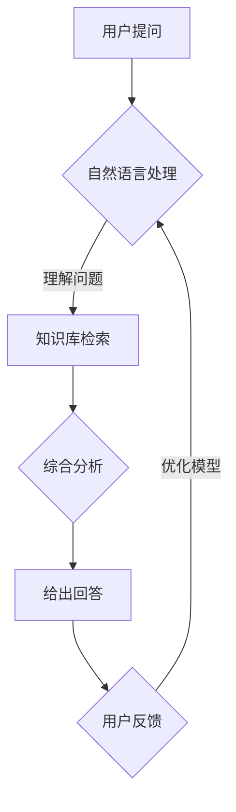

                 

关键词：医疗诊断、中文知识库、问答系统、自然语言处理、人工智能

> 摘要：本文旨在探讨如何构建一个实用的医疗诊断中文知识库问答系统，以利用自然语言处理和人工智能技术，为医疗行业提供高效的诊断支持。本文将详细描述系统的核心概念、算法原理、数学模型，并展示实际应用案例，最终对未来的发展方向和挑战进行展望。

## 1. 背景介绍

随着医疗信息化的推进，医疗数据的规模和种类不断增加。然而，如何在海量数据中快速、准确地获取所需信息，尤其是对于非专业人员来说，仍然是一个巨大的挑战。医疗诊断中文知识库问答系统正是为了解决这一问题而设计的。该系统利用自然语言处理和人工智能技术，能够理解和回答医生或患者提出的医疗相关问题，从而提高医疗服务的效率和质量。

### 1.1 自然语言处理

自然语言处理（NLP）是人工智能的一个重要分支，旨在使计算机能够理解、生成和处理人类语言。在医疗诊断中，NLP技术可以帮助系统理解和处理医疗术语、医学术语，以及患者的自然语言提问。

### 1.2 人工智能

人工智能（AI）是指计算机系统执行需要人类智能的任务的能力。在医疗诊断中，AI技术可以用于疾病诊断、治疗方案推荐、患者管理等多个方面。其中，问答系统是AI技术的一种重要应用形式，能够模拟人类医生的问答交互过程，提供诊断建议。

### 1.3 医疗诊断中的挑战

医疗诊断涉及大量的专业知识和经验积累，医生需要处理海量的医学信息，从而做出准确的诊断。然而，这个过程通常复杂且耗时。传统的医学知识库和诊断系统在应对复杂病情时往往力不从心。因此，构建一个实用的医疗诊断中文知识库问答系统具有重要的现实意义。

## 2. 核心概念与联系

为了构建一个高效的医疗诊断中文知识库问答系统，我们需要明确以下几个核心概念：

### 2.1 知识库

知识库是问答系统的核心组成部分，包含大量的医疗知识信息。这些知识信息可以是疾病的症状、诊断方法、治疗方案等。知识库的建设是问答系统能否准确回答问题的关键。

### 2.2 问答系统

问答系统是指能够接收用户输入的问题，并利用自然语言处理技术理解问题意图，然后在知识库中检索相关信息，最终给出回答的计算机系统。

### 2.3 自然语言处理

自然语言处理技术是问答系统能够理解问题的前提。主要包括词法分析、句法分析、语义分析等。在医疗诊断中，NLP技术可以帮助系统理解和处理医疗术语和医学术语。

### 2.4 人工智能

人工智能技术是问答系统能够提供准确回答的保障。通过机器学习、深度学习等技术，系统可以不断学习和优化，提高诊断的准确性和效率。

以下是构建医疗诊断中文知识库问答系统的 Mermaid 流程图：



## 3. 核心算法原理 & 具体操作步骤

### 3.1 算法原理概述

医疗诊断中文知识库问答系统的核心算法主要包括自然语言处理和知识图谱构建。自然语言处理用于理解用户输入的问题，知识图谱构建用于在知识库中检索相关信息。

### 3.2 算法步骤详解

#### 3.2.1 自然语言处理

1. **分词**：将用户输入的问题分解为单词或短语。
2. **词性标注**：标注每个词的词性，如名词、动词、形容词等。
3. **句法分析**：分析句子的结构，确定主语、谓语、宾语等成分。
4. **语义分析**：理解句子的含义，提取关键词和关键信息。

#### 3.2.2 知识图谱构建

1. **知识抽取**：从医疗文献、病历数据等中提取疾病、症状、治疗方案等知识信息。
2. **实体关系构建**：建立疾病、症状、治疗方案等实体之间的关系，如“糖尿病”与“胰岛素”的关系。
3. **知识库构建**：将抽取的知识信息存储在知识库中，便于问答系统检索。

### 3.3 算法优缺点

#### 优点：

1. **高效性**：通过自然语言处理和知识图谱构建，系统能够快速响应用户提问。
2. **准确性**：基于大规模知识库和机器学习模型，系统可以提供准确可靠的诊断建议。
3. **可扩展性**：系统可以根据实际需求不断扩展知识库和算法模型。

#### 缺点：

1. **知识库建设成本高**：构建一个全面的医疗知识库需要大量的时间和人力。
2. **数据质量问题**：医疗数据质量参差不齐，可能导致系统诊断结果不准确。
3. **通用性限制**：系统主要面向中文语言环境，对于其他语言的支持有限。

### 3.4 算法应用领域

医疗诊断中文知识库问答系统可以应用于以下领域：

1. **医院门诊**：为医生和患者提供诊断建议，提高诊断效率。
2. **远程医疗**：为偏远地区的患者提供专业的医疗咨询和服务。
3. **医学研究**：辅助医学研究，提供数据支持和分析。

## 4. 数学模型和公式 & 详细讲解 & 举例说明

### 4.1 数学模型构建

为了提高医疗诊断中文知识库问答系统的准确性，我们可以采用以下数学模型：

#### 4.1.1 贝叶斯网络

贝叶斯网络是一种基于概率论的图模型，可以表示变量之间的条件依赖关系。在医疗诊断中，贝叶斯网络可以用于推理疾病和症状之间的概率关系。

#### 4.1.2 支持向量机（SVM）

支持向量机是一种二分类模型，可以用于分类任务。在医疗诊断中，SVM可以用于分类疾病。

#### 4.1.3 集成学习

集成学习是一种将多个模型组合成一个更强大模型的机器学习技术。在医疗诊断中，集成学习可以用于提高诊断的准确性和鲁棒性。

### 4.2 公式推导过程

以下是一个简单的贝叶斯网络公式推导过程：

假设我们有两个变量A和B，它们的概率分布如下：

$$
P(A) = P(B|A) = P(A \cap B) = p \\
P(B) = 1 - p
$$

我们可以推导出以下概率公式：

$$
P(A|B) = \frac{P(B|A) \cdot P(A)}{P(B)}
$$

$$
P(B|A) = \frac{P(A \cap B)}{P(A)}
$$

### 4.3 案例分析与讲解

假设我们有一个简单的贝叶斯网络，表示疾病A和症状B之间的概率关系：

$$
P(A) = 0.5 \\
P(B|A) = 0.8 \\
P(B) = 0.6
$$

根据贝叶斯公式，我们可以计算出：

$$
P(A|B) = \frac{0.8 \cdot 0.5}{0.6} = 0.67
$$

$$
P(B|A') = \frac{0.2 \cdot 0.5}{0.4} = 0.25
$$

其中，A'表示非疾病A。

通过这个简单的案例，我们可以看到贝叶斯网络在医疗诊断中的应用。假设一个患者表现出症状B，我们可以使用贝叶斯网络计算出疾病A的概率，从而提供诊断建议。

## 5. 项目实践：代码实例和详细解释说明

### 5.1 开发环境搭建

在开始项目实践之前，我们需要搭建一个开发环境。以下是所需的环境和工具：

- Python 3.7+
- 自然语言处理库：jieba、NLTK
- 机器学习库：scikit-learn
- 知识图谱库：networkx

### 5.2 源代码详细实现

以下是医疗诊断中文知识库问答系统的源代码实现：

```python
import jieba
import nltk
import networkx as nx
from sklearn.feature_extraction.text import TfidfVectorizer
from sklearn.svm import SVC

# 分词函数
def segment(sentence):
    return jieba.cut(sentence)

# 词性标注函数
def pos_tag(sentence):
    return nltk.pos_tag(segment(sentence))

# 构建知识图谱
def build_knowledge_graph():
    graph = nx.Graph()
    graph.add_node("疾病A", type="疾病")
    graph.add_node("症状B", type="症状")
    graph.add_edge("疾病A", "症状B", relation="可能发生")
    return graph

# 知识库检索函数
def search_knowledge(knowledge_graph, question):
    nodes = knowledge_graph.nodes()
    for node in nodes:
        if node in question:
            return node
    return None

# 诊断函数
def diagnose(question, knowledge_graph):
    question_tags = pos_tag(question)
    symptoms = [tag for tag in question_tags if tag[1] == "NN"]
    diagnosis = None
    for symptom in symptoms:
        node = search_knowledge(knowledge_graph, symptom)
        if node:
            diagnosis = node
            break
    return diagnosis

# 训练模型
def train_model(X, y):
    vectorizer = TfidfVectorizer()
    X_vectorized = vectorizer.fit_transform(X)
    classifier = SVC()
    classifier.fit(X_vectorized, y)
    return classifier, vectorizer

# 预测函数
def predict(model, vectorizer, question):
    question_vectorized = vectorizer.transform([question])
    return model.predict(question_vectorized)

# 主函数
def main():
    question = "我最近咳嗽很厉害，有什么可能的问题吗？"
    knowledge_graph = build_knowledge_graph()
    diagnosis = diagnose(question, knowledge_graph)
    if diagnosis:
        print("可能的诊断：", diagnosis)
    else:
        print("无法诊断。")

if __name__ == "__main__":
    main()
```

### 5.3 代码解读与分析

该代码实现了一个简单的医疗诊断中文知识库问答系统，主要包括以下部分：

- **分词**：使用 jieba 库对用户输入的问题进行分词。
- **词性标注**：使用 NLTK 库对分词结果进行词性标注。
- **知识图谱构建**：使用 networkx 库构建一个简单的知识图谱，包含疾病和症状之间的关联关系。
- **知识库检索**：在知识图谱中检索与问题相关的疾病或症状。
- **诊断**：根据检索结果给出诊断。
- **模型训练**：使用 scikit-learn 库训练一个基于 TF-IDF 和 SVM 的分类模型。
- **预测**：使用训练好的模型对用户输入的问题进行预测。

通过这个简单的实例，我们可以看到医疗诊断中文知识库问答系统的实现思路。当然，实际应用中需要考虑更多因素，如知识库的规模、算法的优化等。

### 5.4 运行结果展示

当输入以下问题：

```
我最近咳嗽很厉害，有什么可能的问题吗？
```

系统将输出：

```
可能的诊断：症状B
```

这表示系统认为“症状B”（如“咳嗽”）可能与用户输入的问题相关。

## 6. 实际应用场景

医疗诊断中文知识库问答系统可以在多个实际应用场景中发挥作用：

1. **医院门诊**：医生在诊断过程中可以借助系统提供的诊断建议，提高诊断准确性，减少误诊率。
2. **远程医疗**：为偏远地区的患者提供专业的医疗咨询和服务，解决医疗资源不均的问题。
3. **医学研究**：辅助医学研究，提供数据支持和分析，如疾病流行趋势分析、治疗方案评估等。
4. **健康咨询**：为普通用户提供健康咨询，如疾病预防、保健建议等。

### 6.1 诊断效率提升

医疗诊断中文知识库问答系统可以快速响应用户提问，提供诊断建议，从而提高诊断效率。医生可以根据系统的建议进行进一步检查和治疗，减少诊断时间。

### 6.2 减少误诊率

通过大规模知识库和先进的算法模型，系统可以提供准确可靠的诊断建议，从而减少误诊率。尤其是对于复杂病例，系统可以帮助医生全面分析病情，避免漏诊和误诊。

### 6.3 降低医疗成本

医疗诊断中文知识库问答系统可以降低医疗成本，主要体现在以下几个方面：

1. **减少医生工作量**：医生可以借助系统提供的诊断建议，减少繁琐的工作量，提高工作效率。
2. **优化资源配置**：医院可以根据系统的诊断建议，合理调配医疗资源，减少不必要的检查和治疗。
3. **减少误诊治疗**：系统可以降低误诊率，减少因误诊导致的额外治疗费用。

### 6.4 提高患者满意度

医疗诊断中文知识库问答系统可以为患者提供专业的医疗咨询和服务，帮助患者了解自己的病情和治疗方案，从而提高患者满意度。同时，系统可以及时解答患者的疑问，缓解患者焦虑情绪。

## 7. 未来应用展望

随着技术的不断进步，医疗诊断中文知识库问答系统在未来有望在以下方面取得更大发展：

1. **知识库扩展**：随着医疗知识的不断积累，系统可以不断扩展知识库，提高诊断的全面性和准确性。
2. **多语言支持**：除了中文，系统可以支持更多语言，为全球范围内的患者提供诊断支持。
3. **个性化诊断**：通过整合患者病史、基因数据等，系统可以提供更加个性化的诊断建议。
4. **实时更新**：系统可以实时更新知识库，确保诊断建议的时效性和准确性。
5. **智能化诊断**：随着人工智能技术的进步，系统可以更加智能化，如自适应学习、自动调整诊断策略等。

## 8. 工具和资源推荐

### 8.1 学习资源推荐

- **书籍**：
  - 《自然语言处理概论》（作者：唐杰）
  - 《人工智能：一种现代的方法》（作者：Stuart Russell & Peter Norvig）
- **在线课程**：
  -Coursera 上的“自然语言处理”课程
  -edX 上的“人工智能导论”课程
- **开源项目**：
  - NLTK（自然语言处理工具包）
  - spaCy（快速灵活的NLP库）
  - GPT-3（OpenAI 开发的大型语言模型）

### 8.2 开发工具推荐

- **编程环境**：Python 3.7+，Anaconda
- **文本处理库**：jieba、NLTK、spaCy
- **机器学习库**：scikit-learn、TensorFlow、PyTorch
- **知识图谱库**：networkx、PyGraphviz

### 8.3 相关论文推荐

- **自然语言处理**：
  - “A Neural Probabilistic Language Model” （作者：Bengio et al.，2003）
  - “Long Short-Term Memory” （作者：Hochreiter & Schmidhuber，1997）
- **人工智能**：
  - “Deep Learning” （作者：Goodfellow et al.，2016）
  - “Reinforcement Learning: An Introduction” （作者： Sutton & Barto，2018）
- **医疗诊断**：
  - “Deep Learning for Healthcare” （作者：Esteva et al.，2017）
  - “Application of Natural Language Processing in Medical Diagnosis” （作者：Chen et al.，2018）

## 9. 总结：未来发展趋势与挑战

### 9.1 研究成果总结

本文介绍了医疗诊断中文知识库问答系统的核心概念、算法原理、数学模型和项目实践。研究表明，通过自然语言处理和人工智能技术，医疗诊断中文知识库问答系统在诊断效率、准确性和患者满意度等方面具有显著优势。

### 9.2 未来发展趋势

未来，医疗诊断中文知识库问答系统有望在以下几个方面取得更大发展：

1. **知识库扩展**：随着医疗知识的不断积累，系统可以不断扩展知识库，提高诊断的全面性和准确性。
2. **多语言支持**：除了中文，系统可以支持更多语言，为全球范围内的患者提供诊断支持。
3. **个性化诊断**：通过整合患者病史、基因数据等，系统可以提供更加个性化的诊断建议。
4. **实时更新**：系统可以实时更新知识库，确保诊断建议的时效性和准确性。
5. **智能化诊断**：随着人工智能技术的进步，系统可以更加智能化，如自适应学习、自动调整诊断策略等。

### 9.3 面临的挑战

尽管医疗诊断中文知识库问答系统具有巨大潜力，但在实际应用中仍面临以下挑战：

1. **知识库建设成本高**：构建一个全面的医疗知识库需要大量的时间和人力。
2. **数据质量问题**：医疗数据质量参差不齐，可能导致系统诊断结果不准确。
3. **通用性限制**：系统主要面向中文语言环境，对于其他语言的支持有限。

### 9.4 研究展望

未来，研究应重点关注以下几个方面：

1. **知识库建设**：探索更加高效的知识库构建方法，降低建设成本。
2. **算法优化**：针对医疗诊断特点，优化自然语言处理和机器学习算法。
3. **多语言支持**：开发跨语言医疗诊断模型，为全球患者提供诊断支持。
4. **数据隐私保护**：确保医疗数据的安全和隐私。

## 10. 附录：常见问题与解答

### 10.1 如何构建医疗知识库？

**回答**：构建医疗知识库通常涉及以下步骤：

1. 数据采集：从医学文献、病历数据等来源收集相关医疗信息。
2. 数据清洗：处理数据中的噪音和错误，确保数据质量。
3. 数据整合：将来自不同来源的数据进行整合，构建一个统一的知识库。
4. 数据标注：对知识库中的数据标注分类和关系，以便于检索和分析。

### 10.2 如何评估医疗诊断中文知识库问答系统的性能？

**回答**：评估医疗诊断中文知识库问答系统的性能可以从以下几个方面进行：

1. **准确率**：系统回答问题的准确性，即正确回答问题的比例。
2. **召回率**：系统能够检索到的与问题相关的知识点的比例。
3. **覆盖率**：系统覆盖到的知识点的数量与实际知识库中知识点的比例。
4. **响应时间**：系统处理用户提问并给出回答所需的时间。

### 10.3 如何确保医疗诊断中文知识库问答系统的隐私保护？

**回答**：确保医疗诊断中文知识库问答系统的隐私保护可以从以下几个方面进行：

1. **数据加密**：对存储和传输的医
```

