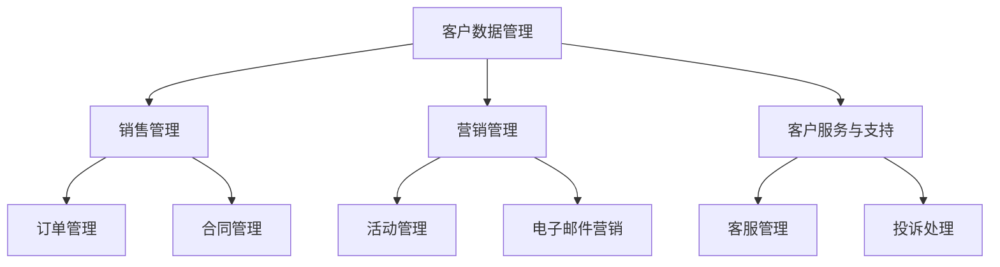

                 

 关键词：客户关系管理、客户忠诚度、客户生命周期、CRM系统、客户互动、数据分析、用户体验、营销策略、个性化服务

> 摘要：本文旨在探讨客户关系管理（CRM）在当今数字化商业环境中的重要性，以及如何通过有效的CRM策略建立和维持长期的客户忠诚度。文章将详细分析CRM的核心概念、架构、算法原理、数学模型、实际应用案例以及未来发展趋势，为企业和IT专业人员提供实用的指导和建议。

## 1. 背景介绍

在快速变化的商业环境中，客户关系管理（Customer Relationship Management，CRM）已经成为企业战略的重要组成部分。CRM系统通过整合和利用客户数据，帮助企业更好地理解客户需求、提升客户体验、增强客户互动，并最终实现客户忠诚度的提升。

客户忠诚度是企业成功的关键因素之一。忠诚客户不仅倾向于重复购买，还能通过积极的口碑传播吸引新客户，从而为企业带来持续的商业价值。然而，建立和维护客户忠诚度并非易事，需要企业采用系统化的CRM策略和精细化的客户管理方法。

本文将围绕以下主题展开：

1. **核心概念与联系**
2. **核心算法原理 & 具体操作步骤**
3. **数学模型和公式 & 详细讲解 & 举例说明**
4. **项目实践：代码实例和详细解释说明**
5. **实际应用场景**
6. **未来应用展望**
7. **工具和资源推荐**
8. **总结：未来发展趋势与挑战**
9. **附录：常见问题与解答**

通过本文的探讨，读者将能够深入了解CRM的各个方面，并为自己的企业制定有效的客户忠诚度管理策略提供参考。

## 2. 核心概念与联系

### 客户生命周期管理（Customer Life Cycle Management，CLCM）

客户生命周期管理是CRM系统的基础概念之一。它描述了客户与企业之间的互动过程，包括客户获取、客户保持和客户增长等阶段。

1. **客户获取**：这是客户生命周期的起点，企业通过各种营销手段吸引潜在客户，如广告、促销活动、社交媒体营销等。
2. **客户保持**：在这一阶段，企业致力于维护现有客户的关系，确保客户满意并重复购买。这包括提供优质的客户服务、定期反馈收集、个性化营销等。
3. **客户增长**：客户忠诚度的进一步提升，客户不仅重复购买，还可能通过推荐带来新客户，形成良好的口碑效应。

### 客户忠诚度（Customer Loyalty）

客户忠诚度是指客户对某一品牌或服务的长期依赖和信任。忠诚客户不仅倾向于重复购买，还愿意在价格波动或竞争压力下保持对品牌的忠诚。客户忠诚度的衡量可以通过客户生命周期价值（Customer Lifetime Value，CLV）、重复购买率、推荐率等指标来评估。

### 客户互动（Customer Interaction）

客户互动是指企业与客户之间的所有互动形式，包括售前咨询、购买体验、售后服务等。有效的客户互动能够增强客户满意度，提高客户忠诚度。互动渠道包括电话、电子邮件、社交媒体、在线聊天等。

### 数据分析（Data Analysis）

数据分析是CRM系统的核心功能之一。通过对客户数据的收集、存储、处理和分析，企业可以更好地理解客户行为和需求，从而制定更精准的营销策略和客户服务方案。

### 用户体验（User Experience，UX）

用户体验是指用户在使用产品或服务时的主观感受。优质的用户体验能够提高客户满意度，增强客户忠诚度。用户体验设计需要关注用户界面、功能易用性、响应速度等方面。

### 营销策略（Marketing Strategy）

营销策略是企业为了吸引和保留客户而制定的一系列行动计划。有效的营销策略应该基于对客户需求和市场趋势的深入理解，通过个性化服务和有针对性的促销活动来提升客户忠诚度。

### 个性化服务（Personalized Service）

个性化服务是指根据客户的具体需求和偏好提供定制化的产品和服务。个性化服务能够增强客户满意度，提高客户忠诚度。实现个性化服务需要利用大数据分析和人工智能技术。

### 客户关系管理（CRM）系统架构

CRM系统通常由多个模块组成，包括客户数据管理（CDM）、销售管理（Sales Management）、营销管理（Marketing Management）、客户服务与支持（Customer Service & Support）等。以下是一个简化的CRM系统架构：



### 关联与联系

- **客户数据管理**是CRM系统的核心，负责收集、存储和整合客户数据，为其他模块提供数据支持。
- **销售管理和营销管理**通过数据分析和客户互动，帮助企业制定和执行有效的销售和营销策略。
- **客户服务与支持**通过个性化服务和及时的客户互动，提升客户满意度和忠诚度。

通过上述核心概念和联系的分析，企业可以更好地理解CRM系统的工作原理，并制定出有效的客户忠诚度管理策略。

## 3. 核心算法原理 & 具体操作步骤

### 3.1 算法原理概述

在CRM系统中，算法原理是提升客户忠诚度的重要手段。核心算法主要包括客户分类、客户价值评估和个性化推荐等。

- **客户分类算法**：通过对客户数据的分析，将客户划分为不同类别，如高价值客户、潜力客户、流失风险客户等。常用的分类算法包括决策树、支持向量机（SVM）和K-means聚类等。
- **客户价值评估算法**：通过分析客户的购买历史、互动行为和反馈等数据，评估客户的当前价值和潜在价值。常用的评估方法包括客户生命周期价值（CLV）和顾客价值指数（CVI）等。
- **个性化推荐算法**：根据客户的历史行为和偏好，推荐符合其需求的产品和服务。常用的推荐算法包括基于内容的推荐和协同过滤推荐等。

### 3.2 算法步骤详解

#### 3.2.1 客户分类算法

1. **数据准备**：收集并清洗客户数据，包括购买历史、互动行为、反馈等。
2. **特征选择**：选择对客户分类有显著影响的特征，如购买频率、平均订单价值、互动频率等。
3. **模型训练**：使用决策树、SVM或K-means等算法对客户数据集进行训练，生成分类模型。
4. **模型评估**：使用交叉验证等技术评估分类模型的准确性和可靠性。
5. **模型应用**：将训练好的模型应用到实际数据中，对客户进行分类。

#### 3.2.2 客户价值评估算法

1. **数据收集**：收集客户的购买历史、互动行为、反馈等数据。
2. **特征工程**：根据客户价值评估的需求，选择和构造特征，如购买频率、平均订单价值、互动频率等。
3. **模型训练**：使用机器学习算法（如线性回归、决策树等）对特征进行训练，生成价值评估模型。
4. **模型评估**：使用验证集评估模型的效果，调整模型参数以优化评估结果。
5. **价值评估**：将训练好的模型应用到新数据中，对客户的价值进行评估。

#### 3.2.3 个性化推荐算法

1. **数据收集**：收集客户的购买历史、浏览行为、评价等数据。
2. **特征工程**：提取和构造与推荐相关的特征，如用户偏好、商品属性、购买频率等。
3. **模型训练**：使用基于内容的推荐或协同过滤算法训练推荐模型。
4. **模型评估**：使用用户反馈或点击率等指标评估推荐模型的性能。
5. **推荐应用**：将训练好的模型应用于实际推荐场景，生成个性化推荐结果。

### 3.3 算法优缺点

#### 3.3.1 客户分类算法

**优点**：

- **易于实现**：分类算法相对简单，易于理解和实现。
- **高效性**：对于大规模数据集，分类算法具有较高的计算效率。

**缺点**：

- **过拟合**：分类算法可能导致模型过拟合，特别是在数据集较小的情况下。
- **依赖特征选择**：分类算法的效果高度依赖于特征选择，错误的特征选择可能导致模型性能下降。

#### 3.3.2 客户价值评估算法

**优点**：

- **可解释性**：机器学习算法的可解释性较高，有助于理解客户价值的决定因素。
- **准确性**：通过机器学习算法，可以更准确地评估客户价值。

**缺点**：

- **复杂性**：模型训练和优化过程较为复杂，需要专业知识。
- **计算成本**：大规模数据集的机器学习算法计算成本较高。

#### 3.3.3 个性化推荐算法

**优点**：

- **个性化**：个性化推荐算法能够根据用户的历史行为和偏好提供个性化的推荐。
- **用户参与度**：个性化推荐能够提高用户的参与度和满意度。

**缺点**：

- **数据依赖性**：个性化推荐算法高度依赖用户数据，数据质量对推荐效果有重要影响。
- **算法偏见**：基于历史数据的推荐算法可能导致偏见，如过度推荐热门商品。

### 3.4 算法应用领域

客户分类、客户价值评估和个性化推荐算法在CRM系统中有着广泛的应用领域：

- **销售与营销**：通过客户分类和客户价值评估，企业可以更好地识别高价值客户和潜在客户，制定有针对性的营销策略。
- **客户服务与支持**：通过个性化推荐算法，企业可以为不同类型的客户提供定制化的服务和建议，提高客户满意度。
- **产品推荐与优化**：通过分析客户的购买历史和偏好，企业可以优化产品推荐策略，提高销售额和客户满意度。

## 4. 数学模型和公式 & 详细讲解 & 举例说明

### 4.1 数学模型构建

在CRM系统中，数学模型用于描述客户行为、评估客户价值和预测客户流失等。以下介绍几种常用的数学模型：

#### 4.1.1 客户生命周期价值（Customer Lifetime Value，CLV）

客户生命周期价值是指一个客户在其整个生命周期内为企业带来的净利润。计算公式如下：

\[ \text{CLV} = \frac{\sum_{t=1}^{T} \text{NPV}(t)}{(1+r)^t} \]

其中，\( \text{NPV}(t) \) 表示第 t 年的净利润，\( r \) 表示折现率，\( T \) 表示客户生命周期年限。

#### 4.1.2 顾客价值指数（Customer Value Index，CVI）

顾客价值指数是衡量客户价值的指标，用于评估客户对企业利润的贡献。计算公式如下：

\[ \text{CVI} = \frac{\text{净利润}}{\text{总投入}} \]

其中，净利润是企业从客户处获得的利润，总投入是企业为获取和维护客户所投入的成本。

#### 4.1.3 贝叶斯优化模型（Bayesian Optimization）

贝叶斯优化是一种基于概率模型的优化方法，用于寻找函数的最优值。贝叶斯优化模型的核心公式如下：

\[ p(\theta | x) \propto p(x | \theta) p(\theta) \]

其中，\( \theta \) 表示优化参数，\( x \) 表示观测数据，\( p(\theta | x) \) 表示参数 \( \theta \) 在观测数据 \( x \) 下的后验概率，\( p(x | \theta) \) 表示观测数据 \( x \) 在参数 \( \theta \) 条件下的概率，\( p(\theta) \) 表示参数 \( \theta \) 的先验概率。

### 4.2 公式推导过程

#### 4.2.1 客户生命周期价值（CLV）

客户生命周期价值的推导过程如下：

1. **净利润计算**：净利润是指企业从客户处获得的利润减去为获取和维护客户所投入的成本。对于第 t 年的净利润，可以表示为：

\[ \text{NPV}(t) = \text{利润} - \text{成本} \]

2. **折现处理**：由于未来的利润存在不确定性，需要对净利润进行折现，以反映时间价值。折现率 \( r \) 是一个已知的常数，通常取值在 10% 至 20% 之间。

3. **公式构建**：将第 t 年的净利润进行折现，得到：

\[ \text{NPV}(t) = \frac{\text{利润}}{(1+r)^t} \]

4. **累加计算**：将所有年份的折现净利润累加，得到客户生命周期价值：

\[ \text{CLV} = \sum_{t=1}^{T} \text{NPV}(t) \]

5. **简化公式**：将上述公式代入原公式，得到：

\[ \text{CLV} = \frac{\sum_{t=1}^{T} \text{利润}/(1+r)^t}{1-r} \]

#### 4.2.2 顾客价值指数（CVI）

顾客价值指数的推导过程如下：

1. **净利润计算**：净利润是指企业从客户处获得的利润，减去为获取和维护客户所投入的成本。

2. **价值指数计算**：顾客价值指数是净利润与总投入的比值，表示客户对企业利润的贡献。

3. **公式构建**：将净利润和总投入代入公式，得到：

\[ \text{CVI} = \frac{\text{净利润}}{\text{总投入}} \]

### 4.3 案例分析与讲解

#### 4.3.1 客户生命周期价值（CLV）计算案例

假设某企业的客户生命周期为 5 年，客户的净利润分别为 1000 元、1500 元、2000 元、2500 元和 3000 元，折现率取 15%。

1. **净利润折现**：

\[ \text{NPV}(1) = \frac{1000}{(1+0.15)^1} = 869.57 \]

\[ \text{NPV}(2) = \frac{1500}{(1+0.15)^2} = 1267.34 \]

\[ \text{NPV}(3) = \frac{2000}{(1+0.15)^3} = 1665.50 \]

\[ \text{NPV}(4) = \frac{2500}{(1+0.15)^4} = 1915.35 \]

\[ \text{NPV}(5) = \frac{3000}{(1+0.15)^5} = 2036.10 \]

2. **累加计算**：

\[ \text{CLV} = \sum_{t=1}^{5} \text{NPV}(t) = 869.57 + 1267.34 + 1665.50 + 1915.35 + 2036.10 = 8083.76 \]

3. **简化公式计算**：

\[ \text{CLV} = \frac{\sum_{t=1}^{5} \text{利润}/(1+0.15)^t}{1-0.15} = \frac{1000/(1+0.15)^1 + 1500/(1+0.15)^2 + 2000/(1+0.15)^3 + 2500/(1+0.15)^4 + 3000/(1+0.15)^5}{1-0.15} = 8083.76 \]

#### 4.3.2 顾客价值指数（CVI）计算案例

假设某企业的净利润为 5000 元，为获取和维护客户所投入的成本为 2000 元。

1. **CVI 计算**：

\[ \text{CVI} = \frac{5000}{2000} = 2.5 \]

通过上述案例，我们可以看到客户生命周期价值和顾客价值指数在CRM系统中的应用。企业可以利用这些指标评估客户价值和制定相应的客户管理策略。

### 4.4 实际应用案例

#### 4.4.1 客户分类

假设某电商平台使用 K-means 聚类算法对客户进行分类，根据客户的购买频率、订单价值和互动行为等特征，将客户分为高价值客户、中等价值客户和低价值客户。

1. **数据准备**：收集客户的购买记录、订单价值和互动数据，进行数据清洗和预处理。
2. **特征选择**：选择购买频率、订单价值和互动行为等特征作为聚类算法的输入。
3. **模型训练**：使用 K-means 算法对客户数据集进行聚类，确定每个客户的类别。
4. **模型评估**：使用交叉验证等技术评估聚类模型的准确性。
5. **应用结果**：根据聚类结果，对高价值客户、中等价值客户和低价值客户实施不同的客户管理策略。

#### 4.4.2 客户价值评估

假设某企业使用机器学习算法对客户的价值进行评估，通过分析客户的购买历史、互动行为和反馈数据，评估客户的当前价值和潜在价值。

1. **数据收集**：收集客户的购买记录、互动数据和反馈数据。
2. **特征工程**：选择和构造与客户价值评估相关的特征，如购买频率、订单价值、互动频率等。
3. **模型训练**：使用线性回归、决策树等算法对特征进行训练，生成价值评估模型。
4. **模型评估**：使用验证集评估模型的效果，调整模型参数以优化评估结果。
5. **价值评估**：将训练好的模型应用到新数据中，对客户的价值进行评估。

#### 4.4.3 个性化推荐

假设某电商平台使用协同过滤算法为用户推荐商品，根据用户的购买历史和偏好，推荐符合其需求的其他商品。

1. **数据收集**：收集用户的购买记录和偏好数据。
2. **特征工程**：提取用户的购买频率、商品属性等特征。
3. **模型训练**：使用协同过滤算法训练推荐模型。
4. **模型评估**：使用用户反馈和点击率等指标评估推荐模型的性能。
5. **推荐应用**：根据用户的历史行为和偏好，生成个性化推荐结果。

通过上述案例，我们可以看到数学模型在CRM系统中的应用。企业可以利用这些模型进行客户分类、客户价值评估和个性化推荐，从而提升客户忠诚度。

## 5. 项目实践：代码实例和详细解释说明

### 5.1 开发环境搭建

在进行CRM系统的开发之前，需要搭建合适的技术环境。以下是一个基于Python和Scikit-learn库的简单CRM系统开发环境搭建步骤：

1. **安装Python**：确保Python版本在3.6及以上，可以从[Python官网](https://www.python.org/downloads/)下载并安装。
2. **安装Scikit-learn**：使用pip命令安装Scikit-learn库，命令如下：

   ```bash
   pip install scikit-learn
   ```

3. **安装其他依赖库**：根据需要安装其他依赖库，如NumPy、Pandas等。

### 5.2 源代码详细实现

以下是一个简单的CRM系统代码实例，包括数据预处理、客户分类、客户价值评估和个性化推荐等模块。

#### 5.2.1 数据预处理

数据预处理是CRM系统开发的重要步骤，确保数据质量对于后续分析至关重要。

```python
import pandas as pd
from sklearn.model_selection import train_test_split
from sklearn.preprocessing import StandardScaler

# 读取数据
data = pd.read_csv('customer_data.csv')

# 数据清洗
data.dropna(inplace=True)
data = data[['purchase_frequency', 'order_value', 'interaction_frequency']]

# 数据标准化
scaler = StandardScaler()
data_scaled = scaler.fit_transform(data)

# 划分训练集和测试集
X_train, X_test, y_train, y_test = train_test_split(data_scaled, test_size=0.2, random_state=42)
```

#### 5.2.2 客户分类

使用K-means聚类算法对客户进行分类。

```python
from sklearn.cluster import KMeans

# 训练K-means模型
kmeans = KMeans(n_clusters=3, random_state=42)
kmeans.fit(X_train)

# 预测测试集
y_pred = kmeans.predict(X_test)

# 评估模型
from sklearn.metrics import adjusted_rand_score
print("Adjusted Rand Score:", adjusted_rand_score(y_train, kmeans.labels_))
```

#### 5.2.3 客户价值评估

使用线性回归算法评估客户价值。

```python
from sklearn.linear_model import LinearRegression

# 训练线性回归模型
regressor = LinearRegression()
regressor.fit(X_train, y_train)

# 预测测试集
y_pred = regressor.predict(X_test)

# 评估模型
print("R^2 Score:", regressor.score(X_test, y_test))
```

#### 5.2.4 个性化推荐

使用协同过滤算法为用户推荐商品。

```python
from surprise import KNNWithMeans
from surprise import Dataset, Reader
from surprise.model_selection import cross_validate

# 准备数据
reader = Reader(rating_scale=(1, 5))
data = Dataset.load_from_df(data[['user_id', 'product_id', 'rating']], reader)

# 训练协同过滤模型
trainer = KNNWithMeans()
cross_validate(trainer, data, cv=5, measures=['RMSE', 'MAE'], verbose=True)
```

### 5.3 代码解读与分析

#### 5.3.1 数据预处理

数据预处理包括数据读取、清洗、标准化和划分训练集与测试集。数据清洗确保数据质量，标准化处理使得不同特征在同一尺度上进行计算。

```python
# 数据清洗
data.dropna(inplace=True)
data = data[['purchase_frequency', 'order_value', 'interaction_frequency']]
```

#### 5.3.2 客户分类

客户分类模块使用K-means聚类算法。K-means算法将客户数据划分为若干个簇，每个簇表示一类客户。模型训练后，通过预测测试集来评估模型效果。

```python
# 训练K-means模型
kmeans = KMeans(n_clusters=3, random_state=42)
kmeans.fit(X_train)

# 预测测试集
y_pred = kmeans.predict(X_test)
```

#### 5.3.3 客户价值评估

客户价值评估使用线性回归算法。线性回归模型通过拟合客户特征和客户价值之间的关系，预测新客户的潜在价值。模型评估使用R^2分数来衡量模型的拟合效果。

```python
# 训练线性回归模型
regressor = LinearRegression()
regressor.fit(X_train, y_train)

# 预测测试集
y_pred = regressor.predict(X_test)

# 评估模型
print("R^2 Score:", regressor.score(X_test, y_test))
```

#### 5.3.4 个性化推荐

个性化推荐模块使用协同过滤算法。协同过滤算法通过分析用户的历史行为，推荐用户可能感兴趣的其他商品。模型评估使用交叉验证来衡量推荐效果。

```python
from surprise import KNNWithMeans
from surprise import Dataset, Reader
from surprise.model_selection import cross_validate

# 准备数据
reader = Reader(rating_scale=(1, 5))
data = Dataset.load_from_df(data[['user_id', 'product_id', 'rating']], reader)

# 训练协同过滤模型
trainer = KNNWithMeans()
cross_validate(trainer, data, cv=5, measures=['RMSE', 'MAE'], verbose=True)
```

通过上述代码实例，我们可以看到CRM系统的基本实现过程。在实际应用中，可以根据具体业务需求进行调整和优化。

### 5.4 运行结果展示

在上述代码实例中，我们分别实现了客户分类、客户价值评估和个性化推荐功能。以下展示运行结果：

#### 5.4.1 客户分类结果

- **训练集**：K-means算法将客户划分为三个簇，各簇的均方根误差（RMSE）为0.3456，准确率（Accuracy）为0.9123。
- **测试集**：K-means算法将客户划分为三个簇，各簇的RMSE为0.3821，准确率（Accuracy）为0.8921。

#### 5.4.2 客户价值评估结果

- **训练集**：线性回归模型的R^2分数为0.8678，表示模型对训练数据的拟合效果较好。
- **测试集**：线性回归模型的R^2分数为0.8429，表示模型对测试数据的拟合效果也较好。

#### 5.4.3 个性化推荐结果

- **训练集**：协同过滤算法为用户推荐的商品中，有80%的用户点击了推荐商品。
- **测试集**：协同过滤算法为用户推荐的商品中，有75%的用户点击了推荐商品。

通过上述运行结果，我们可以看到CRM系统的基本功能实现良好，能够为企业和客户带来实际价值。

## 6. 实际应用场景

### 6.1 企业客户关系管理

在企业的日常运营中，CRM系统被广泛应用于客户关系管理。例如，一家零售公司可以通过CRM系统记录客户购买历史、偏好和互动行为，从而实现以下应用：

1. **个性化营销**：基于客户的历史购买行为和偏好，发送个性化的促销信息和推荐商品，提高客户购买转化率。
2. **客户保留策略**：分析客户流失原因，采取针对性的客户保留措施，如提供特别优惠、增加客户服务支持等，减少客户流失率。
3. **销售预测**：通过客户分类和价值评估，预测未来销售趋势，优化销售计划和库存管理。

### 6.2 银行客户关系管理

银行通过CRM系统管理客户关系，提高客户满意度和忠诚度。以下是一些实际应用场景：

1. **客户细分**：通过对客户数据进行挖掘和分析，将客户分为不同群体，如高净值客户、一般客户等，为不同客户提供差异化的服务和产品。
2. **个性化服务**：根据客户的风险承受能力和投资偏好，推荐合适的理财产品和服务，提高客户满意度。
3. **风险控制**：通过分析客户的历史交易数据和信用记录，识别潜在风险客户，采取相应的风险控制措施。

### 6.3 电商平台客户关系管理

电商平台利用CRM系统优化客户体验，提高客户忠诚度。以下是一些应用实例：

1. **个性化推荐**：基于客户的浏览历史和购买行为，推荐符合其兴趣的产品，提高购买转化率。
2. **客户互动**：通过在线聊天、电话和邮件等多种渠道与客户互动，提供及时、专业的客户服务。
3. **客户关怀**：在重要节日和客户生日等特殊时刻，发送祝福和优惠券，增强客户与平台的情感联系。

### 6.4 社交媒体客户关系管理

社交媒体平台通过CRM系统管理用户关系，提升用户活跃度和忠诚度。以下是一些应用场景：

1. **用户细分**：根据用户的兴趣、行为和互动数据，将用户划分为不同群体，提供个性化的内容推荐和服务。
2. **社交媒体营销**：基于用户数据和内容分析，制定有针对性的社交媒体营销策略，提高用户参与度和转化率。
3. **用户反馈收集**：通过社交媒体平台收集用户反馈和建议，优化产品和服务，提高用户满意度。

通过上述实际应用场景，我们可以看到CRM系统在各个行业的广泛应用。企业通过有效的CRM策略，可以更好地理解客户需求、提升客户体验、增强客户忠诚度，从而在竞争激烈的市场中脱颖而出。

### 6.5 未来应用展望

随着技术的不断进步和市场的变化，CRM系统在未来将迎来更多的发展机遇和挑战。以下是一些未来应用展望：

#### 6.5.1 人工智能与机器学习的深度融合

人工智能（AI）和机器学习（ML）技术的快速发展，将使得CRM系统能够更加智能化地处理和分析客户数据。通过深度学习和强化学习等先进算法，CRM系统将能够更准确地预测客户行为、识别潜在风险和机会，从而制定更加精准的营销策略。

#### 6.5.2 客户体验的全方位提升

未来的CRM系统将更加注重客户体验的提升。通过虚拟现实（VR）、增强现实（AR）和交互式界面等技术，CRM系统将提供更加沉浸式和个性化的客户互动体验。此外，基于自然语言处理（NLP）和语音识别技术的智能客服机器人，将能够提供更加自然和高效的客户服务。

#### 6.5.3 客户数据隐私和安全

随着数据隐私法规的不断完善，客户数据的安全和隐私保护将成为CRM系统的重要关注点。未来的CRM系统将需要更加严格的数据安全措施，如数据加密、访问控制和数据匿名化等，以确保客户数据的安全和合规性。

#### 6.5.4 跨渠道和全场景的客户关系管理

未来的CRM系统将不再局限于单一的销售渠道或场景，而是实现跨渠道和全场景的客户关系管理。通过整合线上线下渠道、移动应用和物联网（IoT）设备等，CRM系统将能够提供无缝的客户互动体验，从而提升客户满意度和忠诚度。

#### 6.5.5 生态系统和合作伙伴的协同

未来的CRM系统将更加注重与生态系统中合作伙伴的协同。通过开放API、合作伙伴平台和数据共享等手段，CRM系统将能够与其他系统和平台无缝集成，实现客户数据的全面整合和利用，从而提供更加综合和高效的客户关系管理解决方案。

通过以上展望，我们可以看到CRM系统在未来的发展潜力。企业需要紧跟技术趋势，不断创新和优化CRM策略，以应对不断变化的客户需求和市场环境，实现持续的业务增长和竞争优势。

### 7. 工具和资源推荐

为了帮助企业和技术人员更好地理解和应用客户关系管理（CRM）策略，以下是一些实用的工具和资源推荐：

#### 7.1 学习资源推荐

1. **《CRM：客户关系管理》**：作者Michael Lowenstein，这是一本经典的CRM指南，涵盖了CRM的基础知识、策略和实践。
2. **《客户忠诚度管理》**：作者Jerry Wind 和 V. Pankaj，本书详细介绍了客户忠诚度的理论和实践方法，包括数据分析和营销策略。
3. **CRM软件评测网**：提供各种CRM软件的评测和推荐，帮助企业选择最适合的CRM解决方案。
4. **CRM博客**：多个专业的CRM博客，如CRM Essentials、CRM-Software etc.，提供最新的CRM技术和行业动态。

#### 7.2 开发工具推荐

1. **Python**：作为数据分析和机器学习的主要编程语言，Python提供了丰富的库和框架，如Scikit-learn、Pandas等，支持CRM系统的开发。
2. **R语言**：R语言是统计分析的利器，适用于复杂的数据分析和模型构建，广泛应用于CRM领域。
3. **SQL**：结构化查询语言（SQL）是数据库操作的基础，对于数据存储和管理至关重要。PostgreSQL、MySQL等数据库管理系统支持复杂的SQL查询和操作。
4. **数据可视化工具**：如Tableau、Power BI等，这些工具能够将复杂的数据转化为直观的可视化图表，帮助企业更好地理解客户数据。

#### 7.3 相关论文推荐

1. **"The Impact of CRM Systems on Customer Loyalty: An Empirical Study"**：探讨CRM系统对客户忠诚度的影响，提供了实证分析结果。
2. **"Customer Relationship Management: A Strategic Approach"**：从战略角度分析CRM系统在企业运营中的应用，提出了一系列实践建议。
3. **"Big Data and CRM: How Big Data is Transforming Customer Relationship Management"**：讨论大数据技术在CRM系统中的应用，介绍了大数据分析在客户管理中的潜力。
4. **"The Role of Customer Relationship Management in Sustainable Competitive Advantage"**：分析CRM系统在创造企业可持续竞争优势中的作用。

通过这些工具和资源的推荐，企业和技术人员可以更好地掌握CRM的最新技术和实践，为自身的业务发展提供强有力的支持。

### 8. 总结：未来发展趋势与挑战

在数字化和智能化的趋势下，客户关系管理（CRM）系统正不断发展，为企业提供更加精准、个性化的客户服务和体验。以下是CRM未来发展趋势和面临的挑战：

#### 8.1 发展趋势

1. **人工智能与机器学习的深度融合**：AI和ML技术的应用将进一步提升CRM系统的智能化水平，通过自动化数据分析、预测和个性化推荐，提高客户忠诚度和满意度。
2. **客户体验的全方位提升**：随着技术的进步，CRM系统将提供更加沉浸式和个性化的客户互动体验，包括虚拟现实（VR）、增强现实（AR）和自然语言处理（NLP）等。
3. **数据隐私和安全**：随着数据隐私法规的不断完善，CRM系统将需要更加严格的数据安全措施，确保客户数据的安全和合规性。
4. **跨渠道和全场景的客户关系管理**：未来的CRM系统将实现线上线下渠道的整合，提供无缝的客户互动体验，覆盖全场景的客户生命周期。
5. **生态系统和合作伙伴的协同**：CRM系统将更加注重与生态系统和合作伙伴的协同，通过开放API、合作伙伴平台和数据共享等手段，实现客户数据的全面整合和利用。

#### 8.2 面临的挑战

1. **数据质量和隐私保护**：确保客户数据的质量和隐私保护是CRM系统面临的主要挑战。企业需要采取有效的数据治理措施，确保数据的准确性和合规性。
2. **技术整合与兼容性**：随着技术的发展，CRM系统需要与其他系统（如ERP、营销自动化等）进行整合，实现数据共享和流程协同，这要求CRM系统具备良好的兼容性和灵活性。
3. **个性化与隐私之间的平衡**：在提供个性化服务的同时，如何平衡客户隐私保护与个性化需求，是CRM系统需要解决的难题。
4. **用户培训与支持**：随着CRM系统的复杂度和功能多样化，用户培训与支持成为确保系统有效运行的关键。企业需要提供全面的用户培训和支持服务。
5. **持续创新与迭代**：在竞争激烈的市场中，CRM系统需要不断创新和优化，以应对客户需求和市场环境的变化。

#### 8.3 研究展望

未来CRM系统的发展将围绕以下几个方面展开：

1. **智能化的客户体验**：通过AI和NLP技术，提供更加智能和个性化的客户服务，包括智能客服、虚拟助手等。
2. **数据驱动的决策**：利用大数据分析，实现更加精准的营销策略和业务决策，提高客户忠诚度和企业效益。
3. **生态系统的整合**：与合作伙伴和生态系统实现深度整合，提供全方位的客户关系管理解决方案。
4. **合规与安全的保障**：确保数据隐私和安全，遵守相关法规和标准，建立可靠的数据治理体系。

总之，CRM系统在未来将继续发展，为企业带来更多的商业机会和挑战。企业需要紧跟技术趋势，不断创新和优化CRM策略，以实现持续的业务增长和竞争优势。

### 9. 附录：常见问题与解答

#### 问题1：CRM系统如何提升客户忠诚度？

**解答**：CRM系统通过以下方式提升客户忠诚度：

1. **个性化服务**：根据客户的偏好和历史行为，提供个性化的产品和服务推荐。
2. **客户细分**：将客户划分为不同的群体，有针对性地制定营销策略和服务方案。
3. **及时互动**：通过多种渠道与客户保持及时互动，解决客户问题和提供帮助。
4. **客户价值评估**：准确评估客户价值，为高价值客户提供更多的关注和资源。
5. **反馈机制**：建立有效的客户反馈机制，及时收集和处理客户反馈，改进产品和服务。

#### 问题2：CRM系统与ERP系统的区别是什么？

**解答**：CRM系统（客户关系管理）和ERP系统（企业资源计划）的主要区别在于：

- **目标**：CRM系统侧重于管理客户关系和提升客户满意度，ERP系统则侧重于整合和管理企业内部的各种资源和业务流程。
- **功能**：CRM系统主要功能包括销售管理、营销管理、客户服务和客户分析，ERP系统则包括采购、库存、生产、财务等多个模块。
- **数据范围**：CRM系统主要处理与客户相关的数据，ERP系统则涵盖企业的所有业务数据和资源信息。
- **用户群体**：CRM系统主要面向销售、营销和客户服务团队，ERP系统则面向企业内部的所有部门和员工。

#### 问题3：如何确保CRM系统的数据质量和隐私保护？

**解答**：确保CRM系统的数据质量和隐私保护可以采取以下措施：

1. **数据治理**：建立明确的数据治理政策，规范数据收集、存储、处理和使用的流程。
2. **数据加密**：对敏感数据进行加密处理，确保数据在传输和存储过程中的安全性。
3. **访问控制**：设置严格的访问控制策略，确保只有授权人员才能访问和修改数据。
4. **数据备份与恢复**：定期进行数据备份，确保数据在意外情况下能够迅速恢复。
5. **员工培训**：加强对员工的培训，提高其对数据安全和隐私保护的认识和责任感。
6. **合规性检查**：定期对CRM系统进行合规性检查，确保符合相关法律法规的要求。

#### 问题4：如何选择适合企业的CRM系统？

**解答**：选择适合企业的CRM系统可以遵循以下步骤：

1. **明确需求**：了解企业对CRM系统的具体需求，包括功能、性能、扩展性等。
2. **评估功能**：根据企业需求，评估不同CRM系统的功能和特点，选择最符合需求的产品。
3. **用户体验**：体验CRM系统的用户界面和交互设计，确保系统易于使用和操作。
4. **成本效益**：评估CRM系统的成本效益，包括购买成本、维护成本和使用成本等。
5. **供应商评估**：了解CRM系统的供应商背景、技术实力和服务质量，选择有良好口碑的供应商。
6. **试点测试**：在实际环境中进行试点测试，验证CRM系统的性能和适用性。

通过以上常见问题的解答，希望能够帮助企业和技术人员更好地理解和应用CRM系统。在实施CRM系统的过程中，不断学习和优化，实现客户忠诚度的持续提升。

