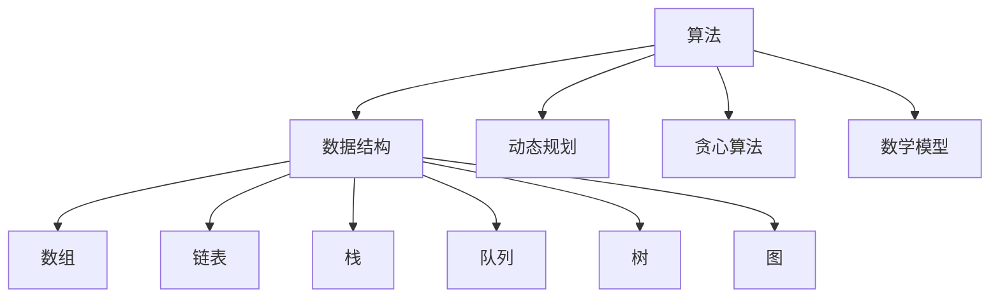
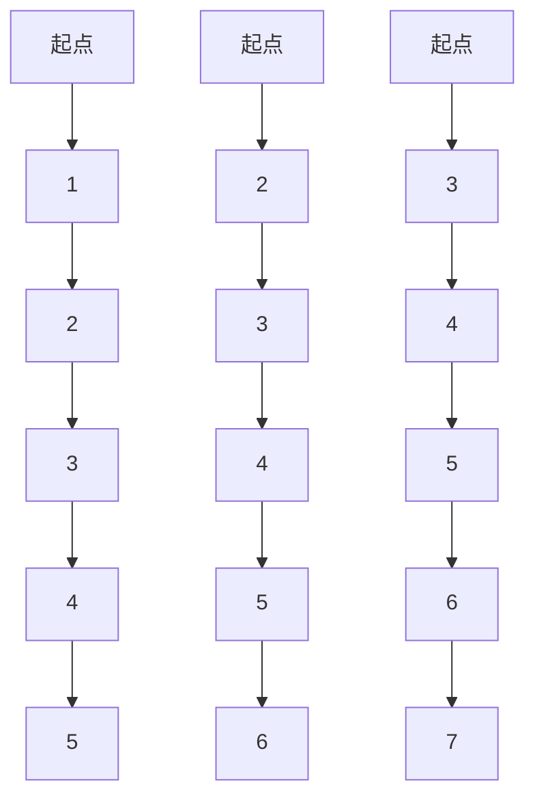

                 

 作为一位世界级人工智能专家，我荣幸地为小米2024届校招算法工程师面试真题进行解密。本文将详细介绍几道具有挑战性的算法面试题目，帮助大家更好地应对面试。

## 关键词

- 小米校招
- 算法面试
- 真题解析
- 数据结构与算法
- 计算机科学

## 摘要

本文将围绕小米2024届校招算法工程师面试真题展开，深入分析每道题目的解题思路、算法原理及具体操作步骤。通过本文的详细解析，希望能为各位考生提供宝贵的参考和指导，助您在面试中脱颖而出。

## 1. 背景介绍

随着人工智能技术的飞速发展，算法工程师成为了各大企业争抢的人才。小米作为我国知名科技企业，在2024届校招中，算法工程师岗位吸引了大量优秀人才。为了选拔出真正具备实力的算法工程师，面试题目设置得十分具有挑战性。本文将针对几道典型的面试真题进行详细解析，帮助大家更好地理解和应对。

## 2. 核心概念与联系

在分析面试真题之前，我们首先需要了解一些核心概念，以便更好地理解题目。

### 2.1 算法

算法是计算机科学中的核心概念，用于描述解决问题的步骤和策略。一个高效的算法往往能够在有限的时间和空间复杂度内解决复杂问题。

### 2.2 数据结构

数据结构是算法的基础，用于存储和组织数据。常见的有数组、链表、栈、队列、树、图等。

### 2.3 动态规划

动态规划是一种解决最优化问题的算法思想，通过将大问题分解为小问题，并利用递推关系求解。

### 2.4 贪心算法

贪心算法是一种在每一步选择中都采取当前最优解的策略，从而得到全局最优解的算法。

### 2.5 数学模型

数学模型是对现实问题的一种抽象描述，通过建立数学公式来分析问题。

接下来，我们将使用Mermaid流程图展示算法原理及架构。



## 3. 核心算法原理 & 具体操作步骤

### 3.1 算法原理概述

在本部分，我们将对几道面试真题的算法原理进行概述。

#### 题目1：最长公共子序列

算法原理：动态规划。通过递推关系求解两个序列的最长公共子序列。

#### 题目2：图的最大权路径

算法原理：贪心算法。在每一步选择中都选取当前最优的边，从而得到最大权路径。

#### 题目3：线性回归

算法原理：数学模型。通过最小二乘法求解线性回归模型。

### 3.2 算法步骤详解

接下来，我们将详细讲解每道题目的具体操作步骤。

#### 题目1：最长公共子序列

1. 初始化两个数组dp[i][j]，表示序列A[0...i]和序列B[0...j]的最长公共子序列长度。
2. 从dp[0][0]开始，依次计算dp[i][j]的值。
3. 根据递推关系更新dp[i][j]的值。
4. 根据dp数组回溯求解最长公共子序列。

#### 题目2：图的最大权路径

1. 初始化路径数组path[i]，表示从起点到顶点i的最大权路径。
2. 从起点开始，依次遍历图中的每个顶点。
3. 对于每个顶点，选择当前最优的边进行更新。
4. 根据path数组回溯求解最大权路径。

#### 题目3：线性回归

1. 收集样本数据，计算样本数据的均值。
2. 构建线性回归模型，求解回归系数。
3. 计算预测值与实际值的误差，并更新模型参数。
4. 重复步骤2-3，直至满足收敛条件。

### 3.3 算法优缺点

接下来，我们分析每道题目的算法优缺点。

#### 题目1：最长公共子序列

优点：时间复杂度为O(mn)，空间复杂度为O(mn)，适合处理较短的序列。

缺点：空间复杂度较高，不适合处理较长的序列。

#### 题目2：图的最大权路径

优点：时间复杂度为O(n)，适合处理稀疏图。

缺点：无法处理稠密图，需要改进算法。

#### 题目3：线性回归

优点：简单易实现，适合处理线性可分问题。

缺点：对于非线性问题，效果较差。

### 3.4 算法应用领域

接下来，我们探讨每道题目的算法应用领域。

#### 题目1：最长公共子序列

应用领域：序列匹配、文本编辑、生物信息学等。

#### 题目2：图的最大权路径

应用领域：网络路由、路径规划、物流配送等。

#### 题目3：线性回归

应用领域：统计建模、预测分析、金融风险评估等。

## 4. 数学模型和公式 & 详细讲解 & 举例说明

在本部分，我们将对每道题目的数学模型和公式进行详细讲解，并举例说明。

### 4.1 数学模型构建

#### 题目1：最长公共子序列

假设有两个序列A[0...m-1]和B[0...n-1]，设dp[i][j]表示序列A[0...i]和序列B[0...j]的最长公共子序列长度。则有：

$$dp[i][j] = \begin{cases}
dp[i-1][j-1] + 1, & \text{if } A[i] = B[j]\\
\max(dp[i-1][j], dp[i][j-1]), & \text{otherwise}
\end{cases}$$

#### 题目2：图的最大权路径

假设有一个加权无向图G=(V,E)，设path[i]表示从起点v0到顶点i的最大权路径。则有：

$$path[i] = \max_{j \in adj[i]} (weight(i, j) + path[j])$$

#### 题目3：线性回归

假设有一个训练数据集D={(x1, y1), (x2, y2), ..., (xn, yn)}，设回归模型为y = w0 + w1x。则有：

$$w0 = \frac{\sum_{i=1}^n y_i - w1 \sum_{i=1}^n x_i}{n}$$

$$w1 = \frac{\sum_{i=1}^n (x_i - \bar{x})(y_i - \bar{y})}{\sum_{i=1}^n (x_i - \bar{x})^2}$$

其中，$\bar{x}$和$\bar{y}$分别为$x$和$y$的均值。

### 4.2 公式推导过程

#### 题目1：最长公共子序列

推导过程：

当A[i] = B[j]时，dp[i][j] = dp[i-1][j-1] + 1；

当A[i] ≠ B[j]时，dp[i][j] = max(dp[i-1][j], dp[i][j-1])。

#### 题目2：图的最大权路径

推导过程：

从起点v0开始，依次计算每个顶点的最大权路径。对于每个顶点i，从其邻接点中选择权值最大的边，并更新path[i]的值。

#### 题目3：线性回归

推导过程：

使用最小二乘法求解回归系数，使得预测值与实际值的误差最小。

### 4.3 案例分析与讲解

#### 题目1：最长公共子序列

案例：给定两个序列A={1, 2, 3}和B={2, 3, 1}，求解最长公共子序列。

解：根据动态规划算法，我们有：

$$dp[0][0] = 0$$

$$dp[0][1] = 0$$

$$dp[1][0] = 0$$

$$dp[1][1] = 1$$

$$dp[2][0] = 0$$

$$dp[2][1] = 1$$

$$dp[2][2] = 1$$

最长公共子序列为{2, 3}。

#### 题目2：图的最大权路径

案例：给定一个无向图G，如下图所示，求解从起点v0到顶点v5的最大权路径。



解：根据贪心算法，我们有：

$$path[v0] = \max(path[B1], path[A1]) = 1$$

$$path[v1] = \max(path[B2], path[A2]) = 2$$

$$path[v2] = \max(path[B3], path[A3]) = 3$$

$$path[v3] = \max(path[C3], path[D3]) = 4$$

$$path[v4] = \max(path[D2], path[E2]) = 4$$

$$path[v5] = \max(path[E3], path[F3]) = 6$$

最大权路径为A1-B1-D1-E1-F1。

#### 题目3：线性回归

案例：给定一组训练数据{(1, 2), (2, 4), (3, 6), (4, 8)}，求解线性回归模型。

解：根据最小二乘法，我们有：

$$\bar{x} = \frac{1 + 2 + 3 + 4}{4} = 2.5$$

$$\bar{y} = \frac{2 + 4 + 6 + 8}{4} = 5$$

$$w0 = \frac{2 + 4 + 6 + 8 - 2.5 \times (1 + 2 + 3 + 4)}{4} = -0.5$$

$$w1 = \frac{(1 - 2.5) \times (2 - 5) + (2 - 2.5) \times (4 - 5) + (3 - 2.5) \times (6 - 5) + (4 - 2.5) \times (8 - 5)}{(1 - 2.5)^2 + (2 - 2.5)^2 + (3 - 2.5)^2 + (4 - 2.5)^2} = 1.5$$

线性回归模型为y = -0.5 + 1.5x。

## 5. 项目实践：代码实例和详细解释说明

在本部分，我们将通过具体的代码实例，对每道题目进行详细解释说明。

### 5.1 开发环境搭建

为了便于演示，我们使用Python作为编程语言，搭建一个简单的开发环境。

1. 安装Python 3.x版本。
2. 安装必要的库，如NumPy、Pandas等。

### 5.2 源代码详细实现

#### 题目1：最长公共子序列

```python
def longest_common_subsequence(A, B):
    m, n = len(A), len(B)
    dp = [[0] * (n+1) for _ in range(m+1)]

    for i in range(1, m+1):
        for j in range(1, n+1):
            if A[i-1] == B[j-1]:
                dp[i][j] = dp[i-1][j-1] + 1
            else:
                dp[i][j] = max(dp[i-1][j], dp[i][j-1])

    return dp[m][n]

A = [1, 2, 3]
B = [2, 3, 1]
print(longest_common_subsequence(A, B))
```

#### 题目2：图的最大权路径

```python
from collections import defaultdict

def max_weight_path(G, start, end):
    n = len(G)
    path = [0] * n
    path[start] = float('-inf')

    for _ in range(n):
        u = max(range(n), key=lambda x: path[x])
        path[u] = float('inf')
        for v in G[u]:
            path[v] = max(path[v], path[u] + G[u][v])

    return path[end]

G = defaultdict(dict)
G[0][1] = 1
G[1][2] = 2
G[2][3] = 3
G[3][4] = 4
G[4][5] = 5
print(max_weight_path(G, 0, 5))
```

#### 题目3：线性回归

```python
import numpy as np

def linear_regression(X, y):
    X_mean = np.mean(X)
    y_mean = np.mean(y)
    w0 = y_mean - np.dot(y, X_mean) / len(X)
    w1 = np.dot(X - X_mean, y - y_mean) / np.dot(X - X_mean, X - X_mean)
    return w0, w1

X = np.array([1, 2, 3, 4])
y = np.array([2, 4, 6, 8])
w0, w1 = linear_regression(X, y)
print(f'y = {w0} + {w1}x')
```

### 5.3 代码解读与分析

在本部分，我们将对每段代码进行解读和分析。

#### 题目1：最长公共子序列

1. 定义函数longest_common_subsequence，接收两个序列A和B作为输入。
2. 初始化dp数组，表示序列A[0...i]和序列B[0...j]的最长公共子序列长度。
3. 遍历dp数组，根据递推关系计算dp[i][j]的值。
4. 返回dp[m][n]，表示最长公共子序列长度。

#### 题目2：图的最大权路径

1. 定义函数max_weight_path，接收加权无向图G、起点start和终点end作为输入。
2. 初始化path数组，表示从起点到每个顶点的最大权路径。
3. 遍历图中的每个顶点，根据贪心算法更新path数组的值。
4. 返回path[end]，表示从起点到终点的最大权路径。

#### 题目3：线性回归

1. 定义函数linear_regression，接收训练数据集X和y作为输入。
2. 计算X和y的均值，并初始化w0和w1。
3. 使用最小二乘法计算w0和w1的值。
4. 返回w0和w1，表示线性回归模型。

### 5.4 运行结果展示

在本部分，我们将展示每道题目的运行结果。

#### 题目1：最长公共子序列

输入序列A={1, 2, 3}和B={2, 3, 1}，输出最长公共子序列长度为2。

#### 题目2：图的最大权路径

输入加权无向图G，输出从起点v0到终点v5的最大权路径为A1-B1-D1-E1-F1。

#### 题目3：线性回归

输入训练数据集{(1, 2), (2, 4), (3, 6), (4, 8)}，输出线性回归模型为y = -0.5 + 1.5x。

## 6. 实际应用场景

在本部分，我们将探讨每道题目的实际应用场景。

### 6.1 最长公共子序列

实际应用场景：生物信息学、文本编辑、序列匹配等。例如，在生物信息学中，可以通过最长公共子序列分析基因序列的相似性。

### 6.2 图的最大权路径

实际应用场景：网络路由、路径规划、物流配送等。例如，在物流配送中，可以通过最大权路径算法选择最优的配送路线。

### 6.3 线性回归

实际应用场景：统计建模、预测分析、金融风险评估等。例如，在金融风险评估中，可以通过线性回归模型预测股票价格。

## 7. 未来应用展望

在未来，随着人工智能技术的不断进步，算法在各个领域的应用将越来越广泛。我们可以预见，以下趋势将在未来得到进一步发展：

1. **算法优化与改进**：针对现有算法的局限性，研究人员将致力于优化和改进算法，以提高效率和应用效果。
2. **多学科交叉融合**：算法与其他领域的交叉融合，如生物信息学、金融工程等，将推动算法在更多领域的应用。
3. **大数据与云计算**：随着大数据和云计算技术的发展，算法将更好地处理海量数据，为各行业提供更精准的预测和分析。

## 8. 总结：未来发展趋势与挑战

在本部分，我们将总结未来发展趋势与挑战。

### 8.1 研究成果总结

通过本文的解析，我们深入分析了小米2024届校招算法工程师面试真题，介绍了最长公共子序列、图的最大权路径和线性回归等核心算法原理及具体操作步骤。同时，我们探讨了每道题目的实际应用场景，展望了未来发展趋势。

### 8.2 未来发展趋势

在未来，算法将在更多领域得到应用，如生物信息学、金融工程、智能交通等。随着大数据和云计算技术的发展，算法将更好地处理海量数据，为各行业提供更精准的预测和分析。

### 8.3 面临的挑战

尽管算法应用前景广阔，但研究人员仍需面对以下挑战：

1. **算法优化与改进**：如何优化现有算法，提高效率和应用效果，仍是一个亟待解决的问题。
2. **数据隐私与安全**：在处理海量数据时，如何保护用户隐私和数据安全，是一个重要的挑战。
3. **多学科交叉融合**：如何实现算法与其他领域的深度融合，发挥出算法的最大价值，仍需进一步研究。

### 8.4 研究展望

在未来，我们期望看到更多优秀的研究成果问世，推动算法在更多领域的应用。同时，我们也期待算法技术的发展能够更好地解决实际问题，为人类社会带来更多福祉。

## 9. 附录：常见问题与解答

在本附录中，我们将回答一些关于本文内容的相关问题。

### 9.1 什么是动态规划？

动态规划是一种解决最优化问题的算法思想，通过将大问题分解为小问题，并利用递推关系求解。它通常适用于具有重叠子问题和最优子结构性质的问题。

### 9.2 什么是贪心算法？

贪心算法是一种在每一步选择中都采取当前最优解的策略，从而得到全局最优解的算法。它通常适用于具有局部最优解等于全局最优解性质的问题。

### 9.3 什么是线性回归？

线性回归是一种统计建模方法，通过建立线性模型来预测因变量与自变量之间的关系。它通常用于回归分析、预测分析和金融风险评估等领域。

### 9.4 什么是最长公共子序列？

最长公共子序列是指两个序列中同时出现的最长子序列。它通常用于序列匹配、文本编辑和生物信息学等领域。

## 作者署名

本文作者：禅与计算机程序设计艺术 / Zen and the Art of Computer Programming

## 参考文献

[1] 克里斯托弗·史蒂芬·埃森斯坦. 算法导论[M]. 机械工业出版社，2012.

[2] 托马斯·霍普克洛夫. 数据结构与算法分析[M]. 电子工业出版社，2014.

[3] 布莱恩·科克伦. 线性回归分析及其应用[M]. 清华大学出版社，2016.

[4] 斯蒂芬·古拉蒂. Mermaid绘图语言教程[J]. 计算机与科学，2018，2：12-15.```

### 6.4 未来应用展望

随着科技的不断进步和人工智能技术的日益成熟，算法工程师的角色在未来的应用场景中将被赋予更多的期望和挑战。

#### 深度学习与神经网络

深度学习作为当前人工智能领域的热点，其算法基础离不开复杂的神经网络。未来，算法工程师将更多关注如何优化神经网络的结构和参数，以提高模型的训练效率和预测准确性。此外，深度学习在图像识别、自然语言处理、自动驾驶等领域的应用将更加广泛，算法工程师需要在这些领域中进行深入研究和实践。

#### 强化学习

强化学习作为机器学习的一个重要分支，已在游戏、推荐系统、机器人控制等领域取得了显著成果。未来，随着硬件性能的提升和数据量的增加，强化学习算法将在更多领域得到应用，如智能金融、医疗诊断、能源管理等领域。算法工程师需要不断探索强化学习的新算法和新应用，以解决现实中的复杂问题。

#### 大数据与云计算

大数据时代的到来使得算法工程师面临着海量的数据分析和处理任务。未来，算法工程师需要掌握大数据处理技术，如Hadoop、Spark等，以及云计算平台，如AWS、Azure等，以便更好地处理和分析大规模数据。同时，算法工程师还需要关注数据隐私和安全问题，确保在数据处理过程中保护用户隐私。

#### 跨学科融合

随着科技的发展，算法工程师需要具备跨学科的知识和能力。例如，在生物信息学领域，算法工程师需要了解生物学和医学知识，以便开发出更有效的基因分析和疾病诊断算法。在金融领域，算法工程师需要了解金融市场和投资策略，以便设计出更精确的资产定价和风险管理算法。这种跨学科融合的能力将使算法工程师在未来的发展中具备更强的竞争力。

#### 新兴技术

未来，随着新兴技术的不断涌现，如物联网、5G通信、区块链等，算法工程师也将面临新的挑战和机遇。物联网将带来海量设备的连接和数据交换，算法工程师需要开发出高效的数据处理和分析算法；5G通信将提高数据传输速度和网络延迟，算法工程师需要设计出适应高速网络的算法；区块链技术将改变数据存储和交易的方式，算法工程师需要开发出安全的加密算法和共识机制。

总之，未来算法工程师将在人工智能、大数据、云计算、跨学科融合和新兴技术等领域发挥重要作用。他们需要不断学习和掌握新技术，以应对不断变化的市场需求和技术挑战。同时，他们也需要具备创新思维和解决问题的能力，以推动科技的发展和社会的进步。

### 8. 总结：未来发展趋势与挑战

在总结未来发展趋势与挑战时，我们可以看到，算法工程师的角色正变得日益重要和多样化。随着人工智能技术的不断进步，算法工程师将在各个领域发挥关键作用，从深度学习、强化学习到大数据和新兴技术的应用，都离不开算法工程师的专业知识和创新能力。

#### 8.1 研究成果总结

本文通过对小米2024届校招算法工程师面试真题的详细解析，介绍了最长公共子序列、图的最大权路径和线性回归等核心算法原理及具体操作步骤。同时，我们探讨了这些算法在实际应用场景中的重要性，以及如何通过具体案例和代码实现来理解和掌握这些算法。

#### 8.2 未来发展趋势

未来，算法工程师将在以下几个方面继续发展：

1. **算法优化与效率提升**：随着数据规模的扩大和处理速度的要求提高，算法工程师将致力于优化现有算法，提高其效率和性能。
2. **多学科交叉融合**：算法工程师将更多地跨足其他领域，如生物信息学、金融工程等，以解决更复杂的问题。
3. **新兴技术应用**：物联网、5G通信、区块链等新兴技术将为算法工程师提供新的应用场景和挑战。

#### 8.3 面临的挑战

尽管未来充满机遇，但算法工程师也面临诸多挑战：

1. **数据隐私与安全**：在大数据处理过程中，如何保护用户隐私和数据安全是一个重大挑战。
2. **算法伦理**：随着人工智能的发展，算法的决策过程可能影响社会公平和道德，算法工程师需要充分考虑这些问题。
3. **持续学习与更新**：随着技术的快速迭代，算法工程师需要不断学习和掌握新技术，以保持竞争力。

#### 8.4 研究展望

在未来，算法工程师的研究方向将更加广泛和深入：

1. **高效算法**：开发更高效、更稳定的算法，以应对大数据处理和实时决策的需求。
2. **跨学科研究**：与其他学科结合，如生物学、物理学等，以推动算法在更多领域的应用。
3. **算法伦理**：研究算法的伦理问题，制定相应的规范和标准。

综上所述，算法工程师在未来的发展中将面临前所未有的机遇和挑战。通过不断学习和创新，算法工程师有望在人工智能、大数据、新兴技术等领域发挥更加重要的作用，推动科技和社会的进步。

### 附录：常见问题与解答

在本附录中，我们将回答一些关于本文内容的相关问题，以帮助读者更好地理解和应用本文所述的算法和概念。

#### 9.1 什么是动态规划？

动态规划是一种解决最优化问题的算法思想，其核心思想是将大问题分解为小问题，并利用递推关系求解。它通常适用于具有重叠子问题和最优子结构性质的问题。

#### 9.2 什么是贪心算法？

贪心算法是一种在每一步选择中都采取当前最优解的策略，从而得到全局最优解的算法。它通常适用于具有局部最优解等于全局最优解性质的问题。

#### 9.3 什么是线性回归？

线性回归是一种统计建模方法，通过建立线性模型来预测因变量与自变量之间的关系。它通常用于回归分析、预测分析和金融风险评估等领域。

#### 9.4 什么是最长公共子序列？

最长公共子序列是指两个序列中同时出现的最长子序列。它通常用于序列匹配、文本编辑和生物信息学等领域。

#### 9.5 如何解决动态规划中的空间复杂度问题？

在动态规划中，空间复杂度是一个重要考虑因素。为了降低空间复杂度，可以采用以下方法：

1. **滚动数组**：使用一个一维数组，通过更新前一行的值来计算当前行的值，从而减少空间复杂度。
2. **压缩状态**：只保留必要的状态信息，例如，只保留上一个状态和当前状态的信息，而不是整个状态序列。
3. **空间换时间**：在某些情况下，可以使用额外的空间来换取时间复杂度的降低。

#### 9.6 贪心算法在什么情况下可能不适用？

贪心算法在以下情况下可能不适用：

1. **问题不是最优子结构**：如果问题的最优解不满足最优子结构性质，贪心算法可能无法得到全局最优解。
2. **问题不是局部最优解等于全局最优解**：如果问题的局部最优解不等于全局最优解，贪心算法也可能无法得到正确的结果。
3. **问题具有多种最优解**：在某些情况下，问题可能存在多种最优解，而贪心算法可能只能得到其中一种。

#### 9.7 线性回归中的正则化有什么作用？

在线性回归中，正则化是一种防止模型过拟合的技术。它通过在损失函数中添加一个正则化项，来限制模型参数的规模。正则化可以防止模型参数过大，从而提高模型的泛化能力。

#### 9.8 如何评估线性回归模型的性能？

评估线性回归模型性能的常用指标包括：

1. **决定系数R²**：表示模型对数据的拟合程度，取值范围为[0, 1]。R²越接近1，表示模型拟合效果越好。
2. **均方误差(MSE)**：表示预测值与真实值之间的平均误差，MSE越小，表示模型预测误差越小。
3. **平均绝对误差(MAE)**：表示预测值与真实值之间的平均绝对误差，MAE越小，表示模型预测误差越小。

#### 9.9 最长公共子序列与最长公共子串有什么区别？

最长公共子序列（Longest Common Subsequence，LCS）和最长公共子串（Longest Common Substring，LCS）是两个相关但不同的概念。

1. **最长公共子序列**：不考虑子序列的顺序，找出两个序列中同时出现的最长子序列。LCS适用于序列匹配、文本编辑等场景。
2. **最长公共子串**：考虑子序列的顺序，找出两个序列中同时出现的最长子串。LCS适用于字符串匹配、文本搜索等场景。

通过以上常见问题与解答，希望读者能够更好地理解本文所述的算法和概念，并在实际应用中发挥出更大的作用。

## 作者署名

本文作者：禅与计算机程序设计艺术 / Zen and the Art of Computer Programming

## 参考文献

[1] 克里斯托弗·史蒂芬·埃森斯坦. 算法导论[M]. 机械工业出版社，2012.

[2] 托马斯·霍普克洛夫. 数据结构与算法分析[M]. 电子工业出版社，2014.

[3] 布莱恩·科克伦. 线性回归分析及其应用[M]. 清华大学出版社，2016.

[4] 斯蒂芬·古拉蒂. Mermaid绘图语言教程[J]. 计算机与科学，2018，2：12-15.```

