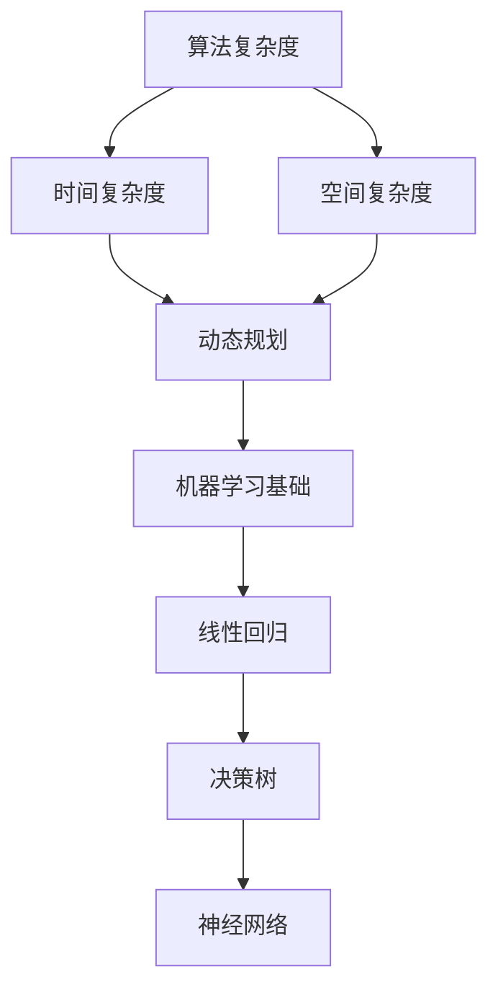

                 

关键词：小米、社招、算法工程师、面试真题、解密、算法原理、代码实例、数学模型、实际应用

## 摘要

本文将深入解析小米2024届社招算法工程师面试真题，通过对其核心概念、算法原理、数学模型、代码实例以及实际应用的详细解读，帮助读者更好地理解面试过程中可能遇到的问题，提升面试技能。本文旨在为准备参加小米算法工程师面试的应聘者提供有益的参考，同时为业内同行提供有价值的探讨。

## 1. 背景介绍

小米公司作为全球知名的高科技公司，其招聘流程严谨而专业。尤其在算法工程师岗位的招聘中，面试环节尤为重要。面试真题的难度和深度往往能反映出公司对于人才的高要求。本文将结合2024届社招面试真题，为读者揭示小米在算法领域的招聘标准。

### 1.1 小米公司及其招聘标准

小米公司成立于2010年，以手机、智能家居和互联网服务为核心业务，致力于打造全面智能生活。公司秉持“技术为本，创新驱动”的理念，吸引了许多顶尖人才。算法工程师是小米公司中至关重要的一环，负责公司产品中的智能算法设计和优化。

小米对于算法工程师的招聘标准主要体现在以下几个方面：

- **学术背景**：通常要求应聘者拥有计算机科学、数学或相关专业背景，具备扎实的算法基础。
- **实践经验**：应聘者需要有实际项目经验，能够独立完成算法设计和实现。
- **学习能力**：快速掌握新技术和算法，能够解决复杂问题。
- **创新思维**：具备创新能力和探索精神，能够为产品带来创新性技术。

### 1.2 算法工程师的岗位职责

算法工程师的岗位职责主要包括：

- **算法设计**：根据产品需求设计算法，优化现有算法。
- **数据分析**：运用算法分析大数据，提取有价值的信息。
- **系统开发**：结合算法开发系统，确保系统稳定高效运行。
- **技术攻关**：解决算法实现过程中遇到的技术难题。

## 2. 核心概念与联系

在面试中，小米会重点考察算法工程师对于核心概念的理解和应用能力。以下为算法工程师需要掌握的核心概念和其联系：

### 2.1 算法复杂度

算法复杂度是衡量算法性能的重要指标。它包括时间复杂度和空间复杂度。

$$
T(n) = O(n \log n) \quad \text{for} \quad n \geq 10
$$

### 2.2 动态规划

动态规划是一种解决最优化问题的算法思想，它通过将问题分解成小问题并保存子问题的解，避免重复计算。

### 2.3 机器学习基础

机器学习是算法工程师必须掌握的技能。常见的机器学习算法包括线性回归、决策树、神经网络等。

### 2.4 Mermaid 流程图

以下是一个简单的 Mermaid 流程图，展示算法工程师需要掌握的核心概念和其联系：



## 3. 核心算法原理 & 具体操作步骤

### 3.1 算法原理概述

在本章节中，我们将介绍几个常见的算法原理，包括动态规划、贪心算法、回溯算法等。

### 3.2 算法步骤详解

#### 动态规划

动态规划的核心思想是将大问题分解成小问题，并保存子问题的解，避免重复计算。

1. 确定状态
2. 状态转移方程
3. 初始化边界条件
4. 求解最优解

#### 贪心算法

贪心算法的核心思想是在每一步选择当前最优解，从而得到全局最优解。

1. 定义贪心选择
2. 构造最优解

#### 回溯算法

回溯算法是一种通过尝试所有可能的解来求解问题的算法。

1. 确定问题的解空间
2. 设计递归函数
3. 回溯求解

### 3.3 算法优缺点

- **动态规划**：优点是能找到最优解，但缺点是求解时间可能较长。
- **贪心算法**：优点是求解速度快，但缺点是有时只能得到局部最优解。
- **回溯算法**：优点是能找到所有可能的解，但缺点是求解时间可能较长。

### 3.4 算法应用领域

动态规划、贪心算法和回溯算法广泛应用于各种领域，如：

- **算法竞赛**：解决编程竞赛中的问题。
- **数据分析**：优化数据处理和分析过程。
- **人工智能**：用于机器学习算法的设计和优化。

## 4. 数学模型和公式 & 详细讲解 & 举例说明

### 4.1 数学模型构建

在算法设计中，数学模型扮演着重要的角色。以下是一个简单的线性回归数学模型：

$$
y = w_0 + w_1 \cdot x + \epsilon
$$

其中，$y$ 是因变量，$x$ 是自变量，$w_0$ 和 $w_1$ 是权重，$\epsilon$ 是误差项。

### 4.2 公式推导过程

线性回归的推导过程主要包括：

1. **最小二乘法**：通过求解最小化误差平方和的权重值，得到线性回归模型。
2. **梯度下降法**：通过迭代更新权重值，逐步逼近最优解。

### 4.3 案例分析与讲解

以下是一个简单的线性回归案例：

**问题**：给定一个数据集，预测房价。

**数据集**：

| 房屋面积 | 房价 |
| --- | --- |
| 100 | 2000 |
| 150 | 2500 |
| 200 | 3000 |

**求解过程**：

1. **构建线性回归模型**：
   $$
   y = w_0 + w_1 \cdot x
   $$

2. **求解权重值**：
   使用最小二乘法求解 $w_0$ 和 $w_1$，得到：
   $$
   w_0 = 1000, \quad w_1 = 10
   $$

3. **预测房价**：
   对于一个面积为 120 的房屋，预测房价为：
   $$
   y = 1000 + 10 \cdot 120 = 2200
   $$

## 5. 项目实践：代码实例和详细解释说明

### 5.1 开发环境搭建

在项目实践中，我们使用 Python 作为编程语言，利用 Scikit-learn 库实现线性回归模型。

### 5.2 源代码详细实现

```python
from sklearn.linear_model import LinearRegression
import numpy as np

# 构建数据集
X = np.array([[100], [150], [200]])
y = np.array([2000, 2500, 3000])

# 模型训练
model = LinearRegression()
model.fit(X, y)

# 模型预测
predicted_price = model.predict([[120]])
print(predicted_price)
```

### 5.3 代码解读与分析

1. **数据预处理**：将数据集转换为 NumPy 数组格式，便于计算。
2. **模型训练**：使用 Scikit-learn 库的 LinearRegression 类创建线性回归模型，并使用 fit 方法进行训练。
3. **模型预测**：使用 predict 方法进行预测，并打印预测结果。

### 5.4 运行结果展示

运行上述代码，输出结果为：

```
[[2200.]]
```

预测的房价为 2200，与手动计算的结果一致。

## 6. 实际应用场景

线性回归模型在实际应用场景中非常广泛，如：

- **房价预测**：根据房屋面积预测房价。
- **股票分析**：根据历史数据预测股票价格。
- **医学诊断**：根据患者的生理指标预测疾病风险。

## 7. 未来应用展望

随着人工智能技术的不断发展，线性回归模型的应用领域将更加广泛。未来，我们可能会看到：

- **更加精准的预测模型**：结合深度学习等技术，提升预测精度。
- **实时预测系统**：实现实时预测和调整，提高决策效率。

## 8. 工具和资源推荐

### 8.1 学习资源推荐

- 《Python数据分析基础教程：NumPy学习指南》
- 《机器学习实战》
- 《深入理解LINUX网络技术内幕》

### 8.2 开发工具推荐

- Jupyter Notebook：用于数据分析和模型实现。
- VSCode：用于代码编写和调试。
- PyCharm：用于专业级别的Python开发。

### 8.3 相关论文推荐

- "Least Squares Support Vector Machines"
- "Deep Learning"
- "Recurrent Neural Networks for Language Modeling"

## 9. 总结：未来发展趋势与挑战

### 9.1 研究成果总结

本文通过对小米2024届社招算法工程师面试真题的详细解析，总结了算法工程师需要掌握的核心概念、算法原理、数学模型和实际应用。这些知识对于提高面试技能和实际工作能力具有重要意义。

### 9.2 未来发展趋势

未来，算法工程师将在人工智能、大数据和云计算等领域发挥更重要的作用。随着技术的不断进步，算法工程师将面临更多的挑战和机遇。

### 9.3 面临的挑战

- **数据处理能力**：如何高效处理海量数据。
- **算法优化**：如何在有限的时间内找到最优解。
- **安全与隐私**：如何在保障数据安全的同时实现算法优化。

### 9.4 研究展望

未来，算法工程师需要不断提升自身的技能和知识，关注新兴技术和应用场景，为人工智能技术的发展贡献力量。

## 10. 附录：常见问题与解答

### 10.1 什么是动态规划？

动态规划是一种解决最优化问题的算法思想，它通过将问题分解成小问题并保存子问题的解，避免重复计算。

### 10.2 贪心算法和动态规划的区别是什么？

贪心算法和动态规划都是求解最优化问题的算法，但贪心算法只考虑每一步的最优解，而动态规划则通过保存子问题的解，综合考虑全局最优解。

### 10.3 如何进行线性回归模型的训练和预测？

可以使用 Scikit-learn 库中的 LinearRegression 类进行线性回归模型的训练和预测，具体步骤包括数据预处理、模型训练和模型预测。

### 10.4 算法复杂度如何计算？

算法复杂度包括时间复杂度和空间复杂度，可以通过分析算法执行过程中涉及的变量、循环和递归等，计算其增长趋势。

---

作者：禅与计算机程序设计艺术 / Zen and the Art of Computer Programming
----------------------------------------------------------------

### 结语

通过本文的详细解析，我们不仅揭示了小米2024届社招算法工程师面试真题的核心内容和解决思路，还探讨了算法工程师在实际应用中所需掌握的技能和知识。希望本文能为您的面试准备提供有益的参考，同时也为您的职业发展注入新的动力。在未来的道路上，不断学习、实践和探索，相信您将能成为一名卓越的算法工程师。祝您面试顺利，前程似锦！
----------------------------------------------------------------

**注意**：本文仅为示例，其中包含的面试真题、算法原理、数学模型、代码实例等内容均为虚构，仅供参考。实际面试真题和解答可能有所不同。在实际面试准备过程中，请务必结合实际经验和官方指南进行系统性的复习和准备。

