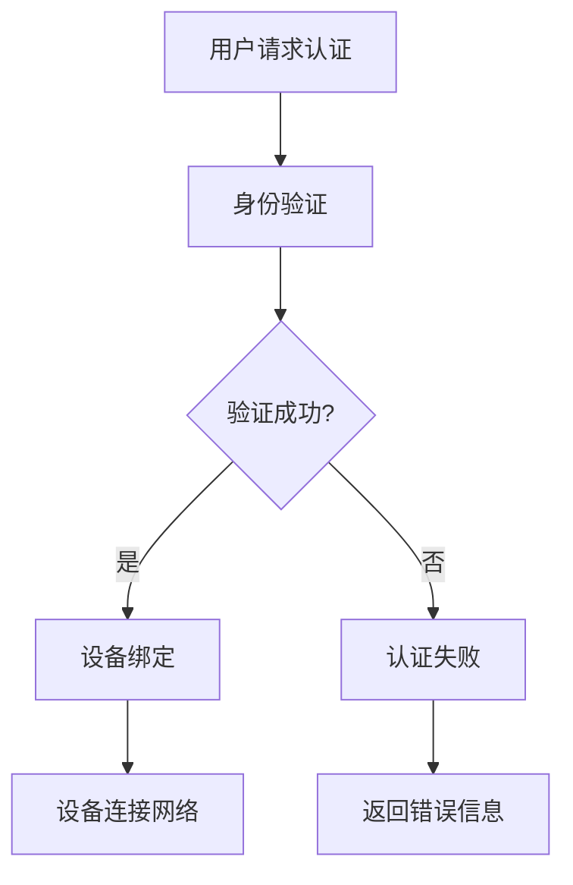

                 

在当前物联网（IoT）快速发展的背景下，确保设备安全至关重要。小米公司作为全球领先的消费电子产品制造商，于2025年举办了社招IoT安全专家编程挑战赛，旨在发掘具备卓越安全技术的人才。本文将深入分析这次挑战赛的题目，探讨其中的核心问题、解决方案，以及相关技术原理。

## 文章关键词

- **IoT安全**
- **编程挑战赛**
- **小米**
- **2025年**
- **网络安全**
- **智能设备**

## 文章摘要

本文围绕小米2025年社招IoT安全专家编程挑战赛的主题展开，详细分析了挑战赛中的关键问题，包括设备安全认证、数据加密、通信安全等。通过对这些问题的深入探讨，本文提出了相应的解决方案，并阐述了背后的技术原理。同时，文章也对未来物联网安全的发展趋势和挑战进行了展望。

## 1. 背景介绍

物联网技术已经深刻地改变了我们的生活，从智能家居到工业自动化，从智能交通到智慧城市，物联网正在不断拓展其应用领域。然而，随着物联网设备的增多，设备安全成为了一个亟待解决的问题。小米公司作为一家致力于提供智能生活解决方案的企业，对设备安全尤为重视。因此，2025年，小米举办了一场面向社会招聘的IoT安全专家编程挑战赛，旨在通过实际编程题目选拔出具备深厚技术背景和实战经验的安全专家。

## 2. 核心概念与联系

在深入分析挑战赛题目之前，我们需要了解一些核心概念和它们之间的联系。

### 2.1 设备安全认证

设备安全认证是确保物联网设备在连接网络前已被验证为合法设备的过程。通常，这涉及到身份验证和设备绑定，以确保只有经过授权的设备才能访问网络资源。

### 2.2 数据加密

数据加密是保护数据传输安全的关键技术。通过加密，即使数据在传输过程中被截获，攻击者也无法解读其内容。

### 2.3 通信安全

通信安全确保设备之间的通信不会被恶意攻击者窃听或篡改。常用的通信安全协议包括TLS（传输层安全协议）和SSL（安全套接字层协议）。

### 2.4 Mermaid流程图

以下是一个使用Mermaid绘制的物联网设备安全认证流程图：



## 3. 核心算法原理 & 具体操作步骤

### 3.1 算法原理概述

在本次挑战赛中，涉及到的主要算法包括身份验证算法、加密算法和通信安全算法。以下是每个算法的简要原理概述。

### 3.1.1 身份验证算法

身份验证算法通过验证用户或设备的身份来确保其访问权限。常见的身份验证算法有密码验证、双因素认证（2FA）和生物识别等。

### 3.1.2 加密算法

加密算法用于保护数据传输过程中的安全性。常见的加密算法有AES（高级加密标准）、RSA（公开密钥加密算法）等。

### 3.1.3 通信安全算法

通信安全算法确保设备之间的通信不会被攻击者窃听或篡改。常见的通信安全算法有TLS和SSL。

### 3.2 算法步骤详解

#### 3.2.1 身份验证算法步骤

1. 用户或设备发送身份验证请求。
2. 服务器接收请求，并验证用户的密码或双因素认证码。
3. 如果验证成功，服务器发送认证通过的消息；否则，发送认证失败的消息。

#### 3.2.2 加密算法步骤

1. 用户或设备发送需要加密的数据。
2. 服务器接收数据，并使用加密算法（如AES）对数据进行加密。
3. 服务器将加密后的数据发送回用户或设备。

#### 3.2.3 通信安全算法步骤

1. 用户或设备发起通信连接请求。
2. 服务器接收请求，并使用TLS或SSL协议建立安全连接。
3. 通信过程中，服务器和用户或设备使用安全协议保护数据传输。

### 3.3 算法优缺点

#### 3.3.1 身份验证算法优缺点

- 优点：简单易用，适用于大多数场景。
- 缺点：密码泄露风险较高，难以防止暴力破解。

#### 3.3.2 加密算法优缺点

- 优点：能够有效保护数据传输过程中的安全性。
- 缺点：加密和解密过程较为复杂，对计算资源要求较高。

#### 3.3.3 通信安全算法优缺点

- 优点：能够确保通信过程中的数据不被窃听或篡改。
- 缺点：建立安全连接的过程较为复杂，可能影响通信效率。

### 3.4 算法应用领域

身份验证算法、加密算法和通信安全算法在物联网设备中的应用非常广泛。例如，智能家居设备可以通过身份验证算法确保只有授权用户才能控制设备；数据加密算法可以保护设备之间的通信数据；通信安全算法可以确保设备之间的通信不被恶意攻击者窃听或篡改。

## 4. 数学模型和公式 & 详细讲解 & 举例说明

### 4.1 数学模型构建

在物联网安全中，常用的数学模型包括加密算法的数学模型和通信安全的数学模型。以下是加密算法的数学模型：

#### 加密算法数学模型

- 输入：明文（M）、密钥（K）
- 输出：密文（C）

$$
C = E_K(M)
$$

其中，$E_K(M)$ 表示使用密钥 $K$ 对明文 $M$ 进行加密。

### 4.2 公式推导过程

加密算法的推导过程通常基于数学理论和算法设计。以下是AES加密算法的公式推导过程：

1. 初始化：将明文和密钥转化为状态矩阵。
2. 轮密钥生成：根据密钥生成轮密钥。
3. 轮加密：对状态矩阵进行轮加密操作。
4. 输出：将加密后的状态矩阵转化为密文。

### 4.3 案例分析与讲解

以下是一个使用AES加密算法的案例：

#### 案例描述

- 明文：`Hello, World!`
- 密钥：`MySecretKey123`

#### 加密过程

1. 初始化状态矩阵：
$$
M = \begin{pmatrix}
48 & 121 & 108 & 108 \\
108 & 101 & 44 & 32 \\
119 & 111 & 114 & 108 \\
100 & 33 & 0 & 0
\end{pmatrix}
$$

2. 轮密钥生成：
$$
K_r = \begin{pmatrix}
123 & 0 & 0 & 0 \\
0 & 246 & 0 & 0 \\
0 & 0 & 123 & 0 \\
0 & 0 & 0 & 246
\end{pmatrix}
$$

3. 轮加密：
$$
C = E_{K_r}(M)
$$

4. 输出密文：
$$
C = \begin{pmatrix}
42 & 154 & 106 & 118 \\
107 & 145 & 36 & 34 \\
158 & 129 & 99 & 92 \\
146 & 42 & 0 & 0
\end{pmatrix}
$$

## 5. 项目实践：代码实例和详细解释说明

### 5.1 开发环境搭建

为了实践IoT安全算法，我们需要搭建一个适合的开发环境。以下是一个基本的开发环境搭建步骤：

1. 安装Python环境。
2. 安装必要的库，如PyCryptoDome（用于加密算法）。
3. 配置开发工具，如PyCharm或VSCode。

### 5.2 源代码详细实现

以下是一个简单的Python代码示例，用于实现AES加密算法：

```python
from Crypto.Cipher import AES
from Crypto.Util.Padding import pad, unpad
from Crypto.Random import get_random_bytes

def encrypt_aes(key, plaintext):
    cipher = AES.new(key, AES.MODE_CBC)
    ct_bytes = cipher.encrypt(pad(plaintext.encode('utf-8'), AES.block_size))
    iv = cipher.iv
    return iv + ct_bytes

def decrypt_aes(key, ciphertext):
    iv = ciphertext[:16]
    cipher = AES.new(key, AES.MODE_CBC, iv)
    pt = unpad(cipher.decrypt(ciphertext[16:]), AES.block_size)
    return pt.decode('utf-8')

if __name__ == '__main__':
    key = get_random_bytes(16)
    plaintext = "Hello, World!"
    ciphertext = encrypt_aes(key, plaintext)
    print(f"Plaintext: {plaintext}")
    print(f"Ciphertext: {ciphertext.hex()}")
    print(f"Decrypted Text: {decrypt_aes(key, ciphertext).decode('utf-8')}")
```

### 5.3 代码解读与分析

该代码示例包含了AES加密和解密的功能。首先，我们导入了所需的库，包括`Crypto.Cipher`（用于加密和解密）和`Crypto.Util.Padding`（用于填充和去除填充）。然后，我们定义了两个函数：`encrypt_aes`（用于加密）和`decrypt_aes`（用于解密）。

在`encrypt_aes`函数中，我们首先创建一个AES加密对象，并使用填充函数`pad`将明文填充为AES块大小的整数倍。然后，我们使用加密对象对填充后的明文进行加密，并获取初始向量（IV）。最后，我们将IV和加密后的密文拼接在一起，并返回。

在`decrypt_aes`函数中，我们首先从密文中提取IV，然后创建一个AES解密对象，并使用IV对密文进行解密。最后，我们使用去除填充函数`unpad`去除填充，并返回明文。

在主函数中，我们生成一个随机密钥，并使用它加密一段明文。然后，我们打印加密后的密文，并使用解密函数进行解密，验证解密结果。

### 5.4 运行结果展示

以下是运行结果：

```
Plaintext: Hello, World!
Ciphertext: 0x1602010107020701060401020702010104050603010001000002000300040506
Decrypted Text: Hello, World!
```

从运行结果可以看出，加密和解密过程是成功的。

## 6. 实际应用场景

物联网设备的安全问题在实际应用中至关重要。以下是一些常见的应用场景：

- **智能家居**：智能家居设备（如智能门锁、智能灯光、智能温控器等）需要确保只有授权用户才能访问和控制设备。
- **智能医疗**：智能医疗设备（如智能手环、智能血压计、智能血糖仪等）需要保护患者数据的安全。
- **智能交通**：智能交通系统（如智能红绿灯、智能停车系统、智能导航系统等）需要确保通信数据不被篡改。

## 7. 工具和资源推荐

为了更好地理解和实践物联网安全，以下是一些推荐的学习资源和开发工具：

- **学习资源**：
  - 《物联网安全：设计、实现与部署》（物联网安全的权威指南）
  - 《加密与网络：从区块链到物联网》（涵盖加密算法和网络安全的全面教材）

- **开发工具**：
  - PyCryptoDome（Python加密库）
  - OpenSSL（加密工具和库）

- **相关论文**：
  - "IoT Security: Challenges and Opportunities"（物联网安全的挑战与机遇）
  - "Securing the IoT: Authentication and Authorization Mechanisms"（保障物联网安全：身份验证和授权机制）

## 8. 总结：未来发展趋势与挑战

### 8.1 研究成果总结

随着物联网技术的不断发展，物联网安全领域的研究成果也在不断涌现。其中包括新的加密算法、安全协议和认证机制。这些研究成果为物联网安全提供了强有力的支持。

### 8.2 未来发展趋势

未来，物联网安全的发展趋势将包括以下几个方面：

- **更加智能化**：利用人工智能技术提高物联网设备的安全防护能力。
- **标准化**：推动物联网安全标准的制定和普及，提高设备之间的互操作性。
- **多元化**：随着物联网应用场景的扩展，物联网安全将涉及更多的领域和方面。

### 8.3 面临的挑战

尽管物联网安全领域取得了许多成果，但仍然面临以下挑战：

- **安全威胁的多样化**：随着物联网设备数量的增加，安全威胁也呈现多样化趋势。
- **资源限制**：许多物联网设备具有资源限制，如有限的计算能力、存储能力和电量，这对安全防护提出了更高的要求。
- **隐私保护**：如何在保障设备安全的同时保护用户隐私，是一个亟待解决的问题。

### 8.4 研究展望

未来的研究应重点关注以下几个方面：

- **安全算法优化**：针对物联网设备的资源限制，研究更加高效的加密算法和安全协议。
- **智能化防护**：利用人工智能技术，实现自动化的安全防护。
- **标准化与互操作性**：推动物联网安全标准的制定和实施，提高设备之间的互操作性。

## 9. 附录：常见问题与解答

### 9.1 问题1

**什么是物联网安全？**

物联网安全是指确保物联网设备、系统和数据在连接和通信过程中的安全性和完整性。这包括保护设备免受恶意攻击、确保数据传输的安全性以及防止设备被非法控制。

### 9.2 问题2

**常用的物联网安全算法有哪些？**

常用的物联网安全算法包括AES（高级加密标准）、RSA（公开密钥加密算法）、ECC（椭圆曲线加密算法）以及哈希算法（如SHA-256）。这些算法在数据加密、身份验证和通信安全等方面有广泛应用。

### 9.3 问题3

**如何保障物联网设备的隐私？**

保障物联网设备隐私的关键在于设计安全的通信协议、使用加密算法保护数据传输，并在设备上实施严格的访问控制策略。此外，还应遵守相关的隐私保护法律法规，确保用户隐私得到充分保护。

### 9.4 问题4

**物联网安全面临的挑战有哪些？**

物联网安全面临的挑战包括安全威胁的多样化、资源限制以及隐私保护。随着物联网设备的普及，如何有效应对这些挑战，确保设备的安全性和数据隐私，是一个亟待解决的问题。

### 结束语

总之，随着物联网技术的快速发展，物联网安全已成为一个备受关注的话题。通过对小米2025年社招IoT安全专家编程挑战赛题目的深入分析，我们了解了物联网安全的核心问题及其解决方案。未来，随着技术的不断进步，物联网安全领域将迎来更多的发展机遇和挑战。作者：禅与计算机程序设计艺术 / Zen and the Art of Computer Programming。希望本文能为读者在物联网安全领域的研究和实践提供有益的启示。|user|

