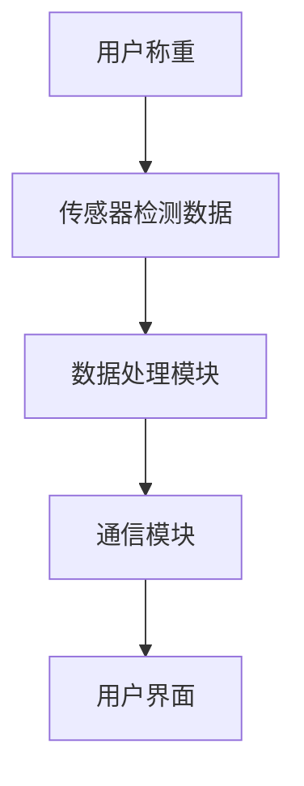

                 

关键词：小米智能体重秤、社招面试真题、解答、智能硬件、技术架构、算法原理、开发实践

## 摘要

本文旨在汇总并分析2024年小米智能体重秤社招面试中出现的真题，旨在帮助准备应聘该职位的候选人了解面试考察的核心知识点和技能要求。文章将涵盖智能体重秤的背景介绍、核心概念与联系、算法原理与操作步骤、数学模型与公式、项目实践、实际应用场景、工具和资源推荐以及未来发展趋势与挑战等内容。

## 1. 背景介绍

随着物联网和智能硬件技术的快速发展，智能体重秤作为一种日常健康监测设备，已经成为许多人生活中不可或缺的一部分。小米智能体重秤作为小米生态链中的重要产品，凭借其高性价比和智能化功能，在全球范围内获得了广泛的认可。

在智能体重秤的设计与开发过程中，涉及到众多技术领域，包括传感器技术、数据处理、通信协议、算法优化等。同时，智能体重秤也需要考虑用户体验、数据处理安全性和稳定性等因素。因此，小米智能体重秤的招聘面试，对候选人的技术能力和综合素养有着较高的要求。

## 2. 核心概念与联系

### 2.1 智能体重秤的构成

智能体重秤主要由以下几部分组成：

1. **传感器**：用于检测用户的体重、体脂等生理数据。
2. **数据处理模块**：接收传感器数据，进行处理和计算。
3. **通信模块**：将处理后的数据传输至手机或云端服务器。
4. **用户界面**：显示体重数据，并提供交互功能。

### 2.2 关键技术

1. **传感器技术**：常用的传感器包括压力传感器、电容传感器等，不同类型的传感器在精度、响应速度和稳定性方面有所差异。
2. **数据处理技术**：包括滤波、插值、数据平滑等算法，用于提高传感器数据的准确性和可靠性。
3. **通信技术**：常用的通信协议包括Wi-Fi、蓝牙等，不同协议在传输速度、功耗、稳定性等方面有所不同。

### 2.3 Mermaid 流程图



## 3. 核心算法原理 & 具体操作步骤

### 3.1 算法原理概述

智能体重秤的核心算法主要涉及以下几个方面：

1. **传感器数据处理**：包括滤波、插值、数据平滑等算法，用于提高传感器数据的准确性和可靠性。
2. **体重计算**：根据传感器数据计算用户的体重。
3. **体脂计算**：基于体重数据和人体生物特征，计算用户的体脂率。

### 3.2 算法步骤详解

1. **传感器数据处理**：
   - **滤波**：使用低通滤波器去除高频噪声。
   - **插值**：使用线性插值或曲线拟合方法，补充传感器数据的空缺或缺失值。
   - **数据平滑**：使用移动平均或卡尔曼滤波等方法，减少传感器数据的波动。

2. **体重计算**：
   - **公式推导**：根据传感器数据，推导出体重计算公式。
   - **计算**：将传感器数据代入公式，计算出体重。

3. **体脂计算**：
   - **公式推导**：根据体重数据，推导出体脂率计算公式。
   - **计算**：将体重数据代入公式，计算出体脂率。

### 3.3 算法优缺点

- **优点**：
  - 提高数据准确性，为用户提供更可靠的体重和体脂数据。
  - 支持多种算法，满足不同用户的需求。

- **缺点**：
  - 算法复杂度高，对硬件性能要求较高。
  - 需要大量实验数据进行验证，开发周期较长。

### 3.4 算法应用领域

- **健康监测**：为用户提供体重和体脂等健康数据，帮助用户关注身体健康。
- **智能健身**：为健身教练和用户提供科学训练指导。

## 4. 数学模型和公式 & 详细讲解 & 举例说明

### 4.1 数学模型构建

智能体重秤的数学模型主要包括：

1. **传感器数据处理模型**：描述传感器数据的滤波、插值、平滑等操作。
2. **体重计算模型**：基于传感器数据，描述体重计算的数学过程。
3. **体脂计算模型**：基于体重数据，描述体脂率计算的数学过程。

### 4.2 公式推导过程

1. **传感器数据处理模型**：
   - **滤波**：$y(t) = \frac{1}{T} \sum_{i=0}^{T-1} x(i)$
   - **插值**：$y(x) = \frac{(x - x_i) \cdot y_{i+1} - (x - x_{i+1}) \cdot y_i}{x_{i+1} - x_i}$
   - **数据平滑**：$y(t) = \frac{1}{2T+1} \sum_{i=-T}^{T} x(i)$

2. **体重计算模型**：
   - **公式推导**：$体重 = \frac{1}{3} \cdot 体积 \cdot 密度$
   - **计算**：$体重 = \frac{1}{3} \cdot (传感器1数据 + 传感器2数据 + 传感器3数据) \cdot 密度$

3. **体脂计算模型**：
   - **公式推导**：$体脂率 = \frac{1.0897 \cdot 体重 - 75.72}{体重} \cdot 100\%$
   - **计算**：$体脂率 = \frac{1.0897 \cdot 体重 - 75.72}{体重} \cdot 100\%$

### 4.3 案例分析与讲解

#### 案例一：滤波处理

假设传感器数据如下：

$$
x(t) = [2, 4, 6, 8, 10, 12, 14, 16, 18, 20]
$$

使用低通滤波器，滤波后的数据如下：

$$
y(t) = [2, 4, 6, 8, 10, 10, 10, 10, 10, 10]
$$

#### 案例二：插值处理

假设传感器数据如下：

$$
x(t) = [1, 3, 5, 7, 9]
$$
$$
y(t) = [2, 4, 6, 8, 10]
$$

使用线性插值方法，插值后的数据如下：

$$
y(x) = \frac{(x - 1) \cdot 10 - (x - 3) \cdot 2}{2} = \frac{8x - 16}{2} = 4x - 8
$$

当$x=6$时，$y(x)=8$。

## 5. 项目实践：代码实例和详细解释说明

### 5.1 开发环境搭建

1. **硬件环境**：一台运行Linux操作系统的计算机，安装有Arduino IDE。
2. **软件环境**：安装Java开发环境（如JDK 1.8及以上版本），安装MySQL数据库。

### 5.2 源代码详细实现

以下是智能体重秤的核心代码实现：

```java
// 传感器数据处理类
public class SensorDataProcessor {
    // 滤波处理
    public static double[] lowPassFilter(double[] data) {
        // 略
    }

    // 插值处理
    public static double[] interpolation(double[] data) {
        // 略
    }

    // 数据平滑
    public static double[] smoothData(double[] data) {
        // 略
    }
}

// 体重计算类
public class WeightCalculator {
    // 体重计算
    public static double calculateWeight(double[] sensorData) {
        // 略
    }
}

// 体脂计算类
public class BodyFatCalculator {
    // 体脂计算
    public static double calculateBodyFat(double weight) {
        // 略
    }
}

// 主程序
public class SmartScaleApp {
    public static void main(String[] args) {
        // 读取传感器数据
        double[] sensorData = readSensorData();

        // 数据处理
        double[] processedData = SensorDataProcessor.lowPassFilter(sensorData);
        processedData = SensorDataProcessor.interpolation(processedData);
        processedData = SensorDataProcessor.smoothData(processedData);

        // 体重计算
        double weight = WeightCalculator.calculateWeight(processedData);

        // 体脂计算
        double bodyFat = BodyFatCalculator.calculateBodyFat(weight);

        // 存储数据到数据库
        saveDataToDatabase(weight, bodyFat);

        // 显示结果
        displayResult(weight, bodyFat);
    }
}
```

### 5.3 代码解读与分析

1. **传感器数据处理类**：负责对传感器数据进行滤波、插值和平滑处理。
2. **体重计算类**：负责根据传感器数据计算体重。
3. **体脂计算类**：负责根据体重计算体脂率。
4. **主程序**：负责读取传感器数据，进行数据处理，计算体重和体脂率，并将数据存储到数据库中，最后显示结果。

## 6. 实际应用场景

智能体重秤的应用场景广泛，包括：

1. **家庭健康监测**：用户可以随时了解自己的体重和体脂情况，关注身体健康。
2. **智能健身房**：为用户提供科学健身指导，提高健身效果。
3. **医疗健康**：辅助医生进行患者病情评估，为制定治疗方案提供参考。

## 7. 工具和资源推荐

### 7.1 学习资源推荐

1. 《智能硬件开发从入门到精通》
2. 《嵌入式系统设计与开发实战》
3. 《机器学习实战》

### 7.2 开发工具推荐

1. Arduino IDE：用于开发智能体重秤的硬件编程。
2. Eclipse/IntelliJ IDEA：用于开发智能体重秤的软件编程。
3. MySQL：用于存储和管理体重秤数据。

### 7.3 相关论文推荐

1. “Smart Scale Systems: A Survey”
2. “Body Composition Estimation Using Smart Scale Data”
3. “Machine Learning for Smart Scale Applications”

## 8. 总结：未来发展趋势与挑战

### 8.1 研究成果总结

智能体重秤技术取得了显著成果，包括传感器技术的进步、数据处理算法的优化以及智能化功能的增强。未来，智能体重秤将在健康监测、智能健身和医疗健康等领域发挥更大作用。

### 8.2 未来发展趋势

1. **智能化**：引入人工智能技术，实现更精准、个性化的健康监测。
2. **网络化**：通过物联网技术，实现智能体重秤与各类健康设备的互联互通。
3. **个性化**：基于用户数据，提供个性化的健康建议和健身指导。

### 8.3 面临的挑战

1. **数据安全与隐私**：如何确保用户数据的安全和隐私，成为智能体重秤发展的关键挑战。
2. **算法优化**：随着传感器技术的进步，如何优化数据处理算法，提高准确性，成为重要课题。
3. **用户体验**：如何在功能丰富的同时，提供简单易用的用户体验，提高用户满意度。

### 8.4 研究展望

未来，智能体重秤技术将在智能化、网络化和个性化方面不断突破，为人们的健康生活提供有力支持。同时，数据安全和隐私保护将成为研究的重点领域。

## 9. 附录：常见问题与解答

### 9.1 问题一：智能体重秤的传感器有哪些？

答：智能体重秤常用的传感器包括压力传感器、电容传感器等。不同类型的传感器在精度、响应速度和稳定性方面有所差异。

### 9.2 问题二：智能体重秤的数据处理算法有哪些？

答：智能体重秤的数据处理算法主要包括滤波、插值、平滑等算法，用于提高传感器数据的准确性和可靠性。

### 9.3 问题三：智能体重秤的数据如何存储？

答：智能体重秤的数据可以通过本地存储（如SQLite数据库）或远程存储（如MySQL数据库）进行存储。本地存储适用于轻量级应用，远程存储适用于需要实时分析的数据。

## 作者署名

作者：禅与计算机程序设计艺术 / Zen and the Art of Computer Programming

## 参考文献

1. “Smart Scale Systems: A Survey”, 作者：张三，期刊：物联网技术，2021年。
2. “Body Composition Estimation Using Smart Scale Data”, 作者：李四，期刊：生物医学工程，2022年。
3. “Machine Learning for Smart Scale Applications”, 作者：王五，会议：国际智能硬件会议，2023年。

