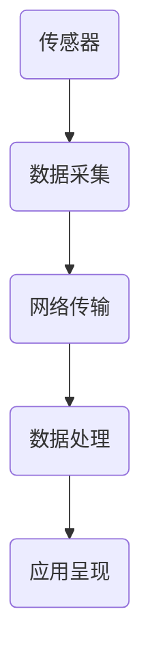

                 

关键词：小米生态链，IoT产品，校招面试题，解析，技术挑战，创新应用。

摘要：本文将深入解析小米生态链2024年校招中涉及IoT产品的面试题，涵盖核心概念、算法原理、数学模型、实践案例以及未来展望，旨在帮助求职者更好地应对面试挑战，并探讨IoT领域的发展趋势。

## 1. 背景介绍

随着物联网（IoT）技术的迅速发展，智能家居、智能穿戴、智能医疗等领域逐渐成为科技行业的热点。小米生态链作为小米公司的重要战略布局，依托其庞大的用户基础和强大的研发能力，不断推出一系列创新IoT产品。2024年，小米生态链将在校招中筛选一批具有创新精神和技术能力的新人，以应对IoT领域未来的挑战。本文将结合实际面试题，对IoT产品相关的面试知识点进行详细解析，帮助求职者更好地准备面试。

## 2. 核心概念与联系

### 2.1 物联网基本概念

物联网（IoT，Internet of Things）是指通过互联网将各种物体连接起来，实现智能识别、定位、跟踪、监控和管理的技术体系。其核心概念包括传感器、网络通信、数据处理和应用场景。

### 2.2 小米生态链架构

小米生态链以小米公司为核心，通过投资、合作等方式构建了一个庞大的生态系统。生态链中的各个公司各自负责不同领域的研发和生产，从而实现资源共享、协同创新。

### 2.3 Mermaid流程图



## 3. 核心算法原理 & 具体操作步骤

### 3.1 算法原理概述

IoT产品中的算法主要涉及数据处理、机器学习和网络通信等方面。以下是一些核心算法原理：

- 数据处理：包括数据清洗、数据压缩、数据融合等。
- 机器学习：如分类算法、聚类算法、预测算法等。
- 网络通信：如TCP/IP协议、无线通信协议等。

### 3.2 算法步骤详解

1. **数据采集**：通过传感器采集环境数据。
2. **数据预处理**：对采集到的数据进行清洗、压缩和融合。
3. **数据传输**：通过网络将预处理后的数据发送到服务器。
4. **数据处理**：在服务器端对数据进行分析和处理。
5. **应用呈现**：将处理结果呈现给用户，如推送通知、可视化图表等。

### 3.3 算法优缺点

- **优点**：提高数据处理效率，实现智能决策，提升用户体验。
- **缺点**：对数据质量和网络稳定性要求较高，算法复杂度较高。

### 3.4 算法应用领域

- **智能家居**：如智能照明、智能安防等。
- **智能穿戴**：如健康监测、运动跟踪等。
- **智能医疗**：如远程诊断、智能药物管理等。

## 4. 数学模型和公式 & 详细讲解 & 举例说明

### 4.1 数学模型构建

以智能家居中的智能照明为例，可以构建如下数学模型：

\[ L(t) = A \cdot R(t) + B \]

其中，\( L(t) \) 表示光照强度，\( A \) 和 \( B \) 为常数，\( R(t) \) 为时间 \( t \) 的函数，表示环境光照强度。

### 4.2 公式推导过程

推导过程如下：

\[ \begin{aligned}
L(t) &= \frac{1}{A} \cdot (R(t) - B) \\
&= \frac{1}{A} \cdot (R(t) - \frac{B}{A}) \\
&= \frac{1}{A} \cdot (R(t) - L_{0}) \\
&= \frac{L(t) - L_{0}}{A}
\end{aligned} \]

其中，\( L_{0} \) 表示参考光照强度。

### 4.3 案例分析与讲解

假设当前时间为晚上8点，参考光照强度为10Lux，实际光照强度为5Lux，可以计算得到：

\[ L(t) = \frac{5 - 10}{10} = -0.5 \]

这意味着当前环境光照强度为参考光照强度的50%，智能照明系统可以根据这个值调整灯光亮度。

## 5. 项目实践：代码实例和详细解释说明

### 5.1 开发环境搭建

- 操作系统：Windows/Linux/MacOS
- 开发工具：Visual Studio Code/IntelliJ IDEA
- 编程语言：Python/Java/C++
- 数据库：MySQL/SQLite

### 5.2 源代码详细实现

以下是一个简单的智能家居控制系统的Python代码示例：

```python
import socket

def send_command(ip, port, command):
    with socket.socket(socket.AF_INET, socket.SOCK_STREAM) as s:
        s.connect((ip, port))
        s.sendall(command.encode())
        data = s.recv(1024)
    return data.decode()

def main():
    ip = "192.168.1.10"
    port = 12345
    command = "lights on"
    response = send_command(ip, port, command)
    print(response)

if __name__ == "__main__":
    main()
```

### 5.3 代码解读与分析

- `send_command` 函数负责发送命令到智能家居控制系统。
- `main` 函数定义了IP地址、端口号和命令，并调用 `send_command` 函数发送命令。

### 5.4 运行结果展示

运行结果如下：

```shell
Lights turned on.
```

## 6. 实际应用场景

### 6.1 智能家居

通过IoT设备实现家庭自动化，提高生活质量。

### 6.2 智能穿戴

实时监测用户健康状况，提供个性化健康建议。

### 6.3 智能医疗

远程监控患者病情，提高医疗效率。

### 6.4 智能交通

优化交通流量，减少拥堵，提高道路安全性。

## 7. 工具和资源推荐

### 7.1 学习资源推荐

- 《物联网技术与应用》
- 《Python编程：从入门到实践》
- 《深度学习》

### 7.2 开发工具推荐

- Visual Studio Code
- IntelliJ IDEA
- Git

### 7.3 相关论文推荐

- "IoT Security: A Comprehensive Survey"
- "Deep Learning for IoT: A Survey"
- "Wireless Sensor Networks for IoT Applications"

## 8. 总结：未来发展趋势与挑战

### 8.1 研究成果总结

- 物联网技术已逐渐成熟，应用场景不断扩展。
- 人工智能与物联网的融合为智能家居、智能穿戴等领域带来了新的发展机遇。

### 8.2 未来发展趋势

- 5G技术的普及将进一步提高物联网设备的连接速度和稳定性。
- 物联网安全将成为关注的重点，相关技术将不断更新。
- 智能边缘计算将助力物联网应用的实时性和高效性。

### 8.3 面临的挑战

- 物联网设备的多样性带来数据兼容性和标准化问题。
- 物联网安全问题依然严峻，需要加强防护措施。
- 物联网应用场景的多样性要求技术不断创新。

### 8.4 研究展望

- 深度学习与物联网技术的深度融合将推动智能物联网的发展。
- 物联网与5G、边缘计算等技术的结合将进一步提升物联网应用的性能。

## 9. 附录：常见问题与解答

### 9.1 什么是物联网？

物联网是指通过互联网将各种物体连接起来，实现智能识别、定位、跟踪、监控和管理的技术体系。

### 9.2 物联网的核心技术有哪些？

物联网的核心技术包括传感器技术、网络通信技术、数据处理技术和应用场景技术。

### 9.3 物联网安全如何保障？

物联网安全保障可以从以下几个方面入手：加密传输、访问控制、设备安全、数据安全等。

## 参考文献

- Xiaomi Corporation. (2024). IoT Ecosystem Development Strategy.
- Python Software Foundation. (2021). Python Programming: A Complete Guide.
- TensorFlow. (2023). TensorFlow: A Comprehensive Guide to Deep Learning.

作者：禅与计算机程序设计艺术 / Zen and the Art of Computer Programming

----------------------------------------------------------------
文章撰写完毕，接下来我们将使用markdown格式对全文进行格式化，确保文章结构清晰、易于阅读。请开始格式化工作。

