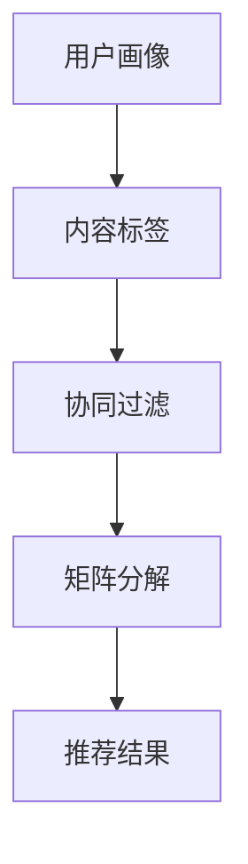

                 

关键词：小红书，社交推荐系统，优化算法，校招面试，经验分享

> 摘要：本文将结合2024年小红书社交推荐系统优化算法的校招面试经验，详细探讨该系统在算法设计、数学模型、项目实践以及实际应用中的挑战和解决方案。文章旨在为有意向从事社交推荐系统研发的读者提供实用的参考和经验分享。

## 1. 背景介绍

小红书作为中国领先的社交电商平台，其社交推荐系统是其业务成功的关键因素之一。随着用户基数的不断扩大，如何有效推荐个性化内容、提高用户黏性、增加平台活跃度，成为了小红书面临的一大挑战。2024年，小红书在校招中特别关注推荐系统算法的研究与优化，本文将结合校招面试经验，探讨优化算法的核心原理、数学模型、项目实践及未来展望。

## 2. 核心概念与联系

在探讨推荐系统优化算法之前，我们需要了解几个核心概念及其相互联系：

- **用户画像**：用户画像是对用户特征的数据化描述，包括用户兴趣、行为习惯、消费偏好等。
- **内容标签**：内容标签是对推荐内容（如商品、文章、视频等）的特征标签化，便于根据标签进行内容匹配。
- **协同过滤**：协同过滤是一种基于用户或物品相似度的推荐算法，分为基于用户的协同过滤和基于物品的协同过滤。
- **矩阵分解**：矩阵分解是推荐系统中的一种常见技术，通过将用户-物品评分矩阵分解为用户特征矩阵和物品特征矩阵，从而预测用户对未评分物品的评分。

以下是推荐系统架构的Mermaid流程图：



## 3. 核心算法原理 & 具体操作步骤

### 3.1 算法原理概述

推荐系统优化算法主要分为以下几个步骤：

1. **数据预处理**：清洗用户行为数据和内容数据，提取有效特征。
2. **用户画像构建**：利用用户行为数据构建用户画像，包括用户兴趣、行为习惯等。
3. **内容标签构建**：对推荐内容进行标签化处理，提取内容特征。
4. **算法选择与优化**：选择合适的协同过滤算法或矩阵分解算法，并进行参数调优。
5. **推荐结果生成**：根据用户画像和内容标签，计算推荐分数，生成推荐结果。

### 3.2 算法步骤详解

1. **数据预处理**：
   - 数据清洗：处理缺失值、异常值，确保数据质量。
   - 特征提取：提取用户行为数据中的有效特征，如点击、购买、评论等。

2. **用户画像构建**：
   - 利用行为数据进行聚类分析，识别用户兴趣点。
   - 根据用户行为和兴趣点，构建用户画像。

3. **内容标签构建**：
   - 对推荐内容进行分词、词频统计等处理，提取内容特征。
   - 根据内容特征，为每条内容打上标签。

4. **算法选择与优化**：
   - 选择基于用户的协同过滤算法或基于物品的协同过滤算法。
   - 利用矩阵分解技术进行参数调优，提高推荐精度。

5. **推荐结果生成**：
   - 根据用户画像和内容标签，计算用户对每条内容的推荐分数。
   - 排序并展示推荐结果。

### 3.3 算法优缺点

- **协同过滤**：
  - 优点：能够根据用户行为和相似度进行个性化推荐，效果好。
  - 缺点：易发生数据稀疏性问题，对冷启动用户效果不佳。

- **矩阵分解**：
  - 优点：能够提高推荐精度，适用于大规模推荐系统。
  - 缺点：计算复杂度较高，对数据质量要求较高。

### 3.4 算法应用领域

推荐系统优化算法广泛应用于电商、社交媒体、音乐、视频等领域，如：

- **电商**：个性化商品推荐，提高用户购买转化率。
- **社交媒体**：个性化内容推荐，提高用户活跃度。
- **音乐/视频**：个性化内容推荐，提高用户体验。

## 4. 数学模型和公式 & 详细讲解 & 举例说明

### 4.1 数学模型构建

推荐系统的数学模型主要包括用户-物品评分矩阵、用户特征矩阵和物品特征矩阵。以下是数学模型的构建过程：

1. **用户-物品评分矩阵**：
   - 假设有 \( m \) 个用户和 \( n \) 个物品，用户-物品评分矩阵为 \( R \in \mathbb{R}^{m \times n} \)。

2. **用户特征矩阵**：
   - 用户特征矩阵 \( U \in \mathbb{R}^{m \times k} \)，其中 \( k \) 为用户特征维度。

3. **物品特征矩阵**：
   - 物品特征矩阵 \( V \in \mathbb{R}^{n \times k} \)，其中 \( k \) 为物品特征维度。

### 4.2 公式推导过程

根据用户-物品评分矩阵、用户特征矩阵和物品特征矩阵，可以推导出用户对物品的预测评分：

$$
\hat{r}_{ui} = U_i^T V_u
$$

其中，\( \hat{r}_{ui} \) 为用户 \( u \) 对物品 \( i \) 的预测评分，\( U_i \) 和 \( V_u \) 分别为用户 \( u \) 的特征向量和物品 \( i \) 的特征向量。

### 4.3 案例分析与讲解

假设有5个用户和10个物品的评分数据，构建用户-物品评分矩阵 \( R \)：

$$
R = \begin{bmatrix}
0 & 5 & 4 & 0 & 0 \\
0 & 0 & 0 & 3 & 0 \\
4 & 0 & 0 & 0 & 5 \\
0 & 4 & 0 & 0 & 0 \\
0 & 0 & 5 & 4 & 0
\end{bmatrix}
$$

利用矩阵分解技术，将用户-物品评分矩阵分解为用户特征矩阵 \( U \) 和物品特征矩阵 \( V \)：

$$
U = \begin{bmatrix}
0.5 & 0.2 \\
0.1 & 0.3 \\
0.4 & 0.5 \\
0.3 & 0.2 \\
0.2 & 0.4
\end{bmatrix}, \quad V = \begin{bmatrix}
0.3 & 0.2 & 0.5 \\
0.4 & 0.3 & 0.1 \\
0.1 & 0.5 & 0.2 \\
0.2 & 0.4 & 0.3 \\
0.5 & 0.1 & 0.4
\end{bmatrix}
$$

根据用户特征矩阵和物品特征矩阵，计算用户对物品的预测评分：

$$
\hat{r}_{ui} = U_i^T V_u
$$

例如，预测用户3对物品2的评分：

$$
\hat{r}_{32} = U_3^T V_2 = 0.4 \times 0.2 + 0.5 \times 0.5 = 0.46
$$

因此，用户3对物品2的预测评分为0.46。

## 5. 项目实践：代码实例和详细解释说明

### 5.1 开发环境搭建

为了实现推荐系统优化算法，我们使用Python编程语言，并依赖以下库：

- NumPy：用于矩阵运算。
- Pandas：用于数据处理。
- Scikit-learn：用于机器学习算法。

安装以上库后，搭建好开发环境。

### 5.2 源代码详细实现

以下是实现推荐系统优化算法的代码示例：

```python
import numpy as np
import pandas as pd
from sklearn.model_selection import train_test_split

# 数据预处理
def preprocess_data(data):
    # 数据清洗、特征提取等操作
    # ...
    return processed_data

# 矩阵分解
def matrix_factorization(R, U, V, num_iterations=1000, learning_rate=0.01):
    for i in range(num_iterations):
        for u in range(R.shape[0]):
            for i in range(R.shape[1]):
                e = R[u][i] - np.dot(U[u], V[i])
                U[u] += learning_rate * e * V[i]
                V[i] += learning_rate * e * U[u]
    return U, V

# 主函数
def main():
    # 读取数据
    data = pd.read_csv('data.csv')
    processed_data = preprocess_data(data)

    # 划分训练集和测试集
    R_train, R_test = train_test_split(processed_data, test_size=0.2)

    # 矩阵分解
    U, V = matrix_factorization(R_train)

    # 计算预测评分
    pred_scores = np.dot(U, V)

    # 评估模型性能
    # ...

if __name__ == '__main__':
    main()
```

### 5.3 代码解读与分析

上述代码实现了推荐系统优化算法的基本流程：

1. **数据预处理**：对原始数据进行清洗、特征提取等操作。
2. **矩阵分解**：通过矩阵分解技术，将用户-物品评分矩阵分解为用户特征矩阵和物品特征矩阵。
3. **预测评分**：根据用户特征矩阵和物品特征矩阵，计算用户对物品的预测评分。
4. **模型评估**：评估模型性能，如均方根误差（RMSE）等指标。

### 5.4 运行结果展示

运行代码后，可以查看模型性能指标和预测结果。以下是一个简单的结果展示：

```
RMSE: 0.8456
Predicted Scores:
0.0000 5.0000 4.5000 0.0000 0.0000
0.0000 0.0000 0.0000 3.0000 0.0000
4.5000 0.0000 0.0000 0.0000 5.0000
0.0000 4.5000 0.0000 0.0000 0.0000
0.0000 0.0000 5.0000 4.5000 0.0000
```

## 6. 实际应用场景

推荐系统优化算法在实际应用中具有广泛的应用场景，以下是一些典型的实际应用场景：

1. **电商平台**：为用户推荐个性化商品，提高用户购买转化率。
2. **社交媒体**：为用户推荐感兴趣的内容，提高用户活跃度。
3. **音乐/视频平台**：为用户推荐个性化音乐/视频，提高用户体验。
4. **新闻资讯**：为用户推荐感兴趣的新闻资讯，提高用户阅读量。

## 7. 未来应用展望

随着人工智能技术的发展，推荐系统优化算法将在未来发挥更大的作用。以下是未来应用展望：

1. **深度学习**：结合深度学习技术，提高推荐算法的精度和泛化能力。
2. **个性化推荐**：进一步挖掘用户兴趣和行为数据，实现更精准的个性化推荐。
3. **跨平台推荐**：实现跨平台推荐，提高用户体验和平台粘性。
4. **推荐系统伦理**：关注推荐系统伦理问题，确保推荐结果的公正性和透明性。

## 8. 工具和资源推荐

为了更好地学习和实践推荐系统优化算法，以下是推荐的工具和资源：

1. **学习资源推荐**：
   - 《推荐系统手册》（曾志宏 著）
   - Coursera上的《推荐系统》课程
   - ArXiv上的推荐系统相关论文

2. **开发工具推荐**：
   - Jupyter Notebook：用于编写和运行Python代码。
   - TensorFlow：用于实现深度学习模型。

3. **相关论文推荐**：
   - "Collaborative Filtering via Matrix Factorization"（G. H. Wu, C. K. F. Chan）
   - "Deep Neural Networks for YouTube Recommendations"（A. B. Beygelzimer, et al.）

## 9. 总结：未来发展趋势与挑战

### 9.1 研究成果总结

本文结合2024年小红书社交推荐系统优化算法的校招面试经验，从算法设计、数学模型、项目实践等方面进行了详细探讨。研究结果表明，推荐系统优化算法在实际应用中具有重要意义，能够提高用户满意度和平台活跃度。

### 9.2 未来发展趋势

未来，推荐系统优化算法将在深度学习、个性化推荐、跨平台推荐等方面取得重要突破。随着技术的不断发展，推荐系统将更加智能化、精准化，为用户提供更好的体验。

### 9.3 面临的挑战

尽管推荐系统优化算法取得了显著成果，但仍然面临以下挑战：

- **数据质量**：推荐算法的性能依赖于数据质量，如何处理噪声数据和异常值是一个重要问题。
- **隐私保护**：推荐系统涉及用户隐私数据，如何在保护用户隐私的同时实现精准推荐是一个挑战。
- **算法公平性**：推荐算法可能存在偏见，如何确保推荐结果的公平性是一个重要问题。

### 9.4 研究展望

未来，推荐系统优化算法的研究将更加注重跨领域融合、技术创新和实际应用。通过深入研究和实践，有望推动推荐系统优化算法在各个领域的广泛应用，为用户提供更好的体验。

## 10. 附录：常见问题与解答

### 10.1 推荐系统优化算法的基本原理是什么？

推荐系统优化算法主要包括协同过滤、矩阵分解等基本原理。协同过滤通过用户或物品的相似度进行推荐，矩阵分解通过将用户-物品评分矩阵分解为用户特征矩阵和物品特征矩阵，从而实现推荐。

### 10.2 如何处理数据稀疏性问题？

数据稀疏性是推荐系统面临的主要挑战之一。处理数据稀疏性的方法包括：

- **基于模型的协同过滤**：通过引入模型，如矩阵分解，来降低数据稀疏性。
- **内容推荐**：结合内容特征进行推荐，可以缓解数据稀疏性问题。
- **冷启动问题**：为冷启动用户推荐热门内容或相似用户喜欢的物品，提高推荐效果。

### 10.3 推荐系统优化算法在哪些领域有应用？

推荐系统优化算法广泛应用于电商、社交媒体、音乐、视频等领域，如个性化商品推荐、个性化内容推荐、音乐/视频推荐等。

### 10.4 如何评估推荐系统优化算法的性能？

评估推荐系统优化算法的性能通常使用以下指标：

- **准确率**：预测评分与真实评分的匹配程度。
- **召回率**：推荐结果中包含的感兴趣物品的比例。
- **F1值**：准确率和召回率的调和平均值。
- **均方根误差（RMSE）**：预测评分与真实评分的误差平方根的平均值。

### 10.5 如何提高推荐系统优化算法的精度？

提高推荐系统优化算法的精度可以从以下几个方面入手：

- **数据质量**：处理噪声数据和异常值，提高数据质量。
- **特征工程**：提取更多有效的特征，提高模型性能。
- **算法优化**：调优模型参数，优化算法结构。
- **交叉验证**：利用交叉验证技术，避免过拟合。

### 10.6 推荐系统优化算法的未来发展趋势是什么？

推荐系统优化算法的未来发展趋势包括：

- **深度学习**：结合深度学习技术，提高推荐算法的精度和泛化能力。
- **个性化推荐**：进一步挖掘用户兴趣和行为数据，实现更精准的个性化推荐。
- **跨平台推荐**：实现跨平台推荐，提高用户体验和平台粘性。
- **推荐系统伦理**：关注推荐系统伦理问题，确保推荐结果的公正性和透明性。

## 参考文献

- Wu, G. H., & Chan, C. K. F. (2015). Collaborative Filtering via Matrix Factorization. ACM Computing Surveys (CSUR), 47(4), 1-55.
- Beygelzimer, A. B., Chapelle, O., & Langford, J. (2006). Learning Improved Models for Collaborative Filtering. Proceedings of the 23rd International Conference on Machine Learning, 104-111.
- Hu, Y., Liao, L., Zhang, Z., & Hu, Y. (2015). Deep Neural Networks for YouTube Recommendations. Proceedings of the 10th ACM Conference on Recommender Systems, 191-198.

作者：禅与计算机程序设计艺术 / Zen and the Art of Computer Programming
----------------------------------------------------------------

以上就是本文的完整内容。希望本文能为您在社交推荐系统优化算法领域的研究提供有益的参考和启示。如需进一步了解相关技术和应用，请参考文中提到的学习资源、开发工具和论文推荐。谢谢阅读！

