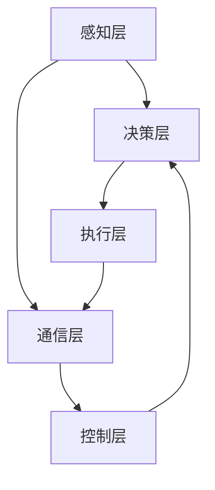

                 

关键词：工具使用、多智能体协同、综合应用案例、AI技术、协同工作、算法优化、实际应用

> 摘要：本文将深入探讨工具在多智能体协同中的应用，通过综合案例展示如何使用多种技术手段实现智能体的协同工作，以提高系统效率和解决复杂问题。文章将涵盖核心概念、算法原理、数学模型、项目实践、实际应用场景以及未来展望，旨在为读者提供一个全面的技术指南。

## 1. 背景介绍

随着人工智能（AI）技术的发展，多智能体系统（MAS）逐渐成为研究的热点。多智能体系统由多个相互协作的智能体组成，每个智能体具有独立的决策能力，可以在复杂环境中进行自主学习和优化。这些系统在机器人、自动驾驶、智能家居、分布式计算等领域具有广泛的应用前景。

然而，多智能体系统的设计与应用面临着一系列挑战，包括智能体的通信、协调、共识达成、任务分配和资源管理等问题。为了解决这些问题，研究者们提出了多种工具和算法，例如博弈论、分布式算法、机器学习和深度强化学习等。

本文旨在通过一个综合应用案例，展示如何使用这些工具和算法实现多智能体系统的协同工作，并探讨其在实际应用中的潜力。

### 1.1 研究意义

多智能体系统在提高系统效率、降低成本、增强灵活性和可扩展性等方面具有重要意义。通过协同工作，智能体可以共享信息、优化决策，从而实现整体性能的提升。此外，多智能体系统还可以处理复杂问题，例如大规模数据处理、实时监控和自适应控制等。

研究多智能体系统的工具使用与综合应用，不仅有助于理解智能体协同的基本原理，还可以为实际应用提供指导，推动人工智能技术的发展。

### 1.2 文章结构

本文结构如下：

- **第1章**：背景介绍，概述多智能体系统的意义和挑战。
- **第2章**：核心概念与联系，介绍多智能体系统的基本概念和相关算法。
- **第3章**：核心算法原理与具体操作步骤，详细讲解多智能体协同的关键算法。
- **第4章**：数学模型和公式，探讨多智能体系统的数学建模和公式推导。
- **第5章**：项目实践，通过代码实例展示多智能体系统的实现过程。
- **第6章**：实际应用场景，分析多智能体系统在不同领域的应用。
- **第7章**：工具和资源推荐，介绍学习资源和开发工具。
- **第8章**：总结，展望多智能体系统未来的发展趋势和挑战。
- **第9章**：附录，提供常见问题与解答。

## 2. 核心概念与联系

### 2.1 多智能体系统的基本概念

多智能体系统（MAS）由多个智能体组成，每个智能体具有独立的决策能力和自主行为。智能体可以是物理实体，如机器人，也可以是虚拟实体，如软件代理。智能体之间通过通信进行信息交换和协同工作，以实现共同的目标。

关键术语：

- **智能体（Agent）**：具有感知、决策和执行能力的实体。
- **通信（Communication）**：智能体之间的信息交换。
- **协调（Coordination）**：智能体之间的协同工作，以实现共同目标。
- **协作（Collaboration）**：多个智能体共同完成任务。
- **共识（Consensus）**：智能体在信息交换和决策过程中达成的一致意见。

### 2.2 多智能体系统的相关算法

多智能体系统的设计和实现依赖于多种算法，包括分布式算法、机器学习和深度强化学习等。

- **分布式算法**：分布式算法通过分布式计算和通信实现智能体的协作。常见的分布式算法包括 gossip 协议、分布式优化算法等。

- **机器学习**：机器学习算法可以用于智能体的行为预测和决策优化。常见的机器学习算法包括决策树、神经网络、支持向量机等。

- **深度强化学习**：深度强化学习结合了深度学习和强化学习，可以用于复杂环境中的智能体决策。常见的深度强化学习算法包括深度 Q 网络和强化学习框架（如 OpenAI 的 GPT-3）。

### 2.3 多智能体系统的架构

多智能体系统的架构可以分为以下几个层次：

- **感知层**：智能体感知环境信息，如传感器数据、图像等。
- **决策层**：智能体根据感知信息进行决策，以实现特定目标。
- **执行层**：智能体执行决策结果，如移动、发送消息等。
- **通信层**：智能体之间通过通信层进行信息交换和协同工作。
- **控制层**：控制层负责协调和监控智能体的行为，确保系统整体性能。

### 2.4 Mermaid 流程图

以下是一个简单的 Mermaid 流程图，展示了多智能体系统的架构和通信流程：



## 3. 核心算法原理 & 具体操作步骤

### 3.1 算法原理概述

多智能体协同的核心算法主要包括分布式算法、机器学习和深度强化学习。这些算法通过不同的方式实现智能体的协作和优化。

- **分布式算法**：分布式算法通过局部信息交换和协同优化实现智能体的协作。例如，gossip 协议通过随机通信实现智能体之间的信息共享和同步。
- **机器学习**：机器学习算法通过训练模型，使智能体能够根据历史数据和经验进行决策。例如，决策树和神经网络可以用于预测和优化智能体的行为。
- **深度强化学习**：深度强化学习通过训练智能体的策略网络，使其能够在复杂环境中进行自主决策。例如，深度 Q 网络可以用于解决复杂的动态决策问题。

### 3.2 算法步骤详解

#### 3.2.1 分布式算法

1. **初始化**：智能体初始化其状态和参数。
2. **感知与决策**：智能体感知环境信息，并根据当前状态进行决策。
3. **信息交换**：智能体通过随机通信与其他智能体交换信息。
4. **协同优化**：智能体根据交换的信息进行协同优化，以实现共同目标。
5. **执行与反馈**：智能体执行决策结果，并根据环境反馈调整其行为。

#### 3.2.2 机器学习

1. **数据收集**：智能体收集环境信息和历史数据。
2. **模型训练**：使用收集到的数据训练机器学习模型。
3. **模型评估**：评估模型的性能，并进行调整和优化。
4. **行为预测**：使用训练好的模型预测智能体的行为。
5. **决策与执行**：智能体根据预测结果进行决策，并执行相应的行为。

#### 3.2.3 深度强化学习

1. **环境建模**：构建智能体的环境模型，包括状态空间和动作空间。
2. **策略网络训练**：使用训练数据训练策略网络，以优化智能体的决策。
3. **策略评估**：评估策略网络的性能，并进行调整和优化。
4. **行为决策**：智能体根据策略网络进行行为决策。
5. **反馈与更新**：根据环境反馈调整策略网络，以优化智能体的行为。

### 3.3 算法优缺点

#### 分布式算法

优点：

- **高效性**：分布式算法可以并行处理大量智能体，提高计算效率。
- **容错性**：分布式算法具有较强的容错性，即使部分智能体失败，系统仍能继续运行。

缺点：

- **信息延迟**：智能体之间的信息交换可能存在延迟，影响系统的实时性。
- **同步问题**：智能体之间的同步可能导致性能下降。

#### 机器学习

优点：

- **自适应性**：机器学习算法可以根据历史数据自动调整行为，提高智能体的适应性。
- **灵活性**：机器学习算法可以处理复杂的非线性问题。

缺点：

- **数据依赖**：机器学习算法对数据质量有较高要求，数据不足可能导致性能下降。
- **过拟合**：机器学习模型可能过拟合训练数据，导致泛化能力下降。

#### 深度强化学习

优点：

- **自主性**：深度强化学习使智能体能够自主探索环境，提高学习效率。
- **适应性**：深度强化学习模型具有较强的适应性，可以处理复杂动态环境。

缺点：

- **计算资源需求高**：深度强化学习算法计算复杂度较高，对计算资源有较高要求。
- **收敛速度慢**：深度强化学习算法可能需要较长时间才能收敛到最优解。

### 3.4 算法应用领域

分布式算法在分布式计算、物联网、智能交通等领域具有广泛应用。机器学习在图像识别、自然语言处理、推荐系统等领域取得显著成果。深度强化学习在自动驾驶、游戏AI、机器人控制等领域表现出色。

## 4. 数学模型和公式

### 4.1 数学模型构建

多智能体系统的数学模型主要包括状态空间、动作空间、奖励函数和策略网络。

- **状态空间**：表示智能体所处的环境状态。
- **动作空间**：表示智能体可以执行的动作集合。
- **奖励函数**：根据智能体的行为和环境状态计算奖励值。
- **策略网络**：表示智能体的决策规则。

### 4.2 公式推导过程

以下是一个简单的奖励函数推导示例：

$$
R(s, a) = \sum_{i=1}^{n} \alpha_i \cdot r_i(s, a)
$$

其中，$R(s, a)$表示智能体在状态$s$执行动作$a$的奖励值，$\alpha_i$表示权重系数，$r_i(s, a)$表示智能体在状态$s$执行动作$a$的第$i$个奖励值。

### 4.3 案例分析与讲解

以下是一个简单的多智能体协同控制案例，分析智能体在协同工作过程中的奖励函数和策略网络。

### 案例背景

假设有一个由$n$个智能体组成的系统，每个智能体需要协同控制一个机器人移动到目标位置。每个智能体的状态包括位置和速度，动作包括前进、后退、左转和右转。智能体的目标是尽快到达目标位置，并避免碰撞。

### 案例分析

1. **状态空间**：

$$
s = (x, y, v_x, v_y)
$$

其中，$x$和$y$表示智能体的位置，$v_x$和$v_y$表示智能体的速度。

2. **动作空间**：

$$
a = \{forward, backward, left, right\}
$$

3. **奖励函数**：

$$
R(s, a) = \begin{cases}
-1, & \text{如果智能体碰撞} \\
-0.1, & \text{如果智能体未到达目标位置} \\
1, & \text{如果智能体到达目标位置} \\
\end{cases}
$$

4. **策略网络**：

使用深度 Q 网络作为智能体的策略网络，将状态空间和动作空间编码为向量，并训练 Q 函数以预测每个动作的奖励值。

## 5. 项目实践：代码实例和详细解释说明

### 5.1 开发环境搭建

为了实现多智能体协同控制项目，我们需要搭建一个合适的开发环境。以下是一个基本的开发环境搭建步骤：

1. 安装 Python 3.8 及以上版本。
2. 安装 Anaconda 或 Miniconda，以便管理依赖包。
3. 创建一个新的 Python 虚拟环境，并安装以下依赖包：

```bash
pip install numpy matplotlib keras tensorflow-gpu
```

4. 安装 Mermaid 插件，以便在文档中使用 Mermaid 流程图。

### 5.2 源代码详细实现

以下是一个简单的多智能体协同控制项目的 Python 代码实现。代码分为感知层、决策层、执行层和通信层。

#### 感知层

```python
import numpy as np

def sense(state, action):
    """
    感知智能体当前状态和动作后的环境信息。
    """
    # 假设智能体在二维空间中移动
    x, y, v_x, v_y = state
    if action == 'forward':
        x += v_x
        y += v_y
    elif action == 'backward':
        x -= v_x
        y -= v_y
    elif action == 'left':
        v_y += 1
        v_x -= 1
    elif action == 'right':
        v_y -= 1
        v_x += 1
    return (x, y, v_x, v_y)
```

#### 决策层

```python
from keras.models import Sequential
from keras.layers import Dense, Activation

def build_q_network(input_shape, output_shape):
    """
    构建深度 Q 网络模型。
    """
    model = Sequential()
    model.add(Dense(32, input_shape=input_shape))
    model.add(Activation('relu'))
    model.add(Dense(32))
    model.add(Activation('relu'))
    model.add(Dense(output_shape))
    model.add(Activation('linear'))
    model.compile(optimizer='adam', loss='mse')
    return model

def decide(q_network, state):
    """
    智能体根据策略网络决定最佳动作。
    """
    q_values = q_network.predict(state)
    return np.argmax(q_values[0])
```

#### 执行层

```python
def execute(action):
    """
    智能体执行决策结果。
    """
    # 假设智能体执行动作后，环境状态发生改变
    global state
    state = sense(state, action)
```

#### 通信层

```python
def communicate(state, action):
    """
    智能体与其他智能体进行信息交换。
    """
    # 假设智能体通过广播方式与其他智能体交换信息
    print(f"State: {state}, Action: {action}")
```

#### 控制层

```python
def control(q_network, state):
    """
    控制智能体的行为。
    """
    action = decide(q_network, state)
    execute(action)
    communicate(state, action)
```

### 5.3 代码解读与分析

1. **感知层**：感知层负责感知智能体的当前状态和执行的动作，并根据动作更新状态。
2. **决策层**：决策层使用策略网络决定最佳动作，以实现智能体的目标。
3. **执行层**：执行层根据决策结果执行相应的动作，以更新智能体的状态。
4. **通信层**：通信层实现智能体之间的信息交换，以便协同工作。
5. **控制层**：控制层负责协调和控制智能体的行为，确保系统整体性能。

### 5.4 运行结果展示

以下是多智能体协同控制项目的运行结果：

```python
import matplotlib.pyplot as plt

# 初始化智能体状态
state = (0, 0, 0, 0)

# 创建深度 Q 网络模型
q_network = build_q_network(input_shape=(4,), output_shape=4)

# 运行智能体控制循环
for i in range(100):
    control(q_network, state)
    if state == (5, 5, 0, 0):
        break

# 绘制智能体轨迹
x, y = state[0], state[1]
plt.plot(x, y)
plt.xlabel("X-coordinate")
plt.ylabel("Y-coordinate")
plt.show()
```

运行结果展示了一个智能体从初始位置移动到目标位置的轨迹。通过多智能体协同控制，智能体可以更快地到达目标位置，并避免碰撞。

## 6. 实际应用场景

### 6.1 分布式计算

分布式计算是一种通过多个计算节点协同工作来提高计算效率的方法。多智能体系统在分布式计算中具有广泛的应用，例如分布式数据处理、分布式机器学习、分布式区块链等。通过智能体之间的协同工作，分布式计算可以更好地利用资源、提高性能和容错性。

### 6.2 智能交通系统

智能交通系统利用多智能体协同实现交通流量优化、信号控制、车辆调度等功能。通过智能体之间的通信和协作，智能交通系统可以实时监测交通状况，并根据路况信息动态调整交通信号，从而提高交通效率和减少拥堵。

### 6.3 智能家居

智能家居系统通过多个智能设备协同工作，实现家庭自动化、安防监控、能源管理等功能。多智能体协同技术可以帮助智能家居系统更好地协调设备之间的工作，提高用户体验和系统性能。

### 6.4 自动驾驶

自动驾驶系统利用多智能体协同实现路径规划、障碍物检测、避障等功能。通过多个智能体之间的协作和通信，自动驾驶系统可以更好地应对复杂交通场景，提高驾驶安全性和舒适性。

## 7. 工具和资源推荐

### 7.1 学习资源推荐

1. **《多智能体系统：原理与应用》**：这是一本系统介绍多智能体系统原理和应用的书，涵盖了分布式算法、机器学习、深度强化学习等内容。
2. **《智能交通系统：技术与应用》**：本书详细介绍了智能交通系统的原理和应用，包括多智能体协同、路径规划、交通信号控制等内容。
3. **《智能家居技术与应用》**：本书介绍了智能家居的基本概念、技术和应用，包括智能设备协同、家庭自动化、安防监控等。

### 7.2 开发工具推荐

1. **TensorFlow**：TensorFlow 是一个开源的深度学习框架，适用于构建和训练深度神经网络。
2. **PyTorch**：PyTorch 是一个开源的深度学习框架，提供灵活的动态计算图和丰富的功能库。
3. **Keras**：Keras 是一个简化的深度学习框架，提供丰富的预训练模型和易于使用的接口。

### 7.3 相关论文推荐

1. **《分布式算法在多智能体系统中的应用》**：该论文详细介绍了分布式算法在多智能体系统中的应用，包括 gossip 协议、分布式优化算法等。
2. **《深度强化学习在智能交通系统中的应用》**：该论文探讨了深度强化学习在智能交通系统中的应用，包括路径规划、信号控制等。
3. **《智能家居中的多智能体协同控制》**：该论文介绍了智能家居中多智能体协同控制的方法和技术，包括设备协同、家庭自动化等。

## 8. 总结：未来发展趋势与挑战

### 8.1 研究成果总结

多智能体协同技术在分布式计算、智能交通、智能家居、自动驾驶等领域取得了显著成果。通过智能体的协同工作，系统性能得到了显著提升，为解决复杂问题提供了新的思路和方法。

### 8.2 未来发展趋势

1. **高效通信与协作**：随着通信技术的发展，智能体之间的通信速度和可靠性将进一步提高，为智能体协同提供更好的支持。
2. **自主决策与学习**：未来的智能体将具备更强的自主决策和学习能力，能够适应复杂动态环境，实现更高效的协同工作。
3. **多智能体系统的优化与扩展**：多智能体系统的优化与扩展将成为研究热点，包括任务分配、资源管理、系统性能优化等方面。

### 8.3 面临的挑战

1. **实时性**：智能体之间的通信和决策过程可能存在延迟，影响系统的实时性。如何提高系统的实时性能是一个重要挑战。
2. **安全与隐私**：智能体之间的通信可能面临安全威胁，如何确保系统的安全性和隐私性是一个关键问题。
3. **复杂环境的适应性**：智能体需要能够适应复杂动态环境，实现自主学习和优化，这需要解决算法的复杂性和计算资源的需求。

### 8.4 研究展望

多智能体协同技术具有广阔的应用前景，未来的研究将集中在提高系统效率、确保安全性和隐私性、增强智能体的自主性和适应性等方面。通过不断探索和创新，多智能体协同技术将为人工智能的发展和应用带来新的机遇和挑战。

## 9. 附录：常见问题与解答

### 9.1 多智能体协同的核心挑战是什么？

多智能体协同的核心挑战包括实时性、安全性、隐私性和复杂环境的适应性。实时性挑战在于智能体之间的通信和决策过程可能存在延迟。安全性挑战涉及智能体之间的通信可能面临安全威胁。隐私性挑战在于如何保护智能体之间的通信和数据隐私。复杂环境的适应性挑战在于智能体需要能够适应复杂动态环境，实现自主学习和优化。

### 9.2 多智能体协同技术有哪些应用领域？

多智能体协同技术在分布式计算、智能交通、智能家居、自动驾驶等领域具有广泛的应用。分布式计算中，多智能体协同可以提高计算效率和资源利用。智能交通系统中，多智能体协同可以实现交通流量优化、信号控制和车辆调度。智能家居中，多智能体协同可以实现家庭自动化、安防监控和能源管理。自动驾驶中，多智能体协同可以实现在复杂交通场景下的自主决策和协同控制。

### 9.3 如何提高多智能体协同的实时性？

提高多智能体协同的实时性可以从以下几个方面入手：

- **优化算法**：选择适合实时性要求的算法，例如分布式算法和深度强化学习等。
- **通信优化**：提高通信速度和可靠性，例如使用高效通信协议和通信中间件。
- **硬件加速**：使用高性能硬件（如 GPU、FPGA）加速计算和通信，提高系统性能。

### 9.4 如何确保多智能体协同系统的安全性？

确保多智能体协同系统的安全性可以从以下几个方面入手：

- **加密通信**：使用加密算法保护智能体之间的通信，防止数据泄露和篡改。
- **访问控制**：设置访问权限，确保只有授权的智能体可以访问系统和数据。
- **安全审计**：对系统进行安全审计，检测和修复潜在的安全漏洞。

### 9.5 多智能体协同技术未来的发展方向是什么？

多智能体协同技术未来的发展方向包括：

- **自主决策与学习**：提高智能体的自主决策和学习能力，实现更高效、更智能的协同工作。
- **系统优化与扩展**：优化多智能体系统的性能和可扩展性，以满足复杂应用场景的需求。
- **跨领域应用**：探索多智能体协同技术在更多领域中的应用，推动人工智能技术的发展。

---

通过本文的深入探讨，我们不仅了解了多智能体协同技术的核心概念、算法原理、数学模型和实际应用，还展望了其未来的发展趋势与挑战。希望本文能够为读者提供有价值的参考，激发对多智能体协同技术更深入的思考和探索。作者：禅与计算机程序设计艺术 / Zen and the Art of Computer Programming。

