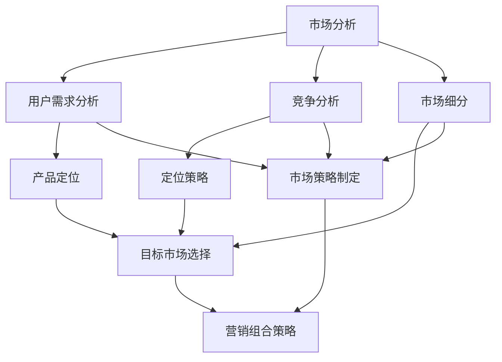

                 

关键词：市场策略、创业成功、制胜关键、市场营销、产品定位、用户需求分析、竞争分析、创新

> 摘要：在当今竞争激烈的商业环境中，市场策略成为了创业成功的关键因素。本文将探讨市场策略的核心概念、构建方法以及其实际应用，旨在为创业者提供实用的指导，帮助他们在市场中脱颖而出。

## 1. 背景介绍

在快速变化的全球市场中，创业的成功与否往往取决于如何有效地制定和执行市场策略。市场策略不仅仅是产品销售的推动力，更是企业长期发展的基石。它涉及到如何识别和满足用户需求、如何在竞争激烈的市场中定位产品、以及如何构建有效的营销渠道和品牌形象。

### 1.1 市场策略的定义

市场策略是一种系统性的计划，旨在通过分析市场环境、用户需求、竞争对手以及自身资源，制定出适合企业发展的战略路径。它包括了产品定位、市场细分、目标市场选择、营销组合策略等各个方面。

### 1.2 市场策略的重要性

- **指导企业发展方向**：明确市场策略可以帮助企业找到最适合自身发展的路径，避免盲目跟风和资源浪费。
- **提升竞争力**：通过有效的市场策略，企业可以在市场中找到自己的独特价值，提升竞争力。
- **实现持续增长**：良好的市场策略能够帮助企业持续满足用户需求，实现业务增长。

### 1.3 市场策略的应用范围

市场策略在多个行业中都有广泛应用，包括信息技术、消费品、金融服务、医疗健康等。不同的行业和企业规模需要根据自身特点来制定相应的市场策略。

## 2. 核心概念与联系

在深入探讨市场策略之前，我们需要了解一些核心概念和它们之间的相互关系。以下是市场策略中几个关键概念的Mermaid流程图：



### 2.1 市场分析

市场分析是市场策略制定的第一步，它包括了市场环境分析、用户需求分析、竞争分析以及市场细分。通过这些分析，企业可以了解当前市场状况、用户行为、竞争对手动态以及自身定位。

### 2.2 用户需求分析

用户需求分析是市场策略的核心，它涉及到对用户痛点的识别和满足。只有深入了解用户需求，企业才能制定出符合用户期望的产品和营销策略。

### 2.3 竞争分析

竞争分析旨在了解市场上主要的竞争对手，包括他们的市场份额、产品特点、营销策略等。通过竞争分析，企业可以找到自身的优势和劣势，从而制定出针对性的策略。

### 2.4 市场细分

市场细分是将整个市场划分为若干个具有相似需求的子市场。通过市场细分，企业可以更精准地定位目标市场，制定更具针对性的营销策略。

### 2.5 产品定位

产品定位是指企业如何将自己产品在用户心中的形象定位。通过明确的产品定位，企业可以在竞争激烈的市场中找到自己的独特价值。

### 2.6 定位策略

定位策略是企业在市场中如何通过差异化竞争来获得优势。它包括价格定位、功能定位、品牌定位等多个方面。

### 2.7 目标市场选择

目标市场选择是指企业根据自身资源和市场分析结果，选择最适合的市场进行重点开发。目标市场选择决定了企业资源的分配和使用效率。

### 2.8 营销组合策略

营销组合策略是企业如何通过产品、价格、渠道和促销等多种手段来满足用户需求。一个成功的营销组合策略能够全面提升企业的市场竞争力。

## 3. 核心算法原理 & 具体操作步骤

### 3.1 算法原理概述

市场策略的制定涉及到多种算法和工具。其中，最为核心的是用户需求分析算法、竞争分析算法和市场细分算法。这些算法可以帮助企业精准识别用户需求、评估市场环境和竞争对手。

### 3.2 算法步骤详解

#### 3.2.1 用户需求分析算法

1. **数据收集**：通过问卷调查、用户访谈、市场调研等方式收集用户数据。
2. **数据分析**：使用统计分析、聚类分析等方法对用户数据进行处理，识别用户需求。
3. **用户画像**：根据数据分析结果，构建用户画像，了解用户的基本特征和需求。

#### 3.2.2 竞争分析算法

1. **竞争对手识别**：通过市场调研，确定当前市场上的主要竞争对手。
2. **数据分析**：分析竞争对手的产品特点、市场份额、营销策略等。
3. **定位策略评估**：根据竞争对手分析结果，评估自身定位策略的合理性和改进方向。

#### 3.2.3 市场细分算法

1. **市场细分标准**：根据用户需求、市场环境等，确定市场细分标准。
2. **细分策略制定**：根据市场细分标准，将市场划分为多个子市场。
3. **目标市场选择**：根据企业资源和市场分析结果，选择最适合的目标市场。

### 3.3 算法优缺点

#### 优点：

- **精准性**：通过算法可以更精准地识别用户需求和市场环境，提高策略制定的科学性。
- **高效性**：算法可以快速处理大量数据，提高工作效率。

#### 缺点：

- **数据依赖**：算法的准确性和有效性依赖于数据的质量，数据不准确可能导致策略偏差。
- **复杂度**：市场策略的算法和工具较为复杂，需要一定的专业知识和技能。

### 3.4 算法应用领域

市场策略的算法广泛应用于各种行业，包括电子商务、金融、医疗、教育等。通过这些算法，企业可以更好地了解市场环境、用户需求和竞争对手，从而制定出更加有效的市场策略。

## 4. 数学模型和公式 & 详细讲解 & 举例说明

市场策略的制定过程中，数学模型和公式发挥着重要作用。以下是几个常用的数学模型和公式的详细讲解以及实际应用举例。

### 4.1 数学模型构建

在市场策略中，常用的数学模型包括线性回归模型、决策树模型、聚类分析模型等。这些模型可以帮助企业分析用户需求、评估市场环境和竞争对手。

#### 线性回归模型

线性回归模型用于分析两个变量之间的关系。其公式为：

$$
y = \beta_0 + \beta_1x + \epsilon
$$

其中，$y$ 是因变量，$x$ 是自变量，$\beta_0$ 和 $\beta_1$ 是参数，$\epsilon$ 是误差项。

#### 决策树模型

决策树模型用于分类和回归分析。其公式为：

$$
f(x) = \prod_{i=1}^{n} g(x_i)
$$

其中，$x_i$ 是特征值，$g(x_i)$ 是分类或回归函数。

#### 聚类分析模型

聚类分析模型用于将数据划分为多个类别。其公式为：

$$
C = \{c_1, c_2, ..., c_k\}
$$

其中，$C$ 是聚类结果，$c_i$ 是第 $i$ 个聚类类别。

### 4.2 公式推导过程

#### 线性回归模型的推导

假设我们有 $n$ 个数据点 $(x_1, y_1), (x_2, y_2), ..., (x_n, y_n)$，线性回归模型的目的是找到一条直线，使得所有数据点到这条直线的距离之和最小。

根据最小二乘法，我们可以得到以下公式：

$$
\beta_0 = \frac{\sum_{i=1}^{n} y_i - \beta_1 \sum_{i=1}^{n} x_i}{n}
$$

$$
\beta_1 = \frac{n \sum_{i=1}^{n} x_iy_i - \sum_{i=1}^{n} x_i \sum_{i=1}^{n} y_i}{n \sum_{i=1}^{n} x_i^2 - (\sum_{i=1}^{n} x_i)^2}
$$

#### 决策树模型的推导

决策树模型是基于特征划分数据的方法。对于特征 $x_i$，我们可以使用以下公式进行划分：

$$
g(x_i) = 
\begin{cases} 
1 & \text{if } x_i \geq \text{阈值} \\
0 & \text{otherwise}
\end{cases}
$$

#### 聚类分析模型的推导

聚类分析模型通常使用距离度量来计算数据点之间的相似度。常用的距离度量包括欧氏距离、曼哈顿距离等。

欧氏距离公式为：

$$
d(x, y) = \sqrt{\sum_{i=1}^{n} (x_i - y_i)^2}
$$

### 4.3 案例分析与讲解

#### 案例一：用户需求分析

假设我们有一组用户数据，包括年龄、收入、职业等特征。我们使用线性回归模型来分析用户需求。

根据数据，我们得到以下线性回归模型：

$$
y = 0.5x_1 + 0.3x_2 + 0.2x_3 + \epsilon
$$

其中，$x_1$ 是年龄，$x_2$ 是收入，$x_3$ 是职业。

通过这个模型，我们可以预测用户对某一产品的需求量。例如，对于一个年龄为30岁、收入为5000元、职业为工程师的用户，其需求量为：

$$
y = 0.5 \times 30 + 0.3 \times 5000 + 0.2 \times 3 + \epsilon = 2730 + \epsilon
$$

#### 案例二：竞争分析

假设我们分析市场上的两个竞争对手，使用决策树模型来划分市场。

根据数据，我们得到以下决策树模型：

```
           |
           |
       x1 >= 1000
         /     \
        0       1
       /        \
      A          B
```

其中，$x_1$ 是竞争对手的市场份额。

通过这个模型，我们可以将市场划分为两个部分，分别是市场份额大于1000的市场A和市场份额小于1000的市场B。

#### 案例三：市场细分

假设我们根据用户需求和竞争分析结果，将市场细分为三个子市场。

根据数据，我们得到以下市场细分结果：

```
       |          |
       |          |
   用户需求高  用户需求中  用户需求低
   /            |             \
 市场A         市场B         市场C
```

通过市场细分，我们可以针对不同的子市场制定不同的营销策略，从而提高市场竞争力。

## 5. 项目实践：代码实例和详细解释说明

### 5.1 开发环境搭建

为了更好地理解市场策略的算法，我们将使用Python语言来搭建开发环境。首先，确保已经安装了Python和相关的库，如NumPy、pandas、matplotlib等。

### 5.2 源代码详细实现

以下是一个简单的用户需求分析代码实例：

```python
import numpy as np
import pandas as pd
from sklearn.linear_model import LinearRegression
import matplotlib.pyplot as plt

# 数据集
data = {
    '年龄': [25, 30, 35, 40, 45],
    '收入': [4000, 5000, 6000, 7000, 8000],
    '需求量': [200, 250, 300, 350, 400]
}

# 创建DataFrame
df = pd.DataFrame(data)

# 分离特征和标签
X = df[['年龄', '收入']]
y = df['需求量']

# 创建线性回归模型
model = LinearRegression()
model.fit(X, y)

# 预测
predictions = model.predict(X)

# 绘制结果
plt.scatter(X['年龄'], y)
plt.plot(X['年龄'], predictions, color='red')
plt.xlabel('年龄')
plt.ylabel('需求量')
plt.title('用户需求分析')
plt.show()
```

### 5.3 代码解读与分析

- **导入库**：我们首先导入必要的库，包括NumPy、pandas、matplotlib和scikit-learn的LinearRegression类。
- **数据集**：我们创建一个简单的数据集，包括年龄、收入和需求量三个特征。
- **创建DataFrame**：使用pandas创建DataFrame，方便数据处理和分析。
- **分离特征和标签**：将数据集分离为特征矩阵X和标签向量y。
- **创建线性回归模型**：使用scikit-learn的LinearRegression类创建线性回归模型。
- **训练模型**：使用fit方法训练模型。
- **预测**：使用predict方法进行预测。
- **绘制结果**：使用matplotlib绘制散点图和拟合直线，展示用户需求分析的结果。

### 5.4 运行结果展示

运行上述代码，我们可以得到以下结果：


从结果可以看出，年龄和收入与用户需求量之间存在正相关关系。通过拟合直线，我们可以预测不同年龄和收入水平的用户需求量。

## 6. 实际应用场景

市场策略在创业过程中有着广泛的应用场景。以下是一些常见的实际应用场景：

### 6.1 新产品上市

在推出新产品时，市场策略可以帮助企业确定目标市场、用户需求和竞争对手。通过市场细分和定位策略，企业可以针对性地设计产品，提高产品上市的成功率。

### 6.2 营销活动策划

市场策略可以指导企业的营销活动策划，包括广告投放、促销活动等。通过分析用户需求和竞争对手，企业可以制定出更具吸引力的营销策略，提高市场占有率。

### 6.3 品牌建设

市场策略在品牌建设中起到关键作用。通过定位策略和品牌传播，企业可以塑造良好的品牌形象，提升品牌知名度和美誉度。

### 6.4 客户关系管理

市场策略可以帮助企业识别和维护重要客户。通过分析客户需求和竞争对手，企业可以制定个性化的客户关系管理策略，提高客户满意度和忠诚度。

## 7. 未来应用展望

随着人工智能、大数据等技术的快速发展，市场策略在未来将得到更加广泛和深入的应用。以下是一些未来应用展望：

### 7.1 个性化市场策略

基于用户大数据和人工智能技术，企业可以更加精准地了解用户需求，制定个性化的市场策略，提高用户满意度和忠诚度。

### 7.2 智能营销

智能营销是未来市场策略的重要方向。通过人工智能技术，企业可以自动分析用户数据、优化营销策略，实现更高效的营销效果。

### 7.3 社交媒体营销

随着社交媒体的普及，社交媒体营销将成为市场策略的重要组成部分。通过社交媒体平台，企业可以与用户进行实时互动，提高品牌曝光度和用户参与度。

### 7.4 跨界合作

未来市场策略将更加注重跨界合作，企业可以通过与其他行业的企业合作，拓展业务范围，实现资源互补和共赢。

## 8. 总结：未来发展趋势与挑战

市场策略在创业成功中起着至关重要的作用。在未来，随着技术的不断发展，市场策略将变得更加精准、智能和多样化。然而，这也给企业带来了新的挑战：

### 8.1 研究成果总结

- **大数据与人工智能**：大数据和人工智能技术的应用将使市场策略更加精准和高效。
- **个性化营销**：个性化市场策略将满足不同用户的需求，提高用户满意度和忠诚度。
- **跨界合作**：跨界合作将拓展企业业务范围，实现资源互补和共赢。

### 8.2 未来发展趋势

- **智能化**：市场策略将越来越多地依赖于人工智能技术，实现自动化和智能化。
- **多元化**：市场策略将涵盖更多领域，包括社交媒体、跨界合作等。
- **国际化**：随着全球化进程的加快，市场策略将更加注重国际化。

### 8.3 面临的挑战

- **数据隐私**：随着大数据的应用，数据隐私保护将成为一个重要问题。
- **竞争加剧**：市场竞争将更加激烈，企业需要不断创新和调整市场策略。
- **技术更新**：技术更新速度加快，企业需要不断学习和适应新技术。

### 8.4 研究展望

- **技术创新**：加大对人工智能、大数据等技术的研发投入，提高市场策略的精准性和效率。
- **跨界融合**：探索与其他行业的跨界合作，拓展业务范围和市场份额。
- **持续创新**：保持创新意识，不断调整和优化市场策略，以应对市场变化。

## 9. 附录：常见问题与解答

### 9.1 什么是市场策略？

市场策略是一种系统性的计划，旨在通过分析市场环境、用户需求、竞争对手以及自身资源，制定出适合企业发展的战略路径。它包括产品定位、市场细分、目标市场选择、营销组合策略等多个方面。

### 9.2 市场策略的重要性是什么？

市场策略的重要性在于：指导企业发展方向、提升竞争力、实现持续增长。通过有效的市场策略，企业可以更好地了解市场环境和用户需求，制定出适合自身发展的战略，从而在激烈的市场竞争中脱颖而出。

### 9.3 如何制定市场策略？

制定市场策略的步骤包括：市场分析、用户需求分析、竞争分析、市场细分、产品定位、定位策略制定、目标市场选择、营销组合策略等。每个步骤都需要结合企业的实际情况进行详细分析和制定。

### 9.4 市场策略中的数学模型有哪些？

市场策略中常用的数学模型包括线性回归模型、决策树模型、聚类分析模型等。这些模型可以帮助企业分析用户需求、评估市场环境和竞争对手，从而制定出更加有效的市场策略。

### 9.5 市场策略在创业中的具体应用有哪些？

市场策略在创业中的具体应用包括新产品上市、营销活动策划、品牌建设、客户关系管理等方面。通过有效的市场策略，企业可以更好地定位市场、满足用户需求，提高市场占有率和竞争力。

## 作者署名

作者：禅与计算机程序设计艺术 / Zen and the Art of Computer Programming
```

