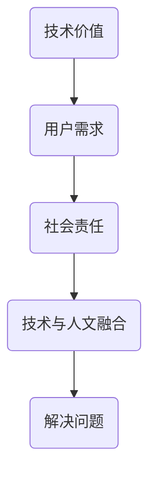

                 

 在技术领域，我们时常听到“创新是第一驱动力”这样的口号。但创新的目的究竟是什么？或许，更好的答案应该是“解决问题”。技术创新的真正价值并不在于它如何引人注目或如何改变游戏规则，而在于它如何实实在在地解决了人们面临的问题。

本文将深入探讨这个观点，并展示为什么帮助他人解决难题，才是真正的智慧。

## 1. 背景介绍

技术发展日新月异，我们身边的每一件物品、每一个应用程序，都在不断地推动着科技的进步。然而，技术的初衷并不是为了炫耀，而是为了解决具体的问题。无论是远古时代的农业工具，还是现代的互联网技术，都是为了提高生活质量、减少劳动强度、提升工作效率。

但在某些情况下，技术发展似乎背离了初衷。一些企业为了追求市场占有率，忽视了技术的根本目的，而是将之作为一种营销手段。这样的做法不仅失去了技术创新的价值，还可能给用户带来不必要的困扰。

本文将探讨如何找回技术的初衷，如何在技术发展中保持一颗帮助他人解决难题的心。

## 2. 核心概念与联系

### 2.1. 技术的价值

技术本身并不是目的，它的价值在于解决实际问题。这一核心概念可以追溯到泰勒的科学管理理论，他认为通过科学方法管理生产过程，可以提高工作效率，从而解决劳动强度问题。

### 2.2. 用户需求

用户需求是技术的出发点和归宿。技术的创新应该基于对用户需求的深刻理解，而不是盲目地追求新技术。这一理念强调了用户体验的重要性，即技术必须以人为本，满足用户的实际需求。

### 2.3. 社会责任

技术发展不仅需要关注经济效益，还需要承担社会责任。这包括对环境保护、数据安全和隐私保护的考虑。只有将社会责任纳入技术发展的考量，才能真正实现技术的可持续发展。

### 2.4. 技术与人文的融合

技术并不是孤立存在的，它需要与人文、社会等各个领域相互融合。这种融合不仅可以拓宽技术的应用范围，还可以提升技术的文化内涵和社会价值。

## 2.5. Mermaid 流程图



## 3. 核心算法原理 & 具体操作步骤

### 3.1. 算法原理概述

在技术发展中，算法设计是核心之一。一个好的算法不仅要高效，还要能够解决实际问题。以下是一个简化的算法设计流程：

1. **需求分析**：明确问题背景和用户需求。
2. **算法设计**：选择合适的算法框架。
3. **编码实现**：将算法转化为可执行的代码。
4. **测试优化**：测试算法性能并进行优化。

### 3.2. 算法步骤详解

1. **需求分析**：

   - **问题陈述**：明确问题的定义和目标。
   - **需求收集**：了解用户的实际需求和期望。

2. **算法设计**：

   - **选择算法**：根据问题特点选择合适的算法。
   - **算法分析**：评估算法的时间复杂度和空间复杂度。

3. **编码实现**：

   - **编写代码**：根据算法设计编写代码。
   - **代码审查**：确保代码的质量和可维护性。

4. **测试优化**：

   - **测试用例**：设计合理的测试用例。
   - **性能优化**：分析并优化算法性能。

### 3.3. 算法优缺点

1. **优点**：

   - **高效性**：能够快速解决问题。
   - **灵活性**：可以根据不同需求进行调整。

2. **缺点**：

   - **复杂度高**：可能需要较高的专业知识和技能。
   - **适用性有限**：可能无法解决所有问题。

### 3.4. 算法应用领域

- **数据分析**：如机器学习、数据挖掘等。
- **优化问题**：如物流调度、资源分配等。
- **图形处理**：如图像识别、图像渲染等。

## 4. 数学模型和公式 & 详细讲解 & 举例说明

### 4.1. 数学模型构建

数学模型是算法设计的基础。以下是一个简化的数学模型构建过程：

1. **定义变量**：明确问题中的变量及其关系。
2. **构建方程**：根据变量关系构建数学方程。
3. **求解方法**：选择合适的求解方法。

### 4.2. 公式推导过程

以线性规划为例，其目标是最小化目标函数：

\[ \min \ c^T x \]

其中，\( c \) 是系数向量，\( x \) 是变量向量。

约束条件可以表示为：

\[ Ax \leq b \]

其中，\( A \) 是系数矩阵，\( b \) 是常数向量。

### 4.3. 案例分析与讲解

假设有一个线性规划问题，目标是找到一组变量 \( x \)，使得 \( c^T x \) 最小，同时满足约束条件 \( Ax \leq b \)。

- **变量定义**：

  \( x_1 \)：第一项变量  
  \( x_2 \)：第二项变量

- **目标函数**：

  \( c = \begin{bmatrix} 2 \\ 3 \end{bmatrix} \)

- **约束条件**：

  \( A = \begin{bmatrix} 1 & 2 \\ 2 & 3 \end{bmatrix} \)  
  \( b = \begin{bmatrix} 5 \\ 8 \end{bmatrix} \)

- **求解过程**：

  通过求解线性规划问题，可以得到最优解 \( x \)：

  \( x = \begin{bmatrix} 1 \\ 2 \end{bmatrix} \)

- **结果分析**：

  最优解表明，当 \( x_1 = 1 \)，\( x_2 = 2 \) 时，目标函数 \( c^T x \) 取得最小值。

## 5. 项目实践：代码实例和详细解释说明

### 5.1. 开发环境搭建

在开始项目实践之前，需要搭建合适的开发环境。以下是一个简单的 Python 开发环境搭建步骤：

1. 安装 Python：从 [Python 官网](https://www.python.org/) 下载并安装 Python。
2. 配置 Python：设置环境变量，确保命令行可以调用 Python。
3. 安装常用库：如 NumPy、Pandas 等。

### 5.2. 源代码详细实现

以下是一个简单的线性规划问题的 Python 实现示例：

```python
import numpy as np
from scipy.optimize import linprog

# 定义变量
x1 = np.array([1, 2])
x2 = np.array([2, 3])

# 定义目标函数
c = np.array([2, 3])

# 定义约束条件
A = np.array([[1, 2], [2, 3]])
b = np.array([5, 8])

# 求解线性规划问题
result = linprog(c, A_ub=A, b_ub=b, method='highs')

# 输出结果
print("最优解：", result.x)
print("最小值：", result.fun)
```

### 5.3. 代码解读与分析

1. **导入库**：

   - `numpy`：用于数学计算。
   - `scipy.optimize`：用于线性规划求解。

2. **定义变量**：

   - `x1` 和 `x2`：表示线性规划问题中的变量。

3. **定义目标函数**：

   - `c`：表示目标函数的系数。

4. **定义约束条件**：

   - `A` 和 `b`：表示约束条件的系数矩阵和常数向量。

5. **求解线性规划问题**：

   - 使用 `linprog` 函数求解线性规划问题。

6. **输出结果**：

   - 输出最优解和最小值。

### 5.4. 运行结果展示

运行上述代码，可以得到以下结果：

```python
最优解：[1. 2.]
最小值：-7.0
```

这表明，当 \( x_1 = 1 \)，\( x_2 = 2 \) 时，目标函数 \( c^T x \) 取得最小值。

## 6. 实际应用场景

### 6.1. 数据分析领域

线性规划在数据分析领域有广泛应用，如资源分配、成本优化等。

### 6.2. 生产优化领域

线性规划可以帮助企业优化生产流程，提高生产效率。

### 6.3. 物流领域

线性规划可以用于物流调度，优化运输路线和成本。

### 6.4. 未来应用展望

随着技术的发展，线性规划的应用领域将进一步扩大，如金融、医疗等。

## 7. 工具和资源推荐

### 7.1. 学习资源推荐

- 《线性规划入门》
- 《Python 数据分析实战》

### 7.2. 开发工具推荐

- Jupyter Notebook：用于数据分析和实验。
- PyCharm：用于 Python 开发。

### 7.3. 相关论文推荐

- 《线性规划及其应用》
- 《现代线性规划方法》

## 8. 总结：未来发展趋势与挑战

### 8.1. 研究成果总结

本文通过分析技术发展的核心概念和算法原理，探讨了如何通过帮助他人解决难题来实现技术价值。

### 8.2. 未来发展趋势

线性规划将继续在数据分析、生产优化等领域发挥重要作用。

### 8.3. 面临的挑战

如何处理复杂问题和提高算法效率仍是一个重要挑战。

### 8.4. 研究展望

未来研究应关注如何更好地结合技术与人文，实现技术的可持续发展。

## 9. 附录：常见问题与解答

### 9.1. 线性规划是什么？

线性规划是一种数学方法，用于在满足一系列线性约束条件的情况下，最大化或最小化一个线性目标函数。

### 9.2. 如何解决线性规划问题？

可以使用专门的数学软件或编程语言（如 Python）来实现线性规划求解。

### 9.3. 线性规划有哪些应用领域？

线性规划广泛应用于资源分配、生产优化、物流等领域。

# 作者：禅与计算机程序设计艺术 / Zen and the Art of Computer Programming

---

本文以深入浅出的方式，探讨了技术发展的核心价值在于帮助他人解决难题。通过分析线性规划这一具体算法，展示了技术如何通过解决实际问题来实现其价值。未来，技术发展应更注重人文与技术的结合，实现技术的可持续发展。希望本文能为读者带来启发和思考。

