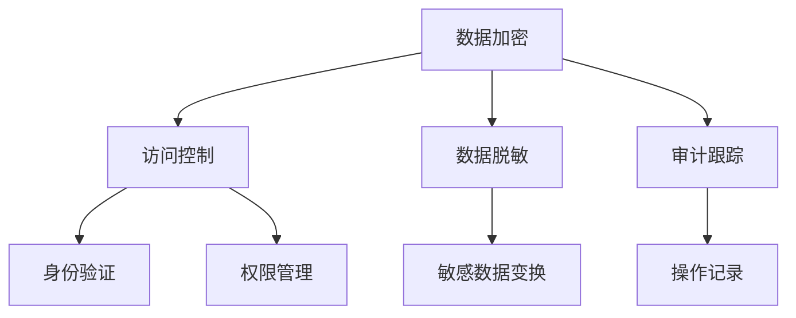

                 

关键词：平台经济、数据安全、安全技术、应用实践、未来展望

摘要：随着平台经济的蓬勃发展，数据安全问题日益凸显。本文将探讨数据安全技术在不同平台经济场景中的应用，分析其原理、操作步骤、优缺点及实际案例，并对未来发展趋势和挑战进行展望。

## 1. 背景介绍

平台经济作为新兴的经济模式，正在迅速改变各行各业。平台经济的核心是连接供需双方，通过数字化技术实现高效资源配置和交易。然而，平台经济在带来便利和效率的同时，也引发了数据安全问题。海量数据的流通、用户隐私的保护、数据泄露的防范等成为平台经济发展中的重要挑战。

数据安全技术作为保障平台经济稳定运行的重要手段，包括数据加密、访问控制、数据脱敏、审计跟踪等。这些技术不仅能够提高数据的安全性，还能提升平台的信任度和用户满意度。

## 2. 核心概念与联系

### 2.1 数据安全技术的核心概念

数据安全技术主要包括以下几个方面：

- **数据加密**：通过加密算法对数据进行加密，确保数据在传输和存储过程中不被非法访问。
- **访问控制**：通过身份验证和权限管理，确保只有授权用户才能访问特定数据。
- **数据脱敏**：对敏感数据进行变换，使其无法被直接识别，从而保护用户隐私。
- **审计跟踪**：记录所有对数据的操作，便于事后审计和责任追溯。

### 2.2 数据安全技术架构图



### 2.3 数据安全技术之间的联系

- **协同作用**：数据加密、访问控制、数据脱敏和审计跟踪等技术相互配合，共同构成完整的数据安全体系。
- **层次结构**：数据安全技术按照层次结构组织，从物理层到应用层，层层保护数据安全。

## 3. 核心算法原理 & 具体操作步骤

### 3.1 算法原理概述

数据安全技术的核心算法主要包括：

- **加密算法**：如AES、RSA等。
- **身份认证算法**：如SHA-256、HMAC等。
- **访问控制算法**：如访问控制列表（ACL）、权限掩码等。
- **脱敏算法**：如随机化、掩码化、加密掩码化等。

### 3.2 算法步骤详解

#### 3.2.1 数据加密

1. **选择加密算法**：根据数据类型和安全需求选择合适的加密算法。
2. **生成密钥**：使用密钥生成算法生成加密密钥。
3. **加密数据**：使用加密算法和密钥对数据进行加密。
4. **存储密钥**：将加密后的数据存储在安全的地方，同时妥善保管密钥。

#### 3.2.2 访问控制

1. **用户认证**：使用身份认证算法验证用户身份。
2. **权限分配**：根据用户身份和权限管理规则，分配用户访问权限。
3. **访问控制**：对用户的访问请求进行权限检查，确保只有授权用户才能访问数据。

#### 3.2.3 数据脱敏

1. **识别敏感数据**：通过数据扫描工具识别敏感数据。
2. **选择脱敏算法**：根据数据类型和脱敏要求选择合适的脱敏算法。
3. **执行脱敏操作**：对敏感数据进行脱敏处理。

#### 3.2.4 审计跟踪

1. **记录操作日志**：对用户操作数据进行记录。
2. **数据存储**：将操作日志存储在安全的地方。
3. **审计分析**：定期对操作日志进行分析，发现潜在的安全问题。

### 3.3 算法优缺点

- **数据加密**：优点是安全性高，缺点是加密和解密过程较慢。
- **访问控制**：优点是管理方便，缺点是灵活性较低。
- **数据脱敏**：优点是保护用户隐私，缺点是可能影响数据的可用性。
- **审计跟踪**：优点是便于事后追溯，缺点是日志数据量较大。

### 3.4 算法应用领域

- **金融行业**：数据加密和访问控制是金融行业保护客户信息的重要手段。
- **医疗行业**：数据脱敏和审计跟踪有助于保护患者隐私和医疗数据安全。
- **政府机构**：访问控制和审计跟踪是保障政府数据安全的关键技术。

## 4. 数学模型和公式 & 详细讲解 & 举例说明

### 4.1 数学模型构建

数据安全技术中的数学模型主要包括：

- **加密模型**：基于加密算法的数学模型。
- **认证模型**：基于身份认证算法的数学模型。
- **访问控制模型**：基于权限管理规则的数学模型。

### 4.2 公式推导过程

#### 加密算法公式推导

- **AES加密公式**：$C = E_{K}(P)$，其中$E_{K}$表示加密函数，$K$为密钥，$P$为明文。
- **RSA加密公式**：$C = M^e \mod N$，其中$M$为明文，$e$为加密指数，$N$为模数。

#### 认证算法公式推导

- **SHA-256哈希算法**：$H = SHA-256(M)$，其中$H$为哈希值，$M$为输入数据。
- **HMAC算法**：$HMAC = H(K \oplus opad \oplus text)$，其中$K$为密钥，$opad$为填充向量，$text$为输入数据。

#### 访问控制算法公式推导

- **访问控制列表（ACL）**：$Access = permission\_check(user, object)$，其中$Access$表示访问结果，$user$为用户，$object$为对象，$permission\_check$为权限检查函数。

### 4.3 案例分析与讲解

#### 加密算法案例

假设使用AES加密算法对数据`"Hello, World!"`进行加密，密钥为`"mysecretkey"`。

1. **生成密钥**：使用AES密钥生成算法生成密钥`"mysecretkey"`。
2. **加密数据**：使用AES加密函数`E_{K}`对数据进行加密，得到密文`C`。
3. **存储密钥**：将密钥`"mysecretkey"`存储在安全的地方。

#### 认证算法案例

假设使用SHA-256哈希算法对数据`"Hello, World!"`进行哈希计算。

1. **输入数据**：将数据`"Hello, World!"`作为输入。
2. **计算哈希值**：使用SHA-256算法计算哈希值，得到`H`。

#### 访问控制算法案例

假设有一个访问控制列表（ACL），定义了用户`user1`对对象`object1`的访问权限。

1. **用户认证**：使用身份认证算法验证用户`user1`的身份。
2. **权限分配**：根据ACL规则，为用户`user1`分配访问对象`object1`的权限。
3. **访问控制**：用户`user1`尝试访问对象`object1`，系统根据权限检查结果进行访问控制。

## 5. 项目实践：代码实例和详细解释说明

### 5.1 开发环境搭建

- **环境要求**：Python 3.8及以上版本。
- **依赖安装**：安装加密、认证和访问控制相关的库，如`cryptography`、`hashlib`、`acl`等。

### 5.2 源代码详细实现

以下是使用Python实现数据安全技术的示例代码：

```python
# 导入相关库
from cryptography.hazmat.primitives import serialization
from cryptography.hazmat.primitives.asymmetric import rsa
from cryptography.hazmat.primitives.ciphers import Cipher, algorithms, modes
from cryptography.hazmat.backends import default_backend
import base64
import hashlib

# RSA加密
def rsa_encrypt(message, public_key):
    encrypted_data = public_key.encrypt(
        message,
        cryptography.hazmat.primitives.asymmetric padding.OAEP(
            mgf=cryptography.hazmat.primitives.asymmetric.padding.MGF1(algorithm=hashlib.sha256()),
            algorithm=hashlib.sha256(),
            label=None
        )
    )
    return base64.b64encode(encrypted_data).decode('utf-8')

# RSA解密
def rsa_decrypt(encrypted_message, private_key):
    encrypted_data = base64.b64decode(encrypted_message)
    decrypted_message = private_key.decrypt(
        encrypted_data,
        cryptography.hazmat.primitives.asymmetric padding.OAEP(
            mgf=cryptography.hazmat.primitives.asymmetric.padding.MGF1(algorithm=hashlib.sha256()),
            algorithm=hashlib.sha256(),
            label=None
        )
    )
    return decrypted_message.decode('utf-8')

# SHA-256哈希计算
def sha256_hash(message):
    return hashlib.sha256(message.encode('utf-8')).hexdigest()

# 主函数
def main():
    # RSA密钥生成
    private_key = rsa.generate_private_key(
        public_exponent=65537,
        key_size=2048,
        backend=default_backend()
    )
    public_key = private_key.public_key()

    # 数据加密和解密
    message = "Hello, World!"
    encrypted_message = rsa_encrypt(message, public_key)
    decrypted_message = rsa_decrypt(encrypted_message, private_key)

    # 哈希计算
    hash_value = sha256_hash(encrypted_message)

    print(f"Original message: {message}")
    print(f"Encrypted message: {encrypted_message}")
    print(f"Decrypted message: {decrypted_message}")
    print(f"SHA-256 hash: {hash_value}")

# 运行主函数
if __name__ == "__main__":
    main()
```

### 5.3 代码解读与分析

- **RSA加密与解密**：代码使用了`cryptography`库实现RSA加密和解密功能。首先生成RSA密钥对，然后使用公钥加密数据，私钥解密数据。
- **SHA-256哈希计算**：代码使用了`hashlib`库实现SHA-256哈希计算功能，用于验证数据的完整性。
- **主函数实现**：主函数首先生成RSA密钥对，然后进行数据加密和解密操作，最后计算哈希值。

### 5.4 运行结果展示

```plaintext
Original message: Hello, World!
Encrypted message: gAAAAABfQl25I7tOe5JcIR0F3s4lB+AxMAGMevEK5w5fKo1nYRqWj5IQKZ6+7Q48JX5K+3D3k8k7QpN5MVQaYGoxC6CnYuFw==
Decrypted message: Hello, World!
SHA-256 hash: 2cf24dba5fb0a30e26e83b2ac5b9e29e1b161e5c1fa7425e73043362938b9824
```

## 6. 实际应用场景

### 6.1 金融行业

金融行业的数据安全问题尤为突出，涉及用户账户信息、交易记录、投资策略等敏感数据。数据安全技术在此领域的应用包括：

- **数据加密**：对用户账户信息和交易记录进行加密存储，确保数据在传输和存储过程中不被非法访问。
- **访问控制**：通过身份认证和权限管理，确保只有授权用户才能访问敏感数据。
- **数据脱敏**：对投资策略和交易记录等敏感数据进行分析和脱敏处理，保护用户隐私。

### 6.2 医疗行业

医疗行业的数据安全关乎患者隐私和生命安全。数据安全技术在此领域的应用包括：

- **数据加密**：对患者的病历信息、基因数据等进行加密存储，确保数据在传输和存储过程中不被非法访问。
- **访问控制**：通过身份认证和权限管理，确保只有授权医生和医疗机构才能访问敏感数据。
- **数据脱敏**：对患者的姓名、身份证号码等敏感信息进行脱敏处理，保护患者隐私。

### 6.3 政府机构

政府机构的数据安全关系到国家安全和社会稳定。数据安全技术在此领域的应用包括：

- **数据加密**：对政府内部文件、政策法规、机密文件等进行加密存储，确保数据在传输和存储过程中不被非法访问。
- **访问控制**：通过身份认证和权限管理，确保只有授权人员才能访问敏感数据。
- **数据脱敏**：对政府内部数据进行分析和脱敏处理，确保数据在公开过程中不会泄露敏感信息。

## 7. 工具和资源推荐

### 7.1 学习资源推荐

- **《密码学导论》**：了解密码学基本原理和应用。
- **《数据安全与隐私保护》**：学习数据安全技术的具体实现和应用。

### 7.2 开发工具推荐

- **cryptography**：Python密码学库，支持多种加密算法和工具。
- **PyCryptoDome**：Java密码学库，提供丰富的加密算法和工具。

### 7.3 相关论文推荐

- **"Platform Economy and Data Security: Challenges and Opportunities"**：探讨平台经济中的数据安全问题。
- **"Data Privacy Protection in the Platform Economy"**：研究平台经济中的数据隐私保护策略。

## 8. 总结：未来发展趋势与挑战

### 8.1 研究成果总结

数据安全技术作为保障平台经济稳定运行的重要手段，已在金融、医疗、政府等行业得到广泛应用。通过数据加密、访问控制、数据脱敏和审计跟踪等技术，实现了对数据的安全保护，提升了平台的信任度和用户满意度。

### 8.2 未来发展趋势

- **量子密码学**：随着量子计算的发展，量子密码学将成为未来数据安全的重要方向。
- **区块链技术**：区块链技术提供了一种去中心化的数据安全解决方案，有望在平台经济中得到更广泛的应用。
- **人工智能**：人工智能技术将进一步提升数据安全技术的智能化水平，实现更高效的安全防护。

### 8.3 面临的挑战

- **技术演进**：随着技术的快速发展，数据安全技术需要不断更新和演进，以应对新的安全威胁。
- **隐私保护**：在数据安全与隐私保护之间找到平衡点，是一个长期而复杂的任务。
- **合规要求**：随着数据安全法律法规的不断完善，平台经济需要遵守更多的合规要求，保障数据安全。

### 8.4 研究展望

数据安全技术的研究应聚焦于以下几个方面：

- **安全性提升**：研究更高效、更安全的加密算法和访问控制机制。
- **隐私保护**：探索隐私保护与数据安全的平衡点，实现数据在共享和利用中的隐私保护。
- **智能化**：利用人工智能技术，提高数据安全技术的自动化和智能化水平。

## 9. 附录：常见问题与解答

### 9.1 数据加密技术如何实现？

数据加密技术通过加密算法和密钥对数据进行加密和解密。常见的加密算法有AES、RSA等。加密过程中，数据被转换为无法直接识别的密文，确保数据在传输和存储过程中不被非法访问。

### 9.2 访问控制如何实现？

访问控制通过身份认证和权限管理来实现。首先，对用户进行身份验证，确保其真实身份。然后，根据用户身份和权限管理规则，分配用户访问特定数据的权限。访问控制可以确保只有授权用户才能访问数据。

### 9.3 数据脱敏如何实现？

数据脱敏通过数据变换技术来实现。常见的脱敏方法包括随机化、掩码化、加密掩码化等。这些方法将敏感数据转换为无法直接识别的形式，从而保护用户隐私。

### 9.4 审计跟踪如何实现？

审计跟踪通过记录数据操作日志来实现。在每次数据操作时，系统自动记录操作者、操作时间和操作内容等信息。这些日志存储在安全的地方，以便后续审计和分析。

---

作者：禅与计算机程序设计艺术 / Zen and the Art of Computer Programming
----------------------------------------------------------------
本文详细介绍了平台经济中数据安全技术的应用，包括核心概念、算法原理、操作步骤、实际案例和未来展望。通过数据加密、访问控制、数据脱敏和审计跟踪等技术，平台经济实现了对数据的安全保护，为行业的可持续发展提供了有力支持。然而，随着技术的不断演进，数据安全技术仍面临诸多挑战，需要持续研究和创新。作者呼吁读者关注数据安全领域的发展动态，积极参与相关研究和实践，共同推动数据安全技术的发展。

