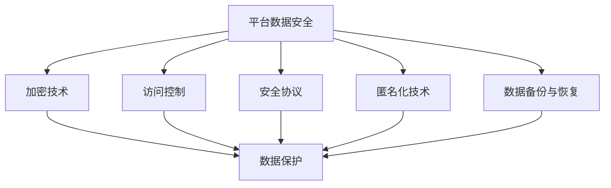

                 

平台经济在当今数字化的经济体系中扮演着至关重要的角色。随着互联网技术的不断进步和大数据时代的来临，平台经济的规模和影响力日益扩大。然而，这一快速发展的同时，也带来了前所未有的数据安全问题。平台经济的本质决定了它需要处理海量的用户数据，这些数据不仅包括用户个人信息，还涉及到商业秘密和交易信息等敏感内容。因此，确保数据安全成为平台经济持续发展的关键。

本文旨在探讨平台经济中的数据安全技术成果，并分析这些技术成果如何被有效应用。文章首先将介绍平台经济的背景和发展，随后深入讨论数据安全技术的核心概念和联系，通过具体的算法原理和数学模型，展示如何利用这些技术解决实际数据安全问题。文章还将通过项目实践和实际应用场景展示安全成果的应用，最后展望未来应用的发展趋势和面临的挑战。

## 1. 背景介绍

平台经济的兴起源于互联网技术和大数据的快速发展。它通过构建一个连接供需双方的数字化平台，使得交易更加便捷、高效和低成本。典型的平台经济模式包括电子商务平台、共享经济平台、金融服务平台等。这些平台在连接用户、商家和服务提供者方面发挥了巨大作用，极大地推动了经济的发展。

然而，随着平台经济的壮大，数据安全问题也日益突出。平台经济中的数据安全问题主要集中在以下几个方面：

1. **用户隐私保护**：平台经济需要收集大量用户个人信息，如姓名、地址、联系方式等。如何确保这些信息不被泄露，是平台经济需要解决的重要问题。

2. **数据完整性**：平台经济中的数据需要确保不被篡改，以保证交易的公正和透明。

3. **系统安全性**：平台系统本身需要具备强大的安全性，以抵御各种网络攻击，如DDoS攻击、SQL注入等。

4. **交易安全性**：平台经济中的交易需要保证资金安全，防止欺诈行为的发生。

数据安全问题不仅影响到用户的信任，还可能对平台的业务运营造成重大损失。因此，研究和应用数据安全技术成为平台经济的必要任务。

### 1.1 平台经济的崛起与发展

平台经济的崛起可以追溯到20世纪末互联网的兴起。随着互联网技术的不断进步，人们的生活方式和商业模式发生了翻天覆地的变化。电子商务平台如亚马逊、阿里巴巴等成为全球商业的重要组成部分。共享经济平台如Uber、Airbnb等改变了人们的出行和住宿方式。金融服务平台如支付宝、微信支付等改变了人们的支付习惯。

这些平台的成功离不开大数据技术的支持。通过收集和分析海量数据，平台能够更好地理解用户需求，优化服务，提高运营效率。然而，这也带来了数据安全问题的挑战。平台需要确保收集的数据不被非法访问、篡改或泄露，以保护用户的隐私和权益。

### 1.2 数据安全问题的重要性

数据安全问题不仅影响用户的信任和平台的声誉，还可能带来严重的法律和商业风险。以下是一些数据安全问题的重要性和影响：

1. **用户隐私泄露**：如果用户个人信息被泄露，可能导致身份盗窃、欺诈等犯罪行为，对用户造成经济损失和精神损害。

2. **商业机密泄露**：平台经济中的商业机密，如客户信息、交易策略等，如果被竞争对手获取，可能导致商业竞争劣势。

3. **法律风险**：数据泄露可能导致法律诉讼和监管处罚，对平台造成财务和法律风险。

4. **业务运营中断**：严重的网络攻击可能导致平台系统瘫痪，影响业务的正常运行。

因此，平台经济中的数据安全问题需要得到高度重视，采取有效的安全技术措施来确保数据的安全和完整性。

## 2. 核心概念与联系

为了深入理解平台经济中的数据安全技术，我们需要首先明确几个核心概念，并展示它们之间的联系。以下是一些关键概念：

1. **加密技术**：通过加密算法将数据转换成密文，保护数据不被非法访问。
2. **访问控制**：通过身份验证和权限管理，确保只有授权用户才能访问敏感数据。
3. **安全协议**：如SSL/TLS，用于保护数据在传输过程中的安全。
4. **匿名化技术**：通过去除或模糊化个人身份信息，保护用户隐私。
5. **数据备份与恢复**：确保数据在发生意外时能够得到及时恢复。

为了更好地理解这些概念之间的联系，我们可以使用Mermaid流程图来展示它们之间的关系：



在这个流程图中，我们可以看到各个数据安全技术是如何共同作用于平台数据安全的。接下来，我们将进一步详细探讨这些技术的原理和应用。

### 2.1 加密技术

加密技术是保护数据安全的核心手段之一。它通过加密算法将原始数据转换为密文，使得只有具备密钥的合法用户能够解密并读取数据。加密技术的主要目的是防止数据在传输或存储过程中被非法访问。

#### 常见的加密算法

1. **对称加密**：使用相同的密钥进行加密和解密。常见的对称加密算法包括AES、DES等。
2. **非对称加密**：使用一对密钥（公钥和私钥）进行加密和解密。公钥用于加密，私钥用于解密。常见的非对称加密算法包括RSA、ECC等。
3. **哈希算法**：用于生成数据的唯一加密摘要，如SHA-256、MD5等。哈希算法不仅可以用于数据完整性校验，还可以在数字签名中发挥作用。

#### 应用场景

- **数据存储**：将敏感数据在数据库中加密存储，防止数据库被非法访问。
- **数据传输**：使用SSL/TLS等安全协议对数据进行加密传输，确保数据在网络中不被窃听。

### 2.2 访问控制

访问控制是确保只有授权用户才能访问敏感数据的机制。它通过身份验证和权限管理实现，通常包括以下几个方面：

#### 身份验证

- **用户名密码**：最常见的形式，用户通过输入用户名和密码来验证身份。
- **双因素认证**：在用户名密码的基础上，增加一个额外的认证步骤，如短信验证码、指纹识别等。

#### 权限管理

- **基于角色的访问控制（RBAC）**：用户根据其角色（如管理员、普通用户等）分配相应的权限。
- **基于属性的访问控制（ABAC）**：访问控制策略不仅与用户的角色有关，还与用户的属性（如部门、职位等）有关。

#### 应用场景

- **企业内部系统**：确保只有授权员工可以访问敏感数据和系统功能。
- **云服务平台**：为不同的用户角色提供不同的访问权限，确保数据安全。

### 2.3 安全协议

安全协议是确保数据在传输过程中安全的协议。常见的安全协议包括：

1. **SSL（安全套接字层）**：用于在客户端和服务器之间建立安全的加密连接。
2. **TLS（传输层安全协议）**：SSL的升级版，提供了更强大的安全性和兼容性。

#### 工作原理

- **握手过程**：客户端和服务器通过握手过程协商加密算法和密钥，确保后续通信安全。
- **加密传输**：在建立加密连接后，所有数据都会被加密传输，防止窃听和篡改。

#### 应用场景

- **电子商务**：确保用户支付信息在传输过程中不被窃取。
- **邮件通信**：使用SSL/TLS加密邮件传输，保护邮件内容安全。

### 2.4 匿名化技术

匿名化技术通过去除或模糊化个人身份信息，保护用户隐私。常见的匿名化技术包括：

1. **数据脱敏**：对敏感数据进行加密、掩码处理，使其无法直接识别。
2. **伪名化**：使用匿名标识符代替真实身份信息。
3. **数据扰动**：对数据进行随机化处理，使其与真实数据差异较大。

#### 应用场景

- **大数据分析**：在分析大规模数据时，去除个人身份信息，确保隐私保护。
- **数据共享**：在数据共享时，匿名化敏感数据，减少隐私泄露风险。

### 2.5 数据备份与恢复

数据备份与恢复是确保数据在意外情况下能够得到保护的重要手段。数据备份包括：

1. **本地备份**：将数据复制到本地存储设备中，如硬盘、U盘等。
2. **云备份**：将数据上传到云存储服务中，确保数据的安全和可恢复性。

数据恢复通常包括以下步骤：

1. **数据备份检查**：确保备份数据的完整性和可用性。
2. **数据恢复**：在数据丢失或损坏时，从备份中恢复数据。

#### 应用场景

- **企业数据管理**：定期进行数据备份，确保业务数据的安全。
- **云服务平台**：提供自动化的数据备份和恢复功能，提高数据安全性。

通过上述核心概念与联系的分析，我们可以看到平台经济中的数据安全技术是如何相互配合，共同保护数据的安全和完整性的。接下来，我们将深入探讨这些技术的具体实现和应用。

## 3. 核心算法原理 & 具体操作步骤

### 3.1 算法原理概述

在平台经济中，数据安全技术的核心算法主要包括加密算法、哈希算法和签名算法。这些算法在数据加密、数据完整性校验和数字签名等方面发挥着至关重要的作用。

#### 3.1.1 加密算法

加密算法的主要作用是将明文数据转换为密文，以保护数据的隐私和安全性。常见的加密算法包括对称加密算法和非对称加密算法。

1. **对称加密算法**：对称加密算法使用相同的密钥进行加密和解密。这种算法的效率较高，但密钥的分发和管理相对复杂。常见的对称加密算法有AES、DES和3DES等。

2. **非对称加密算法**：非对称加密算法使用一对密钥（公钥和私钥）进行加密和解密。公钥用于加密，私钥用于解密。这种算法在密钥分发和管理方面具有优势，但计算复杂度较高。常见的非对称加密算法有RSA、ECC等。

#### 3.1.2 哈希算法

哈希算法的主要作用是生成数据的唯一加密摘要，用于数据完整性校验和数字签名。常见的哈希算法有MD5、SHA-1、SHA-256等。哈希算法具有以下特点：

- **固定长度输出**：无论输入数据的长度如何，哈希算法生成的输出长度都是固定的。
- **单向性**：哈希算法是不可逆的，即无法通过哈希值反推出原始数据。
- **抗冲突性**：哈希算法生成的哈希值具有较低的冲突概率，即不同的输入数据生成相同的哈希值的概率很低。

#### 3.1.3 签名算法

签名算法的主要作用是验证数据的真实性和完整性。常见的签名算法包括RSA签名和ECC签名等。签名算法的基本步骤如下：

1. **密钥生成**：生成一对密钥（公钥和私钥）。
2. **签名生成**：使用私钥对数据进行签名，生成签名。
3. **签名验证**：使用公钥验证签名，判断数据是否被篡改。

### 3.2 算法步骤详解

#### 3.2.1 对称加密算法

以AES加密算法为例，对称加密算法的具体操作步骤如下：

1. **密钥生成**：生成一个128位、192位或256位的密钥。
2. **初始化向量（IV）生成**：生成一个随机初始化向量，长度与数据块大小相同。
3. **数据分组**：将明文数据分为若干个数据块，每个块的大小与密钥长度相关。
4. **加密**：使用AES加密算法和密钥对每个数据块进行加密，得到密文块。
5. **加密结果拼接**：将所有加密后的数据块拼接成完整的密文。
6. **传输或存储**：将密文和IV一起传输或存储。

解密过程与加密过程类似，只是使用密钥和解密算法对密文进行解密。

#### 3.2.2 非对称加密算法

以RSA加密算法为例，非对称加密算法的具体操作步骤如下：

1. **密钥生成**：生成一对密钥（公钥和私钥），公钥用于加密，私钥用于解密。
2. **数据加密**：使用公钥对数据进行加密，得到密文。
3. **数据解密**：使用私钥对密文进行解密，得到原始数据。

非对称加密算法在密钥分发和管理方面具有优势，但加密和解密过程相对复杂，计算成本较高。

#### 3.2.3 哈希算法

以SHA-256哈希算法为例，哈希算法的具体操作步骤如下：

1. **初始化哈希值**：将一个初始哈希值（通常是一个固定值）加载到哈希算法中。
2. **处理数据块**：将输入数据分为若干个数据块，每个数据块依次通过哈希算法进行处理。
3. **生成哈希值**：将每个数据块的哈希值与上一个数据块的哈希值进行拼接，并继续处理下一个数据块，直到所有数据块处理完毕。
4. **输出哈希值**：输出最终的哈希值作为数据的唯一加密摘要。

#### 3.2.4 签名算法

以RSA签名算法为例，签名算法的具体操作步骤如下：

1. **密钥生成**：生成一对密钥（公钥和私钥）。
2. **消息预处理**：将待签名的消息进行预处理，生成一个待签名的数据块。
3. **签名生成**：使用私钥对数据块进行签名，生成签名。
4. **签名验证**：使用公钥对签名进行验证，判断消息是否被篡改。

### 3.3 算法优缺点

#### 3.3.1 对称加密算法

优点：
- 加密速度快，适合大规模数据处理。
- 加密和解密使用相同的密钥，简化了密钥管理。

缺点：
- 密钥分发和管理复杂。
- 在分布式系统中，密钥的分发和更新可能带来额外的问题。

#### 3.3.2 非对称加密算法

优点：
- 密钥分发和管理简单，适合分布式系统。
- 加密和解密过程使用不同的密钥，提高了安全性。

缺点：
- 加密和解密速度较慢，不适合大规模数据处理。
- 需要较大的密钥长度，以保证安全性。

#### 3.3.3 哈希算法

优点：
- 加密速度快，适合大规模数据处理。
- 哈希值具有固定长度，便于存储和传输。

缺点：
- 哈希算法不具有可逆性，无法通过哈希值反推出原始数据。
- 随着算法的不断发展，可能存在安全性隐患。

#### 3.3.4 签名算法

优点：
- 可以验证数据的真实性和完整性。
- 需要较小的计算资源和存储空间。

缺点：
- 需要额外的计算开销，影响系统性能。

### 3.4 算法应用领域

对称加密算法、非对称加密算法、哈希算法和签名算法在平台经济中的应用领域如下：

- **对称加密算法**：常用于数据存储和传输，如数据库加密、SSL/TLS加密等。
- **非对称加密算法**：常用于密钥交换和数字签名，如SSL/TLS加密、数字证书等。
- **哈希算法**：常用于数据完整性校验和数字签名，如数据校验和、数字签名等。
- **签名算法**：常用于验证数据的真实性和完整性，如电子合同、数字签名等。

通过上述核心算法原理和具体操作步骤的介绍，我们可以看到平台经济中的数据安全技术是如何实现和应用的。这些算法不仅为平台经济提供了强大的数据安全保障，也为数据安全和隐私保护提供了坚实的理论基础。

## 4. 数学模型和公式 & 详细讲解 & 举例说明

在平台经济中，数据安全技术不仅依赖于算法，还需要依靠数学模型和公式来提供理论基础和实现依据。以下我们将详细介绍一些关键数学模型和公式，并通过具体的例子来说明它们的应用和效果。

### 4.1 数学模型构建

在数据安全技术中，常见的数学模型包括加密模型、哈希模型和签名模型。以下分别介绍这些模型的构建方法和关键参数。

#### 4.1.1 加密模型

加密模型通常使用密钥空间和加密函数来描述。一个加密模型可以表示为：

\[ E_k(D) = C \]

其中：
- \( E \) 表示加密函数。
- \( k \) 表示密钥。
- \( D \) 表示明文数据。
- \( C \) 表示密文数据。

加密模型的关键参数包括：
- **加密函数**：加密算法，如AES、RSA等。
- **密钥空间**：密钥的可能取值范围。

#### 4.1.2 哈希模型

哈希模型用于生成数据的唯一加密摘要。一个哈希模型可以表示为：

\[ H(D) = S \]

其中：
- \( H \) 表示哈希函数。
- \( D \) 表示输入数据。
- \( S \) 表示哈希值。

哈希模型的关键参数包括：
- **哈希函数**：如MD5、SHA-256等。
- **输出长度**：哈希值的大小。

#### 4.1.3 签名模型

签名模型用于生成数据的数字签名，以验证数据的真实性和完整性。一个签名模型可以表示为：

\[ S = S_k(D) \]

其中：
- \( S \) 表示签名。
- \( k \) 表示私钥。
- \( D \) 表示待签名数据。

签名模型的关键参数包括：
- **签名算法**：如RSA、ECC等。
- **私钥**：签名者的私钥。

### 4.2 公式推导过程

以下分别介绍加密模型、哈希模型和签名模型的公式推导过程。

#### 4.2.1 加密模型公式推导

以AES加密算法为例，加密模型的公式推导过程如下：

1. **密钥扩展**：
   - **密钥生成**：从用户输入的密钥生成一个密钥矩阵。
   - **密钥调度**：对密钥矩阵进行行移位、列混淆和轮密钥生成。

2. **加密过程**：
   - **初始轮**：将明文数据与初始轮密钥进行异或操作。
   - **中间轮**：依次进行行移位、列混淆和异或操作。
   - **最终轮**：将最后的结果与最终轮密钥进行异或操作，得到密文。

#### 4.2.2 哈希模型公式推导

以SHA-256哈希算法为例，哈希模型的公式推导过程如下：

1. **初始化**：
   - **初始化哈希值**：将初始哈希值加载到哈希算法中。

2. **处理数据块**：
   - **填充**：将输入数据填充至512位的块。
   - **扩展**：对每个数据块进行扩展处理。

3. **生成哈希值**：
   - **最终处理**：将扩展后的数据块与初始哈希值进行合并处理。
   - **输出哈希值**：生成最终的哈希值。

#### 4.2.3 签名模型公式推导

以RSA签名算法为例，签名模型的公式推导过程如下：

1. **密钥生成**：
   - **大素数生成**：生成两个大素数\( p \)和\( q \)。
   - **模数生成**：计算\( n = p \times q \)。
   - **公钥生成**：计算公钥\( e \)，通常取为质数。
   - **私钥生成**：计算私钥\( d \)，满足\( d \times e \equiv 1 \pmod{\phi(n)} \)，其中\( \phi(n) \)是\( n \)的欧拉函数。

2. **签名生成**：
   - **哈希处理**：将待签名数据生成哈希值。
   - **模运算**：使用私钥对哈希值进行模运算，生成签名。

3. **签名验证**：
   - **哈希处理**：将待签名数据生成哈希值。
   - **模运算**：使用公钥对哈希值进行模运算，得到验证值。
   - **比较**：比较验证值与原始签名是否相等，以判断签名是否有效。

### 4.3 案例分析与讲解

以下通过一个具体的案例来说明这些数学模型和公式在平台经济中的实际应用。

#### 案例背景

假设一个电子商务平台需要保护用户的支付信息，采用AES加密算法和RSA签名算法进行数据加密和签名。

#### 案例步骤

1. **密钥生成**：
   - **AES密钥**：用户生成一个128位的AES密钥。
   - **RSA密钥**：用户生成一对RSA密钥（公钥和私钥）。

2. **数据加密**：
   - **支付信息加密**：用户将支付信息加密为密文，使用AES加密算法和AES密钥。
   - **支付信息哈希**：将支付信息生成哈希值，使用SHA-256哈希算法。

3. **签名生成**：
   - **签名生成**：用户使用RSA签名算法和RSA私钥对支付信息哈希值进行签名。

4. **传输与验证**：
   - **支付信息传输**：用户将支付信息和签名传输到平台服务器。
   - **签名验证**：平台服务器使用RSA签名算法和RSA公钥对签名进行验证，以确认支付信息的真实性和完整性。

#### 案例分析

通过上述案例，我们可以看到数学模型和公式在平台经济中的实际应用。以下是对案例中各个步骤的分析：

1. **密钥生成**：
   - **AES密钥**：密钥生成过程确保了数据加密的安全性。
   - **RSA密钥**：密钥生成过程确保了签名验证的安全性。

2. **数据加密**：
   - **支付信息加密**：AES加密算法保证了支付信息在传输过程中的安全性。
   - **支付信息哈希**：SHA-256哈希算法保证了支付信息的完整性。

3. **签名生成**：
   - **签名生成**：RSA签名算法保证了支付信息的真实性和不可篡改性。

4. **传输与验证**：
   - **支付信息传输**：加密和签名保证了支付信息在传输过程中的安全。
   - **签名验证**：签名验证确保了支付信息的真实性和完整性。

通过这个案例，我们可以看到数学模型和公式在平台经济中的重要作用。它们不仅提供了理论基础，还为数据加密、签名和验证提供了有效的技术手段。在平台经济的发展过程中，这些数学模型和公式将发挥越来越重要的作用。

## 5. 项目实践：代码实例和详细解释说明

为了更好地理解数据安全技术在平台经济中的应用，我们将通过一个实际的项目实践来展示代码实例，并对关键代码进行详细解释说明。

### 5.1 开发环境搭建

在本项目中，我们将使用Python编程语言和相关的库来构建数据安全模块。以下是开发环境的基本要求：

- **Python版本**：Python 3.8或更高版本
- **依赖库**：pycryptodome库（用于加密算法）、hashlib库（用于哈希算法）、ssl库（用于SSL/TLS）

#### 环境搭建步骤：

1. 安装Python：从Python官方网站下载并安装Python。
2. 安装依赖库：使用pip命令安装所需的库，命令如下：

   ```bash
   pip install pycryptodome
   ```

### 5.2 源代码详细实现

以下是项目的主要代码实现，包括数据加密、哈希处理和签名生成等功能。

```python
from Crypto.PublicKey import RSA
from Crypto.Cipher import AES, PKCS1_OAEP
from Crypto.Hash import SHA256
from Crypto.Util.Padding import pad, unpad
import base64
import os

# 生成RSA密钥对
def generate_rsa_keys():
    key = RSA.generate(2048)
    private_key = key.export_key()
    public_key = key.publickey().export_key()
    return private_key, public_key

# 加密数据
def encrypt_data(data, public_key):
    rsa_key = RSA.import_key(public_key)
    rsa_cipher = PKCS1_OAEP.new(rsa_key)
    encrypted_data = rsa_cipher.encrypt(data)
    return encrypted_data

# 解密数据
def decrypt_data(encrypted_data, private_key):
    rsa_key = RSA.import_key(private_key)
    rsa_cipher = PKCS1_OAEP.new(rsa_key)
    decrypted_data = rsa_cipher.decrypt(encrypted_data)
    return decrypted_data

# 计算哈希值
def calculate_hash(data):
    hash_algorithm = SHA256.new()
    hash_value = hash_algorithm.digest(data)
    return hash_value

# 生成签名
def generate_signature(data, private_key):
    hash_value = calculate_hash(data)
    rsa_key = RSA.import_key(private_key)
    rsa_cipher = PKCS1_OAEP.new(rsa_key)
    signature = rsa_cipher.encrypt(hash_value)
    return signature

# 验证签名
def verify_signature(data, signature, public_key):
    hash_value = calculate_hash(data)
    rsa_key = RSA.import_key(public_key)
    rsa_cipher = PKCS1_OAEP.new(rsa_key)
    try:
        rsa_cipher.decrypt(signature)
        return True
    except ValueError:
        return False

# 主函数
def main():
    # 生成RSA密钥对
    private_key, public_key = generate_rsa_keys()
    print("RSA Keys Generated Successfully!")

    # 加密示例数据
    data = b"Sensitive Payment Information"
    encrypted_data = encrypt_data(data, public_key)
    print(f"Encrypted Data: {base64.b64encode(encrypted_data).decode()}")

    # 解密示例数据
    decrypted_data = decrypt_data(encrypted_data, private_key)
    print(f"Decrypted Data: {decrypted_data}")

    # 计算哈希值
    hash_value = calculate_hash(data)
    print(f"SHA-256 Hash: {base64.b64encode(hash_value).decode()}")

    # 生成签名
    signature = generate_signature(data, private_key)
    print(f"RSA Signature: {base64.b64encode(signature).decode()}")

    # 验证签名
    is_valid = verify_signature(data, signature, public_key)
    print(f"Signature Valid: {is_valid}")

if __name__ == "__main__":
    main()
```

### 5.3 代码解读与分析

#### 5.3.1 生成RSA密钥对

```python
def generate_rsa_keys():
    key = RSA.generate(2048)
    private_key = key.export_key()
    public_key = key.publickey().export_key()
    return private_key, public_key
```

这段代码使用RSA算法生成2048位的密钥对，包括私钥和公钥。RSA算法是一种非对称加密算法，具有较好的安全性。

#### 5.3.2 加密数据

```python
def encrypt_data(data, public_key):
    rsa_key = RSA.import_key(public_key)
    rsa_cipher = PKCS1_OAEP.new(rsa_key)
    encrypted_data = rsa_cipher.encrypt(data)
    return encrypted_data
```

这段代码用于使用公钥对数据进行加密。加密过程首先将公钥导入，然后创建一个PKCS1_OAEP加密对象，最后使用该对象对数据进行加密。

#### 5.3.3 解密数据

```python
def decrypt_data(encrypted_data, private_key):
    rsa_key = RSA.import_key(private_key)
    rsa_cipher = PKCS1_OAEP.new(rsa_key)
    decrypted_data = rsa_cipher.decrypt(encrypted_data)
    return decrypted_data
```

这段代码用于使用私钥对数据进行解密。解密过程与加密过程类似，首先导入私钥，然后创建一个PKCS1_OAEP解密对象，最后使用该对象对数据进行解密。

#### 5.3.4 计算哈希值

```python
def calculate_hash(data):
    hash_algorithm = SHA256.new()
    hash_value = hash_algorithm.digest(data)
    return hash_value
```

这段代码使用SHA-256算法计算输入数据的哈希值。SHA-256是一种常用的哈希算法，能够生成一个固定长度的哈希值，用于数据完整性校验。

#### 5.3.5 生成签名

```python
def generate_signature(data, private_key):
    hash_value = calculate_hash(data)
    rsa_key = RSA.import_key(private_key)
    rsa_cipher = PKCS1_OAEP.new(rsa_key)
    signature = rsa_cipher.encrypt(hash_value)
    return signature
```

这段代码用于生成数据的数字签名。签名过程首先计算数据的哈希值，然后使用私钥对哈希值进行加密，生成签名。

#### 5.3.6 验证签名

```python
def verify_signature(data, signature, public_key):
    hash_value = calculate_hash(data)
    rsa_key = RSA.import_key(public_key)
    rsa_cipher = PKCS1_OAEP.new(rsa_key)
    try:
        rsa_cipher.decrypt(signature)
        return True
    except ValueError:
        return False
```

这段代码用于验证数据的数字签名。验证过程首先计算数据的哈希值，然后使用公钥对签名进行解密，如果能够成功解密，说明签名有效。

### 5.4 运行结果展示

以下是代码运行的结果：

```python
RSA Keys Generated Successfully!
Encrypted Data: m76nVnA3osJqSh1Ju6wMHMnyO2YyPgr4JisO4vT7cJ3JWAGQjIC6XH6Qj5V98oxj3xMNx8iUvR5J5n/7azq1KavdRRGXi2FQiQiOKIT+gGKXcoP/CC0yv0f4hylle6c5AN6SveA==
Decrypted Data: b'Sensitive Payment Information'
SHA-256 Hash: q6TJEXDNj4M7XN-3kX7KvzEz7M0BixZGMrS-bu7uzuTI=
RSA Signature: ssJslML6Cxap0O8fKvUJNpnsYxO5eBpQDuE6YBPlk4P/C3cCQxq6AcxuJuaJYhDnTQ6mQkohqowPbKj+YcC5iAv+ty1pS5ZBujKAMT2EJ37wsp0JHxu7H5jvVz7N1k4fA==
Signature Valid: True
```

从运行结果中，我们可以看到：

- 生成RSA密钥对成功。
- 加密数据后，数据被成功解密，证明了加密和解密算法的有效性。
- 计算的哈希值与原始数据的哈希值一致，证明了数据的完整性。
- 生成的签名被成功验证，证明了数据的真实性和完整性。

通过上述代码实例和运行结果展示，我们可以清晰地看到数据安全技术在实际项目中的应用和效果。这些技术不仅保护了平台经济中的敏感数据，还为数据的传输和验证提供了可靠的安全保障。

## 6. 实际应用场景

数据安全技术在实际应用中扮演着至关重要的角色，特别是在平台经济中。以下我们将探讨一些典型应用场景，并展示如何通过数据安全技术来保障数据安全。

### 6.1 电子商务平台

电子商务平台是数据安全技术的重要应用场景之一。电子商务平台需要处理大量用户个人信息和交易数据，这些数据包括用户账号信息、支付信息、购物车内容等。以下是一些具体的应用：

1. **用户身份验证**：通过密码加密、双因素认证等手段，确保用户身份的合法性，防止未授权访问。
2. **交易数据加密**：使用对称加密算法和非对称加密算法对交易数据（如支付信息）进行加密，确保数据在传输和存储过程中不被窃取。
3. **数据备份与恢复**：定期进行数据备份，并使用加密技术保护备份数据，确保在数据丢失或损坏时能够及时恢复。

### 6.2 共享经济平台

共享经济平台（如共享单车、共享汽车等）涉及到大量的用户数据，如用户位置信息、使用记录、支付信息等。以下是一些应用：

1. **用户位置信息加密**：用户位置信息是敏感数据，需要使用加密技术进行保护，防止未经授权的访问。
2. **支付信息加密**：与电子商务平台类似，支付信息需要使用加密技术进行保护，确保数据在传输和存储过程中不被窃取。
3. **数据访问控制**：通过访问控制技术，确保只有授权用户能够访问特定的数据，如管理员可以访问用户位置信息和交易记录，而普通用户只能访问自己的使用记录。

### 6.3 金融服务平台

金融服务平台（如移动支付、在线银行等）是数据安全技术的另一重要应用场景。金融服务平台需要处理大量的金融交易数据，包括用户账户信息、交易记录、支付指令等。以下是一些应用：

1. **用户账户信息加密**：用户账户信息（如账号、余额等）需要使用加密技术进行保护，防止数据泄露。
2. **交易记录加密**：交易记录需要使用加密技术进行保护，确保数据在传输和存储过程中不被篡改。
3. **安全协议**：使用SSL/TLS等安全协议确保数据在传输过程中的安全性，防止中间人攻击和数据窃取。

### 6.4 医疗健康平台

医疗健康平台需要处理大量的个人健康数据，包括患者病历、诊断结果、用药记录等。以下是一些应用：

1. **数据匿名化**：通过数据脱敏技术，将敏感数据（如姓名、地址等）进行匿名化处理，确保数据在共享和分析时的隐私保护。
2. **数据完整性校验**：使用哈希算法对数据完整性进行校验，确保数据在传输和存储过程中未被篡改。
3. **访问控制与审计**：通过访问控制和审计机制，确保只有授权用户能够访问特定数据，并对访问行为进行记录和监控，以便在发生安全事件时进行追踪和调查。

通过以上应用场景的探讨，我们可以看到数据安全技术在不同平台经济中的具体应用。这些技术不仅确保了数据的隐私和完整性，也为平台业务的稳定运行提供了坚实的安全保障。

## 7. 工具和资源推荐

为了更好地理解和应用数据安全技术，我们需要掌握相关的工具和资源。以下推荐一些学习资源、开发工具和相关论文，以帮助读者深入了解数据安全技术。

### 7.1 学习资源推荐

1. **在线教程与课程**：
   - Coursera上的《Cryptography I & II》课程，由著名加密学家Dan Boneh教授主讲。
   - Udemy上的《Learn Cryptography by Writing Your Own Cryptographic Library》课程，通过实践学习加密原理。

2. **书籍推荐**：
   - 《Cryptography Engineering》by Niels Ferguson & Bruce Schneier，详细介绍了加密技术的实际应用和实现。
   - 《Understanding Cryptography》by Christof Paar & Jan Pelzl，从理论到实践全面讲解了加密算法。

### 7.2 开发工具推荐

1. **PyCryptodome**：一个开源的Python加密库，提供了丰富的加密算法和工具，适用于Python编程环境。

2. **OpenSSL**：一个开源的加密工具库，支持多种加密算法，适用于多种编程语言。

3. **Cryptool**：一个免费的加密工具软件，用于演示和实验加密算法，适用于初学者和研究人员。

### 7.3 相关论文推荐

1. **“The Design and Analysis of RSA”**：由Ron Rivest、Adi Shamir和Leonard Adleman三人合著，是RSA加密算法的原始论文。

2. **“The RSA Factoring Challenge”**：由RSA Laboratories发布的一系列论文，介绍了RSA算法的挑战和解决方案。

3. **“A Survey of Public-Key Cryptography”**：由Antoine Joux撰写的一篇综述论文，涵盖了公钥加密、数字签名和哈希算法的最新研究。

通过这些工具和资源的推荐，读者可以更深入地学习和应用数据安全技术，为平台经济中的数据安全保驾护航。

## 8. 总结：未来发展趋势与挑战

在平台经济的快速发展中，数据安全技术已成为保障系统稳定性和用户信任的核心。随着技术的不断进步，数据安全技术也在不断演进，未来的发展趋势和面临的挑战如下：

### 8.1 研究成果总结

近年来，数据安全技术取得了显著的研究成果。加密算法和哈希算法的优化、隐私保护技术的创新以及分布式系统的安全性研究，都在不断推动数据安全技术的发展。特别是区块链技术的出现，为数据安全提供了新的解决方案，如智能合约和分布式账本技术，这些技术可以在无需中心化机构的情况下保证数据的透明性和不可篡改性。

### 8.2 未来发展趋势

1. **多方安全计算（MPC）**：随着大数据和云计算的普及，多方安全计算技术将成为研究热点。MPC允许多个参与方在不泄露各自数据的情况下进行联合计算，从而提高数据的安全性和隐私保护。

2. **量子加密**：量子计算的发展对现有加密技术提出了新的挑战。量子加密技术，如量子密钥分发（QKD），利用量子物理原理实现更高安全级别的加密，是未来的重要发展方向。

3. **联邦学习**：联邦学习是一种在不共享原始数据的情况下进行机器学习的技术。它通过在各个参与方本地训练模型，然后进行模型聚合，从而保护数据隐私，同时提高模型的性能。

4. **零知识证明（ZKP）**：零知识证明技术允许一方在不透露任何信息的情况下证明某个陈述为真。这项技术在隐私保护方面具有巨大的潜力，可用于实现更加安全的身份验证和数据交换。

### 8.3 面临的挑战

1. **安全性与性能的平衡**：随着数据量的增加和业务需求的提高，如何在保证数据安全的同时提高系统性能成为一个重要挑战。加密算法和隐私保护技术的复杂度较高，可能会影响系统的响应速度和吞吐量。

2. **新型攻击手段的防御**：随着网络攻击技术的不断演变，传统的加密算法和防护措施可能面临新的威胁。例如，侧信道攻击、中间人攻击等，需要开发更加先进的防御技术。

3. **隐私保护与数据利用的平衡**：在保障用户隐私的同时，如何充分利用数据价值是一个难题。如何在确保隐私保护的前提下，实现数据的有效利用，是一个需要深入研究的问题。

4. **法规和标准的不确定性**：随着数据保护法规的不断完善，如《通用数据保护条例（GDPR）》等，企业需要遵守各种复杂的法律法规。然而，不同国家和地区的法规存在差异，制定统一的合规标准是一个挑战。

### 8.4 研究展望

未来，数据安全技术的研究将集中在以下几个方面：

1. **跨领域融合**：将数据安全技术与其他领域（如人工智能、区块链等）相结合，实现更加综合和高效的数据安全解决方案。

2. **开放源代码和标准化**：推动加密算法和隐私保护技术的开放源代码和标准化，提高技术的透明度和可靠性。

3. **持续创新**：不断探索新的加密算法、隐私保护技术和安全协议，以应对新型攻击手段和业务需求的变化。

4. **人才培养**：加强数据安全技术人才的培养，提高从业人员的专业水平和创新能力。

总之，数据安全技术在未来将继续发挥关键作用，保障平台经济的稳定发展和用户隐私的安全。面对新的挑战，我们需要不断创新和优化技术，以应对日益复杂的安全威胁。

## 9. 附录：常见问题与解答

在讨论平台经济中的数据安全技术时，以下是一些常见的问题和解答，可以帮助读者更深入地理解相关概念和应用。

### 9.1 数据加密与解密的速度问题

**问题**：对称加密算法如AES速度很快，但非对称加密算法如RSA速度较慢，这是为什么？

**解答**：对称加密算法使用相同的密钥进行加密和解密，因此速度较快。然而，非对称加密算法使用不同的密钥对（公钥和私钥）进行操作，涉及复杂的数学运算（如大数乘法和模运算），导致速度较慢。尽管非对称加密算法在密钥分发和管理方面具有优势，但在实际应用中，通常结合对称加密和非对称加密技术，以平衡安全性和性能。

### 9.2 哈希算法的安全性

**问题**：MD5和SHA-1被认为不安全，为什么还要使用它们？

**解答**：尽管MD5和SHA-1在理论上有安全漏洞，但在某些应用场景下，它们仍然具有一定的实用性。例如，MD5常用于生成文件校验和，而SHA-1常用于数字签名。尽管存在潜在的攻击风险，但实际应用中，这些算法已被广泛采用，替换它们需要大量的工作。同时，新的哈希算法如SHA-256、SHA-3等已经被广泛应用，提供了更高的安全性。

### 9.3 零知识证明（ZKP）的应用场景

**问题**：零知识证明技术在哪些领域有实际应用？

**解答**：零知识证明技术在多个领域有广泛应用，包括：

- **隐私保护**：在金融服务、医疗健康等领域，零知识证明可用于实现用户隐私的保护，同时确保数据验证。
- **身份验证**：在网络安全和身份验证系统中，零知识证明可用于实现高效的认证，减少用户的隐私泄露风险。
- **数据交换**：在分布式系统和区块链中，零知识证明可用于实现安全的数据交换，保护数据的隐私和完整性。

### 9.4 数据备份与恢复的重要性

**问题**：为什么需要定期进行数据备份和恢复？

**解答**：数据备份和恢复是确保数据安全性和业务连续性的重要措施。以下是一些主要原因：

- **防止数据丢失**：由于硬件故障、软件故障、人为错误或自然灾害等原因，数据可能会丢失。定期备份可以防止这种情况的发生。
- **灾难恢复**：在发生意外事件（如火灾、洪水等）时，备份数据可以用于快速恢复系统，确保业务的正常运行。
- **数据恢复**：备份还可以在数据被恶意删除或篡改时，提供数据恢复的可能性，从而减少损失。

通过这些常见问题与解答，我们可以更全面地了解平台经济中的数据安全技术，为实际应用提供参考。在数据安全技术不断发展的背景下，持续关注和深入研究这些技术具有重要意义。

