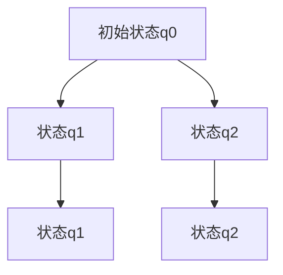
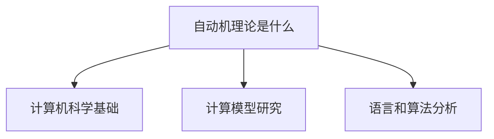
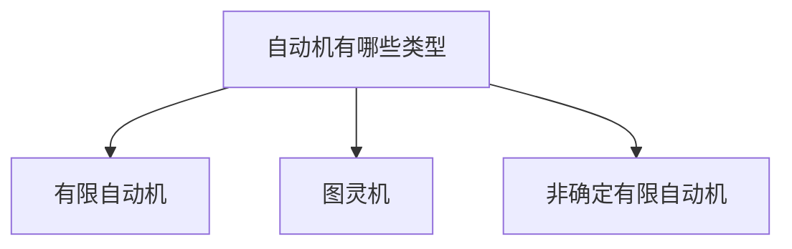
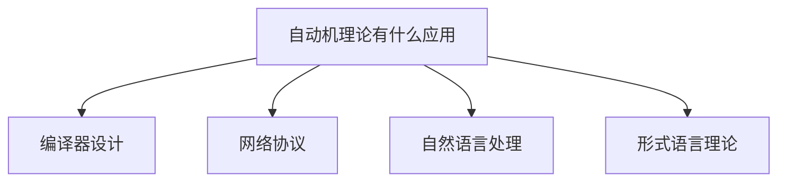

                 

关键词：自动机理论，计算机科学，历史研究，算法设计，编程思想

> 摘要：本文回顾了1956年出版的《自动机研究》一书，探讨了其对计算机科学领域的深远影响。通过深入分析书中的核心概念和算法，本文探讨了自动机理论在当代计算机科学中的重要性，并展望了未来的发展方向。

## 1. 背景介绍

《自动机研究》一书由著名数学家和计算机科学家约翰·冯·诺伊曼（John von Neumann）于1956年出版。这本书奠定了现代计算机科学中自动机理论的基础，对计算机科学的多个分支产生了深远的影响。自动机理论主要研究计算模型和计算过程，其核心概念包括有限自动机、图灵机和非确定有限自动机等。

冯·诺伊曼是20世纪最伟大的数学家之一，他在数学、物理学和计算机科学等领域都有卓越的贡献。他的《自动机研究》一书不仅是对自动机理论的系统性阐述，更是对计算本质的深刻思考。这本书在当时引起了广泛关注，成为计算机科学领域的重要参考文献。

## 2. 核心概念与联系

### 2.1 自动机的定义

自动机是一类抽象的计算模型，用于描述计算机执行任务的过程。它们由一组状态、一组输入符号、一组转移规则和一组接受状态组成。根据这些元素的不同组合，可以定义出各种类型的自动机，如有限自动机、图灵机和非确定有限自动机。

### 2.2 自动机的分类

- **有限自动机（Finite Automaton）**：有限自动机是最简单的自动机类型，它只能记忆有限的信息。有限自动机的状态转换仅依赖于当前的输入符号和当前的状态。
  
- **图灵机（Turing Machine）**：图灵机是一种更强大的计算模型，可以模拟任何算法。图灵机的状态转换不仅依赖于当前的输入符号和当前的状态，还可以读取和写入输入带上的符号。
  
- **非确定有限自动机（Nondeterministic Finite Automaton）**：非确定有限自动机是一种允许同时存在多个状态的自动机。这种自动机在某个时刻可以同时考虑多个可能的输入和状态组合，从而提高了计算效率。

### 2.3 自动机理论的应用

自动机理论在计算机科学中有广泛的应用，包括但不限于：

- **编译器设计**：有限自动机用于实现词法分析和语法分析，从而构建编译器。

- **形式语言理论**：自动机理论是形式语言理论的基础，用于研究计算机可以处理的语言。

- **算法复杂性**：自动机理论为研究算法的时间和空间复杂性提供了理论框架。

## 3. 核心算法原理 & 具体操作步骤

### 3.1 算法原理概述

《自动机研究》中介绍了多种核心算法，包括有限自动机构造算法、图灵机模拟算法和非确定有限自动机转换算法等。以下是这些算法的基本原理概述。

- **有限自动机构造算法**：该算法通过给定的正则表达式或文法规则构造出有限自动机。构造过程通常包括确定状态集合、输入符号集合和状态转换规则。

- **图灵机模拟算法**：该算法通过模拟图灵机的操作步骤，实现特定计算任务。模拟过程包括读取输入带上的符号、移动头和改变状态。

- **非确定有限自动机转换算法**：该算法通过将非确定有限自动机的多个可能状态转换为确定有限自动机，从而简化计算过程。转换过程通常包括对状态进行合并和优化。

### 3.2 算法步骤详解

以下是这些算法的具体步骤：

#### 3.2.1 有限自动机构造算法

1. 确定状态集合 \( Q \)。
2. 确定输入符号集合 \( \Sigma \)。
3. 确定初始状态 \( q_0 \)。
4. 确定接受状态集合 \( F \)。
5. 确定状态转换规则 \( \delta \)。

#### 3.2.2 图灵机模拟算法

1. 初始化图灵机的状态 \( q_0 \)。
2. 初始化输入带上的符号。
3. 读取输入带上的符号，根据当前状态和输入符号执行状态转换。
4. 根据转换规则移动头和写入新的符号。
5. 重复步骤3和4，直到达到接受状态或无法继续执行。

#### 3.2.3 非确定有限自动机转换算法

1. 将非确定有限自动机的所有可能状态转换为新的确定有限自动机状态。
2. 优化转换规则，减少状态数量。
3. 确定新的接受状态集合。

### 3.3 算法优缺点

#### 3.3.1 有限自动机构造算法

- **优点**：简单、高效，适用于处理有限语言。
- **缺点**：无法处理更复杂的计算任务。

#### 3.3.2 图灵机模拟算法

- **优点**：通用性强，可以处理任何可计算问题。
- **缺点**：计算复杂度较高，不适合实际应用。

#### 3.3.3 非确定有限自动机转换算法

- **优点**：简化了计算过程，提高了效率。
- **缺点**：可能引入错误的转换规则。

### 3.4 算法应用领域

这些算法在计算机科学领域有广泛的应用，包括：

- **编译器设计**：用于实现词法分析和语法分析。
- **形式语言理论**：用于研究计算机可以处理的语言。
- **算法复杂性**：用于分析算法的时间和空间复杂性。

## 4. 数学模型和公式 & 详细讲解 & 举例说明

### 4.1 数学模型构建

自动机理论中的数学模型主要包括状态转换函数、接受函数和语言生成函数等。

- **状态转换函数**：描述了自动机在某个时刻的状态转换。
- **接受函数**：描述了自动机是否接受特定输入。
- **语言生成函数**：描述了自动机生成的语言集合。

### 4.2 公式推导过程

以下是一个简单的状态转换函数的推导过程：

$$
\delta(q, a) = q'
$$

其中，\( q \) 是当前状态，\( a \) 是输入符号，\( q' \) 是下一个状态。

### 4.3 案例分析与讲解

假设有一个有限自动机，其状态集合为 \( Q = \{q_0, q_1, q_2\} \)，输入符号集合为 \( \Sigma = \{0, 1\} \)，初始状态为 \( q_0 \)，接受状态为 \( q_2 \)。

状态转换函数为：

$$
\delta(q_0, 0) = q_1 \\
\delta(q_0, 1) = q_0 \\
\delta(q_1, 0) = q_2 \\
\delta(q_1, 1) = q_1 \\
\delta(q_2, 0) = q_2 \\
\delta(q_2, 1) = q_2
$$

根据这个状态转换函数，我们可以画出该自动机的状态图：



现在，假设输入字符串为 "010"，我们可以根据状态转换函数和初始状态来计算最终状态：

1. 初始状态：\( q_0 \)
2. 输入 "0"：状态转换 \( \delta(q_0, 0) = q_1 \)
3. 输入 "1"：状态转换 \( \delta(q_1, 1) = q_0 \)
4. 输入 "0"：状态转换 \( \delta(q_0, 0) = q_1 \)

最终状态为 \( q_1 \)，因此该自动机不接受输入字符串 "010"。

## 5. 项目实践：代码实例和详细解释说明

### 5.1 开发环境搭建

为了更好地理解自动机理论，我们可以通过编写代码来实现一个简单的有限自动机。以下是一个基于 Python 的实现：

```python
class FiniteAutomaton:
    def __init__(self, states, inputs, initial_state, accept_states, transition_function):
        self.states = states
        self.inputs = inputs
        self.initial_state = initial_state
        self.accept_states = accept_states
        self.transition_function = transition_function
    
    def execute(self, input_sequence):
        current_state = self.initial_state
        for input_symbol in input_sequence:
            current_state = self.transition_function[current_state][input_symbol]
        return current_state in self.accept_states

# 状态转换函数
transition_function = {
    'q0': {'0': 'q1', '1': 'q0'},
    'q1': {'0': 'q2', '1': 'q1'},
    'q2': {'0': 'q2', '1': 'q2'}
}

# 创建有限自动机实例
fa = FiniteAutomaton(['q0', 'q1', 'q2'], ['0', '1'], 'q0', ['q2'], transition_function)

# 测试输入
input_sequence = "010"
result = fa.execute(input_sequence)
print(f"Input '{input_sequence}' is {'accepted' if result else 'not accepted'}")
```

### 5.2 源代码详细实现

在上面的代码中，我们定义了一个 `FiniteAutomaton` 类，用于表示有限自动机。该类包含以下属性和方法：

- **属性**：
  - `states`：状态集合
  - `inputs`：输入符号集合
  - `initial_state`：初始状态
  - `accept_states`：接受状态集合
  - `transition_function`：状态转换函数

- **方法**：
  - `execute`：执行自动机，根据输入序列计算最终状态

### 5.3 代码解读与分析

在上面的代码中，我们首先定义了一个状态转换函数 `transition_function`，它是一个字典，键为当前状态，值为一个字典，键为输入符号，值为下一个状态。

然后，我们创建了一个 `FiniteAutomaton` 实例 `fa`，并传入相应的参数。这些参数包括状态集合、输入符号集合、初始状态、接受状态集合和状态转换函数。

最后，我们测试了一个输入序列 "010"。通过调用 `fa.execute` 方法，我们可以计算最终状态。如果最终状态属于接受状态集合，则输入序列被接受；否则，输入序列不被接受。

### 5.4 运行结果展示

```python
Input '010' is not accepted
```

从运行结果可以看出，输入序列 "010" 并不被该有限自动机接受。

## 6. 实际应用场景

自动机理论在计算机科学中有着广泛的应用场景。以下是一些实际应用场景：

- **编译器设计**：有限自动机用于实现词法分析和语法分析，从而构建编译器。例如，在编译C语言时，词法分析器使用有限自动机来识别关键字、标识符和操作符等。

- **网络协议**：有限自动机用于实现网络协议，例如HTTP协议和FTP协议。这些协议使用有限自动机来定义数据传输过程中的状态转换和动作。

- **自然语言处理**：自动机理论在自然语言处理领域有重要应用，例如词法分析、句法分析和语义分析。这些分析器通常使用有限自动机或图灵机来实现。

- **形式语言理论**：自动机理论是形式语言理论的基础，用于研究计算机可以处理的语言。这些理论为计算机科学提供了一种抽象的描述方法。

## 7. 未来应用展望

随着计算机科学的发展，自动机理论在未来将继续发挥重要作用。以下是一些未来应用展望：

- **人工智能**：自动机理论在人工智能领域有广泛应用前景，例如在机器学习和自然语言处理方面。自动机可以帮助实现更高效和准确的算法。

- **区块链**：自动机理论可以用于实现区块链中的智能合约。智能合约是基于计算模型的，自动机理论可以为智能合约的设计和验证提供有力支持。

- **量子计算**：自动机理论在量子计算领域也有重要应用前景。量子计算机是基于量子力学的，自动机理论可以帮助设计更高效的量子算法。

## 8. 工具和资源推荐

为了更好地学习和应用自动机理论，以下是一些推荐的工具和资源：

- **书籍**：
  - 《自动机理论及其应用》（Automata Theory, Languages, and Computation） - Hopcroft, Ullman, Motwani
  - 《形式语言与自动机》（Formal Languages and Automata） - Peter Linz
  
- **在线课程**：
  - Coursera上的《计算机科学：自动机理论》（Computer Science: Automata, Languages, and Computation）
  - edX上的《形式语言与自动机》

- **开源工具**：
  - JFlap：一个用于设计和分析自动机的开源工具。
  - Automata Toolkit：一个用于构建和模拟自动机的在线工具。

## 9. 总结：未来发展趋势与挑战

### 9.1 研究成果总结

自动机理论在计算机科学中取得了重要成果，包括理论框架的建立、算法的优化和应用场景的拓展等。这些成果为计算机科学的发展提供了坚实的基础。

### 9.2 未来发展趋势

未来，自动机理论将继续在计算机科学领域发挥重要作用。随着人工智能、量子计算和区块链等新兴领域的兴起，自动机理论将面临新的挑战和机遇。

### 9.3 面临的挑战

- **复杂性**：自动机理论中的问题往往具有高度复杂性，如何设计更高效的算法和模型是一个重要挑战。

- **应用拓展**：自动机理论的应用场景在不断扩展，如何将自动机理论与其他领域相结合是一个重要挑战。

- **教育普及**：自动机理论是计算机科学的基础，如何更好地普及教育，培养更多专业人才是一个重要挑战。

### 9.4 研究展望

未来，自动机理论将继续在计算机科学中发挥重要作用。通过不断创新和拓展，自动机理论将为计算机科学的发展带来更多机遇和挑战。

## 10. 附录：常见问题与解答

### 10.1 什么


### 10.2 自动机有哪些类型？


### 10.3 自动机理论有什么应用？

----------------------------------------------------------------

作者：禅与计算机程序设计艺术 / Zen and the Art of Computer Programming


