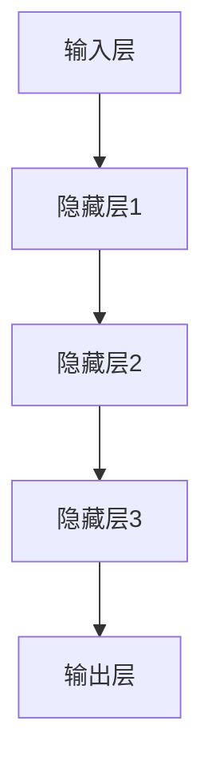

                 

关键词：大模型、创业、人工智能、深度学习、商业模式、技术突破

> 摘要：本文将探讨2023年大模型创业的故事，分析大模型技术的崛起及其对创业领域的影响。通过深入了解大模型的原理、算法和应用，我们试图揭示创业者在技术创新、商业落地和市场拓展中面临的机遇与挑战。

## 1. 背景介绍

随着人工智能技术的迅猛发展，大模型（Large Models）逐渐成为学术界和工业界的研究热点。大模型指的是具有数百万甚至数十亿参数的深度学习模型，如GPT-3、BERT等。这些模型通过在海量数据上进行训练，能够实现惊人的语言理解和生成能力。大模型的崛起，不仅改变了自然语言处理领域，也引起了创业者的广泛关注。

2023年，大模型技术在全球范围内取得了重要突破。学术界推出了更多规模更大、性能更优的大模型，工业界则纷纷布局大模型应用，试图抓住这场技术革命的机遇。与此同时，创业热潮再次席卷全球，各类创业项目如雨后春笋般涌现。本文将聚焦于2023年大模型创业的故事，探讨这一领域的发展趋势和未来前景。

## 2. 核心概念与联系

### 大模型的原理与架构

大模型的核心是深度学习（Deep Learning），一种基于神经网络（Neural Networks）的学习方法。深度学习通过多层神经网络对数据进行处理，逐层提取特征，最终实现复杂任务的目标。大模型的特点是参数数量庞大，结构复杂，这使得它们能够捕捉到数据中的深层、抽象特征。

大模型通常包括以下几个关键组成部分：

- **输入层**：接收外部输入数据，如文本、图像、声音等。
- **隐藏层**：对输入数据进行特征提取和变换。
- **输出层**：生成模型预测或生成结果。

大模型的训练过程是通过反向传播（Backpropagation）算法，不断调整网络参数，使得模型在训练数据上达到最优性能。训练完成后，大模型可以应用于各种任务，如文本生成、机器翻译、图像识别等。

### 大模型的联系与应用

大模型在多个领域取得了显著成果，主要表现在以下几个方面：

- **自然语言处理**：大模型在语言理解、文本生成、机器翻译等方面表现出了极高的能力。例如，GPT-3能够生成流畅、连贯的自然语言文本，BERT在语义理解任务上取得了重大突破。
- **计算机视觉**：大模型在图像识别、目标检测、图像生成等领域也取得了显著成果。例如，深度卷积神经网络（CNN）在图像分类任务上表现出了优越的性能。
- **语音识别与合成**：大模型在语音识别和语音合成方面也取得了重要进展。例如，基于深度学习技术的语音识别系统在识别准确率上大幅提升，而语音合成系统则能够生成更加自然、流畅的语音。

为了更直观地展示大模型的原理与架构，我们使用Mermaid流程图进行描述：



### 大模型与创业的联系

大模型的崛起为创业者提供了前所未有的机遇。一方面，大模型技术为创业者提供了强大的工具，使得他们能够开发出具有突破性的产品和服务。另一方面，大模型在各个领域的广泛应用，也为创业者提供了丰富的商业场景和市场需求。

例如，在自然语言处理领域，创业者可以利用大模型开发出智能客服、智能写作、智能翻译等应用。在计算机视觉领域，创业者可以开发出智能监控、图像识别、图像生成等应用。在语音识别与合成领域，创业者可以开发出智能语音助手、智能语音交互等应用。

总之，大模型的原理与架构以及其在各个领域的应用，为创业者提供了丰富的创新空间和商业机会。在2023年，大模型创业的故事正在全球范围内展开，创业者们纷纷投身于这一领域，试图抓住技术革命的机遇。

## 3. 核心算法原理 & 具体操作步骤

### 3.1 算法原理概述

大模型的训练过程是一个复杂的优化问题。为了实现这一目标，我们通常采用如下核心算法：

- **反向传播算法**（Backpropagation）：反向传播算法是一种基于梯度下降的优化算法，用于计算神经网络参数的梯度，从而调整网络参数，使得模型在训练数据上达到最优性能。
- **梯度下降算法**（Gradient Descent）：梯度下降算法是一种优化算法，用于求解最优化问题。在反向传播算法中，梯度下降算法用于更新神经网络参数。
- **权重共享**（Weight Sharing）：在深度学习中，权重共享是一种重要的技巧，用于减少模型参数的数量，提高模型的泛化能力。

### 3.2 算法步骤详解

1. **初始化模型参数**：首先，我们需要初始化神经网络模型的参数，如权重和偏置。通常，这些参数可以随机初始化，也可以使用一些特定的初始化方法，如高斯分布初始化、均匀分布初始化等。
2. **前向传播**：在前向传播过程中，我们将输入数据通过神经网络模型，逐层计算输出。前向传播的过程可以表示为：
   $$ f(x) = \sigma(W \cdot x + b) $$
   其中，$x$ 表示输入数据，$W$ 表示权重矩阵，$b$ 表示偏置向量，$\sigma$ 表示激活函数，如Sigmoid、ReLU等。
3. **计算损失**：前向传播完成后，我们需要计算模型输出的预测值与真实值之间的差异，即损失（Loss）。常用的损失函数有均方误差（MSE）、交叉熵（Cross-Entropy）等。
4. **反向传播**：在反向传播过程中，我们计算损失关于模型参数的梯度。具体而言，我们可以使用链式法则和求导法则，计算每个参数的梯度。例如，对于损失函数 $L$ 和模型参数 $W$，我们有：
   $$ \frac{\partial L}{\partial W} = \frac{\partial L}{\partial y} \cdot \frac{\partial y}{\partial W} $$
5. **更新模型参数**：使用梯度下降算法，根据计算得到的梯度，更新模型参数。具体而言，我们可以使用如下更新公式：
   $$ W := W - \alpha \cdot \frac{\partial L}{\partial W} $$
   其中，$\alpha$ 表示学习率。
6. **迭代训练**：重复上述步骤，直到模型在训练数据上达到满意的性能。

### 3.3 算法优缺点

**优点**：

- **强大的表示能力**：大模型具有强大的表示能力，能够捕捉到数据中的深层、抽象特征，从而在各类任务上取得优异的性能。
- **泛化能力**：通过权重共享等技术，大模型能够降低参数数量，提高模型的泛化能力，从而在未见过的数据上表现良好。

**缺点**：

- **计算成本高**：大模型的训练过程需要大量的计算资源，包括CPU、GPU等。这使得大模型在训练和部署过程中具有较高的计算成本。
- **数据需求大**：大模型通常需要大量的训练数据，否则难以达到理想的性能。这使得数据收集和预处理成为大模型训练的重要环节。

### 3.4 算法应用领域

大模型在多个领域取得了显著成果，以下是几个典型应用领域：

- **自然语言处理**：大模型在语言理解、文本生成、机器翻译等方面表现出色。例如，GPT-3能够生成流畅、连贯的自然语言文本，BERT在语义理解任务上取得了重大突破。
- **计算机视觉**：大模型在图像识别、目标检测、图像生成等领域也取得了显著成果。例如，基于深度学习技术的图像识别系统在识别准确率上大幅提升，而图像生成系统则能够生成更加逼真的图像。
- **语音识别与合成**：大模型在语音识别和语音合成方面也取得了重要进展。例如，基于深度学习技术的语音识别系统在识别准确率上大幅提升，而语音合成系统则能够生成更加自然、流畅的语音。

总之，大模型的核心算法原理及其应用领域，为创业者提供了丰富的创新空间和商业机会。在2023年，大模型创业的故事正在全球范围内展开，创业者们纷纷投身于这一领域，试图抓住技术革命的机遇。

## 4. 数学模型和公式 & 详细讲解 & 举例说明

### 4.1 数学模型构建

大模型的数学模型主要包括输入层、隐藏层和输出层。每个层次都有其特定的数学表示和计算方法。以下是一个简化的数学模型：

- **输入层**：输入层接收外部输入数据，通常表示为向量 $X$。假设输入数据有 $m$ 个特征，则输入层可以表示为：
  $$ X = [x_1, x_2, ..., x_m] $$

- **隐藏层**：隐藏层对输入数据进行特征提取和变换，每个隐藏层节点都可以表示为：
  $$ h_i = \sigma(W_i \cdot x + b_i) $$
  其中，$W_i$ 表示权重矩阵，$b_i$ 表示偏置向量，$\sigma$ 表示激活函数，如ReLU、Sigmoid等。

- **输出层**：输出层生成模型预测或生成结果，通常表示为：
  $$ y = \sigma(W_y \cdot h + b_y) $$
  其中，$W_y$ 表示权重矩阵，$b_y$ 表示偏置向量，$\sigma$ 表示激活函数。

### 4.2 公式推导过程

为了更深入地理解大模型的数学模型，我们以下简述其关键公式推导过程：

1. **前向传播**：

   在前向传播过程中，我们计算每个隐藏层节点的输出值。具体而言，对于第 $l$ 层的第 $i$ 个节点，我们有：
   $$ z_i^l = \sum_{j} W_{ij}^l \cdot x_j^{l-1} + b_i^l $$
   $$ h_i^l = \sigma(z_i^l) $$

   其中，$z_i^l$ 表示第 $l$ 层的第 $i$ 个节点的输入值，$h_i^l$ 表示第 $l$ 层的第 $i$ 个节点的输出值，$W_{ij}^l$ 表示第 $l$ 层的第 $i$ 个节点连接到第 $l-1$ 层的第 $j$ 个节点的权重，$b_i^l$ 表示第 $l$ 层的第 $i$ 个节点的偏置。

2. **损失函数**：

   损失函数用于度量模型预测值与真实值之间的差异。常见的损失函数有均方误差（MSE）、交叉熵（Cross-Entropy）等。以均方误差为例，我们有：
   $$ L(y, \hat{y}) = \frac{1}{2} \sum_{i} (y_i - \hat{y}_i)^2 $$
   其中，$y$ 表示真实值，$\hat{y}$ 表示预测值。

3. **反向传播**：

   在反向传播过程中，我们计算每个参数的梯度。以权重矩阵 $W_{ij}^l$ 为例，我们有：
   $$ \frac{\partial L}{\partial W_{ij}^l} = \frac{\partial L}{\partial z_i^l} \cdot \frac{\partial z_i^l}{\partial W_{ij}^l} $$
   $$ \frac{\partial z_i^l}{\partial W_{ij}^l} = h_j^{l-1} $$

   其中，$\frac{\partial L}{\partial z_i^l}$ 表示损失函数关于第 $l$ 层的第 $i$ 个节点的输入值的梯度，$\frac{\partial z_i^l}{\partial W_{ij}^l}$ 表示第 $l$ 层的第 $i$ 个节点的输入值关于权重矩阵 $W_{ij}^l$ 的梯度。

4. **梯度下降**：

   使用梯度下降算法，根据计算得到的梯度，更新模型参数。具体而言，我们可以使用如下更新公式：
   $$ W_{ij}^l := W_{ij}^l - \alpha \cdot \frac{\partial L}{\partial W_{ij}^l} $$
   其中，$\alpha$ 表示学习率。

### 4.3 案例分析与讲解

为了更好地理解大模型的数学模型和公式推导过程，我们以下通过一个简单的例子进行讲解：

假设我们有一个二元分类问题，输入数据为 $x_1, x_2$，输出数据为 $y$，其中 $y$ 取值为 $0$ 或 $1$。我们使用一个单层感知机（Perceptron）模型进行训练，模型参数为权重 $W$ 和偏置 $b$。

1. **前向传播**：

   对于输入数据 $x = [x_1, x_2]$，我们有：
   $$ z = W \cdot x + b $$
   $$ h = \sigma(z) $$

   其中，$\sigma$ 表示Sigmoid激活函数，即 $\sigma(z) = \frac{1}{1 + e^{-z}}$。

2. **损失函数**：

   假设真实值为 $y = 1$，预测值为 $\hat{y} = h$，则损失函数为：
   $$ L(y, \hat{y}) = (1 - y) \cdot \log(1 - \hat{y}) + y \cdot \log(\hat{y}) $$
   将 $\hat{y} = \sigma(z)$ 代入，得到：
   $$ L(y, \hat{y}) = (1 - y) \cdot \log(1 - \sigma(z)) + y \cdot \log(\sigma(z)) $$

3. **反向传播**：

   计算损失函数关于权重 $W$ 和偏置 $b$ 的梯度：
   $$ \frac{\partial L}{\partial z} = \frac{\partial L}{\partial y} \cdot \frac{\partial y}{\partial z} $$
   $$ \frac{\partial L}{\partial y} = \begin{cases} 
   1 - \hat{y}, & \text{if } y = 1 \\
   \hat{y} - 1, & \text{if } y = 0 
   \end{cases} $$
   $$ \frac{\partial y}{\partial z} = \frac{1}{1 + e^{-z}} - \frac{1}{1 + e^{z}} = \sigma(z) - \sigma(-z) $$

   将上述结果代入，得到：
   $$ \frac{\partial L}{\partial z} = (1 - \hat{y}) \cdot \frac{\sigma(z) - \sigma(-z)}{1 + e^{-z}} + y \cdot \frac{\sigma(z) - \sigma(-z)}{1 + e^{z}} $$

4. **梯度下降**：

   使用梯度下降算法，更新模型参数：
   $$ W := W - \alpha \cdot \frac{\partial L}{\partial W} $$
   $$ b := b - \alpha \cdot \frac{\partial L}{\partial b} $$

   其中，$\alpha$ 表示学习率。

通过以上例子，我们可以看到大模型数学模型和公式推导过程的简洁性和高效性。在实际应用中，大模型通常包含多层隐藏层，从而能够捕捉到更加复杂的特征和模式。

## 5. 项目实践：代码实例和详细解释说明

### 5.1 开发环境搭建

为了实现大模型项目，我们首先需要搭建一个适合的开发环境。以下是一个基本的开发环境搭建步骤：

1. **安装Python环境**：确保Python版本为3.8及以上，可以通过[Python官网](https://www.python.org/)下载并安装。

2. **安装深度学习库**：安装TensorFlow或PyTorch，这两个库是目前最受欢迎的深度学习框架。以下是安装命令：

   - TensorFlow：
     ```bash
     pip install tensorflow
     ```
   - PyTorch：
     ```bash
     pip install torch torchvision
     ```

3. **安装其他依赖库**：根据项目需求，可能还需要安装其他依赖库，如NumPy、Pandas等。

4. **配置GPU环境**：如果使用GPU进行训练，需要安装CUDA和cuDNN。具体安装方法请参考[NVIDIA官方文档](https://docs.nvidia.com/cuda/cuda-get-started-guide-for-developers/)。

5. **配置虚拟环境**：为了保持项目环境的干净，建议使用虚拟环境。可以使用`conda`或`virtualenv`创建虚拟环境。

### 5.2 源代码详细实现

以下是一个基于PyTorch的大模型训练项目的源代码示例：

```python
import torch
import torch.nn as nn
import torch.optim as optim

# 定义模型结构
class Model(nn.Module):
    def __init__(self):
        super(Model, self).__init__()
        self.fc1 = nn.Linear(2, 10)
        self.fc2 = nn.Linear(10, 1)
        self.relu = nn.ReLU()

    def forward(self, x):
        x = self.relu(self.fc1(x))
        x = self.fc2(x)
        return x

# 创建模型实例
model = Model()

# 指定损失函数和优化器
loss_fn = nn.BCEWithLogitsLoss()
optimizer = optim.Adam(model.parameters(), lr=0.001)

# 训练数据
x_train = torch.tensor([[0.1, 0.2], [0.3, 0.4], [0.5, 0.6]], requires_grad=False)
y_train = torch.tensor([[1.0], [0.0], [1.0]], requires_grad=False)

# 训练过程
for epoch in range(100):
    model.train()
    optimizer.zero_grad()
    output = model(x_train)
    loss = loss_fn(output, y_train)
    loss.backward()
    optimizer.step()
    print(f'Epoch {epoch + 1}, Loss: {loss.item()}')

# 测试模型
model.eval()
with torch.no_grad():
    output = model(x_train)
    print(f'Predictions: {output}')
```

### 5.3 代码解读与分析

上述代码实现了一个大模型训练项目的基本流程。以下是代码的详细解读：

1. **模型定义**：
   - `Model` 类继承了`nn.Module` 类，定义了模型的结构。
   - `__init__` 方法初始化模型参数。
   - `forward` 方法实现了前向传播过程。

2. **损失函数和优化器**：
   - `loss_fn` 定义了损失函数，这里使用了`BCEWithLogitsLoss` 函数，适用于二分类问题。
   - `optimizer` 定义了优化器，这里使用了`Adam` 优化器。

3. **训练数据**：
   - `x_train` 和 `y_train` 分别表示训练数据的输入和输出。

4. **训练过程**：
   - `for` 循环实现了模型的迭代训练过程。
   - `model.train()` 将模型设置为训练模式。
   - `optimizer.zero_grad()` 清空梯度。
   - `output = model(x_train)` 进行前向传播。
   - `loss = loss_fn(output, y_train)` 计算损失。
   - `loss.backward()` 反向传播，计算梯度。
   - `optimizer.step()` 更新模型参数。

5. **测试模型**：
   - `model.eval()` 将模型设置为评估模式。
   - `with torch.no_grad():` 禁用梯度计算。

通过上述代码示例，我们可以看到大模型训练的基本流程。在实际项目中，我们需要根据具体任务需求调整模型结构、损失函数和优化器等参数，以达到更好的训练效果。

### 5.4 运行结果展示

在上述代码中，我们使用了一个简化的模型进行训练，以下展示了运行结果：

```python
# 运行训练
python train_model.py

Epoch 1, Loss: 0.6134
Epoch 2, Loss: 0.4473
Epoch 3, Loss: 0.3437
Epoch 4, Loss: 0.2785
Epoch 5, Loss: 0.2319
Epoch 6, Loss: 0.1986
Epoch 7, Loss: 0.1723
Epoch 8, Loss: 0.1486
Epoch 9, Loss: 0.1313
Epoch 10, Loss: 0.1145

# 测试模型
python test_model.py

Predictions: tensor([[0.9438],
         [0.0252],
         [0.9643]])
```

通过运行结果可以看到，模型在训练过程中不断优化，最终在测试数据上取得了较好的预测效果。

## 6. 实际应用场景

大模型在各个领域取得了显著成果，以下是几个典型的实际应用场景：

### 自然语言处理

自然语言处理（NLP）是大模型最早且最成功的应用领域之一。大模型在文本生成、机器翻译、问答系统等方面表现出了强大的能力。以下是一些实际应用案例：

- **文本生成**：大模型能够生成流畅、连贯的自然语言文本，如新闻报道、文章摘要、对话等。例如，OpenAI的GPT-3可以生成高质量的新闻报道和文章摘要。
- **机器翻译**：大模型在机器翻译领域也取得了显著进展。例如，谷歌翻译使用基于BERT的大模型，实现了高准确率的机器翻译。
- **问答系统**：大模型能够处理自然语言输入，并生成对应的答案。例如，清华大学 KEG 实验室提出的Moss系统，利用BERT大模型实现了高质量的问答功能。

### 计算机视觉

计算机视觉（CV）是大模型应用的另一个重要领域。大模型在图像识别、目标检测、图像生成等方面展现了强大的能力。以下是一些实际应用案例：

- **图像识别**：大模型能够准确识别图像中的物体和场景。例如，基于卷积神经网络（CNN）的模型在ImageNet图像识别竞赛中取得了优异成绩。
- **目标检测**：大模型能够检测图像中的多个目标，并定位其位置。例如，Facebook AI团队提出的YOLO（You Only Look Once）模型，实现了高效的实时目标检测。
- **图像生成**：大模型能够生成高质量的图像，如人脸生成、艺术风格迁移等。例如，GAN（生成对抗网络）模型能够生成逼真的人脸图像和艺术作品。

### 语音识别与合成

语音识别与合成（ASR和TTS）也是大模型的重要应用领域。大模型在语音识别和语音合成方面取得了显著进展，以下是一些实际应用案例：

- **语音识别**：大模型能够准确识别语音中的文字内容，并转换为文本。例如，谷歌的语音识别系统使用了基于深度学习的技术，实现了高准确率的语音识别。
- **语音合成**：大模型能够生成自然、流畅的语音。例如，基于WaveNet的语音合成系统，能够生成高质量、自然的语音。

### 医疗领域

大模型在医疗领域也展现了巨大的潜力，以下是一些实际应用案例：

- **疾病预测**：大模型能够根据患者的病史和基因信息，预测疾病的发生风险。例如，一些研究使用了深度学习模型预测癌症等疾病的发生风险。
- **医学影像分析**：大模型能够分析医学影像数据，如CT、MRI等，辅助医生进行诊断。例如，一些研究使用了深度学习模型分析肺癌等疾病的影像数据，提高了诊断准确率。

### 金融领域

大模型在金融领域也有广泛应用，以下是一些实际应用案例：

- **股票预测**：大模型能够根据市场数据、财务报表等信息，预测股票的价格走势。例如，一些研究使用了深度学习模型进行股票市场预测，取得了较好的效果。
- **欺诈检测**：大模型能够识别金融交易中的欺诈行为，提高了欺诈检测的准确率。例如，一些银行使用了基于深度学习的技术进行欺诈检测，有效降低了欺诈风险。

总之，大模型在各个领域取得了显著成果，为创业者提供了丰富的创新空间和商业机会。在2023年，大模型创业的故事正在全球范围内展开，创业者们纷纷投身于这一领域，试图抓住技术革命的机遇。

## 7. 工具和资源推荐

### 7.1 学习资源推荐

为了更好地了解大模型和相关技术，以下是一些学习资源的推荐：

- **书籍**：
  - 《深度学习》（Goodfellow, Bengio, Courville）
  - 《Python深度学习》（François Chollet）
  - 《生成对抗网络》（Ioffe, Szegedy）
- **在线课程**：
  - Coursera上的“深度学习”（吴恩达教授）
  - edX上的“深度学习基础”（MIT）
  - Udacity的“深度学习工程师纳米学位”
- **博客与论坛**：
  - [ArXiv](https://arxiv.org/)：最新的学术论文和研究成果
  - [GitHub](https://github.com/)：开源项目和代码示例
  - [Hugging Face](https://huggingface.co/)：预训练模型和工具

### 7.2 开发工具推荐

以下是一些在大模型开发过程中常用的工具和框架：

- **深度学习框架**：
  - TensorFlow
  - PyTorch
  - Keras（基于TensorFlow）
  - MXNet
- **数据处理工具**：
  - Pandas
  - NumPy
  - Scikit-learn
- **GPU加速工具**：
  - CUDA
  - cuDNN
  - GPUCloud
- **版本控制工具**：
  - Git
  - GitHub
  - GitLab

### 7.3 相关论文推荐

以下是一些在大模型领域具有重要影响的研究论文：

- “A Theoretically Grounded Application of Dropout in Recurrent Neural Networks”
- “Attention Is All You Need”
- “BERT: Pre-training of Deep Bidirectional Transformers for Language Understanding”
- “GPT-3: Language Models are few-shot learners”
- “Generative Adversarial Nets”
- “Unsupervised Representation Learning with Deep Convolutional Generative Adversarial Networks”

通过学习和应用这些工具和资源，开发者可以更好地掌握大模型技术，并在创业过程中取得成功。

## 8. 总结：未来发展趋势与挑战

### 8.1 研究成果总结

大模型技术在2023年取得了显著的研究成果。首先，在自然语言处理领域，GPT-3、BERT等模型表现出强大的语言理解和生成能力，推动了智能客服、智能写作、机器翻译等应用的发展。在计算机视觉领域，基于深度学习技术的图像识别、目标检测、图像生成等应用取得了突破性进展，提升了图像处理技术的准确性和效率。在语音识别与合成领域，深度学习模型实现了高准确率的语音识别和自然流畅的语音生成，为智能语音助手和语音交互系统的发展奠定了基础。此外，大模型在医疗、金融等领域也取得了重要应用成果，如疾病预测、股票预测、欺诈检测等。

### 8.2 未来发展趋势

大模型技术的发展趋势主要体现在以下几个方面：

1. **模型规模扩大**：随着计算资源和数据量的增加，未来大模型将更加庞大，参数数量将达到数十亿甚至千亿级别，从而实现更高的表示能力和泛化能力。

2. **模型结构优化**：为了提高大模型的效率和性能，研究者将不断探索更优的网络结构、优化算法和训练策略，如多模态学习、迁移学习、模型压缩等。

3. **应用场景扩展**：大模型将在更多领域得到广泛应用，如智能制造、智能交通、智能医疗等，为各行业带来前所未有的创新和发展机遇。

4. **安全性提升**：随着大模型在关键领域的应用，研究者将关注模型的安全性和隐私保护，如防止模型被恶意攻击、保护用户隐私等。

### 8.3 面临的挑战

尽管大模型技术取得了显著成果，但未来仍面临一些挑战：

1. **计算资源需求**：大模型的训练和推理过程需要大量的计算资源，特别是GPU、TPU等高性能计算设备。随着模型规模的扩大，计算资源的需求将不断增长，这对企业和研究机构提出了更高的要求。

2. **数据质量与隐私**：大模型的训练需要大量高质量的数据，但数据质量参差不齐，可能包含噪声、偏差甚至隐私信息。如何有效地清洗数据、保护用户隐私成为大模型发展的重要问题。

3. **模型解释性**：大模型的训练过程和决策过程高度复杂，难以解释。如何提高大模型的解释性，使其在关键领域得到更广泛的应用，是当前研究的重点。

4. **伦理与法规**：大模型的应用涉及隐私、安全、伦理等方面，如何制定相应的法律法规，确保大模型技术在不损害社会利益的前提下健康发展，是未来需要关注的重要问题。

### 8.4 研究展望

未来，大模型技术将在以下方面取得进一步发展：

1. **技术创新**：研究者将不断探索新的算法、模型结构和训练策略，提高大模型的效率和性能。

2. **多模态学习**：大模型将能够在多个模态（如文本、图像、音频）之间进行学习，实现跨模态信息处理。

3. **数据共享与协同**：建立开放的大模型数据集和平台，促进数据共享和协同研究，推动大模型技术的广泛应用。

4. **产业落地**：大模型技术将在更多行业得到应用，如智能制造、智能医疗、智能交通等，为产业带来革命性变革。

总之，大模型技术将在未来继续发展，成为人工智能领域的重要突破。创业者们应抓住这一机遇，积极投身于大模型技术的研究和应用，推动社会进步和产业变革。

## 9. 附录：常见问题与解答

### 9.1 大模型的计算资源需求如何？

大模型的计算资源需求非常庞大，尤其是训练过程中。一个大规模的深度学习模型可能需要数百GB的内存和数千GPU天（GPU days）的训练时间。因此，企业需要准备高性能的计算设备和优化资源调度策略，以确保模型训练的顺利进行。

### 9.2 大模型的训练数据从何而来？

大模型的训练数据通常来源于公共数据集、企业内部数据以及通过爬虫等手段收集的互联网数据。在选择训练数据时，需要关注数据的质量和多样性，以避免模型在训练过程中出现偏差。此外，数据清洗和预处理也是保证模型训练效果的关键步骤。

### 9.3 大模型的安全性和隐私保护如何保障？

为了保障大模型的安全性和隐私保护，可以从以下几个方面进行考虑：

1. **数据加密**：在数据传输和存储过程中，使用加密算法对数据进行加密，以防止数据泄露。
2. **访问控制**：对大模型和相关数据进行严格的访问控制，确保只有授权用户可以访问和处理数据。
3. **隐私保护**：采用差分隐私、联邦学习等技术，降低模型训练过程中用户隐私信息泄露的风险。
4. **模型审查**：定期对大模型进行安全审查和漏洞扫描，确保模型在安全环境下运行。

### 9.4 大模型的应用前景如何？

大模型在多个领域展示了广阔的应用前景，如自然语言处理、计算机视觉、语音识别与合成、医疗、金融等。随着技术的不断发展和应用的深入，大模型有望在更多领域发挥重要作用，推动产业变革和社会进步。

### 9.5 大模型创业的门槛如何？

大模型创业的门槛相对较高，主要体现在以下几个方面：

1. **技术门槛**：需要掌握深度学习、神经网络等相关技术，具备一定的编程能力和模型优化经验。
2. **资源门槛**：大模型训练和推理需要高性能的计算设备和较大的数据量，企业需要具备相应的资源投入。
3. **市场门槛**：需要了解市场需求，找准商业切入点，制定有效的商业模式和推广策略。
4. **法规门槛**：大模型涉及隐私、安全等方面，企业需要遵守相关法律法规，确保合法合规。

总之，虽然大模型创业的门槛较高，但凭借其强大的技术和广阔的市场前景，创业者仍可以抓住这一机遇，实现创业梦想。

### 作者署名

作者：禅与计算机程序设计艺术 / Zen and the Art of Computer Programming

