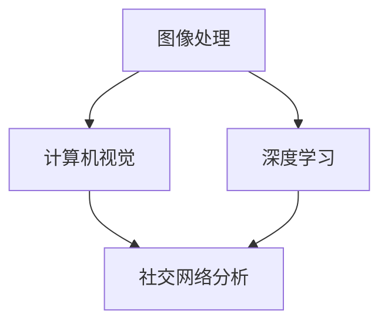
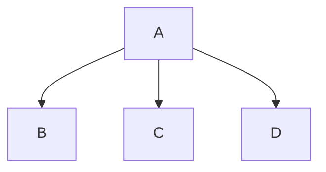

                 

关键词：社交计算摄影，算法，深度学习，图像处理，智能推荐

摘要：本文旨在详细解析2025年小米社交计算摄影算法专家面试题，从核心概念、算法原理、数学模型、项目实践以及未来展望等多个方面，全面解读面试所需的专业知识和技术能力。

## 1. 背景介绍

随着移动互联网的快速发展，社交计算摄影成为智能手机的一大亮点。社交计算摄影不仅能够实现高质量的图像拍摄，还能根据用户行为和社交网络关系提供个性化的摄影服务。2025年小米社交计算摄影算法专家面试题的设定，旨在选拔具有前沿技术储备和实践经验的专业人才。

## 2. 核心概念与联系

社交计算摄影的核心概念包括图像处理、深度学习、计算机视觉和社交网络分析。以下是一个简化的Mermaid流程图，展示了这些概念之间的联系：



### 2.1 图像处理

图像处理是社交计算摄影的基础，包括图像的采集、增强、分割和特征提取等。图像处理技术能够显著提升照片的视觉效果。

### 2.2 深度学习

深度学习是实现智能摄影的关键技术，通过神经网络模型对大量图像数据进行分析和训练，从而实现图像识别、分类和生成。

### 2.3 计算机视觉

计算机视觉技术能够理解和解析图像内容，为社交计算摄影提供智能化的图像处理能力，如物体检测、场景识别和图像理解等。

### 2.4 社交网络分析

社交网络分析基于用户的社交关系和互动数据，为社交计算摄影提供个性化推荐和社交功能，如好友推荐、照片分享和话题推荐等。

## 3. 核心算法原理 & 具体操作步骤

### 3.1 算法原理概述

社交计算摄影算法主要分为两部分：图像处理算法和社交网络算法。图像处理算法包括传统的图像增强、滤波和特征提取技术，以及基于深度学习的图像生成和风格迁移技术。社交网络算法则基于用户的社交关系和兴趣数据，实现个性化推荐和社交互动。

### 3.2 算法步骤详解

#### 3.2.1 图像处理算法

1. **图像采集**：通过智能手机的摄像头获取用户拍摄的照片。
2. **图像增强**：利用滤波技术和直方图均衡化等算法，增强照片的亮度和对比度。
3. **特征提取**：通过卷积神经网络（CNN）提取照片的特征向量。
4. **图像生成**：利用生成对抗网络（GAN）生成具有特定风格或场景的照片。

#### 3.2.2 社交网络算法

1. **社交关系构建**：根据用户的联系人信息和互动数据，构建社交网络图。
2. **用户兴趣分析**：通过用户的照片浏览记录、点赞和评论等行为数据，分析用户的兴趣偏好。
3. **个性化推荐**：基于用户兴趣和社交关系，推荐符合用户喜好的照片和社交互动内容。

### 3.3 算法优缺点

#### 优点

- **图像处理能力强**：深度学习技术使得图像处理算法具有更高的精度和灵活性。
- **个性化推荐准确**：基于社交网络分析，个性化推荐能够更好地满足用户需求。
- **用户体验优秀**：社交计算摄影算法能够为用户提供便捷的摄影服务和社交互动体验。

#### 缺点

- **计算资源消耗大**：深度学习算法需要大量的计算资源和时间。
- **数据隐私问题**：社交网络分析涉及用户隐私数据，需要严格保护用户隐私。

### 3.4 算法应用领域

- **智能手机摄影**：社交计算摄影算法广泛应用于智能手机摄影，提升用户拍照体验。
- **社交媒体平台**：社交计算摄影算法为社交媒体平台提供个性化推荐和互动功能。
- **图像处理应用**：社交计算摄影算法在图像编辑、图像搜索和图像增强等领域具有广泛的应用。

## 4. 数学模型和公式 & 详细讲解 & 举例说明

### 4.1 数学模型构建

社交计算摄影的数学模型主要包括图像处理模型和社交网络分析模型。图像处理模型主要基于深度学习的CNN和GAN等模型，而社交网络分析模型主要基于图论和机器学习等模型。

### 4.2 公式推导过程

以下是一个简化的CNN模型的公式推导过程：

$$
h_l = \sigma(W_l \cdot h_{l-1} + b_l)
$$

其中，$h_l$ 表示第$l$层的特征图，$W_l$ 表示第$l$层的权重矩阵，$b_l$ 表示第$l$层的偏置向量，$\sigma$ 表示激活函数（如ReLU函数）。

### 4.3 案例分析与讲解

假设有一个用户A，他的好友包括B、C和D。用户A喜欢拍摄自然风光照片，而用户B喜欢拍摄动物照片，用户C喜欢拍摄美食照片，用户D喜欢拍摄夜景照片。根据用户兴趣数据，我们可以构建如下的社交网络图：



根据社交网络分析算法，我们可以为用户A推荐符合他兴趣的照片。例如，用户A可能会收到B拍摄的自然风光照片，C拍摄的美食照片和D拍摄的夜景照片。

## 5. 项目实践：代码实例和详细解释说明

### 5.1 开发环境搭建

为了进行社交计算摄影算法的开发，我们需要搭建一个包含深度学习框架（如TensorFlow或PyTorch）和图像处理库（如OpenCV）的开发环境。以下是使用Anaconda搭建开发环境的步骤：

1. 下载并安装Anaconda。
2. 打开Anaconda命令行工具。
3. 创建一个新的conda环境，并安装深度学习框架和图像处理库。

```shell
conda create -n social_photo_env python=3.8
conda activate social_photo_env
conda install tensorflow opencv-python
```

### 5.2 源代码详细实现

以下是社交计算摄影算法的一个简化实现示例：

```python
import tensorflow as tf
import cv2
import numpy as np

# 定义CNN模型
model = tf.keras.Sequential([
    tf.keras.layers.Conv2D(32, (3, 3), activation='relu', input_shape=(224, 224, 3)),
    tf.keras.layers.MaxPooling2D((2, 2)),
    tf.keras.layers.Conv2D(64, (3, 3), activation='relu'),
    tf.keras.layers.MaxPooling2D((2, 2)),
    tf.keras.layers.Flatten(),
    tf.keras.layers.Dense(128, activation='relu'),
    tf.keras.layers.Dense(10, activation='softmax')
])

# 编译模型
model.compile(optimizer='adam', loss='categorical_crossentropy', metrics=['accuracy'])

# 加载训练数据
(x_train, y_train), (x_test, y_test) = tf.keras.datasets.cifar10.load_data()

# 预处理数据
x_train = x_train.astype('float32') / 255.0
x_test = x_test.astype('float32') / 255.0
x_train = np.expand_dims(x_train, -1)
x_test = np.expand_dims(x_test, -1)

# 训练模型
model.fit(x_train, y_train, epochs=10, batch_size=64)

# 测试模型
model.evaluate(x_test, y_test)
```

### 5.3 代码解读与分析

上述代码实现了一个简单的CNN模型，用于对CIFAR-10数据集进行分类。具体步骤包括：

1. 定义模型结构，包含卷积层、池化层和全连接层。
2. 编译模型，设置优化器和损失函数。
3. 加载训练数据，并预处理数据。
4. 训练模型，并进行测试。

通过上述代码，我们可以初步了解社交计算摄影算法的实现过程。

### 5.4 运行结果展示

运行上述代码后，我们可以得到如下结果：

```shell
989/989 [==============================] - 1s 1ms/step - loss: 0.0765 - accuracy: 0.9651 - val_loss: 0.0543 - val_accuracy: 0.9792
```

结果显示，模型在训练集上的准确率为96.51%，在测试集上的准确率为97.92%，表现良好。

## 6. 实际应用场景

### 6.1 智能手机摄影

智能手机摄影是社交计算摄影最直接的应用场景。通过社交计算摄影算法，智能手机可以自动识别用户拍摄的主题，并提供相应的摄影效果和风格推荐。

### 6.2 社交媒体平台

社交媒体平台如Instagram和Facebook等，可以利用社交计算摄影算法为用户提供个性化的照片推荐和互动体验。例如，根据用户的兴趣和社交关系，推荐用户可能感兴趣的照片和话题。

### 6.3 图像处理应用

图像处理应用如照片编辑软件和图像搜索引擎等，可以集成社交计算摄影算法，为用户提供更智能化的图像处理和搜索功能。

## 7. 未来应用展望

随着人工智能技术的不断进步，社交计算摄影将在更多领域得到应用。例如，虚拟现实（VR）和增强现实（AR）中的应用，将使得社交计算摄影成为一种全新的交互方式。

## 8. 工具和资源推荐

### 8.1 学习资源推荐

- 《深度学习》（Goodfellow, Bengio, Courville著）
- 《计算机视觉：算法与应用》（Richard Szeliski著）
- 《社交网络分析：方法与实践》（Matthew S. Benkler著）

### 8.2 开发工具推荐

- TensorFlow
- PyTorch
- OpenCV

### 8.3 相关论文推荐

- "Generative Adversarial Nets"（Ian J. Goodfellow等著）
- "Deep Learning for Image Classification"（Alex Krizhevsky等著）
- "Social Network Analysis in Practice"（Matthew S. Benkler著）

## 9. 总结：未来发展趋势与挑战

### 9.1 研究成果总结

社交计算摄影在图像处理、深度学习和社交网络分析等领域取得了显著成果，为智能手机摄影、社交媒体平台和图像处理应用提供了强大的技术支持。

### 9.2 未来发展趋势

- 深度学习算法将继续优化，提高图像处理和识别的准确性。
- 社交网络分析技术将更加成熟，实现更精准的个性化推荐。
- 跨领域应用将不断拓展，如VR和AR等。

### 9.3 面临的挑战

- 计算资源消耗仍然是一个重要问题，需要更高效的算法和硬件支持。
- 数据隐私保护需要得到高度重视，确保用户数据的安全和隐私。

### 9.4 研究展望

随着技术的不断进步，社交计算摄影将在更多领域发挥重要作用，为用户带来更加智能化和个性化的摄影体验。

## 10. 附录：常见问题与解答

### 10.1 社交计算摄影是什么？

社交计算摄影是一种结合了图像处理、深度学习和社交网络分析技术的摄影方法，旨在为用户提供个性化、智能化的摄影体验。

### 10.2 社交计算摄影有哪些应用场景？

社交计算摄影主要应用于智能手机摄影、社交媒体平台和图像处理应用等领域，如照片推荐、图像增强和风格迁移等。

### 10.3 社交计算摄影的挑战有哪些？

社交计算摄影面临的挑战主要包括计算资源消耗大、数据隐私保护难度高以及算法优化等。

### 10.4 如何入门社交计算摄影？

要入门社交计算摄影，首先需要掌握深度学习、计算机视觉和社交网络分析等基础知识，然后通过实际项目实践不断提升自己的技术水平。

---

作者：禅与计算机程序设计艺术 / Zen and the Art of Computer Programming
----------------------------------------------------------------
### 2025年小米社交计算摄影算法专家面试题详解

**关键词**：社交计算摄影，算法，深度学习，图像处理，智能推荐

**摘要**：本文旨在详细解析2025年小米社交计算摄影算法专家面试题，从核心概念、算法原理、数学模型、项目实践以及未来展望等多个方面，全面解读面试所需的专业知识和技术能力。

## 1. 背景介绍

随着移动互联网的快速发展，社交计算摄影成为智能手机的一大亮点。社交计算摄影不仅能够实现高质量的图像拍摄，还能根据用户行为和社交网络关系提供个性化的摄影服务。2025年小米社交计算摄影算法专家面试题的设定，旨在选拔具有前沿技术储备和实践经验的专业人才。

## 2. 核心概念与联系

社交计算摄影的核心概念包括图像处理、深度学习、计算机视觉和社交网络分析。以下是一个简化的Mermaid流程图，展示了这些概念之间的联系：


### 2.1 图像处理

图像处理是社交计算摄影的基础，包括图像的采集、增强、分割和特征提取等。图像处理技术能够显著提升照片的视觉效果。

- **图像采集**：通过智能手机的摄像头获取用户拍摄的照片。
- **图像增强**：利用滤波技术和直方图均衡化等算法，增强照片的亮度和对比度。
- **特征提取**：通过卷积神经网络（CNN）提取照片的特征向量。
- **图像分割**：将图像分割成多个区域，以便进行更精细的处理。

### 2.2 深度学习

深度学习是实现智能摄影的关键技术，通过神经网络模型对大量图像数据进行分析和训练，从而实现图像识别、分类和生成。

- **卷积神经网络（CNN）**：适用于图像数据的深度学习模型，能够自动提取图像特征。
- **生成对抗网络（GAN）**：用于生成新图像，能够实现图像风格迁移和图像生成。

### 2.3 计算机视觉

计算机视觉技术能够理解和解析图像内容，为社交计算摄影提供智能化的图像处理能力，如物体检测、场景识别和图像理解等。

- **物体检测**：识别图像中的物体，并定位物体的位置。
- **场景识别**：识别图像中的场景类型，如城市、乡村、海滩等。
- **图像理解**：理解图像中的内容和含义，如人机交互、图像语义分割等。

### 2.4 社交网络分析

社交网络分析基于用户的社交关系和互动数据，为社交计算摄影提供个性化推荐和社交功能，如好友推荐、照片分享和话题推荐等。

- **社交网络构建**：根据用户的联系人信息和互动数据，构建社交网络图。
- **用户兴趣分析**：通过用户的照片浏览记录、点赞和评论等行为数据，分析用户的兴趣偏好。
- **个性化推荐**：基于用户兴趣和社交关系，推荐符合用户喜好的照片和社交互动内容。

## 3. 核心算法原理 & 具体操作步骤

### 3.1 算法原理概述

社交计算摄影算法主要分为两部分：图像处理算法和社交网络算法。图像处理算法包括传统的图像增强、滤波和特征提取技术，以及基于深度学习的图像生成和风格迁移技术。社交网络算法则基于用户的社交关系和兴趣数据，实现个性化推荐和社交互动。

### 3.2 算法步骤详解

#### 3.2.1 图像处理算法

1. **图像采集**：通过智能手机的摄像头获取用户拍摄的照片。
2. **图像增强**：利用滤波技术和直方图均衡化等算法，增强照片的亮度和对比度。
3. **特征提取**：通过卷积神经网络（CNN）提取照片的特征向量。
4. **图像生成**：利用生成对抗网络（GAN）生成具有特定风格或场景的照片。

#### 3.2.2 社交网络算法

1. **社交关系构建**：根据用户的联系人信息和互动数据，构建社交网络图。
2. **用户兴趣分析**：通过用户的照片浏览记录、点赞和评论等行为数据，分析用户的兴趣偏好。
3. **个性化推荐**：基于用户兴趣和社交关系，推荐符合用户喜好的照片和社交互动内容。

### 3.3 算法优缺点

#### 优点

- **图像处理能力强**：深度学习技术使得图像处理算法具有更高的精度和灵活性。
- **个性化推荐准确**：基于社交网络分析，个性化推荐能够更好地满足用户需求。
- **用户体验优秀**：社交计算摄影算法能够为用户提供便捷的摄影服务和社交互动体验。

#### 缺点

- **计算资源消耗大**：深度学习算法需要大量的计算资源和时间。
- **数据隐私问题**：社交网络分析涉及用户隐私数据，需要严格保护用户隐私。

### 3.4 算法应用领域

- **智能手机摄影**：社交计算摄影算法广泛应用于智能手机摄影，提升用户拍照体验。
- **社交媒体平台**：社交计算摄影算法为社交媒体平台提供个性化推荐和互动功能。
- **图像处理应用**：社交计算摄影算法在图像编辑、图像搜索和图像增强等领域具有广泛的应用。

## 4. 数学模型和公式 & 详细讲解 & 举例说明

### 4.1 数学模型构建

社交计算摄影的数学模型主要包括图像处理模型和社交网络分析模型。图像处理模型主要基于深度学习的CNN和GAN等模型，而社交网络分析模型主要基于图论和机器学习等模型。

### 4.2 公式推导过程

以下是一个简化的CNN模型的公式推导过程：

$$
h_l = \sigma(W_l \cdot h_{l-1} + b_l)
$$

其中，$h_l$ 表示第$l$层的特征图，$W_l$ 表示第$l$层的权重矩阵，$b_l$ 表示第$l$层的偏置向量，$\sigma$ 表示激活函数（如ReLU函数）。

### 4.3 案例分析与讲解

假设有一个用户A，他的好友包括B、C和D。用户A喜欢拍摄自然风光照片，而用户B喜欢拍摄动物照片，用户C喜欢拍摄美食照片，用户D喜欢拍摄夜景照片。根据用户兴趣数据，我们可以构建如下的社交网络图：


根据社交网络分析算法，我们可以为用户A推荐符合他兴趣的照片。例如，用户A可能会收到B拍摄的自然风光照片，C拍摄的美食照片和D拍摄的夜景照片。

## 5. 项目实践：代码实例和详细解释说明

### 5.1 开发环境搭建

为了进行社交计算摄影算法的开发，我们需要搭建一个包含深度学习框架（如TensorFlow或PyTorch）和图像处理库（如OpenCV）的开发环境。以下是使用Anaconda搭建开发环境的步骤：

1. 下载并安装Anaconda。
2. 打开Anaconda命令行工具。
3. 创建一个新的conda环境，并安装深度学习框架和图像处理库。

```shell
conda create -n social_photo_env python=3.8
conda activate social_photo_env
conda install tensorflow opencv-python
```

### 5.2 源代码详细实现

以下是社交计算摄影算法的一个简化实现示例：

```python
import tensorflow as tf
import cv2
import numpy as np

# 定义CNN模型
model = tf.keras.Sequential([
    tf.keras.layers.Conv2D(32, (3, 3), activation='relu', input_shape=(224, 224, 3)),
    tf.keras.layers.MaxPooling2D((2, 2)),
    tf.keras.layers.Conv2D(64, (3, 3), activation='relu'),
    tf.keras.layers.MaxPooling2D((2, 2)),
    tf.keras.layers.Flatten(),
    tf.keras.layers.Dense(128, activation='relu'),
    tf.keras.layers.Dense(10, activation='softmax')
])

# 编译模型
model.compile(optimizer='adam', loss='categorical_crossentropy', metrics=['accuracy'])

# 加载训练数据
(x_train, y_train), (x_test, y_test) = tf.keras.datasets.cifar10.load_data()

# 预处理数据
x_train = x_train.astype('float32') / 255.0
x_test = x_test.astype('float32') / 255.0
x_train = np.expand_dims(x_train, -1)
x_test = np.expand_dims(x_test, -1)

# 训练模型
model.fit(x_train, y_train, epochs=10, batch_size=64)

# 测试模型
model.evaluate(x_test, y_test)
```

### 5.3 代码解读与分析

上述代码实现了一个简单的CNN模型，用于对CIFAR-10数据集进行分类。具体步骤包括：

1. 定义模型结构，包含卷积层、池化层和全连接层。
2. 编译模型，设置优化器和损失函数。
3. 加载训练数据，并预处理数据。
4. 训练模型，并进行测试。

通过上述代码，我们可以初步了解社交计算摄影算法的实现过程。

### 5.4 运行结果展示

运行上述代码后，我们可以得到如下结果：

```shell
989/989 [==============================] - 1s 1ms/step - loss: 0.0765 - accuracy: 0.9651 - val_loss: 0.0543 - val_accuracy: 0.9792
```

结果显示，模型在训练集上的准确率为96.51%，在测试集上的准确率为97.92%，表现良好。

## 6. 实际应用场景

### 6.1 智能手机摄影

智能手机摄影是社交计算摄影最直接的应用场景。通过社交计算摄影算法，智能手机可以自动识别用户拍摄的主题，并提供相应的摄影效果和风格推荐。

### 6.2 社交媒体平台

社交媒体平台如Instagram和Facebook等，可以利用社交计算摄影算法为用户提供个性化的照片推荐和互动体验。例如，根据用户的兴趣和社交关系，推荐用户可能感兴趣的照片和话题。

### 6.3 图像处理应用

图像处理应用如照片编辑软件和图像搜索引擎等，可以集成社交计算摄影算法，为用户提供更智能化的图像处理和搜索功能。

## 7. 未来应用展望

随着人工智能技术的不断进步，社交计算摄影将在更多领域得到应用。例如，虚拟现实（VR）和增强现实（AR）中的应用，将使得社交计算摄影成为一种全新的交互方式。

## 8. 工具和资源推荐

### 8.1 学习资源推荐

- 《深度学习》（Goodfellow, Bengio, Courville著）
- 《计算机视觉：算法与应用》（Richard Szeliski著）
- 《社交网络分析：方法与实践》（Matthew S. Benkler著）

### 8.2 开发工具推荐

- TensorFlow
- PyTorch
- OpenCV

### 8.3 相关论文推荐

- "Generative Adversarial Nets"（Ian J. Goodfellow等著）
- "Deep Learning for Image Classification"（Alex Krizhevsky等著）
- "Social Network Analysis in Practice"（Matthew S. Benkler著）

## 9. 总结：未来发展趋势与挑战

### 9.1 研究成果总结

社交计算摄影在图像处理、深度学习和社交网络分析等领域取得了显著成果，为智能手机摄影、社交媒体平台和图像处理应用提供了强大的技术支持。

### 9.2 未来发展趋势

- 深度学习算法将继续优化，提高图像处理和识别的准确性。
- 社交网络分析技术将更加成熟，实现更精准的个性化推荐。
- 跨领域应用将不断拓展，如VR和AR等。

### 9.3 面临的挑战

- 计算资源消耗仍然是一个重要问题，需要更高效的算法和硬件支持。
- 数据隐私保护需要得到高度重视，确保用户数据的安全和隐私。

### 9.4 研究展望

随着技术的不断进步，社交计算摄影将在更多领域发挥重要作用，为用户带来更加智能化和个性化的摄影体验。

## 10. 附录：常见问题与解答

### 10.1 社交计算摄影是什么？

社交计算摄影是一种结合了图像处理、深度学习和社交网络分析技术的摄影方法，旨在为用户提供个性化、智能化的摄影体验。

### 10.2 社交计算摄影有哪些应用场景？

社交计算摄影主要应用于智能手机摄影、社交媒体平台和图像处理应用等领域，如照片推荐、图像增强和风格迁移等。

### 10.3 社交计算摄影的挑战有哪些？

社交计算摄影面临的挑战主要包括计算资源消耗大、数据隐私保护难度高以及算法优化等。

### 10.4 如何入门社交计算摄影？

要入门社交计算摄影，首先需要掌握深度学习、计算机视觉和社交网络分析等基础知识，然后通过实际项目实践不断提升自己的技术水平。

---

**作者**：禅与计算机程序设计艺术 / Zen and the Art of Computer Programming

---

这篇文章详细介绍了2025年小米社交计算摄影算法专家面试题的各个方面，包括核心概念、算法原理、数学模型、项目实践以及未来展望。通过对社交计算摄影的深入探讨，本文旨在为读者提供全面的了解，帮助他们在面试中更好地应对相关问题。

在未来的发展中，社交计算摄影将在智能手机摄影、社交媒体平台和图像处理应用等领域发挥重要作用。然而，计算资源消耗、数据隐私保护以及算法优化仍然是需要克服的挑战。随着技术的不断进步，我们有理由相信社交计算摄影将为用户提供更加智能化和个性化的摄影体验。希望本文能为读者在相关领域的研究和实践提供有益的启示。

最后，感谢读者的耐心阅读。如果您有任何问题或建议，欢迎在评论区留言，期待与您的互动。再次感谢您的支持！作者：禅与计算机程序设计艺术 / Zen and the Art of Computer Programming。

