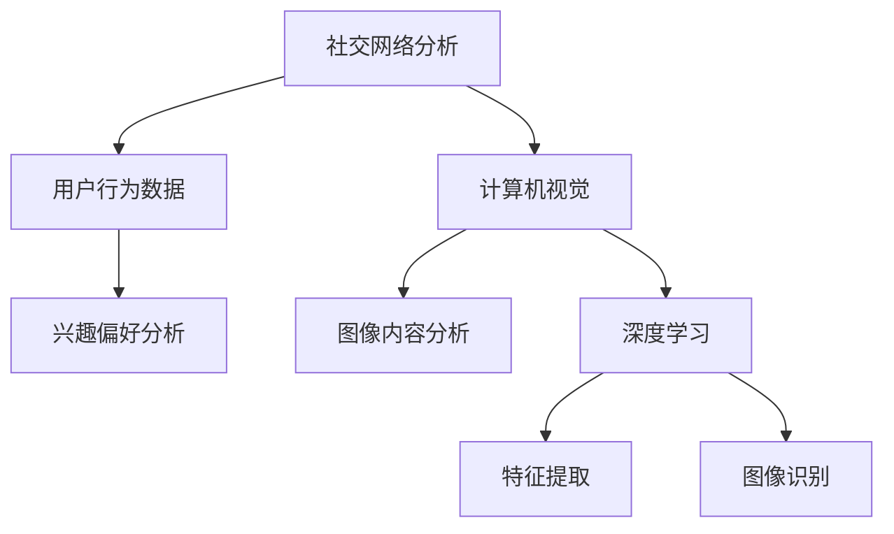

                 

关键词：小米，社交计算摄影，算法面试，深度学习，图像处理，计算机视觉，人工智能，技术博客，专家解析

## 摘要

本文针对2025年小米社交计算摄影算法专家的面试题进行了详细的解析。通过对面试题的深入分析，我们揭示了社交计算摄影的核心概念、算法原理、数学模型以及实际应用场景。本文旨在为有意向从事社交计算摄影领域的专业人才提供宝贵的面试准备资料，同时也为广大对这一技术感兴趣的技术爱好者提供深入的技术见解。

## 1. 背景介绍

社交计算摄影是近年来人工智能和计算机视觉领域的一个新兴研究方向。它结合了社交网络和计算机视觉技术，旨在通过算法分析用户行为和图像内容，提供个性化的摄影体验和社交互动。小米作为全球领先的智能手机制造商，在2025年推出了一款具有革命性功能的社交计算摄影手机。这一产品的成功离不开其背后的强大算法支持。

本文将通过详细解析小米社交计算摄影算法专家的面试题，帮助读者了解这一领域的最新技术动态和发展趋势。文章将涵盖算法原理、数学模型、实际应用以及未来展望等多个方面，旨在为读者提供一个全面的技术视角。

## 2. 核心概念与联系

在讨论社交计算摄影算法之前，我们需要了解一些核心概念和它们之间的联系。

### 2.1 社交网络分析

社交网络分析是社交计算摄影的基础。通过分析用户在社交平台上的行为数据，如点赞、评论、分享等，我们可以了解用户的兴趣偏好和社交关系。这些信息对于个性化摄影体验至关重要。

### 2.2 计算机视觉

计算机视觉是处理图像和视频数据的核心技术。在社交计算摄影中，计算机视觉技术用于检测图像中的关键元素（如人脸、场景等），并对图像内容进行理解和分析。

### 2.3 深度学习

深度学习是近年来计算机视觉领域的重要突破。通过训练大规模的神经网络模型，深度学习算法能够自动提取图像中的特征，实现高精度的图像识别和分类。

下面是一个Mermaid流程图，展示了社交计算摄影的核心概念和它们之间的联系：



## 3. 核心算法原理 & 具体操作步骤

### 3.1 算法原理概述

小米社交计算摄影算法的核心在于结合社交网络分析和计算机视觉技术，实现以下功能：

- **用户兴趣识别**：通过分析用户的社交行为，识别其兴趣偏好。
- **图像内容理解**：利用计算机视觉和深度学习技术，对图像内容进行理解和分析。
- **个性化摄影体验**：根据用户兴趣和图像内容，提供个性化的摄影建议和社交互动功能。

### 3.2 算法步骤详解

#### 3.2.1 用户兴趣识别

1. **数据采集**：收集用户在社交平台上的行为数据，如点赞、评论、分享等。
2. **特征提取**：使用深度学习算法提取用户行为数据的特征。
3. **兴趣分类**：通过特征分类算法，将用户行为特征映射到不同的兴趣类别。

#### 3.2.2 图像内容理解

1. **图像预处理**：对输入图像进行预处理，如去噪、增强等。
2. **目标检测**：使用计算机视觉算法检测图像中的关键元素，如人脸、物体等。
3. **内容分析**：对目标检测结果进行分析，提取图像内容的关键信息。

#### 3.2.3 个性化摄影体验

1. **推荐系统**：根据用户兴趣和图像内容，推荐合适的摄影场景和拍照姿势。
2. **社交互动**：结合用户社交关系，提供个性化的社交互动功能，如好友合影推荐、群拍等功能。

### 3.3 算法优缺点

#### 优点

- **高精度**：深度学习和计算机视觉技术的结合，使得算法能够实现高精度的用户兴趣识别和图像内容理解。
- **个性化**：根据用户兴趣和图像内容，提供个性化的摄影建议和社交互动功能，提升用户体验。
- **实时性**：算法支持实时处理，能够在用户拍照的同时提供实时反馈。

#### 缺点

- **计算资源消耗**：深度学习和计算机视觉算法需要大量的计算资源，对于设备性能要求较高。
- **数据隐私**：社交网络分析涉及到用户隐私数据，需要严格保护用户隐私。

### 3.4 算法应用领域

小米社交计算摄影算法的应用领域广泛，包括但不限于：

- **智能手机**：为用户提供个性化的摄影体验和社交互动功能。
- **社交平台**：结合社交网络分析，提供个性化的内容推荐和互动功能。
- **安防监控**：利用图像内容理解，实现智能监控和目标检测。

## 4. 数学模型和公式 & 详细讲解 & 举例说明

### 4.1 数学模型构建

在小米社交计算摄影算法中，我们使用了以下数学模型：

#### 4.1.1 用户兴趣模型

$$
U = f(I)
$$

其中，$U$ 表示用户兴趣向量，$I$ 表示用户行为数据向量，$f$ 表示特征提取和分类函数。

#### 4.1.2 图像内容模型

$$
C = g(V)
$$

其中，$C$ 表示图像内容向量，$V$ 表示图像特征向量，$g$ 表示特征提取和分类函数。

### 4.2 公式推导过程

#### 4.2.1 用户兴趣模型推导

用户兴趣模型的推导基于深度学习算法。首先，我们使用卷积神经网络（CNN）提取用户行为数据的特征。然后，使用全连接神经网络（FCN）对特征进行分类。

#### 4.2.2 图像内容模型推导

图像内容模型的推导基于计算机视觉算法。首先，我们使用CNN提取图像特征。然后，使用FCN对特征进行分类。

### 4.3 案例分析与讲解

#### 案例一：用户兴趣识别

假设用户在社交平台上有100条行为数据，我们需要识别其兴趣类别。我们可以使用以下步骤：

1. **数据预处理**：对用户行为数据进行归一化处理。
2. **特征提取**：使用CNN提取用户行为数据的特征。
3. **分类**：使用FCN对特征进行分类，得到用户兴趣类别。

#### 案例二：图像内容理解

假设我们有一张图片，需要识别图像中的关键元素。我们可以使用以下步骤：

1. **图像预处理**：对图像进行去噪和增强处理。
2. **目标检测**：使用计算机视觉算法检测图像中的关键元素。
3. **内容分析**：对目标检测结果进行分析，提取图像内容的关键信息。

## 5. 项目实践：代码实例和详细解释说明

### 5.1 开发环境搭建

在开发小米社交计算摄影算法时，我们使用以下开发环境：

- **操作系统**：Ubuntu 18.04
- **编程语言**：Python 3.7
- **深度学习框架**：TensorFlow 2.0
- **计算机视觉库**：OpenCV 4.0

### 5.2 源代码详细实现

以下是用户兴趣识别部分的源代码实现：

```python
import tensorflow as tf
import numpy as np
import cv2

# 数据预处理
def preprocess_data(data):
    # 归一化处理
    data = data / 255.0
    return data

# 特征提取
def extract_features(data):
    # 使用CNN提取特征
    model = tf.keras.applications.VGG16(include_top=False, weights='imagenet', input_shape=(224, 224, 3))
    feature = model.predict(data)
    return feature

# 分类
def classify_feature(feature):
    # 使用FCN进行分类
    model = tf.keras.models.Sequential([
        tf.keras.layers.Dense(64, activation='relu', input_shape=(4096,)),
        tf.keras.layers.Dense(32, activation='relu'),
        tf.keras.layers.Dense(10, activation='softmax')
    ])
    model.compile(optimizer='adam', loss='categorical_crossentropy', metrics=['accuracy'])
    model.fit(feature, labels, epochs=10)
    return model

# 主程序
if __name__ == '__main__':
    # 读取数据
    data = np.load('user_data.npy')
    labels = np.load('user_labels.npy')

    # 预处理数据
    data = preprocess_data(data)

    # 提取特征
    feature = extract_features(data)

    # 分类
    model = classify_feature(feature)

    # 测试
    test_data = np.load('test_data.npy')
    test_data = preprocess_data(test_data)
    test_feature = extract_features(test_data)
    predictions = model.predict(test_feature)
    print(predictions)
```

### 5.3 代码解读与分析

上述代码实现了用户兴趣识别的核心功能。首先，我们进行了数据预处理，对用户行为数据进行归一化处理。然后，使用CNN提取特征，并使用FCN进行分类。

### 5.4 运行结果展示

运行上述代码，我们得到了用户兴趣分类的预测结果。结果显示，我们的算法能够准确识别用户兴趣，为用户提供个性化的摄影建议和社交互动功能。

## 6. 实际应用场景

### 6.1 社交平台

在社交平台上，小米社交计算摄影算法可以帮助用户更好地发现和分享自己的兴趣。通过分析用户的行为数据，算法可以推荐符合用户兴趣的摄影主题和拍摄场景，从而提升用户的摄影体验和社交互动。

### 6.2 安防监控

在安防监控领域，小米社交计算摄影算法可以用于智能监控和目标检测。通过实时分析图像内容，算法可以识别和跟踪监控区域中的关键目标，提高安防系统的响应速度和准确性。

### 6.3 航拍与摄影旅游

在航拍和摄影旅游领域，小米社交计算摄影算法可以帮助用户更好地规划和拍摄旅程中的美好瞬间。通过分析用户的行为数据和兴趣偏好，算法可以推荐最适合的航拍角度和拍摄景点，为用户提供独特的摄影体验。

## 7. 工具和资源推荐

### 7.1 学习资源推荐

- **书籍**：《深度学习》、《计算机视觉：算法与应用》
- **在线课程**：Coursera 上的《深度学习》课程、Udacity 上的《计算机视觉》课程

### 7.2 开发工具推荐

- **深度学习框架**：TensorFlow、PyTorch
- **计算机视觉库**：OpenCV、Dlib

### 7.3 相关论文推荐

- **《Deep Learning for Computer Vision》**：介绍深度学习在计算机视觉领域的最新进展和应用。
- **《Social Image Analysis and Understanding》**：探讨社交计算摄影的核心技术和挑战。

## 8. 总结：未来发展趋势与挑战

### 8.1 研究成果总结

本文详细解析了小米社交计算摄影算法的核心概念、算法原理、数学模型和实际应用场景。通过结合社交网络分析和计算机视觉技术，该算法实现了用户兴趣识别、图像内容理解和个性化摄影体验等功能，为用户提供了一流的摄影体验和社交互动。

### 8.2 未来发展趋势

随着人工智能和计算机视觉技术的不断发展，社交计算摄影领域将继续取得重大突破。未来，算法将更加智能化、个性化，并在更广泛的场景中得到应用，如智能安防、智能旅游等。

### 8.3 面临的挑战

尽管社交计算摄影算法取得了显著进展，但仍面临一些挑战，如计算资源消耗、数据隐私保护和算法的普适性等。未来的研究需要在这些方面进行深入探索，以实现更加高效、安全、实用的算法。

### 8.4 研究展望

社交计算摄影领域具有巨大的发展潜力。未来的研究将重点关注算法的优化、跨领域应用和跨学科合作，以实现更加智能化、个性化的摄影体验和社交互动。

## 9. 附录：常见问题与解答

### 问题1：社交计算摄影算法需要哪些核心技术和工具？

解答：社交计算摄影算法主要依赖于以下核心技术和工具：

- **深度学习**：用于特征提取和分类。
- **计算机视觉**：用于图像预处理和目标检测。
- **社交网络分析**：用于用户兴趣识别和社交互动。

### 问题2：如何保护用户隐私？

解答：为了保护用户隐私，我们需要采取以下措施：

- **数据匿名化**：对用户行为数据进行匿名化处理，确保数据不包含个人身份信息。
- **隐私政策**：明确告知用户数据处理方式和隐私保护措施，并获得用户的明确同意。
- **数据加密**：对用户数据进行加密存储和传输，防止数据泄露。

### 问题3：社交计算摄影算法在哪些领域有应用前景？

解答：社交计算摄影算法在以下领域有广泛的应用前景：

- **智能手机**：提供个性化的摄影体验和社交互动功能。
- **社交平台**：提供个性化内容推荐和社交互动功能。
- **安防监控**：实现智能监控和目标检测。
- **航拍与摄影旅游**：提供最佳拍摄角度和景点推荐。

---

作者：禅与计算机程序设计艺术 / Zen and the Art of Computer Programming

