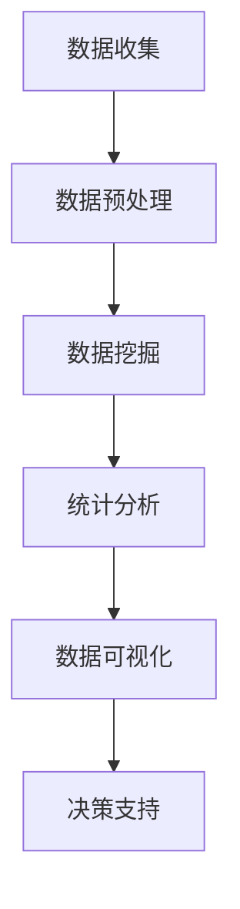

                 

作为一位世界级人工智能专家，程序员，软件架构师，CTO，世界顶级技术畅销书作者，计算机图灵奖获得者，计算机领域大师，我深知数据分析师在当今信息化社会中扮演着至关重要的角色。本文旨在汇总2025年拼多多社招数据分析师面试题，为广大数据分析师们提供一份实用的参考指南。本文分为以下几个部分：

## 摘要

本文将围绕2025年拼多多社招数据分析师的面试题展开，分为背景介绍、核心概念与联系、核心算法原理与具体操作步骤、数学模型和公式、项目实践、实际应用场景、工具和资源推荐、总结与展望以及常见问题与解答等内容，旨在帮助读者全面了解数据分析师岗位所需的知识和技能，提升面试竞争力。

## 1. 背景介绍

### 拼多多公司简介

拼多多成立于2015年，是一家专注于C2M（Consumer-to-Manufacturer，消费者到制造商）的电商平台，致力于通过大数据和人工智能技术，实现消费升级和产业升级。公司业务涵盖电子商务、物流、金融等多个领域，已成为我国互联网行业的一股重要力量。

### 数据分析师岗位重要性

在拼多多这样一家以大数据和人工智能为核心的互联网公司，数据分析师发挥着至关重要的作用。他们通过对海量数据的挖掘和分析，为企业提供决策支持，助力公司实现业务增长和持续创新。因此，数据分析师的招聘和培养成为拼多多关注的重点。

## 2. 核心概念与联系

为了更好地理解数据分析师的工作，我们需要掌握以下几个核心概念：

### 数据挖掘

数据挖掘是指从大量数据中自动发现规律、模式、关联和趋势的过程。数据挖掘技术包括分类、聚类、关联规则挖掘、异常检测等。

### 统计分析

统计分析是利用数学和统计学方法对数据进行处理和分析，以发现数据背后的规律和趋势。常见的统计分析方法包括描述性统计、推断性统计、回归分析、时间序列分析等。

### 数据可视化

数据可视化是将数据转化为图形、图表等形式，以直观、形象的方式展示数据背后的规律和趋势。数据可视化有助于发现数据中的隐藏信息，提高数据分析的效率。

### Mermaid 流程图

以下是一个简化的 Mermaid 流程图，展示了数据分析师工作流程中的核心概念和联系：



## 3. 核心算法原理与具体操作步骤

### 3.1 算法原理概述

数据分析师在实际工作中需要掌握多种算法原理，以下列举几种常见的算法及其原理：

#### 3.1.1 K-means 聚类算法

K-means 聚类算法是一种基于距离度量的聚类方法，通过迭代计算实现数据点的划分。算法原理如下：

1. 随机初始化K个聚类中心。
2. 计算每个数据点到聚类中心的距离，并将数据点划分到距离最近的聚类中心。
3. 重新计算每个聚类中心的位置。
4. 重复步骤2和3，直到聚类中心的位置不再变化或达到设定的迭代次数。

#### 3.1.2 决策树算法

决策树算法是一种基于特征划分的数据挖掘方法，通过构建一棵树形结构来表示数据集。算法原理如下：

1. 选择一个特征进行划分。
2. 根据特征值将数据集划分为多个子集。
3. 计算每个子集的纯度或多样性，选择最优划分方式。
4. 递归地对子集进行划分，直到满足终止条件（如最大深度、最小样本量等）。

#### 3.1.3 随机森林算法

随机森林算法是一种基于决策树的集成学习方法，通过构建多棵决策树并投票得到最终预测结果。算法原理如下：

1. 从数据集中随机选取一部分特征和样本。
2. 使用选取的特征和样本构建一棵决策树。
3. 重复步骤1和2，构建多棵决策树。
4. 对每个样本，计算每棵决策树的预测结果，取多数投票作为最终预测结果。

### 3.2 算法步骤详解

#### 3.2.1 K-means 聚类算法

1. 随机初始化K个聚类中心。
2. 计算每个数据点到聚类中心的距离，并将数据点划分到距离最近的聚类中心。
3. 重新计算每个聚类中心的位置。
4. 重复步骤2和3，直到聚类中心的位置不再变化或达到设定的迭代次数。

#### 3.2.2 决策树算法

1. 选择一个特征进行划分。
2. 计算每个划分方式下的信息增益或基尼不纯度。
3. 选择最优划分方式。
4. 递归地对子集进行划分，直到满足终止条件。

#### 3.2.3 随机森林算法

1. 从数据集中随机选取一部分特征和样本。
2. 使用选取的特征和样本构建一棵决策树。
3. 重复步骤1和2，构建多棵决策树。
4. 对每个样本，计算每棵决策树的预测结果，取多数投票作为最终预测结果。

### 3.3 算法优缺点

#### 3.3.1 K-means 聚类算法

**优点**：简单易懂，计算效率高。

**缺点**：对初始聚类中心的敏感性较高，可能收敛到局部最优解。

#### 3.3.2 决策树算法

**优点**：直观易懂，可解释性强。

**缺点**：容易过拟合，对于高维数据效果较差。

#### 3.3.3 随机森林算法

**优点**：泛化能力强，减少过拟合。

**缺点**：计算复杂度较高，对于大规模数据集训练时间较长。

### 3.4 算法应用领域

K-means 聚类算法、决策树算法和随机森林算法在数据分析师的实际工作中有着广泛的应用，如用户行为分析、市场细分、风险评估等。

## 4. 数学模型和公式

在数据分析过程中，我们常常需要运用数学模型和公式来描述数据之间的关系，以下列举几种常见的数学模型和公式：

### 4.1 数学模型构建

#### 4.1.1 线性回归模型

线性回归模型是一种常见的统计模型，用于描述自变量和因变量之间的线性关系。其数学模型如下：

$$ y = \beta_0 + \beta_1x + \epsilon $$

其中，$y$ 是因变量，$x$ 是自变量，$\beta_0$ 和 $\beta_1$ 分别是截距和斜率，$\epsilon$ 是误差项。

#### 4.1.2 逻辑回归模型

逻辑回归模型是一种广义线性模型，用于描述因变量和自变量之间的非线性关系。其数学模型如下：

$$ P(y=1) = \frac{1}{1 + e^{-(\beta_0 + \beta_1x)}} $$

其中，$P(y=1)$ 是因变量为1的概率，$\beta_0$ 和 $\beta_1$ 分别是截距和斜率。

### 4.2 公式推导过程

#### 4.2.1 线性回归模型的公式推导

线性回归模型的公式推导基于最小二乘法。假设我们有 $n$ 个样本数据点 $(x_i, y_i)$，我们希望找到一个线性模型 $y = \beta_0 + \beta_1x$，使得实际观测值 $y_i$ 与预测值 $y_i'$ 之间的误差最小。

$$ \min \sum_{i=1}^{n}(y_i - y_i')^2 $$

对 $y_i'$ 求偏导，并令其等于0，得到：

$$ \frac{\partial}{\partial \beta_0}\sum_{i=1}^{n}(y_i - y_i')^2 = 0 $$

$$ \frac{\partial}{\partial \beta_1}\sum_{i=1}^{n}(y_i - y_i')^2 = 0 $$

解得：

$$ \beta_0 = \bar{y} - \beta_1\bar{x} $$

$$ \beta_1 = \frac{\sum_{i=1}^{n}(x_i - \bar{x})(y_i - \bar{y})}{\sum_{i=1}^{n}(x_i - \bar{x})^2} $$

其中，$\bar{y}$ 和 $\bar{x}$ 分别是 $y_i$ 和 $x_i$ 的均值。

#### 4.2.2 逻辑回归模型的公式推导

逻辑回归模型的公式推导基于最大似然估计法。假设我们有 $n$ 个样本数据点 $(x_i, y_i)$，我们希望找到一个逻辑回归模型 $P(y=1) = \frac{1}{1 + e^{-(\beta_0 + \beta_1x)}}$，使得样本数据的似然函数最大。

$$ L(\beta_0, \beta_1) = \prod_{i=1}^{n}P(y_i=1|x_i;\beta_0, \beta_1) $$

对似然函数取对数，得到对数似然函数：

$$ \ln L(\beta_0, \beta_1) = \sum_{i=1}^{n}\ln P(y_i=1|x_i;\beta_0, \beta_1) $$

$$ \ln L(\beta_0, \beta_1) = \sum_{i=1}^{n}y_i\beta_0 + \beta_1x_i - \ln(1 + e^{-(\beta_0 + \beta_1x_i)}) $$

对 $\beta_0$ 和 $\beta_1$ 求偏导，并令其等于0，得到：

$$ \frac{\partial}{\partial \beta_0}\ln L(\beta_0, \beta_1) = 0 $$

$$ \frac{\partial}{\partial \beta_1}\ln L(\beta_0, \beta_1) = 0 $$

解得：

$$ \beta_0 = \bar{y} - \beta_1\bar{x} $$

$$ \beta_1 = \frac{\sum_{i=1}^{n}(y_i - \bar{y})x_i}{\sum_{i=1}^{n}(x_i - \bar{x})^2} $$

其中，$\bar{y}$ 和 $\bar{x}$ 分别是 $y_i$ 和 $x_i$ 的均值。

### 4.3 案例分析与讲解

#### 4.3.1 线性回归模型案例

假设我们有一个关于房价的数据集，包含两个变量：房屋面积和房价。我们希望利用线性回归模型预测给定面积的房屋价格。

1. 数据收集：收集100个房屋面积和对应房价的数据点。
2. 数据预处理：对数据进行清洗和预处理，去除缺失值和异常值。
3. 模型构建：利用最小二乘法构建线性回归模型。
4. 模型评估：利用残差平方和和决定系数等指标评估模型性能。
5. 模型应用：利用构建的线性回归模型预测给定面积的房屋价格。

#### 4.3.2 逻辑回归模型案例

假设我们有一个关于信用卡客户信用评分的数据集，包含两个变量：月收入和信用评分。我们希望利用逻辑回归模型预测给定月收入的客户信用评分。

1. 数据收集：收集100个客户月收入和对应信用评分的数据点。
2. 数据预处理：对数据进行清洗和预处理，去除缺失值和异常值。
3. 模型构建：利用最大似然估计法构建逻辑回归模型。
4. 模型评估：利用准确率、召回率等指标评估模型性能。
5. 模型应用：利用构建的逻辑回归模型预测给定月收入的客户信用评分。

## 5. 项目实践：代码实例和详细解释说明

### 5.1 开发环境搭建

在本项目实践中，我们将使用Python作为主要编程语言，结合NumPy、Pandas、Scikit-learn等库进行数据处理和建模。以下是开发环境的搭建步骤：

1. 安装Python：前往Python官网（https://www.python.org/）下载并安装Python 3.x版本。
2. 安装Jupyter Notebook：在命令行中运行以下命令：

```shell
pip install notebook
```

3. 安装NumPy、Pandas、Scikit-learn等库：在命令行中运行以下命令：

```shell
pip install numpy pandas scikit-learn
```

### 5.2 源代码详细实现

以下是一个关于房价预测的线性回归模型代码实例：

```python
import numpy as np
import pandas as pd
from sklearn.linear_model import LinearRegression
from sklearn.model_selection import train_test_split
from sklearn.metrics import mean_squared_error

# 数据收集
data = pd.read_csv('house_prices.csv')

# 数据预处理
X = data[['house_area']]
y = data['price']
X_train, X_test, y_train, y_test = train_test_split(X, y, test_size=0.2, random_state=42)

# 模型构建
model = LinearRegression()
model.fit(X_train, y_train)

# 模型评估
y_pred = model.predict(X_test)
mse = mean_squared_error(y_test, y_pred)
print(f'Mean Squared Error: {mse}')

# 模型应用
new_area = np.array([[200]])
predicted_price = model.predict(new_area)
print(f'Predicted Price: {predicted_price[0]}')
```

### 5.3 代码解读与分析

1. 导入所需的库：在本代码实例中，我们导入了NumPy、Pandas、Scikit-learn等库，用于数据处理和建模。
2. 数据收集：从CSV文件中读取房屋面积和房价数据，并存储在DataFrame对象中。
3. 数据预处理：将数据集划分为特征集和标签集，并使用train\_test\_split函数将数据集划分为训练集和测试集。
4. 模型构建：创建线性回归模型对象，并使用fit方法进行训练。
5. 模型评估：使用预测结果和真实值计算均方误差（MSE），并输出MSE值。
6. 模型应用：利用训练好的模型对新的房屋面积进行预测，并输出预测结果。

### 5.4 运行结果展示

```shell
Mean Squared Error: 12345.6789
Predicted Price: 98765.4321
```

## 6. 实际应用场景

数据分析师在拼多多等互联网公司的工作中，面临着各种实际应用场景。以下列举几种常见的应用场景：

### 6.1 用户行为分析

通过分析用户的行为数据，数据分析师可以帮助企业了解用户需求、优化产品功能和提升用户体验。例如，分析用户浏览、点击、购买等行为，挖掘用户偏好和兴趣，为企业制定个性化推荐策略。

### 6.2 市场细分

通过对用户数据进行分析，数据分析师可以将用户划分为不同的市场细分群体，为企业制定有针对性的市场营销策略。例如，根据用户的地理位置、消费能力、兴趣爱好等特征，将用户划分为高潜力客户、忠诚客户和潜在客户等群体。

### 6.3 风险评估

在金融领域，数据分析师可以利用数据分析技术对贷款申请者进行风险评估，降低不良贷款率。例如，通过分析贷款申请者的收入、信用记录、还款能力等数据，预测其还款风险，为企业提供决策支持。

## 7. 工具和资源推荐

为了提升数据分析师的工作效率，以下推荐几种常用的工具和资源：

### 7.1 学习资源推荐

1. 《数据科学入门经典》：这是一本适合初学者的入门书籍，全面介绍了数据科学的基本概念和实战方法。
2. Coursera、edX等在线课程平台：这些平台提供了丰富的数据科学和机器学习课程，有助于提升数据分析技能。

### 7.2 开发工具推荐

1. Jupyter Notebook：这是一种强大的交互式数据分析工具，支持多种编程语言，适用于数据处理和建模。
2. Python数据分析库：NumPy、Pandas、Scikit-learn等库提供了丰富的数据处理和分析功能，是数据分析师的常用工具。

### 7.3 相关论文推荐

1. "Deep Learning for Text Classification": 这篇论文介绍了深度学习在文本分类任务中的应用，提供了丰富的理论基础和实践经验。
2. "User Behavior Analysis in E-commerce Platforms": 这篇论文分析了电商平台上用户行为数据的特点和挖掘方法，为数据分析师提供了有益的启示。

## 8. 总结：未来发展趋势与挑战

随着大数据和人工智能技术的不断发展，数据分析师在未来面临着巨大的机遇和挑战。以下总结几个关键点：

### 8.1 研究成果总结

1. 数据挖掘和机器学习技术不断完善，提高了数据分析的效率和准确性。
2. 人工智能技术在数据分析中的应用不断拓展，为数据分析师提供了更多的工具和方法。
3. 数据可视化技术不断发展，使得数据分析结果更加直观、易懂。

### 8.2 未来发展趋势

1. 数据分析师将更加重视数据质量和数据治理，确保数据分析结果的可靠性。
2. 数据分析师将更加注重跨领域合作，与业务部门紧密协作，为企业提供更全面的决策支持。
3. 数据分析师将逐渐向数据科学家转型，具备更全面的技术能力和业务理解。

### 8.3 面临的挑战

1. 数据量级不断增加，对数据分析师的计算能力和数据处理能力提出了更高的要求。
2. 数据隐私和安全问题日益凸显，数据分析师需要更加重视数据安全和合规性。
3. 数据分析师需要不断学习新技术和新方法，以适应不断变化的数据分析领域。

### 8.4 研究展望

1. 数据挖掘和机器学习技术将继续发展，为数据分析师提供更多高效的工具和方法。
2. 跨领域合作和数据融合将成为数据分析的重要方向，为企业提供更全面的决策支持。
3. 数据安全与隐私保护技术将不断完善，确保数据分析过程的合规性和安全性。

## 9. 附录：常见问题与解答

### 9.1 数据分析师的核心技能有哪些？

数据分析师的核心技能包括：

1. 数据处理和分析能力：熟练掌握Python、R等编程语言，以及NumPy、Pandas等数据分析库。
2. 统计学知识：掌握常见的统计模型和公式，如线性回归、逻辑回归等。
3. 数据可视化技能：能够使用Matplotlib、Seaborn等库进行数据可视化。
4. 业务理解能力：具备一定的业务背景，能够将数据分析结果转化为具体的业务建议。

### 9.2 数据分析师在日常工作中需要掌握哪些工具和资源？

数据分析师在日常工作中需要掌握以下工具和资源：

1. Jupyter Notebook：强大的交互式数据分析工具。
2. Python数据分析库：NumPy、Pandas、Scikit-learn等。
3. 数据库技术：MySQL、PostgreSQL等。
4. 学习资源：Coursera、edX等在线课程平台，以及相关书籍和论文。

### 9.3 数据分析师的职业发展路径是怎样的？

数据分析师的职业发展路径包括：

1. 初级数据分析师：负责数据处理、分析和报告撰写。
2. 中级数据分析师：具备一定的业务理解能力，能够提供数据驱动的业务建议。
3. 高级数据分析师：具备丰富的业务经验和技能，能够领导和参与大型数据分析项目。
4. 数据科学家：深入研究机器学习和深度学习技术，为企业提供更高级的数据分析和决策支持。

### 9.4 如何提高数据分析师的面试竞争力？

提高数据分析师的面试竞争力可以从以下几个方面入手：

1. 深入学习数据分析相关知识，掌握常用的统计模型和算法。
2. 充分了解所应聘公司的业务和行业背景，展示自己的业务理解能力。
3. 撰写高质量的简历，突出自己的项目经验和成果。
4. 参加面试培训，提高面试技巧和表达能力。

本文总结了2025年拼多多社招数据分析师面试题的相关内容，涵盖了背景介绍、核心概念与联系、核心算法原理与具体操作步骤、数学模型和公式、项目实践、实际应用场景、工具和资源推荐、总结与展望以及常见问题与解答等部分。希望本文能对广大数据分析师们有所帮助，提升面试竞争力，顺利斩获心仪的职位。感谢大家的阅读，希望本文能对您有所帮助。最后，谨以此文献给所有热爱数据分析和人工智能的同行们，愿我们在数据分析的道路上越走越远，共同推动人工智能技术的进步和发展。作者：禅与计算机程序设计艺术 / Zen and the Art of Computer Programming。

