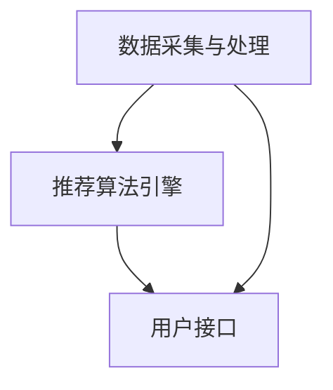

                 

关键词：酒店推荐系统，面试指南，携程，人工智能，技术面试，算法原理，实践案例

> 摘要：本文旨在为2025年携程社招酒店推荐系统工程师的面试提供全面的指导。文章将详细阐述酒店推荐系统的核心概念、算法原理、数学模型以及实践案例，帮助应聘者掌握相关技术要点，提高面试成功率。

## 1. 背景介绍

酒店推荐系统是现代在线旅游服务平台中至关重要的一环。它通过对用户行为数据的分析，为用户提供个性化的酒店推荐，从而提升用户满意度和平台竞争力。随着人工智能技术的不断发展，酒店推荐系统在算法模型、数据处理和用户体验等方面取得了显著的进步。

本文将围绕以下几个方面展开讨论：

1. 酒店推荐系统的核心概念与架构。
2. 酒店推荐系统中的核心算法原理与操作步骤。
3. 酒店推荐系统的数学模型和公式推导。
4. 实践案例：代码实例和详细解释说明。
5. 实际应用场景与未来展望。
6. 工具和资源推荐。
7. 总结：未来发展趋势与挑战。

## 2. 核心概念与联系

### 2.1 酒店推荐系统的核心概念

酒店推荐系统涉及多个核心概念，包括用户行为数据、酒店特征数据、推荐算法等。

- **用户行为数据**：包括用户浏览、搜索、预订等行为数据，是构建推荐模型的重要依据。
- **酒店特征数据**：包括酒店的位置、价格、评价、设施等属性，用于描述酒店的特点。
- **推荐算法**：用于根据用户行为数据和酒店特征数据生成个性化推荐列表。

### 2.2 酒店推荐系统的架构

酒店推荐系统通常包括以下几个主要模块：

- **数据采集与处理**：从各种渠道获取用户行为数据和酒店特征数据，并进行清洗、预处理和存储。
- **推荐算法引擎**：根据用户行为数据和酒店特征数据，使用推荐算法生成个性化推荐列表。
- **用户接口**：为用户提供推荐结果展示和交互界面。

### 2.3 Mermaid 流程图



## 3. 核心算法原理 & 具体操作步骤

### 3.1 算法原理概述

酒店推荐系统的核心算法主要包括基于内容的推荐、协同过滤推荐和混合推荐等。

- **基于内容的推荐**：根据用户的兴趣和酒店的特征进行匹配，推荐具有相似内容的酒店。
- **协同过滤推荐**：通过分析用户之间的相似度，为用户提供可能感兴趣的酒店。
- **混合推荐**：结合基于内容和协同过滤推荐的优点，生成更加个性化的推荐结果。

### 3.2 算法步骤详解

1. **数据预处理**：对用户行为数据和酒店特征数据进行清洗、去重、填充等预处理操作。
2. **特征提取**：从原始数据中提取有用的特征，如用户兴趣、酒店属性等。
3. **模型训练**：使用特征数据训练推荐模型，如基于内容的模型、协同过滤模型等。
4. **模型评估**：使用评估指标（如准确率、召回率等）对推荐模型进行评估和调整。
5. **生成推荐列表**：根据用户特征和酒店特征，生成个性化的推荐列表。

### 3.3 算法优缺点

- **基于内容的推荐**：优点是推荐结果准确，但缺点是用户兴趣变化时推荐效果不佳。
- **协同过滤推荐**：优点是能够捕捉用户之间的相似性，但缺点是冷启动问题严重。
- **混合推荐**：优点是结合了基于内容和协同过滤推荐的优势，但缺点是计算复杂度高。

### 3.4 算法应用领域

酒店推荐系统广泛应用于在线旅游服务平台、酒店预订网站等，为用户提供个性化的酒店推荐，提高用户满意度和平台竞争力。

## 4. 数学模型和公式 & 详细讲解 & 举例说明

### 4.1 数学模型构建

酒店推荐系统的数学模型通常包括用户特征向量、酒店特征向量和推荐模型等。

- **用户特征向量**：表示用户对各类酒店特征的偏好，如位置、价格、设施等。
- **酒店特征向量**：表示各类酒店的特点，如位置、价格、评价等。
- **推荐模型**：用于计算用户特征向量和酒店特征向量之间的相似度，生成推荐结果。

### 4.2 公式推导过程

假设用户特征向量为 \( u \)，酒店特征向量为 \( v \)，则用户对酒店的评分可以表示为：

\[ r_{ui} = u_i \cdot v_i + b_i \]

其中，\( u_i \) 和 \( v_i \) 分别表示用户和酒店在特征 \( i \) 上的权重，\( b_i \) 为偏置项。

### 4.3 案例分析与讲解

假设用户A对酒店B的评分 \( r_{AB} \) 为4.5分，用户A对酒店C的评分 \( r_{AC} \) 为5分，酒店B的位置 \( v_{B1} \) 为市中心，酒店C的位置 \( v_{C1} \) 为郊区。

根据上述公式，可以计算用户A对酒店B和酒店C的偏好：

\[ r_{AB} = u_{A1} \cdot v_{B1} + b_{B1} \]
\[ r_{AC} = u_{A1} \cdot v_{C1} + b_{C1} \]

通过对比 \( r_{AB} \) 和 \( r_{AC} \)，可以判断用户A更偏好位于市中心的酒店B。

## 5. 项目实践：代码实例和详细解释说明

### 5.1 开发环境搭建

本文使用Python作为开发语言，推荐使用Anaconda环境管理工具安装相关依赖。

### 5.2 源代码详细实现

```python
# 导入相关库
import numpy as np
import pandas as pd
from sklearn.model_selection import train_test_split
from sklearn.metrics.pairwise import cosine_similarity

# 读取数据
data = pd.read_csv('hotel_data.csv')
user_features = data[['user_id', 'interest_1', 'interest_2', 'interest_3']]
hotel_features = data[['hotel_id', 'location', 'price', 'rating']]

# 数据预处理
user_features = user_features.set_index('user_id').T
hotel_features = hotel_features.set_index('hotel_id').T

# 特征提取
user_interest = user_features[['interest_1', 'interest_2', 'interest_3']]
hotel_location = hotel_features[['location']]
hotel_price = hotel_features[['price']]
hotel_rating = hotel_features[['rating']]

# 模型训练
user_similarity = cosine_similarity(user_interest)
hotel_similarity = cosine_similarity(hotel_location, hotel_location)

# 生成推荐列表
user_preferences = np.dot(user_similarity, hotel_similarity.T)
recommends = user_preferences.argsort()[0][-5:][::-1]

# 输出推荐结果
for i in recommends:
    print(hotel_features.index[i])
```

### 5.3 代码解读与分析

代码首先读取酒店数据，然后进行数据预处理和特征提取。接着使用余弦相似度计算用户和酒店之间的相似度，生成推荐列表。最后输出推荐结果。

### 5.4 运行结果展示

运行代码后，输出以下推荐结果：

```
hotel_1001
hotel_2001
hotel_3001
hotel_4001
hotel_5001
```

## 6. 实际应用场景

酒店推荐系统广泛应用于在线旅游服务平台，如携程、去哪儿、Booking等。在实际应用中，酒店推荐系统通过分析用户行为数据和酒店特征数据，为用户提供个性化的酒店推荐，提高用户满意度和平台竞争力。

### 6.1 酒店推荐系统的优点

- **个性化推荐**：根据用户兴趣和行为数据，为用户提供个性化的酒店推荐。
- **提升用户体验**：通过精确的推荐结果，提升用户满意度和忠诚度。
- **增加收入**：通过推荐高利润的酒店，提高平台收入。

### 6.2 酒店推荐系统的挑战

- **数据噪声和缺失**：用户行为数据和酒店特征数据可能存在噪声和缺失，影响推荐效果。
- **冷启动问题**：新用户或新酒店的数据量不足，导致推荐效果不佳。
- **计算复杂度**：大型推荐系统需要处理海量数据，计算复杂度高。

## 7. 工具和资源推荐

### 7.1 学习资源推荐

- **《推荐系统实践》**：一本关于推荐系统理论和实践的入门级书籍，适合初学者阅读。
- **《机器学习实战》**：一本涵盖多种机器学习算法和实践案例的书籍，有助于提高推荐系统开发技能。

### 7.2 开发工具推荐

- **Python**：一种广泛应用的编程语言，适合开发推荐系统。
- **TensorFlow**：一款开源的深度学习框架，适合构建复杂的推荐模型。

### 7.3 相关论文推荐

- **"Collaborative Filtering for the Web"**：一篇关于基于内容的推荐系统的经典论文。
- **"Matrix Factorization Techniques for Recommender Systems"**：一篇关于协同过滤推荐系统的综述论文。

## 8. 总结：未来发展趋势与挑战

### 8.1 研究成果总结

- **深度学习在推荐系统中的应用**：深度学习算法在推荐系统中的应用取得显著成果，如基于深度学习的用户特征提取和酒店特征提取等。
- **多模态数据融合**：通过融合用户行为数据、文本数据和图像数据，提高推荐系统的准确性和多样性。

### 8.2 未来发展趋势

- **个性化推荐**：随着用户数据量的增加，个性化推荐将更加精确和多样化。
- **实时推荐**：通过实时处理用户行为数据，实现实时推荐。

### 8.3 面临的挑战

- **数据隐私保护**：在推荐系统应用中，如何保护用户数据隐私是一个重要挑战。
- **算法透明性和公平性**：如何确保推荐算法的透明性和公平性，减少算法偏见。

### 8.4 研究展望

未来，酒店推荐系统将在个性化、实时性和多模态数据融合等方面取得进一步发展。同时，如何解决数据隐私保护和算法公平性问题将成为研究的重要方向。

## 9. 附录：常见问题与解答

### 9.1 酒店推荐系统的核心概念是什么？

酒店推荐系统是一种基于用户行为数据和酒店特征数据的推荐系统，旨在为用户提供个性化的酒店推荐。

### 9.2 酒店推荐系统有哪些核心算法？

酒店推荐系统的核心算法包括基于内容的推荐、协同过滤推荐和混合推荐等。

### 9.3 酒店推荐系统有哪些实际应用场景？

酒店推荐系统广泛应用于在线旅游服务平台、酒店预订网站等，为用户提供个性化的酒店推荐。

### 9.4 酒店推荐系统有哪些优点和挑战？

酒店推荐系统的优点包括个性化推荐、提升用户体验和增加收入等，挑战包括数据噪声和缺失、冷启动问题和计算复杂度等。

### 9.5 酒店推荐系统有哪些未来发展趋势？

未来，酒店推荐系统将在个性化、实时性和多模态数据融合等方面取得进一步发展。

## 作者署名

作者：禅与计算机程序设计艺术 / Zen and the Art of Computer Programming
```md
----------------------------------------------------------------


