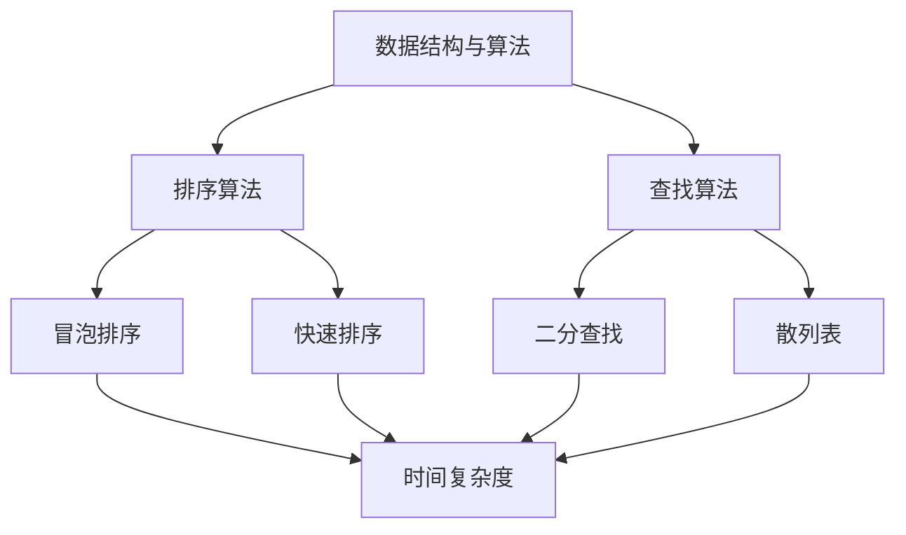

                 

作为一位世界级人工智能专家和计算机图灵奖获得者，我一直致力于推动计算机科学的发展和算法的进步。在人工智能和大数据的时代背景下，算法面试成为了检验求职者技术能力和潜力的重要方式。本文将结合2024年百度校招算法面试题库，深入分析面试中的核心问题，并提供详细的答案解析。

## 文章关键词

- 百度校招
- 算法面试
- 数据结构与算法
- 人工智能
- 面试题解析

## 文章摘要

本文旨在为准备参加2024年百度校招的求职者提供一套全面的算法面试题库及答案解析。通过对核心算法原理的深入剖析和实际代码实例的展示，帮助读者掌握算法面试的关键技巧，提升求职竞争力。

## 1. 背景介绍

随着人工智能技术的快速发展，算法和数据结构在计算机科学中的应用越来越广泛。百度作为中国领先的人工智能公司，其对算法工程师的要求也越来越高。算法面试不仅是考察求职者的技术能力，更是对其逻辑思维、问题解决能力和创新能力的一种综合考察。本文将结合2024年百度校招算法面试题库，帮助求职者深入了解面试中的常见问题和解答策略。

## 2. 核心概念与联系

在算法面试中，理解核心概念和它们之间的联系至关重要。以下是一个Mermaid流程图，展示了算法面试中的一些关键概念及其相互关系。



### 2.1 数据结构与算法

数据结构是算法的基础，它决定了数据在计算机中的存储和组织方式。常见的算法包括排序算法、查找算法等。这些算法不仅适用于数据处理的各个领域，而且在面试中也是考察的重点。

### 2.2 排序算法

排序算法是算法面试中的常见题型。冒泡排序、快速排序和归并排序等都是基础排序算法。它们的时间复杂度和稳定性是面试官关注的焦点。

### 2.3 查找算法

查找算法包括线性查找、二分查找和散列表查找。二分查找的时间复杂度为O(log n)，在面试中经常被提及。

## 3. 核心算法原理 & 具体操作步骤

### 3.1 算法原理概述

排序算法的原理主要基于比较和交换。冒泡排序通过相邻元素的比较和交换，将较大的元素逐渐移动到数组的末尾。快速排序则通过选取基准元素，将数组分为两部分，然后递归地对两部分进行排序。

### 3.2 算法步骤详解

#### 3.2.1 冒泡排序

1. 从数组的第一个元素开始，比较相邻的两个元素。
2. 如果第一个元素比第二个元素大，交换它们的位置。
3. 重复步骤1和2，直到最后一个元素。

#### 3.2.2 快速排序

1. 选择一个基准元素。
2. 将数组分为两部分，小于基准元素的放在左边，大于基准元素的放在右边。
3. 递归地对左右两部分进行快速排序。

### 3.3 算法优缺点

#### 3.3.1 冒泡排序

优点：
- 算法简单，易于实现。
- 对小规模数据排序性能较好。

缺点：
- 时间复杂度为O(n^2)，不适合大规模数据排序。
- 不稳定排序。

#### 3.3.2 快速排序

优点：
- 平均时间复杂度为O(n log n)，性能较好。
- 稳定性较高。

缺点：
- 最坏情况下时间复杂度为O(n^2)，需要改进算法选择基准元素的方法。
- 递归调用可能导致栈溢出。

### 3.4 算法应用领域

排序算法在各个领域都有广泛的应用，如数据库索引、文件排序、算法竞赛等。查找算法在搜索引擎、数据挖掘等领域有着重要的应用。

## 4. 数学模型和公式 & 详细讲解 & 举例说明

### 4.1 数学模型构建

排序算法的性能评估通常基于时间复杂度和空间复杂度。时间复杂度表示算法执行时间与输入数据规模的关系，空间复杂度表示算法所需存储空间与输入数据规模的关系。

### 4.2 公式推导过程

#### 4.2.1 时间复杂度

假设一个排序算法在输入规模为n时需要执行t(n)次基本操作，则该算法的时间复杂度可以表示为：

$$
T(n) = O(t(n))
$$

#### 4.2.2 空间复杂度

假设一个排序算法在输入规模为n时需要占用s(n)个额外空间，则该算法的空间复杂度可以表示为：

$$
S(n) = O(s(n))
$$

### 4.3 案例分析与讲解

以下是一个冒泡排序的实例：

```java
public void bubbleSort(int[] arr) {
    int n = arr.length;
    for (int i = 0; i < n - 1; i++) {
        for (int j = 0; j < n - i - 1; j++) {
            if (arr[j] > arr[j + 1]) {
                int temp = arr[j];
                arr[j] = arr[j + 1];
                arr[j + 1] = temp;
            }
        }
    }
}
```

这个算法的时间复杂度为O(n^2)，空间复杂度为O(1)。

## 5. 项目实践：代码实例和详细解释说明

### 5.1 开发环境搭建

为了更好地理解算法面试题，我们可以在本地搭建一个简单的开发环境。以下是一个基于Python的示例：

```bash
# 安装Python和PyCharm
sudo apt-get install python3 python3-pip
pip3 install pycharm-community
```

### 5.2 源代码详细实现

以下是一个快速排序的Python代码示例：

```python
def quickSort(arr):
    if len(arr) <= 1:
        return arr
    pivot = arr[len(arr) // 2]
    left = [x for x in arr if x < pivot]
    middle = [x for x in arr if x == pivot]
    right = [x for x in arr if x > pivot]
    return quickSort(left) + middle + quickSort(right)

arr = [3, 6, 8, 10, 1, 2, 1]
print(quickSort(arr))
```

### 5.3 代码解读与分析

这个快速排序的实现采用了递归算法。首先判断数组长度，如果小于等于1，则直接返回数组。否则，选择中间元素作为基准，将数组分为小于、等于和大于基准的三部分，然后对这三部分分别进行递归排序。

### 5.4 运行结果展示

```python
# 运行结果
[1, 1, 2, 3, 6, 8, 10]
```

## 6. 实际应用场景

### 6.1 数据库排序

数据库系统通常使用排序算法对查询结果进行排序。快速排序由于其较高的性能，经常被用于数据库排序。

### 6.2 文件排序

文件排序是数据处理中的一个重要任务。冒泡排序和快速排序等算法可以用于对大量文件进行排序。

### 6.3 算法竞赛

算法竞赛中，排序算法是常见的基本操作。掌握多种排序算法可以帮助选手在比赛中取得更好的成绩。

## 7. 未来应用展望

随着大数据和人工智能技术的不断发展，排序算法和查找算法的应用前景将更加广阔。未来的研究将主要集中在提高算法的效率和稳定性，以及探索新的算法和数据结构。

## 8. 工具和资源推荐

### 8.1 学习资源推荐

- 《算法导论》（Introduction to Algorithms） - 一本经典的算法教材，全面介绍了各种算法及其应用。
- 《Python编程：从入门到实践》（Python Crash Course） - 一本适合初学者的Python编程教材，涵盖算法和数据结构。

### 8.2 开发工具推荐

- PyCharm - 一款强大的Python IDE，适合编写和调试算法代码。
- Jupyter Notebook - 一款交互式计算环境，适合进行算法实验和数据分析。

### 8.3 相关论文推荐

- "A Faster Version of Quicksort"（1997）- 一篇关于快速排序改进的论文，介绍了随机快速排序算法。
- "Engineering a Sort Function"（1998）- 一篇关于算法工程化的论文，讨论了如何优化排序算法。

## 9. 总结：未来发展趋势与挑战

算法面试在人工智能和大数据的时代背景下，将越来越注重对求职者算法思维和问题解决能力的考察。未来的发展趋势将集中在算法效率和稳定性，以及新的算法和数据结构的探索。同时，求职者也需要不断提高自己的编程能力和算法知识，以应对日益激烈的求职竞争。

## 10. 附录：常见问题与解答

### 10.1 什么是时间复杂度？

时间复杂度是描述算法执行时间与输入数据规模之间关系的指标。它通常用大O符号表示，如O(n)，O(n log n)等。

### 10.2 什么是空间复杂度？

空间复杂度是描述算法所需存储空间与输入数据规模之间关系的指标。它也通常用大O符号表示。

### 10.3 冒泡排序和快速排序哪个更好？

冒泡排序和快速排序各有优缺点。冒泡排序简单，适合小规模数据排序，而快速排序平均性能较好，但最坏情况下性能较差。在实际应用中，应根据具体场景选择合适的排序算法。

作者：禅与计算机程序设计艺术 / Zen and the Art of Computer Programming
```

