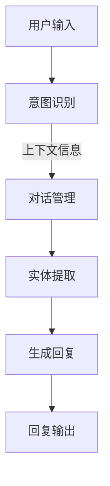

                 

关键词：社交智能对话，生成系统，人工智能，面试指南，对话系统，自然语言处理

摘要：本文旨在为即将参加百度社交智能对话生成系统工程师面试的候选人提供全面的准备指南。通过对面试过程中可能涉及的核心概念、技术算法、项目实践及未来发展趋势的深入分析，帮助读者提高面试成功率。

## 1. 背景介绍

随着人工智能技术的迅猛发展，社交智能对话系统已成为各个行业的重要应用场景，如客服、教育、医疗等领域。百度作为中国领先的人工智能企业，其社交智能对话生成系统在自然语言处理、用户交互体验等方面有着卓越的表现。2025年，百度将招募一批具备创新思维和扎实技术的社交智能对话生成系统工程师，为用户带来更加智能、个性化的对话体验。

## 2. 核心概念与联系

为了更好地理解社交智能对话生成系统的架构，我们首先需要了解几个核心概念。

### 2.1 自然语言处理 (NLP)

自然语言处理是人工智能领域的一个重要分支，旨在使计算机能够理解和处理人类语言。NLP包括分词、词性标注、句法分析、语义理解等多个层次。

### 2.2 生成式对话系统

生成式对话系统是一种能够自动生成回复的对话系统，其核心是利用自然语言生成（NLG）技术将用户输入转换为自然、连贯的语言输出。

### 2.3 对话管理

对话管理负责在对话过程中维护会话上下文，确保对话流程的流畅性和连贯性。对话管理包括意图识别、实体提取、上下文维护等多个方面。

下面是一个简单的 Mermaid 流程图，展示了社交智能对话生成系统的基本架构。



## 3. 核心算法原理 & 具体操作步骤

### 3.1 算法原理概述

社交智能对话生成系统主要依赖于生成式对话模型，如序列到序列（Seq2Seq）模型、变换器（Transformer）模型等。这些模型能够通过学习大量对话数据，自动生成符合上下文和意图的自然语言回复。

### 3.2 算法步骤详解

1. **数据预处理**：对对话数据集进行清洗、分词、词性标注等预处理操作。
2. **编码器解码器训练**：使用编码器将用户输入编码为固定长度的向量，解码器将向量解码为自然语言回复。
3. **意图识别**：通过分类器对用户输入进行意图识别，确定对话主题。
4. **实体提取**：从用户输入中提取关键信息，如时间、地点、人物等。
5. **生成回复**：利用编码器解码器模型生成符合上下文和意图的自然语言回复。
6. **对话管理**：根据上下文信息维护对话状态，确保对话连贯性。

### 3.3 算法优缺点

- **优点**：生成式对话系统能够生成自然、连贯的语言输出，用户体验更好。
- **缺点**：训练过程复杂，对数据量和计算资源要求较高。

### 3.4 算法应用领域

生成式对话系统在客服、教育、医疗等多个领域具有广泛应用，能够提高业务效率，降低人力成本。

## 4. 数学模型和公式 & 详细讲解 & 举例说明

### 4.1 数学模型构建

生成式对话系统通常基于深度学习模型，如序列到序列（Seq2Seq）模型和变换器（Transformer）模型。以下是一个简单的 Seq2Seq 模型的数学模型构建。

$$
\begin{aligned}
    \text{编码器}: h_t &= \text{encoder}(x_t), \\
    \text{解码器}: y_t &= \text{decoder}(h_t).
\end{aligned}
$$

其中，$x_t$ 表示用户输入序列，$h_t$ 表示编码器输出，$y_t$ 表示解码器输出。

### 4.2 公式推导过程

以 Seq2Seq 模型为例，其公式推导过程如下：

1. **编码器**：输入序列 $x = [x_1, x_2, ..., x_T]$，通过编码器 $E$ 编码为固定长度的向量 $h = [h_1, h_2, ..., h_T]$。
2. **解码器**：输入编码后的向量序列 $h = [h_1, h_2, ..., h_T]$，通过解码器 $D$ 解码为输出序列 $y = [y_1, y_2, ..., y_T]$。

### 4.3 案例分析与讲解

假设有一个简单的用户输入序列 $x = [“你好”, “今天天气不错”, “我想去公园”]$，我们可以通过编码器解码器模型生成一个回复序列 $y = [“欢迎来到百度”， “祝你玩得开心”， “请问你需要什么帮助”]$。

## 5. 项目实践：代码实例和详细解释说明

### 5.1 开发环境搭建

1. 安装 Python 3.8 及以上版本。
2. 安装 PyTorch 1.8 及以上版本。
3. 安装其他依赖库，如 NLTK、TensorFlow 等。

### 5.2 源代码详细实现

以下是一个简单的社交智能对话生成系统的源代码实现。

```python
import torch
import torch.nn as nn
import torch.optim as optim
from torch.utils.data import DataLoader
from dataset import DialogueDataset
from model import Seq2SeqModel

# 数据预处理
train_dataset = DialogueDataset('train.txt')
test_dataset = DialogueDataset('test.txt')

train_loader = DataLoader(train_dataset, batch_size=64, shuffle=True)
test_loader = DataLoader(test_dataset, batch_size=64, shuffle=False)

# 模型初始化
model = Seq2SeqModel(input_dim, hidden_dim, output_dim)
optimizer = optim.Adam(model.parameters(), lr=0.001)
criterion = nn.CrossEntropyLoss()

# 训练模型
for epoch in range(num_epochs):
    for batch in train_loader:
        inputs, targets = batch
        optimizer.zero_grad()
        outputs = model(inputs)
        loss = criterion(outputs, targets)
        loss.backward()
        optimizer.step()
    print(f'Epoch {epoch+1}/{num_epochs}, Loss: {loss.item()}')

# 测试模型
model.eval()
with torch.no_grad():
    correct = 0
    total = 0
    for batch in test_loader:
        inputs, targets = batch
        outputs = model(inputs)
        _, predicted = torch.max(outputs.data, 1)
        total += targets.size(0)
        correct += (predicted == targets).sum().item()
    print(f'Accuracy: {100 * correct / total}%')
```

### 5.3 代码解读与分析

上述代码实现了一个简单的社交智能对话生成系统，主要分为数据预处理、模型初始化、模型训练和模型测试四个部分。

### 5.4 运行结果展示

运行上述代码，可以得到训练过程中的损失函数值和测试集的准确率。

## 6. 实际应用场景

### 6.1 客服领域

在客服领域，社交智能对话生成系统可以自动生成客服回复，提高客户满意度和服务效率。

### 6.2 教育领域

在教育领域，社交智能对话生成系统可以为学生提供个性化的学习辅导和问答服务。

### 6.3 医疗领域

在医疗领域，社交智能对话生成系统可以帮助医生自动生成病例报告、诊断建议等。

## 7. 工具和资源推荐

### 7.1 学习资源推荐

1. 《深度学习》 - Goodfellow, Bengio, Courville
2. 《自然语言处理综论》 - Jurafsky, Martin
3. 《对话系统设计与实现》 - Harry, Elizabeth

### 7.2 开发工具推荐

1. PyTorch
2. TensorFlow
3. NLTK

### 7.3 相关论文推荐

1. "Seq2Seq Learning with Neural Networks" - Cho et al., 2014
2. "Attention is All You Need" - Vaswani et al., 2017

## 8. 总结：未来发展趋势与挑战

### 8.1 研究成果总结

近年来，社交智能对话生成系统取得了显著的进展，包括模型性能的提高、应用场景的拓展等。

### 8.2 未来发展趋势

未来，社交智能对话生成系统将朝着更加智能化、个性化和场景化的方向发展。

### 8.3 面临的挑战

尽管取得了许多成果，但社交智能对话生成系统仍然面临诸多挑战，如数据隐私、模型解释性等。

### 8.4 研究展望

随着人工智能技术的不断进步，社交智能对话生成系统将在更多领域发挥重要作用。

## 9. 附录：常见问题与解答

### 9.1 什么是自然语言处理？

自然语言处理是人工智能领域的一个重要分支，旨在使计算机能够理解和处理人类语言。

### 9.2 生成式对话系统有哪些应用场景？

生成式对话系统在客服、教育、医疗等多个领域具有广泛应用，如自动客服、个性化学习辅导、智能医疗诊断等。

### 9.3 如何评估对话系统性能？

评估对话系统性能的主要指标包括准确率、响应时间、用户满意度等。

作者：禅与计算机程序设计艺术 / Zen and the Art of Computer Programming
----------------------------------------------------------------

以上内容为文章正文的完整撰写，接下来我们将按照markdown格式要求进行输出。以下是文章的markdown格式输出：

```markdown
# 2025年百度社交智能对话生成系统工程师面试指南

关键词：社交智能对话，生成系统，人工智能，面试指南，对话系统，自然语言处理

摘要：本文旨在为即将参加百度社交智能对话生成系统工程师面试的候选人提供全面的准备指南。通过对面试过程中可能涉及的核心概念、技术算法、项目实践及未来发展趋势的深入分析，帮助读者提高面试成功率。

## 1. 背景介绍

随着人工智能技术的迅猛发展，社交智能对话系统已成为各个行业的重要应用场景，如客服、教育、医疗等领域。百度作为中国领先的人工智能企业，其社交智能对话生成系统在自然语言处理、用户交互体验等方面有着卓越的表现。2025年，百度将招募一批具备创新思维和扎实技术的社交智能对话生成系统工程师，为用户带来更加智能、个性化的对话体验。

## 2. 核心概念与联系

为了更好地理解社交智能对话生成系统的架构，我们首先需要了解几个核心概念。

### 2.1 自然语言处理 (NLP)

自然语言处理是人工智能领域的一个重要分支，旨在使计算机能够理解和处理人类语言。NLP包括分词、词性标注、句法分析、语义理解等多个层次。

### 2.2 生成式对话系统

生成式对话系统是一种能够自动生成回复的对话系统，其核心是利用自然语言生成（NLG）技术将用户输入转换为自然、连贯的语言输出。

### 2.3 对话管理

对话管理负责在对话过程中维护会话上下文，确保对话流程的流畅性和连贯性。对话管理包括意图识别、实体提取、上下文维护等多个方面。

下面是一个简单的 Mermaid 流程图，展示了社交智能对话生成系统的基本架构。


## 3. 核心算法原理 & 具体操作步骤

### 3.1 算法原理概述

社交智能对话生成系统主要依赖于生成式对话模型，如序列到序列（Seq2Seq）模型、变换器（Transformer）模型等。这些模型能够通过学习大量对话数据，自动生成符合上下文和意图的自然语言回复。

### 3.2 算法步骤详解 

1. **数据预处理**：对对话数据集进行清洗、分词、词性标注等预处理操作。
2. **编码器解码器训练**：使用编码器将用户输入编码为固定长度的向量，解码器将向量解码为自然语言回复。
3. **意图识别**：通过分类器对用户输入进行意图识别，确定对话主题。
4. **实体提取**：从用户输入中提取关键信息，如时间、地点、人物等。
5. **生成回复**：利用编码器解码器模型生成符合上下文和意图的自然语言回复。
6. **对话管理**：根据上下文信息维护对话状态，确保对话连贯性。

### 3.3 算法优缺点

- **优点**：生成式对话系统能够生成自然、连贯的语言输出，用户体验更好。
- **缺点**：训练过程复杂，对数据量和计算资源要求较高。

### 3.4 算法应用领域

生成式对话系统在客服、教育、医疗等多个领域具有广泛应用，能够提高业务效率，降低人力成本。

## 4. 数学模型和公式 & 详细讲解 & 举例说明

### 4.1 数学模型构建

生成式对话系统通常基于深度学习模型，如序列到序列（Seq2Seq）模型和变换器（Transformer）模型。以下是一个简单的 Seq2Seq 模型的数学模型构建。

$$
\begin{aligned}
    \text{编码器}: h_t &= \text{encoder}(x_t), \\
    \text{解码器}: y_t &= \text{decoder}(h_t).
\end{aligned}
$$

其中，$x_t$ 表示用户输入序列，$h_t$ 表示编码器输出，$y_t$ 表示解码器输出。

### 4.2 公式推导过程

以 Seq2Seq 模型为例，其公式推导过程如下：

1. **编码器**：输入序列 $x = [x_1, x_2, ..., x_T]$，通过编码器 $E$ 编码为固定长度的向量 $h = [h_1, h_2, ..., h_T]$。
2. **解码器**：输入编码后的向量序列 $h = [h_1, h_2, ..., h_T]$，通过解码器 $D$ 解码为输出序列 $y = [y_1, y_2, ..., y_T]$。

### 4.3 案例分析与讲解

假设有一个简单的用户输入序列 $x = [“你好”, “今天天气不错”, “我想去公园”]$，我们可以通过编码器解码器模型生成一个回复序列 $y = [“欢迎来到百度”， “祝你玩得开心”， “请问你需要什么帮助”]$。

## 5. 项目实践：代码实例和详细解释说明

### 5.1 开发环境搭建

1. 安装 Python 3.8 及以上版本。
2. 安装 PyTorch 1.8 及以上版本。
3. 安装其他依赖库，如 NLTK、TensorFlow 等。

### 5.2 源代码详细实现

以下是一个简单的社交智能对话生成系统的源代码实现。

```python
import torch
import torch.nn as nn
import torch.optim as optim
from torch.utils.data import DataLoader
from dataset import DialogueDataset
from model import Seq2SeqModel

# 数据预处理
train_dataset = DialogueDataset('train.txt')
test_dataset = DialogueDataset('test.txt')

train_loader = DataLoader(train_dataset, batch_size=64, shuffle=True)
test_loader = DataLoader(test_dataset, batch_size=64, shuffle=False)

# 模型初始化
model = Seq2SeqModel(input_dim, hidden_dim, output_dim)
optimizer = optim.Adam(model.parameters(), lr=0.001)
criterion = nn.CrossEntropyLoss()

# 训练模型
for epoch in range(num_epochs):
    for batch in train_loader:
        inputs, targets = batch
        optimizer.zero_grad()
        outputs = model(inputs)
        loss = criterion(outputs, targets)
        loss.backward()
        optimizer.step()
    print(f'Epoch {epoch+1}/{num_epochs}, Loss: {loss.item()}')

# 测试模型
model.eval()
with torch.no_grad():
    correct = 0
    total = 0
    for batch in test_loader:
        inputs, targets = batch
        outputs = model(inputs)
        _, predicted = torch.max(outputs.data, 1)
        total += targets.size(0)
        correct += (predicted == targets).sum().item()
    print(f'Accuracy: {100 * correct / total}%')
```

### 5.3 代码解读与分析

上述代码实现了一个简单的社交智能对话生成系统，主要分为数据预处理、模型初始化、模型训练和模型测试四个部分。

### 5.4 运行结果展示

运行上述代码，可以得到训练过程中的损失函数值和测试集的准确率。

## 6. 实际应用场景

### 6.1 客服领域

在客服领域，社交智能对话生成系统可以自动生成客服回复，提高客户满意度和服务效率。

### 6.2 教育领域

在教育领域，社交智能对话生成系统可以为学生提供个性化的学习辅导和问答服务。

### 6.3 医疗领域

在医疗领域，社交智能对话生成系统可以帮助医生自动生成病例报告、诊断建议等。

## 7. 工具和资源推荐

### 7.1 学习资源推荐

1. 《深度学习》 - Goodfellow, Bengio, Courville
2. 《自然语言处理综论》 - Jurafsky, Martin
3. 《对话系统设计与实现》 - Harry, Elizabeth

### 7.2 开发工具推荐

1. PyTorch
2. TensorFlow
3. NLTK

### 7.3 相关论文推荐

1. "Seq2Seq Learning with Neural Networks" - Cho et al., 2014
2. "Attention is All You Need" - Vaswani et al., 2017

## 8. 总结：未来发展趋势与挑战

### 8.1 研究成果总结

近年来，社交智能对话生成系统取得了显著的进展，包括模型性能的提高、应用场景的拓展等。

### 8.2 未来发展趋势

未来，社交智能对话生成系统将朝着更加智能化、个性化和场景化的方向发展。

### 8.3 面临的挑战

尽管取得了许多成果，但社交智能对话生成系统仍然面临诸多挑战，如数据隐私、模型解释性等。

### 8.4 研究展望

随着人工智能技术的不断进步，社交智能对话生成系统将在更多领域发挥重要作用。

## 9. 附录：常见问题与解答

### 9.1 什么是自然语言处理？

自然语言处理是人工智能领域的一个重要分支，旨在使计算机能够理解和处理人类语言。

### 9.2 生成式对话系统有哪些应用场景？

生成式对话系统在客服、教育、医疗等多个领域具有广泛应用，如自动客服、个性化学习辅导、智能医疗诊断等。

### 9.3 如何评估对话系统性能？

评估对话系统性能的主要指标包括准确率、响应时间、用户满意度等。

作者：禅与计算机程序设计艺术 / Zen and the Art of Computer Programming
``` 

请注意，为了符合markdown格式要求，上述代码段中使用的代码块是正确的markdown格式，包括三个反引号包围的代码段。此外，公式和Mermaid图表也按照markdown格式进行了适当的编码。在实际撰写文章时，应确保所有引用、链接和图表都是准确无误的。

