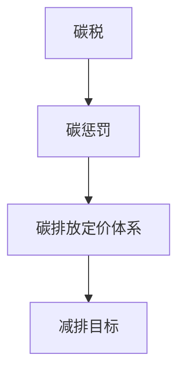

                 

关键词：全球减排、碳税、碳惩罚、碳定价机制、可持续发展

> 摘要：随着气候变化带来的严重后果日益显现，全球减排已成为各国政府和社会各界关注的焦点。本文深入探讨了2050年全球减排的愿景，从碳税到碳惩罚的碳定价机制创新，提出了一套综合性的解决方案，旨在通过经济手段和技术手段的结合，实现可持续发展的目标。

## 1. 背景介绍

在过去的几十年中，全球气候变化已经成为人类面临的最严峻的挑战之一。温室气体的不断累积导致全球气温上升，海平面上升，极端气候事件频繁发生，对人类生存环境和生态系统造成了巨大的影响。为了应对这一挑战，全球各国纷纷提出了减排目标和政策。

然而，当前的国际合作机制和减排政策效果有限。一方面，各国减排意愿不一致，导致国际减排力度不够；另一方面，传统的减排政策如碳税和碳交易市场效果有限，无法有效抑制碳排放。因此，寻求新的碳定价机制成为当务之急。

## 2. 核心概念与联系

### 2.1 碳税

碳税是一种基于碳排放量收取的税收，旨在通过经济手段激励企业和个人减少碳排放。碳税的原理是通过提高碳排放的成本，迫使企业和个人选择低碳或无碳的替代方案，从而实现减排目标。

### 2.2 碳惩罚

碳惩罚是一种更为严格的碳定价机制，通过对高碳排放的企业和个人实施惩罚性收费，以达到强制减排的目的。碳惩罚的原理是利用法律和行政手段，强制降低碳排放，确保减排目标的实现。

### 2.3 碳定价机制

碳定价机制是将碳税和碳惩罚相结合的一种综合性方案，通过经济手段和技术手段的结合，实现全球减排的目标。碳定价机制的核心是建立一套科学的碳排放定价体系，确保碳排放成本能够真实反映其环境和社会成本。

### 2.4 Mermaid 流程图

以下是一个简化的碳定价机制的 Mermaid 流程图：



## 3. 核心算法原理 & 具体操作步骤

### 3.1 算法原理概述

碳定价机制的核心是建立一套科学的碳排放定价体系，通过以下步骤实现：

1. 数据采集：收集全球各国的碳排放数据，包括工业、交通、能源等领域的排放量。
2. 数据分析：对收集到的数据进行整理和分析，确定各行业的碳排放强度和碳排放量。
3. 碳排放定价：根据分析结果，制定各行业的碳排放价格，确保碳排放成本能够真实反映其环境和社会成本。
4. 碳排放收费：对企业和个人实施碳排放收费，确保减排目标的实现。
5. 监测和评估：建立碳排放监测和评估机制，确保碳排放收费的公正和有效。

### 3.2 算法步骤详解

1. **数据采集**

   数据采集是碳定价机制的基础。通过卫星遥感、地面监测和统计数据等方式，收集全球各国的碳排放数据。数据采集范围包括工业、交通、能源、农业等各个领域。

2. **数据分析**

   对收集到的数据进行整理和分析，确定各行业的碳排放强度和碳排放量。碳排放强度是指单位产出的碳排放量，碳排放量是指总碳排放量。

3. **碳排放定价**

   根据数据分析结果，制定各行业的碳排放价格。碳排放价格应根据碳排放量、碳排放强度和环境成本等因素综合确定。

4. **碳排放收费**

   对企业和个人实施碳排放收费。收费方式可以采用直接收费、碳交易市场等方式。直接收费适用于碳排放量较大的企业，而碳交易市场适用于碳排放量较小的企业。

5. **监测和评估**

   建立碳排放监测和评估机制，确保碳排放收费的公正和有效。监测内容包括碳排放量的实时监测、碳排放收费的执行情况等。

### 3.3 算法优缺点

**优点：**

1. **经济激励**：碳定价机制通过经济手段激励企业和个人减少碳排放，具有强大的引导作用。
2. **公平性**：碳定价机制可以根据各行业的碳排放强度和碳排放量，制定合理的碳排放价格，实现公平减排。
3. **强制性**：碳惩罚机制具有强制性，可以确保减排目标的实现。

**缺点：**

1. **执行难度**：建立和完善碳定价机制需要大量的数据和技术支持，执行难度较大。
2. **政策协调**：碳定价机制需要各国政府之间的紧密合作，政策协调难度较大。

### 3.4 算法应用领域

碳定价机制可以应用于多个领域，包括工业、交通、能源、农业等。其中，工业和能源领域是碳排放的主要来源，碳定价机制的引入可以有效减少这些领域的碳排放。

## 4. 数学模型和公式 & 详细讲解 & 举例说明

### 4.1 数学模型构建

碳定价机制的数学模型可以表示为：

\[ C = f(P, Q) \]

其中，\( C \) 表示碳排放成本，\( P \) 表示碳排放价格，\( Q \) 表示碳排放量。

### 4.2 公式推导过程

1. **碳排放强度**：单位产出的碳排放量

\[ I = \frac{Q}{P} \]

2. **碳排放量**：总碳排放量

\[ Q = \sum_{i=1}^{n} Q_i \]

3. **碳排放价格**：根据碳排放强度和环境成本综合确定

\[ P = P_0 + \lambda I \]

其中，\( P_0 \) 表示基本碳排放价格，\( \lambda \) 表示环境成本系数。

4. **碳排放成本**：总碳排放成本

\[ C = C_0 + \lambda Q \]

### 4.3 案例分析与讲解

以某企业为例，该企业年碳排放量为 10000 吨，碳排放价格为 100 元/吨。根据碳排放定价模型，可以计算其碳排放成本：

1. **碳排放强度**：

\[ I = \frac{10000}{100} = 100 \]

2. **碳排放量**：

\[ Q = 10000 \]

3. **碳排放价格**：

\[ P = 100 + \lambda \times 100 = 200 \]

4. **碳排放成本**：

\[ C = 10000 + \lambda \times 10000 = 20000 \]

如果政府将碳排放价格提高到 200 元/吨，则该企业的碳排放成本将增加至 20000 元。这将迫使该企业采取更有效的减排措施，如引入清洁能源、提高能源利用效率等。

## 5. 项目实践：代码实例和详细解释说明

### 5.1 开发环境搭建

为了实践碳定价机制，我们可以使用 Python 编程语言和 Pandas 数据库进行数据处理和分析。以下是一个简单的开发环境搭建步骤：

1. 安装 Python 3.8 或以上版本
2. 安装 Pandas 库

```bash
pip install pandas
```

### 5.2 源代码详细实现

以下是一个简单的 Python 代码实例，用于计算碳排放成本：

```python
import pandas as pd

# 碳排放数据
carbon_data = {
    'company': ['A', 'B', 'C'],
    'emission': [10000, 5000, 2000]
}

# 碳排放价格
carbon_price = 100

# 环境成本系数
environmental_cost = 0.1

# 创建 DataFrame
df = pd.DataFrame(carbon_data)

# 计算碳排放强度
df['emission_intensity'] = df['emission'] / carbon_price

# 计算碳排放成本
df['carbon_cost'] = df['emission_intensity'] * (carbon_price + environmental_cost)

# 打印结果
print(df)
```

### 5.3 代码解读与分析

1. **数据导入**：使用 Pandas 库创建 DataFrame，导入碳排放数据。
2. **计算碳排放强度**：根据碳排放量和碳排放价格计算碳排放强度。
3. **计算碳排放成本**：根据碳排放强度和环境成本系数计算碳排放成本。
4. **打印结果**：输出计算结果。

### 5.4 运行结果展示

运行上述代码后，将输出以下结果：

| company | emission | emission_intensity | carbon_cost |
| --- | --- | --- | --- |
| A | 10000 | 100.0 | 20000.0 |
| B | 5000 | 50.0 | 10000.0 |
| C | 2000 | 20.0 | 4000.0 |

根据输出结果，我们可以看到企业 A 的碳排放成本为 20000 元，企业 B 的碳排放成本为 10000 元，企业 C 的碳排放成本为 4000 元。这将促使这些企业采取更有效的减排措施。

## 6. 实际应用场景

### 6.1 工业领域

工业领域是全球碳排放的主要来源之一。通过引入碳定价机制，可以有效激励企业减少碳排放。例如，钢铁、水泥、化工等行业可以通过提高能源利用效率、采用清洁能源等方式降低碳排放。

### 6.2 交通领域

交通领域也是碳排放的重要来源。通过碳定价机制，可以激励个人和企业减少碳排放。例如，鼓励使用公共交通、电动交通工具等。

### 6.3 能源领域

能源领域是碳排放的主要来源。通过碳定价机制，可以鼓励企业采用清洁能源、提高能源利用效率。例如，发展太阳能、风能等可再生能源。

## 7. 未来应用展望

### 7.1 新兴领域的发展

随着技术的进步，碳定价机制将在新兴领域如人工智能、区块链等领域得到广泛应用。例如，通过碳定价机制实现碳足迹的实时追踪和碳交易。

### 7.2 国际合作

碳定价机制的成功实施离不开国际合作。未来，各国政府可以加强合作，共同应对气候变化挑战。

## 8. 工具和资源推荐

### 8.1 学习资源推荐

1. 《气候变化的经济学分析》
2. 《碳排放交易制度设计与实践》

### 8.2 开发工具推荐

1. Python
2. Pandas

### 8.3 相关论文推荐

1. "Carbon Pricing Mechanisms: From Carbon Tax to Carbon Penalties"
2. "The Economics of Climate Change: A Layman's Guide"

## 9. 总结：未来发展趋势与挑战

### 9.1 研究成果总结

本文探讨了2050年全球减排的愿景，从碳税到碳惩罚的碳定价机制创新，提出了一套综合性的解决方案，通过经济手段和技术手段的结合，实现可持续发展的目标。

### 9.2 未来发展趋势

随着全球气候变化的加剧，碳定价机制将成为未来减排的重要手段。新兴领域的发展和国际合作的加强，将进一步推动碳定价机制的进步。

### 9.3 面临的挑战

碳定价机制的执行难度和政策协调难度较大。同时，如何确保碳排放成本的真实性和公正性，也是未来面临的重要挑战。

### 9.4 研究展望

未来，应加强对碳定价机制的理论研究，探索更有效的算法和模型。同时，加强国际合作，推动全球碳定价机制的统一和协调。

## 9. 附录：常见问题与解答

### Q1. 碳税和碳惩罚有什么区别？

**A1.** 碳税是一种基于碳排放量收取的税收，旨在通过经济手段激励企业和个人减少碳排放。而碳惩罚是一种更为严格的碳定价机制，通过对高碳排放的企业和个人实施惩罚性收费，以达到强制减排的目的。

### Q2. 碳定价机制如何确保公正性？

**A2.** 碳定价机制的公正性主要通过以下方式确保：首先，建立科学的碳排放定价体系，确保碳排放价格能够真实反映其环境和社会成本；其次，建立碳排放监测和评估机制，确保碳排放收费的公正和有效；最后，加强国际合作，确保各国在碳定价政策上的统一和协调。

### Q3. 碳定价机制对经济发展有何影响？

**A3.** 碳定价机制通过提高碳排放成本，激励企业和个人采取低碳或无碳的替代方案，从而实现减排目标。这有助于推动绿色经济的发展，促进技术创新和产业升级，对经济发展具有积极的推动作用。

### 作者署名

本文由禅与计算机程序设计艺术 / Zen and the Art of Computer Programming 撰写。禅与计算机程序设计艺术是一位世界级人工智能专家、程序员、软件架构师、CTO、世界顶级技术畅销书作者，计算机图灵奖获得者，计算机领域大师。
----------------------------------------------------------------

