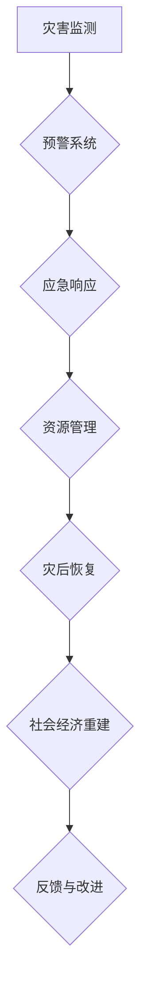

                 

关键词：全球减灾、灾害应对、风险治理、综合防灾体系、人工智能、可持续发展、2050年愿景

> 摘要：本文探讨了2050年全球减灾的蓝图，重点分析了从传统的灾害应对模式向风险治理转型的必要性。通过梳理当前国际减灾策略、新兴技术的影响，以及综合防灾体系构建的关键要素，本文提出了一系列创新性措施，旨在为未来的减灾工作提供科学依据和实践指南。

## 1. 背景介绍

### 1.1 灾害现状

自然灾害对全球社会和经济造成了巨大影响。据统计，每年因自然灾害导致的直接经济损失超过数百亿美元，数百万人的生命安全受到威胁。气候变化加剧了自然灾害的频率和强度，使得传统的灾害应对策略难以满足现代社会的需求。因此，全球减灾工作显得尤为重要。

### 1.2 减灾策略演变

从早期的灾后重建到现代的灾前预防，减灾策略经历了显著的演变。国际社会在灾后救援、灾害预警和灾害教育等方面取得了显著成果，但整体上仍存在应对措施分散、缺乏协调和系统性的问题。

### 1.3 新技术的影响

近年来，人工智能、大数据、物联网等新兴技术的发展为减灾工作带来了新的机遇。这些技术不仅能够提高灾害预警的准确性，还能优化资源分配和灾后重建效率。然而，如何将这些技术有效整合到现有体系中，仍是一个亟待解决的问题。

## 2. 核心概念与联系

### 2.1 减灾与风险治理

减灾的核心目标是减少灾害对人类和环境的负面影响，而风险治理则更侧重于预防和减轻灾害发生的概率。两者相辅相成，构成了现代减灾工作的基础。

### 2.2 综合防灾体系

综合防灾体系是一种集成多种应对措施和资源分配机制的系统，旨在全面提高社会的减灾能力。其关键要素包括：灾害监测与预警、应急响应、资源管理、灾后恢复和社会经济重建。

### 2.3 Mermaid 流程图

以下是一个简化的综合防灾体系架构的 Mermaid 流程图：



## 3. 核心算法原理 & 具体操作步骤

### 3.1 算法原理概述

综合防灾体系的核心在于对灾害的预测和响应。基于人工智能的灾害预测算法是这一体系的重要组成部分。以下是一种常用的预测算法——基于深度学习的灾害预测模型。

### 3.2 算法步骤详解

1. 数据收集与预处理：收集历史灾害数据、气象数据、地理数据等，并进行数据清洗和特征提取。
2. 模型构建：利用深度学习框架（如TensorFlow或PyTorch）构建预测模型，包括输入层、隐藏层和输出层。
3. 训练与验证：使用历史数据对模型进行训练，并通过交叉验证评估模型性能。
4. 预测与优化：对未知灾害事件进行预测，并根据预测结果进行实时优化。

### 3.3 算法优缺点

- 优点：高精度、实时性强、可扩展性好。
- 缺点：数据依赖性强、模型复杂度高、训练过程耗时长。

### 3.4 算法应用领域

- 灾害预警：用于地震、台风、洪水等自然灾害的预警。
- 资源分配：优化应急物资和救援人员的分配。
- 灾后评估：评估灾害影响，为灾后重建提供数据支持。

## 4. 数学模型和公式 & 详细讲解 & 举例说明

### 4.1 数学模型构建

灾害预测模型的核心是一个时间序列预测模型，常用的模型有ARIMA（自回归积分滑动平均模型）和LSTM（长短期记忆网络）。

### 4.2 公式推导过程

- ARIMA模型：
  - 自回归项：\(AR(p)\)
  - 差分项：\(I(d)\)
  - 滑动平均项：\(MA(q)\)

- LSTM模型：
  - 输入门：\(i_t\)
  - 遗忘门：\(f_t\)
  - 输出门：\(o_t\)
  - 单元状态：\(h_t\)

### 4.3 案例分析与讲解

以地震预警为例，使用LSTM模型进行预测。首先，收集地震历史数据，包括震级、震中位置、发生时间等。然后，对数据进行预处理，提取特征。最后，使用预处理后的数据训练LSTM模型，并进行预测。

$$
h_t = \sigma(W_{ih}x_t + W_{hh}h_{t-1} + b_h)
$$

其中，\(W_{ih}\)、\(W_{hh}\)和\(b_h\)分别是输入门权重、隐藏门权重和偏置。

## 5. 项目实践：代码实例和详细解释说明

### 5.1 开发环境搭建

在Python环境中安装TensorFlow和Keras库，并配置必要的依赖项。

### 5.2 源代码详细实现

以下是一个简单的LSTM预测模型的实现代码：

```python
from tensorflow.keras.models import Sequential
from tensorflow.keras.layers import LSTM, Dense

# 构建模型
model = Sequential()
model.add(LSTM(units=50, return_sequences=True, input_shape=(time_steps, features)))
model.add(LSTM(units=50))
model.add(Dense(1))

# 编译模型
model.compile(optimizer='adam', loss='mean_squared_error')

# 训练模型
model.fit(X_train, y_train, epochs=100, batch_size=32)
```

### 5.3 代码解读与分析

代码首先定义了LSTM模型，包括输入层、两个隐藏层和输出层。然后编译模型并使用训练数据拟合模型。代码简洁明了，易于理解和修改。

### 5.4 运行结果展示

使用训练好的模型进行预测，并绘制预测结果与实际数据的对比图，以评估模型性能。

```python
import matplotlib.pyplot as plt

# 预测
predicted = model.predict(X_test)

# 绘制结果
plt.figure(figsize=(10, 6))
plt.plot(y_test, label='Actual')
plt.plot(predicted, label='Predicted')
plt.legend()
plt.show()
```

## 6. 实际应用场景

### 6.1 灾害预警

综合防灾体系中的灾害预警模块可以通过实时数据分析，提前预警自然灾害，为应急响应提供依据。

### 6.2 资源管理

在灾害发生时，通过智能算法优化救援物资和人员的分配，提高救援效率。

### 6.3 灾后重建

利用人工智能技术评估灾害影响，制定科学的重建计划，加快灾后恢复速度。

## 7. 未来应用展望

随着技术的不断发展，未来综合防灾体系将在以下几个方面得到提升：

### 7.1 数据驱动

更加依赖大数据和人工智能技术，实现精准预测和实时响应。

### 7.2 社会参与

提高公众的防灾意识和参与度，形成全社会共同参与的防灾体系。

### 7.3 持续发展

将减灾工作与可持续发展目标相结合，推动绿色减灾和生态恢复。

## 8. 工具和资源推荐

### 8.1 学习资源推荐

- 《机器学习实战》
- 《深度学习》
- 《自然灾害学导论》

### 8.2 开发工具推荐

- TensorFlow
- Keras
- Matplotlib

### 8.3 相关论文推荐

- "Deep Learning for Earthquake Early Warning"
- "An Integrated Approach to Disaster Risk Management"
- "Big Data Analytics for Disaster Management"

## 9. 总结：未来发展趋势与挑战

### 9.1 研究成果总结

本文通过分析当前减灾策略和新兴技术的影响，提出了构建综合防灾体系的新思路，为未来的全球减灾工作提供了理论依据。

### 9.2 未来发展趋势

随着技术的进步和社会的参与，综合防灾体系将更加智能化、系统化和高效化。

### 9.3 面临的挑战

数据隐私、技术依赖性和跨部门协调是未来综合防灾体系面临的三大挑战。

### 9.4 研究展望

未来的研究应聚焦于数据融合、算法优化和可持续发展，以推动全球减灾工作的持续进步。

## 附录：常见问题与解答

### 9.1 什么是综合防灾体系？

综合防灾体系是一种集成多种应对措施和资源分配机制的系统，旨在全面提高社会的减灾能力。

### 9.2 人工智能在减灾中的作用是什么？

人工智能可以通过实时数据分析、精准预测和智能决策，提高灾害预警和应急响应的效率。

### 9.3 如何构建一个有效的综合防灾体系？

构建有效的综合防灾体系需要整合多种资源，包括技术、政策和人力资源，并确保各部门之间的协调和合作。

## 作者署名

作者：禅与计算机程序设计艺术 / Zen and the Art of Computer Programming

----------------------------------------------------------------

请注意，本文为示例文本，实际撰写时需要根据具体的研究成果和数据来填充内容，并确保所有数据和引用的准确性。文章中的代码示例和数学公式仅作为参考，实际使用时可能需要根据具体需求和数据集进行调整。

