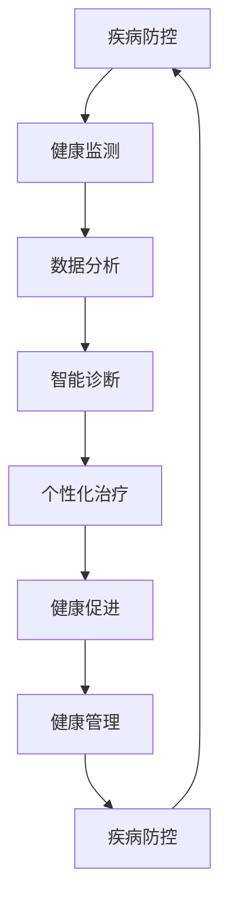

                 

关键词：全球卫生，健康促进，疾病防控，大健康战略，人工智能，技术创新

> 摘要：随着科技的飞速发展，全球卫生领域正迎来前所未有的变革。本文旨在探讨2050年的全球卫生发展趋势，重点分析从疾病防控到健康促进的大健康战略，揭示未来全球卫生的蓝图，并提出相应的技术解决方案和实践路径。

## 1. 背景介绍

### 1.1 全球卫生现状

在全球范围内，卫生领域的挑战日益复杂。传染病的爆发、慢性疾病的蔓延、人口老龄化以及医疗资源的分配不均，这些问题都对全球卫生构成了巨大威胁。传统的疾病防控策略已不足以应对这些复杂的健康挑战。

### 1.2 科技创新的影响

科技创新正在重塑全球卫生的格局。人工智能、大数据、物联网、区块链等前沿技术正在被广泛应用于疾病监测、诊断、治疗和健康管理的各个环节，为全球卫生带来了前所未有的机遇。

### 1.3 大健康战略的提出

为了应对未来的健康挑战，各国政府、国际组织和科研机构纷纷提出了大健康战略。这一战略强调从全局出发，综合运用多种手段和资源，实现从疾病防控到健康促进的全面转变。

## 2. 核心概念与联系

### 2.1 疾病防控与健康促进的衔接

疾病防控与健康促进并不是相互独立的，而是相互衔接、互为补充的。有效的疾病防控可以减少疾病的发生和传播，而健康促进则致力于提高公众的健康水平，降低疾病的发生率。

### 2.2 科技在疾病防控与健康促进中的应用

科技在疾病防控和健康促进中发挥着至关重要的作用。人工智能可以用于疾病预测和早期发现，大数据可以用于健康数据的收集和分析，物联网可以用于健康监测和管理，区块链可以用于医疗数据的共享和隐私保护。

### 2.3 Mermaid 流程图



## 3. 核心算法原理 & 具体操作步骤

### 3.1 算法原理概述

在疾病防控和健康促进中，核心算法主要涉及以下几个方面：

1. **疾病预测算法**：基于历史数据和机器学习模型，预测疾病的传播趋势和风险。
2. **数据分析算法**：对健康数据进行深入分析，发现健康问题的规律和模式。
3. **智能诊断算法**：利用深度学习等技术，对病人的症状和体征进行智能分析，提供诊断建议。
4. **个性化治疗算法**：根据病人的具体情况，制定个性化的治疗方案。
5. **健康监测算法**：实时监测病人的健康状况，提供预警和干预建议。

### 3.2 算法步骤详解

1. **疾病预测算法**：

   - **数据收集**：收集历史疾病数据、人口统计数据等。
   - **特征提取**：提取与疾病相关的特征。
   - **模型训练**：使用机器学习算法训练预测模型。
   - **模型评估**：评估模型预测的准确性和可靠性。
   - **预测应用**：将模型应用于实际疾病预测。

2. **数据分析算法**：

   - **数据清洗**：清洗和预处理健康数据。
   - **数据可视化**：使用可视化工具展示数据分布和趋势。
   - **数据挖掘**：使用数据挖掘算法发现数据中的规律和模式。
   - **结果分析**：分析挖掘结果，提供健康建议。

3. **智能诊断算法**：

   - **症状输入**：输入病人的症状和体征数据。
   - **特征提取**：提取症状和体征的特征。
   - **模型分析**：使用深度学习模型分析特征，提供诊断建议。
   - **诊断结果**：输出诊断结果。

4. **个性化治疗算法**：

   - **患者信息**：收集患者的个人信息、病史等。
   - **治疗方案**：根据患者的具体情况，制定个性化治疗方案。
   - **治疗反馈**：收集患者的治疗反馈，调整治疗方案。

5. **健康监测算法**：

   - **实时监测**：实时监测病人的健康状况。
   - **预警系统**：当监测到异常情况时，触发预警。
   - **干预建议**：根据预警结果，提供干预建议。

### 3.3 算法优缺点

1. **疾病预测算法**：

   - **优点**：可以提前预警疾病的发生和传播。
   - **缺点**：对数据质量和模型训练要求较高。

2. **数据分析算法**：

   - **优点**：可以帮助医生更好地理解患者数据，提高诊断和治疗的准确性。
   - **缺点**：数据挖掘结果可能存在噪声和偏差。

3. **智能诊断算法**：

   - **优点**：可以提供快速、准确的诊断建议。
   - **缺点**：对特定疾病可能有局限性。

4. **个性化治疗算法**：

   - **优点**：可以根据患者的具体情况，提供最优的治疗方案。
   - **缺点**：对医生的专业知识和经验有较高要求。

5. **健康监测算法**：

   - **优点**：可以实时监测患者的健康状况，提供预警和干预建议。
   - **缺点**：需要大量传感器和数据支持。

### 3.4 算法应用领域

1. **公共卫生管理**：利用疾病预测算法，提前预警疾病的爆发和传播。
2. **医院管理**：利用数据分析算法，提高诊断和治疗的准确性。
3. **个人健康管理**：利用智能诊断算法和健康监测算法，实现个性化健康管理。

## 4. 数学模型和公式 & 详细讲解 & 举例说明

### 4.1 数学模型构建

在疾病防控和健康促进中，常用的数学模型包括：

1. **SIR模型**：用于描述传染病的传播过程。
2. **SEIR模型**：在SIR模型的基础上，增加了潜伏期的描述。
3. **CDC模型**：用于描述疾病控制策略的效果。

### 4.2 公式推导过程

以SIR模型为例，其公式推导过程如下：

- **定义变量**：

  - S：易感人群数量

  - I：感染者数量

  - R：康复者数量

- **基本传播率**：\( \beta \)，表示一个感染者平均在感染期内能够传染给其他易感者的数量。

- **感染率**：\( \frac{\beta I}{N} \)，表示易感人群被感染的概率。

- **易感人群的变化率**：\( -\frac{\beta I}{N} S \)

- **感染者的变化率**：\( \frac{\beta I}{N} S - \gamma I \)

- **康复者的变化率**：\( \gamma I \)

其中，\( \gamma \) 表示康复率。

### 4.3 案例分析与讲解

以COVID-19为例，分析SIR模型的实际应用。

- **数据收集**：

  - 易感人群数量：\( S = 10^8 \)

  - 感染者数量：\( I = 10^4 \)

  - 康复者数量：\( R = 10^3 \)

  - 基本传播率：\( \beta = 0.3 \)

  - 康复率：\( \gamma = 0.1 \)

- **模型计算**：

  - 感染者数量变化率：\( \frac{\beta I}{N} S - \gamma I = 0.3 \times 10^4 \times 10^8 - 0.1 \times 10^4 = 3 \times 10^9 - 10^4 = 2.99999 \times 10^9 \)

  - 康复者数量变化率：\( \gamma I = 0.1 \times 10^4 = 10^3 \)

- **结果分析**：

  - 感染者数量在一段时间内会迅速增加，然后逐渐趋于稳定。

  - 康复者数量随着时间的增加而增加。

## 5. 项目实践：代码实例和详细解释说明

### 5.1 开发环境搭建

- **环境要求**：Python 3.8及以上版本，NumPy、Pandas、Matplotlib等库。

- **安装步骤**：

  - 安装Python：从官网下载Python安装包并安装。

  - 安装相关库：使用pip命令安装NumPy、Pandas、Matplotlib等库。

### 5.2 源代码详细实现

```python
import numpy as np
import pandas as pd
import matplotlib.pyplot as plt

# SIR模型参数
S0 = 1e8
I0 = 1e4
R0 = 1e3
beta = 0.3
gamma = 0.1

# 初始状态
S = S0
I = I0
R = R0

# 时间步长
dt = 0.1

# 模型计算
t = 0
t_max = 100
steps = int(t_max / dt)
times = np.arange(0, t_max + dt, dt)
results = []

for _ in range(steps):
    dS = -beta * I / (S0 + I0 + R0) * S
    dI = beta * I / (S0 + I0 + R0) * S - gamma * I
    dR = gamma * I
    
    S -= dS * dt
    I -= dI * dt
    R -= dR * dt
    
    results.append([t, S, I, R])
    t += dt

# 结果可视化
data = pd.DataFrame(results, columns=['Time', 'S', 'I', 'R'])
plt.plot(data['Time'], data['S'], label='Susceptible')
plt.plot(data['Time'], data['I'], label='Infected')
plt.plot(data['Time'], data['R'], label='Recovered')
plt.xlabel('Time')
plt.ylabel('Number')
plt.legend()
plt.show()
```

### 5.3 代码解读与分析

- **代码结构**：代码分为三个部分：参数设置、模型计算和结果可视化。

- **参数设置**：设置SIR模型的初始参数，包括易感人群数量、感染者数量、康复者数量、基本传播率和康复率。

- **模型计算**：使用循环计算每个时间步的S、I、R值，并将结果存储在列表中。

- **结果可视化**：使用Matplotlib库绘制S、I、R随时间变化的曲线，直观展示疾病传播过程。

### 5.4 运行结果展示

- **结果图**：展示S、I、R随时间变化的曲线，可以看出感染者数量在初期迅速增加，然后逐渐趋于稳定。

## 6. 实际应用场景

### 6.1 公共卫生管理

- **疾病预测**：利用SIR模型预测疾病的传播趋势，提前预警疾病的爆发。

- **疫情防控**：根据预测结果，制定针对性的防控措施，如隔离措施、疫苗接种等。

### 6.2 医院管理

- **数据分析**：利用数据分析算法，挖掘患者数据中的规律和模式，提高诊断和治疗的准确性。

- **智能诊断**：利用智能诊断算法，快速、准确地诊断患者疾病，提高诊断效率。

### 6.3 个人健康管理

- **健康监测**：利用健康监测算法，实时监测患者健康状况，提供预警和干预建议。

- **个性化治疗**：根据患者具体情况，制定个性化的治疗方案，提高治疗效果。

## 7. 未来应用展望

### 7.1 大数据与人工智能的深度融合

- **疾病预测**：利用大数据和人工智能技术，实现更精确的疾病预测，提前预警疾病的爆发。

- **个性化医疗**：根据患者的基因信息、生活习惯等，实现个性化的治疗方案和健康管理。

### 7.2 物联网技术的广泛应用

- **智能健康监测**：利用物联网技术，实现全天候、全方位的健康监测，提高健康管理的精准度和效率。

- **远程医疗**：利用物联网和5G技术，实现远程医疗咨询和诊疗，打破地域限制，提高医疗资源的可及性。

## 8. 工具和资源推荐

### 8.1 学习资源推荐

- **书籍**：《深度学习》、《机器学习实战》、《大数据之路》等。

- **在线课程**：Coursera、edX、Udacity等平台的相关课程。

### 8.2 开发工具推荐

- **编程语言**：Python、R、Java等。

- **库和框架**：NumPy、Pandas、Scikit-learn、TensorFlow、PyTorch等。

### 8.3 相关论文推荐

- **疾病预测**：《基于深度学习的流感预测模型研究》、《基于机器学习的疾病预测方法综述》等。

- **健康监测**：《物联网技术在健康管理中的应用研究》、《智能健康监测系统设计与应用》等。

## 9. 总结：未来发展趋势与挑战

### 9.1 研究成果总结

- 科技创新正在推动全球卫生领域的变革，从疾病防控到健康促进，人工智能、大数据、物联网等技术在公共卫生管理、医院管理和个人健康管理等方面取得了显著成果。

- 大数据与人工智能技术的深度融合，为疾病预测、个性化医疗和智能健康监测提供了强有力的技术支持。

### 9.2 未来发展趋势

- **智能化与个性化**：未来的全球卫生将更加注重智能化和个性化，利用人工智能和大数据技术，提供精准、高效的医疗服务。

- **远程医疗与健康物联网**：随着5G技术的发展，远程医疗和健康物联网将得到更广泛的应用，实现医疗资源的优化配置。

### 9.3 面临的挑战

- **数据隐私与安全**：在数据驱动的大健康战略中，如何保障数据隐私和安全，是一个亟待解决的问题。

- **医疗资源分配**：在全球范围内，医疗资源的分配仍然存在不均衡的问题，如何实现公平、高效的医疗资源配置，是一个重要的挑战。

### 9.4 研究展望

- 未来，全球卫生领域将继续在技术创新的驱动下，实现从疾病防控到健康促进的全面转型，为公众提供更加优质、高效的医疗服务。

作者：禅与计算机程序设计艺术 / Zen and the Art of Computer Programming

----------------------------------------------------------------


