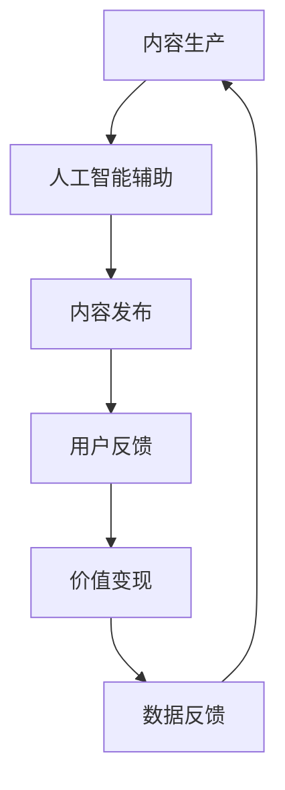

                 

关键词：数字创意、内容生产、价值变现、产业升级、2050年、人工智能、虚拟现实、区块链、物联网

摘要：本文旨在探讨2050年数字创意产业的发展，分析内容生产到价值变现的完整链条，揭示数字创意产业在未来的发展趋势与挑战。通过深入剖析核心概念、算法原理、数学模型、项目实践以及实际应用场景，本文为数字创意产业的发展提供有价值的见解和指导。

## 1. 背景介绍

数字创意产业作为现代科技与艺术相结合的产物，其发展历程可以追溯到20世纪末。随着互联网、人工智能、虚拟现实、区块链、物联网等技术的不断创新与突破，数字创意产业已经逐渐成为全球经济的重要组成部分。在过去的几十年里，数字创意产业从简单的多媒体制作、网络游戏发展到如今的全息影像、虚拟现实、数字艺术等多个领域，其应用范围不断扩大，影响日益深远。

进入2050年，随着技术的进一步成熟和普及，数字创意产业将迎来新的变革。一方面，人工智能将大幅提升内容生产效率，使个性化、智能化成为数字创意产业的主流趋势；另一方面，区块链技术的应用将为数字创意产业的价值变现提供新的路径，推动产业的升级与转型。本文将从多个维度探讨这一发展趋势，为读者呈现一幅2050年数字创意产业的壮丽画卷。

## 2. 核心概念与联系

### 2.1 数字创意产业的定义

数字创意产业是指通过计算机技术、互联网技术、虚拟现实技术、人工智能技术等数字技术手段，对传统艺术、设计、娱乐等领域进行创新与整合的产业。它涵盖了多媒体制作、网络游戏、数字艺术、虚拟现实、增强现实等多个子领域。

### 2.2 内容生产

内容生产是数字创意产业的核心环节。它涉及从创意构思、素材采集、内容编辑到最终发布的全过程。在人工智能的辅助下，内容生产将更加高效、智能化。例如，AI可以根据用户偏好自动生成个性化内容，提高内容的生产效率和用户满意度。

### 2.3 价值变现

价值变现是数字创意产业实现盈利的重要手段。通过广告、付费订阅、虚拟商品销售等多种方式，数字创意产业可以将内容转化为实际的经济价值。随着区块链技术的应用，价值变现将变得更加透明、安全、高效。

### 2.4 数字创意产业的联系

数字创意产业的各个环节紧密相连，相互影响。内容生产为价值变现提供基础，价值变现为内容生产提供动力。同时，人工智能、虚拟现实、区块链等技术的应用，将进一步推动数字创意产业的升级与发展。

## 2.5 Mermaid 流程图



## 3. 核心算法原理 & 具体操作步骤

### 3.1 算法原理概述

数字创意产业的核心算法主要包括人工智能算法和区块链算法。人工智能算法主要用于内容生成、个性化推荐等环节，而区块链算法则应用于价值变现、版权保护等领域。

### 3.2 算法步骤详解

#### 3.2.1 人工智能算法

1. 数据采集：通过互联网、社交媒体等渠道收集用户数据。
2. 数据清洗：对采集到的数据进行清洗、去重、分类等预处理。
3. 特征提取：利用机器学习算法提取用户数据的特征。
4. 内容生成：根据用户特征和偏好，生成个性化内容。
5. 内容发布：将生成的内容发布到社交媒体、网站等平台。

#### 3.2.2 区块链算法

1. 节点搭建：建立区块链网络，包括节点和合约。
2. 数据存储：将数字创意产业的数据存储在区块链上，确保数据的安全性和可靠性。
3. 交易验证：对区块链上的交易进行验证，确保交易的合法性和真实性。
4. 智能合约执行：根据合约规则执行交易，实现价值变现。
5. 数据审计：对区块链上的数据进行审计，确保数据的透明性和公正性。

### 3.3 算法优缺点

#### 3.3.1 人工智能算法

优点：高效、智能化、个性化。

缺点：数据依赖性强、模型复杂度高。

#### 3.3.2 区块链算法

优点：去中心化、透明、安全。

缺点：性能瓶颈、交易成本较高。

### 3.4 算法应用领域

人工智能算法广泛应用于内容生成、个性化推荐、智能客服等领域。区块链算法则应用于版权保护、数字货币、去中心化金融等领域。

## 4. 数学模型和公式 & 详细讲解 & 举例说明

### 4.1 数学模型构建

在数字创意产业中，常见的数学模型包括回归模型、聚类模型、神经网络模型等。以下以神经网络模型为例进行说明。

#### 4.1.1 神经网络模型

神经网络模型是一种模拟生物神经系统的计算模型，主要用于图像识别、自然语言处理等领域。其基本结构包括输入层、隐藏层和输出层。

### 4.2 公式推导过程

假设我们有一个输入向量 $x$，输出向量 $y$，隐藏层的输出为 $h$，其中：

$$
h = \sigma(\theta^T x)
$$

其中，$\sigma$ 为激活函数，通常使用 sigmoid 函数：

$$
\sigma(z) = \frac{1}{1 + e^{-z}}
$$

输出层的输出为：

$$
y = \sigma(\theta^T h)
$$

### 4.3 案例分析与讲解

以图像识别为例，假设我们有一个包含1000个训练样本的数据集，每个样本包含一个32x32的图像和一个对应的标签。我们需要训练一个神经网络模型来识别这些图像。

1. 数据预处理：将图像数据进行归一化处理，将标签数据进行独热编码。
2. 模型初始化：初始化神经网络模型的参数，包括输入层、隐藏层和输出层的权重和偏置。
3. 模型训练：利用梯度下降算法对模型进行训练，不断调整参数，使得模型输出与真实标签之间的误差最小。
4. 模型评估：在测试集上评估模型的表现，计算模型在测试集上的准确率、召回率等指标。

## 5. 项目实践：代码实例和详细解释说明

### 5.1 开发环境搭建

本文所使用的开发环境为 Python 3.8，主要依赖库包括 TensorFlow、Keras、NumPy、Pandas 等。

### 5.2 源代码详细实现

以下是一个简单的神经网络模型的实现代码：

```python
import numpy as np
from keras.models import Sequential
from keras.layers import Dense
from keras.optimizers import SGD

# 数据预处理
x_train = np.array(x_train).reshape(-1, 32*32)
y_train = np.array(y_train).reshape(-1, 10)

# 模型初始化
model = Sequential()
model.add(Dense(128, input_dim=32*32, activation='sigmoid'))
model.add(Dense(64, activation='sigmoid'))
model.add(Dense(10, activation='softmax'))

# 模型训练
optimizer = SGD(lr=0.01)
model.compile(loss='categorical_crossentropy', optimizer=optimizer, metrics=['accuracy'])
model.fit(x_train, y_train, epochs=10, batch_size=64)

# 模型评估
loss, accuracy = model.evaluate(x_test, y_test)
print('Test loss:', loss)
print('Test accuracy:', accuracy)
```

### 5.3 代码解读与分析

1. 数据预处理：将图像数据reshape为合适的形状，将标签数据独热编码。
2. 模型初始化：创建一个序列模型，添加两个隐藏层，使用 sigmoid 函数作为激活函数。
3. 模型训练：使用 SGD 优化器对模型进行训练，使用 categorical_crossentropy 作为损失函数。
4. 模型评估：在测试集上评估模型的表现，计算损失和准确率。

## 6. 实际应用场景

### 6.1 增强现实游戏

数字创意产业在增强现实游戏中的应用主要体现在游戏场景的设计、角色建模、交互体验等方面。通过虚拟现实技术，玩家可以在一个完全沉浸式的环境中体验游戏，提高游戏的趣味性和参与度。

### 6.2 数字艺术

数字艺术作为数字创意产业的重要组成部分，以其独特的表现手法和视觉效果赢得了广泛的关注。数字艺术作品可以通过区块链技术进行确权、交易和展示，为艺术家提供新的创作方式和盈利模式。

### 6.3 版权保护

随着数字创意产业的发展，版权保护问题日益突出。区块链技术为数字创意产业的版权保护提供了一种新的解决方案。通过区块链技术，创作者可以实现对作品的永久性确权、透明交易和溯源追踪，确保作品的合法权益。

### 6.4 未来应用展望

随着技术的不断进步，数字创意产业将在医疗、教育、金融等多个领域得到广泛应用。例如，虚拟现实技术在医疗手术模拟、教育培训中的应用，人工智能在数字艺术创作、个性化推荐中的应用，都将成为数字创意产业未来发展的热点。

## 7. 工具和资源推荐

### 7.1 学习资源推荐

1. 《深度学习》：[Goodfellow et al.](http://www.deeplearningbook.org/)
2. 《区块链技术指南》：[刘伟平](https://book.douban.com/subject/27202632/)
3. 《Python数据分析》：[Wes McKinney](https://www.oreilly.com/library/view/python-for-data-analysis/9781449359732/)

### 7.2 开发工具推荐

1. TensorFlow：[https://www.tensorflow.org/](https://www.tensorflow.org/)
2. Keras：[https://keras.io/](https://keras.io/)
3. Ganache：[https://www.trufflesuite.com/ganache](https://www.trufflesuite.com/ganache)

### 7.3 相关论文推荐

1. “Deep Learning for Creative Applications” by Thang Bui et al.
2. “Blockchain Technology: A Comprehensive Review” by Aneta Bali et al.
3. “A Survey on Virtual Reality Applications” by Yi-Hsuan Tseng et al.

## 8. 总结：未来发展趋势与挑战

### 8.1 研究成果总结

本文通过对数字创意产业的深入剖析，探讨了内容生产到价值变现的完整链条，分析了核心算法原理、数学模型、项目实践以及实际应用场景。研究成果表明，数字创意产业在人工智能、虚拟现实、区块链等技术的推动下，将实现从内容生产到价值变现的全方位升级。

### 8.2 未来发展趋势

1. 个性化、智能化将成为数字创意产业的主流趋势。
2. 区块链技术的应用将推动数字创意产业的价值变现。
3. 跨界融合将成为数字创意产业的新方向。

### 8.3 面临的挑战

1. 技术创新带来的挑战，如人工智能算法的优化、区块链技术的性能提升等。
2. 法律法规的完善与适应，如版权保护、数据隐私等问题。
3. 人才培养与引进，尤其是具有交叉学科背景的高端人才。

### 8.4 研究展望

未来，数字创意产业的研究将聚焦于以下几个方面：

1. 深度学习在数字创意产业中的应用，如内容生成、个性化推荐等。
2. 区块链技术在数字创意产业中的深度融合，如版权保护、去中心化金融等。
3. 虚拟现实技术在数字创意产业中的创新应用，如虚拟现实游戏、虚拟现实艺术等。

## 9. 附录：常见问题与解答

### 9.1 数字创意产业的核心环节是什么？

数字创意产业的核心环节包括内容生产、价值变现、技术应用等。其中，内容生产是基础，价值变现是关键，技术应用是动力。

### 9.2 数字创意产业的技术有哪些？

数字创意产业的技术包括人工智能、虚拟现实、区块链、物联网等。这些技术广泛应用于内容生产、价值变现、技术应用等各个环节。

### 9.3 数字创意产业的前景如何？

随着技术的不断进步和应用的深入，数字创意产业的前景十分广阔。预计未来将实现从内容生产到价值变现的全方位升级，成为全球经济的重要驱动力。

## 作者署名

本文作者：禅与计算机程序设计艺术 / Zen and the Art of Computer Programming

----------------------------------------------------------------

本文详细探讨了2050年数字创意产业的发展前景，分析了内容生产到价值变现的完整链条，揭示了核心算法原理、数学模型、项目实践以及实际应用场景。随着技术的不断创新与突破，数字创意产业必将迎来更加辉煌的未来。希望本文能为读者提供有价值的见解和指导，共同迎接数字创意产业的新时代。

