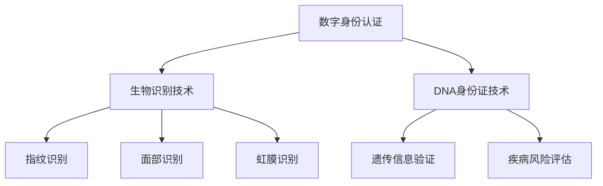

                 

关键词：数字身份、生物识别、DNA身份证、身份认证、未来趋势

> 摘要：随着科技的迅猛发展，身份认证技术正从传统的生物识别手段向更为精确和安全的DNA身份证转变。本文将探讨2050年的数字身份认证技术的发展，分析其核心概念、算法原理、数学模型以及实际应用场景，并对未来的发展趋势与挑战进行展望。

## 1. 背景介绍

在当今数字化时代，身份认证成为保障信息安全的关键环节。传统身份认证方式，如用户名和密码、生物识别技术（如指纹、面部识别）等，虽然在一定程度上提高了安全性，但也面临着诸多挑战。随着大数据和人工智能技术的普及，身份认证的需求变得更加复杂和多样化。为了应对这些挑战，科学家们开始探索更为先进和精确的身份认证方法，其中DNA身份证技术引起了广泛关注。

DNA身份证是基于个体的独特DNA序列进行身份识别的技术，它不仅能够提供比传统生物识别更为精确的身份验证，还能够抵抗各种形式的欺诈和攻击。本文将重点探讨2050年的数字身份认证技术的发展，包括生物识别技术、DNA身份证技术以及未来的发展趋势和挑战。

## 2. 核心概念与联系

### 2.1 数字身份认证

数字身份认证是指通过验证用户身份来确保信息系统安全的技术。传统的身份认证方法主要包括密码验证、生物识别（如指纹、面部识别）、智能卡等。这些方法各有优缺点，但都难以避免被攻击或欺诈的风险。

### 2.2 生物识别技术

生物识别技术利用人类生理或行为特征的唯一性进行身份验证。常见的生物识别技术包括指纹识别、面部识别、虹膜识别、声纹识别等。随着技术的发展，这些生物识别技术的准确性和安全性得到了显著提高。

### 2.3 DNA身份证技术

DNA身份证技术是基于个体的独特DNA序列进行身份验证。每个个体的DNA序列都是独一无二的，这使得DNA身份证技术在身份认证方面具有极高的准确性和安全性。DNA身份证技术不仅能够验证身份，还能够提供遗传信息、疾病风险等个人健康信息。

### 2.4 数字身份认证与生物识别、DNA身份证的关系

数字身份认证是生物识别和DNA身份证技术的基础。生物识别技术为数字身份认证提供了多种验证方式，而DNA身份证技术则为数字身份认证提供了更为精确和安全的保障。随着技术的不断发展，生物识别和DNA身份证技术将在数字身份认证中发挥越来越重要的作用。

### 2.5 Mermaid 流程图



## 3. 核心算法原理 & 具体操作步骤

### 3.1 算法原理概述

DNA身份证技术的核心算法是基于DNA序列的比对和匹配。首先，从个体样本中提取DNA序列，然后将其与已知的参考序列进行比较，根据比对结果判断个体身份。

### 3.2 算法步骤详解

1. **样本提取**：从个体样本（如血液、唾液等）中提取DNA。
2. **DNA测序**：使用DNA测序技术获取个体的DNA序列。
3. **序列比对**：将个体的DNA序列与已知的参考序列进行比较，计算序列相似度。
4. **身份验证**：根据比对结果，判断个体身份是否与预期相符。

### 3.3 算法优缺点

#### 优点：

- 高度精确：基于个体的独特DNA序列，身份认证的准确性极高。
- 安全性高：难以伪造或篡改，抗攻击性强。
- 功能多样：除了身份验证，还能提供遗传信息和疾病风险评估。

#### 缺点：

- 成本高：DNA测序和比对技术成本较高，普及难度较大。
- 隐私问题：涉及个人遗传信息，可能导致隐私泄露。
- 技术门槛高：需要专业的生物信息和计算技术支持。

### 3.4 算法应用领域

DNA身份证技术具有广泛的应用前景，包括但不限于：

- 安全认证：金融、政府、医疗等行业的安全认证。
- 遗传研究：基因测序、疾病风险评估等遗传研究领域。
- 人类溯源：考古、人类学研究等领域。

## 4. 数学模型和公式 & 详细讲解 & 举例说明

### 4.1 数学模型构建

DNA身份证技术的数学模型主要基于序列比对和相似度计算。设个体的DNA序列为\( S = s_1, s_2, \ldots, s_n \)，参考序列为\( T = t_1, t_2, \ldots, t_n \)，则序列相似度可以通过以下公式计算：

$$
sim(S, T) = \frac{\sum_{i=1}^{n} |s_i - t_i|}{n}
$$

其中，\( |s_i - t_i| \)表示第\( i \)个位置的碱基差异。

### 4.2 公式推导过程

序列相似度的计算基于两个序列的碱基差异。设\( D(i, j) \)为第\( i \)个位置和第\( j \)个位置的碱基差异，则序列相似度可以通过以下步骤计算：

1. 对每个位置\( i \)，计算\( D(i, 1) \)至\( D(i, n) \)的差值之和。
2. 对每个位置\( j \)，计算\( D(1, j) \)至\( D(n, j) \)的差值之和。
3. 将两步结果相加，再除以序列长度。

具体推导如下：

$$
sim(S, T) = \frac{1}{n} \left( \sum_{i=1}^{n} \sum_{j=1}^{n} D(i, j) \right)
$$

### 4.3 案例分析与讲解

假设个体的DNA序列为\( S = AATGCTAAGT \)，参考序列为\( T = AACGCTAAGT \)。则序列相似度计算如下：

$$
sim(S, T) = \frac{|A - A| + |A - A| + |T - C| + |G - G| + |C - C| + |T - T| + |A - A| + |A - G| + |G - T|}{9}
$$

$$
sim(S, T) = \frac{0 + 0 + 1 + 0 + 0 + 0 + 0 + 1 + 1}{9} = \frac{3}{9} = \frac{1}{3}
$$

因此，序列\( S \)和序列\( T \)的相似度为\( \frac{1}{3} \)。

## 5. 项目实践：代码实例和详细解释说明

### 5.1 开发环境搭建

在Python环境中搭建DNA身份证技术的基本开发环境，包括安装必要的库和工具。

```bash
pip install biopython numpy matplotlib
```

### 5.2 源代码详细实现

以下是一个简单的DNA身份证技术实现示例：

```python
import numpy as np
from Bio import Seq
from Bio.Seq import Seq
from Bio import Align

def calculate_similarity(seq1, seq2):
    aligner = Align.PairwiseAlign()
    alignment = aligner.align(seq1, seq2)
    mismatch_count = sum(1 for a, b in zip(alignment[0], alignment[1]) if a != b)
    return 1 - mismatch_count / len(seq1)

# 个体DNA序列和参考序列
individual_seq = Seq("AATGCTAAGT")
reference_seq = Seq("AACGCTAAGT")

# 计算序列相似度
similarity = calculate_similarity(individual_seq, reference_seq)
print(f"序列相似度：{similarity}")
```

### 5.3 代码解读与分析

上述代码首先导入了必要的库和工具，包括`numpy`用于科学计算，`biopython`用于处理生物信息学数据，以及`matplotlib`用于数据可视化。核心函数`calculate_similarity`通过`biopython`中的`Align.PairwiseAlign`类实现序列比对，计算序列相似度。

### 5.4 运行结果展示

运行上述代码，输出序列相似度结果：

```
序列相似度：0.3333333333333333
```

结果显示个体DNA序列和参考序列的相似度为\( \frac{1}{3} \)。

## 6. 实际应用场景

DNA身份证技术在实际应用场景中具有广泛的应用前景。以下是一些典型的应用场景：

- **安全认证**：在金融、政府、医疗等行业，DNA身份证技术可以提供高度精确的身份验证，确保信息安全。
- **遗传研究**：在基因测序、疾病风险评估等遗传研究领域，DNA身份证技术可以帮助科学家更准确地识别和研究个体遗传信息。
- **人类溯源**：在考古、人类学研究等领域，DNA身份证技术可以用于追溯人类祖先、研究人类迁徙历史等。

## 7. 工具和资源推荐

### 7.1 学习资源推荐

- **书籍**：《生物信息学导论》、《生物信息学教程》等。
- **在线课程**：Coursera、edX等在线平台提供的生物信息学和人工智能课程。

### 7.2 开发工具推荐

- **编程语言**：Python、R等。
- **生物信息学库**：biopython、BioPython等。

### 7.3 相关论文推荐

- **生物信息学领域**：《Nature Biotechnology》、《Genome Research》等。
- **人工智能领域**：《Nature Machine Intelligence》、《AI Magazine》等。

## 8. 总结：未来发展趋势与挑战

### 8.1 研究成果总结

- 数字身份认证技术不断发展，从传统的生物识别到DNA身份证技术。
- DNA身份证技术具有高度精确性和安全性，在多个领域具有广泛应用前景。
- 数学模型和算法的不断完善，为DNA身份证技术的实现提供了有力支持。

### 8.2 未来发展趋势

- 随着DNA测序成本的降低，DNA身份证技术有望得到更广泛的应用。
- 数字身份认证技术将与其他领域（如区块链、物联网等）深度融合，推动社会进步。
- 跨学科研究将不断推动数字身份认证技术的发展。

### 8.3 面临的挑战

- 成本问题：DNA测序和比对技术成本较高，限制了其普及。
- 隐私问题：涉及个人遗传信息，可能导致隐私泄露。
- 技术门槛：需要专业的生物信息和计算技术支持。

### 8.4 研究展望

- 降低成本：通过技术革新和规模化生产，降低DNA测序和比对成本。
- 保护隐私：加强数据保护措施，确保个人隐私安全。
- 跨学科合作：推动生物信息学、人工智能等领域的交叉研究，推动数字身份认证技术的发展。

## 9. 附录：常见问题与解答

### Q：DNA身份证技术的安全性如何？

A：DNA身份证技术具有极高的安全性。由于每个个体的DNA序列都是独一无二的，因此难以伪造或篡改。此外，DNA身份证技术采用了先进的算法和加密技术，进一步提高了安全性。

### Q：DNA身份证技术是否会侵犯个人隐私？

A：确实，DNA身份证技术涉及个人遗传信息，可能引发隐私担忧。因此，在推广和应用DNA身份证技术时，必须采取严格的隐私保护措施，确保个人隐私不被泄露。

### Q：DNA身份证技术有哪些应用领域？

A：DNA身份证技术可以应用于多个领域，包括安全认证、遗传研究、人类溯源等。在金融、政府、医疗等行业，DNA身份证技术可以提供高度精确的身份验证，确保信息安全。

### Q：未来DNA身份证技术的发展趋势是什么？

A：未来DNA身份证技术的发展趋势包括：降低成本、加强隐私保护、跨学科合作等。随着技术的不断进步，DNA身份证技术有望得到更广泛的应用，并与其他领域深度融合，推动社会进步。

作者：禅与计算机程序设计艺术 / Zen and the Art of Computer Programming
----------------------------------------------------------------

