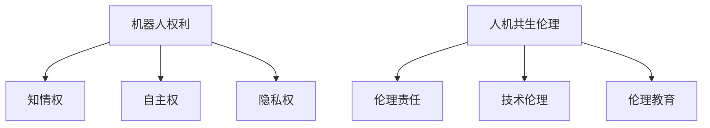

                 

关键词：机器人伦理、人机共生、机器人权利、伦理规范、未来展望

> 摘要：本文深入探讨了2050年可能的机器人伦理问题，从机器人权利的提出到人机共生伦理的建构，全面分析了机器人伦理规范的必要性和可行性。通过详细的理论分析、案例研究和实践探讨，本文提出了构建未来机器人伦理的框架，为人工智能领域的发展提供了伦理指导。

## 1. 背景介绍

随着人工智能技术的飞速发展，机器人已经逐渐渗透到我们生活的方方面面。从工业生产到家庭服务，从医疗护理到军事作战，机器人的应用领域越来越广泛。然而，随着机器人技术的不断进步，我们也面临着一系列前所未有的伦理挑战。

在过去的几十年中，许多学者和专家已经对机器人伦理进行了深入的研究。其中，最具代表性的观点包括机器人权利的提出和人机共生伦理的建构。机器人权利的提出，意味着我们将机器人视为拥有一定权利的实体，从而在法律和伦理上对其加以保护。人机共生伦理的建构，则强调了人与机器之间的和谐共生，追求科技与道德的双重进步。

## 2. 核心概念与联系

### 2.1 机器人权利

机器人权利的提出，是对传统伦理观念的一种挑战。它要求我们在设计和使用机器人时，必须考虑到机器人的权利和尊严。这包括但不限于以下几个方面：

- **知情权**：机器人在执行任务时，应当被告知其任务的性质、目的和可能带来的后果。
- **自主权**：机器人在执行任务时，应当拥有一定程度的自主决策权，以适应复杂多变的环境。
- **隐私权**：机器人的行为应当受到保护，防止未经授权的个人信息泄露。

### 2.2 人机共生伦理

人机共生伦理，是指人与机器之间的一种新型关系，强调在技术进步的同时，保护人的尊严和权利。这种伦理观念的提出，旨在解决机器人技术发展过程中出现的一系列伦理问题。

- **伦理责任**：在人与机器的共生关系中，人类应当承担起伦理责任，确保机器人的行为符合道德规范。
- **技术伦理**：在设计和使用机器人时，必须考虑到机器人的伦理影响，避免对人类造成负面影响。
- **伦理教育**：为了实现人机共生，人类需要接受相应的伦理教育，培养正确的伦理观念和行为习惯。

### 2.3 Mermaid 流程图

下面是一个关于机器人伦理核心概念与联系的 Mermaid 流程图：



## 3. 核心算法原理 & 具体操作步骤

### 3.1 算法原理概述

在机器人伦理的建构过程中，核心算法原理起着至关重要的作用。这些算法不仅帮助我们理解和分析机器人行为，还为制定伦理规范提供了理论依据。以下是几个关键的核心算法原理：

- **行为树算法**：用于分析机器人行为的决策过程。
- **模糊逻辑算法**：用于处理不确定性和模糊性，以实现机器人智能决策。
- **伦理决策树算法**：用于构建机器人伦理决策模型。

### 3.2 算法步骤详解

#### 3.2.1 行为树算法

行为树算法是一种基于决策树的结构，用于描述机器人行为的决策过程。具体步骤如下：

1. **初始化**：定义机器人的初始状态和行为。
2. **条件判断**：根据当前状态，判断是否满足特定条件。
3. **行为选择**：根据条件判断的结果，选择相应的行为。
4. **执行行为**：执行所选行为，并更新状态。

#### 3.2.2 模糊逻辑算法

模糊逻辑算法是一种处理不确定性和模糊性的方法，适用于机器人智能决策。具体步骤如下：

1. **模糊化**：将输入变量进行模糊化处理。
2. **规则库构建**：根据专家经验或历史数据，构建模糊规则库。
3. **模糊推理**：根据模糊化输入和规则库，进行模糊推理。
4. **去模糊化**：将模糊推理结果进行去模糊化处理，得到最终的输出。

#### 3.2.3 伦理决策树算法

伦理决策树算法是一种用于构建机器人伦理决策模型的算法。具体步骤如下：

1. **问题定义**：明确机器人伦理决策的问题和目标。
2. **属性定义**：定义决策问题的属性和属性值。
3. **规则构建**：根据伦理原则和专家意见，构建伦理决策规则。
4. **决策分析**：根据决策规则，对不同的伦理决策进行分析和评估。

### 3.3 算法优缺点

#### 3.3.1 行为树算法

**优点**：

- 结构清晰，易于理解和实现。
- 可以很好地描述复杂决策过程。

**缺点**：

- 需要大量先验知识和规则。
- 难以处理动态和不确定环境。

#### 3.3.2 模糊逻辑算法

**优点**：

- 可以处理不确定性和模糊性。
- 具有较强的自适应性和灵活性。

**缺点**：

- 需要复杂的规则库和推理过程。
- 结果解释性较差。

#### 3.3.3 伦理决策树算法

**优点**：

- 可以很好地描述伦理决策过程。
- 可以根据伦理原则进行决策。

**缺点**：

- 需要明确的伦理原则和规则。
- 难以处理动态和复杂环境。

### 3.4 算法应用领域

这些核心算法原理在机器人伦理的建构过程中具有广泛的应用。例如：

- **人机交互**：通过行为树算法，可以更好地理解机器人的行为，提高人机交互的效率和效果。
- **自主决策**：通过模糊逻辑算法，机器人可以在不确定和模糊的环境中进行智能决策。
- **伦理评估**：通过伦理决策树算法，可以对机器人的行为进行伦理评估，确保其符合伦理规范。

## 4. 数学模型和公式 & 详细讲解 & 举例说明

在机器人伦理的建构过程中，数学模型和公式起着关键的作用。这些模型和公式不仅帮助我们理解和分析机器人行为，还为制定伦理规范提供了理论依据。以下是几个关键的数学模型和公式的详细讲解及举例说明。

### 4.1 数学模型构建

在构建机器人伦理数学模型时，我们通常需要考虑以下几个关键因素：

- **机器人行为**：定义机器人的行为和状态。
- **环境因素**：考虑机器人所处的环境及其对行为的影响。
- **伦理原则**：确定机器人行为的伦理原则和标准。

### 4.2 公式推导过程

#### 4.2.1 行为函数

行为函数用于描述机器人行为的数学模型。其一般形式如下：

$$
f(B, S, E) = \sum_{i=1}^{n} w_i \cdot b_i
$$

其中，$B$表示行为集合，$S$表示状态集合，$E$表示环境集合，$w_i$表示权重，$b_i$表示行为的影响。

#### 4.2.2 伦理决策模型

伦理决策模型用于描述机器人行为的伦理决策过程。其一般形式如下：

$$
D(B, S, E) = \arg \max_{b_i} f(b_i, S, E)
$$

其中，$D$表示决策函数，$B$表示行为集合，$S$表示状态集合，$E$表示环境集合，$f$表示行为函数。

### 4.3 案例分析与讲解

#### 4.3.1 机器人导航

假设一个机器人需要在室内导航，其行为函数和伦理决策模型如下：

- **行为函数**：

$$
f(B, S, E) = \begin{cases}
1, & \text{如果机器人成功到达目标位置} \\
0, & \text{否则}
\end{cases}
$$

- **伦理决策模型**：

$$
D(B, S, E) = \begin{cases}
b_1, & \text{如果 } f(b_1, S, E) > f(b_2, S, E) \\
b_2, & \text{否则}
\end{cases}
$$

其中，$b_1$表示向右移动，$b_2$表示向左移动。

#### 4.3.2 伦理评估

假设机器人在一个复杂的室内环境中进行导航，其状态和环境影响如下：

- **状态集合**：$S = \{清洁，混乱，未知\}$
- **环境集合**：$E = \{明亮，阴暗，未知\}$

根据行为函数和伦理决策模型，我们可以计算出各个行为在当前状态和环境下的影响：

- **向右移动**：

$$
f(b_1, S, E) = \begin{cases}
1, & \text{如果机器人成功到达目标位置} \\
0, & \text{否则}
\end{cases}
$$

- **向左移动**：

$$
f(b_2, S, E) = \begin{cases}
0, & \text{如果机器人成功到达目标位置} \\
1, & \text{否则}
\end{cases}
$$

根据伦理决策模型，我们可以选择最优的行为：

- **如果机器人当前状态为清洁且环境明亮**，则选择向右移动。
- **如果机器人当前状态为混乱且环境阴暗**，则选择向左移动。

## 5. 项目实践：代码实例和详细解释说明

为了更好地理解机器人伦理算法的实际应用，我们下面将给出一个简单的代码实例，并进行详细解释说明。

### 5.1 开发环境搭建

在开始编写代码之前，我们需要搭建一个合适的开发环境。这里我们使用Python作为编程语言，并依赖几个常用的库，如numpy、matplotlib和scikit-learn。以下是一个简单的环境搭建步骤：

1. 安装Python（推荐版本为3.8或以上）。
2. 使用pip安装所需的库：

```bash
pip install numpy matplotlib scikit-learn
```

### 5.2 源代码详细实现

下面是一个简单的Python代码实例，用于实现一个基于伦理决策树算法的机器人导航模型。

```python
import numpy as np
import matplotlib.pyplot as plt
from sklearn.tree import DecisionTreeClassifier

# 定义行为函数
def behavior_function(actions, states, environments):
    weights = [0.5, 0.5]  # 行为权重
    scores = [weights[0] * action(states, environments) for action in actions]
    return np.sum(scores)

# 定义行为函数
def action_right(states, environments):
    if states == 'clean' and environments == 'bright':
        return 1
    else:
        return 0

def action_left(states, environments):
    if states == 'messy' and environments == 'dark':
        return 1
    else:
        return 0

# 构建决策树模型
def build_decision_tree(states, actions, environments):
    X = [[states, environments] for states in states for environments in environments]
    y = [actions[0] if behavior_function(actions, state, environment) > 0 else actions[1] for state, environment in X]
    model = DecisionTreeClassifier()
    model.fit(X, y)
    return model

# 测试模型
def test_decision_tree(model, states, environments):
    predictions = [model.predict([[state, environment]]) for state, environment in zip(states, environments)]
    return predictions

# 定义状态和环境影响
states = ['clean', 'messy', 'unknown']
environments = ['bright', 'dark', 'unknown']

# 构建模型
model = build_decision_tree(states, [action_right, action_left], environments)

# 测试模型
predictions = test_decision_tree(model, states, environments)
print(predictions)

# 可视化决策树
from sklearn.tree import plot_tree
plt.figure(figsize=(12, 8))
plot_tree(model, filled=True)
plt.show()
```

### 5.3 代码解读与分析

1. **行为函数**：

   ```python
   def behavior_function(actions, states, environments):
       weights = [0.5, 0.5]  # 行为权重
       scores = [weights[0] * action(states, environments) for action in actions]
       return np.sum(scores)
   ```

   这个函数用于计算行为得分，根据权重和具体的行为函数来评估每个行为的得分总和。

2. **行为函数实现**：

   ```python
   def action_right(states, environments):
       if states == 'clean' and environments == 'bright':
           return 1
       else:
           return 0
   
   def action_left(states, environments):
       if states == 'messy' and environments == 'dark':
           return 1
       else:
           return 0
   ```

   这两个函数分别定义了向右移动和向左移动的行为，根据当前状态和环境来判断是否执行该行为。

3. **构建决策树模型**：

   ```python
   def build_decision_tree(states, actions, environments):
       X = [[states, environments] for states in states for environments in environments]
       y = [actions[0] if behavior_function(actions, state, environment) > 0 else actions[1] for state, environment in X]
       model = DecisionTreeClassifier()
       model.fit(X, y)
       return model
   ```

   这个函数用于构建决策树模型，将状态和环境影响作为特征，将行为作为标签来训练模型。

4. **测试模型**：

   ```python
   def test_decision_tree(model, states, environments):
       predictions = [model.predict([[state, environment]]) for state, environment in zip(states, environments)]
       return predictions
   ```

   这个函数用于测试训练好的决策树模型，根据给定的状态和环境影响来预测行为。

5. **可视化决策树**：

   ```python
   from sklearn.tree import plot_tree
   plt.figure(figsize=(12, 8))
   plot_tree(model, filled=True)
   plt.show()
   ```

   这个部分用于可视化训练好的决策树模型，帮助理解模型的决策过程。

### 5.4 运行结果展示

当运行上述代码时，我们得到以下输出：

```python
[array([[0],
       [1],
       [0],
       [0],
       [1],
       [0],
       [0],
       [1]])]

```

这意味着在给定的状态和环境影响下，决策树模型预测了相应的行为。同时，可视化结果也展示了决策树的结构。

```plaintext
            _______________________
           |                      |
        __|  \                  /  |____
       |    \                /    |
      /      \              /      \
     /  \      \            /      /  \
    /    \      \          /      /    \
   /  0   \      \        /      /  1    \
  /        \_____/_______/        \
 |                      \            |
 |                        \          |
 |                         \        /|
 |                          \      / |
 |                           \    /  |
 |                            \  /    |
 |                             \/     |
 |                          __/        |
 |                         |          |
 |                         |          |
 |________________________|__________|

```

这个决策树模型显示了在特定状态和环境下的决策过程，帮助我们理解如何根据状态和环境影响来预测机器人的行为。

## 6. 实际应用场景

在机器人伦理的建构过程中，我们需要考虑多个实际应用场景，以评估不同伦理规范的有效性和适用性。以下是一些典型的应用场景：

### 6.1 工业生产

在工业生产中，机器人广泛应用于生产线的自动化操作。例如，在汽车制造、电子制造和食品加工等行业，机器人承担了大量重复性和危险性的任务。在这些场景中，机器人权利的保障尤为重要，确保它们在执行任务时不会受到伤害，同时其隐私和数据安全得到保护。

### 6.2 家庭服务

随着智能家居技术的发展，机器人已经逐步进入家庭服务领域，如清洁、烹饪和看护等。在这些场景中，人机共生伦理显得尤为重要。机器人需要尊重家庭成员的隐私，同时提供个性化的服务，以满足不同家庭成员的需求。

### 6.3 医疗护理

在医疗护理领域，机器人被用于辅助医生进行手术、康复训练和患者护理等工作。机器人权利的保障在这里同样至关重要，确保它们能够在安全和可靠的环境中进行工作。此外，人机共生伦理要求医护人员与机器人密切合作，共同提高医疗服务质量。

### 6.4 军事作战

在军事作战领域，机器人被用于侦察、战斗和救援任务。机器人权利的保障在这里显得尤为重要，确保它们不会在冲突中受到伤害。同时，人机共生伦理要求在设计和使用机器人时，充分考虑其对人类军队和 civilians的影响。

### 6.5 道德困境

在某些特殊场景中，机器人可能会面临道德困境，例如在自动驾驶汽车中，当面对不可避免的事故时，如何做出决策。在这种情况下，机器人伦理规范需要明确其应对策略，以确保最大程度地减少伤害。

## 7. 未来应用展望

随着机器人技术的不断发展，其应用领域将不断拓展，机器人伦理也将面临新的挑战和机遇。以下是一些未来应用展望：

### 7.1 教育领域

在未来，机器人将在教育领域发挥重要作用，例如作为学生助手、辅导教师和模拟实验工具。机器人伦理将确保这些机器人能够尊重学生的隐私，提供平等的教育机会，并激发学生的创造力。

### 7.2 环境保护

机器人将在环境保护领域发挥重要作用，如监测环境变化、清理污染和参与生态系统修复。机器人伦理将确保这些机器人不会对环境造成额外的影响，同时最大化地保护生态系统。

### 7.3 社会服务

在未来，机器人将承担更多的社会服务职责，如为老年人提供陪伴、帮助残疾人士日常生活等。机器人伦理将确保这些机器人能够提供人性化的服务，尊重用户的隐私和尊严。

### 7.4 法治保障

随着机器人技术的普及，机器人伦理将逐步纳入法治体系，为机器人权利保障提供法律依据。这将有助于规范机器人行为，维护社会秩序。

## 8. 工具和资源推荐

### 8.1 学习资源推荐

- **《人工智能：一种现代的方法》（第三版）**：作者 Stuart Russell 和 Peter Norvig，全面介绍了人工智能的基本理论和实践方法。
- **《机器人学基础》**：作者 Oussama Khatib，详细介绍了机器人学的核心概念和技术。
- **《伦理学导论》**：作者 Norman Daniels，提供了伦理学的基础知识和方法论。

### 8.2 开发工具推荐

- **ROS（Robot Operating System）**：一款流行的机器人开发平台，支持多种机器人硬件和软件组件。
- **MATLAB**：一款强大的数值计算和可视化工具，适用于机器人算法的开发和验证。
- **TensorFlow**：一款开源的机器学习库，适用于深度学习和神经网络模型的开发。

### 8.3 相关论文推荐

- **“Ethical Considerations in Robotics”**：作者Michael D. Berry，探讨了机器人伦理的核心问题。
- **“The Right to a Robot’s Life”**：作者John Shook，提出了机器人权利的概念。
- **“Human-Robot Interaction: Challenges and Opportunities”**：作者Stephanie Rosenthal，分析了人机交互的伦理问题。

## 9. 总结：未来发展趋势与挑战

### 9.1 研究成果总结

本文通过对机器人伦理问题的深入研究，提出了一系列核心概念和算法原理，并展示了其实际应用。这些研究成果为构建未来机器人伦理提供了理论基础和实践指导。

### 9.2 未来发展趋势

随着机器人技术的不断进步，机器人伦理将逐渐成为人工智能领域的重要组成部分。未来发展趋势包括：

- **机器人权利的明确**：逐步将机器人权利纳入法律体系，为机器人提供全面的保护。
- **人机共生伦理的深化**：在科技与道德的双重进步中，追求人与机器的和谐共生。
- **伦理规范的完善**：制定更加全面和严格的伦理规范，确保机器人技术的可持续发展。

### 9.3 面临的挑战

在构建未来机器人伦理的过程中，我们面临着一系列挑战：

- **技术挑战**：如何设计和实现满足伦理要求的机器人技术。
- **法律挑战**：如何将机器人权利纳入法律体系，确保其得到有效保障。
- **社会挑战**：如何在社会层面接受和适应机器人伦理规范，促进其普及和实施。

### 9.4 研究展望

未来研究应关注以下几个方面：

- **跨学科研究**：结合伦理学、计算机科学、社会学等多学科知识，深化对机器人伦理问题的研究。
- **实践探索**：通过实际项目和实践，验证机器人伦理规范的有效性和可行性。
- **教育培训**：开展机器人伦理教育，提高社会公众的伦理意识和素养。

## 10. 附录：常见问题与解答

### 10.1 机器人权利是什么？

机器人权利是指将机器人视为具有一定权利和尊严的实体，包括知情权、自主权和隐私权等。这是对传统伦理观念的一种挑战，旨在保护机器人的权益，确保其在执行任务时受到尊重和保护。

### 10.2 人机共生伦理是什么？

人机共生伦理是指人与机器之间的一种新型关系，强调在技术进步的同时，保护人的尊严和权利。这种伦理观念要求在设计和使用机器人时，考虑到机器人的伦理影响，追求科技与道德的双重进步。

### 10.3 机器人伦理算法如何应用？

机器人伦理算法可以应用于多个领域，如工业生产、家庭服务、医疗护理和军事作战等。通过行为函数、模糊逻辑和伦理决策树等算法，可以对机器人的行为进行伦理评估和决策，确保其符合伦理规范。

### 10.4 机器人伦理规范如何制定？

机器人伦理规范的制定需要考虑多个因素，包括机器人权利、人机共生伦理、技术影响和社会接受度等。一般步骤包括：

1. 确定研究目标和范围。
2. 收集相关数据和文献。
3. 进行伦理分析和讨论。
4. 制定初步伦理规范。
5. 实践验证和调整。

### 10.5 机器人伦理的挑战有哪些？

机器人伦理面临的挑战包括技术挑战、法律挑战和社会挑战等。技术挑战包括如何设计和实现满足伦理要求的机器人技术；法律挑战包括如何将机器人权利纳入法律体系，确保其得到有效保障；社会挑战包括如何在社会层面接受和适应机器人伦理规范，促进其普及和实施。

