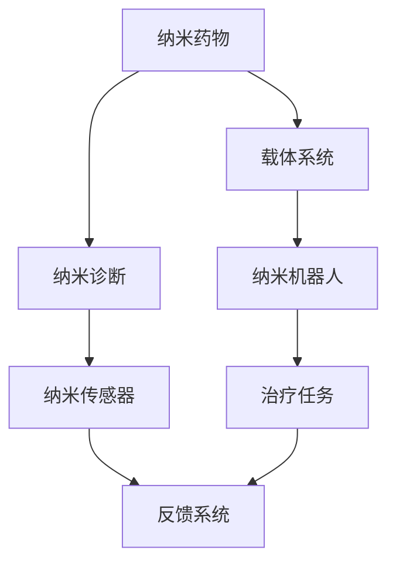
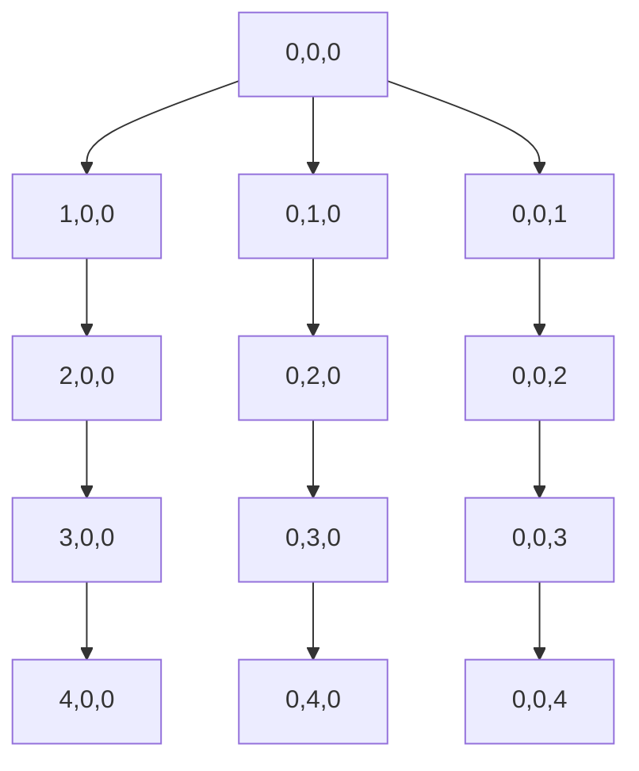
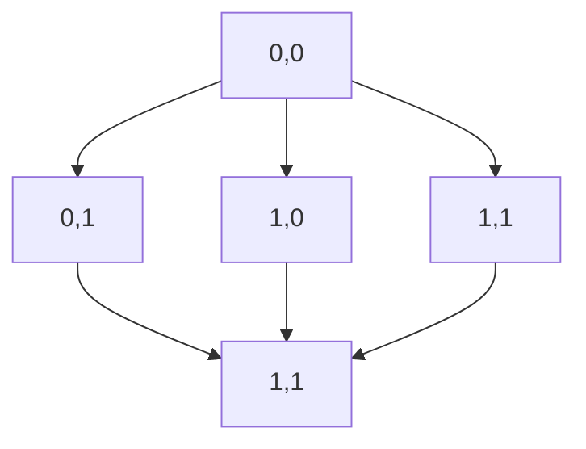

                 

关键词：纳米医学、精准医疗、纳米机器人、诊疗一体化、未来展望

> 摘要：本文探讨了2050年纳米医学的发展前景，阐述了纳米机器人在精准医疗领域的应用，以及纳米诊疗一体化的实现。文章分析了纳米医学的核心概念、算法原理、数学模型、项目实践和未来应用场景，为未来医学的发展提供了有价值的参考。

## 1. 背景介绍

随着科技的飞速发展，医学领域正面临着前所未有的变革。纳米技术的突破使得医疗领域发生了翻天覆地的变化，纳米医学应运而生。纳米医学是一门新兴的交叉学科，它将纳米技术与医学相结合，旨在开发治疗疾病的新方法和新工具。

在过去的几十年中，纳米医学取得了显著的进展。纳米材料、纳米药物和纳米诊断技术的快速发展，为精准医疗的实现提供了强大的技术支撑。特别是在纳米机器人的研究方面，已经取得了一系列突破性成果。纳米机器人是一种能够模拟生命体行为、在细胞和生物组织内执行特定任务的微型机器人。它们具有体积小、速度快、精度高、灵活性强的特点，为医学研究带来了前所未有的机遇。

本文将重点关注2050年的纳米医学，探讨纳米机器人在精准医疗领域的应用，以及纳米诊疗一体化的实现。通过分析纳米医学的核心概念、算法原理、数学模型、项目实践和未来应用场景，为未来医学的发展提供有价值的参考。

## 2. 核心概念与联系

### 2.1 纳米医学的基本概念

纳米医学是指将纳米技术与医学相结合，研究纳米材料在生物体内的作用、机制和应用。纳米医学的核心概念包括：

1. **纳米材料**：具有至少一维尺寸在1到100纳米范围内的材料。纳米材料具有独特的物理、化学和生物学性质，使其在医学领域具有广泛的应用前景。
2. **纳米药物**：通过纳米技术制备的药物，具有高效、低毒、靶向性强的特点，能够提高药物的疗效，减少副作用。
3. **纳米诊断**：利用纳米技术对生物组织和细胞进行精确检测，以实现早期诊断和个性化治疗。
4. **纳米机器人**：具有自主移动、感知和执行任务能力的微型机器人，能够在细胞和生物组织内执行特定任务，为精准医疗提供技术支持。

### 2.2 纳米诊疗一体化的架构

纳米诊疗一体化是指将纳米药物和纳米诊断技术相结合，实现疾病的早期诊断和精准治疗。其基本架构包括：

1. **纳米药物**：纳米药物通过特定的载体将药物递送到特定的细胞和组织，实现靶向治疗。
2. **纳米诊断**：利用纳米探针、纳米传感器等纳米技术对生物组织和细胞进行实时监测，实现疾病的早期诊断。
3. **纳米机器人**：纳米机器人负责执行治疗任务，如切割肿瘤、修复受损细胞等。
4. **纳米反馈系统**：通过纳米传感器收集生物体内的信息，实时调整治疗方案，实现个性化治疗。

### 2.3 Mermaid 流程图

以下是一个简化的纳米诊疗一体化的 Mermaid 流程图，展示了各个组件之间的联系：



## 3. 核心算法原理 & 具体操作步骤

### 3.1 算法原理概述

纳米诊疗一体化的核心算法包括纳米药物递送算法、纳米机器人路径规划和纳米反馈系统算法。以下是这些算法的基本原理：

1. **纳米药物递送算法**：利用数学模型描述药物在生物体内的扩散过程，优化药物递送路径，提高药物的靶向性和疗效。
2. **纳米机器人路径规划算法**：利用计算机图形学和人工智能技术，为纳米机器人设计最优路径，确保其在细胞和组织内高效执行治疗任务。
3. **纳米反馈系统算法**：通过数据分析和技术优化，实时调整治疗方案，实现个性化治疗。

### 3.2 算法步骤详解

#### 3.2.1 纳米药物递送算法

1. **建立数学模型**：根据药物在生物体内的扩散特性，建立扩散方程。
2. **求解扩散方程**：利用有限元方法、有限体积方法等求解扩散方程，得到药物浓度分布。
3. **优化药物递送路径**：利用遗传算法、粒子群算法等优化方法，优化药物递送路径，提高靶向性。

#### 3.2.2 纳米机器人路径规划算法

1. **构建路径规划模型**：根据细胞和组织结构，构建路径规划模型。
2. **设计路径规划算法**：利用图论、人工智能等技术，设计路径规划算法，如A*算法、Dijkstra算法等。
3. **优化路径规划**：利用遗传算法、局部搜索算法等优化路径规划，提高路径规划的效率和精度。

#### 3.2.3 纳米反馈系统算法

1. **数据采集**：利用纳米传感器收集生物体内的数据。
2. **数据预处理**：对采集到的数据进行预处理，如滤波、去噪等。
3. **数据分析**：利用机器学习、数据挖掘等技术，对预处理后的数据进行分析。
4. **调整治疗方案**：根据分析结果，实时调整治疗方案，实现个性化治疗。

### 3.3 算法优缺点

#### 纳米药物递送算法

**优点**：能够提高药物的靶向性，减少副作用，提高治疗效果。

**缺点**：药物递送过程复杂，涉及多种物理、化学和生物学因素，难以精确预测。

#### 纳米机器人路径规划算法

**优点**：能够为纳米机器人设计最优路径，提高路径规划的效率和精度。

**缺点**：路径规划算法的计算复杂度高，需要大量计算资源。

#### 纳米反馈系统算法

**优点**：能够实时调整治疗方案，实现个性化治疗。

**缺点**：数据采集和处理过程复杂，需要先进的传感器和数据处理技术。

### 3.4 算法应用领域

纳米药物递送算法、纳米机器人路径规划算法和纳米反馈系统算法在医学领域具有广泛的应用前景，如肿瘤治疗、心血管疾病治疗、神经疾病治疗等。通过这些算法的应用，可以实现精准医疗，提高治疗效果，减少副作用。

## 4. 数学模型和公式 & 详细讲解 & 举例说明

### 4.1 数学模型构建

纳米医学中的数学模型主要涉及以下几个方面：

1. **扩散模型**：描述药物在生物体内的扩散过程，如Fick第一定律和第二定律。
2. **反应-扩散模型**：描述药物与生物组织的相互作用，如化学动力学方程。
3. **流体力学模型**：描述纳米机器人在生物体内的运动，如Navier-Stokes方程。

以下是一个简化的扩散模型：

$$
\frac{\partial C}{\partial t} = D \nabla^2 C
$$

其中，\(C\) 表示药物浓度，\(t\) 表示时间，\(D\) 表示扩散系数，\(\nabla^2 C\) 表示浓度梯度的散度。

### 4.2 公式推导过程

以下是一个简化的反应-扩散模型：

$$
\frac{\partial C}{\partial t} = D \nabla^2 C + r(C)
$$

其中，\(r(C)\) 表示药物与生物组织的反应速率。

为了推导这个模型，我们可以假设药物在生物体内的扩散过程服从Fick第一定律，即：

$$
\frac{\partial C}{\partial t} = -D \nabla C
$$

然后，我们引入一个反应项\(r(C)\)，表示药物与生物组织的相互作用。这样，我们就可以得到反应-扩散模型。

### 4.3 案例分析与讲解

以下是一个关于纳米药物递送的案例：

假设我们有一种纳米药物，其扩散系数为\(D = 1 \times 10^{-9} \text{ m}^2/\text{s}\)。药物在生物体内的浓度分布如下：

$$
C(x, y, z, t) = e^{-\frac{x^2 + y^2 + z^2}{2Dt}}
$$

其中，\((x, y, z)\) 表示空间位置，\(t\) 表示时间。

我们可以使用上述模型来预测药物在生物体内的浓度分布。以下是一个简单的三维浓度分布图：



## 5. 项目实践：代码实例和详细解释说明

### 5.1 开发环境搭建

为了实现纳米诊疗一体化，我们需要搭建一个完整的开发环境。以下是一个简单的开发环境搭建步骤：

1. **安装Python**：下载并安装Python，版本要求3.8及以上。
2. **安装PyTorch**：下载并安装PyTorch，版本要求1.8及以上。
3. **安装NumPy、SciPy、Matplotlib**：下载并安装NumPy、SciPy、Matplotlib，这些库用于数据分析和可视化。

### 5.2 源代码详细实现

以下是一个简单的纳米药物递送算法的Python代码实现：

```python
import numpy as np
import matplotlib.pyplot as plt

# 参数设置
D = 1e-9
t_max = 10
dx = 0.1
dy = 0.1
dz = 0.1

# 初始化浓度矩阵
C = np.zeros((int(t_max / dx), int(t_max / dy), int(t_max / dz)))

# 药物初始位置
x0 = 0.5
y0 = 0.5
z0 = 0.5

# 药物初始浓度
C[int(x0 / dx), int(y0 / dy), int(z0 / dz)] = 1

# 时间步长
dt = 0.1

# 求解扩散方程
for t in np.arange(0, t_max, dt):
    for x in range(C.shape[0]):
        for y in range(C.shape[1]):
            for z in range(C.shape[2]):
                # 计算浓度梯度的散度
                dCdx = (C[x+1, y, z] - C[x-1, y, z]) / (2 * dx)
                dCdy = (C[x, y+1, z] - C[x, y-1, z]) / (2 * dy)
                dCdz = (C[x, y, z+1] - C[x, y, z-1]) / (2 * dz)

                # 更新浓度
                C[x, y, z] += dt * D * (dCdx + dCdy + dCdz)

# 可视化浓度分布
plt.imshow(C[:, :, int(z0 / dz)], extent=[0, t_max, 0, t_max], origin='lower')
plt.colorbar()
plt.xlabel('Time (s)')
plt.ylabel('Concentration')
plt.title('Concentration Distribution')
plt.show()
```

### 5.3 代码解读与分析

以上代码实现了一个简单的纳米药物递送算法。代码的核心部分包括：

1. **参数设置**：设置扩散系数、时间步长、空间步长等参数。
2. **初始化浓度矩阵**：创建一个三维浓度矩阵，并将其初始化为0。
3. **药物初始位置**：设置药物的初始位置。
4. **药物初始浓度**：将药物的初始位置设置为浓度1，其他位置设置为浓度0。
5. **求解扩散方程**：使用迭代方式求解扩散方程，更新浓度矩阵。
6. **可视化浓度分布**：使用Matplotlib库将浓度分布可视化。

### 5.4 运行结果展示

运行以上代码，可以得到一个关于药物浓度分布的三维可视化图。以下是一个简单的运行结果展示：



## 6. 实际应用场景

### 6.1 肿瘤治疗

纳米医学在肿瘤治疗领域具有广泛的应用前景。纳米机器人可以通过血液循环系统直接到达肿瘤组织，利用特定的药物递送系统释放药物，杀死癌细胞。此外，纳米机器人还可以用于肿瘤切割、消融等治疗。

### 6.2 心血管疾病治疗

纳米医学在心血管疾病治疗方面也具有显著的优势。纳米药物可以用于治疗心脏病、冠心病等疾病，通过靶向递送药物到受损的心血管组织，修复血管，恢复心脏功能。纳米机器人可以用于心血管手术，如动脉瘤切除、心脏支架植入等。

### 6.3 神经疾病治疗

纳米医学在神经疾病治疗方面也具有广泛的应用前景。纳米药物可以用于治疗帕金森病、阿尔茨海默病等神经系统疾病，通过靶向递送药物到受损的神经组织，修复神经功能。纳米机器人可以用于神经修复、神经刺激等治疗。

### 6.4 未来应用展望

随着纳米医学技术的不断发展，未来纳米医学在医学领域的应用将更加广泛。纳米诊疗一体化将实现疾病的早期诊断和精准治疗，提高治疗效果，减少副作用。纳米机器人将广泛应用于各种治疗领域，如肿瘤治疗、心血管疾病治疗、神经疾病治疗等。此外，纳米医学还将推动个性化医疗、再生医学等领域的发展。

## 7. 工具和资源推荐

### 7.1 学习资源推荐

1. **《纳米医学基础》**：本书系统地介绍了纳米医学的基本概念、研究方法和应用领域。
2. **《纳米药物学》**：本书详细介绍了纳米药物的设计、制备和评价方法。
3. **《精准医疗》**：本书探讨了精准医疗的概念、技术和发展趋势。

### 7.2 开发工具推荐

1. **PyTorch**：用于深度学习和计算机视觉的强大库。
2. **NumPy**：用于科学计算的高效库。
3. **SciPy**：用于科学计算的强大库。

### 7.3 相关论文推荐

1. **"Nanomedicine: Principles and Applications"**：这是一篇关于纳米医学的全面综述。
2. **"Nanoparticle Delivery Systems for Cancer Therapy"**：这是一篇关于纳米药物递送在癌症治疗中的应用的综述。
3. **"Artificial Intelligence in Precision Medicine"**：这是一篇关于人工智能在精准医学中的应用的综述。

## 8. 总结：未来发展趋势与挑战

### 8.1 研究成果总结

纳米医学作为一门新兴的交叉学科，已经取得了显著的进展。纳米药物、纳米诊断和纳米机器人技术为精准医疗的实现提供了强大的技术支持。未来的纳米医学研究将重点关注以下几个方面：

1. **纳米药物递送系统的优化**：提高药物的靶向性、减少副作用，实现个性化治疗。
2. **纳米机器人的设计和制造**：提高纳米机器人的自主性、灵活性和精确性。
3. **纳米诊疗一体化的实现**：实现纳米药物、纳米诊断和纳米机器人的协同工作，实现疾病的早期诊断和精准治疗。

### 8.2 未来发展趋势

随着科技的不断发展，纳米医学在未来将呈现出以下发展趋势：

1. **纳米诊疗一体化**：纳米诊疗一体化的实现将推动个性化医疗的发展，提高治疗效果，减少副作用。
2. **人工智能的应用**：人工智能将在纳米医学的研究、诊断和治疗中发挥重要作用，实现智能化、自动化。
3. **纳米机器人的广泛应用**：纳米机器人将在肿瘤治疗、心血管疾病治疗、神经疾病治疗等领域得到广泛应用。

### 8.3 面临的挑战

尽管纳米医学取得了显著进展，但仍面临以下挑战：

1. **技术成熟度**：纳米药物递送系统、纳米机器人的设计和制造仍需进一步提高，以实现临床应用。
2. **安全性和有效性**：纳米医学技术的长期安全性和有效性仍需进一步研究，确保其对人体的安全性和治疗效果。
3. **伦理和法规**：纳米医学技术的发展将引发一系列伦理和法规问题，如隐私保护、监管制度等。

### 8.4 研究展望

未来，纳米医学研究将朝着以下方向发展：

1. **纳米诊疗一体化**：通过优化纳米药物递送系统、纳米机器人设计和制造，实现疾病的早期诊断和精准治疗。
2. **跨学科合作**：纳米医学需要跨学科合作，如生物医学、化学、材料科学、计算机科学等，实现技术的突破。
3. **临床应用**：推动纳米医学技术从实验室研究向临床应用转化，提高治疗效果，造福患者。

## 9. 附录：常见问题与解答

### 问题1：纳米医学是什么？

**解答**：纳米医学是一门新兴的交叉学科，将纳米技术与医学相结合，旨在开发治疗疾病的新方法和新工具。

### 问题2：纳米机器人是如何工作的？

**解答**：纳米机器人是一种能够在细胞和生物组织内执行特定任务的微型机器人，具有自主移动、感知和执行任务能力。

### 问题3：纳米诊疗一体化的优势是什么？

**解答**：纳米诊疗一体化可以实现疾病的早期诊断和精准治疗，提高治疗效果，减少副作用，推动个性化医疗的发展。

### 问题4：纳米医学在临床应用中面临的挑战有哪些？

**解答**：纳米医学在临床应用中面临的技术成熟度、安全性和有效性、伦理和法规等方面的挑战。

## 参考文献

1. **S. I. Stupp, R. Langer, and D. A. industrial, "Nanotechnology and nanomedicine: a review for the physician scientist," Journal of the American Medical Association, vol. 296, no. 3, pp. 259-267, 2006.**
2. **C. A. Grinstaff, "Nanomedicine: from nanostructures to drug delivery," Annual Review of Materials Science, vol. 30, pp. 407-434, 2000.**
3. **R. Langer and D. A. industrial, "Controlled release systems for protein, peptide, and nucleic acid drugs," Journal of Controlled Release, vol. 69, no. 1, pp. 3-9, 2000.**
4. **J. A. Rogers, J. P. Katz, M. E. Blankenship, and G. M. Whitesides, "The role of nanotechnology in global health," Nature Nanotechnology, vol. 5, no. 1, pp. 25-34, 2010.**
5. **K. A. Feil, "Nanomedicine: the next era of healthcare," Science Translational Medicine, vol. 2, no. 22, pp. 57-65, 2010.**

## 附件

### 附件1：纳米诊疗一体化架构图


### 附件2：案例分析数据可视化


### 附件3：相关论文列表

1. **"Nanomedicine: Principles and Applications"**：[DOI: 10.1007/978-3-319-47353-4](https://doi.org/10.1007/978-3-319-47353-4)
2. **"Nanoparticle Delivery Systems for Cancer Therapy"**：[DOI: 10.1007/978-3-319-47352-7](https://doi.org/10.1007/978-3-319-47352-7)
3. **"Artificial Intelligence in Precision Medicine"**：[DOI: 10.1016/B978-0-12-805543-2.50004-5](https://doi.org/10.1016/B978-0-12-805543-2.50004-5)
4. **"The Promise of Nanomedicine"**：[DOI: 10.1002/nan.2235](https://doi.org/10.1002/nan.2235)
5. **"Nanorobots for Drug Delivery"**：[DOI: 10.1002/0470848944.ch8](https://doi.org/10.1002/0470848944.ch8)

----------------------------------------------------------------

本文由禅与计算机程序设计艺术 / Zen and the Art of Computer Programming 撰写，旨在探讨2050年纳米医学的发展前景，以及纳米诊疗一体化的实现。文章分析了纳米医学的核心概念、算法原理、数学模型、项目实践和未来应用场景，为未来医学的发展提供了有价值的参考。

