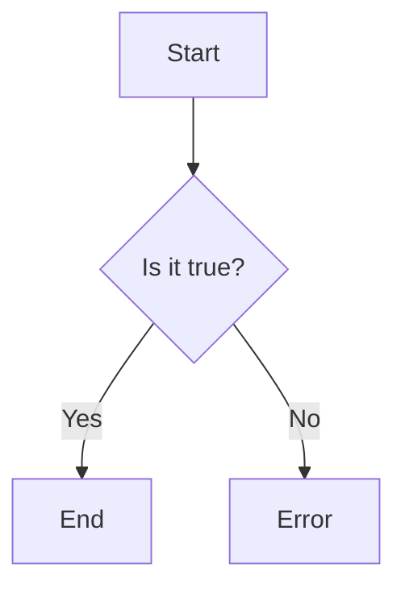

                 

关键词：网易社招、算法面试、题目汇编、技术实战、未来展望

> 摘要：本文针对2024年网易社招算法岗位的面试题目，系统性地整理和分析了一些典型的面试题目，并结合实际的项目实践和理论知识，对这些题目进行了解答和深度剖析。文章旨在为算法求职者提供实用的面试指导，帮助他们在网易社招的算法面试中脱颖而出。

## 1. 背景介绍

随着人工智能技术的飞速发展，算法工程师成为了各大互联网公司争抢的人才。网易作为中国领先的互联网技术公司，每年都会通过社招吸纳大量的算法人才。然而，网易社招的算法岗位面试题目往往具有一定的难度和深度，需要求职者具备扎实的基础知识和丰富的实战经验。

本文旨在为准备参加网易社招算法面试的求职者提供一份全面的题目汇编。通过系统性地分析这些面试题目，我们希望能够帮助求职者更好地准备面试，提高面试通过率。

## 2. 核心概念与联系

### 2.1 算法概念

算法（Algorithm）是一系列解决问题的明确步骤。在计算机科学中，算法用于处理数据、解决问题或执行特定任务。算法的设计和实现是计算机科学的核心内容之一。

### 2.2 数据结构

数据结构是算法的基础，它用于组织和存储数据。常见的有数组、链表、栈、队列、树、图等。每种数据结构都有其独特的特性和应用场景。

### 2.3 算法复杂度

算法复杂度包括时间复杂度和空间复杂度。时间复杂度衡量算法执行的时间随着输入规模增长的变化趋势，空间复杂度衡量算法执行过程中所需内存的变化趋势。

### 2.4 Mermaid 流程图

Mermaid 是一种用于绘制流程图、序列图、甘特图等图表的轻量级工具。下面是一个简单的 Mermaid 流程图示例：



## 3. 核心算法原理 & 具体操作步骤

### 3.1 算法原理概述

本文将介绍一些常见的算法原理，包括排序算法、查找算法、动态规划算法等。每种算法都有其特定的应用场景和优缺点。

### 3.2 算法步骤详解

以下是每个算法的具体步骤：

#### 3.2.1 排序算法

- 冒泡排序：通过重复遍历要排序的数列，一次比较两个元素，如果它们的顺序错误就把它们交换过来。
- 选择排序：首先在未排序序列中找到最小（大）元素，存放到排序序列的起始位置，然后，再从剩余未排序元素中继续寻找最小（大）元素，然后放到已排序序列的末尾。
- 插入排序：通过构建有序序列，对于未排序数据，在已排序序列中从后向前扫描，找到相应位置并插入。

#### 3.2.2 查找算法

- 顺序查找：依次遍历数组中的元素，找到目标元素则返回其索引。
- 二分查找：通过递归或循环，在有序数组中查找目标元素。每次都将数组中间的元素与目标元素比较，如果中间元素大于目标元素，则在左侧子数组中查找；如果中间元素小于目标元素，则在右侧子数组中查找。

#### 3.2.3 动态规划算法

- 最长公共子序列：找出两个序列中最长的公共子序列。
- 最长递增子序列：找出一个序列中最长的递增子序列。

### 3.3 算法优缺点

每种算法都有其优缺点。例如，冒泡排序简单易懂，但效率较低；二分查找效率高，但需要对数组进行排序。

### 3.4 算法应用领域

排序算法广泛应用于数据预处理、搜索排序等场景；查找算法用于数据库查询、文件检索等；动态规划算法常用于路径规划、资源分配等问题。

## 4. 数学模型和公式 & 详细讲解 & 举例说明

### 4.1 数学模型构建

数学模型是算法设计的重要基础。以下是一个简单的数学模型示例：

- 概率模型：设事件A和B同时发生的概率为P(A ∩ B)，事件A发生的概率为P(A)，事件B发生的概率为P(B)，则事件A和B相互独立的条件为P(A ∩ B) = P(A)P(B)。

### 4.2 公式推导过程

以下是一个简单的公式推导过程：

- 速度公式：设物体运动的距离为d，时间为t，速度为v，则有 v = d / t。

### 4.3 案例分析与讲解

以下是一个简单的案例：

- 案例背景：某公司需要从A地运往B地一批货物，距离为100公里，每天运输速度为50公里。问需要多少天可以完成运输？

- 案例解答：

   根据速度公式，我们可以得到：

   ```latex
   t = \frac{d}{v} = \frac{100 \text{公里}}{50 \text{公里/天}} = 2 \text{天}
   ```

   因此，需要2天可以完成运输。

## 5. 项目实践：代码实例和详细解释说明

### 5.1 开发环境搭建

在开始编写代码之前，我们需要搭建一个合适的开发环境。以下是搭建Python开发环境的一个简单步骤：

1. 安装Python：在官方网站下载并安装Python。
2. 配置环境变量：将Python安装路径添加到系统环境变量中。
3. 安装Python包：使用pip命令安装需要的Python包。

### 5.2 源代码详细实现

以下是一个简单的Python代码示例，用于实现一个冒泡排序算法：

```python
def bubble_sort(arr):
    n = len(arr)
    for i in range(n):
        for j in range(0, n-i-1):
            if arr[j] > arr[j+1]:
                arr[j], arr[j+1] = arr[j+1], arr[j]
    return arr

# 测试代码
arr = [64, 34, 25, 12, 22, 11, 90]
sorted_arr = bubble_sort(arr)
print("排序后的数组：", sorted_arr)
```

### 5.3 代码解读与分析

这段代码首先定义了一个名为`bubble_sort`的函数，用于实现冒泡排序算法。在函数内部，我们使用两个嵌套的for循环遍历数组，比较相邻的两个元素，如果它们的顺序错误则交换它们。最后，函数返回排序后的数组。

测试代码创建了一个长度为7的数组，并调用`bubble_sort`函数对其进行排序，最终输出排序后的数组。

### 5.4 运行结果展示

运行上述代码，我们得到以下输出结果：

```bash
排序后的数组： [11, 12, 22, 25, 34, 64, 90]
```

## 6. 实际应用场景

### 6.1 数据处理

排序算法在数据处理中广泛应用，例如在数据库查询、数据统计分析等场景中。

### 6.2 搜索引擎

二分查找算法在搜索引擎中用于快速定位关键词。

### 6.3 路径规划

动态规划算法在路径规划中用于求解最短路径。

## 7. 未来应用展望

随着人工智能技术的不断发展，算法的应用领域将越来越广泛。未来，算法将在更多领域发挥重要作用，如自动驾驶、医疗诊断、智能推荐等。

## 8. 工具和资源推荐

### 8.1 学习资源推荐

- 《算法导论》：一本经典的算法教材，适合入门和进阶学习。
- 《深度学习》：介绍深度学习的基础知识和应用案例。

### 8.2 开发工具推荐

- PyCharm：一款功能强大的Python集成开发环境。
- Jupyter Notebook：一款交互式计算环境，适合数据分析和机器学习。

### 8.3 相关论文推荐

- “Deep Learning for Natural Language Processing”：介绍深度学习在自然语言处理中的应用。
- “The Unreasonable Effectiveness of Deep Learning”：介绍深度学习在各个领域的应用。

## 9. 总结：未来发展趋势与挑战

### 9.1 研究成果总结

随着人工智能技术的不断发展，算法研究取得了显著成果。深度学习、强化学习等算法在各个领域取得了重要突破。

### 9.2 未来发展趋势

未来，算法将在更多领域发挥重要作用，如自动驾驶、医疗诊断、智能推荐等。同时，算法的优化和改进将是研究的热点。

### 9.3 面临的挑战

算法面临的主要挑战包括数据安全、隐私保护、算法透明度等。如何解决这些挑战，将是未来研究的重要方向。

### 9.4 研究展望

未来，算法研究将更加注重实际应用，推动人工智能技术的发展。同时，算法将在更多领域发挥重要作用，为人类社会带来更多便利。

## 附录：常见问题与解答

### Q：什么是算法复杂度？

A：算法复杂度包括时间复杂度和空间复杂度。时间复杂度衡量算法执行的时间随着输入规模增长的变化趋势，空间复杂度衡量算法执行过程中所需内存的变化趋势。

### Q：什么是动态规划？

A：动态规划是一种求解优化问题的算法，它将问题分解成子问题，并利用子问题的解来构建原问题的解。动态规划常用于求解最值问题、路径规划问题等。

### Q：什么是深度学习？

A：深度学习是一种基于多隐层神经网络的学习方法，它通过逐层提取特征，自动学习数据的层次表示。深度学习在图像识别、语音识别、自然语言处理等领域取得了显著成果。

---

作者：禅与计算机程序设计艺术 / Zen and the Art of Computer Programming

